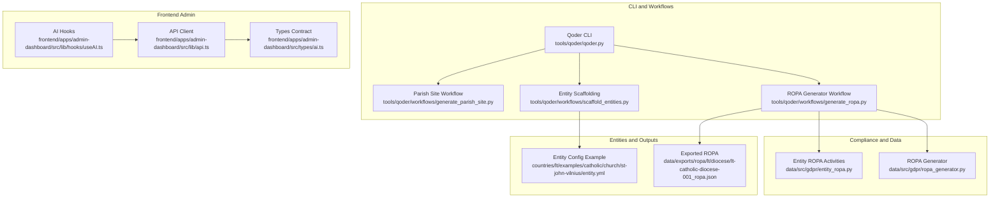
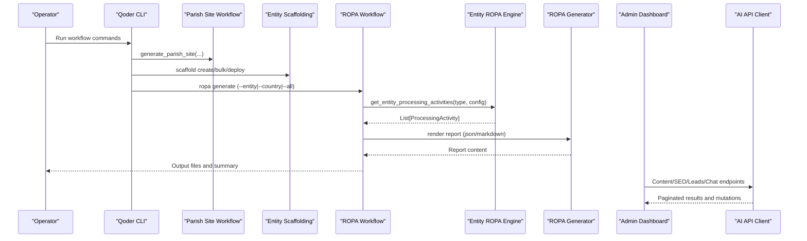
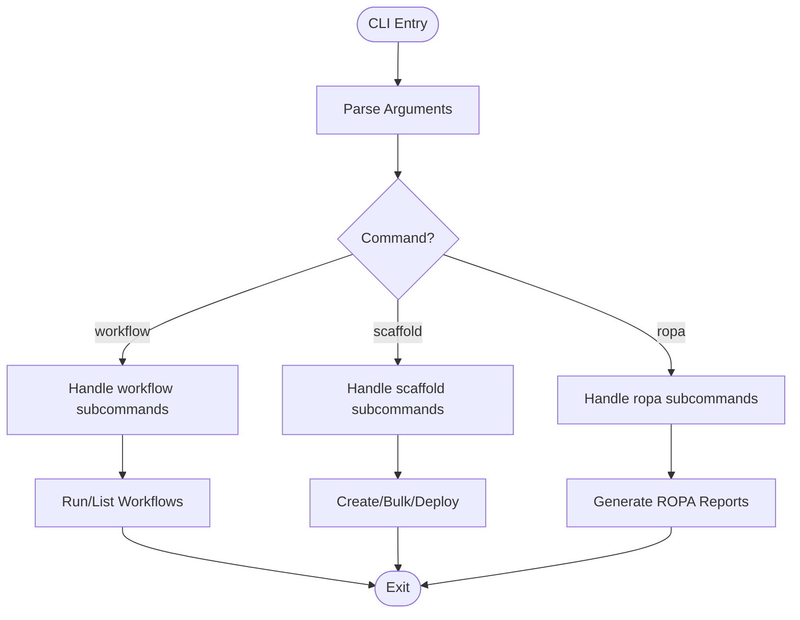
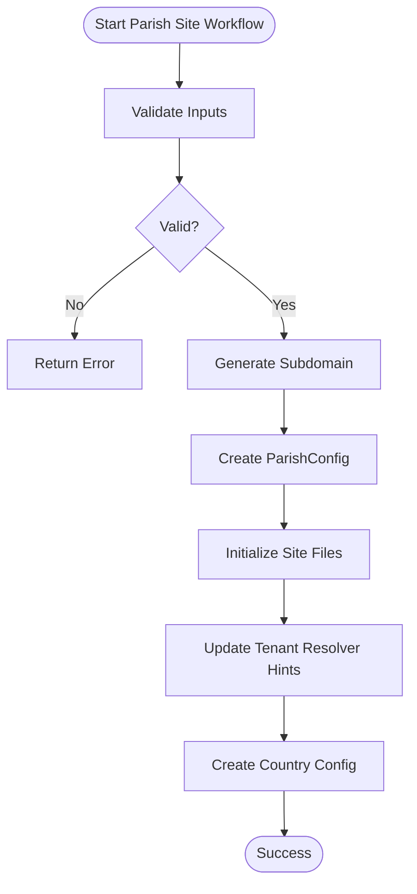
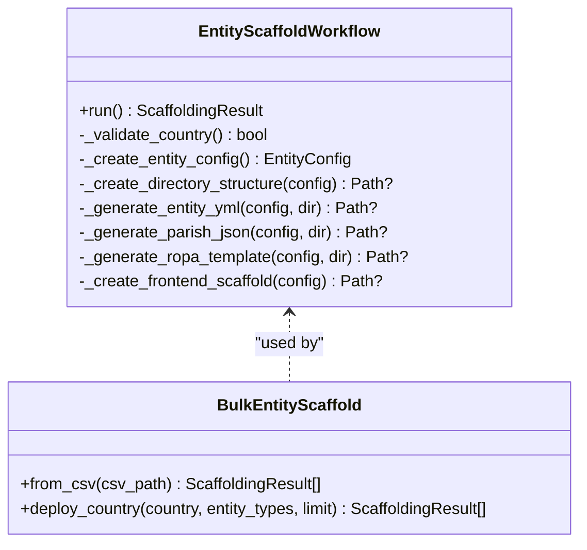
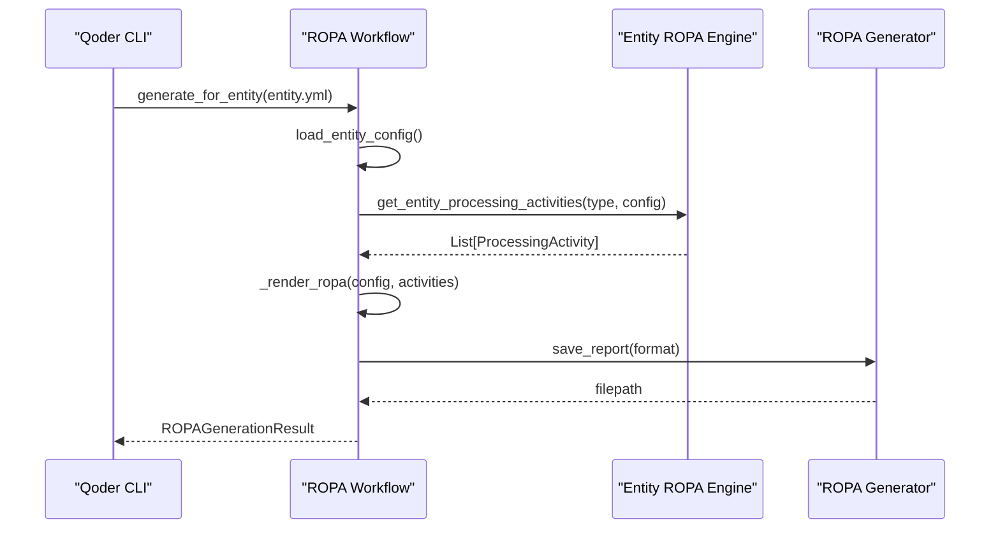
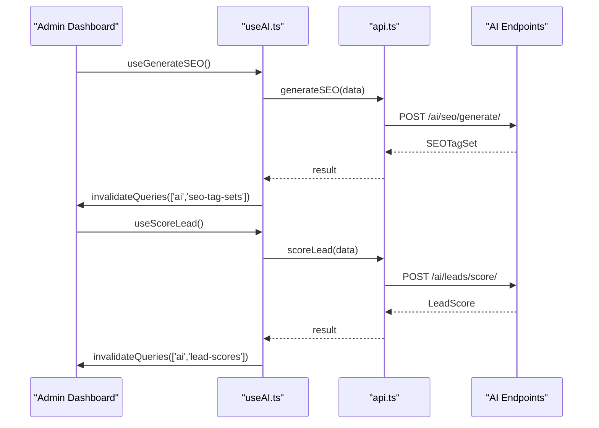
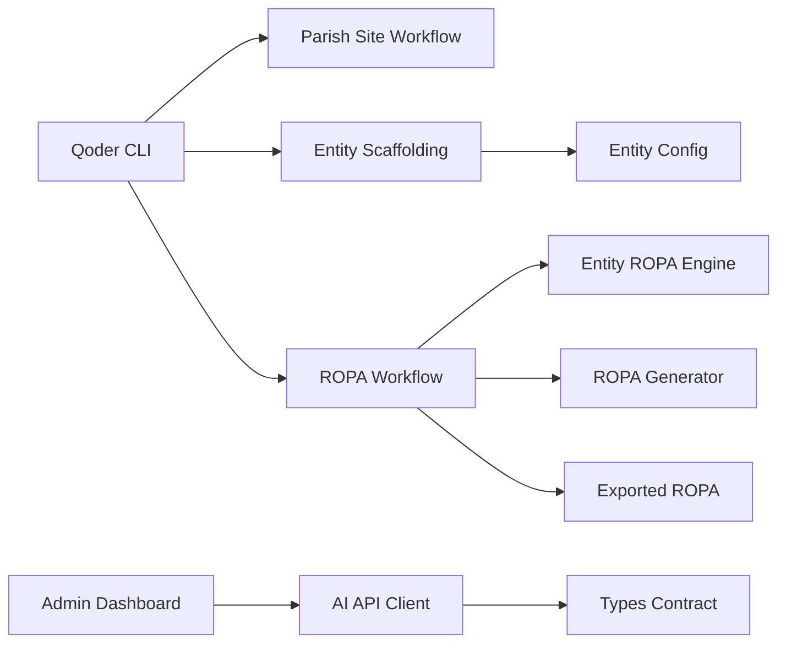

# AI Services

<cite>
**Referenced Files in This Document**
- [qoder.py](file://tools/qoder/qoder.py)
- [generate_parish_site.py](file://tools/qoder/workflows/generate_parish_site.py)
- [scaffold_entities.py](file://tools/qoder/workflows/scaffold_entities.py)
- [generate_ropa.py](file://tools/qoder/workflows/generate_ropa.py)
- [entity_ropa.py](file://data/src/gdpr/entity_ropa.py)
- [ropa_generator.py](file://data/src/gdpr/ropa_generator.py)
- [useAI.ts](file://frontend/apps/admin-dashboard/src/lib/hooks/useAI.ts)
- [api.ts](file://frontend/apps/admin-dashboard/src/lib/api.ts)
- [ai.ts](file://frontend/apps/admin-dashboard/src/types/ai.ts)
- [entity.yml](file://countries/lt/examples/catholic/church/st-john-vilnius/entity.yml)
- [lt-catholic-diocese-001_ropa.json](file://data/exports/ropa/lt/diocese/lt-catholic-diocese-001_ropa.json)
</cite>

## Table of Contents
1. Introduction
2. Project Structure
3. Core Components
4. Architecture Overview
5. Detailed Component Analysis
6. Dependency Analysis
7. Performance Considerations
8. Troubleshooting Guide
9. Conclusion
10. Appendices

## Introduction
This document explains the AI-powered services in the JOL-HUB platform with a focus on:
- Qoder tooling for automated content generation, ROPA (Record of Processing Activities) generation, and entity scaffolding workflows
- The AI orchestration layer that coordinates tenant website content generation, SEO optimization, lead scoring models, and chatbot functionality
- Integration points with external AI providers, prompt engineering strategies, content quality assurance processes, and performance monitoring
- Practical examples for automating parish website creation, generating compliance documentation, and optimizing content for search engines

The goal is to provide both technical depth and accessible guidance for teams building or operating AI features across tenants.

## Project Structure
JOL-HUB organizes AI-related capabilities across several areas:
- CLI and automation tooling under tools/qoder for workflow orchestration
- GDPR and compliance utilities under data/src/gdpr for ROPA generation and entity-specific processing activities
- Frontend admin dashboard hooks and API contracts under frontend/apps/admin-dashboard for orchestrating AI features via REST endpoints
- Country-scoped entity configurations under countries for templates and example entities used by automation

**Diagram sources**
- [qoder.py:26-138](file://tools/qoder/qoder.py#L26-L138)
- [generate_parish_site.py:36-121](file://tools/qoder/workflows/generate_parish_site.py#L36-L121)
- [scaffold_entities.py:197-382](file://tools/qoder/workflows/scaffold_entities.py#L197-L382)
- [generate_ropa.py:192-497](file://tools/qoder/workflows/generate_ropa.py#L192-L497)
- [entity_ropa.py:39-65](file://data/src/gdpr/entity_ropa.py#L39-L65)
- [ropa_generator.py:103-169](file://data/src/gdpr/ropa_generator.py#L103-L169)
- [useAI.ts:24-33](file://frontend/apps/admin-dashboard/src/lib/hooks/useAI.ts#L24-L33)
- [api.ts:400-475](file://frontend/apps/admin-dashboard/src/lib/api.ts#L400-L475)
- [ai.ts:25-94](file://frontend/apps/admin-dashboard/src/types/ai.ts#L25-L94)
- [entity.yml:1-97](file://countries/lt/examples/catholic/church/st-john-vilnius/entity.yml#L1-L97)
- [lt-catholic-diocese-001_ropa.json:1-100](file://data/exports/ropa/lt/diocese/lt-catholic-diocese-001_ropa.json#L1-L100)

**Section sources**
- [qoder.py:26-138](file://tools/qoder/qoder.py#L26-L138)
- [generate_parish_site.py:36-121](file://tools/qoder/workflows/generate_parish_site.py#L36-L121)
- [scaffold_entities.py:197-382](file://tools/qoder/workflows/scaffold_entities.py#L197-L382)
- [generate_ropa.py:192-497](file://tools/qoder/workflows/generate_ropa.py#L192-L497)
- [entity_ropa.py:39-65](file://data/src/gdpr/entity_ropa.py#L39-L65)
- [ropa_generator.py:103-169](file://data/src/gdpr/ropa_generator.py#L103-L169)
- [useAI.ts:24-33](file://frontend/apps/admin-dashboard/src/lib/hooks/useAI.ts#L24-L33)
- [api.ts:400-475](file://frontend/apps/admin-dashboard/src/lib/api.ts#L400-L475)
- [ai.ts:25-94](file://frontend/apps/admin-dashboard/src/types/ai.ts#L25-L94)
- [entity.yml:1-97](file://countries/lt/examples/catholic/church/st-john-vilnius/entity.yml#L1-L97)
- [lt-catholic-diocese-001_ropa.json:1-100](file://data/exports/ropa/lt/diocese/lt-catholic-diocese-001_ropa.json#L1-L100)

## Core Components
- Qoder CLI: Central entry point for running workflows including parish site generation, entity scaffolding, and ROPA generation. It exposes subcommands and parameters for dry-run, verbose output, and country scoping.
- Parish Site Generation Workflow: Validates inputs, generates subdomains, creates site files, updates tenant resolver hints, and writes country-specific configuration.
- Entity Scaffolding Workflow: Creates multi-entity websites at scale with country-specific defaults, canonical jurisdiction handling, feature sets, and optional frontend scaffolding.
- ROPA Generation Workflow: Parses entity configurations, resolves entity types, retrieves entity-specific processing activities, renders JSON or Markdown reports, and supports single, country-wide, and all-countries generation.
- Compliance Utilities: Provide standardized ProcessingActivity structures and entity-specific activity definitions aligned with GDPR and Canon Law requirements.
- Frontend AI Orchestration: Defines typed requests/responses and provides hooks for content generation, SEO tagging, lead scoring, and chatbot sessions, calling backend endpoints exposed by the platform’s AI layer.

**Section sources**
- [qoder.py:26-138](file://tools/qoder/qoder.py#L26-L138)
- [generate_parish_site.py:36-121](file://tools/qoder/workflows/generate_parish_site.py#L36-L121)
- [scaffold_entities.py:197-382](file://tools/qoder/workflows/scaffold_entities.py#L197-L382)
- [generate_ropa.py:192-497](file://tools/qoder/workflows/generate_ropa.py#L192-L497)
- [entity_ropa.py:39-65](file://data/src/gdpr/entity_ropa.py#L39-L65)
- [ropa_generator.py:103-169](file://data/src/gdpr/ropa_generator.py#L103-L169)
- [useAI.ts:24-33](file://frontend/apps/admin-dashboard/src/lib/hooks/useAI.ts#L24-L33)
- [api.ts:400-475](file://frontend/apps/admin-dashboard/src/lib/api.ts#L400-L475)
- [ai.ts:25-94](file://frontend/apps/admin-dashboard/src/types/ai.ts#L25-L94)

## Architecture Overview
The AI orchestration spans CLI-driven automation and frontend hooks that call backend endpoints. Workflows operate on entity configurations and produce outputs such as site scaffolds and compliance documents. The frontend uses typed contracts to interact with AI services for content generation, SEO, lead scoring, and chatbot sessions.

**Diagram sources**
- [qoder.py:121-138](file://tools/qoder/qoder.py#L121-L138)
- [generate_parish_site.py:66-121](file://tools/qoder/workflows/generate_parish_site.py#L66-L121)
- [scaffold_entities.py:313-382](file://tools/qoder/workflows/scaffold_entities.py#L313-L382)
- [generate_ropa.py:226-297](file://tools/qoder/workflows/generate_ropa.py#L226-L297)
- [entity_ropa.py:39-65](file://data/src/gdpr/entity_ropa.py#L39-L65)
- [ropa_generator.py:121-169](file://data/src/gdpr/ropa_generator.py#L121-L169)
- [api.ts:400-475](file://frontend/apps/admin-dashboard/src/lib/api.ts#L400-L475)

## Detailed Component Analysis

### Qoder CLI
- Responsibilities: Parse arguments, route to workflow handlers, support dry-run and verbose modes, and present summaries for batch operations.
- Key behaviors:
  - Subcommands: workflow, scaffold, ropa
  - Parameters include country codes, entity types, formats, and output directories
  - Aggregates success counts and total activities for reporting

**Diagram sources**
- [qoder.py:26-138](file://tools/qoder/qoder.py#L26-L138)
- [qoder.py:140-312](file://tools/qoder/qoder.py#L140-L312)

**Section sources**
- [qoder.py:26-138](file://tools/qoder/qoder.py#L26-L138)
- [qoder.py:140-312](file://tools/qoder/qoder.py#L140-L312)

### Parish Site Generation Workflow
- Responsibilities: Validate inputs, generate unique subdomains, initialize site files, update tenant resolver hints, and write country-specific configuration.
- Validation includes allowed country codes, name length, and subdomain format.
- Outputs include Next.js page and layout files and a parish.json configuration.

**Diagram sources**
- [generate_parish_site.py:66-121](file://tools/qoder/workflows/generate_parish_site.py#L66-L121)
- [generate_parish_site.py:123-191](file://tools/qoder/workflows/generate_parish_site.py#L123-L191)
- [generate_parish_site.py:210-236](file://tools/qoder/workflows/generate_parish_site.py#L210-L236)
- [generate_parish_site.py:407-455](file://tools/qoder/workflows/generate_parish_site.py#L407-L455)
- [generate_parish_site.py:457-495](file://tools/qoder/workflows/generate_parish_site.py#L457-L495)

**Section sources**
- [generate_parish_site.py:66-121](file://tools/qoder/workflows/generate_parish_site.py#L66-L121)
- [generate_parish_site.py:123-191](file://tools/qoder/workflows/generate_parish_site.py#L123-L191)
- [generate_parish_site.py:210-236](file://tools/qoder/workflows/generate_parish_site.py#L210-L236)
- [generate_parish_site.py:407-455](file://tools/qoder/workflows/generate_parish_site.py#L407-L455)
- [generate_parish_site.py:457-495](file://tools/qoder/workflows/generate_parish_site.py#L457-L495)

### Entity Scaffolding Workflow
- Responsibilities: Create entity websites at scale with country-specific defaults, canonical jurisdictions, feature sets, and optional frontend scaffolding.
- Supports single entity creation, CSV-based bulk operations, and country-wide deployment.
- Generates entity.yml, parish.json, and ROPA templates; logs created files and errors.

**Diagram sources**
- [scaffold_entities.py:197-382](file://tools/qoder/workflows/scaffold_entities.py#L197-L382)
- [scaffold_entities.py:753-800](file://tools/qoder/workflows/scaffold_entities.py#L753-L800)

**Section sources**
- [scaffold_entities.py:197-382](file://tools/qoder/workflows/scaffold_entities.py#L197-L382)
- [scaffold_entities.py:753-800](file://tools/qoder/workflows/scaffold_entities.py#L753-L800)

### ROPA Generation Workflow
- Responsibilities: Parse entity.yml, resolve entity type, retrieve entity-specific processing activities, render reports in JSON or Markdown, and support single, country-wide, and all-countries generation.
- Integrates with entity_ropa module for specialized activities and falls back to basic activities when unavailable.

**Diagram sources**
- [generate_ropa.py:226-297](file://tools/qoder/workflows/generate_ropa.py#L226-L297)
- [generate_ropa.py:356-453](file://tools/qoder/workflows/generate_ropa.py#L356-L453)
- [entity_ropa.py:39-65](file://data/src/gdpr/entity_ropa.py#L39-L65)
- [ropa_generator.py:121-169](file://data/src/gdpr/ropa_generator.py#L121-L169)

**Section sources**
- [generate_ropa.py:226-297](file://tools/qoder/workflows/generate_ropa.py#L226-L297)
- [generate_ropa.py:356-453](file://tools/qoder/workflows/generate_ropa.py#L356-L453)
- [entity_ropa.py:39-65](file://data/src/gdpr/entity_ropa.py#L39-L65)
- [ropa_generator.py:121-169](file://data/src/gdpr/ropa_generator.py#L121-L169)

### Frontend AI Orchestration
- Responsibilities: Provide typed hooks and API clients for content generation, SEO tagging, lead scoring, and chatbot sessions.
- Normalizes DRF pagination into consistent shapes and invalidates queries on successful mutations.
- Defines contracts for templates, generated content, SEO tag sets, lead scores, and chat sessions.

**Diagram sources**
- [useAI.ts:120-146](file://frontend/apps/admin-dashboard/src/lib/hooks/useAI.ts#L120-L146)
- [useAI.ts:164-204](file://frontend/apps/admin-dashboard/src/lib/hooks/useAI.ts#L164-L204)
- [api.ts:400-475](file://frontend/apps/admin-dashboard/src/lib/api.ts#L400-L475)
- [ai.ts:25-94](file://frontend/apps/admin-dashboard/src/types/ai.ts#L25-L94)

**Section sources**
- [useAI.ts:120-146](file://frontend/apps/admin-dashboard/src/lib/hooks/useAI.ts#L120-L146)
- [useAI.ts:164-204](file://frontend/apps/admin-dashboard/src/lib/hooks/useAI.ts#L164-L204)
- [api.ts:400-475](file://frontend/apps/admin-dashboard/src/lib/api.ts#L400-L475)
- [ai.ts:25-94](file://frontend/apps/admin-dashboard/src/types/ai.ts#L25-L94)

## Dependency Analysis
- CLI depends on workflow modules for parish site generation, entity scaffolding, and ROPA generation.
- ROPA workflow depends on entity_ropa for specialized activities and ropa_generator for standard structures and rendering.
- Frontend hooks depend on api client functions which map to backend endpoints defined by the AI layer.
- Entity configurations drive behavior in scaffolding and ROPA generation, ensuring country-specific and denomination-specific rules are applied consistently.

**Diagram sources**
- [qoder.py:26-138](file://tools/qoder/qoder.py#L26-L138)
- [generate_parish_site.py:36-121](file://tools/qoder/workflows/generate_parish_site.py#L36-L121)
- [scaffold_entities.py:197-382](file://tools/qoder/workflows/scaffold_entities.py#L197-L382)
- [generate_ropa.py:192-497](file://tools/qoder/workflows/generate_ropa.py#L192-L497)
- [entity_ropa.py:39-65](file://data/src/gdpr/entity_ropa.py#L39-L65)
- [ropa_generator.py:103-169](file://data/src/gdpr/ropa_generator.py#L103-L169)
- [useAI.ts:24-33](file://frontend/apps/admin-dashboard/src/lib/hooks/useAI.ts#L24-L33)
- [api.ts:400-475](file://frontend/apps/admin-dashboard/src/lib/api.ts#L400-L475)
- [ai.ts:25-94](file://frontend/apps/admin-dashboard/src/types/ai.ts#L25-L94)
- [entity.yml:1-97](file://countries/lt/examples/catholic/church/st-john-vilnius/entity.yml#L1-L97)
- [lt-catholic-diocese-001_ropa.json:1-100](file://data/exports/ropa/lt/diocese/lt-catholic-diocese-001_ropa.json#L1-L100)

**Section sources**
- [qoder.py:26-138](file://tools/qoder/qoder.py#L26-L138)
- [generate_parish_site.py:36-121](file://tools/qoder/workflows/generate_parish_site.py#L36-L121)
- [scaffold_entities.py:197-382](file://tools/qoder/workflows/scaffold_entities.py#L197-L382)
- [generate_ropa.py:192-497](file://tools/qoder/workflows/generate_ropa.py#L192-L497)
- [entity_ropa.py:39-65](file://data/src/gdpr/entity_ropa.py#L39-L65)
- [ropa_generator.py:103-169](file://data/src/gdpr/ropa_generator.py#L103-L169)
- [useAI.ts:24-33](file://frontend/apps/admin-dashboard/src/lib/hooks/useAI.ts#L24-L33)
- [api.ts:400-475](file://frontend/apps/admin-dashboard/src/lib/api.ts#L400-L475)
- [ai.ts:25-94](file://frontend/apps/admin-dashboard/src/types/ai.ts#L25-L94)
- [entity.yml:1-97](file://countries/lt/examples/catholic/church/st-john-vilnius/entity.yml#L1-L97)
- [lt-catholic-diocese-001_ropa.json:1-100](file://data/exports/ropa/lt/diocese/lt-catholic-diocese-001_ropa.json#L1-L100)

## Performance Considerations
- Batch operations: Use bulk scaffolding and country-wide ROPA generation to minimize repeated I/O and parsing overhead.
- Dry-run mode: Validate workflows without side effects to reduce risk and speed up iteration.
- Caching and pagination: Frontend hooks cache templates and lists with appropriate stale times; ensure backend endpoints paginate large datasets efficiently.
- Filesystem operations: Minimize redundant directory checks and writes; leverage parent creation and existence checks to avoid errors.
- External provider calls: When integrating AI providers, implement retries, timeouts, and circuit breakers to protect responsiveness.

[No sources needed since this section provides general guidance]

## Troubleshooting Guide
- Invalid country code or entity type: Ensure codes match supported values and entity types align with templates and aliases.
- Subdomain conflicts: Check existing resolver entries and directories to avoid collisions; the parish site workflow includes uniqueness logic.
- Missing entity.yml or malformed YAML: Verify file paths and structure; the ROPA workflow includes fallback parsing and error reporting.
- Frontend hook failures: Confirm endpoint availability and response shape; hooks normalize DRF pagination and throw descriptive errors on failure.
- ROPA output not written: Check permissions and output directory; the generator falls back to temp directories if default paths are unwritable.

**Section sources**
- [generate_parish_site.py:123-191](file://tools/qoder/workflows/generate_parish_site.py#L123-L191)
- [generate_ropa.py:226-297](file://tools/qoder/workflows/generate_ropa.py#L226-L297)
- [ropa_generator.py:103-169](file://data/src/gdpr/ropa_generator.py#L103-L169)
- [useAI.ts:120-146](file://frontend/apps/admin-dashboard/src/lib/hooks/useAI.ts#L120-L146)
- [api.ts:400-475](file://frontend/apps/admin-dashboard/src/lib/api.ts#L400-L475)

## Conclusion
JOL-HUB’s AI services combine robust CLI-driven automation with a structured frontend orchestration layer. Qoder workflows enable scalable entity scaffolding and compliance documentation generation, while the admin dashboard provides typed interfaces for content generation, SEO optimization, lead scoring, and chatbot interactions. By leveraging entity configurations and compliance utilities, the platform ensures consistent, auditable, and region-aware outputs across tenants.

[No sources needed since this section summarizes without analyzing specific files]

## Appendices

### Practical Examples

- Automating parish website creation:
  - Use the parish site generation workflow to validate inputs, generate subdomains, create site files, and write country-specific configuration.
  - Reference the workflow steps and outputs for next actions like customizing content and starting the development server.

  **Section sources**
  - [generate_parish_site.py:66-121](file://tools/qoder/workflows/generate_parish_site.py#L66-L121)
  - [generate_parish_site.py:210-236](file://tools/qoder/workflows/generate_parish_site.py#L210-L236)
  - [generate_parish_site.py:457-495](file://tools/qoder/workflows/generate_parish_site.py#L457-L495)

- Generating compliance documentation:
  - Use the ROPA workflow to parse entity.yml, retrieve entity-specific processing activities, and render JSON or Markdown reports.
  - Leverage country-wide or all-countries generation for comprehensive compliance coverage.

  **Section sources**
  - [generate_ropa.py:226-297](file://tools/qoder/workflows/generate_ropa.py#L226-L297)
  - [generate_ropa.py:455-497](file://tools/qoder/workflows/generate_ropa.py#L455-L497)
  - [entity_ropa.py:39-65](file://data/src/gdpr/entity_ropa.py#L39-L65)
  - [lt-catholic-diocese-001_ropa.json:1-100](file://data/exports/ropa/lt/diocese/lt-catholic-diocese-001_ropa.json#L1-L100)

- Optimizing content for search engines:
  - Use the frontend hooks to generate SEO tag sets and apply them to pages via the AI API client.
  - Monitor results through paginated listings and invalidate caches on successful applications.

  **Section sources**
  - [useAI.ts:120-146](file://frontend/apps/admin-dashboard/src/lib/hooks/useAI.ts#L120-L146)
  - [api.ts:400-416](file://frontend/apps/admin-dashboard/src/lib/api.ts#L400-L416)
  - [ai.ts:59-73](file://frontend/apps/admin-dashboard/src/types/ai.ts#L59-L73)