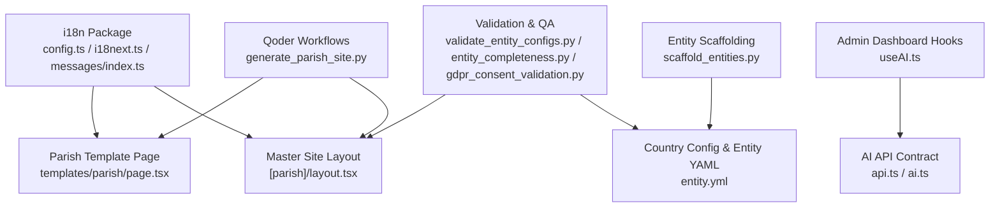
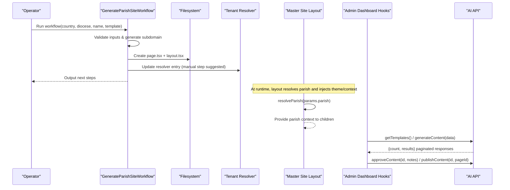
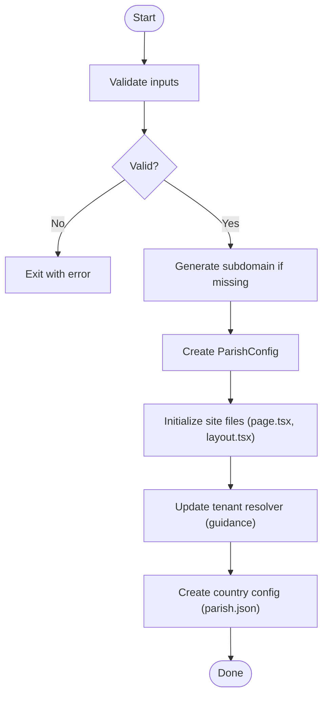
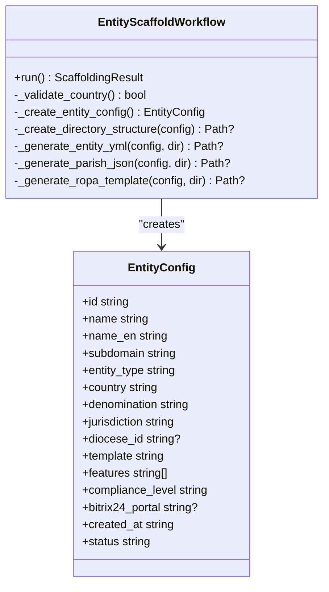
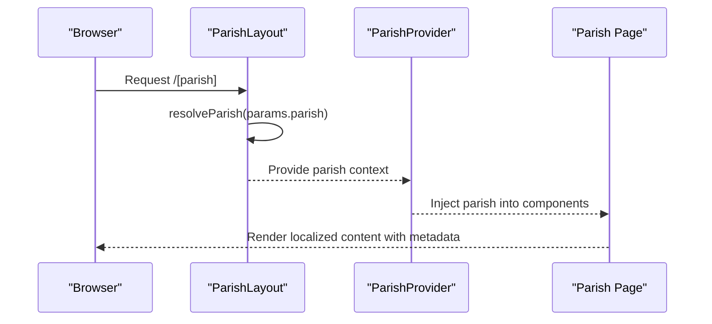
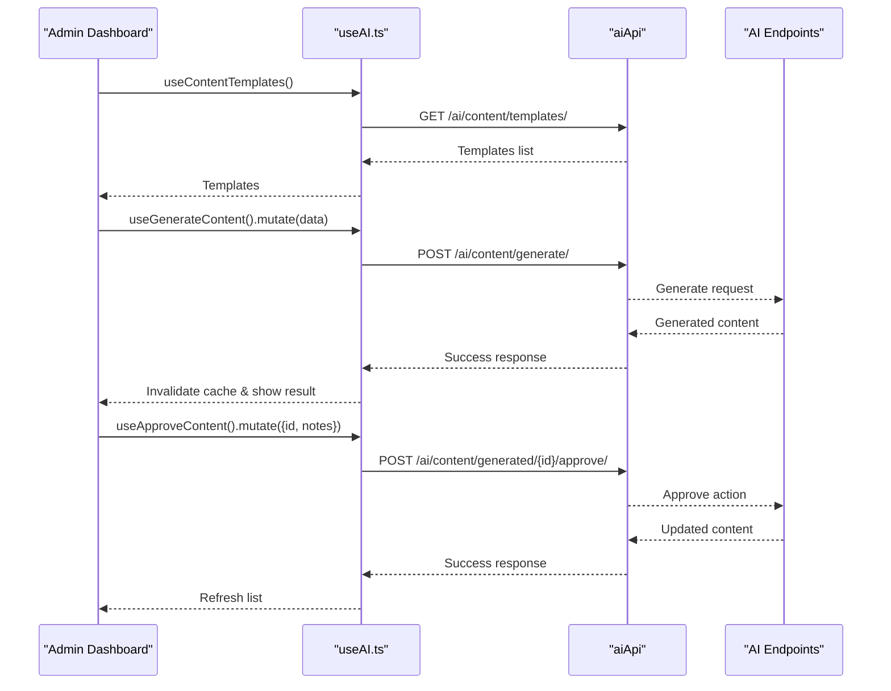
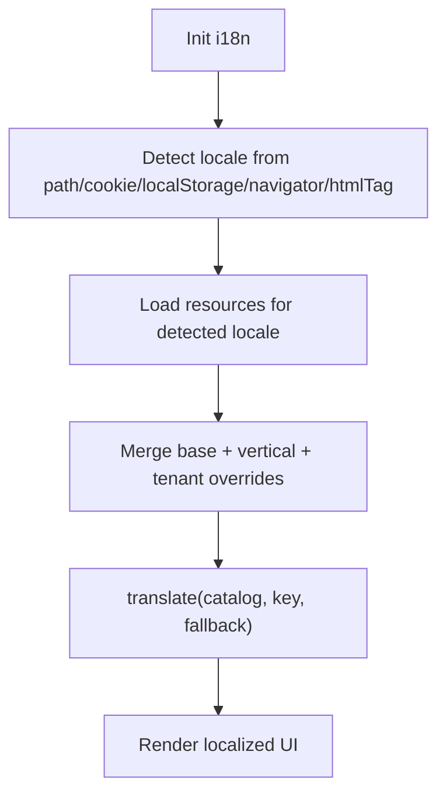
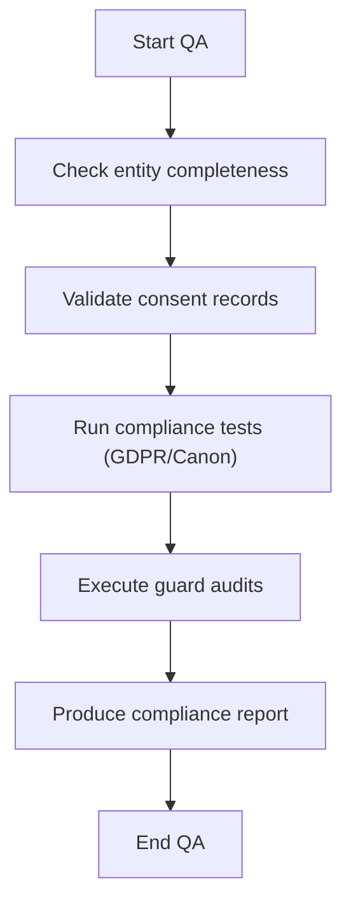
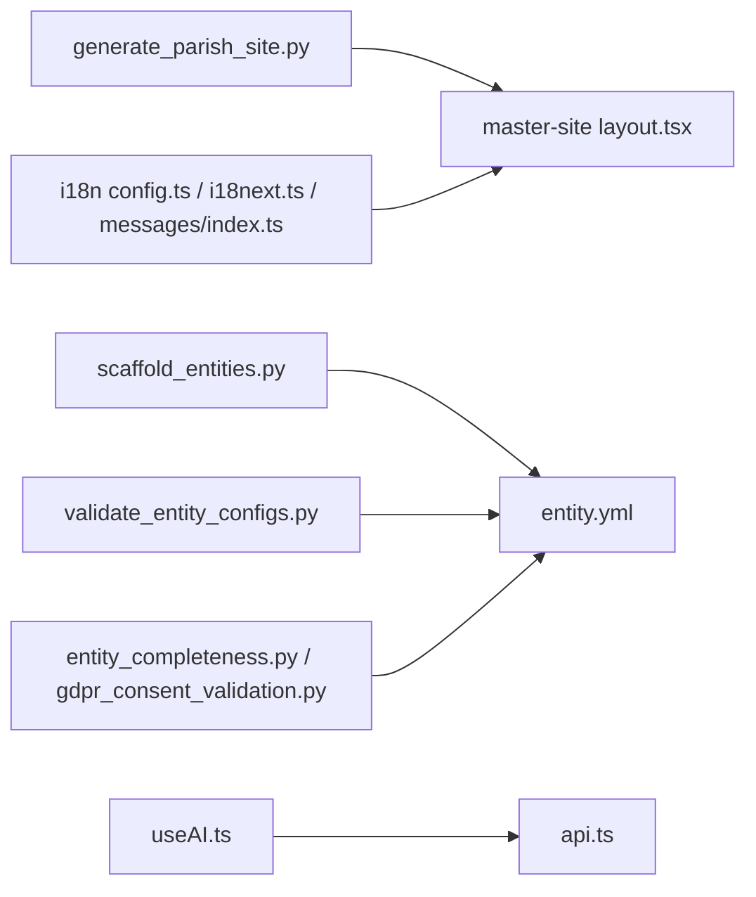

# Content Generation

<cite>
**Referenced Files in This Document**
- [generate_parish_site.py](file://tools/qoder/workflows/generate_parish_site.py)
- [scaffold_entities.py](file://tools/qoder/workflows/scaffold_entities.py)
- [layout.tsx](file://frontend/apps/master-site/src/app/[parish]/layout.tsx)
- [page.tsx](file://frontend/apps/parish-template/src/app/templates/parish/page.tsx)
- [useAI.ts](file://frontend/apps/admin-dashboard/src/lib/hooks/useAI.ts)
- [api.ts](file://frontend/apps/admin-dashboard/src/lib/api.ts)
- [ai.ts](file://frontend/apps/admin-dashboard/src/types/ai.ts)
- [entity.yml](file://countries/lt/examples/orthodox/vilnius-orthodox-cathedral/entity.yml)
- [config.ts](file://frontend/packages/i18n/src/config.ts)
- [i18next.ts](file://frontend/packages/i18n/src/i18next.ts)
- [messages/index.ts](file://frontend/packages/i18n/src/messages/index.ts)
- [validate_entity_configs.py](file://scripts/validate_entity_configs.py)
- [entity_completeness.py](file://data/src/quality/expectations/entity_completeness.py)
- [gdpr_consent_validation.py](file://data/src/quality/expectations/gdpr_consent_validation.py)
- [test_compliance.py](file://data/tests/test_compliance.py)
- [compliance-audit.js](file://frontend/apps/admin-dashboard/scripts/compliance-audit.js)
- [ADR-010-guard-rule-document-exemption.md](file://docs/decisions/ADR-010-guard-rule-document-exemption.md)
- [DECISION-LOG.md](file://docs/decisions/DECISION-LOG.md)
</cite>

## Table of Contents
1. Introduction
2. Project Structure
3. Core Components
4. Architecture Overview
5. Detailed Component Analysis
6. Dependency Analysis
7. Performance Considerations
8. Troubleshooting Guide
9. Conclusion

## Introduction
This document explains the AI-powered content generation system in JOL-HUB that automates parish website creation for religious institutions across denominations and regions. It covers:
- Parish site generation workflow (template selection, subdomain setup, country-specific configuration, and integration with the template rendering system)
- AI orchestration layer for content generation, approval, and publishing workflows
- Multi-language support and cultural adaptations (liturgical calendars, canonical requirements)
- Prompt engineering strategies used to generate church descriptions, service information, and contact details
- Quality assurance, content validation rules, and performance optimization techniques for large-scale generation

## Project Structure
The system spans tooling scripts, frontend apps, shared i18n packages, and compliance/validation utilities:
- Tooling scripts scaffold entities and generate parish sites
- Master-site and parish-template render tenant-aware pages using resolved parish data
- Admin dashboard provides hooks and API contracts for AI content generation
- Shared i18n package configures locales, message catalogs, and runtime behavior
- Compliance and quality modules enforce GDPR, Canon Law, and entity completeness

**Diagram sources**
- [generate_parish_site.py:36-121](file://tools/qoder/workflows/generate_parish_site.py#L36-L121)
- [layout.tsx:138-167](file://frontend/apps/master-site/src/app/[parish]/layout.tsx#L138-L167)
- [page.tsx:54-104](file://frontend/apps/parish-template/src/app/templates/parish/page.tsx#L54-L104)
- [useAI.ts:24-118](file://frontend/apps/admin-dashboard/src/lib/hooks/useAI.ts#L24-L118)
- [api.ts:339-383](file://frontend/apps/admin-dashboard/src/lib/api.ts#L339-L383)
- [ai.ts:25-35](file://frontend/apps/admin-dashboard/src/types/ai.ts#L25-L35)
- [scaffold_entities.py:197-382](file://tools/qoder/workflows/scaffold_entities.py#L197-L382)
- [entity.yml:54-91](file://countries/lt/examples/orthodox/vilnius-orthodox-cathedral/entity.yml#L54-L91)
- [config.ts:1-31](file://frontend/packages/i18n/src/config.ts#L1-L31)
- [i18next.ts:30-82](file://frontend/packages/i18n/src/i18next.ts#L30-L82)
- [messages/index.ts:107-132](file://frontend/packages/i18n/src/messages/index.ts#L107-L132)
- [validate_entity_configs.py:217-243](file://scripts/validate_entity_configs.py#L217-L243)
- [entity_completeness.py:155-188](file://data/src/quality/expectations/entity_completeness.py#L155-L188)
- [gdpr_consent_validation.py:165-210](file://data/src/quality/expectations/gdpr_consent_validation.py#L165-L210)

**Section sources**
- [generate_parish_site.py:36-121](file://tools/qoder/workflows/generate_parish_site.py#L36-L121)
- [scaffold_entities.py:197-382](file://tools/qoder/workflows/scaffold_entities.py#L197-L382)
- [layout.tsx:138-205](file://frontend/apps/master-site/src/app/[parish]/layout.tsx#L138-L205)
- [page.tsx:54-104](file://frontend/apps/parish-template/src/app/templates/parish/page.tsx#L54-L104)
- [useAI.ts:24-118](file://frontend/apps/admin-dashboard/src/lib/hooks/useAI.ts#L24-L118)
- [api.ts:339-383](file://frontend/apps/admin-dashboard/src/lib/api.ts#L339-L383)
- [ai.ts:25-35](file://frontend/apps/admin-dashboard/src/types/ai.ts#L25-L35)
- [config.ts:1-31](file://frontend/packages/i18n/src/config.ts#L1-L31)
- [i18next.ts:30-82](file://frontend/packages/i18n/src/i18next.ts#L30-L82)
- [messages/index.ts:107-132](file://frontend/packages/i18n/src/messages/index.ts#L107-L132)
- [validate_entity_configs.py:217-243](file://scripts/validate_entity_configs.py#L217-L243)
- [entity_completeness.py:155-188](file://data/src/quality/expectations/entity_completeness.py#L155-L188)
- [gdpr_consent_validation.py:165-210](file://data/src/quality/expectations/gdpr_consent_validation.py#L165-L210)

## Core Components
- Parish site generator: validates inputs, generates subdomains, creates page/layout files, updates tenant resolver, and writes country-specific configs
- Entity scaffolder: supports multiple entity types and denominations, applies templates, generates entity.yml and parish.json, and optional ROPA templates
- Template rendering: master-site layout resolves parish context, injects theme variables, and renders tenant-scoped content; parish-template defines page structure and metadata
- AI orchestration hooks: admin dashboard exposes hooks to fetch templates, generate content, list generated content, approve/reject/publish content
- i18n system: configures supported locales, initializes runtime, merges vertical and tenant overrides, and provides server-safe translation helpers
- Validation and QA: enforces GDPR and Canon Law constraints, checks entity completeness, and validates consent records

**Section sources**
- [generate_parish_site.py:36-121](file://tools/qoder/workflows/generate_parish_site.py#L36-L121)
- [scaffold_entities.py:197-382](file://tools/qoder/workflows/scaffold_entities.py#L197-L382)
- [layout.tsx:138-205](file://frontend/apps/master-site/src/app/[parish]/layout.tsx#L138-L205)
- [page.tsx:54-104](file://frontend/apps/parish-template/src/app/templates/parish/page.tsx#L54-L104)
- [useAI.ts:24-118](file://frontend/apps/admin-dashboard/src/lib/hooks/useAI.ts#L24-L118)
- [api.ts:339-383](file://frontend/apps/admin-dashboard/src/lib/api.ts#L339-L383)
- [ai.ts:25-35](file://frontend/apps/admin-dashboard/src/types/ai.ts#L25-L35)
- [config.ts:1-31](file://frontend/packages/i18n/src/config.ts#L1-L31)
- [i18next.ts:30-82](file://frontend/packages/i18n/src/i18next.ts#L30-L82)
- [messages/index.ts:107-132](file://frontend/packages/i18n/src/messages/index.ts#L107-L132)
- [validate_entity_configs.py:217-243](file://scripts/validate_entity_configs.py#L217-L243)
- [entity_completeness.py:155-188](file://data/src/quality/expectations/entity_completeness.py#L155-L188)
- [gdpr_consent_validation.py:165-210](file://data/src/quality/expectations/gdpr_consent_validation.py#L165-L210)

## Architecture Overview
The end-to-end flow connects scaffolding tools, template rendering, AI orchestration, and compliance validation:

**Diagram sources**
- [generate_parish_site.py:66-121](file://tools/qoder/workflows/generate_parish_site.py#L66-L121)
- [generate_parish_site.py:210-236](file://tools/qoder/workflows/generate_parish_site.py#L210-L236)
- [layout.tsx:138-167](file://frontend/apps/master-site/src/app/[parish]/layout.tsx#L138-L167)
- [useAI.ts:24-118](file://frontend/apps/admin-dashboard/src/lib/hooks/useAI.ts#L24-L118)
- [api.ts:339-383](file://frontend/apps/admin-dashboard/src/lib/api.ts#L339-L383)

## Detailed Component Analysis

### Parish Site Generator Workflow
- Validates country codes, parish names, and optional subdomain patterns
- Generates a unique subdomain if not provided
- Creates Next.js page and layout files under master-site per subdomain
- Updates tenant resolver guidance and writes country-specific parish.json
- Supports dry-run mode for safe previews

**Diagram sources**
- [generate_parish_site.py:123-153](file://tools/qoder/workflows/generate_parish_site.py#L123-L153)
- [generate_parish_site.py:155-191](file://tools/qoder/workflows/generate_parish_site.py#L155-L191)
- [generate_parish_site.py:193-236](file://tools/qoder/workflows/generate_parish_site.py#L193-L236)
- [generate_parish_site.py:407-495](file://tools/qoder/workflows/generate_parish_site.py#L407-L495)

**Section sources**
- [generate_parish_site.py:123-153](file://tools/qoder/workflows/generate_parish_site.py#L123-L153)
- [generate_parish_site.py:155-191](file://tools/qoder/workflows/generate_parish_site.py#L155-L191)
- [generate_parish_site.py:193-236](file://tools/qoder/workflows/generate_parish_site.py#L193-L236)
- [generate_parish_site.py:407-495](file://tools/qoder/workflows/generate_parish_site.py#L407-L495)

### Entity Scaffolding and Denomination Handling
- Supports multiple entity types (basilica, cathedral, church, diocese, deanery, protestant, orthodox, greek_catholic, funeral_home, cemetery)
- Applies denomination-based defaults (rite, calendar, features, compliance level)
- Generates entity.yml with canonical info, hierarchy, contact, website settings, and compliance fields
- Produces parish.json with language, timezone, currency, and status
- Optionally generates ROPA templates aligned with GDPR and Canon Law retention policies

**Diagram sources**
- [scaffold_entities.py:197-382](file://tools/qoder/workflows/scaffold_entities.py#L197-L382)
- [scaffold_entities.py:397-423](file://tools/qoder/workflows/scaffold_entities.py#L397-L423)
- [scaffold_entities.py:480-600](file://tools/qoder/workflows/scaffold_entities.py#L480-L600)
- [scaffold_entities.py:621-698](file://tools/qoder/workflows/scaffold_entities.py#L621-L698)

**Section sources**
- [scaffold_entities.py:103-156](file://tools/qoder/workflows/scaffold_entities.py#L103-L156)
- [scaffold_entities.py:197-382](file://tools/qoder/workflows/scaffold_entities.py#L197-L382)
- [scaffold_entities.py:397-423](file://tools/qoder/workflows/scaffold_entities.py#L397-L423)
- [scaffold_entities.py:480-600](file://tools/qoder/workflows/scaffold_entities.py#L480-L600)
- [scaffold_entities.py:621-698](file://tools/qoder/workflows/scaffold_entities.py#L621-L698)

### Template Rendering Integration
- Master-site layout resolves parish by subdomain, sets viewport/theme, and wraps content with ParishProvider
- Parish template page defines metadata, types, and mock data placeholders for mass schedules, contact, and announcements
- Static params and ISR revalidation are configured for performance

**Diagram sources**
- [layout.tsx:106-167](file://frontend/apps/master-site/src/app/[parish]/layout.tsx#L106-L167)
- [layout.tsx:178-205](file://frontend/apps/master-site/src/app/[parish]/layout.tsx#L178-L205)
- [page.tsx:54-104](file://frontend/apps/parish-template/src/app/templates/parish/page.tsx#L54-L104)

**Section sources**
- [layout.tsx:106-167](file://frontend/apps/master-site/src/app/[parish]/layout.tsx#L106-L167)
- [layout.tsx:178-205](file://frontend/apps/master-site/src/app/[parish]/layout.tsx#L178-L205)
- [page.tsx:54-104](file://frontend/apps/parish-template/src/app/templates/parish/page.tsx#L54-L104)

### AI Orchestration Layer (Admin Dashboard)
- Exposes hooks to fetch templates, generate content, retrieve generated content with pagination, approve/reject/publish content
- Uses DRF-style pagination envelope for consistent response handling
- Types define content templates and statuses for generated content

**Diagram sources**
- [useAI.ts:24-118](file://frontend/apps/admin-dashboard/src/lib/hooks/useAI.ts#L24-L118)
- [api.ts:339-383](file://frontend/apps/admin-dashboard/src/lib/api.ts#L339-L383)
- [ai.ts:25-35](file://frontend/apps/admin-dashboard/src/types/ai.ts#L25-L35)

**Section sources**
- [useAI.ts:24-118](file://frontend/apps/admin-dashboard/src/lib/hooks/useAI.ts#L24-L118)
- [api.ts:339-383](file://frontend/apps/admin-dashboard/src/lib/api.ts#L339-L383)
- [ai.ts:25-35](file://frontend/apps/admin-dashboard/src/types/ai.ts#L25-L35)

### Multi-Language Support and Cultural Adaptation
- Supported locales include lt, en, ru with native names and detection via path, cookie, localStorage, navigator, htmlTag
- Message catalogs merge base, vertical, and tenant overrides; server-safe translate helper returns fallback when keys are absent
- Entity configurations specify default and supported languages, timezones, currencies, and liturgical calendars (e.g., Julian for Orthodox)

**Diagram sources**
- [i18next.ts:30-82](file://frontend/packages/i18n/src/i18next.ts#L30-L82)
- [messages/index.ts:107-132](file://frontend/packages/i18n/src/messages/index.ts#L107-L132)
- [config.ts:1-31](file://frontend/packages/i18n/src/config.ts#L1-L31)
- [entity.yml:54-91](file://countries/lt/examples/orthodox/vilnius-orthodox-cathedral/entity.yml#L54-L91)

**Section sources**
- [i18next.ts:30-82](file://frontend/packages/i18n/src/i18next.ts#L30-L82)
- [messages/index.ts:107-132](file://frontend/packages/i18n/src/messages/index.ts#L107-L132)
- [config.ts:1-31](file://frontend/packages/i18n/src/config.ts#L1-L31)
- [entity.yml:54-91](file://countries/lt/examples/orthodox/vilnius-orthodox-cathedral/entity.yml#L54-L91)

### Prompt Engineering Strategies
- Use structured templates for church descriptions, service times, and contact details, parameterized by entity type, denomination, and country
- Enforce canonical and compliance constraints in prompts (e.g., Art. 9(2)(d) for religious data, permanent retention for sacramental records)
- Include liturgical calendar context (Julian vs Gregorian) and jurisdictional references to tailor content tone and accuracy
- Apply localization through i18n keys and fallbacks to ensure multilingual outputs

Practical examples:
- Generating a Catholic parish description referencing mass schedules, sacraments, and donations with canonical compliance
- Creating Orthodox service information with Julian calendar alignment and Slavonic/Lithuanian service listings
- Producing Protestant service pages with community events and donation links while respecting GDPR defaults

**Section sources**
- [scaffold_entities.py:500-600](file://tools/qoder/workflows/scaffold_entities.py#L500-L600)
- [entity.yml:54-91](file://countries/lt/examples/orthodox/vilnius-orthodox-cathedral/entity.yml#L54-L91)
- [validate_entity_configs.py:217-243](file://scripts/validate_entity_configs.py#L217-L243)

### Quality Assurance and Content Validation
- Entity completeness checks ensure minimum field coverage and priest assignment per Canon Law
- Consent validation computes compliance statistics and highlights common issues
- Compliance tests assert GDPR articles (Art. 9, Art. 17), audit logging presence, and canonical record retention
- Guard rules and audits verify policy adherence (e.g., payment boundary, canonical approval components)

**Diagram sources**
- [entity_completeness.py:155-188](file://data/src/quality/expectations/entity_completeness.py#L155-L188)
- [gdpr_consent_validation.py:165-210](file://data/src/quality/expectations/gdpr_consent_validation.py#L165-L210)
- [test_compliance.py:241-258](file://data/tests/test_compliance.py#L241-L258)
- [compliance-audit.js:199-237](file://frontend/apps/admin-dashboard/scripts/compliance-audit.js#L199-L237)

**Section sources**
- [entity_completeness.py:155-188](file://data/src/quality/expectations/entity_completeness.py#L155-L188)
- [gdpr_consent_validation.py:165-210](file://data/src/quality/expectations/gdpr_consent_validation.py#L165-L210)
- [test_compliance.py:241-258](file://data/tests/test_compliance.py#L241-L258)
- [compliance-audit.js:199-237](file://frontend/apps/admin-dashboard/scripts/compliance-audit.js#L199-L237)

## Dependency Analysis
Key dependencies and relationships:
- Qoder workflows depend on filesystem paths and tenant resolver conventions
- Master-site layout depends on parish resolution and theme generation
- Admin dashboard hooks depend on AI API endpoints and DRF pagination
- i18n package provides locale detection, resource loading, and message merging
- Validation modules depend on entity configs and compliance rules

**Diagram sources**
- [generate_parish_site.py:210-236](file://tools/qoder/workflows/generate_parish_site.py#L210-L236)
- [layout.tsx:138-167](file://frontend/apps/master-site/src/app/[parish]/layout.tsx#L138-L167)
- [scaffold_entities.py:480-600](file://tools/qoder/workflows/scaffold_entities.py#L480-L600)
- [useAI.ts:24-118](file://frontend/apps/admin-dashboard/src/lib/hooks/useAI.ts#L24-L118)
- [api.ts:339-383](file://frontend/apps/admin-dashboard/src/lib/api.ts#L339-L383)
- [config.ts:1-31](file://frontend/packages/i18n/src/config.ts#L1-L31)
- [i18next.ts:30-82](file://frontend/packages/i18n/src/i18next.ts#L30-L82)
- [messages/index.ts:107-132](file://frontend/packages/i18n/src/messages/index.ts#L107-L132)
- [validate_entity_configs.py:217-243](file://scripts/validate_entity_configs.py#L217-L243)
- [entity_completeness.py:155-188](file://data/src/quality/expectations/entity_completeness.py#L155-L188)
- [gdpr_consent_validation.py:165-210](file://data/src/quality/expectations/gdpr_consent_validation.py#L165-L210)

**Section sources**
- [generate_parish_site.py:210-236](file://tools/qoder/workflows/generate_parish_site.py#L210-L236)
- [layout.tsx:138-167](file://frontend/apps/master-site/src/app/[parish]/layout.tsx#L138-L167)
- [scaffold_entities.py:480-600](file://tools/qoder/workflows/scaffold_entities.py#L480-L600)
- [useAI.ts:24-118](file://frontend/apps/admin-dashboard/src/lib/hooks/useAI.ts#L24-L118)
- [api.ts:339-383](file://frontend/apps/admin-dashboard/src/lib/api.ts#L339-L383)
- [config.ts:1-31](file://frontend/packages/i18n/src/config.ts#L1-L31)
- [i18next.ts:30-82](file://frontend/packages/i18n/src/i18next.ts#L30-L82)
- [messages/index.ts:107-132](file://frontend/packages/i18n/src/messages/index.ts#L107-L132)
- [validate_entity_configs.py:217-243](file://scripts/validate_entity_configs.py#L217-L243)
- [entity_completeness.py:155-188](file://data/src/quality/expectations/entity_completeness.py#L155-L188)
- [gdpr_consent_validation.py:165-210](file://data/src/quality/expectations/gdpr_consent_validation.py#L165-L210)

## Performance Considerations
- Static generation and ISR: master-site layout uses static params and revalidation intervals to reduce server load
- Tenant resolution: resolveParish is called once per layout to minimize repeated lookups
- i18n caching: message catalogs are merged and cached to avoid recomputation
- Dry-run modes: workflows support dry-run to prevent unnecessary filesystem changes during testing
- Pagination: AI content listing uses DRF pagination to handle large datasets efficiently

[No sources needed since this section provides general guidance]

## Troubleshooting Guide
Common issues and resolutions:
- Invalid country or subdomain: ensure country code is in the allowed list and subdomain matches pattern constraints
- Missing tenant resolver entry: manually add parish entry to MOCK_PARISHES in resolver.ts as guided by workflow output
- Compliance failures: check entity.yml for required compliance fields (audit_logging, legal_basis, retention_periods)
- Canon Law violations: verify priest assignments and sacramental record retention settings
- Guard rule violations: review guard audits and decision logs for policy enforcement

**Section sources**
- [generate_parish_site.py:123-153](file://tools/qoder/workflows/generate_parish_site.py#L123-L153)
- [generate_parish_site.py:407-455](file://tools/qoder/workflows/generate_parish_site.py#L407-L455)
- [validate_entity_configs.py:217-243](file://scripts/validate_entity_configs.py#L217-L243)
- [entity_completeness.py:168-188](file://data/src/quality/expectations/entity_completeness.py#L168-L188)
- [compliance-audit.js:199-237](file://frontend/apps/admin-dashboard/scripts/compliance-audit.js#L199-L237)
- [ADR-010-guard-rule-document-exemption.md:51-82](file://docs/decisions/ADR-010-guard-rule-document-exemption.md#L51-L82)
- [DECISION-LOG.md:11-75](file://docs/decisions/DECISION-LOG.md#L11-L75)

## Conclusion
JOL-HUB’s AI-powered content generation system combines robust scaffolding tools, tenant-aware template rendering, multi-language support, and comprehensive compliance validation to automate parish website creation across denominations and regions. The workflow ensures culturally appropriate content, adheres to GDPR and Canon Law, and integrates seamlessly with the template rendering system. With strong quality assurance and performance optimizations, it scales effectively for large-scale deployments while maintaining regulatory compliance and user experience standards.

[No sources needed since this section summarizes without analyzing specific files]