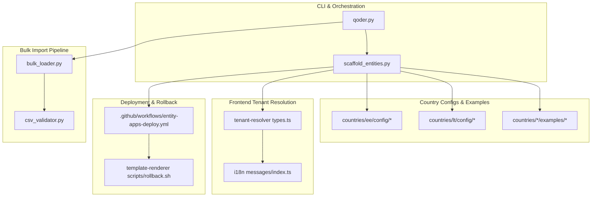
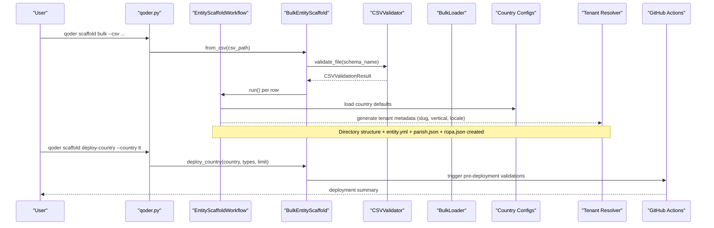
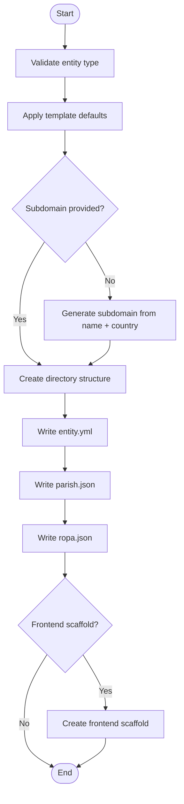
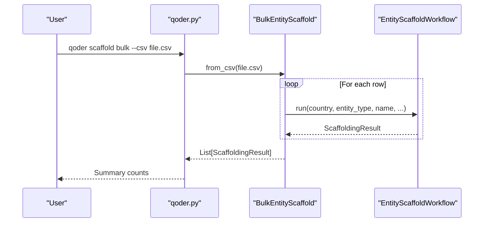
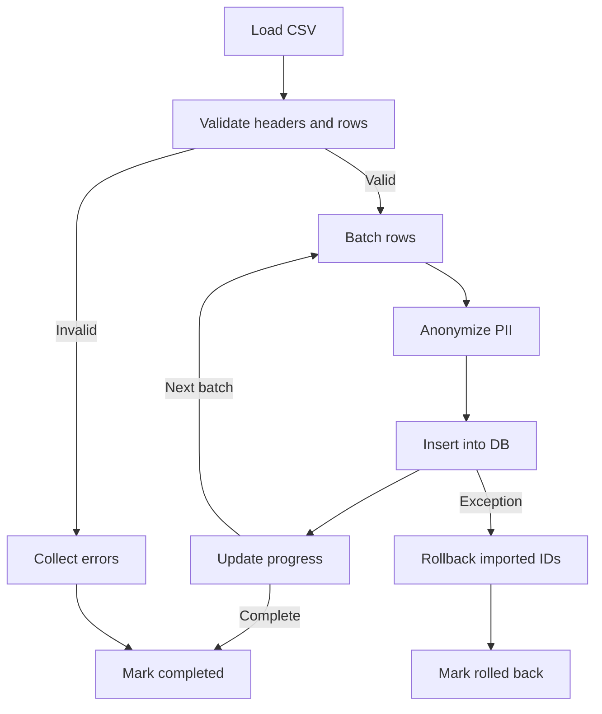
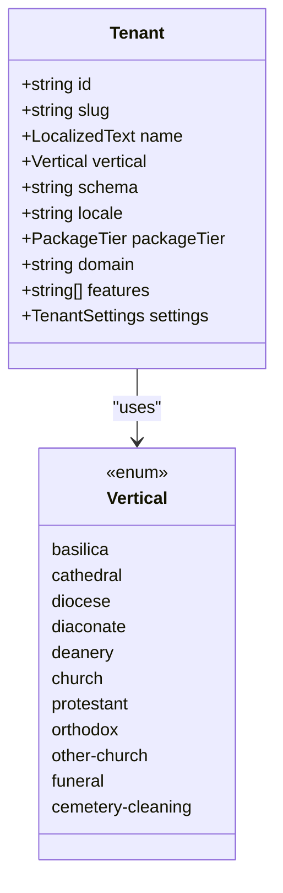
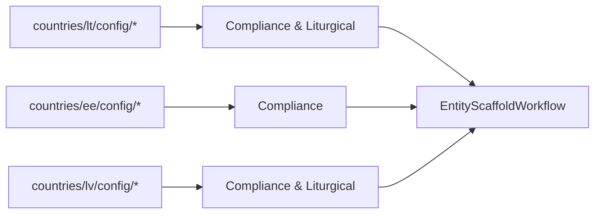
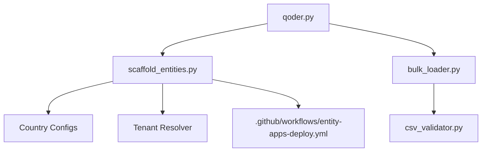

# Entity Scaffolding

<cite>
**Referenced Files in This Document**
- [scaffold_entities.py](file://tools/qoder/workflows/scaffold_entities.py)
- [qoder.py](file://tools/qoder/qoder.py)
- [bulk_loader.py](file://data/src/pipelines/entity_import/bulk_loader.py)
- [csv_validator.py](file://data/src/pipelines/entity_import/csv_validator.py)
- [ADR-001-schema-per-tenant-isolation.md](file://docs/decisions/ADR-001-schema-per-tenant-isolation.md)
- [types.ts](file://frontend/packages/tenant-resolver/src/types.ts)
- [resolver.test.ts](file://frontend/packages/tenant-resolver/src/__tests__/resolver.test.ts)
- [messages/index.ts](file://frontend/packages/i18n/src/messages/index.ts)
- [compliance.yml (LT)](file://countries/lt/config/compliance.yml)
- [liturgical.yml (LT)](file://countries/lt/config/liturgical.yml)
- [compliance.yml (EE)](file://countries/ee/config/compliance.yml)
- [entity.yml (St. John Vilnius)](file://countries/lt/examples/catholic/church/st-john-vilnius/entity.yml)
- [parish.json (test parish)](file://countries/lt/test-parish-lt-5/parish.json)
- [sample_entities_lt.csv](file://data/sample_entities_lt.csv)
- [entity-apps-deploy.yml](file://.github/workflows/entity-apps-deploy.yml)
- [rollback.sh](file://frontend/apps/template-renderer/scripts/rollback.sh)
- [EMERGENCY-ROLLBACK.md](file://frontend/docs/wave0/EMERGENCY-ROLLBACK.md)
</cite>

## Table of Contents
1. Introduction
2. Project Structure
3. Core Components
4. Architecture Overview
5. Detailed Component Analysis
6. Dependency Analysis
7. Performance Considerations
8. Troubleshooting Guide
9. Conclusion
10. Appendices

## Introduction
This document explains the AI-powered entity scaffolding system that automates creation and deployment of religious institution websites at scale across multiple countries and entity types. It covers bulk workflows, CSV-based batch processing, country-specific configuration, multi-tenant integration, localized content generation, validation, error handling, and rollback strategies for large-scale deployments.

## Project Structure
The system spans several areas:
- CLI and orchestration: tools/qoder
- Country configurations and examples: countries/*
- Bulk import pipeline: data/src/pipelines/entity_import
- Frontend tenant resolution and localization: frontend/packages/*
- Deployment automation: .github/workflows
- Rollback tooling: frontend/apps/template-renderer/scripts

**Diagram sources**
- [qoder.py:86-257](file://tools/qoder/qoder.py#L86-L257)
- [scaffold_entities.py:197-382](file://tools/qoder/workflows/scaffold_entities.py#L197-L382)
- [bulk_loader.py:72-151](file://data/src/pipelines/entity_import/bulk_loader.py#L72-L151)
- [csv_validator.py:120-210](file://data/src/pipelines/entity_import/csv_validator.py#L120-L210)
- [types.ts:1-79](file://frontend/packages/tenant-resolver/src/types.ts#L1-L79)
- [messages/index.ts:32-66](file://frontend/packages/i18n/src/messages/index.ts#L32-L66)
- [entity-apps-deploy.yml:232-327](file://.github/workflows/entity-apps-deploy.yml#L232-L327)
- [rollback.sh:70-82](file://frontend/apps/template-renderer/scripts/rollback.sh#L70-L82)

**Section sources**
- [qoder.py:86-257](file://tools/qoder/qoder.py#L86-L257)
- [scaffold_entities.py:197-382](file://tools/qoder/workflows/scaffold_entities.py#L197-L382)
- [bulk_loader.py:72-151](file://data/src/pipelines/entity_import/bulk_loader.py#L72-L151)
- [csv_validator.py:120-210](file://data/src/pipelines/entity_import/csv_validator.py#L120-L210)
- [types.ts:1-79](file://frontend/packages/tenant-resolver/src/types.ts#L1-L79)
- [messages/index.ts:32-66](file://frontend/packages/i18n/src/messages/index.ts#L32-L66)
- [entity-apps-deploy.yml:232-327](file://.github/workflows/entity-apps-deploy.yml#L232-L327)
- [rollback.sh:70-82](file://frontend/apps/template-renderer/scripts/rollback.sh#L70-L82)

## Core Components
- EntityScaffoldWorkflow: orchestrates single-entity scaffolding with validation, directory structure creation, config file generation (entity.yml, parish.json), ROPA template generation, and optional frontend scaffold.
- BulkEntityScaffold: supports CSV-driven bulk creation and country-wide deployment with limits and filtering by entity type.
- BulkLoader and CSVValidator: provide GDPR-compliant batch import with progress tracking, PII anonymization, schema validation, consent checks, and rollback on failure.
- Country configs: define jurisdiction defaults, languages, calendars, compliance rules, and liturgical calendars per country.
- Tenant resolver: maps domain/subdomain to tenant, schema, vertical, locale; enforces server-only schema exposure.
- Deployment workflow: validates entity configs and ROPA before blue-green production deployment and smoke tests.
- Rollback scripts: automated rollback with health checks and alerting.

**Section sources**
- [scaffold_entities.py:197-382](file://tools/qoder/workflows/scaffold_entities.py#L197-L382)
- [scaffold_entities.py:753-1047](file://tools/qoder/workflows/scaffold_entities.py#L753-L1047)
- [bulk_loader.py:72-151](file://data/src/pipelines/entity_import/bulk_loader.py#L72-L151)
- [csv_validator.py:120-210](file://data/src/pipelines/entity_import/csv_validator.py#L120-L210)
- [compliance.yml (LT):1-201](file://countries/lt/config/compliance.yml#L1-L201)
- [liturgical.yml (LT):1-184](file://countries/lt/config/liturgical.yml#L1-L184)
- [compliance.yml (EE):1-241](file://countries/ee/config/compliance.yml#L1-L241)
- [types.ts:1-79](file://frontend/packages/tenant-resolver/src/types.ts#L1-L79)
- [entity-apps-deploy.yml:232-327](file://.github/workflows/entity-apps-deploy.yml#L232-L327)
- [rollback.sh:70-82](file://frontend/apps/template-renderer/scripts/rollback.sh#L70-L82)

## Architecture Overview
The system follows a layered architecture:
- CLI layer: qoder.py exposes commands for create, bulk, deploy-country, sample-csv.
- Workflow layer: EntityScaffoldWorkflow and BulkEntityScaffold implement business logic for scaffolding and batching.
- Data layer: CSVValidator ensures schema and GDPR compliance; BulkLoader performs batched imports with rollback.
- Configuration layer: Country-specific YAML files define compliance, liturgical calendars, and canonical jurisdictions.
- Frontend layer: tenant-resolver resolves tenants and locales; i18n maps verticals to message catalogs.
- Operations layer: GitHub Actions validate and deploy entities; rollback scripts ensure safe recovery.

**Diagram sources**
- [qoder.py:86-257](file://tools/qoder/qoder.py#L86-L257)
- [scaffold_entities.py:753-1047](file://tools/qoder/workflows/scaffold_entities.py#L753-L1047)
- [csv_validator.py:120-210](file://data/src/pipelines/entity_import/csv_validator.py#L120-L210)
- [bulk_loader.py:72-151](file://data/src/pipelines/entity_import/bulk_loader.py#L72-L151)
- [entity-apps-deploy.yml:232-327](file://.github/workflows/entity-apps-deploy.yml#L232-L327)

## Detailed Component Analysis

### EntityScaffoldWorkflow
- Validates entity type and applies template defaults (denomination, compliance level, features).
- Generates subdomain if not provided.
- Creates directory structure based on denomination and entity type.
- Renders entity.yml with canonical info, hierarchy, website settings, Bitrix24 integration, and compliance configuration.
- Generates parish.json with tenant settings (language, timezone, currency).
- Generates ROPA template with processing activities and retention policies.
- Optional frontend scaffold step.

**Diagram sources**
- [scaffold_entities.py:264-311](file://tools/qoder/workflows/scaffold_entities.py#L264-L311)
- [scaffold_entities.py:425-478](file://tools/qoder/workflows/scaffold_entities.py#L425-L478)
- [scaffold_entities.py:480-600](file://tools/qoder/workflows/scaffold_entities.py#L480-L600)
- [scaffold_entities.py:621-698](file://tools/qoder/workflows/scaffold_entities.py#L621-L698)
- [scaffold_entities.py:741-750](file://tools/qoder/workflows/scaffold_entities.py#L741-L750)

**Section sources**
- [scaffold_entities.py:264-311](file://tools/qoder/workflows/scaffold_entities.py#L264-L311)
- [scaffold_entities.py:425-478](file://tools/qoder/workflows/scaffold_entities.py#L425-L478)
- [scaffold_entities.py:480-600](file://tools/qoder/workflows/scaffold_entities.py#L480-L600)
- [scaffold_entities.py:621-698](file://tools/qoder/workflows/scaffold_entities.py#L621-L698)
- [scaffold_entities.py:741-750](file://tools/qoder/workflows/scaffold_entities.py#L741-L750)

### BulkEntityScaffold and CLI
- CLI exposes create, bulk, deploy-country, sample-csv commands.
- BulkEntityScaffold.from_csv reads rows and invokes EntityScaffoldWorkflow per row.
- deploy_country supports filtering by entity types and limiting count.
- Sample CSV generator aids users in preparing inputs.

**Diagram sources**
- [qoder.py:86-257](file://tools/qoder/qoder.py#L86-L257)
- [scaffold_entities.py:753-1047](file://tools/qoder/workflows/scaffold_entities.py#L753-L1047)

**Section sources**
- [qoder.py:86-257](file://tools/qoder/qoder.py#L86-L257)
- [scaffold_entities.py:753-1047](file://tools/qoder/workflows/scaffold_entities.py#L753-L1047)

### Bulk Import Pipeline (CSV Validator and Loader)
- CSVValidator defines schemas per entity type, validates headers and rows, enforces consent requirements, and masks or encrypts PII fields.
- BulkLoader processes batches, tracks progress, anonymizes PII, inserts records, and rolls back on failure while auditing start/complete events.

**Diagram sources**
- [csv_validator.py:120-210](file://data/src/pipelines/entity_import/csv_validator.py#L120-L210)
- [csv_validator.py:276-339](file://data/src/pipelines/entity_import/csv_validator.py#L276-L339)
- [bulk_loader.py:72-151](file://data/src/pipelines/entity_import/bulk_loader.py#L72-L151)
- [bulk_loader.py:160-229](file://data/src/pipelines/entity_import/bulk_loader.py#L160-L229)
- [bulk_loader.py:231-256](file://data/src/pipelines/entity_import/bulk_loader.py#L231-L256)

**Section sources**
- [csv_validator.py:120-210](file://data/src/pipelines/entity_import/csv_validator.py#L120-L210)
- [csv_validator.py:276-339](file://data/src/pipelines/entity_import/csv_validator.py#L276-L339)
- [bulk_loader.py:72-151](file://data/src/pipelines/entity_import/bulk_loader.py#L72-L151)
- [bulk_loader.py:160-229](file://data/src/pipelines/entity_import/bulk_loader.py#L160-L229)
- [bulk_loader.py:231-256](file://data/src/pipelines/entity_import/bulk_loader.py#L231-L256)

### Multi-Tenant Integration and Localization
- Tenant resolution maps domain/subdomain to tenant object including slug, vertical, schema (server-only), locale, package tier, features, and settings.
- Vertical normalization maps legacy fixture-era values to canonical STEP-5 taxonomy.
- i18n maps tenant verticals to message catalogs for localized content.

**Diagram sources**
- [types.ts:1-79](file://frontend/packages/tenant-resolver/src/types.ts#L1-L79)

**Section sources**
- [types.ts:1-79](file://frontend/packages/tenant-resolver/src/types.ts#L1-L79)
- [resolver.test.ts:252-285](file://frontend/packages/tenant-resolver/src/__tests__/resolver.test.ts#L252-L285)
- [messages/index.ts:32-66](file://frontend/packages/i18n/src/messages/index.ts#L32-L66)

### Country-Specific Deployment Strategies
- Country configs define default jurisdictions, languages, timezones, currencies, and canonical dioceses.
- Compliance configs specify lawful basis, special categories, retention periods, breach notification, and audit requirements tailored per country.
- Liturgical calendar config provides local feast days and holy days for Catholic entities in Lithuania.

**Diagram sources**
- [compliance.yml (LT):1-201](file://countries/lt/config/compliance.yml#L1-L201)
- [liturgical.yml (LT):1-184](file://countries/lt/config/liturgical.yml#L1-L184)
- [compliance.yml (EE):1-241](file://countries/ee/config/compliance.yml#L1-L241)

**Section sources**
- [compliance.yml (LT):1-201](file://countries/lt/config/compliance.yml#L1-L201)
- [liturgical.yml (LT):1-184](file://countries/lt/config/liturgical.yml#L1-L184)
- [compliance.yml (EE):1-241](file://countries/ee/config/compliance.yml#L1-L241)

### Example Entity Configuration
- Example entity.yml shows canonical information, hierarchy, contact details, website settings, online store configuration, compliance flags, mass/confession schedules, and Bitrix24 integration.
- Test parish.json demonstrates minimal tenant settings for language, timezone, and currency.

**Section sources**
- [entity.yml (St. John Vilnius):1-97](file://countries/lt/examples/catholic/church/st-john-vilnius/entity.yml#L1-L97)
- [parish.json (test parish):1-15](file://countries/lt/test-parish-lt-5/parish.json#L1-L15)

### Practical Examples
- Deploy an entire country’s worth of entities using the CLI:
  - Generate a sample CSV for a country and fill it with entity rows.
  - Run bulk scaffolding to create directories and configuration files.
  - Use deploy-country to prepare and validate all entities for a country.
- Customize scaffolding templates by editing country configs (compliance, liturgical) and entity templates referenced by the workflow.

**Section sources**
- [sample_entities_lt.csv:1-5](file://data/sample_entities_lt.csv#L1-L5)
- [qoder.py:86-257](file://tools/qoder/qoder.py#L86-L257)
- [scaffold_entities.py:753-1047](file://tools/qoder/workflows/scaffold_entities.py#L753-L1047)

## Dependency Analysis
Key dependencies and relationships:
- CLI depends on workflow classes for orchestration.
- Workflows depend on country configs and generate frontend tenant metadata consumed by tenant resolver.
- Bulk import pipeline depends on CSV validator and encryption utilities for GDPR compliance.
- Deployment workflow depends on validation scripts and generates deployment records for audit.

**Diagram sources**
- [qoder.py:86-257](file://tools/qoder/qoder.py#L86-L257)
- [scaffold_entities.py:197-382](file://tools/qoder/workflows/scaffold_entities.py#L197-L382)
- [bulk_loader.py:72-151](file://data/src/pipelines/entity_import/bulk_loader.py#L72-L151)
- [csv_validator.py:120-210](file://data/src/pipelines/entity_import/csv_validator.py#L120-L210)
- [entity-apps-deploy.yml:232-327](file://.github/workflows/entity-apps-deploy.yml#L232-L327)

**Section sources**
- [qoder.py:86-257](file://tools/qoder/qoder.py#L86-L257)
- [scaffold_entities.py:197-382](file://tools/qoder/workflows/scaffold_entities.py#L197-L382)
- [bulk_loader.py:72-151](file://data/src/pipelines/entity_import/bulk_loader.py#L72-L151)
- [csv_validator.py:120-210](file://data/src/pipelines/entity_import/csv_validator.py#L120-L210)
- [entity-apps-deploy.yml:232-327](file://.github/workflows/entity-apps-deploy.yml#L232-L327)

## Performance Considerations
- Batch size tuning: Adjust ImportConfig.batch_size to balance throughput and memory usage during bulk imports.
- Streaming CSV validation: Use iter_valid_rows to process large CSVs without loading all rows into memory.
- Dry-run mode: Use dry_run flags to preview changes and avoid unnecessary writes during large deployments.
- Retry strategy: The CRM client retries GET requests broadly and POST only on rate-limit conditions to reduce redundant mutations.

[No sources needed since this section provides general guidance]

## Troubleshooting Guide
Common issues and resolutions:
- Invalid entity type or country code: Ensure entity_type is one of supported values and country code matches configured regions.
- Missing required CSV columns: Validate headers against schema; add missing required fields such as parish_id, parish_name, country.
- Consent timestamp missing: Provide consent_timestamp for PII fields as required by GDPR and country-specific compliance.
- PII format errors: Fix email formats and ensure proper encryption/anonymization before import.
- Deployment failures: Check pre-deployment validations and ROPA generation; review logs and smoke test results.
- Rollback scenarios: Use rollback script to revert to previous release; verify health checks and escalate if rollback fails.

**Section sources**
- [csv_validator.py:120-210](file://data/src/pipelines/entity_import/csv_validator.py#L120-L210)
- [bulk_loader.py:160-229](file://data/src/pipelines/entity_import/bulk_loader.py#L160-L229)
- [entity-apps-deploy.yml:232-327](file://.github/workflows/entity-apps-deploy.yml#L232-L327)
- [rollback.sh:70-82](file://frontend/apps/template-renderer/scripts/rollback.sh#L70-L82)
- [EMERGENCY-ROLLBACK.md:1-49](file://frontend/docs/wave0/EMERGENCY-ROLLBACK.md#L1-L49)

## Conclusion
The entity scaffolding system provides a robust, compliant, and scalable approach to deploying religious institution websites across multiple countries and entity types. It integrates CLI orchestration, configurable country settings, GDPR-compliant bulk import, multi-tenant resolution, and operational safeguards like validation and rollback. By leveraging CSV-based workflows and country-specific configurations, teams can automate large-scale deployments while maintaining legal and canonical compliance.

[No sources needed since this section summarizes without analyzing specific files]

## Appendices

### Multi-Tenant Schema Isolation
- Per-tenant PostgreSQL schema isolation with Row-Level Security ensures strong data boundaries and supports erasure boundaries aligned with GDPR Art. 17.

**Section sources**
- [ADR-001-schema-per-tenant-isolation.md:1-52](file://docs/decisions/ADR-001-schema-per-tenant-isolation.md#L1-L52)