# ROPA Automation

<cite>
**Referenced Files in This Document**
- [generate_ropa.py](file://tools/qoder/workflows/generate_ropa.py)
- [entity_ropa.py](file://data/src/gdpr/entity_ropa.py)
- [ropa_generator.py](file://data/src/gdpr/ropa_generator.py)
- [retention_manager.py](file://data/src/gdpr/retention_manager.py)
- [anonymizer.py](file://data/src/gdpr/anonymizer.py)
- [compliance.yml](file://countries/lt/config/compliance.yml)
- [entity.yml](file://countries/lt/examples/catholic/church/st-john-vilnius/entity.yml)
- [lt-catholic-church-001_ropa.json](file://data/exports/ropa/lt/church/lt-catholic-church-001_ropa.json)
- [test_compliance.py](file://data/tests/test_compliance.py)
- [run_compliance_tests.py](file://scripts/run_compliance_tests.py)
- [audit.py](file://data/src/audit.py)
</cite>

## Table of Contents
1. Introduction
2. Project Structure
3. Core Components
4. Architecture Overview
5. Detailed Component Analysis
6. Dependency Analysis
7. Performance Considerations
8. Troubleshooting Guide
9. Conclusion
10. Appendices

## Introduction
This document explains the automated Records of Processing Activities (ROPA) generation system aligned with GDPR Article 30. It covers how the system analyzes entity configurations to identify data processing activities, maps technical implementations to legal requirements, and produces audit-ready documentation for all tenant entities. It also describes integration points with compliance frameworks, validation of privacy controls, and automated updates when entity configurations change. Examples of generated reports and customization options for different jurisdictions are included.

## Project Structure
The ROPA automation spans a workflow entry point, core ROPA logic, entity-specific activity definitions, retention management, anonymization utilities, jurisdictional compliance configuration, and sample outputs.

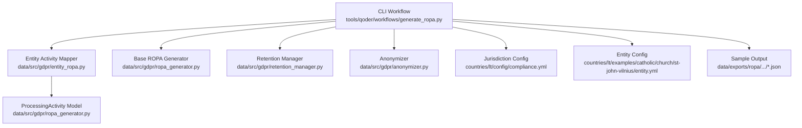

**Diagram sources**
- [generate_ropa.py:192-497](file://tools/qoder/workflows/generate_ropa.py#L192-L497)
- [entity_ropa.py:39-760](file://data/src/gdpr/entity_ropa.py#L39-L760)
- [ropa_generator.py:19-181](file://data/src/gdpr/ropa_generator.py#L19-L181)
- [retention_manager.py:188-336](file://data/src/gdpr/retention_manager.py#L188-L336)
- [anonymizer.py:106-180](file://data/src/gdpr/anonymizer.py#L106-L180)
- [compliance.yml:32-147](file://countries/lt/config/compliance.yml#L32-L147)
- [entity.yml:4-76](file://countries/lt/examples/catholic/church/st-john-vilnius/entity.yml#L4-L76)
- [lt-catholic-church-001_ropa.json:1-94](file://data/exports/ropa/lt/church/lt-catholic-church-001_ropa.json#L1-L94)

**Section sources**
- [generate_ropa.py:1-592](file://tools/qoder/workflows/generate_ropa.py#L1-L592)
- [entity_ropa.py:1-821](file://data/src/gdpr/entity_ropa.py#L1-L821)
- [ropa_generator.py:1-182](file://data/src/gdpr/ropa_generator.py#L1-L182)
- [retention_manager.py:1-336](file://data/src/gdpr/retention_manager.py#L1-L336)
- [anonymizer.py:1-180](file://data/src/gdpr/anonymizer.py#L1-L180)
- [compliance.yml:1-201](file://countries/lt/config/compliance.yml#L1-L201)
- [entity.yml:1-97](file://countries/lt/examples/catholic/church/st-john-vilnius/entity.yml#L1-L97)
- [lt-catholic-church-001_ropa.json:1-94](file://data/exports/ropa/lt/church/lt-catholic-church-001_ropa.json#L1-L94)

## Core Components
- CLI Workflow: Orchestrates loading entity configs, resolving entity types, invoking activity mappers, rendering reports, and writing outputs.
- Entity Activity Mapper: Maps each entity type to its specific processing activities, including sensitive data flags, recipients, retention periods, and security measures.
- Base ROPA Generator: Defines the ProcessingActivity model and provides report generation and saving utilities.
- Retention Manager: Enforces storage limitation and right to erasure rules, including legal holds that block deletion.
- Anonymizer: Implements k-anonymity thresholds per country to support privacy-preserving analytics and reporting.
- Jurisdiction Configuration: Encodes country-specific GDPR implementation details, consent rules, retention periods, and transfer restrictions.
- Sample Outputs: Demonstrates JSON and Markdown ROPA artifacts produced by the system.

**Section sources**
- [generate_ropa.py:192-497](file://tools/qoder/workflows/generate_ropa.py#L192-L497)
- [entity_ropa.py:39-760](file://data/src/gdpr/entity_ropa.py#L39-L760)
- [ropa_generator.py:19-181](file://data/src/gdpr/ropa_generator.py#L19-L181)
- [retention_manager.py:188-336](file://data/src/gdpr/retention_manager.py#L188-L336)
- [anonymizer.py:106-180](file://data/src/gdpr/anonymizer.py#L106-L180)
- [compliance.yml:32-147](file://countries/lt/config/compliance.yml#L32-L147)

## Architecture Overview
The end-to-end flow reads entity configurations, determines applicable processing activities based on entity type, renders compliant ROPA records, and persists them as JSON or Markdown. The system integrates with retention and anonymization modules to ensure lawful processing and privacy controls.

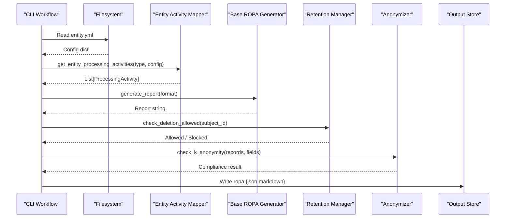

**Diagram sources**
- [generate_ropa.py:226-297](file://tools/qoder/workflows/generate_ropa.py#L226-L297)
- [entity_ropa.py:39-760](file://data/src/gdpr/entity_ropa.py#L39-L760)
- [ropa_generator.py:121-169](file://data/src/gdpr/ropa_generator.py#L121-L169)
- [retention_manager.py:206-336](file://data/src/gdpr/retention_manager.py#L206-L336)
- [anonymizer.py:127-143](file://data/src/gdpr/anonymizer.py#L127-L143)

## Detailed Component Analysis

### CLI Workflow: Automated ROPA Generation
- Loads entity.yml via YAML parser with fallback simple parser.
- Resolves entity type and country from configuration.
- Invokes entity-specific activity mapper to collect processing activities.
- Renders report in JSON or Markdown and writes to output directory structure organized by country and entity type.
- Supports single-entity, country-wide, and all-countries batch generation.

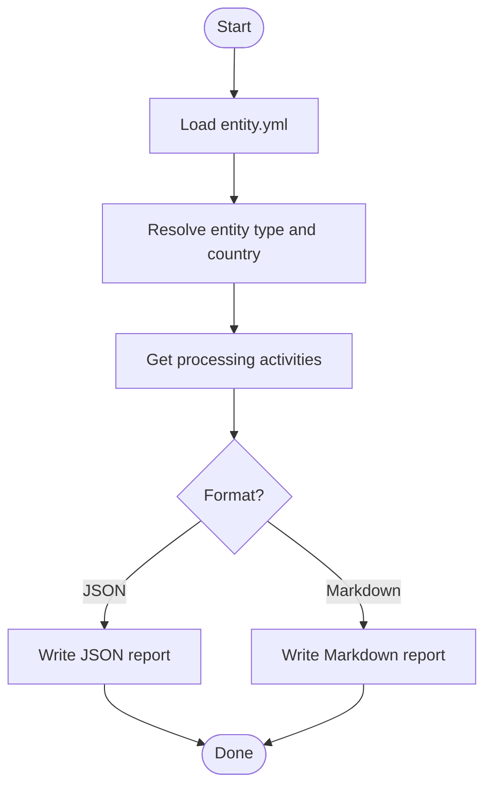

**Diagram sources**
- [generate_ropa.py:164-190](file://tools/qoder/workflows/generate_ropa.py#L164-L190)
- [generate_ropa.py:226-297](file://tools/qoder/workflows/generate_ropa.py#L226-L297)
- [generate_ropa.py:356-453](file://tools/qoder/workflows/generate_ropa.py#L356-L453)
- [generate_ropa.py:455-497](file://tools/qoder/workflows/generate_ropa.py#L455-L497)

**Section sources**
- [generate_ropa.py:1-592](file://tools/qoder/workflows/generate_ropa.py#L1-L592)

### Entity-Specific Processing Activities
- Provides mappings for ten entity types (e.g., basilica, cathedral, church, funeral, cemetery).
- Each mapping returns a list of ProcessingActivity objects with purpose, legal basis, data categories, subjects, recipients, retention periods, and security measures.
- Includes sensitive data flags where applicable (e.g., religious data under Art. 9(2)(d)).
- Supplies generic fallback activities for unknown entity types.

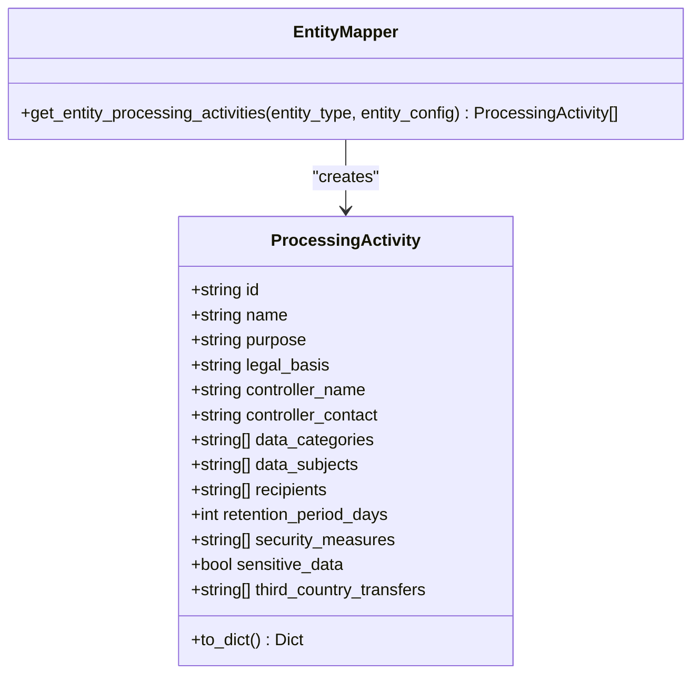

**Diagram sources**
- [ropa_generator.py:19-42](file://data/src/gdpr/ropa_generator.py#L19-L42)
- [entity_ropa.py:39-760](file://data/src/gdpr/entity_ropa.py#L39-L760)

**Section sources**
- [entity_ropa.py:39-760](file://data/src/gdpr/entity_ropa.py#L39-L760)
- [ropa_generator.py:19-100](file://data/src/gdpr/ropa_generator.py#L19-L100)

### Base ROPA Generator and Reporting
- Defines the canonical ProcessingActivity dataclass used across components.
- Generates reports in JSON or Markdown formats with consistent structure.
- Saves timestamped reports to an output directory, falling back to a temporary directory if needed.

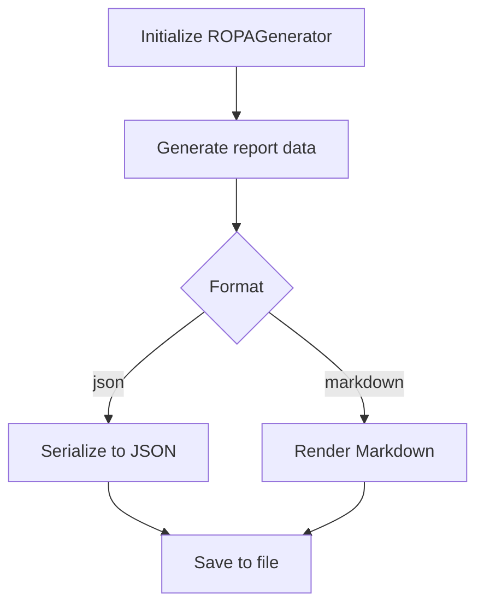

**Diagram sources**
- [ropa_generator.py:103-169](file://data/src/gdpr/ropa_generator.py#L103-L169)

**Section sources**
- [ropa_generator.py:1-182](file://data/src/gdpr/ropa_generator.py#L1-L182)

### Retention Management and Legal Holds
- Implements retention rules per data type and enforces storage limitation.
- Checks legal holds before any deletion; blocks erasure when active holds exist.
- Audits deletion attempts and outcomes, including blocked requests due to legal holds.

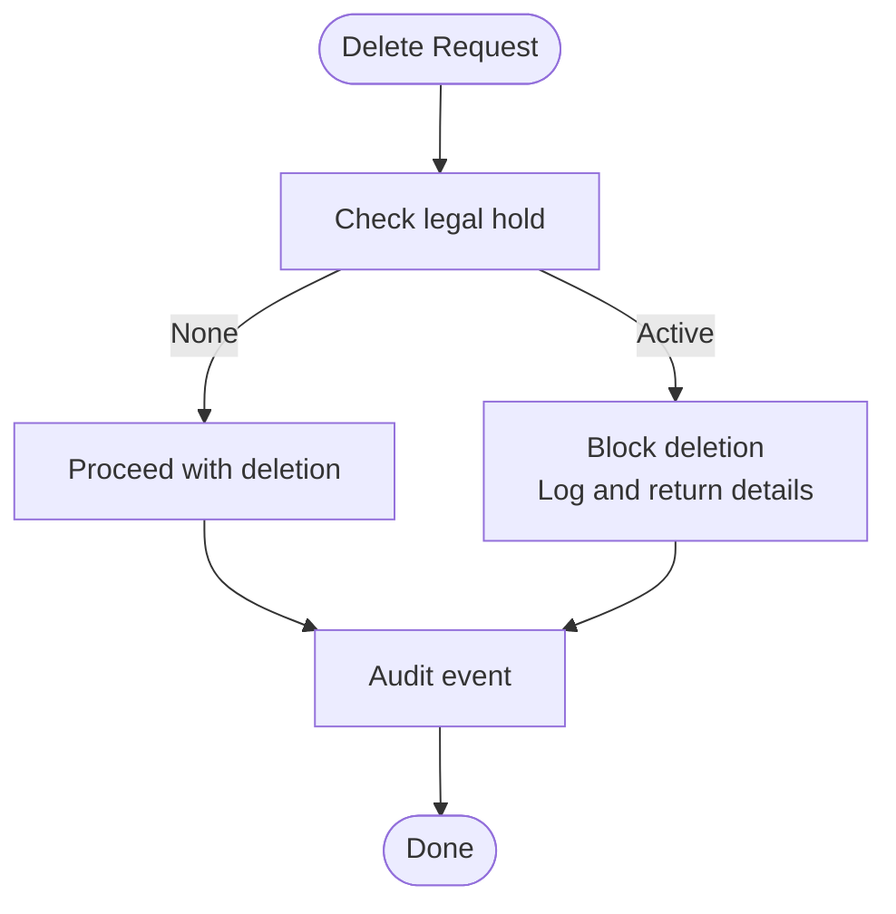

**Diagram sources**
- [retention_manager.py:188-336](file://data/src/gdpr/retention_manager.py#L188-L336)

**Section sources**
- [retention_manager.py:1-336](file://data/src/gdpr/retention_manager.py#L1-L336)

### Anonymization and Privacy Controls
- Applies k-anonymity thresholds configured per country or environment variable.
- Hashes direct identifiers and checks dataset-level k-anonymity against quasi-identifiers.
- Supports privacy-preserving analytics and reporting while maintaining compliance with national guidance.

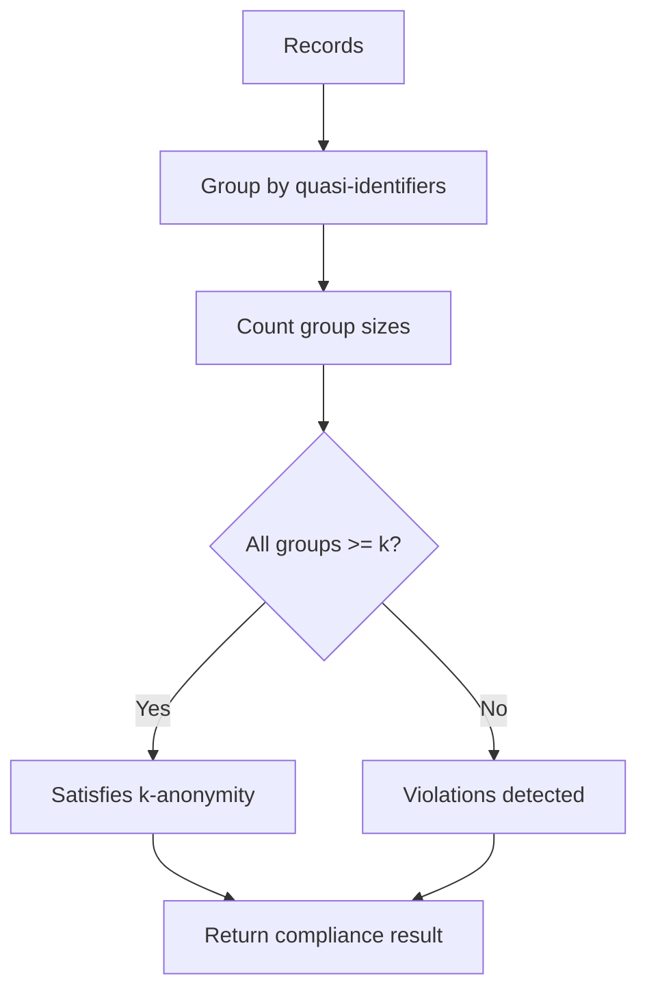

**Diagram sources**
- [anonymizer.py:127-143](file://data/src/gdpr/anonymizer.py#L127-L143)
- [anonymizer.py:160-180](file://data/src/gdpr/anonymizer.py#L160-L180)

**Section sources**
- [anonymizer.py:1-180](file://data/src/gdpr/anonymizer.py#L1-L180)

### Jurisdiction Customization (Lithuania Example)
- Country-specific GDPR implementation includes consent age, special category handling, retention periods, and data transfer restrictions.
- ROPA generation incorporates these settings into reports and validation flows.

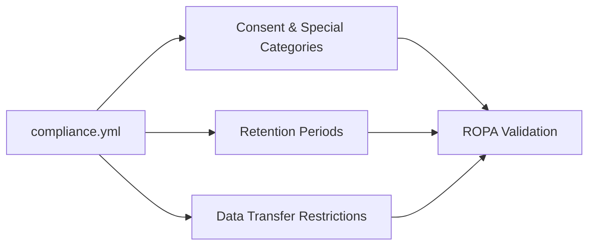

**Diagram sources**
- [compliance.yml:32-147](file://countries/lt/config/compliance.yml#L32-L147)

**Section sources**
- [compliance.yml:1-201](file://countries/lt/config/compliance.yml#L1-L201)

### Generated ROPA Reports: Examples and Structure
- Sample JSON demonstrates controller metadata, entity type, compliance flags, and a list of processing activities with purposes, legal bases, retention periods, and security measures.
- Markdown rendering provides human-readable summaries suitable for audits.

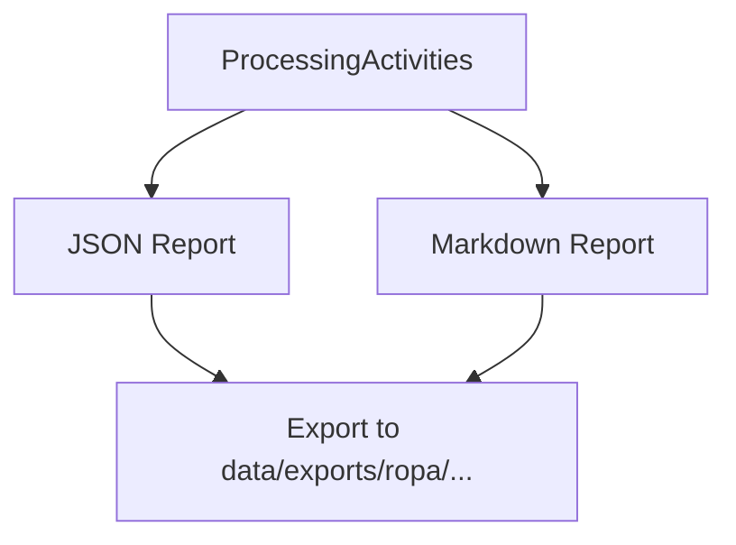

**Diagram sources**
- [lt-catholic-church-001_ropa.json:1-94](file://data/exports/ropa/lt/church/lt-catholic-church-001_ropa.json#L1-L94)
- [generate_ropa.py:356-453](file://tools/qoder/workflows/generate_ropa.py#L356-L453)

**Section sources**
- [lt-catholic-church-001_ropa.json:1-94](file://data/exports/ropa/lt/church/lt-catholic-church-001_ropa.json#L1-L94)
- [generate_ropa.py:356-453](file://tools/qoder/workflows/generate_ropa.py#L356-L453)

## Dependency Analysis
The ROPA system composes several modules with clear responsibilities and minimal coupling:

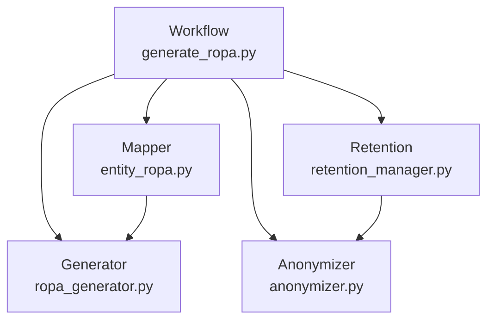

**Diagram sources**
- [generate_ropa.py:192-497](file://tools/qoder/workflows/generate_ropa.py#L192-L497)
- [entity_ropa.py:39-760](file://data/src/gdpr/entity_ropa.py#L39-L760)
- [ropa_generator.py:103-181](file://data/src/gdpr/ropa_generator.py#L103-L181)
- [retention_manager.py:188-336](file://data/src/gdpr/retention_manager.py#L188-L336)
- [anonymizer.py:106-180](file://data/src/gdpr/anonymizer.py#L106-L180)

**Section sources**
- [generate_ropa.py:192-497](file://tools/qoder/workflows/generate_ropa.py#L192-L497)
- [entity_ropa.py:39-760](file://data/src/gdpr/entity_ropa.py#L39-L760)
- [ropa_generator.py:103-181](file://data/src/gdpr/ropa_generator.py#L103-L181)
- [retention_manager.py:188-336](file://data/src/gdpr/retention_manager.py#L188-L336)
- [anonymizer.py:106-180](file://data/src/gdpr/anonymizer.py#L106-L180)

## Performance Considerations
- Batch generation scans entity directories recursively; consider filtering by entity types to reduce IO overhead.
- YAML parsing uses PyYAML with a lightweight fallback; prefer PyYAML for performance and robustness.
- Report rendering is linear in the number of activities; large entities benefit from streaming or chunked writes.
- Retention checks and anonymization are O(n) over datasets; pre-filtering and indexing can improve throughput.

[No sources needed since this section provides general guidance]

## Troubleshooting Guide
- YAML load failures: Ensure entity.yml is valid; the workflow includes a simple parser fallback.
- Missing entity type: Type aliases are handled; verify entity.yml contains a recognized type or falls back to generic activities.
- Output write errors: Verify output directory permissions; the generator may fall back to a temp directory.
- Deletion blocked by legal hold: Review active legal holds and lift them when appropriate; audit logs capture blocked attempts.
- K-anonymity violations: Adjust k threshold per country or environment; re-run anonymization checks.

**Section sources**
- [generate_ropa.py:164-190](file://tools/qoder/workflows/generate_ropa.py#L164-L190)
- [generate_ropa.py:226-297](file://tools/qoder/workflows/generate_ropa.py#L226-L297)
- [retention_manager.py:257-336](file://data/src/gdpr/retention_manager.py#L257-L336)
- [anonymizer.py:127-143](file://data/src/gdpr/anonymizer.py#L127-L143)

## Conclusion
The automated ROPA system provides a robust, configurable pipeline to generate GDPR Article 30-compliant records for all tenant entities. It leverages entity-type-specific activity definitions, jurisdictional compliance settings, retention enforcement, and anonymization to produce audit-ready documentation. The modular architecture supports scalability, customization, and integration with broader compliance tooling.

[No sources needed since this section summarizes without analyzing specific files]

## Appendices

### Integration with Compliance Tools
- Compliance testing scripts validate GDPR, SOC2, PCI-DSS, and audit log integrity, producing overall scores and detailed results.
- Audit logging captures GDPR-related events and supports chain verification for tamper-evident records.

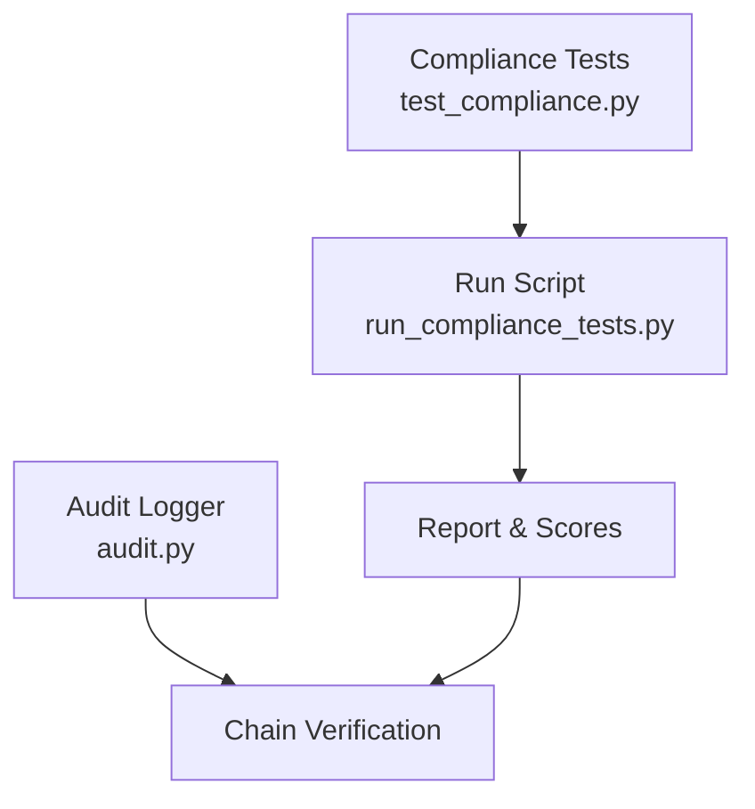

**Diagram sources**
- [test_compliance.py:1121-1153](file://data/tests/test_compliance.py#L1121-L1153)
- [run_compliance_tests.py:180-215](file://scripts/run_compliance_tests.py#L180-L215)
- [audit.py:428-528](file://data/src/audit.py#L428-L528)

**Section sources**
- [test_compliance.py:38-1161](file://data/tests/test_compliance.py#L38-L1161)
- [run_compliance_tests.py:139-215](file://scripts/run_compliance_tests.py#L139-L215)
- [audit.py:428-528](file://data/src/audit.py#L428-L528)

### Relationship Between ROPA Generation and Other Platform Features
- Entity configurations include website, store, and CRM integrations; ROPA captures recipients and data categories relevant to these features.
- Retention policies align with canon law and tax requirements; ROPA documents retention periods and exceptions.
- Anonymization supports analytics and reporting without compromising privacy.

**Section sources**
- [entity.yml:40-76](file://countries/lt/examples/catholic/church/st-john-vilnius/entity.yml#L40-L76)
- [compliance.yml:136-147](file://countries/lt/config/compliance.yml#L136-L147)
- [anonymizer.py:25-83](file://data/src/gdpr/anonymizer.py#L25-L83)