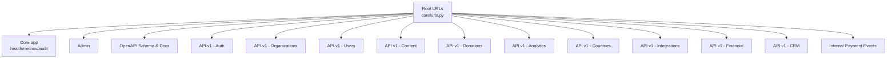
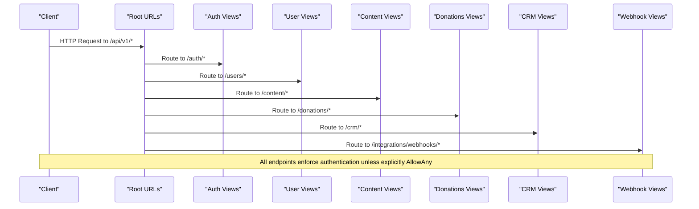
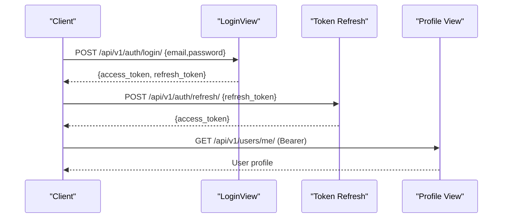
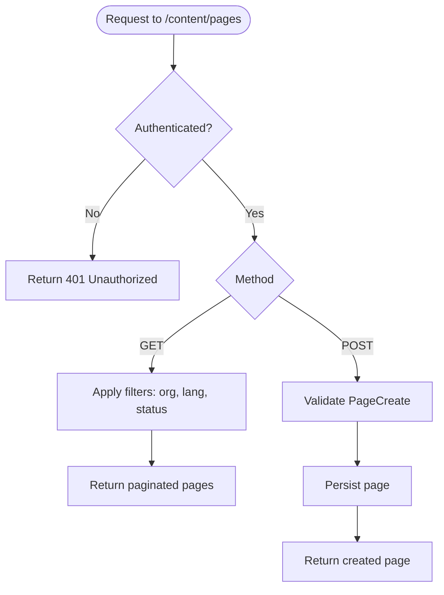
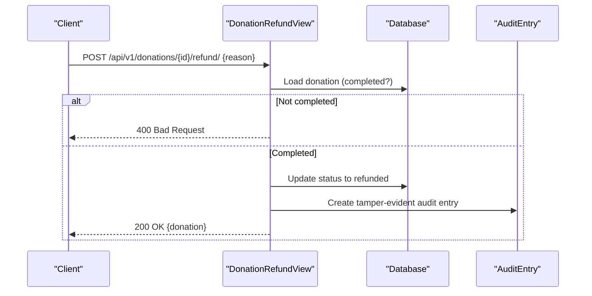
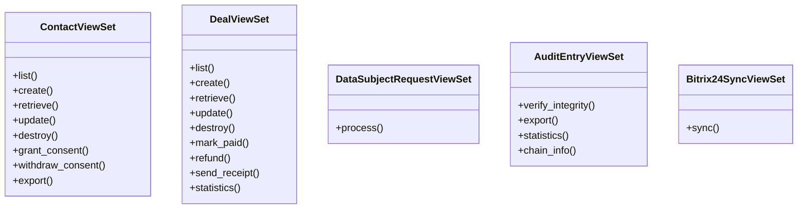
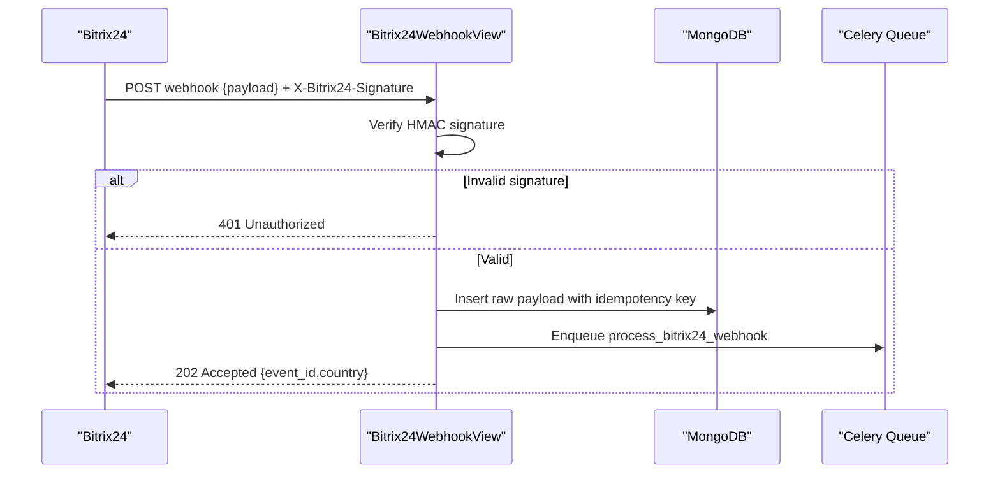
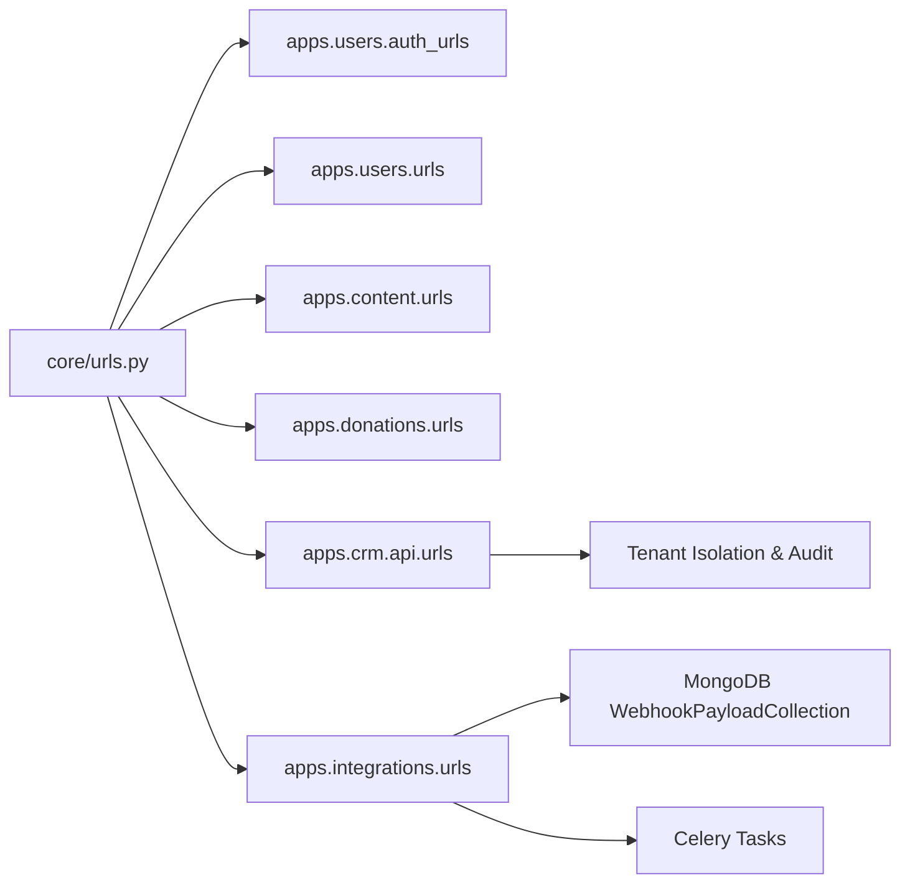

# API Reference

<cite>
**Referenced Files in This Document**
- [urls.py](file://backend/django/core/urls.py)
- [openapi-spec.yaml](file://docs/api/openapi-spec.yaml)
- [auth_urls.py](file://backend/django/apps/users/auth_urls.py)
- [users/urls.py](file://backend/django/apps/users/urls.py)
- [users/views.py](file://backend/django/apps/users/views.py)
- [content/urls.py](file://backend/django/apps/content/urls.py)
- [content/views.py](file://backend/django/apps/content/views.py)
- [donations/urls.py](file://backend/django/apps/donations/urls.py)
- [donations/views.py](file://backend/django/apps/donations/views.py)
- [crm/api/urls.py](file://backend/django/apps/crm/api/urls.py)
- [crm/api/views.py](file://backend/django/apps/crm/api/views.py)
- [integrations/urls.py](file://backend/django/apps/integrations/urls.py)
- [integrations/views.py](file://backend/django/apps/integrations/views.py)
</cite>

## Table of Contents
1. Introduction
2. Project Structure
3. Core Components
4. Architecture Overview
5. Detailed Component Analysis
6. Dependency Analysis
7. Performance Considerations
8. Troubleshooting Guide
9. Conclusion

## Introduction
This document provides comprehensive API documentation for the JOL-HUB platform’s public interfaces. It covers RESTful endpoints for authentication, user management, content management (CMS), donations and payments, CRM integration with Bitrix24, webhooks for external services, and operational endpoints such as health checks and metrics. Authentication uses OAuth 2.0 Bearer tokens, versioning is via URL path (/api/v1/), and rate limiting is enforced per user or service account. The OpenAPI specification is available at /api/schema/.

## Project Structure
The Django application exposes a unified root URL configuration that mounts:
- Health, metrics, and core utilities under the root path
- Admin interface
- OpenAPI schema and UIs
- Versioned API v1 routes grouped by domain: auth, organizations, users, content, donations, analytics, countries, integrations, financial, and crm
- Internal payment events receiver

**Diagram sources**
- [urls.py:39-66](file://backend/django/core/urls.py#L39-L66)

**Section sources**
- [urls.py:39-66](file://backend/django/core/urls.py#L39-L66)

## Core Components
- Authentication and User Management: JWT-based login, logout, token refresh, profile access, GDPR rights (access/export/delete), password change, user listing/detail.
- Content Management: Pages and media CRUD, publish action, filtering by organization/language/status.
- Donations and Payments: Create donation, retrieve details, refund with audit trail and throttling.
- CRM Integration: Contacts, deals, data subject requests, audit log, Bitrix24 sync operations; tenant isolation and compliance controls.
- Webhooks: PayPal and Bitrix24 webhook receivers with idempotency, signature verification, and async processing.
- Operational: Health probes, Prometheus metrics, maintenance mode.

**Section sources**
- [auth_urls.py:1-22](file://backend/django/apps/users/auth_urls.py#L1-L22)
- [users/urls.py:1-29](file://backend/django/apps/users/urls.py#L1-L29)
- [users/views.py:31-352](file://backend/django/apps/users/views.py#L31-L352)
- [content/urls.py:1-13](file://backend/django/apps/content/urls.py#L1-L13)
- [content/views.py:14-84](file://backend/django/apps/content/views.py#L14-L84)
- [donations/urls.py:1-11](file://backend/django/apps/donations/urls.py#L1-L11)
- [donations/views.py:24-176](file://backend/django/apps/donations/views.py#L24-L176)
- [crm/api/urls.py:1-32](file://backend/django/apps/crm/api/urls.py#L1-L32)
- [crm/api/views.py:132-769](file://backend/django/apps/crm/api/views.py#L132-L769)
- [integrations/urls.py:1-17](file://backend/django/apps/integrations/urls.py#L1-L17)
- [integrations/views.py:30-332](file://backend/django/apps/integrations/views.py#L30-L332)

## Architecture Overview
The API surface is organized by domain under /api/v1/. Each domain has its own URLconf and views handling request/response logic, serializers, permissions, and throttling. OpenAPI schema generation is provided via DRF Spectacular.

**Diagram sources**
- [urls.py:39-66](file://backend/django/core/urls.py#L39-L66)

## Detailed Component Analysis

### Authentication and User Management
- Endpoints:
  - POST /api/v1/auth/register/ — create user
  - POST /api/v1/auth/login/ — obtain JWT pair
  - POST /api/v1/auth/logout/ — blacklist refresh token
  - POST /api/v1/auth/refresh/ — refresh access token
  - GET/PATCH /api/v1/users/me/ — current user profile
  - POST /api/v1/users/me/change-password/ — change password
  - GET /api/v1/users/me/gdpr/access/ — data inventory summary
  - GET /api/v1/users/me/gdpr/export/ — full DSAR export
  - DELETE /api/v1/users/me/gdpr/delete/ — right to erasure
  - GET /api/v1/users/ — list users (admin-scoped)
  - GET/PATCH/DELETE /api/v1/users/{id}/ — user detail operations

- Authentication: Bearer token required except register/login.
- Rate Limiting: Sensitive endpoints are throttled (login, GDPR export/delete).
- Error Handling: Standardized error responses; legal hold checks block deletion when applicable.

**Diagram sources**
- [auth_urls.py:16-21](file://backend/django/apps/users/auth_urls.py#L16-L21)
- [users/views.py:40-70](file://backend/django/apps/users/views.py#L40-L70)
- [users/views.py:73-85](file://backend/django/apps/users/views.py#L73-L85)

**Section sources**
- [auth_urls.py:1-22](file://backend/django/apps/users/auth_urls.py#L1-L22)
- [users/urls.py:1-29](file://backend/django/apps/users/urls.py#L1-L29)
- [users/views.py:31-352](file://backend/django/apps/users/views.py#L31-L352)

### Content Management (CMS)
- Endpoints:
  - GET/POST /api/v1/content/pages/ — list/create pages
  - GET/PATCH/DELETE /api/v1/content/pages/{id}/ — page detail
  - POST /api/v1/content/pages/{id}/publish/ — publish page
  - GET/POST /api/v1/content/media/ — list/create media
  - GET/DELETE /api/v1/content/media/{id}/ — media detail

- Filtering: organization_id, language, status supported on list.
- Permissions: IsAuthenticated required.

**Diagram sources**
- [content/views.py:14-55](file://backend/django/apps/content/views.py#L14-L55)

**Section sources**
- [content/urls.py:1-13](file://backend/django/apps/content/urls.py#L1-L13)
- [content/views.py:14-84](file://backend/django/apps/content/views.py#L14-L84)

### Donations and Payments
- Endpoints:
  - GET/POST /api/v1/donations/ — list/create donations
  - GET /api/v1/donations/{id}/ — donation detail
  - POST /api/v1/donations/{id}/refund/ — process refund

- Security and Compliance:
  - Throttling on POST and refund actions
  - Tamper-evident audit entries for refunds
  - PCI-DSS and SOC2 logging requirements

**Diagram sources**
- [donations/views.py:59-168](file://backend/django/apps/donations/views.py#L59-L168)

**Section sources**
- [donations/urls.py:1-11](file://backend/django/apps/donations/urls.py#L1-L11)
- [donations/views.py:24-176](file://backend/django/apps/donations/views.py#L24-L176)

### CRM Integration (Bitrix24)
- Endpoints:
  - Contacts: list/create/retrieve/update/delete with tenant isolation
  - Deals: list/create/retrieve/update/delete; mark_paid, refund, send_receipt, statistics
  - Data Subject Requests: process access/erasure requests
  - Audit Log: read-only access, verify integrity, export, statistics, chain info
  - Bitrix24 Sync: queue entity sync operations

- Controls:
  - Tenant isolation mixin enforces organization scoping
  - Role-based permissions (IsOrganizationMember)
  - Throttling per operation type (CRM, financial, GDPR)
  - Consent management endpoints for contacts

**Diagram sources**
- [crm/api/views.py:132-769](file://backend/django/apps/crm/api/views.py#L132-L769)
- [crm/api/urls.py:18-31](file://backend/django/apps/crm/api/urls.py#L18-L31)

**Section sources**
- [crm/api/urls.py:1-32](file://backend/django/apps/crm/api/urls.py#L1-L32)
- [crm/api/views.py:132-769](file://backend/django/apps/crm/api/views.py#L132-L769)

### Webhooks and External Integrations
- PayPal Webhook:
  - POST /api/v1/integrations/webhooks/paypal/
  - Idempotent ingestion using PayPal transmission ID
  - Async processing via Celery task

- Bitrix24 Webhook:
  - POST /api/v1/integrations/webhooks/bitrix24/
  - HMAC-SHA256 signature verification
  - Idempotency via event_id or body hash
  - MongoDB storage of raw payload
  - Async processing with country routing for GDPR Article 44

- Health:
  - GET /api/v1/integrations/webhooks/bitrix24/health/
  - Circuit breaker status and audit chain verification

**Diagram sources**
- [integrations/views.py:54-293](file://backend/django/apps/integrations/views.py#L54-L293)

**Section sources**
- [integrations/urls.py:1-17](file://backend/django/apps/integrations/urls.py#L1-L17)
- [integrations/views.py:30-332](file://backend/django/apps/integrations/views.py#L30-L332)

### OpenAPI Specification and Documentation
- Schema endpoint: /api/schema/
- Swagger UI: /api/docs/
- ReDoc: /api/redoc/
- Servers: production, staging, local development
- Authentication: Bearer token in Authorization header
- Rate Limits: 100 req/min per user; 1000 req/min per service account
- Versioning: /api/v1/

**Section sources**
- [openapi-spec.yaml:1-42](file://docs/api/openapi-spec.yaml#L1-L42)

## Dependency Analysis
- Routing: Root URL configuration includes all domain apps under /api/v1/
- Views depend on serializers, models, permissions, and throttling classes
- CRM views use tenant isolation middleware and audit logging
- Webhooks rely on MongoDB for raw payloads and Celery for background tasks

**Diagram sources**
- [urls.py:39-66](file://backend/django/core/urls.py#L39-L66)
- [crm/api/views.py:83-126](file://backend/django/apps/crm/api/views.py#L83-L126)
- [integrations/views.py:201-276](file://backend/django/apps/integrations/views.py#L201-L276)

**Section sources**
- [urls.py:39-66](file://backend/django/core/urls.py#L39-L66)
- [crm/api/views.py:83-126](file://backend/django/apps/crm/api/views.py#L83-L126)
- [integrations/views.py:201-276](file://backend/django/apps/integrations/views.py#L201-L276)

## Performance Considerations
- Throttling:
  - Authentication endpoints: strict limits to prevent brute force
  - Donation creation/refund: stricter limits to mitigate fraud
  - GDPR export/delete: limited to prevent scraping and abuse
  - CRM operations: standard rate limits; financial actions further restricted
- Query Optimization:
  - Select related fields for performance (e.g., organization, author)
  - Pagination and filtering on list endpoints
- Asynchronous Processing:
  - Webhooks return quickly and enqueue tasks for heavy processing
  - Use MongoDB for high-throughput raw payload storage

[No sources needed since this section provides general guidance]

## Troubleshooting Guide
- Authentication Errors:
  - Ensure Bearer token is present and valid
  - Use refresh endpoint to obtain new access tokens
- Permission Denied:
  - Verify user role and organization membership
  - CRM endpoints require tenant context; ensure proper headers
- Webhook Issues:
  - Validate HMAC signature and secret configuration
  - Check idempotency keys to avoid duplicate processing
  - Use health endpoint to inspect circuit breaker and audit chain status
- GDPR Rights:
  - Access/export/delete endpoints are rate-limited
  - Deletion blocked if legal holds are active; contact legal support

**Section sources**
- [users/views.py:56-70](file://backend/django/apps/users/views.py#L56-L70)
- [users/views.py:88-148](file://backend/django/apps/users/views.py#L88-L148)
- [users/views.py:196-334](file://backend/django/apps/users/views.py#L196-L334)
- [integrations/views.py:101-148](file://backend/django/apps/integrations/views.py#L101-L148)
- [integrations/views.py:296-332](file://backend/django/apps/integrations/views.py#L296-L332)

## Conclusion
JOL-HUB provides a robust, compliant, and well-structured API surface covering authentication, user management, CMS, donations, CRM integration, and webhooks. The system emphasizes security (OAuth 2.0, tenant isolation, audit trails), compliance (GDPR, PCI-DSS, SOC2), and performance (throttling, pagination, async processing). Use the OpenAPI schema for client integration and adhere to rate limits and authentication requirements.

[No sources needed since this section summarizes without analyzing specific files]