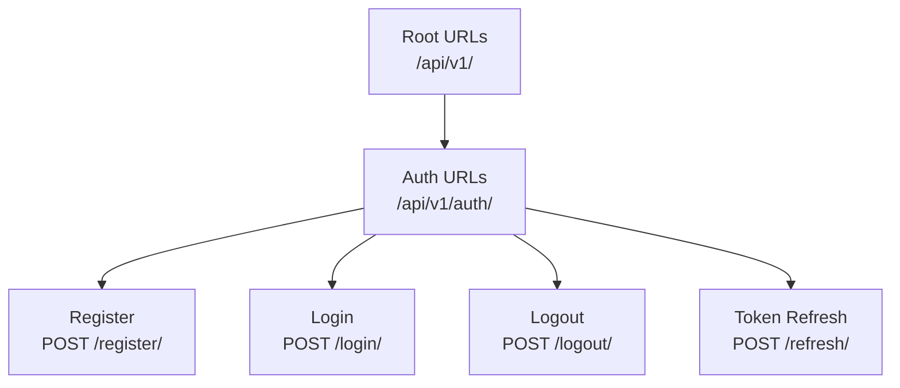
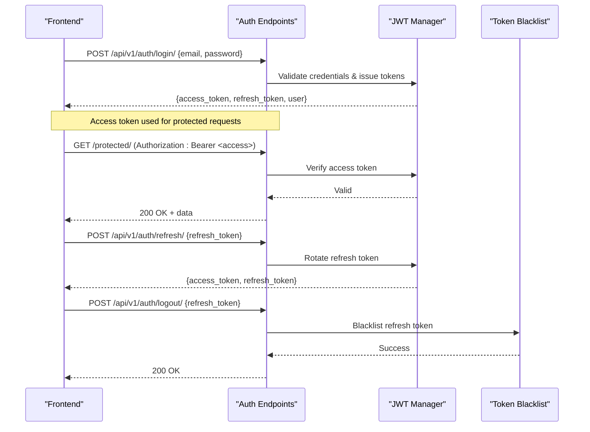
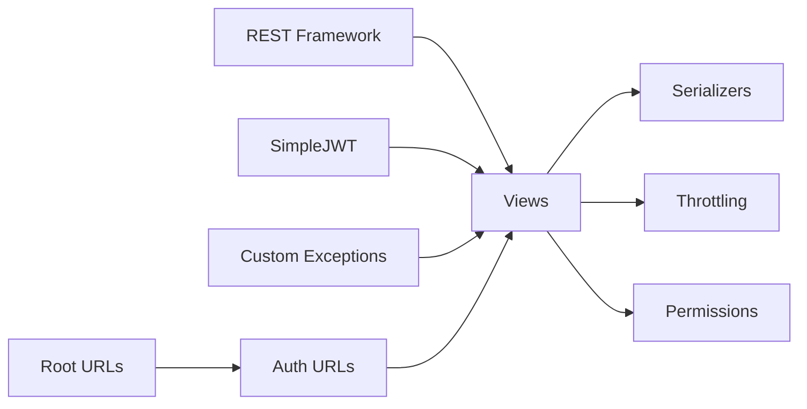

# Authentication API

<cite>
**Referenced Files in This Document**
- [auth_urls.py](file://backend/django/apps/users/auth_urls.py)
- [views.py](file://backend/django/apps/users/views.py)
- [serializers.py](file://backend/django/apps/users/serializers.py)
- [throttling.py](file://backend/django/apps/core/throttling.py)
- [base.py](file://backend/django/core/settings/base.py)
- [urls.py](file://backend/django/core/urls.py)
- [models.py](file://backend/django/apps/users/models.py)
- [exceptions.py](file://backend/django/apps/core/exceptions.py)
</cite>

## Table of Contents
1. [Introduction](#introduction)
2. [Project Structure](#project-structure)
3. [Core Components](#core-components)
4. [Architecture Overview](#architecture-overview)
5. [Detailed Component Analysis](#detailed-component-analysis)
6. [Dependency Analysis](#dependency-analysis)
7. [Performance Considerations](#performance-considerations)
8. [Troubleshooting Guide](#troubleshooting-guide)
9. [Conclusion](#conclusion)
10. [Appendices](#appendices)

## Introduction
This document provides comprehensive API documentation for the authentication endpoints in JOL-HUB. It covers HTTP methods, URL patterns, request/response schemas, OAuth 2.0 Bearer token usage, login/logout flows, token refresh mechanisms, session management, and error handling strategies. It also includes security considerations, rate limiting for authentication attempts, and integration patterns with frontend applications.

JOL-HUB uses Django REST Framework with JWT (JSON Web Tokens) via djangorestframework-simplejwt for stateless authentication. Session-based authentication is also available through Django sessions. Social authentication is supported via django-allauth under /accounts/.

## Project Structure
Authentication endpoints are defined in the users app and mounted under /api/v1/auth/. The root URL configuration mounts these routes alongside other API namespaces.

**Diagram sources**
- [urls.py:52-55](file://backend/django/core/urls.py#L52-L55)
- [auth_urls.py:16-21](file://backend/django/apps/users/auth_urls.py#L16-L21)

**Section sources**
- [urls.py:52-55](file://backend/django/core/urls.py#L52-L55)
- [auth_urls.py:16-21](file://backend/django/apps/users/auth_urls.py#L16-L21)

## Core Components
- RegisterView: Creates a new user account.
- LoginView: Issues JWT access and refresh tokens.
- TokenRefreshViewExtended: Refreshes an expired access token using a valid refresh token.
- LogoutView: Blacklists the refresh token to invalidate the session.
- Throttling: Rate limits protect against brute force and abuse on auth endpoints.
- JWT Configuration: Defines token lifetimes, rotation, blacklisting, and header types.
- Exception Handling: Uniform JSON error envelopes for consistent client behavior.

**Section sources**
- [views.py:31-70](file://backend/django/apps/users/views.py#L31-L70)
- [throttling.py:18-35](file://backend/django/apps/core/throttling.py#L18-L35)
- [base.py:282-355](file://backend/django/core/settings/base.py#L282-L355)
- [exceptions.py:10-49](file://backend/django/apps/core/exceptions.py#L10-L49)

## Architecture Overview
The authentication flow uses JWTs for secure, stateless API access. Clients obtain tokens via login, include them as Bearer tokens in Authorization headers, and refresh them when needed. Logout invalidates the refresh token server-side.

**Diagram sources**
- [views.py:40-70](file://backend/django/apps/users/views.py#L40-L70)
- [base.py:330-355](file://backend/django/core/settings/base.py#L330-L355)

## Detailed Component Analysis

### Authentication Endpoints

#### Register
- Method: POST
- URL: /api/v1/auth/register/
- Authentication: None (public)
- Request body fields:
  - email: string (required)
  - first_name: string (optional)
  - last_name: string (optional)
  - password: string (required)
  - password_confirm: string (required)
  - gdpr_consent: boolean (optional)
  - marketing_consent: boolean (optional)
- Response:
  - On success: 201 Created with user object
  - On validation error: 400 Bad Request with uniform error envelope
- Notes:
  - Passwords must meet configured validators.
  - Consent timestamps are set when consent flags are true.
  - Rate limited by both anonymous and user throttles.

**Section sources**
- [auth_urls.py:17](file://backend/django/apps/users/auth_urls.py#L17)
- [views.py:31-38](file://backend/django/apps/users/views.py#L31-L38)
- [serializers.py:53-85](file://backend/django/apps/users/serializers.py#L53-L85)
- [throttling.py:28-35](file://backend/django/apps/core/throttling.py#L28-L35)

#### Login
- Method: POST
- URL: /api/v1/auth/login/
- Authentication: None (public)
- Request body fields:
  - email: string (required)
  - password: string (required)
- Response:
  - On success: 200 OK with { access_token, refresh_token, user }
  - On failure: 400/401 with uniform error envelope
- Notes:
  - Uses extended serializer to embed user profile in response.
  - Rate limited to prevent brute force attacks.

**Section sources**
- [auth_urls.py:18](file://backend/django/apps/users/auth_urls.py#L18)
- [views.py:40-49](file://backend/django/apps/users/views.py#L40-L49)
- [serializers.py:102-108](file://backend/django/apps/users/serializers.py#L102-L108)
- [throttling.py:18-35](file://backend/django/apps/core/throttling.py#L18-L35)

#### Logout
- Method: POST
- URL: /api/v1/auth/logout/
- Authentication: Required (Bearer token)
- Request body fields:
  - refresh_token: string (required)
- Response:
  - On success: 200 OK with message
  - On missing field: 400 Bad Request
- Notes:
  - Blacklists the refresh token to invalidate it.
  - Requires IsAuthenticated permission.

**Section sources**
- [auth_urls.py:19](file://backend/django/apps/users/auth_urls.py#L19)
- [views.py:56-70](file://backend/django/apps/users/views.py#L56-L70)

#### Token Refresh
- Method: POST
- URL: /api/v1/auth/refresh/
- Authentication: None (public)
- Request body fields:
  - refresh_token: string (required)
- Response:
  - On success: 200 OK with { access_token, refresh_token }
  - On failure: 400/401 with uniform error envelope
- Notes:
  - Rotates refresh tokens and blacklists old ones per settings.

**Section sources**
- [auth_urls.py:20](file://backend/django/apps/users/auth_urls.py#L20)
- [views.py:52-54](file://backend/django/apps/users/views.py#L52-L54)
- [base.py:330-355](file://backend/django/core/settings/base.py#L330-L355)

### Protected User Profile
- Methods: GET, PATCH
- URL: /api/v1/users/me/
- Authentication: Required (Bearer token)
- Response:
  - GET: Returns current user profile including full_name and nested profile
  - PATCH: Updates allowed fields; returns updated profile
- Notes:
  - Read-only fields include identifiers, timestamps, and verification flags.

**Section sources**
- [views.py:73-85](file://backend/django/apps/users/views.py#L73-L85)
- [serializers.py:19-40](file://backend/django/apps/users/serializers.py#L19-L40)

### Password Change
- Method: POST
- URL: /api/v1/users/me/change-password/
- Authentication: Required (Bearer token)
- Request body fields:
  - old_password: string (required)
  - new_password: string (required)
- Response:
  - On success: 200 OK with message
  - On validation error: 400 Bad Request
- Notes:
  - Validates old password and enforces password policy.

**Section sources**
- [views.py:164-174](file://backend/django/apps/users/views.py#L164-L174)
- [serializers.py:88-99](file://backend/django/apps/users/serializers.py#L88-L99)

### Social Authentication (OAuth 2.0 via Allauth)
- Base path: /accounts/
- Supported providers: Google, Facebook
- Usage:
  - Redirect clients to /accounts/google/login/, /accounts/facebook/login/ for provider-specific flows.
  - After successful provider authentication, clients can obtain session or tokens depending on configuration.
- Notes:
  - Allauth middleware is enabled.
  - CORS allows credentials and common headers.

**Section sources**
- [urls.py:68-69](file://backend/django/core/urls.py#L68-L69)
- [base.py:67-72](file://backend/django/core/settings/base.py#L67-L72)
- [base.py:549-577](file://backend/django/core/settings/base.py#L549-L577)

## Dependency Analysis
Authentication depends on:
- Django REST Framework for views, serializers, permissions, and throttling.
- SimpleJWT for token issuance, verification, rotation, and blacklisting.
- Custom throttles for sensitive endpoints.
- Custom exception handler for consistent error responses.
- Root URL configuration mounting auth routes.

**Diagram sources**
- [base.py:282-355](file://backend/django/core/settings/base.py#L282-L355)
- [urls.py:52-55](file://backend/django/core/urls.py#L52-L55)
- [auth_urls.py:16-21](file://backend/django/apps/users/auth_urls.py#L16-L21)
- [views.py:13-26](file://backend/django/apps/users/views.py#L13-L26)
- [exceptions.py:10-49](file://backend/django/apps/core/exceptions.py#L10-L49)

**Section sources**
- [base.py:282-355](file://backend/django/core/settings/base.py#L282-L355)
- [urls.py:52-55](file://backend/django/core/urls.py#L52-L55)
- [auth_urls.py:16-21](file://backend/django/apps/users/auth_urls.py#L16-L21)
- [views.py:13-26](file://backend/django/apps/users/views.py#L13-L26)
- [exceptions.py:10-49](file://backend/django/apps/core/exceptions.py#L10-L49)

## Performance Considerations
- Token lifetimes:
  - Access tokens expire quickly (short-lived) to reduce risk if compromised.
  - Refresh tokens have longer lifetimes and rotate on use.
- Rotation and blacklisting:
  - Enabled to ensure invalidated tokens cannot be reused.
- Rate limiting:
  - Strict limits on auth endpoints to mitigate brute force and credential stuffing.
- CORS:
  - Configured to allow specific origins and credentials for frontend integration.

[No sources needed since this section provides general guidance]

## Troubleshooting Guide
Common issues and resolutions:
- Invalid credentials:
  - Ensure correct email/password pair; check for case sensitivity and whitespace.
  - Review error envelope for details.
- Token expired:
  - Use /api/v1/auth/refresh/ with a valid refresh token.
  - If refresh fails, re-authenticate via login.
- Logout not working:
  - Ensure refresh_token is included in logout request.
  - Confirm token was not already blacklisted.
- Validation errors:
  - Check request payload against schema; fix missing or invalid fields.
  - Error envelope will include field-level details.
- Rate limited:
  - Wait before retrying; consider implementing exponential backoff.
  - Monitor logs for throttle events.

**Section sources**
- [views.py:40-70](file://backend/django/apps/users/views.py#L40-L70)
- [exceptions.py:10-49](file://backend/django/apps/core/exceptions.py#L10-L49)
- [throttling.py:18-35](file://backend/django/apps/core/throttling.py#L18-L35)

## Conclusion
JOL-HUB’s authentication API provides secure, scalable, and compliant mechanisms for user registration, login, logout, and token management. JWTs enable stateless API access with robust rotation and blacklisting. Rate limiting and consistent error handling improve security and developer experience. Social authentication via Allauth supports OAuth 2.0 flows for Google and Facebook. Frontend applications should implement proper token storage, refresh logic, and error handling to ensure seamless user experiences.

[No sources needed since this section summarizes without analyzing specific files]

## Appendices

### Security Considerations
- HTTPS enforcement and secure cookies are configurable.
- CSRF protection is enabled for session-based flows.
- CORS is restricted to trusted origins with credentials support.
- Password policies enforce complexity and uniqueness.
- Audit logging and rate limiting help detect and prevent abuse.

**Section sources**
- [base.py:519-537](file://backend/django/core/settings/base.py#L519-L537)
- [base.py:549-577](file://backend/django/core/settings/base.py#L549-L577)
- [base.py:194-210](file://backend/django/core/settings/base.py#L194-L210)
- [throttling.py:18-35](file://backend/django/apps/core/throttling.py#L18-L35)

### Integration Patterns with Frontend Applications
- Stateless JWT flow:
  - Store access and refresh tokens securely (e.g., httpOnly cookies or memory).
  - Include Authorization: Bearer <access_token> on protected requests.
  - Implement automatic refresh on 401 responses using /api/v1/auth/refresh/.
- Session-based flow:
  - Use browser sessions for interactive UIs; handle CSRF tokens where required.
- Social login:
  - Redirect to /accounts/<provider>/login/ and handle callback to establish session or obtain tokens.

**Section sources**
- [base.py:282-355](file://backend/django/core/settings/base.py#L282-L355)
- [urls.py:68-69](file://backend/django/core/urls.py#L68-L69)