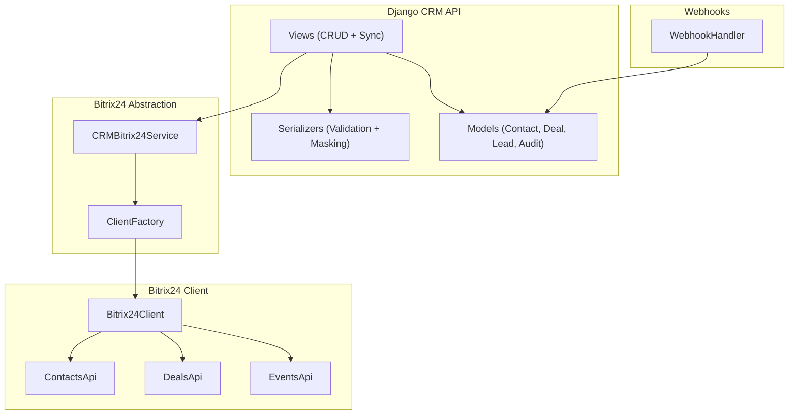
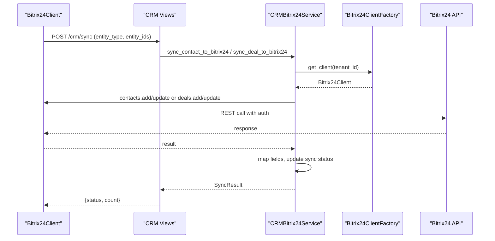
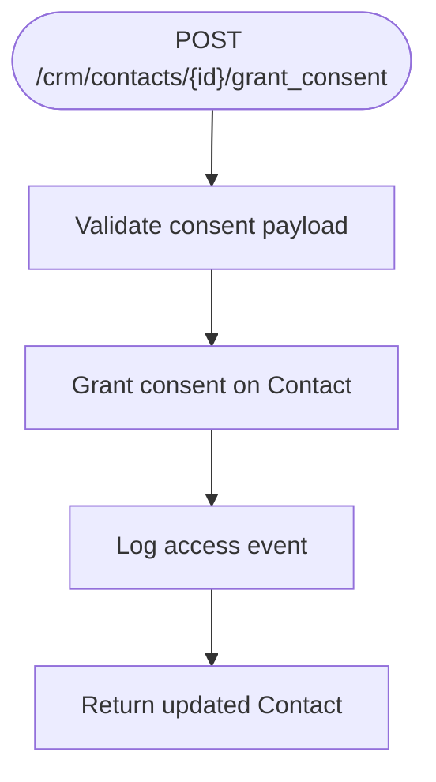
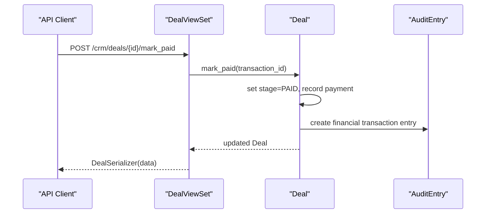
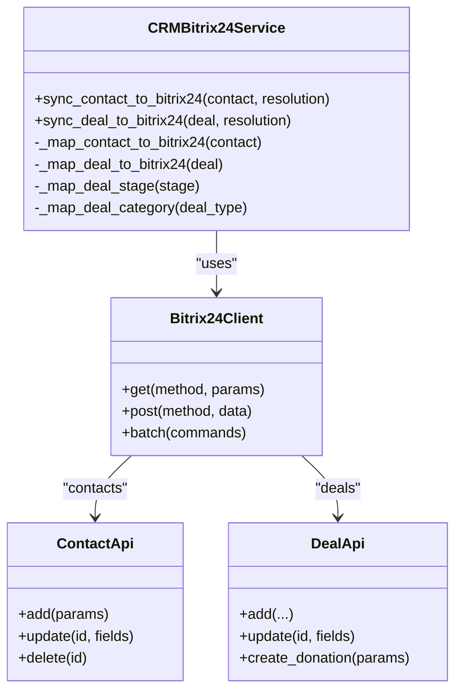
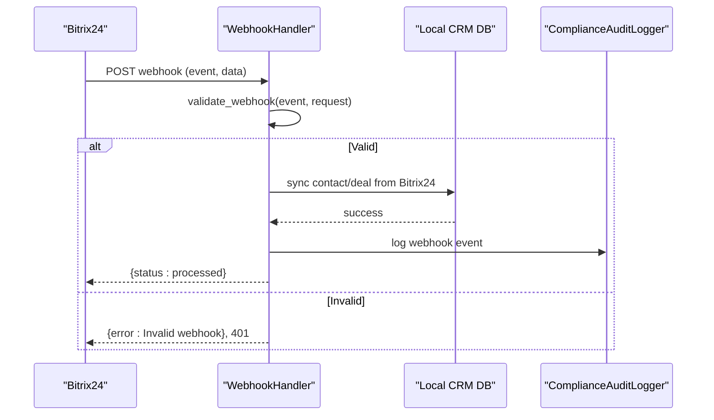
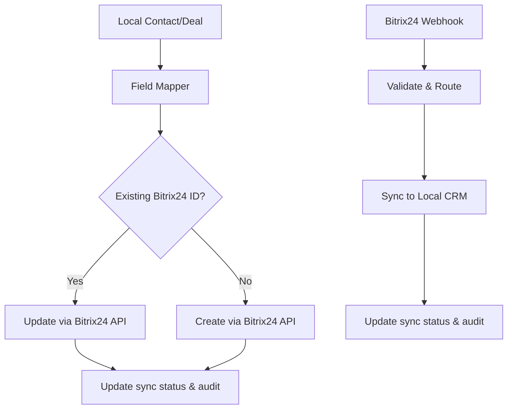
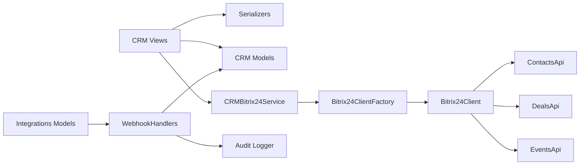

# CRM Integration API

<cite>
**Referenced Files in This Document**
- [models.py](file://backend/django/apps/crm/models.py)
- [views.py](file://backend/django/apps/crm/api/views.py)
- [serializers.py](file://backend/django/apps/crm/api/serializers.py)
- [bitrix24_service.py](file://backend/django/apps/crm/bitrix24_service.py)
- [client.py](file://backend/integrations/bitrix24/client.py)
- [contacts.py](file://backend/integrations/bitrix24/api/contacts.py)
- [deals.py](file://backend/integrations/bitrix24/api/deals.py)
- [events.py](file://backend/integrations/bitrix24/api/events.py)
- [handlers.py](file://backend/integrations/bitrix24/webhooks/handlers.py)
- [integrations_models.py](file://backend/django/apps/integrations/models.py)
</cite>

## Table of Contents
1. Introduction
2. Project Structure
3. Core Components
4. Architecture Overview
5. Detailed Component Analysis
6. Dependency Analysis
7. Performance Considerations
8. Troubleshooting Guide
9. Conclusion
10. Appendices

## Introduction
This document provides detailed API documentation for CRM integration endpoints that enable bi-directional synchronization with Bitrix24 CRM. It covers contact management, deal tracking, lead scoring operations, webhook endpoints for external CRM events, field mapping configurations, conflict resolution strategies, request/response schemas, sync status monitoring, error handling, tenant isolation, rate limiting, and data transformation pipelines. It also includes example workflows and troubleshooting guidance for common integration issues.

## Project Structure
The CRM integration spans Django app layers and an integrations layer:
- Django CRM app exposes REST APIs for contacts, deals, audit logs, GDPR requests, and Bitrix24 sync orchestration.
- The Bitrix24 abstraction service maps local entities to Bitrix24 fields and handles sync flows with circuit breaker protection.
- The Bitrix24 client implements HTTP calls, retries, rate limiting, and batch operations.
- Webhook handlers receive Bitrix24 events and synchronize them back into the local CRM database.
- Serializers enforce GDPR-compliant serialization and validation.

**Diagram sources**
- [views.py:128-769](file://backend/django/apps/crm/api/views.py#L128-L769)
- [serializers.py:86-353](file://backend/django/apps/crm/api/serializers.py#L86-L353)
- [models.py:255-771](file://backend/django/apps/crm/models.py#L255-L771)
- [bitrix24_service.py:238-572](file://backend/django/apps/crm/bitrix24_service.py#L238-L572)
- [client.py:91-403](file://backend/integrations/bitrix24/client.py#L91-L403)
- [contacts.py:138-290](file://backend/integrations/bitrix24/api/contacts.py#L138-L290)
- [deals.py:149-386](file://backend/integrations/bitrix24/api/deals.py#L149-L386)
- [events.py:175-349](file://backend/integrations/bitrix24/api/events.py#L175-L349)
- [handlers.py:63-514](file://backend/integrations/bitrix24/webhooks/handlers.py#L63-L514)

**Section sources**
- [views.py:128-769](file://backend/django/apps/crm/api/views.py#L128-L769)
- [models.py:255-771](file://backend/django/apps/crm/models.py#L255-L771)
- [bitrix24_service.py:238-572](file://backend/django/apps/crm/bitrix24_service.py#L238-L572)
- [client.py:91-403](file://backend/integrations/bitrix24/client.py#L91-L403)
- [handlers.py:63-514](file://backend/integrations/bitrix24/webhooks/handlers.py#L63-L514)

## Core Components
- Contact, Deal, and Lead models provide tenant-scoped storage with GDPR controls, consent tracking, legal hold, and Bitrix24 sync metadata.
- ViewSets expose CRUD endpoints for contacts and deals, plus specialized actions for consent, export, payment processing, refunds, statistics, and Bitrix24 sync.
- Serializers enforce validation, tenant context injection, and GDPR-compliant field exposure (masking and special category filtering).
- Bitrix24 service maps local entities to Bitrix24 fields, performs create/update, updates sync status, and records audit entries.
- Bitrix24 client manages authentication, rate limiting, retries, batch operations, and structured error types.
- Webhook handlers validate incoming Bitrix24 webhooks, route events, and synchronize changes back to local CRM.

**Section sources**
- [models.py:255-771](file://backend/django/apps/crm/models.py#L255-L771)
- [views.py:128-769](file://backend/django/apps/crm/api/views.py#L128-L769)
- [serializers.py:86-353](file://backend/django/apps/crm/api/serializers.py#L86-L353)
- [bitrix24_service.py:238-572](file://backend/django/apps/crm/bitrix24_service.py#L238-L572)
- [client.py:91-403](file://backend/integrations/bitrix24/client.py#L91-L403)
- [handlers.py:63-514](file://backend/integrations/bitrix24/webhooks/handlers.py#L63-L514)

## Architecture Overview
The system supports bidirectional sync between local CRM and Bitrix24:
- Outbound: Local CRM creates or updates contacts and deals via Bitrix24 service, which maps fields and calls Bitrix24 APIs through a resilient client.
- Inbound: Bitrix24 sends webhooks for entity changes; handlers validate, route, and update local CRM records while maintaining audit trails.

**Diagram sources**
- [views.py:739-769](file://backend/django/apps/crm/api/views.py#L739-L769)
- [bitrix24_service.py:302-468](file://backend/django/apps/crm/bitrix24_service.py#L302-L468)
- [client.py:168-244](file://backend/integrations/bitrix24/client.py#L168-L244)

## Detailed Component Analysis

### Contact Management API
- Endpoints:
  - List, Create, Retrieve, Update, Delete contacts with tenant isolation and GDPR controls.
  - Actions: grant_consent, withdraw_consent, export (GDPR Art. 15), statistics (for deals).
- Request/Response:
  - Use serializers to define input/output shapes; minimal serializer used for list views.
  - PII masking applied when consent not granted; special category fields filtered based on permissions.
- Validation:
  - Email uniqueness per tenant; phone format checks; religious data triggers special category classification.
- Tenant Isolation:
  - All queries filtered by current tenant; object-level validation enforced.

**Diagram sources**
- [views.py:207-248](file://backend/django/apps/crm/api/views.py#L207-L248)
- [serializers.py:329-341](file://backend/django/apps/crm/api/serializers.py#L329-L341)

**Section sources**
- [views.py:128-276](file://backend/django/apps/crm/api/views.py#L128-L276)
- [serializers.py:86-174](file://backend/django/apps/crm/api/serializers.py#L86-L174)
- [models.py:255-375](file://backend/django/apps/crm/models.py#L255-L375)

### Deal Tracking API
- Endpoints:
  - List, Create, Retrieve, Update, Delete deals with financial compliance.
  - Actions: mark_paid, refund, send_receipt, statistics.
- Request/Response:
  - Payment action uses dedicated serializer; responses include deal details and read-only financial fields.
- Validation:
  - Amount non-negative; refund only allowed for paid/completed stages; receipts cannot be re-sent.
- Audit Logging:
  - Financial transactions logged with tamper-evident entries.

**Diagram sources**
- [views.py:334-387](file://backend/django/apps/crm/api/views.py#L334-L387)
- [models.py:746-771](file://backend/django/apps/crm/models.py#L746-L771)

**Section sources**
- [views.py:278-446](file://backend/django/apps/crm/api/views.py#L278-L446)
- [serializers.py:187-269](file://backend/django/apps/crm/api/serializers.py#L187-L269)
- [models.py:523-771](file://backend/django/apps/crm/models.py#L523-L771)

### Bitrix24 Sync Operations
- Endpoints:
  - POST /crm/bitrix24/sync to queue sync for contacts or deals with optional force resync.
- Field Mapping:
  - Standard fields mapped to Bitrix24 fields; custom UF_* fields mapped for religious and sacramental data.
  - Deal stages and categories mapped to Bitrix24 equivalents.
- Conflict Resolution:
  - Strategies: local_wins, remote_wins, latest_wins, manual. Default is latest_wins.
- Sync Status:
  - Entities track bitrix24_id, bitrix24_synced_at, bitrix24_sync_status (pending/synced/failed/conflict).

**Diagram sources**
- [bitrix24_service.py:238-572](file://backend/django/apps/crm/bitrix24_service.py#L238-L572)
- [client.py:91-403](file://backend/integrations/bitrix24/client.py#L91-L403)
- [contacts.py:138-290](file://backend/integrations/bitrix24/api/contacts.py#L138-L290)
- [deals.py:149-386](file://backend/integrations/bitrix24/api/deals.py#L149-L386)

**Section sources**
- [bitrix24_service.py:238-572](file://backend/django/apps/crm/bitrix24_service.py#L238-L572)
- [views.py:739-769](file://backend/django/apps/crm/api/views.py#L739-L769)
- [serializers.py:344-353](file://backend/django/apps/crm/api/serializers.py#L344-L353)

### Webhook Endpoints for External CRM Events
- Endpoint:
  - POST /webhooks/bitrix24/ receives Bitrix24 webhooks (contact add/update/delete, deal add/update/delete, calendar events).
- Validation:
  - Application token check; optional HMAC signature verification using configured secret.
- Processing:
  - Routes to specific handlers; synchronizes changes into local CRM; soft deletes or marks cancelled where appropriate.
- Audit:
  - Logs webhook processing outcomes and maintains GDPR-compliant audit trail.

**Diagram sources**
- [handlers.py:100-152](file://backend/integrations/bitrix24/webhooks/handlers.py#L100-L152)
- [handlers.py:173-291](file://backend/integrations/bitrix24/webhooks/handlers.py#L173-L291)
- [handlers.py:295-396](file://backend/integrations/bitrix24/webhooks/handlers.py#L295-L396)
- [handlers.py:486-514](file://backend/integrations/bitrix24/webhooks/handlers.py#L486-L514)

**Section sources**
- [handlers.py:63-514](file://backend/integrations/bitrix24/webhooks/handlers.py#L63-L514)
- [integrations_models.py:12-68](file://backend/django/apps/integrations/models.py#L12-L68)

### Field Mapping Configurations
- Contact mapping:
  - Standard fields: name, last name, middle name, email, phone, address components, birthdate.
  - Custom fields: religious affiliation, parish registration date, baptism dates/places, communion, confirmation, marriage dates, envelope number.
- Deal mapping:
  - Title, opportunity amount, currency, stage, category; link to contact if available.
  - Donation-specific fields: donation type, recurring flag, tax deductible.
  - Mass intention fields: type, for whom, date.
- Stage/category mapping:
  - Local stages mapped to Bitrix24 stage IDs; deal types mapped to category IDs.

**Section sources**
- [bitrix24_service.py:249-546](file://backend/django/apps/crm/bitrix24_service.py#L249-L546)

### Conflict Resolution Strategies
- Strategies:
  - local_wins: local CRM values override remote.
  - remote_wins: Bitrix24 values override local.
  - latest_wins: timestamp-based resolution (default).
  - manual: requires human review.
- Implementation:
  - Passed to sync methods; affects how conflicts are handled during create/update flows.

**Section sources**
- [bitrix24_service.py:43-57](file://backend/django/apps/crm/bitrix24_service.py#L43-L57)
- [bitrix24_service.py:302-468](file://backend/django/apps/crm/bitrix24_service.py#L302-L468)

### Data Transformation Pipelines
- Outbound pipeline:
  - Local model -> field mapper -> Bitrix24 API call -> update sync status -> audit entry.
- Inbound pipeline:
  - Webhook received -> validated -> routed -> local model updated/created -> audit entry.

**Diagram sources**
- [bitrix24_service.py:302-468](file://backend/django/apps/crm/bitrix24_service.py#L302-L468)
- [handlers.py:173-396](file://backend/integrations/bitrix24/webhooks/handlers.py#L173-L396)

**Section sources**
- [bitrix24_service.py:302-468](file://backend/django/apps/crm/bitrix24_service.py#L302-L468)
- [handlers.py:173-396](file://backend/integrations/bitrix24/webhooks/handlers.py#L173-L396)

### Request/Response Schemas for CRM Entities
- Contact:
  - Fields include personal info, contact details, address, special category data, sacraments, family relations, notes, deceased flags, Bitrix24 sync metadata.
  - Minimal serializer excludes sensitive fields for list views.
- Deal:
  - Fields include identification, type, stage, contact relationship, financial details, payment info, donation specifics, mass intention specifics, contract details, timestamps, Bitrix24 sync metadata.
- Audit Entry:
  - Read-only fields include event type, operation, entity type/id, actor info, created timestamp.
- Data Subject Request:
  - Fields include request type, status, contact linkage, requester info, assigned user, due/completion dates.

**Section sources**
- [models.py:255-771](file://backend/django/apps/crm/models.py#L255-L771)
- [serializers.py:86-353](file://backend/django/apps/crm/api/serializers.py#L86-L353)

### Sync Status Monitoring
- Entity-level:
  - bitrix24_sync_status tracks pending/synced/failed/conflict; bitrix24_synced_at indicates last successful sync time.
- Statistics:
  - Deal statistics endpoint aggregates totals by type and stage for tenant scope.

**Section sources**
- [models.py:154-177](file://backend/django/apps/crm/models.py#L154-L177)
- [views.py:411-446](file://backend/django/apps/crm/api/views.py#L411-L446)

### Error Handling
- Bitrix24 errors:
  - Authentication errors, rate limit errors, API errors with codes and messages.
- Circuit breaker:
  - Tracks failures and opens circuit to prevent cascading failures; allows half-open retry after timeout.
- Webhook errors:
  - Invalid JSON, invalid signature/token, internal processing errors return appropriate HTTP statuses.

**Section sources**
- [client.py:23-49](file://backend/integrations/bitrix24/client.py#L23-L49)
- [client.py:246-321](file://backend/integrations/bitrix24/client.py#L246-L321)
- [bitrix24_service.py:71-107](file://backend/django/apps/crm/bitrix24_service.py#L71-L107)
- [handlers.py:486-514](file://backend/integrations/bitrix24/webhooks/handlers.py#L486-L514)

### Tenant Isolation for CRM Data
- Row-level security:
  - QuerySet managers filter by organization_id based on current tenant context.
- Object-level validation:
  - Access validators ensure objects belong to current tenant; unauthorized attempts logged.
- Cross-tenant protection:
  - Deal save validates tenant context to prevent manipulation across tenants.

**Section sources**
- [models.py:48-68](file://backend/django/apps/crm/models.py#L48-L68)
- [models.py:709-738](file://backend/django/apps/crm/models.py#L709-L738)
- [views.py:83-126](file://backend/django/apps/crm/api/views.py#L83-L126)

### Rate Limiting for External API Calls
- Internal throttles:
  - CRMThrottle, FinancialThrottle, GDPRExportThrottle, GDPRDeleteThrottle applied to endpoints.
- External rate limiting:
  - Bitrix24 client enforces per-second limits and retries with exponential backoff; handles 429 responses.

**Section sources**
- [views.py:59-77](file://backend/django/apps/crm/api/views.py#L59-L77)
- [client.py:323-336](file://backend/integrations/bitrix24/client.py#L323-L336)
- [client.py:258-321](file://backend/integrations/bitrix24/client.py#L258-L321)

### Lead Scoring Operations
- Lead model:
  - Tracks pre-qualification pipeline with status, source, estimated value, currency, comments, conversion tracking.
- Conversion:
  - Leads can convert to Contacts; conversion marked with timestamp and linked contact reference.

**Section sources**
- [models.py:377-521](file://backend/django/apps/crm/models.py#L377-L521)

## Dependency Analysis
- Views depend on serializers for validation and on models for data persistence.
- Bitrix24 service depends on client factory and Bitrix24 client modules.
- Webhook handlers depend on models and audit logger for persistence and compliance.
- Integrations models store webhook events and outbound requests for idempotency and auditing.

**Diagram sources**
- [views.py:128-769](file://backend/django/apps/crm/api/views.py#L128-L769)
- [serializers.py:86-353](file://backend/django/apps/crm/api/serializers.py#L86-L353)
- [models.py:255-771](file://backend/django/apps/crm/models.py#L255-L771)
- [bitrix24_service.py:238-572](file://backend/django/apps/crm/bitrix24_service.py#L238-L572)
- [client.py:91-403](file://backend/integrations/bitrix24/client.py#L91-L403)
- [contacts.py:138-290](file://backend/integrations/bitrix24/api/contacts.py#L138-L290)
- [deals.py:149-386](file://backend/integrations/bitrix24/api/deals.py#L149-L386)
- [events.py:175-349](file://backend/integrations/bitrix24/api/events.py#L175-L349)
- [handlers.py:63-514](file://backend/integrations/bitrix24/webhooks/handlers.py#L63-L514)
- [integrations_models.py:12-68](file://backend/django/apps/integrations/models.py#L12-L68)

**Section sources**
- [views.py:128-769](file://backend/django/apps/crm/api/views.py#L128-L769)
- [bitrix24_service.py:238-572](file://backend/django/apps/crm/bitrix24_service.py#L238-L572)
- [handlers.py:63-514](file://backend/integrations/bitrix24/webhooks/handlers.py#L63-L514)

## Performance Considerations
- Use minimal serializers for list endpoints to reduce payload size.
- Leverage batch operations in Bitrix24 client for multiple API calls.
- Apply circuit breaker to avoid cascading failures during Bitrix24 outages.
- Enforce rate limiting at both internal and external layers.
- Cache Bitrix24 client configurations per tenant to reduce overhead.

[No sources needed since this section provides general guidance]

## Troubleshooting Guide
Common issues and resolutions:
- Authentication failures:
  - Check Bitrix24 access token extraction from webhook URL; verify application token and HMAC signature.
- Rate limiting:
  - Handle 429 responses; implement retry with backoff; monitor circuit breaker status.
- Sync conflicts:
  - Review conflict resolution strategy; inspect bitrix24_sync_status and timestamps.
- Webhook processing errors:
  - Validate JSON payloads; check handler logs; ensure idempotency keys prevent duplicate processing.
- Tenant isolation violations:
  - Verify tenant context middleware; ensure organization_id matches current tenant.

**Section sources**
- [client.py:246-321](file://backend/integrations/bitrix24/client.py#L246-L321)
- [handlers.py:100-152](file://backend/integrations/bitrix24/webhooks/handlers.py#L100-L152)
- [bitrix24_service.py:71-107](file://backend/django/apps/crm/bitrix24_service.py#L71-L107)
- [integrations_models.py:12-68](file://backend/django/apps/integrations/models.py#L12-L68)

## Conclusion
The CRM integration provides robust, GDPR-compliant bi-directional synchronization with Bitrix24 CRM. It includes comprehensive contact and deal management, lead tracking, webhook handling, field mapping, conflict resolution, tenant isolation, rate limiting, and detailed audit logging. The architecture ensures resilience through circuit breakers and retries, while maintaining strict compliance and security controls.

[No sources needed since this section summarizes without analyzing specific files]

## Appendices

### Example CRM Sync Workflows
- Create contact locally and sync to Bitrix24:
  - POST /crm/contacts with contact data -> serializer validates -> model saves -> Bitrix24 sync queued -> Bitrix24 API called -> sync status updated.
- Receive contact update from Bitrix24:
  - Webhook received -> validated -> handler updates local contact -> sync status updated -> audit entry created.
- Process donation deal:
  - POST /crm/deals with deal data -> serializer validates -> model saves -> Bitrix24 sync queued -> Bitrix24 API called -> financial transaction logged.

[No sources needed since this section provides conceptual examples]