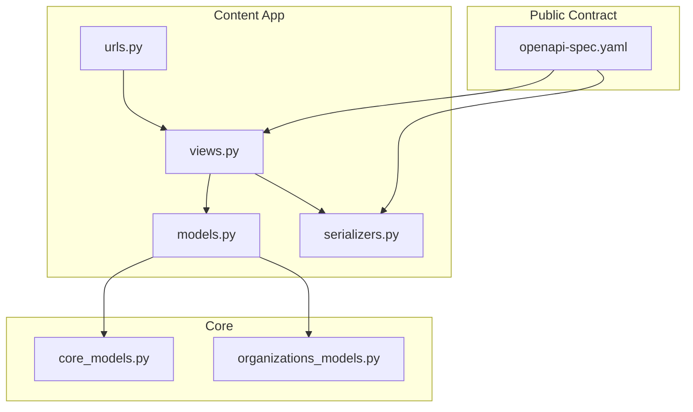
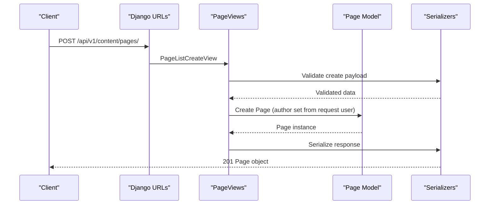
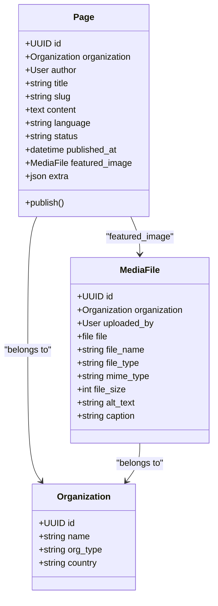

# Content Management API

<cite>
**Referenced Files in This Document**
- [models.py](file://backend/django/apps/content/models.py)
- [views.py](file://backend/django/apps/content/views.py)
- [serializers.py](file://backend/django/apps/content/serializers.py)
- [urls.py](file://backend/django/apps/content/urls.py)
- [openapi-spec.yaml](file://docs/api/openapi-spec.yaml)
- [core_models.py](file://backend/django/apps/core/models.py)
- [organizations_models.py](file://backend/django/apps/organizations/models.py)
</cite>

## Table of Contents
1. [Introduction](#introduction)
2. [Project Structure](#project-structure)
3. [Core Components](#core-components)
4. [Architecture Overview](#architecture-overview)
5. [Detailed Component Analysis](#detailed-component-analysis)
6. [Dependency Analysis](#dependency-analysis)
7. [Performance Considerations](#performance-considerations)
8. [Troubleshooting Guide](#troubleshooting-guide)
9. [Conclusion](#conclusion)
10. [Appendices](#appendices)

## Introduction
This document provides detailed API documentation for content management endpoints that support page creation, retrieval, updates, deletion, media handling, and publishing workflows. It covers multi-language content, filtering by organization, status (draft/published/archived), and language parameters. It also documents request/response schemas for pages and media, approval workflow integration points, version control considerations, and examples for publishing workflows and bulk operations.

## Project Structure
The content management feature is implemented as a Django app with models, serializers, views, and URL routes. The OpenAPI specification defines the public contract for clients.

**Diagram sources**
- [urls.py:6-12](file://backend/django/apps/content/urls.py#L6-L12)
- [views.py:14-83](file://backend/django/apps/content/views.py#L14-L83)
- [models.py:13-202](file://backend/django/apps/content/models.py#L13-L202)
- [serializers.py:10-51](file://backend/django/apps/content/serializers.py#L10-L51)
- [core_models.py:36-64](file://backend/django/apps/core/models.py#L36-L64)
- [organizations_models.py:12-194](file://backend/django/apps/organizations/models.py#L12-L194)
- [openapi-spec.yaml:593-763](file://docs/api/openapi-spec.yaml#L593-L763)

**Section sources**
- [urls.py:6-12](file://backend/django/apps/content/urls.py#L6-L12)
- [views.py:14-83](file://backend/django/apps/content/views.py#L14-L83)
- [models.py:13-202](file://backend/django/apps/content/models.py#L13-L202)
- [serializers.py:10-51](file://backend/django/apps/content/serializers.py#L10-L51)
- [openapi-spec.yaml:593-763](file://docs/api/openapi-spec.yaml#L593-L763)

## Core Components
- Page model: Represents a website page per organization with fields for title, slug, content, excerpt, language, template, status, published_at, featured image, SEO metadata, sort order, and extra JSON. Supports unique constraint on (organization, slug, language).
- MediaFile model: Represents uploaded assets with type, MIME type, size, alt text, caption, and organization association.
- Serializers: Provide read/write contracts for pages and media, including nested featured_image and write-only ID field for linking images to pages.
- Views: REST endpoints for listing/creating pages, retrieving/updating/deleting pages, publishing pages, and listing/creating/deleting media.
- Base models: Soft-delete and timestamps via BaseModel; audit logging via AuditLog.

**Section sources**
- [models.py:13-119](file://backend/django/apps/content/models.py#L13-L119)
- [models.py:121-202](file://backend/django/apps/content/models.py#L121-L202)
- [serializers.py:10-51](file://backend/django/apps/content/serializers.py#L10-L51)
- [views.py:14-83](file://backend/django/apps/content/views.py#L14-L83)
- [core_models.py:36-64](file://backend/django/apps/core/models.py#L36-L64)

## Architecture Overview
The content API follows a standard DRF pattern: URLs route to view classes that enforce authentication, filter queries, serialize data, and persist changes. Pages can be filtered by organization_id, language, and status. Media assets are scoped by organization and soft-deleted on removal. Publishing transitions a page to published state and sets the published timestamp.

**Diagram sources**
- [urls.py:6-12](file://backend/django/apps/content/urls.py#L6-L12)
- [views.py:14-33](file://backend/django/apps/content/views.py#L14-L33)
- [serializers.py:39-51](file://backend/django/apps/content/serializers.py#L39-L51)
- [models.py:13-119](file://backend/django/apps/content/models.py#L13-L119)

**Section sources**
- [views.py:14-83](file://backend/django/apps/content/views.py#L14-L83)
- [serializers.py:10-51](file://backend/django/apps/content/serializers.py#L10-L51)
- [models.py:13-202](file://backend/django/apps/content/models.py#L13-L202)

## Detailed Component Analysis

### Pages API
- List/Create pages
  - Endpoint: GET/POST /api/v1/content/pages/
  - Authentication: Bearer token required
  - Query filters: organization_id, language, status (draft/published/archived)
  - Response: Paginated list of pages with nested featured_image when present
  - Notes: Author is automatically set on creation from the authenticated user

- Retrieve/Update/Delete page
  - Endpoint: GET/PATCH/DELETE /api/v1/content/pages/{id}/
  - Behavior: Soft delete on DELETE; returns updated page on PATCH

- Publish page
  - Endpoint: POST /api/v1/content/pages/{id}/publish/
  - Behavior: Sets status to published and records published_at timestamp

Request/Response Schemas (from OpenAPI):
- Page: id, organization_id, title, slug, content, language, status, author_id, published_at, created_at, updated_at
- PageCreate: organization_id, title, slug, content, language, parent_page_id (optional), template
- PageUpdate: title, slug, content, language, status, template
- PageList: count, next, previous, results (array of Page)

Filtering Examples:
- By organization: ?organization_id={uuid}
- By language: ?language=lt
- By status: ?status=draft

Publishing Workflow Example:
- Create draft page
- Update content and metadata
- Publish via publish endpoint
- Verify status becomes published and published_at is set

**Section sources**
- [openapi-spec.yaml:593-763](file://docs/api/openapi-spec.yaml#L593-L763)
- [openapi-spec.yaml:1206-1300](file://docs/api/openapi-spec.yaml#L1206-L1300)
- [views.py:14-55](file://backend/django/apps/content/views.py#L14-L55)
- [models.py:13-119](file://backend/django/apps/content/models.py#L13-L119)

### Media API
- List/Create media
  - Endpoint: GET/POST /api/v1/content/media/
  - Filters: organization_id
  - Behavior: On create, uploaded_by is set from authenticated user

- Retrieve/Delete media
  - Endpoint: GET/DELETE /api/v1/content/media/{id}/
  - Behavior: Soft delete on DELETE

Request/Response Schemas (from serializers):
- MediaFile fields: id, organization, file, file_name, file_type, mime_type, file_size, alt_text, caption, created_at, updated_at
- Read-only fields include identifiers, sizes, types, and timestamps

Media Handling Notes:
- File storage uses upload_to path pattern
- Type choices include image, document, video, audio, other
- Optional alt_text and caption for accessibility and metadata

**Section sources**
- [views.py:58-83](file://backend/django/apps/content/views.py#L58-L83)
- [serializers.py:10-18](file://backend/django/apps/content/serializers.py#L10-L18)
- [models.py:121-202](file://backend/django/apps/content/models.py#L121-L202)

### Multi-Language Content Management
- Language field on Page supports ISO codes (e.g., lt, en)
- Unique constraint ensures one page per (organization, slug, language)
- Filtering by language allows retrieving localized versions of pages
- Organization Website configuration includes default_language and languages array for site-level settings

Example:
- Create page with language=lt
- Retrieve pages with ?language=en to get English version
- Use website languages to determine available locales

**Section sources**
- [models.py:13-68](file://backend/django/apps/content/models.py#L13-L68)
- [organizations_models.py:323-344](file://backend/django/apps/organizations/models.py#L323-L344)
- [openapi-spec.yaml:1080-1112](file://docs/api/openapi-spec.yaml#L1080-L1112)

### Approval Workflows and Version Control Integration
- Current implementation supports status-based workflow: draft → published → archived
- Publish endpoint transitions to published and sets published_at
- Frontend editor references moderation and approval concepts, indicating potential future integration points for human review
- Audit log model provides immutable change tracking for compliance and accountability

Recommendations:
- Extend Page model with explicit approval states if needed (e.g., pending_review)
- Integrate with external moderation services or internal review queues
- Leverage AuditLog to record all content changes with user context and checksums

**Section sources**
- [views.py:47-55](file://backend/django/apps/content/views.py#L47-L55)
- [models.py:114-119](file://backend/django/apps/content/models.py#L114-L119)
- [core_models.py:67-227](file://backend/django/apps/core/models.py#L67-L227)

### Bulk Operations
- No dedicated bulk endpoints exist in current implementation
- Clients can iterate over paginated lists and perform individual operations
- For large-scale updates, consider implementing batch endpoints that accept arrays of IDs and operation types
- Media uploads can be performed in loops with organization_id filtering

Best Practices:
- Use pagination parameters (page, page_size) to manage large datasets
- Implement retry logic for failed operations
- Batch related operations where possible to reduce API calls

**Section sources**
- [openapi-spec.yaml:593-643](file://docs/api/openapi-spec.yaml#L593-L643)
- [views.py:22-33](file://backend/django/apps/content/views.py#L22-L33)

## Dependency Analysis
The content module depends on core infrastructure for base models, timestamps, and soft deletes, and integrates with organizations for tenant scoping.

**Diagram sources**
- [models.py:13-119](file://backend/django/apps/content/models.py#L13-L119)
- [models.py:121-202](file://backend/django/apps/content/models.py#L121-L202)
- [organizations_models.py:12-194](file://backend/django/apps/organizations/models.py#L12-L194)

**Section sources**
- [models.py:13-202](file://backend/django/apps/content/models.py#L13-L202)
- [organizations_models.py:12-194](file://backend/django/apps/organizations/models.py#L12-L194)

## Performance Considerations
- Use select_related('author', 'featured_image') to reduce N+1 queries when listing pages
- Filter by organization_id and language to limit result sets
- Implement pagination for large datasets using page and page_size parameters
- Avoid fetching full media files in list responses; use IDs when possible
- Cache frequently accessed published pages at the application or CDN level

[No sources needed since this section provides general guidance]

## Troubleshooting Guide
Common issues and resolutions:
- Cross-tenant access errors: Ensure requests include correct organization context and authentication
- Validation errors: Check required fields in PageCreate schema (organization_id, title, slug, content, language)
- Media upload failures: Verify file size limits, MIME type validation, and storage permissions
- Soft delete confusion: Deleted items are not returned in queries due to is_deleted=False filter

Debugging steps:
- Check audit logs for change history and tamper-evident checksums
- Verify tenant context middleware is properly configured
- Test filtering parameters individually to isolate query issues

**Section sources**
- [core_models.py:67-227](file://backend/django/apps/core/models.py#L67-L227)
- [models.py:73-113](file://backend/django/apps/content/models.py#L73-L113)
- [views.py:22-33](file://backend/django/apps/content/views.py#L22-L33)

## Conclusion
The Content Management API provides a robust foundation for managing multi-language website pages and media assets with strong tenant isolation, soft deletion, and publishing workflows. While basic version control and approval workflows are not fully implemented, the architecture supports extension through additional status fields and integration with audit logging. Clients should leverage filtering, pagination, and proper error handling for efficient content management operations.

[No sources needed since this section summarizes without analyzing specific files]

## Appendices

### API Endpoints Summary
- GET/POST /api/v1/content/pages/ - List and create pages
- GET/PATCH/DELETE /api/v1/content/pages/{id}/ - Manage individual pages
- POST /api/v1/content/pages/{id}/publish/ - Publish pages
- GET/POST /api/v1/content/media/ - List and upload media
- GET/DELETE /api/v1/content/media/{id}/ - Manage individual media files

### Request/Response Examples
- Create page: POST with organization_id, title, slug, content, language
- Filter pages: GET with organization_id, language, status parameters
- Upload media: POST with file and metadata
- Publish page: POST to publish endpoint with page ID

### Security and Compliance
- All endpoints require Bearer token authentication
- Tenant isolation enforced through organization scoping
- Audit logging provides immutable change tracking
- GDPR compliance features included in core models

**Section sources**
- [openapi-spec.yaml:870-875](file://docs/api/openapi-spec.yaml#L870-L875)
- [core_models.py:67-227](file://backend/django/apps/core/models.py#L67-L227)