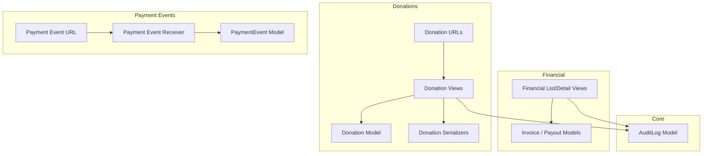
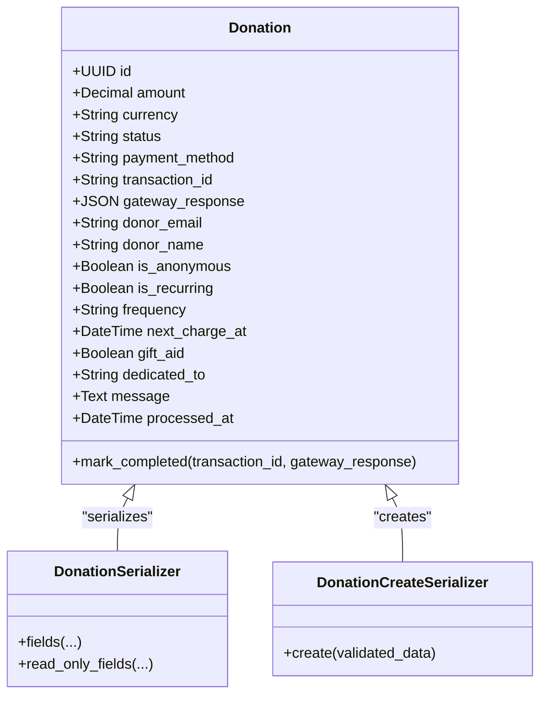
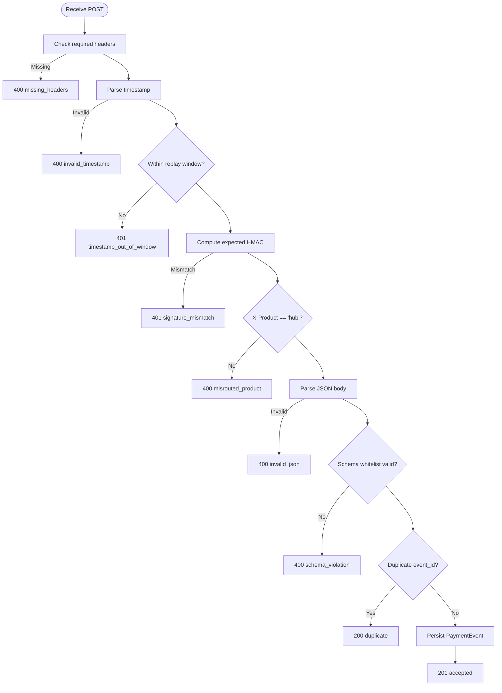
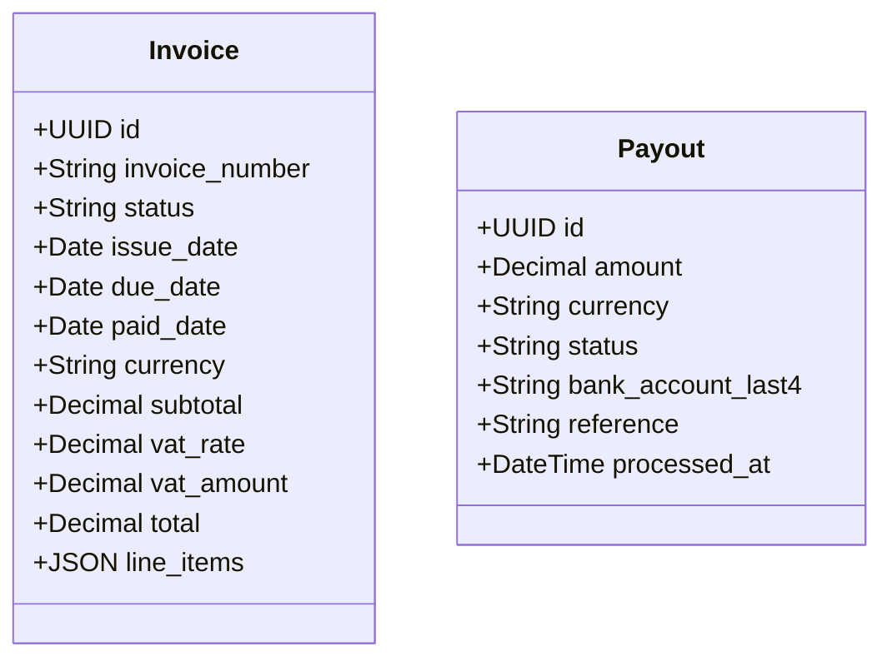
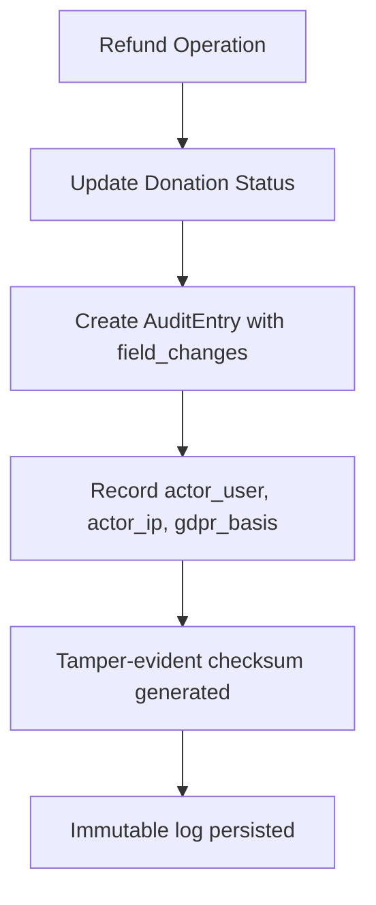
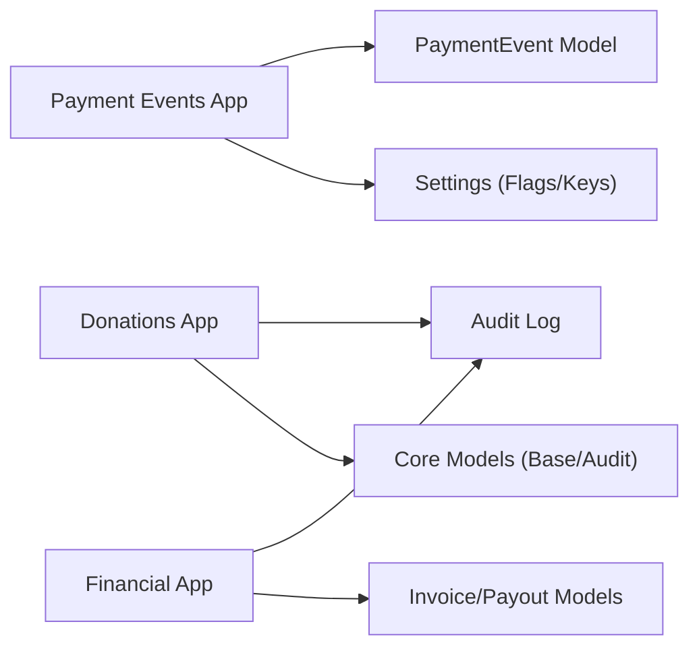

# Donations & Payments API

<cite>
**Referenced Files in This Document**
- [donations/models.py](file://backend/django/apps/donations/models.py)
- [donations/views.py](file://backend/django/apps/donations/views.py)
- [donations/serializers.py](file://backend/django/apps/donations/serializers.py)
- [donations/urls.py](file://backend/django/apps/donations/urls.py)
- [payment_events/models.py](file://backend/django/apps/payment_events/models.py)
- [payment_events/views.py](file://backend/django/apps/payment_events/views.py)
- [payment_events/urls.py](file://backend/django/apps/payment_events/urls.py)
- [financial/models.py](file://backend/django/apps/financial/models.py)
- [financial/views.py](file://backend/django/apps/financial/views.py)
- [core/models.py](file://backend/django/apps/core/models.py)
- [commerce/donation-flow-spec.md](file://docs/commerce/donation-flow-spec.md)
- [payment-api-contract.md](file://docs/payment-api-contract.md)
- [ADR-009-payment-boundary.md](file://docs/decisions/ADR-009-payment-boundary.md)
</cite>

## Table of Contents
1. Introduction
2. Project Structure
3. Core Components
4. Architecture Overview
5. Detailed Component Analysis
6. Dependency Analysis
7. Performance Considerations
8. Troubleshooting Guide
9. Conclusion
10. Appendices

## Introduction
This document provides comprehensive API documentation for donation processing and payment endpoints within the platform. It covers:
- Donation creation, retrieval, and refund operations
- Payment event ingestion from the marketplace (signed envelopes)
- Financial reporting via invoices and payouts
- Webhook handling for payment events
- PCI-DSS compliance boundaries and secure transaction handling
- Request/response schemas for donations, payment confirmations, and financial records
- Examples of donation flows and reconciliation processes

The system follows a strict payment boundary where the hub does not handle cardholder data directly; it receives signed payment facts from the marketplace and persists them for audit, reporting, and donor-facing state rendering.

## Project Structure
The donation and payment functionality is implemented across several Django apps:
- Donations: domain models, serializers, views, and routes for donation entities and refunds
- Payment Events: internal webhook receiver for signed payment events from the marketplace
- Financial: invoice and payout models and read-only listing/retrieval endpoints
- Core: shared base models including an immutable audit log used by financial operations



**Diagram sources**
- [donations/models.py:13-146](file://backend/django/apps/donations/models.py#L13-L146)
- [donations/serializers.py:10-44](file://backend/django/apps/donations/serializers.py#L10-L44)
- [donations/views.py:24-176](file://backend/django/apps/donations/views.py#L24-L176)
- [donations/urls.py:6-10](file://backend/django/apps/donations/urls.py#L6-L10)
- [payment_events/models.py:6-36](file://backend/django/apps/payment_events/models.py#L6-L36)
- [payment_events/views.py:81-143](file://backend/django/apps/payment_events/views.py#L81-L143)
- [payment_events/urls.py:7-9](file://backend/django/apps/payment_events/urls.py#L7-L9)
- [financial/models.py:14-170](file://backend/django/apps/financial/models.py#L14-L170)
- [financial/views.py:7-39](file://backend/django/apps/financial/views.py#L7-L39)
- [core/models.py:67-200](file://backend/django/apps/core/models.py#L67-L200)

**Section sources**
- [donations/models.py:13-146](file://backend/django/apps/donations/models.py#L13-L146)
- [donations/views.py:24-176](file://backend/django/apps/donations/views.py#L24-L176)
- [donations/serializers.py:10-44](file://backend/django/apps/donations/serializers.py#L10-L44)
- [donations/urls.py:6-10](file://backend/django/apps/donations/urls.py#L6-L10)
- [payment_events/models.py:6-36](file://backend/django/apps/payment_events/models.py#L6-L36)
- [payment_events/views.py:81-143](file://backend/django/apps/payment_events/views.py#L81-L143)
- [payment_events/urls.py:7-9](file://backend/django/apps/payment_events/urls.py#L7-L9)
- [financial/models.py:14-170](file://backend/django/apps/financial/models.py#L14-L170)
- [financial/views.py:7-39](file://backend/django/apps/financial/views.py#L7-L39)
- [core/models.py:67-200](file://backend/django/apps/core/models.py#L67-L200)

## Core Components
- Donation entity: represents one-off or recurring donations with status, payment method, and optional donor details. Includes tenant context validation to prevent cross-tenant manipulation.
- Donation API: authenticated list/create/detail endpoints with rate limiting on create and refund operations. Refund endpoint creates tamper-evident audit entries.
- Payment event receiver: accepts signed envelopes from the marketplace, validates headers, timestamp window, HMAC signature, product routing, schema whitelist, deduplication, and persists durable facts.
- Financial reporting: read-only listing and detail endpoints for invoices and payouts, filtered by organization when requested.
- Audit logging: immutable audit trail with checksums and tenant isolation enforcement.

Key behaviors:
- PCI scope exclusion: no PSP SDKs or keys in hub; only signed facts are received.
- Idempotent acceptance: duplicate event_ids return 200 no-op.
- Tamper-evident audit: refund operations record before/after state and actor details.

**Section sources**
- [donations/models.py:13-146](file://backend/django/apps/donations/models.py#L13-L146)
- [donations/views.py:24-176](file://backend/django/apps/donations/views.py#L24-L176)
- [payment_events/views.py:81-143](file://backend/django/apps/payment_events/views.py#L81-L143)
- [financial/views.py:7-39](file://backend/django/apps/financial/views.py#L7-L39)
- [core/models.py:67-200](file://backend/django/apps/core/models.py#L67-L200)

## Architecture Overview
The donation flow uses a handoff to a marketplace-hosted checkout. The marketplace handles payment capture and emits signed events to the hub’s internal receiver. The hub persists these as facts and exposes read-only financial endpoints for reporting.

```mermaid
sequenceDiagram
participant Tenant as "Tenant Site"
participant Marketplace as "Marketplace Checkout"
participant HubReceiver as "Hub Payment Event Receiver"
participant Facts as "PaymentEvent Model"
participant Reporting as "Financial Endpoints"
Tenant->>Marketplace : "Redirect to hosted checkout"
Marketplace-->>Tenant : "Return state (success/fail)"
Marketplace->>HubReceiver : "POST /internal/v1/payment-events<br/>Signed envelope"
HubReceiver->>HubReceiver : "Validate headers, timestamp, HMAC, product, schema"
HubReceiver->>Facts : "Persist event (idempotent)"
Reporting-->>Reporting : "List invoices/payouts (read-only)"
Note over Tenant,HubReceiver : "No personal data crosses boundary; hub renders confirmation using opaque references"
```

**Diagram sources**
- [commerce/donation-flow-spec.md:5-22](file://docs/commerce/donation-flow-spec.md#L5-L22)
- [payment-api-contract.md:21-83](file://docs/payment-api-contract.md#L21-L83)
- [payment_events/views.py:81-143](file://backend/django/apps/payment_events/views.py#L81-L143)
- [financial/views.py:7-39](file://backend/django/apps/financial/views.py#L7-L39)

## Detailed Component Analysis

### Donation Entity and API
- Donation model fields include amount, currency, status, payment_method, transaction_id, gateway_response, donor_email, donor_name, is_anonymous, recurring flags, gift_aid, dedicated_to, message, processed_at.
- Donation API:
  - GET /api/v1/donations/: list donations for authenticated user
  - POST /api/v1/donations/: create donation (rate limited)
  - GET /api/v1/donations/{id}/: retrieve donation detail
  - POST /api/v1/donations/{id}/refund/: process refund with full audit trail (rate limited)
- Serializers define input/output fields and mark sensitive/status fields as read-only.



**Diagram sources**
- [donations/models.py:13-146](file://backend/django/apps/donations/models.py#L13-L146)
- [donations/serializers.py:10-44](file://backend/django/apps/donations/serializers.py#L10-L44)

**Section sources**
- [donations/models.py:13-146](file://backend/django/apps/donations/models.py#L13-L146)
- [donations/serializers.py:10-44](file://backend/django/apps/donations/serializers.py#L10-L44)
- [donations/views.py:24-176](file://backend/django/apps/donations/views.py#L24-L176)
- [donations/urls.py:6-10](file://backend/django/apps/donations/urls.py#L6-L10)

### Payment Event Receiver (Webhook Handler)
- Endpoint: POST /internal/v1/payment-events
- Authentication: signed-envelope HMAC-SHA256 with required headers X-Product, X-JOL-Timestamp, X-JOL-Signature
- Validation order: presence → timestamp window ±300s → constant-time HMAC compare → product == "hub" → JSON parse → schema whitelist → dedupe by event_id → persist
- Response contract: 200 accepted/duplicate, 400 schema/misroute, 401 timestamp/signature, 5xx unavailability
- Envelope fields: event_id, type, product, payment_intent_id, status, amount_cents, currency, occurred_at



**Diagram sources**
- [payment-api-contract.md:21-83](file://docs/payment-api-contract.md#L21-L83)
- [payment-api-contract.md:84-145](file://docs/payment-api-contract.md#L84-L145)
- [payment_events/views.py:81-143](file://backend/django/apps/payment_events/views.py#L81-L143)

**Section sources**
- [payment_events/views.py:81-143](file://backend/django/apps/payment_events/views.py#L81-L143)
- [payment_events/models.py:6-36](file://backend/django/apps/payment_events/models.py#L6-L36)
- [payment_events/urls.py:7-9](file://backend/django/apps/payment_events/urls.py#L7-L9)
- [payment-api-contract.md:21-145](file://docs/payment-api-contract.md#L21-L145)

### Financial Reporting (Invoices and Payouts)
- Invoice model includes number, status, dates, currency, subtotal, VAT rate/amount, total, notes, line_items.
- Payout model includes amount, currency, status, bank_account_last4, reference, processed_at.
- Endpoints:
  - GET /api/v1/financial/invoices/?organization_id=: list invoices
  - GET /api/v1/financial/invoices/{id}/: retrieve invoice
  - GET /api/v1/financial/payouts/?organization_id=: list payouts
  - GET /api/v1/financial/payouts/{id}/: retrieve payout



**Diagram sources**
- [financial/models.py:14-170](file://backend/django/apps/financial/models.py#L14-L170)

**Section sources**
- [financial/models.py:14-170](file://backend/django/apps/financial/models.py#L14-L170)
- [financial/views.py:7-39](file://backend/django/apps/financial/views.py#L7-L39)

### Audit Logging Requirements
- Immutable audit trail with checksums and tenant isolation enforcement.
- Financial operations (e.g., refunds) create detailed audit entries capturing who, when, what changed, and integrity metadata.
- Actions include DONATION, PAYMENT, REFUND, and others aligned with GDPR and SOC2 requirements.



**Diagram sources**
- [donations/views.py:113-168](file://backend/django/apps/donations/views.py#L113-L168)
- [core/models.py:67-200](file://backend/django/apps/core/models.py#L67-L200)

**Section sources**
- [donations/views.py:113-168](file://backend/django/apps/donations/views.py#L113-L168)
- [core/models.py:67-200](file://backend/django/apps/core/models.py#L67-L200)

## Dependency Analysis
- Donations depend on core base models and CRM middleware for tenant validation.
- Payment event receiver depends on settings for feature flag and delivery key, and persists to PaymentEvent model.
- Financial endpoints depend on Invoice/Payout models and support filtering by organization.
- Audit logging is central to financial operations and ensures accountability.



**Diagram sources**
- [donations/models.py:13-146](file://backend/django/apps/donations/models.py#L13-L146)
- [payment_events/views.py:81-143](file://backend/django/apps/payment_events/views.py#L81-L143)
- [financial/views.py:7-39](file://backend/django/apps/financial/views.py#L7-L39)
- [core/models.py:67-200](file://backend/django/apps/core/models.py#L67-L200)

**Section sources**
- [donations/models.py:13-146](file://backend/django/apps/donations/models.py#L13-L146)
- [payment_events/views.py:81-143](file://backend/django/apps/payment_events/views.py#L81-L143)
- [financial/views.py:7-39](file://backend/django/apps/financial/views.py#L7-L39)
- [core/models.py:67-200](file://backend/django/apps/core/models.py#L67-L200)

## Performance Considerations
- Rate limiting on donation create and refund endpoints reduces abuse risk and protects downstream systems.
- Payment event receiver performs fast validation and idempotent persistence to meet sender timeout expectations.
- Financial endpoints are read-only and filterable by organization to optimize query performance.
- Audit logging adds minimal overhead while ensuring compliance and traceability.

[No sources needed since this section provides general guidance]

## Troubleshooting Guide
Common issues and resolutions:
- Missing or invalid headers on payment events: ensure X-Product, X-JOL-Timestamp, X-JOL-Signature are present and correct.
- Timestamp out of window: verify clock synchronization and adjust replay window if necessary.
- Signature mismatch: confirm delivery key configuration and that HMAC computation matches the contract.
- Duplicate events: expect 200 no-op responses; do not retry on duplicates.
- Refund errors: ensure donation is completed before attempting refund; check audit logs for authorization details.

**Section sources**
- [payment-api-contract.md:21-83](file://docs/payment-api-contract.md#L21-L83)
- [payment_events/views.py:81-143](file://backend/django/apps/payment_events/views.py#L81-L143)
- [donations/views.py:80-168](file://backend/django/apps/donations/views.py#L80-L168)

## Conclusion
The donation and payments system enforces a strict payment boundary, receiving signed payment facts from the marketplace and providing robust donation management, audit logging, and financial reporting capabilities. Compliance with PCI-DSS, GDPR, and SOC2 is embedded through tenant isolation, tamper-evident audits, and minimal data crossing boundaries. The documented APIs and workflows enable secure, auditable, and scalable donation processing.

[No sources needed since this section summarizes without analyzing specific files]

## Appendices

### API Reference Summary

- Donation Endpoints
  - GET /api/v1/donations/: list donations for authenticated user
  - POST /api/v1/donations/: create donation (rate limited)
  - GET /api/v1/donations/{id}/: retrieve donation detail
  - POST /api/v1/donations/{id}/refund/: process refund (rate limited)

- Payment Event Receiver
  - POST /internal/v1/payment-events: accept signed payment events

- Financial Endpoints
  - GET /api/v1/financial/invoices/?organization_id=: list invoices
  - GET /api/v1/financial/invoices/{id}/: retrieve invoice
  - GET /api/v1/financial/payouts/?organization_id=: list payouts
  - GET /api/v1/financial/payouts/{id}/: retrieve payout

**Section sources**
- [donations/urls.py:6-10](file://backend/django/apps/donations/urls.py#L6-L10)
- [payment_events/urls.py:7-9](file://backend/django/apps/payment_events/urls.py#L7-L9)
- [financial/views.py:7-39](file://backend/django/apps/financial/views.py#L7-L39)

### Schemas

- Donation Entity Fields
  - id, organization, donor, amount, currency, status, payment_method, transaction_id, gateway_response, donor_email, donor_name, is_anonymous, is_recurring, frequency, next_charge_at, gift_aid, dedicated_to, message, processed_at, created_at, updated_at

- Payment Event Envelope Fields
  - event_id, type, product, payment_intent_id, status, amount_cents, currency, occurred_at

- Invoice Fields
  - id, invoice_number, status, issue_date, due_date, paid_date, currency, subtotal, vat_rate, vat_amount, total, notes, line_items

- Payout Fields
  - id, amount, currency, status, bank_account_last4, reference, processed_at

**Section sources**
- [donations/serializers.py:10-44](file://backend/django/apps/donations/serializers.py#L10-L44)
- [payment-api-contract.md:84-145](file://docs/payment-api-contract.md#L84-L145)
- [financial/models.py:14-170](file://backend/django/apps/financial/models.py#L14-L170)

### PCI-DSS Compliance Boundaries
- Hub remains out of PCI scope; no PSP SDKs or keys in hub codebase.
- Signed envelopes contain only payment facts; no cardholder data crosses the boundary.
- Opening conditions require SAQ A verification and change-controlled plans.

**Section sources**
- [ADR-009-payment-boundary.md:45-74](file://docs/decisions/ADR-009-payment-boundary.md#L45-L74)
- [payment-api-contract.md:147-177](file://docs/payment-api-contract.md#L147-L177)

### Donation Flow Example
- Tenant site redirects to marketplace-hosted checkout
- Marketplace captures payment and emits signed events to hub receiver
- Hub persists facts and returns confirmation states to tenant UI
- Donor dashboard shows masked references and aggregated impact metrics

**Section sources**
- [commerce/donation-flow-spec.md:5-22](file://docs/commerce/donation-flow-spec.md#L5-L22)
- [payment-api-contract.md:21-83](file://docs/payment-api-contract.md#L21-L83)

### Reconciliation Process Example
- Ingest payment events and persist as facts
- Correlate events by payment_intent_id to reconcile against donations
- Generate reports from facts for totals per cause/tenant
- Ensure k-anonymization for public analytics outputs

**Section sources**
- [payment_events/models.py:6-36](file://backend/django/apps/payment_events/models.py#L6-L36)
- [commerce/donation-flow-spec.md:31-35](file://docs/commerce/donation-flow-spec.md#L31-L35)