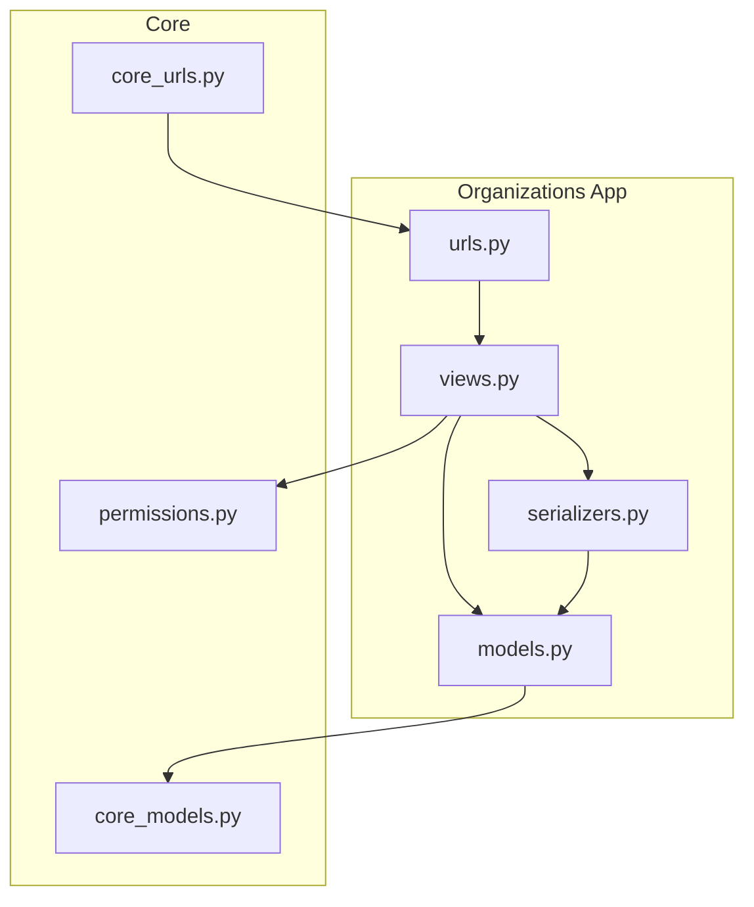
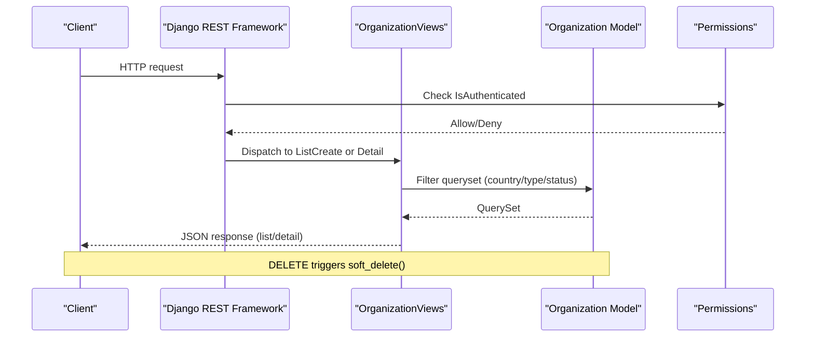
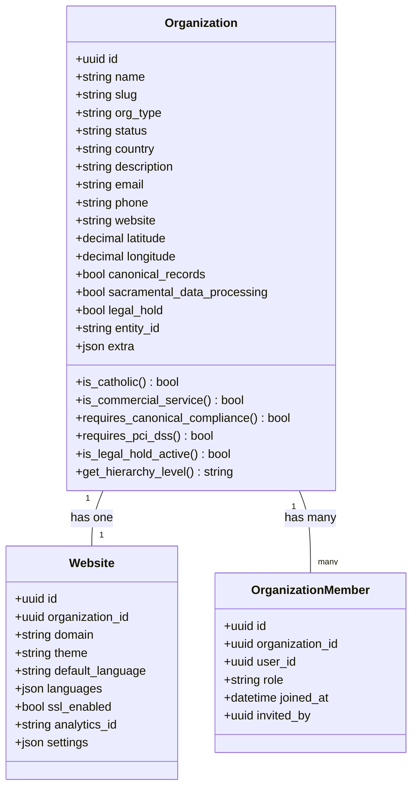
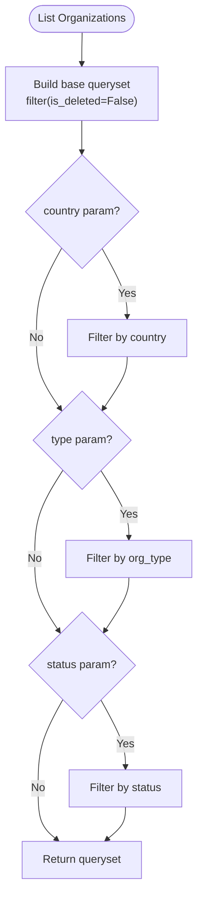
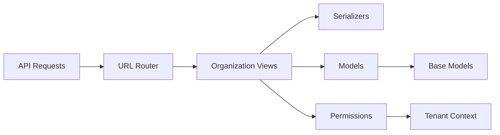

# Organizations API

<cite>
**Referenced Files in This Document**
- [models.py](file://backend/django/apps/organizations/models.py)
- [views.py](file://backend/django/apps/organizations/views.py)
- [serializers.py](file://backend/django/apps/organizations/serializers.py)
- [urls.py](file://backend/django/apps/organizations/urls.py)
- [core_models.py](file://backend/django/apps/core/models.py)
- [permissions.py](file://backend/django/apps/core/permissions.py)
- [core_urls.py](file://backend/django/core/urls.py)
- [openapi-spec.yaml](file://docs/api/openapi-spec.yaml)
</cite>

## Table of Contents
1. [Introduction](#introduction)
2. [Project Structure](#project-structure)
3. [Core Components](#core-components)
4. [Architecture Overview](#architecture-overview)
5. [Detailed Component Analysis](#detailed-component-analysis)
6. [Dependency Analysis](#dependency-analysis)
7. [Performance Considerations](#performance-considerations)
8. [Troubleshooting Guide](#troubleshooting-guide)
9. [Conclusion](#conclusion)
10. [Appendices](#appendices)

## Introduction
This document provides detailed API documentation for organization management endpoints that support CRUD operations for religious institutions and related entities. It covers:
- Creating, retrieving, updating, and deleting organizations
- Filtering organizations by country, type, and status
- Request/response schemas for organizations and websites
- Validation rules and business logic constraints
- Multi-tenant isolation patterns and permission requirements
- Integration with website generation workflows
- Examples of organization lifecycle management and common use cases

The API is built on Django REST Framework and follows a multi-tenant design where each organization acts as a tenant boundary.

## Project Structure
Organization-related code is organized under the organizations app with clear separation of concerns:
- Models define domain entities (Organization, Website, OrganizationMember)
- Serializers handle request validation and response formatting
- Views implement REST endpoints with filtering and soft-delete behavior
- URLs wire endpoints to views

**Diagram sources**
- [urls.py:6-11](file://backend/django/apps/organizations/urls.py#L6-L11)
- [views.py:17-72](file://backend/django/apps/organizations/views.py#L17-L72)
- [serializers.py:10-64](file://backend/django/apps/organizations/serializers.py#L10-L64)
- [models.py:12-495](file://backend/django/apps/organizations/models.py#L12-L495)
- [core_models.py:36-64](file://backend/django/apps/core/models.py#L36-L64)
- [permissions.py:26-202](file://backend/django/apps/core/permissions.py#L26-L202)
- [core_urls.py:52-62](file://backend/django/core/urls.py#L52-L62)

**Section sources**
- [urls.py:6-11](file://backend/django/apps/organizations/urls.py#L6-L11)
- [core_urls.py:52-62](file://backend/django/core/urls.py#L52-L62)

## Core Components
- Organization: Represents a religious institution or service provider with hierarchical relationships, compliance flags, and metadata.
- Website: Configuration attached to an organization for site generation and rendering.
- OrganizationMember: Membership linking users to organizations with roles and audit fields.
- Base models provide UUID primary keys, timestamps, and soft-delete support.

Key capabilities:
- Soft delete via base model methods
- Tenant context validation in save hooks for sensitive models
- Role-based membership and permissions

**Section sources**
- [models.py:12-237](file://backend/django/apps/organizations/models.py#L12-L237)
- [models.py:239-321](file://backend/django/apps/organizations/models.py#L239-L321)
- [models.py:323-386](file://backend/django/apps/organizations/models.py#L323-L386)
- [core_models.py:36-64](file://backend/django/apps/core/models.py#L36-L64)

## Architecture Overview
The API exposes REST endpoints under /api/v1/organizations/. Authentication is required; filtering supports country, type, and status parameters. Deletion performs a soft delete. Website configuration is managed per organization.

**Diagram sources**
- [views.py:17-47](file://backend/django/apps/organizations/views.py#L17-L47)
- [core_models.py:51-64](file://backend/django/apps/core/models.py#L51-L64)
- [permissions.py:45-60](file://backend/django/apps/core/permissions.py#L45-L60)

**Section sources**
- [views.py:17-72](file://backend/django/apps/organizations/views.py#L17-L72)
- [core_models.py:51-64](file://backend/django/apps/core/models.py#L51-L64)

## Detailed Component Analysis

### Endpoints

#### List and Create Organizations
- Endpoint: GET /api/v1/organizations/, POST /api/v1/organizations/
- Authentication: Required
- Filtering (GET):
  - country: ISO country code filter
  - type: Organization type filter
  - status: Status filter (active/inactive/pending)
- Create (POST):
  - Requires name, org_type, country
  - Slug auto-generated from name plus short UUID suffix
  - Owner set to authenticated user

Request schema (create):
- name: string (required)
- org_type: enum from allowed types (required)
- country: string (required)
- description: string (optional)
- address_street: string (optional)
- address_city: string (optional)
- address_postal_code: string (optional)
- email: email (optional)
- phone: string (optional)

Response schema (list item):
- id: uuid
- name: string
- slug: string
- org_type: enum
- status: enum
- country: string
- description: string
- logo: url or null
- address_street: string
- address_city: string
- address_postal_code: string
- email: email
- phone: string
- website: url
- latitude: decimal or null
- longitude: decimal or null
- member_count: integer
- extra: object
- created_at: datetime
- updated_at: datetime

**Section sources**
- [urls.py:6-11](file://backend/django/apps/organizations/urls.py#L6-L11)
- [views.py:17-36](file://backend/django/apps/organizations/views.py#L17-L36)
- [serializers.py:19-51](file://backend/django/apps/organizations/serializers.py#L19-L51)
- [openapi-spec.yaml:995-1027](file://docs/api/openapi-spec.yaml#L995-L1027)

#### Retrieve, Update, Delete Organization
- Endpoint: GET /api/v1/organizations/{id}/, PATCH /api/v1/organizations/{id}/, DELETE /api/v1/organizations/{id}/
- Authentication: Required
- Behavior:
  - GET/PATCH operate on non-deleted organizations
  - DELETE performs soft delete (marks deleted and inactive)

Update fields:
- Any writable fields except read-only ones (id, slug, timestamps)

Delete behavior:
- Soft delete sets is_deleted=True, is_active=False, records deleted_at timestamp

**Section sources**
- [views.py:39-47](file://backend/django/apps/organizations/views.py#L39-L47)
- [core_models.py:51-64](file://backend/django/apps/core/models.py#L51-L64)

#### Organization Website Management
- Endpoint: GET /api/v1/organizations/{id}/website/, PATCH /api/v1/organizations/{id}/website/
- Authentication: Required
- Behavior:
  - GET returns website config for the organization; creates if missing
  - PATCH updates website settings

Website schema:
- id: uuid
- organization_id: uuid
- domain: string
- theme: string
- default_language: string
- languages: array of strings
- ssl_enabled: boolean
- analytics_id: string
- created_at: datetime
- updated_at: datetime

**Section sources**
- [views.py:50-59](file://backend/django/apps/organizations/views.py#L50-L59)
- [serializers.py:10-16](file://backend/django/apps/organizations/serializers.py#L10-L16)
- [openapi-spec.yaml:1080-1112](file://docs/api/openapi-spec.yaml#L1080-L1112)

#### Organization Members Management
- Endpoint: GET /api/v1/organizations/{id}/members/, POST /api/v1/organizations/{id}/members/
- Authentication: Required
- Behavior:
  - GET lists members for the organization (non-deleted)
  - POST adds a new member (role defaults to viewer unless specified)

Member schema:
- id: uuid
- organization: uuid
- user: uuid
- user_email: email
- user_full_name: string
- role: enum (admin/editor/viewer)
- joined_at: datetime
- created_at: datetime

**Section sources**
- [views.py:62-72](file://backend/django/apps/organizations/views.py#L62-L72)
- [serializers.py:54-64](file://backend/django/apps/organizations/serializers.py#L54-L64)
- [models.py:239-279](file://backend/django/apps/organizations/models.py#L239-L279)

### Data Models and Relationships

**Diagram sources**
- [models.py:12-237](file://backend/django/apps/organizations/models.py#L12-L237)
- [models.py:239-279](file://backend/django/apps/organizations/models.py#L239-L279)
- [models.py:323-386](file://backend/django/apps/organizations/models.py#L323-L386)

**Section sources**
- [models.py:12-495](file://backend/django/apps/organizations/models.py#L12-L495)

### Filtering Logic

**Diagram sources**
- [views.py:25-36](file://backend/django/apps/organizations/views.py#L25-L36)

**Section sources**
- [views.py:25-36](file://backend/django/apps/organizations/views.py#L25-L36)

### Validation Rules and Business Constraints
- Creation requires name, org_type, country
- Slug auto-generation ensures uniqueness and readability
- Status defaults to pending on creation
- Country is a two-letter code used for indexing and filtering
- Type must be one of the defined choices (Catholic, Protestant, Orthodox, Other Christian, Funeral Service, Cemetery Service)
- Compliance flags control special handling:
  - canonical_records indicates sacramental record maintenance
  - sacramental_data_processing enables processing under GDPR Art. 9(2)(d)
  - legal_hold prevents deletion when active
- Hierarchy level determines RBAC scope (diocese/deanery/facility)

**Section sources**
- [models.py:15-76](file://backend/django/apps/organizations/models.py#L15-L76)
- [models.py:135-179](file://backend/django/apps/organizations/models.py#L135-L179)
- [models.py:196-237](file://backend/django/apps/organizations/models.py#L196-L237)
- [serializers.py:37-51](file://backend/django/apps/organizations/serializers.py#L37-L51)

### Multi-Tenant Isolation Patterns
- Tenant context enforced via middleware integration
- Save hooks validate that operations target the current tenant’s organization
- Permission classes check membership and roles within tenant context
- Cross-tenant access attempts are logged and rejected

Key enforcement points:
- OrganizationMember.save validates tenant context
- Website.save validates tenant context
- ConsentSettings.save validates tenant context
- AuditLog.save validates tenant context

**Section sources**
- [models.py:281-321](file://backend/django/apps/organizations/models.py#L281-L321)
- [models.py:346-386](file://backend/django/apps/organizations/models.py#L346-L386)
- [models.py:450-490](file://backend/django/apps/organizations/models.py#L450-L490)
- [permissions.py:26-202](file://backend/django/apps/core/permissions.py#L26-L202)

### Permission Requirements
- All endpoints require authentication (IsAuthenticated)
- Organization membership checks available via custom permission classes
- Admin role required for sensitive operations (financial data, special category data)
- Viewer role has limited access compared to editor/admin

Permission classes:
- IsOrganizationMember: Validates user is active member of tenant
- IsOrganizationAdmin: Requires admin role or owner
- CanAccessSpecialCategoryData: Restricts access to sensitive data
- CanProcessFinancialData: PCI-DSS compliant financial access

**Section sources**
- [views.py:17-43](file://backend/django/apps/organizations/views.py#L17-L43)
- [permissions.py:26-202](file://backend/django/apps/core/permissions.py#L26-L202)

### Website Generation Integration
- Website configuration drives template selection and rendering
- Domain, theme, languages, and settings influence site generation
- Frontend resolves templates based on tenant configuration
- Site generation workflow uses organization data to populate content

Integration points:
- Website model stores domain, theme, languages, SSL, analytics
- Template renderer resolves tenant-specific templates
- Organization data feeds into JSON-LD and metadata generation

**Section sources**
- [models.py:323-386](file://backend/django/apps/organizations/models.py#L323-L386)
- [openapi-spec.yaml:1080-1112](file://docs/api/openapi-spec.yaml#L1080-L1112)

## Dependency Analysis

**Diagram sources**
- [core_urls.py:52-62](file://backend/django/core/urls.py#L52-L62)
- [urls.py:6-11](file://backend/django/apps/organizations/urls.py#L6-L11)
- [views.py:17-72](file://backend/django/apps/organizations/views.py#L17-L72)
- [serializers.py:10-64](file://backend/django/apps/organizations/serializers.py#L10-L64)
- [models.py:12-495](file://backend/django/apps/organizations/models.py#L12-L495)
- [core_models.py:36-64](file://backend/django/apps/core/models.py#L36-L64)
- [permissions.py:26-202](file://backend/django/apps/core/permissions.py#L26-L202)

**Section sources**
- [core_urls.py:52-62](file://backend/django/core/urls.py#L52-L62)
- [urls.py:6-11](file://backend/django/apps/organizations/urls.py#L6-L11)

## Performance Considerations
- Database indexes optimize filtering by country, status, org_type, compliance_level, legal_hold, and entity_id
- QuerySets use select_related for member listings to reduce N+1 queries
- Soft delete filtering avoids scanning deleted records
- Tenant context validation occurs at model save time to prevent cross-tenant operations

Optimization opportunities:
- Consider pagination for large organization lists
- Add composite indexes for frequent filter combinations
- Cache frequently accessed organization configurations
- Implement query optimization for complex filtering scenarios

[No sources needed since this section provides general guidance]

## Troubleshooting Guide
Common issues and resolutions:

Authentication failures:
- Ensure valid authentication token is provided
- Verify user account is active and properly configured

Permission denied errors:
- Check organization membership status
- Verify user role matches required permissions
- Confirm tenant context is properly set

Validation errors:
- Validate required fields (name, org_type, country)
- Check field formats (email, URL, country codes)
- Ensure org_type values match allowed choices

Soft delete recovery:
- Use restore method to recover deleted organizations
- Check is_deleted and deleted_at fields for status

Tenant isolation violations:
- Review tenant context configuration
- Check middleware setup for proper tenant resolution
- Verify organization IDs match current tenant

**Section sources**
- [views.py:17-72](file://backend/django/apps/organizations/views.py#L17-L72)
- [models.py:281-321](file://backend/django/apps/organizations/models.py#L281-L321)
- [core_models.py:51-64](file://backend/django/apps/core/models.py#L51-L64)

## Conclusion
The Organizations API provides comprehensive management capabilities for religious institutions with robust multi-tenant isolation, flexible filtering, and strong security controls. The architecture supports website generation workflows while maintaining strict compliance requirements through validation rules and permission systems.

Key strengths:
- Clear separation of concerns with well-defined components
- Comprehensive filtering and search capabilities
- Strong multi-tenant isolation with tenant context validation
- Flexible website configuration for site generation
- Robust permission system with role-based access control

Recommendations:
- Implement pagination for large datasets
- Add comprehensive error handling and logging
- Consider rate limiting for public endpoints
- Monitor performance metrics for optimization opportunities

[No sources needed since this section summarizes without analyzing specific files]

## Appendices

### API Reference Summary

#### Organization Endpoints
- GET /api/v1/organizations/ - List organizations with filtering
- POST /api/v1/organizations/ - Create new organization
- GET /api/v1/organizations/{id}/ - Retrieve organization details
- PATCH /api/v1/organizations/{id}/ - Update organization
- DELETE /api/v1/organizations/{id}/ - Soft delete organization

#### Website Endpoints
- GET /api/v1/organizations/{id}/website/ - Get website configuration
- PATCH /api/v1/organizations/{id}/website/ - Update website configuration

#### Member Endpoints
- GET /api/v1/organizations/{id}/members/ - List organization members
- POST /api/v1/organizations/{id}/members/ - Add organization member

#### Filter Parameters
- country: ISO country code (e.g., LT, LV, EE)
- type: Organization type (church, monastery, chapel, shrine, cathedral, parish, etc.)
- status: Organization status (active, inactive, pending)

**Section sources**
- [urls.py:6-11](file://backend/django/apps/organizations/urls.py#L6-L11)
- [views.py:17-72](file://backend/django/apps/organizations/views.py#L17-L72)
- [openapi-spec.yaml:995-1112](file://docs/api/openapi-spec.yaml#L995-L1112)