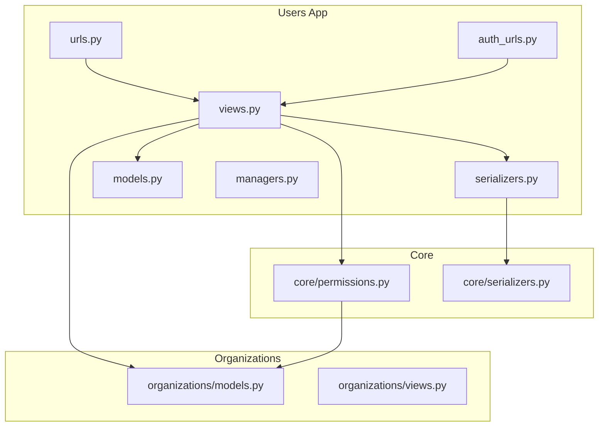
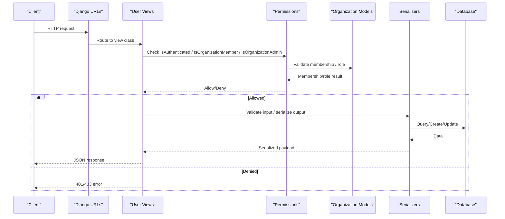
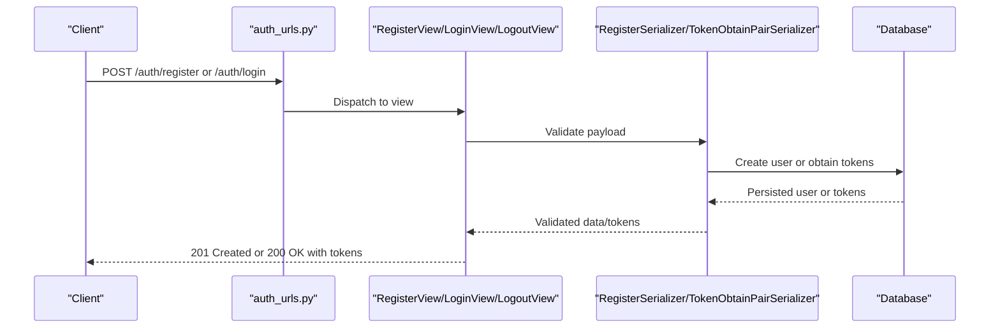
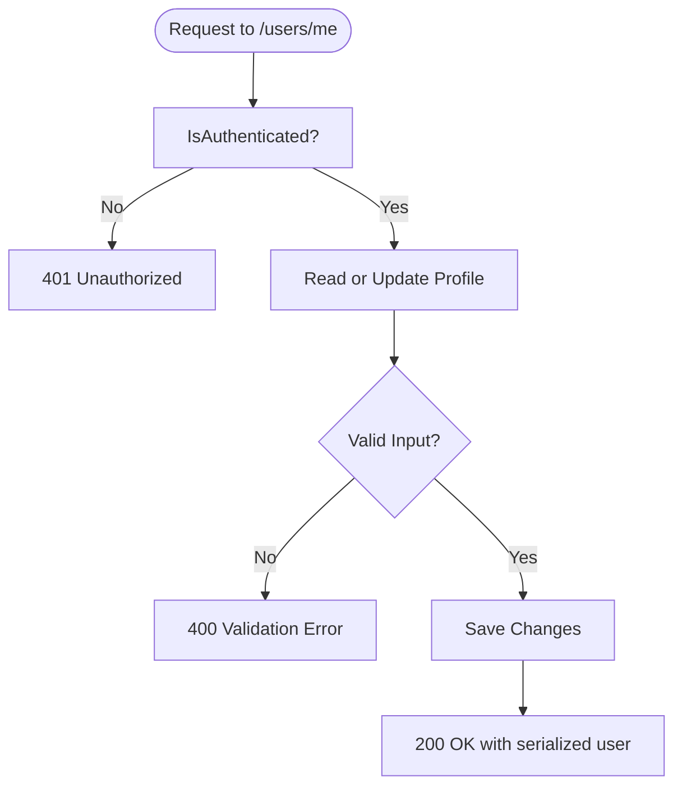
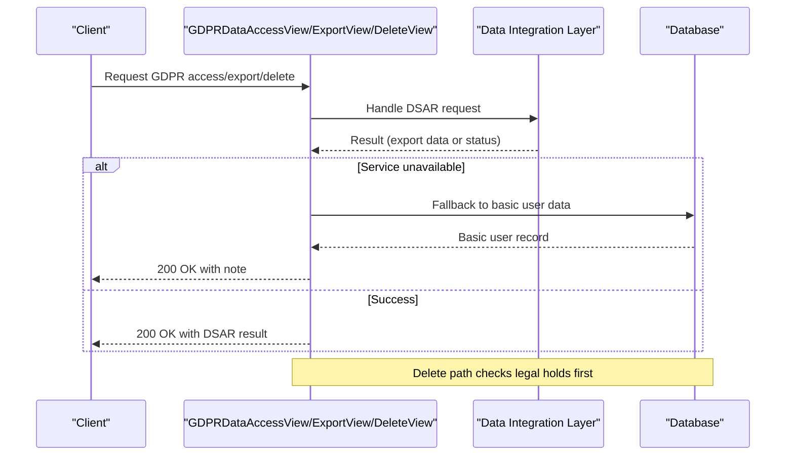
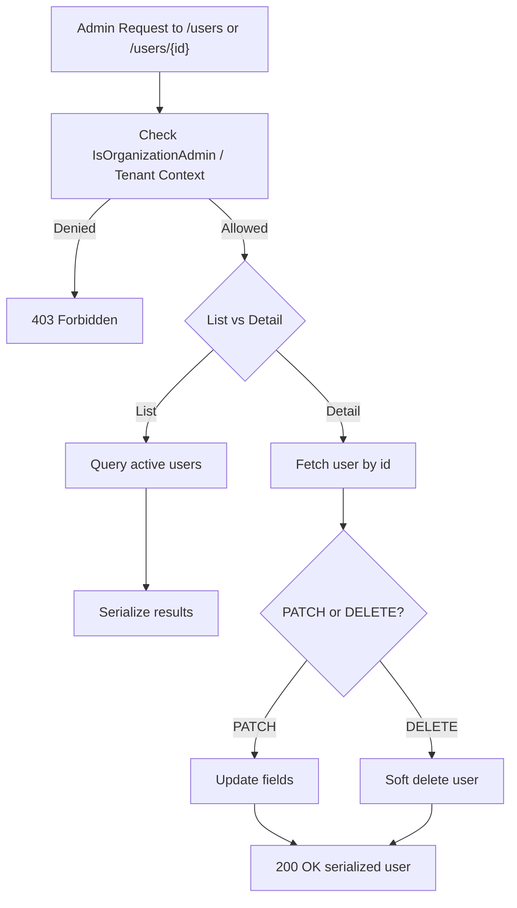
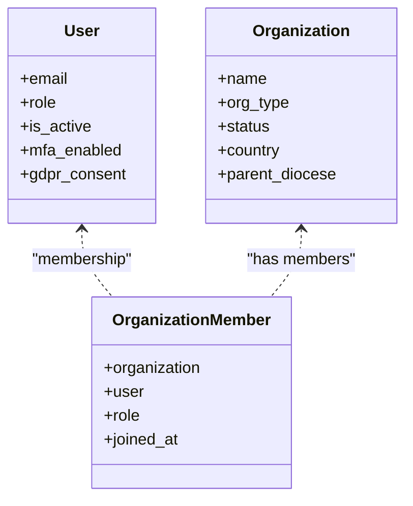
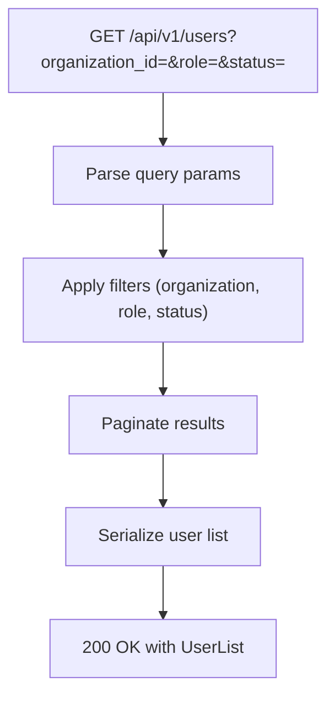
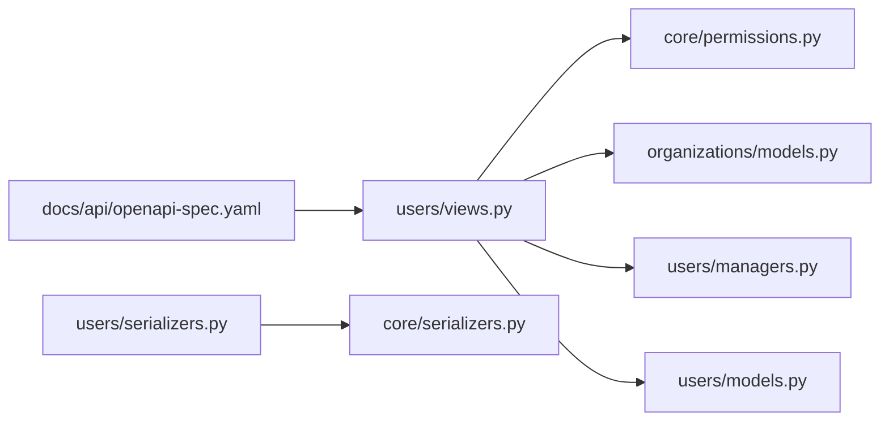

# Users API

<cite>
**Referenced Files in This Document**
- [models.py](file://backend/django/apps/users/models.py)
- [serializers.py](file://backend/django/apps/users/serializers.py)
- [views.py](file://backend/django/apps/users/views.py)
- [urls.py](file://backend/django/apps/users/urls.py)
- [auth_urls.py](file://backend/django/apps/users/auth_urls.py)
- [managers.py](file://backend/django/apps/users/managers.py)
- [permissions.py](file://backend/django/apps/core/permissions.py)
- [organizations_models.py](file://backend/django/apps/organizations/models.py)
- [organizations_views.py](file://backend/django/apps/organizations/views.py)
- [openapi-spec.yaml](file://docs/api/openapi-spec.yaml)
</cite>

## Table of Contents
1. Introduction
2. Project Structure
3. Core Components
4. Architecture Overview
5. Detailed Component Analysis
6. Dependency Analysis
7. Performance Considerations
8. Troubleshooting Guide
9. Conclusion
10. Appendices

## Introduction
This document provides comprehensive API documentation for user management endpoints in the JOL-HUB backend. It covers user registration, authentication, profile management, password changes, GDPR data rights (access, export, erasure), and administrative user listing/detail operations. It also documents role-based access control, permission inheritance via organization memberships, and integration with organizational hierarchies. Request/response schemas are described using the project’s serializers and OpenAPI specification.

## Project Structure
The user management feature is implemented as a Django app under apps/users with views, serializers, models, and URL routing. Authentication routes are exposed under apps/users/auth_urls.py, while general user routes are under apps/users/urls.py. Permissions and multi-tenant isolation are enforced by shared core permissions and organization membership models.

**Diagram sources**
- [urls.py:20-28](file://backend/django/apps/users/urls.py#L20-L28)
- [auth_urls.py:16-21](file://backend/django/apps/users/auth_urls.py#L16-L21)
- [views.py:31-194](file://backend/django/apps/users/views.py#L31-L194)
- [serializers.py:13-109](file://backend/django/apps/users/serializers.py#L13-L109)
- [models.py:17-123](file://backend/django/apps/users/models.py#L17-L123)
- [managers.py:9-39](file://backend/django/apps/users/managers.py#L9-L39)
- [permissions.py:26-203](file://backend/django/apps/core/permissions.py#L26-L203)
- [organizations_models.py:12-495](file://backend/django/apps/organizations/models.py#L12-L495)
- [organizations_views.py:17-73](file://backend/django/apps/organizations/views.py#L17-L73)

**Section sources**
- [urls.py:20-28](file://backend/django/apps/users/urls.py#L20-L28)
- [auth_urls.py:16-21](file://backend/django/apps/users/auth_urls.py#L16-L21)

## Core Components
- User model and profile: Defines platform users with roles, auth flags, MFA, profile fields, GDPR consent tracking, and soft delete behavior.
- Serializers: Provide input validation and output shaping for registration, profile read/write, password change, and JWT token pairs.
- Views: Implement REST endpoints for registration, login/logout, current user profile, password change, GDPR data rights, and admin user list/detail.
- Managers: Custom user manager supporting email-as-username and active filtering.
- Permissions: Enforce multi-tenant isolation, organization membership, admin roles, special category data access, and financial data processing restrictions.
- Organizations: Model hierarchy and membership that drive RBAC and tenant scoping.

Key responsibilities:
- Registration and authentication flow with rate limiting and JWT tokens.
- Profile management for authenticated users.
- Password updates with validation.
- GDPR compliance: access summary, full export, and erasure with legal hold checks.
- Admin operations to list and manage users with soft deletes.

**Section sources**
- [models.py:17-123](file://backend/django/apps/users/models.py#L17-L123)
- [serializers.py:13-109](file://backend/django/apps/users/serializers.py#L13-L109)
- [views.py:31-194](file://backend/django/apps/users/views.py#L31-L194)
- [managers.py:9-39](file://backend/django/apps/users/managers.py#L9-L39)
- [permissions.py:26-203](file://backend/django/apps/core/permissions.py#L26-L203)
- [organizations_models.py:12-495](file://backend/django/apps/organizations/models.py#L12-L495)

## Architecture Overview
The user management API follows a layered architecture:
- URL routing maps endpoints to view classes.
- Views handle request lifecycle, apply permissions, validate inputs via serializers, and interact with models and managers.
- Models define domain entities and behaviors (e.g., soft delete).
- Shared permissions enforce multi-tenant isolation and role-based access.
- Organization models provide hierarchical context and membership for RBAC.

**Diagram sources**
- [urls.py:20-28](file://backend/django/apps/users/urls.py#L20-L28)
- [views.py:31-194](file://backend/django/apps/users/views.py#L31-L194)
- [permissions.py:26-203](file://backend/django/apps/core/permissions.py#L26-L203)
- [organizations_models.py:239-280](file://backend/django/apps/organizations/models.py#L239-L280)
- [serializers.py:13-109](file://backend/django/apps/users/serializers.py#L13-L109)

## Detailed Component Analysis

### Authentication Endpoints
- Register: POST /api/v1/auth/register/ creates a new user account with password validation and consent timestamps.
- Login: POST /api/v1/auth/login/ returns JWT token pair including embedded user data.
- Logout: POST /api/v1/auth/logout/ blacklists refresh token.
- Refresh: POST /api/v1/auth/refresh/ refreshes access token.

**Diagram sources**
- [auth_urls.py:16-21](file://backend/django/apps/users/auth_urls.py#L16-L21)
- [views.py:31-70](file://backend/django/apps/users/views.py#L31-L70)
- [serializers.py:53-109](file://backend/django/apps/users/serializers.py#L53-L109)

**Section sources**
- [auth_urls.py:16-21](file://backend/django/apps/users/auth_urls.py#L16-L21)
- [views.py:31-70](file://backend/django/apps/users/views.py#L31-L70)
- [serializers.py:53-109](file://backend/django/apps/users/serializers.py#L53-L109)

### Current User Profile Management
- GET/PATCH /api/v1/users/me/: Retrieve or update the authenticated user’s profile.
- POST /api/v1/users/me/change-password/: Change password with old/new validation.

**Diagram sources**
- [views.py:73-175](file://backend/django/apps/users/views.py#L73-L175)
- [serializers.py:13-41](file://backend/django/apps/users/serializers.py#L13-L41)

**Section sources**
- [views.py:73-175](file://backend/django/apps/users/views.py#L73-L175)
- [serializers.py:13-41](file://backend/django/apps/users/serializers.py#L13-L41)

### GDPR Data Rights
- Access Summary: GET /api/v1/users/me/gdpr/access/ returns categories of personal data and rights links.
- Export: GET /api/v1/users/me/gdpr/export/ performs DSAR export with fallback to basic user data if service unavailable.
- Erasure: DELETE /api/v1/users/me/gdpr/delete/ enforces legal holds before deletion; otherwise triggers DSAR erasure and soft-deletes user.

**Diagram sources**
- [views.py:88-352](file://backend/django/apps/users/views.py#L88-L352)

**Section sources**
- [views.py:88-352](file://backend/django/apps/users/views.py#L88-L352)

### Administrative User Listing and Detail
- List: GET /api/v1/users/ returns active users ordered by email.
- Detail: GET/PATCH/DELETE /api/v1/users/{id}/ retrieves, updates, or soft-deletes a user.

**Diagram sources**
- [views.py:177-194](file://backend/django/apps/users/views.py#L177-L194)
- [managers.py:37-39](file://backend/django/apps/users/managers.py#L37-L39)

**Section sources**
- [views.py:177-194](file://backend/django/apps/users/views.py#L177-L194)
- [managers.py:37-39](file://backend/django/apps/users/managers.py#L37-L39)

### Role-Based Access Control and Organization Integration
- Multi-tenant isolation: Enforced via IsOrganizationMember and IsOrganizationAdmin permissions using tenant context from middleware or headers.
- Organization membership: OrganizationMember links users to organizations with roles (admin, editor, viewer).
- Hierarchy: Organizations support diocese/deanery/facility levels influencing scope and permissions.
- Special category data: Restricted to admin/editor roles within tenant context.

**Diagram sources**
- [models.py:17-123](file://backend/django/apps/users/models.py#L17-L123)
- [organizations_models.py:12-280](file://backend/django/apps/organizations/models.py#L12-L280)
- [permissions.py:26-203](file://backend/django/apps/core/permissions.py#L26-L203)

**Section sources**
- [permissions.py:26-203](file://backend/django/apps/core/permissions.py#L26-L203)
- [organizations_models.py:12-280](file://backend/django/apps/organizations/models.py#L12-L280)

### Filtering Users by Organization, Role, and Status
- The OpenAPI spec defines query parameters for listing users: organization_id, role, status, page, page_size.
- While the current UserListView filters by active users, the documented API supports additional filters per spec.

**Diagram sources**
- [openapi-spec.yaml:412-465](file://docs/api/openapi-spec.yaml#L412-L465)

**Section sources**
- [openapi-spec.yaml:412-465](file://docs/api/openapi-spec.yaml#L412-L465)

## Dependency Analysis
- Users app depends on core permissions and organization models for RBAC and tenant isolation.
- Serializers depend on core base serializer for consistent id/timestamp fields.
- Views integrate with managers for user creation and querying.
- OpenAPI spec documents expected filtering and pagination behavior for user listing.

**Diagram sources**
- [views.py:31-194](file://backend/django/apps/users/views.py#L31-L194)
- [permissions.py:26-203](file://backend/django/apps/core/permissions.py#L26-L203)
- [organizations_models.py:12-280](file://backend/django/apps/organizations/models.py#L12-L280)
- [serializers.py:13-109](file://backend/django/apps/users/serializers.py#L13-L109)
- [core_serializers.py:9-29](file://backend/django/apps/core/serializers.py#L9-L29)
- [managers.py:9-39](file://backend/django/apps/users/managers.py#L9-L39)
- [models.py:17-123](file://backend/django/apps/users/models.py#L17-L123)
- [openapi-spec.yaml:412-465](file://docs/api/openapi-spec.yaml#L412-L465)

**Section sources**
- [views.py:31-194](file://backend/django/apps/users/views.py#L31-L194)
- [permissions.py:26-203](file://backend/django/apps/core/permissions.py#L26-L203)
- [organizations_models.py:12-280](file://backend/django/apps/organizations/models.py#L12-L280)
- [serializers.py:13-109](file://backend/django/apps/users/serializers.py#L13-L109)
- [core_serializers.py:9-29](file://backend/django/apps/core/serializers.py#L9-L29)
- [managers.py:9-39](file://backend/django/apps/users/managers.py#L9-L39)
- [models.py:17-123](file://backend/django/apps/users/models.py#L17-L123)
- [openapi-spec.yaml:412-465](file://docs/api/openapi-spec.yaml#L412-L465)

## Performance Considerations
- Rate limiting: Sensitive endpoints (register, login, logout, GDPR export/delete) use throttling to prevent abuse and brute-force attacks.
- Query optimization: Active user lists filter by is_active and order by email; consider adding indexes for common filters (organization, role, status) if not already present.
- Pagination: Use page and page_size parameters to limit payload size and improve response times.
- Soft deletes: Avoid hard deletes to preserve auditability and reduce database churn.

[No sources needed since this section provides general guidance]

## Troubleshooting Guide
Common issues and resolutions:
- Authentication failures: Ensure valid credentials and check rate limits on login/register endpoints.
- Permission denied: Verify tenant context and organization membership; confirm user has required role (admin/editor) for sensitive operations.
- GDPR erasure blocked: Legal holds prevent deletion; contact legal team to resolve holds before proceeding.
- Cross-tenant access attempts: Requests must include correct tenant context; middleware validates and logs violations.

**Section sources**
- [views.py:56-70](file://backend/django/apps/users/views.py#L56-L70)
- [permissions.py:26-203](file://backend/django/apps/core/permissions.py#L26-L203)
- [organizations_models.py:150-172](file://backend/django/apps/organizations/models.py#L150-L172)

## Conclusion
The Users API provides a robust foundation for user lifecycle management, secure authentication, profile operations, and GDPR compliance. Role-based access control integrated with organizational hierarchies ensures multi-tenant isolation and appropriate permissions. Administrators can manage users efficiently while adhering to security and compliance requirements.

[No sources needed since this section summarizes without analyzing specific files]

## Appendices

### API Endpoints Summary
- Authentication:
  - POST /api/v1/auth/register/
  - POST /api/v1/auth/login/
  - POST /api/v1/auth/logout/
  - POST /api/v1/auth/refresh/
- User Profile:
  - GET/PATCH /api/v1/users/me/
  - POST /api/v1/users/me/change-password/
- GDPR:
  - GET /api/v1/users/me/gdpr/access/
  - GET /api/v1/users/me/gdpr/export/
  - DELETE /api/v1/users/me/gdpr/delete/
- Admin:
  - GET /api/v1/users/
  - GET/PATCH/DELETE /api/v1/users/{id}/

**Section sources**
- [auth_urls.py:16-21](file://backend/django/apps/users/auth_urls.py#L16-L21)
- [urls.py:20-28](file://backend/django/apps/users/urls.py#L20-L28)

### Request/Response Schemas
- User entity fields: id, email, first_name, last_name, full_name, role, is_active, is_verified, mfa_enabled, avatar, phone, preferred_language, timezone, country, gdpr_consent, gdpr_consent_at, marketing_consent, marketing_consent_at, last_login, login_count, profile, created_at, updated_at.
- Registration payload: email, first_name, last_name, password, password_confirm, gdpr_consent, marketing_consent.
- Password change payload: old_password, new_password.
- Token response: access token, refresh token, embedded user object.

**Section sources**
- [serializers.py:13-109](file://backend/django/apps/users/serializers.py#L13-L109)
- [models.py:17-123](file://backend/django/apps/users/models.py#L17-L123)

### Example Workflows
- User registration and login:
  - Register a new account with consent flags.
  - Login to obtain JWT tokens and access protected endpoints.
- Profile update:
  - PATCH /api/v1/users/me/ to update profile fields.
- Password change:
  - POST /api/v1/users/me/change-password/ with old and new passwords.
- Administrative tasks:
  - List users with filters (organization_id, role, status) per OpenAPI spec.
  - Update or soft-delete a user by ID.

**Section sources**
- [views.py:31-194](file://backend/django/apps/users/views.py#L31-L194)
- [openapi-spec.yaml:412-465](file://docs/api/openapi-spec.yaml#L412-L465)