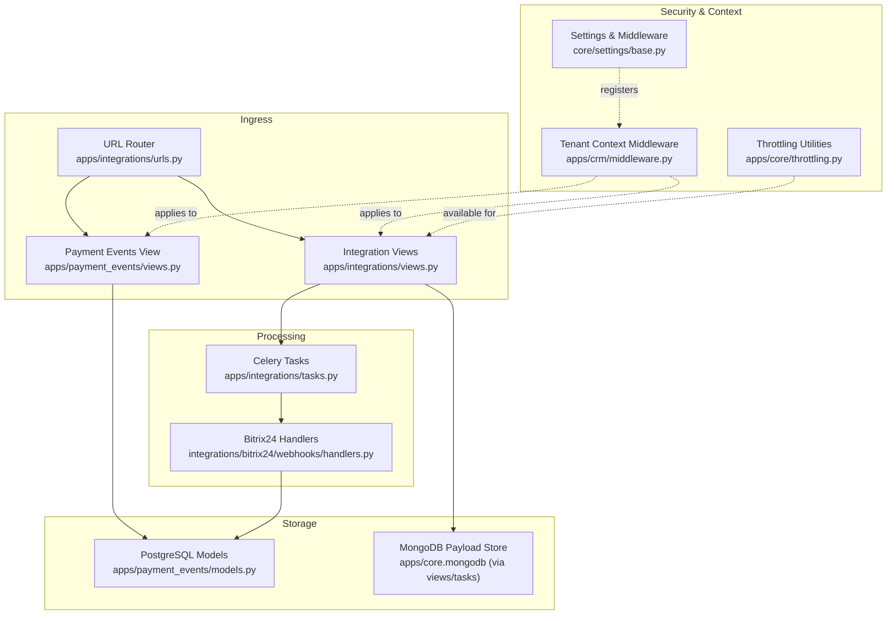
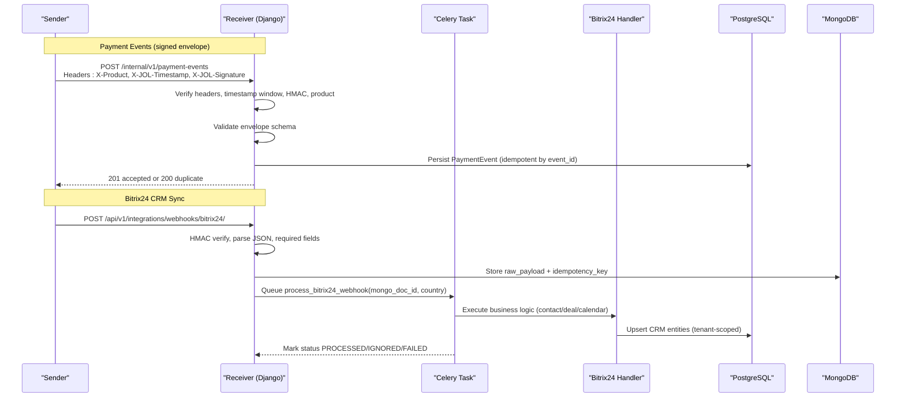
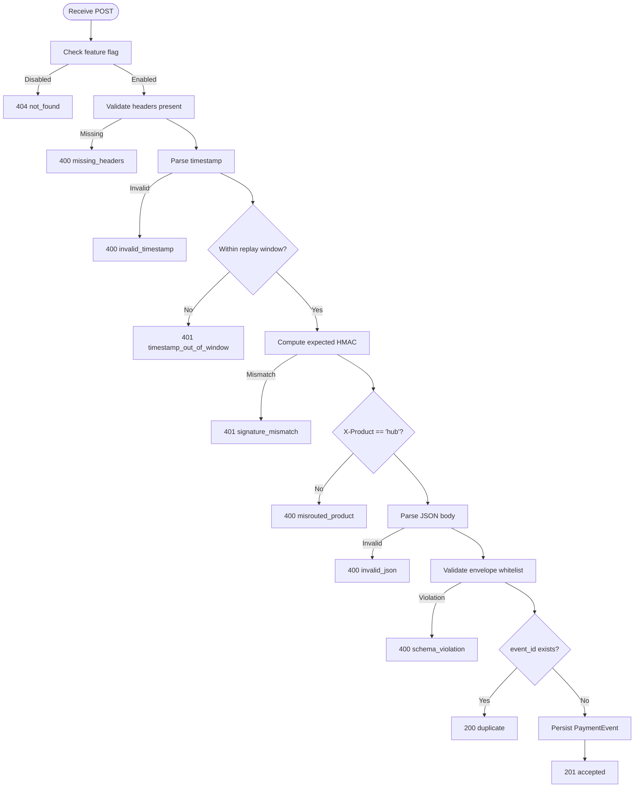
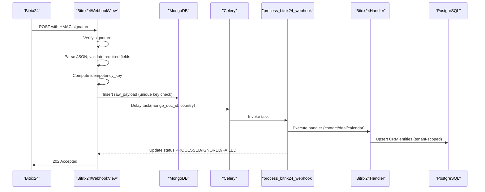
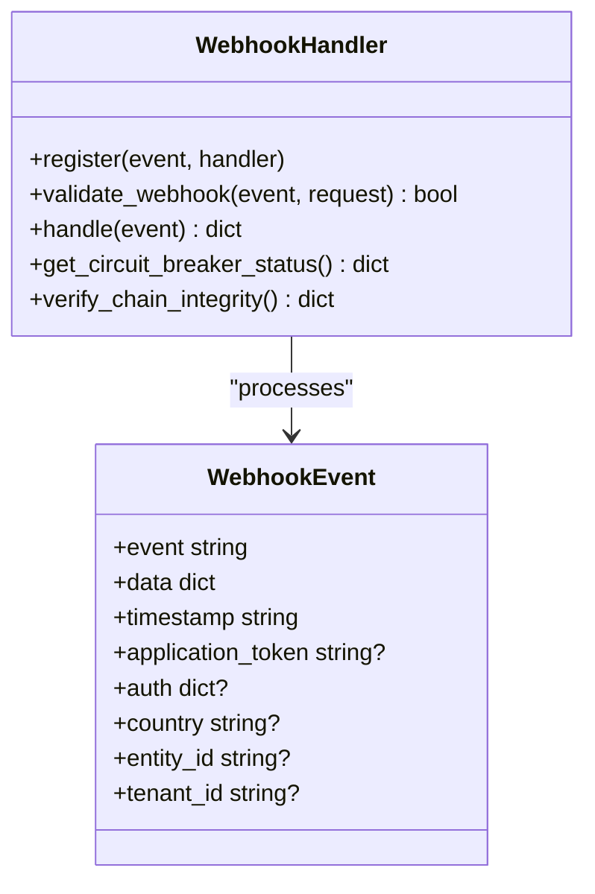
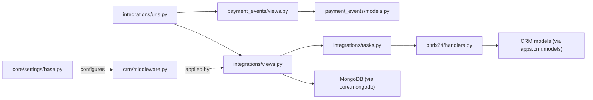

# Webhook Endpoints

<cite>
**Referenced Files in This Document**
- [payment_events/views.py](file://backend/django/apps/payment_events/views.py)
- [payment_events/models.py](file://backend/django/apps/payment_events/models.py)
- [integrations/urls.py](file://backend/django/apps/integrations/urls.py)
- [integrations/views.py](file://backend/django/apps/integrations/views.py)
- [integrations/tasks.py](file://backend/django/apps/integrations/tasks.py)
- [bitrix24/handlers.py](file://backend/integrations/bitrix24/webhooks/handlers.py)
- [crm/middleware.py](file://backend/django/apps/crm/middleware.py)
- [core/settings/base.py](file://backend/django/core/settings/base.py)
- [core/throttling.py](file://backend/django/apps/core/throttling.py)
- [payment-api-contract.md](file://docs/payment-api-contract.md)
</cite>

## Table of Contents
1. Introduction
2. Project Structure
3. Core Components
4. Architecture Overview
5. Detailed Component Analysis
6. Dependency Analysis
7. Performance Considerations
8. Troubleshooting Guide
9. Conclusion

## Introduction
This document provides comprehensive API documentation for webhook endpoints that handle external service integrations. It covers:
- Payment event webhooks (internal marketplace-to-hub signed envelopes)
- CRM sync webhooks (Bitrix24 events)
- System notification webhooks (PayPal and Bitrix24 health endpoint)
- Event types, payload structures, signature verification, retry policies, error handling, security measures, implementation guides, and debugging strategies.

## Project Structure
The webhook system spans several modules:
- Payment events receiver enforces a strict signed-envelope contract with HMAC verification and idempotent persistence.
- Integration webhooks accept payloads from PayPal and Bitrix24, validate signatures, store raw payloads, and dispatch background tasks.
- Bitrix24 handlers perform country-scoped routing, tenant isolation, and CRM entity synchronization.
- Middleware injects tenant context for multi-tenant isolation.
- Settings register middleware and apps; throttling utilities provide rate-limiting patterns.

**Diagram sources**
- [integrations/urls.py:6-16](file://backend/django/apps/integrations/urls.py#L6-L16)
- [payment_events/views.py:79-143](file://backend/django/apps/payment_events/views.py#L79-L143)
- [integrations/views.py:30-51](file://backend/django/apps/integrations/views.py#L30-L51)
- [integrations/views.py:195-293](file://backend/django/apps/integrations/views.py#L195-L293)
- [integrations/tasks.py:93-294](file://backend/django/apps/integrations/tasks.py#L93-L294)
- [bitrix24/handlers.py:63-152](file://backend/integrations/bitrix24/webhooks/handlers.py#L63-L152)
- [payment_events/models.py:6-36](file://backend/django/apps/payment_events/models.py#L6-L36)
- [crm/middleware.py:96-154](file://backend/django/apps/crm/middleware.py#L96-L154)
- [core/settings/base.py:121-145](file://backend/django/core/settings/base.py#L121-L145)
- [core/throttling.py:15-77](file://backend/django/apps/core/throttling.py#L15-L77)

**Section sources**
- [integrations/urls.py:6-16](file://backend/django/apps/integrations/urls.py#L6-L16)
- [core/settings/base.py:121-145](file://backend/django/core/settings/base.py#L121-L145)

## Core Components
- Payment Events Receiver: Accepts signed payment-event envelopes, verifies headers, timestamp window, HMAC signature, product routing, validates envelope schema, deduplicates by event_id, persists, and returns idempotent responses.
- Integration Webhooks:
  - PayPal: Stores incoming payloads idempotently and queues async processing.
  - Bitrix24: Validates HMAC signature, parses JSON, checks required fields, computes idempotency key, stores raw payload in MongoDB, and queues async processing. Includes a health endpoint.
- Bitrix24 Handlers: Validate application token and signature, route to contact/deal/calendar handlers, sync entities into local CRM with tenant isolation, and log audit entries.
- Tenant Context Middleware: Extracts tenant context from JWT or headers, caches tenant info, and enforces data residency and compliance metadata per request.
- Throttling Utilities: Provide reusable throttle classes for sensitive endpoints (auth, GDPR export/delete, donations).

**Section sources**
- [payment_events/views.py:28-143](file://backend/django/apps/payment_events/views.py#L28-L143)
- [integrations/views.py:30-51](file://backend/django/apps/integrations/views.py#L30-L51)
- [integrations/views.py:195-293](file://backend/django/apps/integrations/views.py#L195-L293)
- [bitrix24/handlers.py:63-152](file://backend/integrations/bitrix24/webhooks/handlers.py#L63-L152)
- [crm/middleware.py:96-154](file://backend/django/apps/crm/middleware.py#L96-L154)
- [core/throttling.py:15-77](file://backend/django/apps/core/throttling.py#L15-L77)

## Architecture Overview
End-to-end flows for each webhook type:

**Diagram sources**
- [payment_api_contract:29-83](file://docs/payment-api-contract.md#L29-L83)
- [payment_events/views.py:79-143](file://backend/django/apps/payment_events/views.py#L79-L143)
- [integrations/views.py:195-293](file://backend/django/apps/integrations/views.py#L195-L293)
- [integrations/tasks.py:93-294](file://backend/django/apps/integrations/tasks.py#L93-L294)
- [bitrix24/handlers.py:63-152](file://backend/integrations/bitrix24/webhooks/handlers.py#L63-L152)

## Detailed Component Analysis

### Payment Events Receiver
- Endpoint: POST /internal/v1/payment-events (contract-defined path; hub serves this path).
- Authentication: Signed-envelope HMAC using delivery key. Required headers: Content-Type, X-Product, X-JOL-Timestamp, X-JOL-Signature.
- Replay protection: Timestamp must be within ±300 seconds.
- Product routing: Only accepts product = "hub".
- Schema validation: Envelope whitelist enforced; unknown fields ignored.
- Idempotency: Dedupe by event_id; duplicates return 200 no-op.
- Persistence: Durable acceptance before any side effects.
- Error contract: 4xx never signals retry; 5xx reserved for unavailability.

**Diagram sources**
- [payment_events/views.py:79-143](file://backend/django/apps/payment_events/views.py#L79-L143)
- [payment-api-contract.md:29-83](file://docs/payment-api-contract.md#L29-L83)

**Section sources**
- [payment_events/views.py:28-143](file://backend/django/apps/payment_events/views.py#L28-L143)
- [payment_events/models.py:6-36](file://backend/django/apps/payment_events/models.py#L6-L36)
- [payment-api-contract.md:29-83](file://docs/payment-api-contract.md#L29-L83)

### PayPal Webhook Ingestion
- Endpoint: POST /api/v1/integrations/webhooks/paypal/
- Behavior: Uses PayPal transmission ID for idempotency; stores payload; queues async processing via Celery task.
- Response: 200 with status received or duplicate if already stored.

**Section sources**
- [integrations/views.py:30-51](file://backend/django/apps/integrations/views.py#L30-L51)
- [integrations/tasks.py:81-90](file://backend/django/apps/integrations/tasks.py#L81-L90)

### Bitrix24 CRM Webhooks
- Endpoint: POST /api/v1/integrations/webhooks/bitrix24/
- Security: HMAC-SHA256 signature verification against configured secret; development mode logs warning when secret is absent.
- Validation: Requires valid JSON object and presence of event field.
- Idempotency: Computes deterministic key from auth.domain, event, data.FIELDS.ID, ts; fallback to SHA-256 of raw body.
- Storage: Raw payload stored in MongoDB with source, event_type, idempotency_key, country, raw_payload.
- Processing: Queues Celery task process_bitrix24_webhook with country for GDPR Article 44 routing.
- Health: GET /api/v1/integrations/webhooks/bitrix24/health/ returns circuit breaker status and audit chain integrity.

**Diagram sources**
- [integrations/views.py:195-293](file://backend/django/apps/integrations/views.py#L195-L293)
- [integrations/tasks.py:93-294](file://backend/django/apps/integrations/tasks.py#L93-L294)
- [bitrix24/handlers.py:63-152](file://backend/integrations/bitrix24/webhooks/handlers.py#L63-L152)

**Section sources**
- [integrations/views.py:54-293](file://backend/django/apps/integrations/views.py#L54-L293)
- [integrations/tasks.py:93-294](file://backend/django/apps/integrations/tasks.py#L93-L294)
- [bitrix24/handlers.py:63-152](file://backend/integrations/bitrix24/webhooks/handlers.py#L63-L152)

### Bitrix24 Handler Details
- Validation: Application token and optional HMAC signature verification.
- Routing: Contact add/update/delete, Deal add/update/delete, Calendar add/update/delete.
- Sync: Updates or creates CRM entities with tenant isolation; soft deletes on removal; audit logging.
- Circuit Breaker: Health endpoint exposes breaker state and audit chain verification.

**Diagram sources**
- [bitrix24/handlers.py:37-152](file://backend/integrations/bitrix24/webhooks/handlers.py#L37-L152)
- [bitrix24/handlers.py:421-471](file://backend/integrations/bitrix24/webhooks/handlers.py#L421-L471)

**Section sources**
- [bitrix24/handlers.py:63-152](file://backend/integrations/bitrix24/webhooks/handlers.py#L63-L152)
- [bitrix24/handlers.py:421-471](file://backend/integrations/bitrix24/webhooks/handlers.py#L421-L471)

### Tenant Context Middleware
- Purpose: Establishes request-scoped tenant identification, row-level security enforcement, and audit context injection.
- Extraction: From JWT claims, X-Tenant-ID header, or user’s default organization.
- Validation: Checks active tenant and data residency region; caches tenant info.
- Usage: Applied globally via settings middleware stack; ensures cross-tenant isolation across webhook processing paths where applicable.

**Section sources**
- [crm/middleware.py:96-154](file://backend/django/apps/crm/middleware.py#L96-L154)
- [crm/middleware.py:156-299](file://backend/django/apps/crm/middleware.py#L156-L299)
- [core/settings/base.py:121-145](file://backend/django/core/settings/base.py#L121-L145)

## Dependency Analysis
Key dependencies and relationships:
- URL router wires webhook endpoints to views.
- Views depend on models for persistence and on tasks for async processing.
- Tasks depend on MongoDB for raw payload storage and PostgreSQL for tracking records.
- Bitrix24 handlers depend on CRM models and audit logging for compliance.
- Middleware integrates into Django request/response cycle for tenant context.
- Settings configure middleware and installed apps.

**Diagram sources**
- [integrations/urls.py:6-16](file://backend/django/apps/integrations/urls.py#L6-L16)
- [payment_events/views.py:79-143](file://backend/django/apps/payment_events/views.py#L79-L143)
- [integrations/views.py:195-293](file://backend/django/apps/integrations/views.py#L195-L293)
- [integrations/tasks.py:93-294](file://backend/django/apps/integrations/tasks.py#L93-L294)
- [bitrix24/handlers.py:63-152](file://backend/integrations/bitrix24/webhooks/handlers.py#L63-L152)
- [crm/middleware.py:96-154](file://backend/django/apps/crm/middleware.py#L96-L154)
- [core/settings/base.py:121-145](file://backend/django/core/settings/base.py#L121-L145)

**Section sources**
- [integrations/urls.py:6-16](file://backend/django/apps/integrations/urls.py#L6-L16)
- [core/settings/base.py:121-145](file://backend/django/core/settings/base.py#L121-L145)

## Performance Considerations
- Fast acknowledgment: Bitrix24 view returns 202 Accepted quickly to avoid timeouts; heavy processing is offloaded to Celery.
- Idempotency: Prevents duplicate processing and reduces redundant work.
- Async processing: Celery tasks with autoretry for transient errors and backoff reduce load spikes.
- Storage separation: MongoDB for raw payloads decouples ingestion from relational writes.
- Tenant caching: Middleware caches tenant info to minimize database lookups.

[No sources needed since this section provides general guidance]

## Troubleshooting Guide
Common issues and resolutions:
- Signature mismatch:
  - Ensure correct delivery key or Bitrix24 secret is configured.
  - Verify HMAC computation matches the sender’s method.
  - For payment events, confirm timestamp within replay window and raw body used for signature.
- Missing headers:
  - Confirm required headers are present (e.g., X-Product, X-JOL-Timestamp, X-JOL-Signature for payment events; X-Bitrix24-Signature for Bitrix24).
- Malformed payload:
  - Validate JSON structure and required fields (e.g., event field for Bitrix24).
- Duplicate events:
  - Expected due to at-least-once delivery; responses indicate duplicates without errors.
- Transient failures:
  - Celery retries automatically for infrastructure errors; monitor task logs and status transitions.
- Permanent failures:
  - Data validation errors mark events as FAILED; inspect error details and fix input or mapping.

**Section sources**
- [payment_events/views.py:79-143](file://backend/django/apps/payment_events/views.py#L79-L143)
- [integrations/views.py:195-293](file://backend/django/apps/integrations/views.py#L195-L293)
- [integrations/tasks.py:240-294](file://backend/django/apps/integrations/tasks.py#L240-L294)

## Conclusion
The webhook subsystem implements robust, secure, and compliant integrations for payments and CRM synchronization. It enforces strong authentication via HMAC signatures, replay protection, idempotency, and tenant isolation. Asynchronous processing and structured error handling ensure reliability and observability. Follow the provided contracts and configuration to implement custom handlers and debug delivery issues effectively.

[No sources needed since this section summarizes without analyzing specific files]