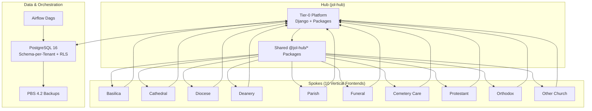
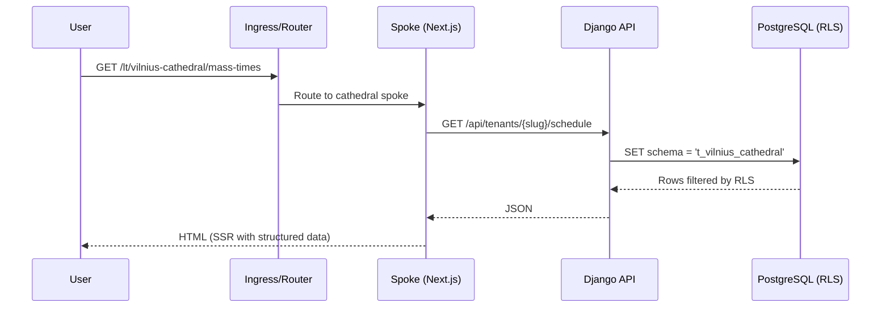
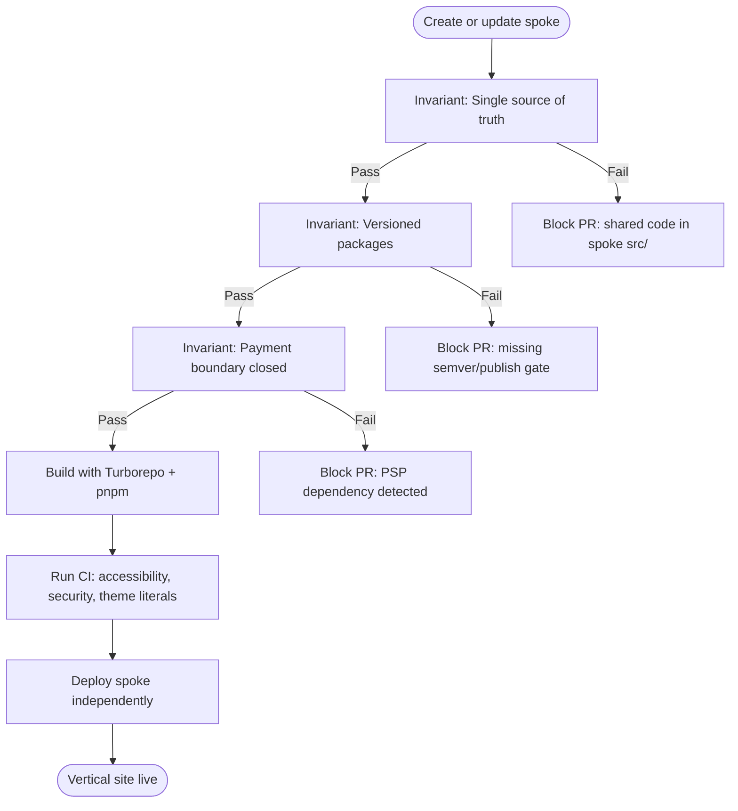
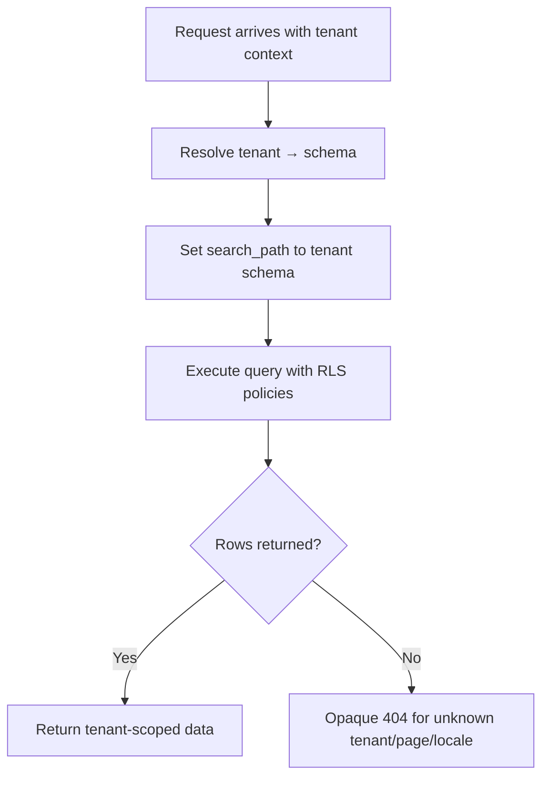
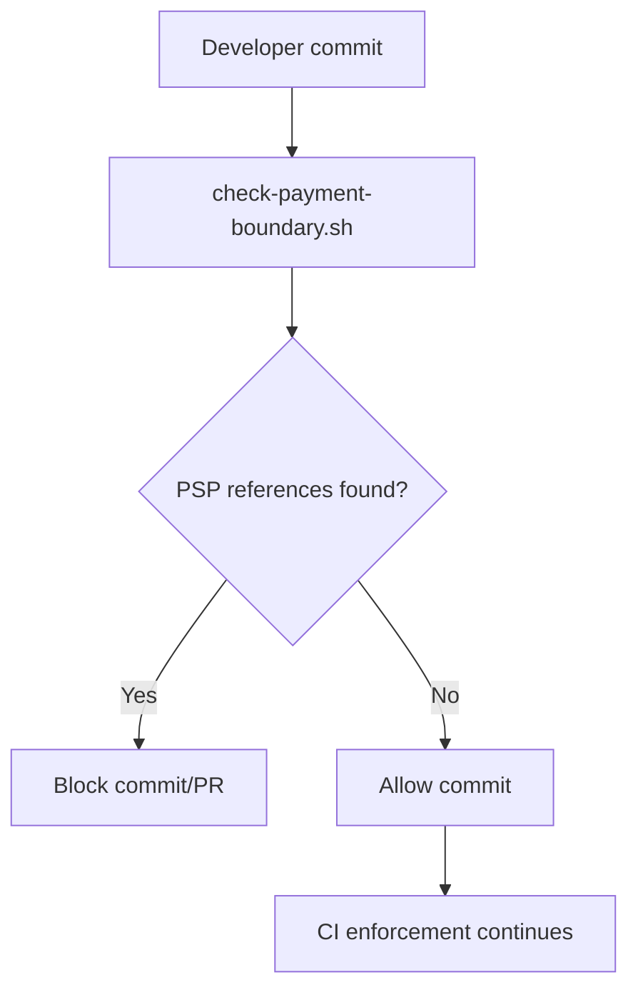
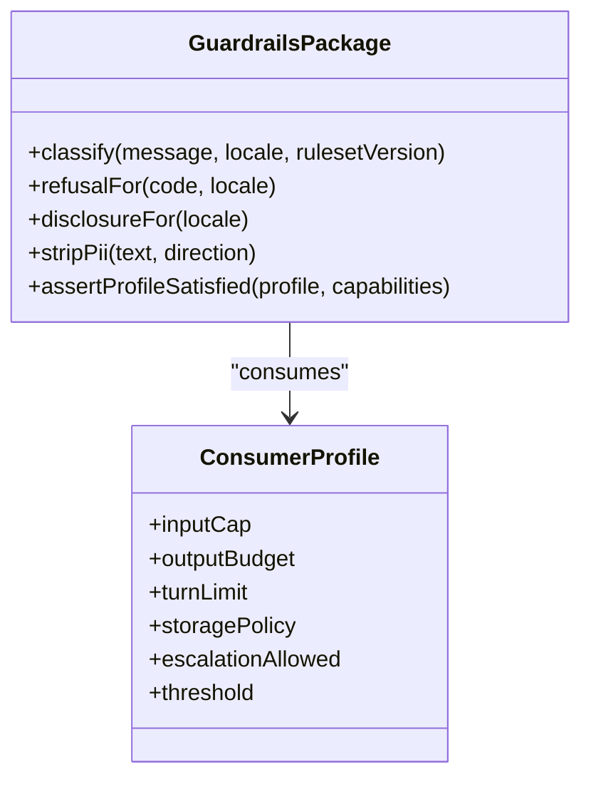
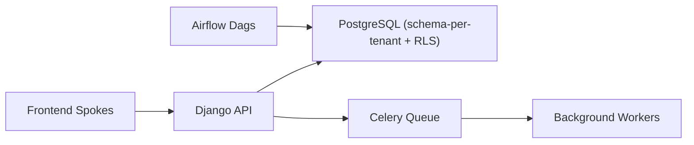
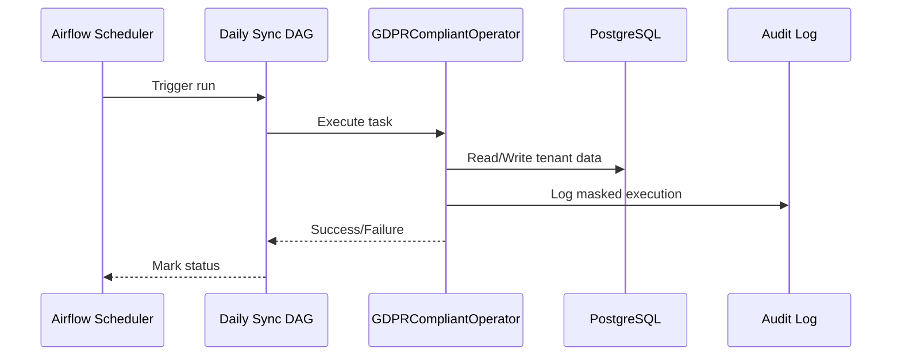
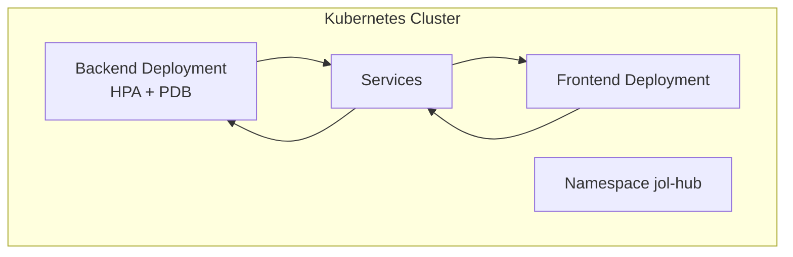
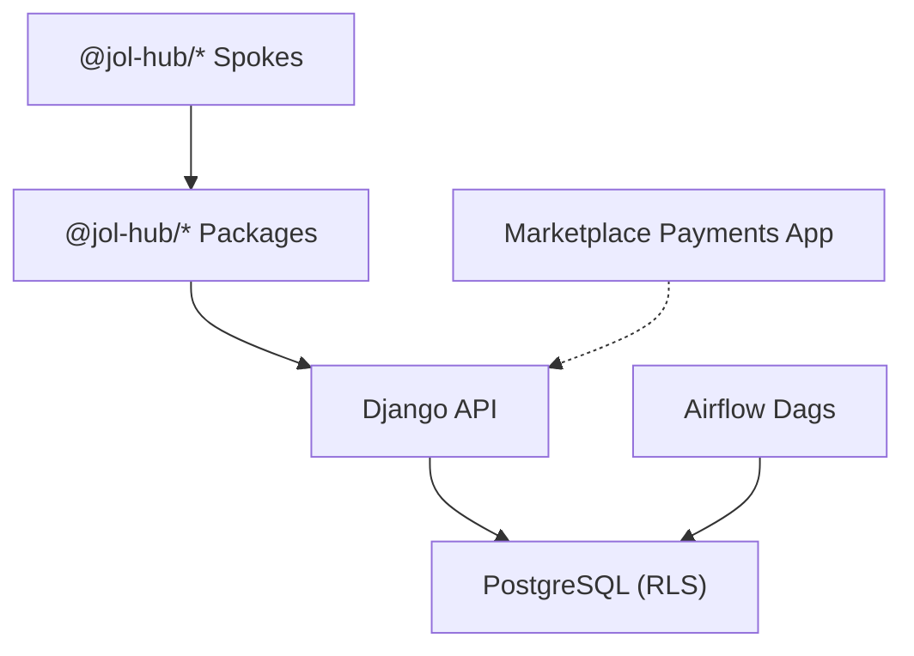

# Architectural Decisions

<cite>
**Referenced Files in This Document**
- [ADR-011-ten-vertical-frontends-hub-and-spoke.md](file://docs/decisions/ADR-011-ten-vertical-frontends-hub-and-spoke.md)
- [ADR-001-schema-per-tenant-isolation.md](file://docs/decisions/ADR-001-schema-per-tenant-isolation.md)
- [ADR-009-payment-boundary.md](file://docs/decisions/ADR-009-payment-boundary.md)
- [ADR-008-shared-ai-guardrail-pipeline.md](file://docs/decisions/ADR-008-shared-ai-guardrail-pipeline.md)
- [ADR-002-frontend-extraction-jol-frontend-platform.md](file://docs/decisions/ADR-002-frontend-extraction-jol-frontend-platform.md)
- [system-overview.md](file://docs/architecture/system-overview.md)
- [frontend-topology-10-verticals.md](file://docs/architecture/frontend-topology-10-verticals.md)
- [data-flow.md](file://docs/architecture/data-flow.md)
- [backend.yaml](file://infra/kubernetes/apps/backend.yaml)
- [frontend.yaml](file://infra/kubernetes/apps/frontend.yaml)
- [Dockerfile](file://backend/Dockerfile)
- [jol_operators.py](file://data/airflow/plugins/jol_operators.py)
- [data/.envrc.example](file://data/.envrc.example)
- [dpia-amendment-ten-verticals.md](file://docs/compliance/dpia-amendment-ten-verticals.md)
</cite>

## Table of Contents
1. [Introduction](#introduction)
2. [Project Structure](#project-structure)
3. [Core Components](#core-components)
4. [Architecture Overview](#architecture-overview)
5. [Detailed Component Analysis](#detailed-component-analysis)
6. [Dependency Analysis](#dependency-analysis)
7. [Performance Considerations](#performance-considerations)
8. [Troubleshooting Guide](#troubleshooting-guide)
9. [Conclusion](#conclusion)
10. [Appendices](#appendices)

## Introduction
This document records the key architectural decisions for the JOL-HUB platform and explains their rationale, trade-offs, constraints, evolution, compliance implications, and impact on scalability, maintainability, performance, and cost. It consolidates ratified decisions across ten vertical front-ends (hub-and-spoke), schema-per-tenant isolation, payment boundary separation, shared AI guardrail pipeline, backend orchestration choices, and container orchestration strategy.

## Project Structure
JOL-HUB is an enterprise monorepo that hosts:
- A Django backend providing a REST API with schema-per-tenant isolation and Row-Level Security.
- A Next.js frontend monorepo containing a template-renderer integration test-bed and shared packages; the authoritative topology for production is hub-and-spoke with ten vertical spokes.
- Data pipelines using Apache Airflow and dbt for ETL, GDPR reporting, and data quality.
- Infrastructure definitions for Kubernetes deployments and on-prem Proxmox VE orchestration.
- Compliance artifacts including DPIA amendments and ROPA records.

**Diagram sources**
- [frontend-topology-10-verticals.md:8-38](file://docs/architecture/frontend-topology-10-verticals.md#L8-L38)
- [ADR-011-ten-vertical-frontends-hub-and-spoke.md:62-84](file://docs/decisions/ADR-011-ten-vertical-frontends-hub-and-spoke.md#L62-L84)

**Section sources**
- [system-overview.md:26-84](file://docs/architecture/system-overview.md#L26-L84)
- [frontend-topology-10-verticals.md:40-88](file://docs/architecture/frontend-topology-10-verticals.md#L40-L88)

## Core Components
- Hub-and-spoke frontend topology: Ten independently deployable vertical sites consume versioned packages from the hub. The template-renderer remains the integration test-bed.
- Schema-per-tenant isolation: PostgreSQL schemas per tenant with Row-Level Security as defense-in-depth; logical deletion plus scheduled purge aligned to retention policy.
- Payment boundary separation: CLOSED pilot boundary; PCI scope excluded from the hub; marketplace payments_app is the sole PSP integrator.
- Shared AI guardrail pipeline: Extracted into a workspace package with consumer profiles, immutable constants, and contract tests to prevent silent weakening.
- Backend orchestration: Django REST API with Celery tasks; Airflow orchestrates ETL and GDPR-related jobs; dbt models transform data for analytics and compliance.
- Container orchestration: Kubernetes manifests define deployments, services, autoscaling, and policies; runtime targets on-prem Proxmox VE with PBS backups.

**Section sources**
- [ADR-011-ten-vertical-frontends-hub-and-spoke.md:62-110](file://docs/decisions/ADR-011-ten-vertical-frontends-hub-and-spoke.md#L62-L110)
- [ADR-001-schema-per-tenant-isolation.md:16-38](file://docs/decisions/ADR-001-schema-per-tenant-isolation.md#L16-L38)
- [ADR-009-payment-boundary.md:45-74](file://docs/decisions/ADR-009-payment-boundary.md#L45-L74)
- [ADR-008-shared-ai-guardrail-pipeline.md:40-88](file://docs/decisions/ADR-008-shared-ai-guardrail-pipeline.md#L40-L88)
- [data/.envrc.example:1-17](file://data/.envrc.example#L1-L17)
- [backend.yaml:1-204](file://infra/kubernetes/apps/backend.yaml#L1-L204)
- [frontend.yaml:1-181](file://infra/kubernetes/apps/frontend.yaml#L1-L181)

## Architecture Overview
The platform uses a hub-and-spoke topology where the hub provides shared packages and APIs, while each vertical spoke is a separate Next.js application consuming those packages. Requests are routed by an ingress/vertical router to the appropriate spoke, which renders content via SSR and calls the Django API. Data access uses schema-per-tenant isolation with RLS. Background processing is handled by Celery and Airflow.

**Diagram sources**
- [frontend-topology-10-verticals.md:89-109](file://docs/architecture/frontend-topology-10-verticals.md#L89-L109)

**Section sources**
- [frontend-topology-10-verticals.md:89-109](file://docs/architecture/frontend-topology-10-verticals.md#L89-L109)
- [data-flow.md:105-142](file://docs/architecture/data-flow.md#L105-L142)

## Detailed Component Analysis

### Hub-and-Spoke Frontend Topology (Ten Verticals)
- Decision: Adopt hub-and-spoke with ten vertical spokes consuming published @jol-hub/* packages; the template-renderer remains the integration test-bed.
- Rationale: Independent deployability and ownership per vertical; proven monorepo renderer; package publishability is the critical path.
- Trade-offs: ~15–20 days platformisation work; increased governance surface; release coordination costs.
- Constraints: No PSP SDK imports; schema-per-tenant enforced; theme verticalization; uniform stack; identical CI; WCAG AA; reversibility to monorepo while invariants hold.
- Evolution: Supersedes earlier deferrals and single-renderer assumptions; maintains reversibility under strict invariants.

**Diagram sources**
- [ADR-011-ten-vertical-frontends-hub-and-spoke.md:93-110](file://docs/decisions/ADR-011-ten-vertical-frontends-hub-and-spoke.md#L93-L110)

**Section sources**
- [ADR-011-ten-vertical-frontends-hub-and-spoke.md:21-143](file://docs/decisions/ADR-011-ten-vertical-frontends-hub-and-spoke.md#L21-L143)
- [frontend-topology-10-verticals.md:63-88](file://docs/architecture/frontend-topology-10-verticals.md#L63-L88)

### Schema-per-Tenant Isolation Strategy
- Decision: PostgreSQL schema per tenant with Row-Level Security; least-privilege roles; per-request schema resolution; logical deletion followed by scheduled purge.
- Rationale: Satisfies GDPR Art. 9 special-category data isolation and Art. 17 erasure boundaries without one database per tenant at scale.
- Trade-offs: Migration tooling must fan out across tenant schemas; operational discipline required for schema growth.
- Alternatives considered: Database-per-tenant (rejected), single shared schema only (rejected), distributed Postgres (deferred).

**Diagram sources**
- [ADR-001-schema-per-tenant-isolation.md:16-38](file://docs/decisions/ADR-001-schema-per-tenant-isolation.md#L16-L38)

**Section sources**
- [ADR-001-schema-per-tenant-isolation.md:9-45](file://docs/decisions/ADR-001-schema-per-tenant-isolation.md#L9-L45)

### Payment Boundary Separation
- Decision: CLOSED pilot boundary; Model A excludes hub from PCI scope; marketplace payments_app is sole PSP integrator; forbidden-literal guard enforces no PSP SDKs or keys in hub tree.
- Rationale: Avoids PSD2/SCA complexity and PCI scope creep during pilot; protects sensitive donation flows adjacent to Art. 9 data.
- Trade-offs: Donation flow remains design + dry-run until SAQ A verification; pilot tenants cannot take live donations in interim.
- Enforcement: Guard script runs pre-commit/CI; exemptions require ADR.

**Diagram sources**
- [ADR-009-payment-boundary.md:45-74](file://docs/decisions/ADR-009-payment-boundary.md#L45-L74)

**Section sources**
- [ADR-009-payment-boundary.md:31-87](file://docs/decisions/ADR-009-payment-boundary.md#L31-L87)

### Shared AI Guardrail Pipeline
- Decision: Extract safety classifier, refusal/disclosure constants, PII stripping, outcome taxonomy, and consumer profile registry into a workspace package; enforce inheritance rules via contract tests and SemVer.
- Rationale: Prevents silent divergence of safety-critical logic across consumers; ensures EU AI Act transparency obligations and GDPR Art. 9 boundaries are centrally governed.
- Trade-offs: New package introduces additional gates; small consumers incur registration overhead; safety over ceremony reduction.
- Enforcement: Weakening capability triggers MAJOR release blocked by CI; profiles append-only except via change-controlled exception.

**Diagram sources**
- [ADR-008-shared-ai-guardrail-pipeline.md:58-88](file://docs/decisions/ADR-008-shared-ai-guardrail-pipeline.md#L58-L88)

**Section sources**
- [ADR-008-shared-ai-guardrail-pipeline.md:19-105](file://docs/decisions/ADR-008-shared-ai-guardrail-pipeline.md#L19-L105)

### Backend Monolith Choice (Django)
- Decision: Use Django monolith for the backend API with modular apps and clear boundaries; Celery for background tasks; Airflow for ETL orchestration.
- Rationale: Simplifies multi-tenant data handling, reduces cross-service latency, and keeps audit surfaces manageable; aligns with existing Django ecosystem and team expertise.
- Trade-offs: Potential scaling challenges at extreme load; mitigated by horizontal pod autoscaling and careful partitioning of workloads.
- Evidence: Dockerized backend with health checks, resource requests/limits, and rolling updates; Kubernetes manifests define scaling policies.

**Diagram sources**
- [backend.yaml:1-204](file://infra/kubernetes/apps/backend.yaml#L1-L204)
- [frontend.yaml:1-181](file://infra/kubernetes/apps/frontend.yaml#L1-L181)
- [data/.envrc.example:1-17](file://data/.envrc.example#L1-L17)

**Section sources**
- [backend.yaml:1-204](file://infra/kubernetes/apps/backend.yaml#L1-L204)
- [Dockerfile:1-72](file://backend/Dockerfile#L1-L72)

### Frontend Monorepo Structure (Next.js)
- Decision: Maintain a Next.js monorepo with shared packages and a template-renderer integration test-bed; production topology is hub-and-spoke with ten vertical spokes.
- Rationale: Enables rapid iteration and consistent practices; extraction deferred until reference sites pass acceptance gates and packages stabilize.
- Trade-offs: Monorepo grows during pilot; extraction cost rises with delay but avoids freezing unproven architecture prematurely.
- Evidence: Turborepo/pnpm workspace; reusable workflows; strict engine/dependency assertions.

**Section sources**
- [ADR-002-frontend-extraction-jol-frontend-platform.md:8-31](file://docs/decisions/ADR-002-frontend-extraction-jol-frontend-platform.md#L8-L31)
- [frontend-topology-10-verticals.md:72-88](file://docs/architecture/frontend-topology-10-verticals.md#L72-L88)

### Apache Airflow for ETL Orchestration
- Decision: Use Airflow to orchestrate daily sync, GDPR cleanup, weekly reporting, and custom operators ensuring GDPR-compliant logging and masking.
- Rationale: Provides robust DAG-based scheduling, auditability, and extensibility for compliance-driven pipelines.
- Trade-offs: Operational overhead of managing Airflow environment; mitigated by standardized plugins and configuration.
- Evidence: Custom GDPRCompliantOperator masks PII and logs execution; environment variables configure project paths and DB credentials.

**Diagram sources**
- [jol_operators.py:10-34](file://data/airflow/plugins/jol_operators.py#L10-L34)
- [data/.envrc.example:1-17](file://data/.envrc.example#L1-L17)

**Section sources**
- [jol_operators.py:1-34](file://data/airflow/plugins/jol_operators.py#L1-L34)
- [data/.envrc.example:1-17](file://data/.envrc.example#L1-L17)

### Kubernetes for Container Orchestration
- Decision: Define deployments, services, autoscaling, and policies via Kubernetes manifests; target on-prem Proxmox VE with PBS backups.
- Rationale: Standardizes deployment, scaling, and observability; enables rolling updates and resource guarantees.
- Trade-offs: Complexity of managing K8s resources; mitigated by Helm/Kustomize patterns and clear resource limits.
- Evidence: Backend and frontend deployments include health probes, resource requests/limits, anti-affinity, and HPA/PDB.

**Diagram sources**
- [backend.yaml:1-204](file://infra/kubernetes/apps/backend.yaml#L1-L204)
- [frontend.yaml:1-181](file://infra/kubernetes/apps/frontend.yaml#L1-L181)

**Section sources**
- [backend.yaml:1-204](file://infra/kubernetes/apps/backend.yaml#L1-L204)
- [frontend.yaml:1-181](file://infra/kubernetes/apps/frontend.yaml#L1-L181)

## Dependency Analysis
- Coupling: Spokes depend on @jol-hub/* packages via registry; backend depends on PostgreSQL with RLS; Airflow depends on DB and custom operators.
- Cohesion: Each spoke contains only vertical composition; shared logic resides in hub packages; backend apps are modular.
- External dependencies: Marketplace payments_app handles PSP integration; Airflow orchestrates ETL; PBS performs backups.
- Circular dependencies: None observed; clear layering between frontend spokes, backend API, and data layer.

**Diagram sources**
- [frontend-topology-10-verticals.md:89-109](file://docs/architecture/frontend-topology-10-verticals.md#L89-L109)
- [ADR-009-payment-boundary.md:45-74](file://docs/decisions/ADR-009-payment-boundary.md#L45-L74)

**Section sources**
- [frontend-topology-10-verticals.md:40-88](file://docs/architecture/frontend-topology-10-verticals.md#L40-L88)
- [ADR-009-payment-boundary.md:31-87](file://docs/decisions/ADR-009-payment-boundary.md#L31-L87)

## Performance Considerations
- Horizontal scaling: Backend HPA scales based on CPU/memory utilization; frontend replicas configured for SSR throughput.
- Caching: Multi-level caching strategy described in data flow documentation; Redis used for session and cache layers.
- Database: Schema-per-tenant isolation reduces cross-tenant contention; RLS enforces secure access without additional middleware overhead.
- Backup and recovery: PBS 4.2 sets RPO 24h / RTO 4h; rolling updates minimize downtime.

[No sources needed since this section provides general guidance]

## Troubleshooting Guide
- Payment boundary violations: Use check-payment-boundary.sh to detect PSP references; CI blocks commits if violations are found.
- Tenant isolation issues: Verify schema resolution and RLS policies; ensure opaque 404 for unknown tenants/pages/locales.
- AI guardrail failures: Run package-level contract tests; check consumer profile satisfaction; review constant immutability.
- Airflow tasks: Inspect GDPR-compliant operator logs for masked PII; validate environment variables and DAG configurations.

**Section sources**
- [ADR-009-payment-boundary.md:45-74](file://docs/decisions/ADR-009-payment-boundary.md#L45-L74)
- [ADR-008-shared-ai-guardrail-pipeline.md:90-105](file://docs/decisions/ADR-008-shared-ai-guardrail-pipeline.md#L90-L105)
- [jol_operators.py:10-34](file://data/airflow/plugins/jol_operators.py#L10-L34)

## Conclusion
JOL-HUB’s architecture balances scalability, maintainability, compliance, and cost through deliberate decisions: hub-and-spoke frontends for independent deployability, schema-per-tenant isolation for GDPR compliance, a closed payment boundary to limit PCI scope, a shared AI guardrail pipeline to enforce safety, and Kubernetes-managed containers for reliable operations. These decisions are enforced via CI invariants, contracts, and guards, enabling safe evolution while preserving reversibility where possible.

[No sources needed since this section summarizes without analyzing specific files]

## Appendices

### Compliance-Driven Decisions
- GDPR Art. 9: Special-category data isolation via schema-per-tenant and RLS; gallery uploads trigger Art. 9 review queue; consent and retention policies enforced.
- Data residency: On-prem Proxmox VE with self-hosted/EU caching; no reliance on external cloud providers for core infrastructure.
- Regulatory requirements: PCI-DSS SAQ A gating for payment boundary opening; EU AI Act transparency via immutable disclosure constants; SOC 2 and ISO 27001 controls enforced via CI and ADR process.

**Section sources**
- [ADR-001-schema-per-tenant-isolation.md:47-52](file://docs/decisions/ADR-001-schema-per-tenant-isolation.md#L47-L52)
- [dpia-amendment-ten-verticals.md:22-82](file://docs/compliance/dpia-amendment-ten-verticals.md#L22-L82)
- [ADR-009-payment-boundary.md:97-105](file://docs/decisions/ADR-009-payment-boundary.md#L97-L105)
- [ADR-008-shared-ai-guardrail-pipeline.md:157-162](file://docs/decisions/ADR-008-shared-ai-guardrail-pipeline.md#L157-L162)