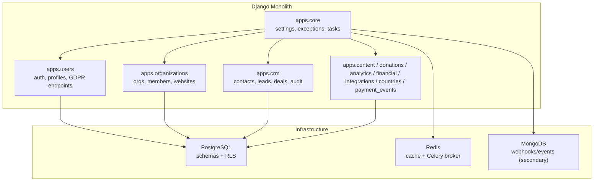
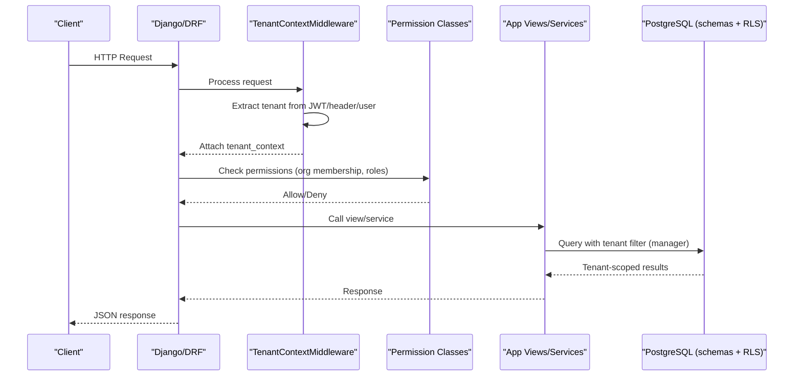
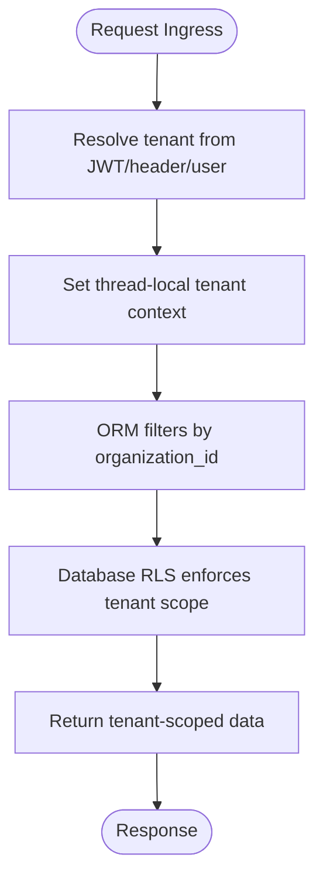
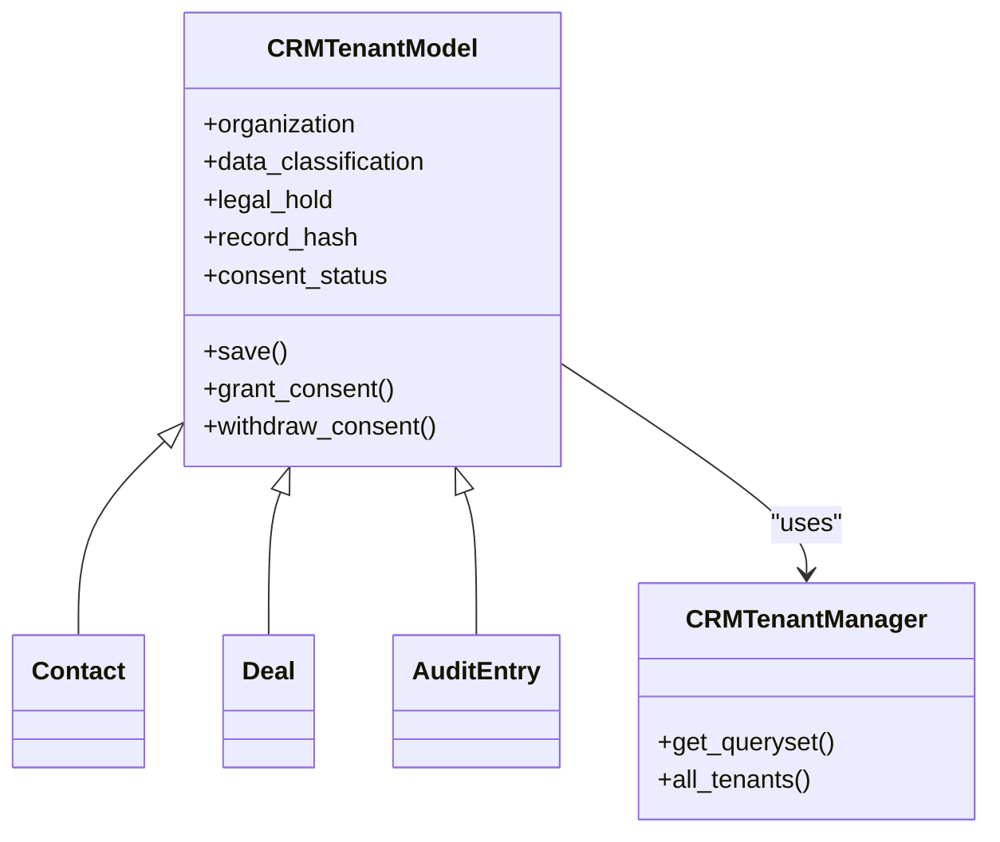
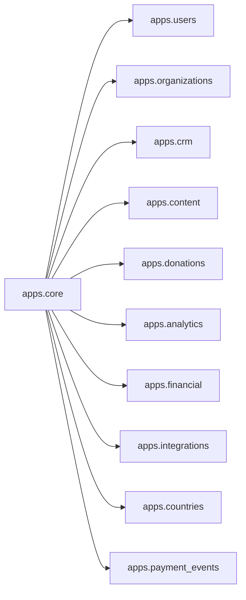
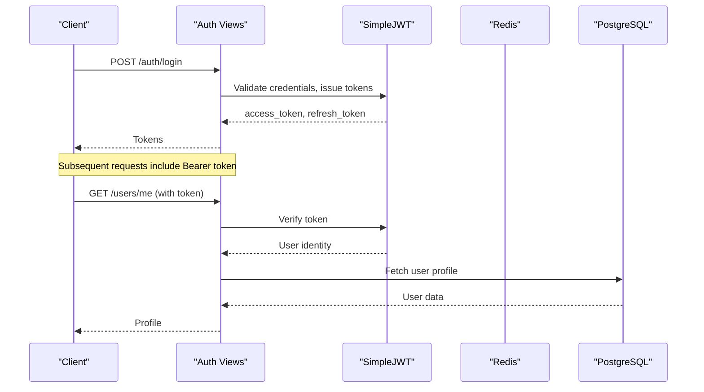
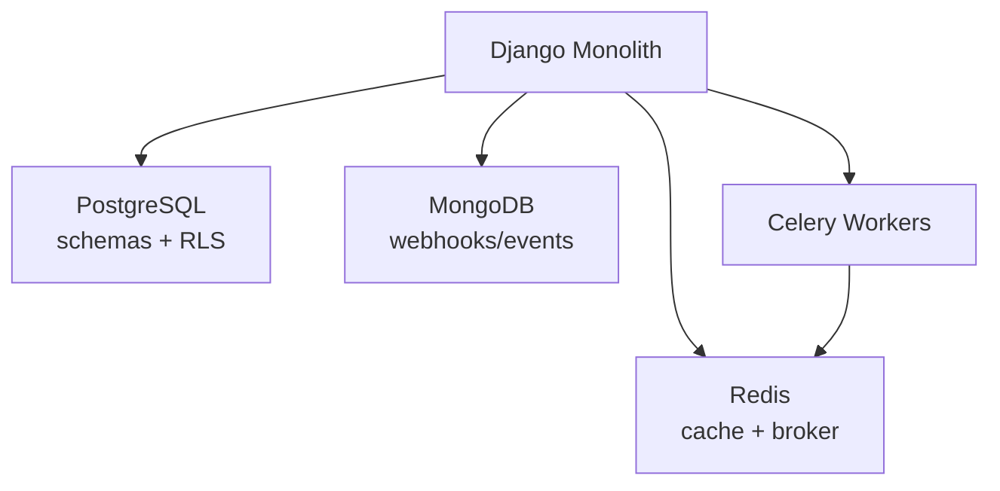
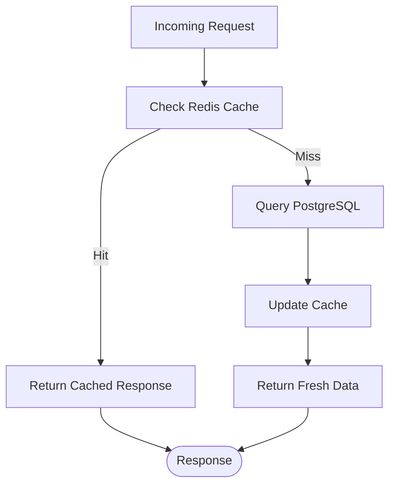

# Backend Architecture Decisions

<cite>
**Referenced Files in This Document**
- [ADR-001-schema-per-tenant-isolation.md](file://docs/decisions/ADR-001-schema-per-tenant-isolation.md)
- [base.py](file://backend/django/core/settings/base.py)
- [middleware.py](file://backend/django/apps/crm/middleware.py)
- [permissions.py](file://backend/django/apps/core/permissions.py)
- [models.py (core)](file://backend/django/apps/core/models.py)
- [models.py (crm)](file://backend/django/apps/crm/models.py)
- [models.py (organizations)](file://backend/django/apps/organizations/models.py)
- [views.py (users)](file://backend/django/apps/users/views.py)
- [api.py (users)](file://backend/django/apps/users/api.py)
- [main.tf (ElastiCache)](file://infra/terraform/modules/elasticache/main.tf)
</cite>

## Table of Contents
1. [Introduction](#introduction)
2. [Project Structure](#project-structure)
3. [Core Components](#core-components)
4. [Architecture Overview](#architecture-overview)
5. [Detailed Component Analysis](#detailed-component-analysis)
6. [Dependency Analysis](#dependency-analysis)
7. [Performance Considerations](#performance-considerations)
8. [Troubleshooting Guide](#troubleshooting-guide)
9. [Conclusion](#conclusion)

## Introduction
This document explains the backend architectural decisions for a Django monolith designed to serve many tenants with strong data isolation, compliance, and operational simplicity. It covers:
- Schema-per-tenant isolation strategy and row-level security (RLS) as defense-in-depth
- Data access patterns that enforce tenant separation at middleware, ORM, and database layers
- The rationale for choosing a Django monolith over microservices
- Modular app boundaries and inter-app communication
- Authentication and authorization design using JWT, role-based access control, and session management
- Scaling considerations, caching strategies, and performance optimizations for high-volume multi-tenant workloads

## Project Structure
The backend is organized as a Django project with feature-based apps under a single codebase:
- Core infrastructure: settings, URLs, Celery, logging, caching
- Domain apps: users, organizations, content, donations, analytics, financial, integrations, CRM, countries, payment events
- Multi-tenancy enforcement via middleware and permission classes
- External integrations (e.g., Bitrix24) isolated in dedicated modules

**Diagram sources**
- [base.py:47-119](file://backend/django/core/settings/base.py#L47-L119)
- [base.py:172-186](file://backend/django/core/settings/base.py#L172-L186)
- [base.py:392-416](file://backend/django/core/settings/base.py#L392-L416)

**Section sources**
- [base.py:47-119](file://backend/django/core/settings/base.py#L47-L119)
- [base.py:172-186](file://backend/django/core/settings/base.py#L172-L186)

## Core Components
- Tenant context middleware extracts and validates tenant identity per request, caches tenant metadata, and injects it into requests for downstream use.
- Permission classes enforce organization membership, admin roles, special category data access, and financial data processing restrictions.
- Base models provide soft delete, timestamps, UUID PKs, and audit logging; CRM base model adds tenant scoping, legal hold, consent tracking, and integrity hashes.
- Settings configure JWT, rate limiting, caching, Celery, and environment-specific behavior.

**Section sources**
- [middleware.py:96-197](file://backend/django/apps/crm/middleware.py#L96-L197)
- [permissions.py:26-137](file://backend/django/apps/core/permissions.py#L26-L137)
- [models.py (core):11-65](file://backend/django/apps/core/models.py#L11-L65)
- [models.py (crm):48-187](file://backend/django/apps/crm/models.py#L48-L187)
- [base.py:282-355](file://backend/django/core/settings/base.py#L282-L355)

## Architecture Overview
The system uses a Django monolith with modular apps, enforcing multi-tenancy through:
- Request-scoped tenant resolution from JWT claims or headers
- Thread-local tenant context propagated across the request lifecycle
- ORM-level tenant filtering via custom managers
- Database-level RLS on tenant-scoped tables as defense-in-depth
- Role-based permissions and specialized checks for sensitive data

**Diagram sources**
- [middleware.py:122-154](file://backend/django/apps/crm/middleware.py#L122-L154)
- [permissions.py:45-84](file://backend/django/apps/core/permissions.py#L45-L84)
- [models.py (crm):48-68](file://backend/django/apps/crm/models.py#L48-L68)

## Detailed Component Analysis

### Multi-Tenancy Strategy: Schema-per-Tenant + RLS
- Decision: Use PostgreSQL schema-per-tenant on a shared cluster with Row-Level Security policies on tenant-scoped tables for defense-in-depth.
- Connection strategy: least-privilege application role, per-request tenant schema resolution, search_path pinning, no cross-schema grants.
- Erasure: logical deletion plus scheduled purge per retention policy; backups at VM level; per-tenant export/erasure tooling.

**Diagram sources**
- [ADR-001-schema-per-tenant-isolation.md:16-28](file://docs/decisions/ADR-001-schema-per-tenant-isolation.md#L16-L28)
- [middleware.py:156-197](file://backend/django/apps/crm/middleware.py#L156-L197)
- [models.py (crm):48-68](file://backend/django/apps/crm/models.py#L48-L68)

**Section sources**
- [ADR-001-schema-per-tenant-isolation.md:9-38](file://docs/decisions/ADR-001-schema-per-tenant-isolation.md#L9-L38)

### Data Access Patterns and Isolation Enforcement
- Middleware establishes tenant context early and clears it after each request to prevent leakage.
- Custom managers automatically filter queries by current tenant when present.
- Models validate tenant context on writes to prevent cross-tenant mutations.
- Audit logs include tenant validation and tamper-evident checksums.

**Diagram sources**
- [models.py (crm):48-187](file://backend/django/apps/crm/models.py#L48-L187)
- [models.py (crm):255-375](file://backend/django/apps/crm/models.py#L255-L375)
- [models.py (crm):523-771](file://backend/django/apps/crm/models.py#L523-L771)
- [models.py (crm):773-800](file://backend/django/apps/crm/models.py#L773-L800)

**Section sources**
- [middleware.py:96-197](file://backend/django/apps/crm/middleware.py#L96-L197)
- [models.py (crm):48-68](file://backend/django/apps/crm/models.py#L48-L68)
- [models.py (core):67-227](file://backend/django/apps/core/models.py#L67-L227)

### Modular App Architecture and Boundaries
- apps.core: shared base models, exceptions, tasks, metrics, throttling, secrets, vault integration
- apps.users: authentication, profiles, GDPR endpoints
- apps.organizations: orgs, memberships, website configs, consent settings
- apps.crm: contacts, leads, deals, audit entries, tenant-aware managers
- apps.content, donations, analytics, financial, integrations, countries, payment_events: domain features
- Inter-app communication via direct imports within the same process; clear boundaries enforced by permissions and tenant context

**Diagram sources**
- [base.py:94-117](file://backend/django/core/settings/base.py#L94-L117)

**Section sources**
- [base.py:94-117](file://backend/django/core/settings/base.py#L94-L117)

### Authentication and Authorization
- JWT-based authentication with short-lived access tokens and rotating refresh tokens; logout blacklists refresh tokens.
- Session configuration uses cached_db engine with secure cookies.
- Role-based access control:
  - Organization membership checks
  - Admin vs editor/viewer distinctions
  - Special category data access restricted to authorized roles
  - Financial data processing limited to admins/owners
- Rate limiting applied to auth and GDPR endpoints to mitigate abuse.

**Diagram sources**
- [views.py (users):40-70](file://backend/django/apps/users/views.py#L40-L70)
- [base.py:282-355](file://backend/django/core/settings/base.py#L282-L355)
- [base.py:526-537](file://backend/django/core/settings/base.py#L526-L537)

**Section sources**
- [views.py (users):31-70](file://backend/django/apps/users/views.py#L31-L70)
- [base.py:282-355](file://backend/django/core/settings/base.py#L282-L355)
- [permissions.py:26-137](file://backend/django/apps/core/permissions.py#L26-L137)
- [permissions.py:221-325](file://backend/django/apps/core/permissions.py#L221-L325)

### Why Django Monolith Over Microservices
- Development velocity: single codebase, shared models, unified migrations, faster iteration cycles
- Operational simplicity: one deployment target, simpler CI/CD, fewer moving parts
- Maintenance advantages: consistent standards, centralized observability, easier cross-cutting concerns (auth, tenancy, compliance)
- Scalability: horizontal scaling of stateless workers behind an ingress; shared Postgres with schema-per-tenant and RLS provides isolation without service sprawl

[No sources needed since this section summarizes architectural rationale]

## Dependency Analysis
Key runtime dependencies and their roles:
- PostgreSQL: primary relational store with schema-per-tenant and RLS
- Redis: cache backend and Celery broker/result backend
- MongoDB: secondary store for raw webhooks and high-volume event logs
- Celery: background tasks and scheduled jobs

**Diagram sources**
- [base.py:172-186](file://backend/django/core/settings/base.py#L172-L186)
- [base.py:361-386](file://backend/django/core/settings/base.py#L361-L386)
- [base.py:392-416](file://backend/django/core/settings/base.py#L392-L416)
- [base.py:689-722](file://backend/django/core/settings/base.py#L689-L722)

**Section sources**
- [base.py:172-186](file://backend/django/core/settings/base.py#L172-L186)
- [base.py:361-386](file://backend/django/core/settings/base.py#L361-L386)
- [base.py:392-416](file://backend/django/core/settings/base.py#L392-L416)
- [base.py:689-722](file://backend/django/core/settings/base.py#L689-L722)

## Performance Considerations
- Caching:
  - Redis-backed cache with compression, connection pooling, and key prefixing
  - Tenant metadata cached to reduce repeated lookups
  - Configurable timeouts for different data freshness needs
- Background processing:
  - Celery with configurable concurrency, prefetch multiplier, and time limits
  - Scheduled tasks for digest emails, session cleanup, recurring donations
- Database:
  - Indexes on frequently filtered fields (organization, status, timestamps)
  - RLS reduces risk of accidental cross-tenant reads/writes
  - Soft deletes and legal holds minimize expensive cascading deletes
- Observability and resilience:
  - Structured logging with file and console handlers
  - Prometheus metrics endpoint gated by IP/token
  - Health checks and maintenance mode support

**Diagram sources**
- [base.py:392-416](file://backend/django/core/settings/base.py#L392-L416)
- [middleware.py:233-265](file://backend/django/apps/crm/middleware.py#L233-L265)

**Section sources**
- [base.py:361-416](file://backend/django/core/settings/base.py#L361-L416)
- [base.py:439-513](file://backend/django/core/settings/base.py#L439-L513)
- [base.py:676-686](file://backend/django/core/settings/base.py#L676-L686)

## Troubleshooting Guide
Common issues and mitigations:
- Cross-tenant access attempts:
  - Middleware logs missing or invalid tenant context
  - Permission classes log denied access and reason
  - Model save hooks raise validation errors on mismatched tenant context
- Audit integrity:
  - Tamper-evident checksums on audit entries; verification methods available
- GDPR operations:
  - Legal hold checks block erasure when required
  - Throttles protect sensitive endpoints from abuse
- Caching and background jobs:
  - Redis connectivity and memory usage monitored via Terraform alarms
  - Celery task timeouts and worker concurrency tuned to workload

**Section sources**
- [middleware.py:122-154](file://backend/django/apps/crm/middleware.py#L122-L154)
- [permissions.py:45-84](file://backend/django/apps/core/permissions.py#L45-L84)
- [models.py (core):156-213](file://backend/django/apps/core/models.py#L156-L213)
- [views.py (users):254-334](file://backend/django/apps/users/views.py#L254-L334)
- [main.tf:151-168](file://infra/terraform/modules/elasticache/main.tf#L151-L168)

## Conclusion
The backend adopts a Django monolith architecture to maximize development velocity, operational simplicity, and maintainability while delivering robust multi-tenancy through schema-per-tenant isolation and RLS. Modular apps encapsulate domain logic with clear boundaries, and permissions ensure strict access control. JWT-based authentication, role-based authorization, and comprehensive auditing support compliance requirements. Caching, background processing, and observability are configured to handle high-volume, multi-tenant workloads reliably.

[No sources needed since this section summarizes without analyzing specific files]