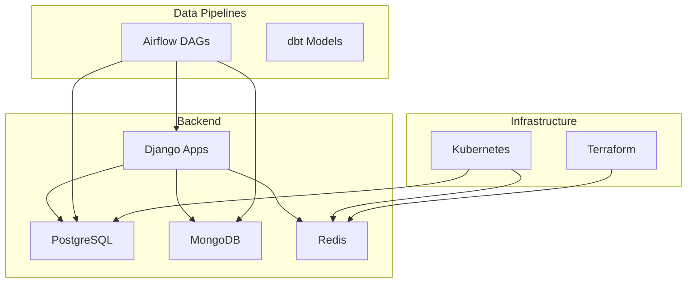
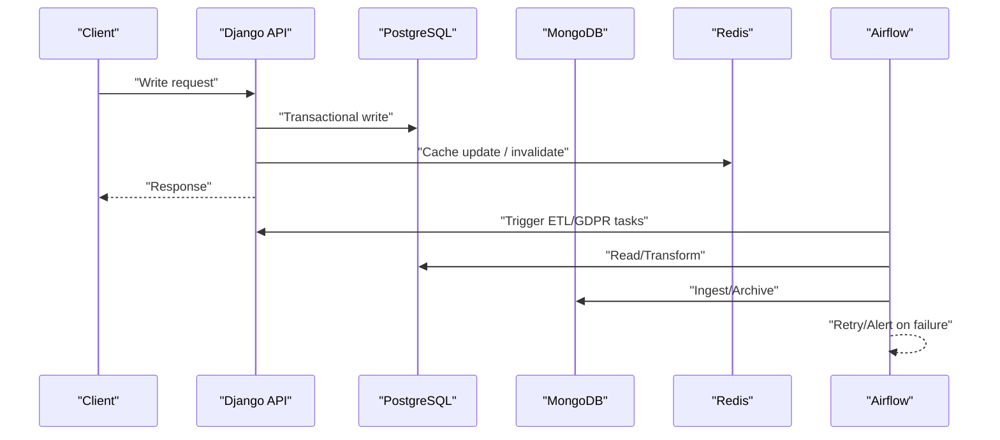
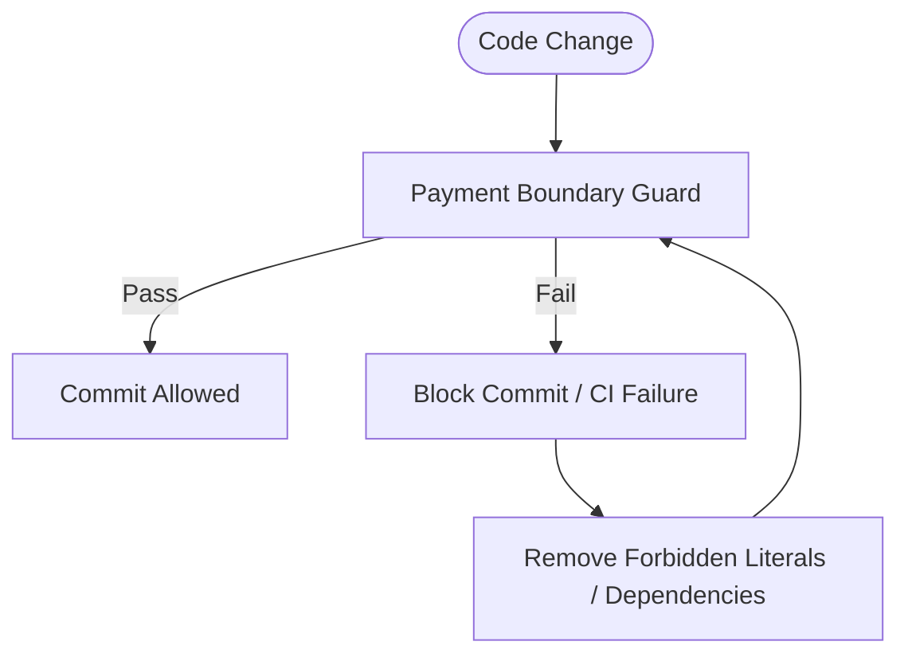
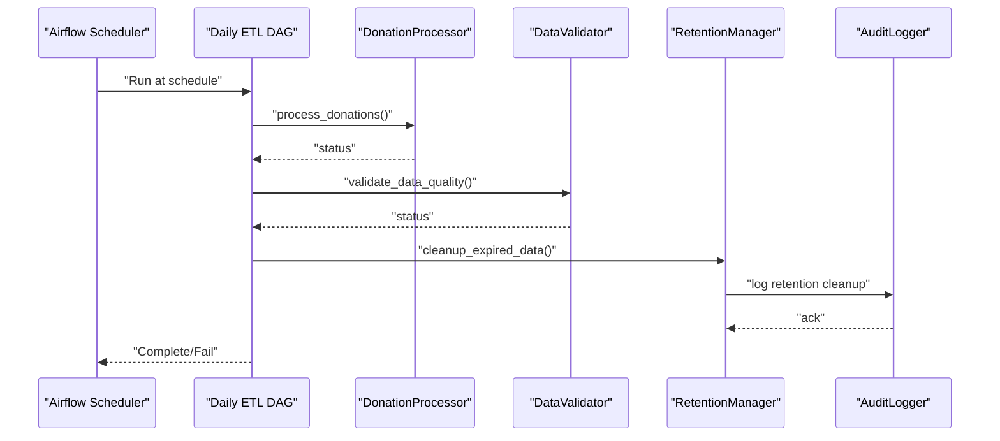
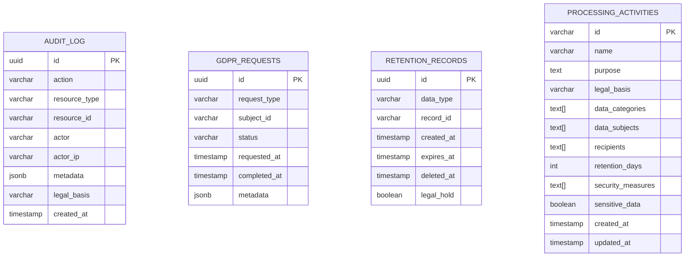
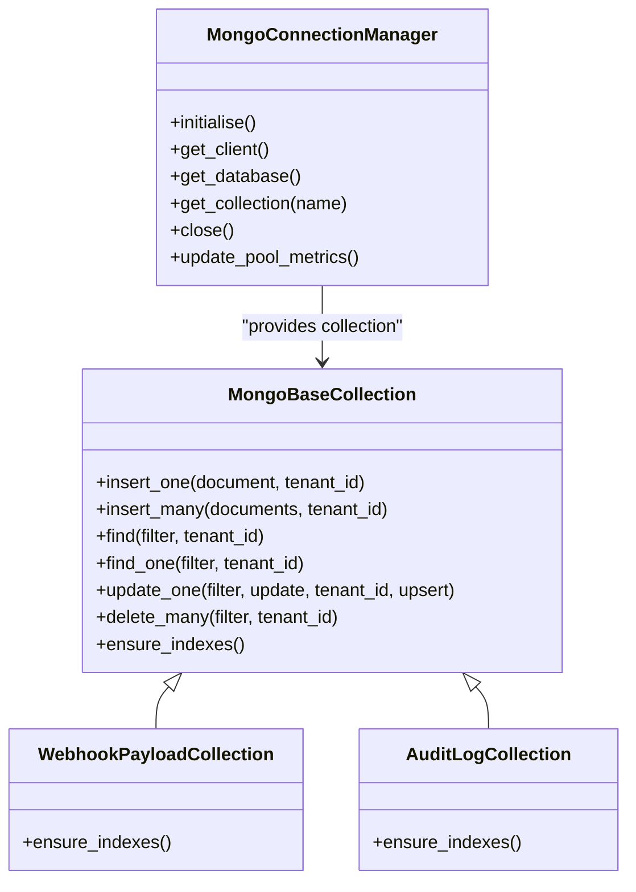
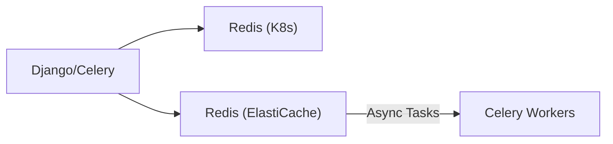
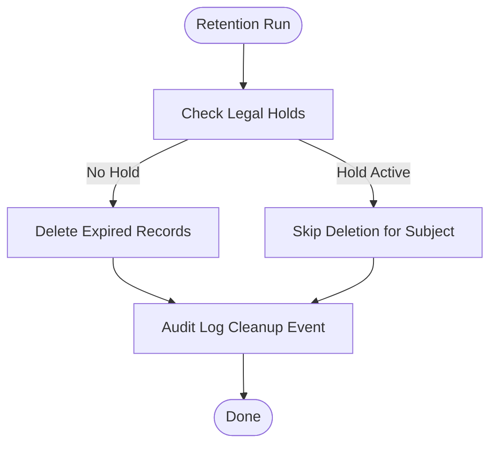
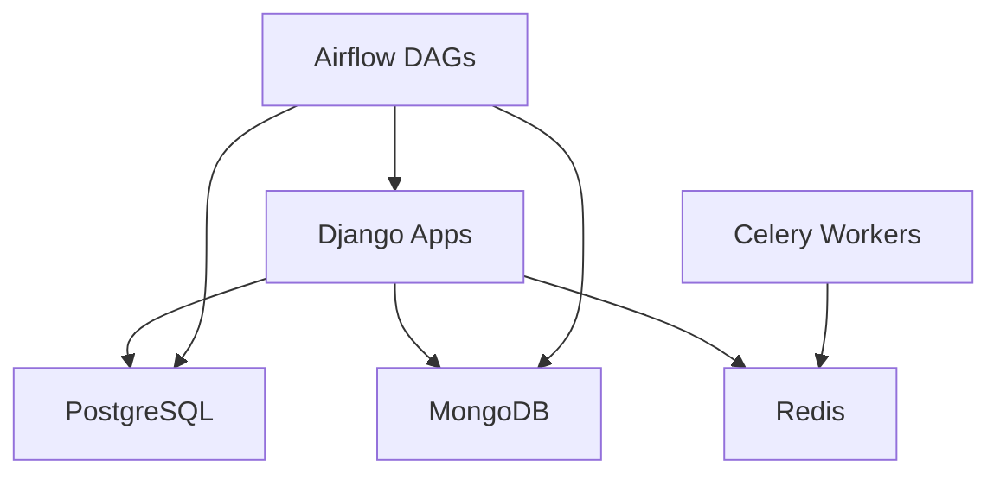

# Data Architecture Decisions

<cite>
**Referenced Files in This Document**
- [ADR-009-payment-boundary.md](file://docs/decisions/ADR-009-payment-boundary.md)
- [jol_hub_etl.py](file://data/airflow/dags/jol_hub_etl.py)
- [jol_gdpr_cleanup.py](file://data/airflow/dags/jol_gdpr_cleanup.py)
- [mongodb.py](file://backend/django/apps/core/mongodb.py)
- [database.yaml](file://infra/kubernetes/apps/database.yaml)
- [elasticache/main.tf](file://infra/terraform/modules/elasticache/main.tf)
- [retention_manager.py](file://data/src/gdpr/retention_manager.py)
- [001_initial_schema.sql](file://data/sql/schema_setup/001_initial_schema.sql)
- [payment_events/models.py](file://backend/django/apps/payment_events/models.py)
- [financial/models.py](file://backend/django/apps/financial/models.py)
- [daily_aggregation.py](file://data/src/pipelines/donation_analytics/daily_aggregation.py)
- [data-flow.md](file://docs/architecture/data-flow.md)
- [system-overview.md](file://docs/architecture/system-overview.md)
</cite>

## Table of Contents
1. [Introduction](#introduction)
2. [Project Structure](#project-structure)
3. [Core Components](#core-components)
4. [Architecture Overview](#architecture-overview)
5. [Detailed Component Analysis](#detailed-component-analysis)
6. [Dependency Analysis](#dependency-analysis)
7. [Performance Considerations](#performance-considerations)
8. [Troubleshooting Guide](#troubleshooting-guide)
9. [Conclusion](#conclusion)
10. [Appendices](#appendices)

## Introduction
This document explains the data architecture decisions for JOL-HUB, focusing on:
- Payment boundary separation to keep PCI-DSS scope out of the hub and isolate payment processing from general business logic.
- ETL orchestration with Apache Airflow, including DAG design patterns, error handling, and monitoring.
- Technology choices: PostgreSQL for transactional data, MongoDB for document storage, and Redis for caching and messaging.
- Data modeling approaches, indexing strategies, and query optimization techniques.
- Data retention policies, GDPR compliance measures, and lifecycle management.
- Backup and recovery strategies, disaster recovery planning, and data migration procedures.

## Project Structure
JOL-HUB organizes data-related concerns across several areas:
- Backend Django apps define models for financial and payment event data, and a MongoDB integration layer for unstructured documents and audit logs.
- Data pipelines under data/airflow implement scheduled ETL and GDPR cleanup tasks.
- Infrastructure manifests define PostgreSQL and Redis deployments; Terraform provisions managed Redis (ElastiCache).
- SQL schema defines core tables for audit, GDPR requests, retention tracking, and processing activities.
- Compliance documentation and ADRs codify boundaries and governance.

**Diagram sources**
- [database.yaml:1-196](file://infra/kubernetes/apps/database.yaml#L1-L196)
- [elasticache/main.tf:1-169](file://infra/terraform/modules/elasticache/main.tf#L1-L169)
- [mongodb.py:1-822](file://backend/django/apps/core/mongodb.py#L1-L822)
- [jol_hub_etl.py:1-214](file://data/airflow/dags/jol_hub_etl.py#L1-L214)

**Section sources**
- [database.yaml:1-196](file://infra/kubernetes/apps/database.yaml#L1-L196)
- [elasticache/main.tf:1-169](file://infra/terraform/modules/elasticache/main.tf#L1-L169)
- [mongodb.py:1-822](file://backend/django/apps/core/mongodb.py#L1-L822)
- [jol_hub_etl.py:1-214](file://data/airflow/dags/jol_hub_etl.py#L1-L214)

## Core Components
- Payment boundary enforcement isolates PCI scope from the hub via code guards and policy.
- Transactional data is modeled in PostgreSQL using Django ORM with strict tenant isolation and auditability.
- Unstructured or high-volume documents are stored in MongoDB with TTL-based retention and Prometheus observability.
- Caching and message brokering use Redis with memory policies and encryption at rest/in transit.
- ETL and GDPR workflows are orchestrated by Airflow DAGs with retries, timeouts, and audit logging.

**Section sources**
- [ADR-009-payment-boundary.md:1-111](file://docs/decisions/ADR-009-payment-boundary.md#L1-L111)
- [001_initial_schema.sql:1-75](file://data/sql/schema_setup/001_initial_schema.sql#L1-L75)
- [mongodb.py:1-822](file://backend/django/apps/core/mongodb.py#L1-L822)
- [database.yaml:1-196](file://infra/kubernetes/apps/database.yaml#L1-L196)
- [elasticache/main.tf:1-169](file://infra/terraform/modules/elasticache/main.tf#L1-L169)
- [jol_hub_etl.py:1-214](file://data/airflow/dags/jol_hub_etl.py#L1-L214)

## Architecture Overview
The platform separates concerns across layers:
- API and business logic run in Django, enforcing tenant isolation and validation.
- Transactional state persists in PostgreSQL with row-level security and audit tables.
- High-volume or schema-flexible data uses MongoDB with TTL indexes and tenant-scoped queries.
- Caching and async workloads use Redis with LRU eviction and optional persistence.
- Scheduled and ad-hoc data processing runs in Airflow, invoking processors and validators.

**Diagram sources**
- [data-flow.md:1-518](file://docs/architecture/data-flow.md#L1-L518)
- [jol_hub_etl.py:1-214](file://data/airflow/dags/jol_hub_etl.py#L1-L214)
- [mongodb.py:1-822](file://backend/django/apps/core/mongodb.py#L1-L822)

## Detailed Component Analysis

### Payment Boundary Separation Strategy
- The hub remains out of PCI scope by forbidding direct PSP SDK usage and secrets in the repository tree.
- Enforcement is automated via a guard script executed in CI and pre-commit hooks.
- Only an internal payment API is consumed; payment events are persisted as minimal, non-personal envelopes.

**Diagram sources**
- [ADR-009-payment-boundary.md:1-111](file://docs/decisions/ADR-009-payment-boundary.md#L1-L111)

**Section sources**
- [ADR-009-payment-boundary.md:1-111](file://docs/decisions/ADR-009-payment-boundary.md#L1-L111)
- [payment_events/models.py:1-36](file://backend/django/apps/payment_events/models.py#L1-L36)

### ETL Orchestration with Apache Airflow
- Daily ETL DAG processes donations, validates data quality, performs GDPR retention cleanup, and generates compliance reports.
- Default arguments include retries, retry delays, execution timeouts, and email-on-failure.
- Task groups organize related steps; manual-only DAG handles GDPR subject rights.

**Diagram sources**
- [jol_hub_etl.py:1-214](file://data/airflow/dags/jol_hub_etl.py#L1-L214)
- [retention_manager.py:1-336](file://data/src/gdpr/retention_manager.py#L1-L336)

**Section sources**
- [jol_hub_etl.py:1-214](file://data/airflow/dags/jol_hub_etl.py#L1-L214)
- [jol_gdpr_cleanup.py:1-68](file://data/airflow/dags/jol_gdpr_cleanup.py#L1-L68)
- [retention_manager.py:1-336](file://data/src/gdpr/retention_manager.py#L1-L336)

### PostgreSQL for Transactional Data
- Schema includes audit logs, GDPR requests, retention records, and processing activities with appropriate indexes.
- Row-level security is enabled for multi-tenant isolation.
- Financial models enforce tenant context validation to prevent cross-tenant manipulation.

**Diagram sources**
- [001_initial_schema.sql:1-75](file://data/sql/schema_setup/001_initial_schema.sql#L1-L75)

**Section sources**
- [001_initial_schema.sql:1-75](file://data/sql/schema_setup/001_initial_schema.sql#L1-L75)
- [financial/models.py:1-170](file://backend/django/apps/financial/models.py#L1-L170)

### MongoDB for Document Storage
- Connection manager provides lazy initialization, process-wide singleton, TLS support, and connection pooling metrics.
- Base collection enforces created_at, updated_at, and tenant_id for GDPR isolation; TTL indexes auto-expire raw payloads.
- Concrete collections for webhook payloads and audit logs include optimized compound indexes.

**Diagram sources**
- [mongodb.py:1-822](file://backend/django/apps/core/mongodb.py#L1-L822)

**Section sources**
- [mongodb.py:1-822](file://backend/django/apps/core/mongodb.py#L1-L822)

### Redis for Caching and Messaging
- Kubernetes deployment configures Redis with append-only file, maxmemory, and LRU eviction policy.
- Terraform provisions ElastiCache with encryption at rest and in transit, snapshots, and CloudWatch alarms.
- Used for caching, Celery broker, and keyspace notifications where applicable.

**Diagram sources**
- [database.yaml:105-196](file://infra/kubernetes/apps/database.yaml#L105-L196)
- [elasticache/main.tf:1-169](file://infra/terraform/modules/elasticache/main.tf#L1-L169)

**Section sources**
- [database.yaml:105-196](file://infra/kubernetes/apps/database.yaml#L105-L196)
- [elasticache/main.tf:1-169](file://infra/terraform/modules/elasticache/main.tf#L1-L169)

### Data Modeling and Query Optimization
- PostgreSQL:
  - Indexes on frequently queried columns (e.g., audit_log actions, resources, timestamps; GDPR request subject/status; retention expiration).
  - Partitioning strategy for audit logs to aid retention cleanup.
  - Row-level security for multi-tenant isolation.
- MongoDB:
  - Compound indexes for tenant-scoped queries and time-based operations.
  - TTL indexes to enforce storage limitation and minimize PII exposure.
- Analytics:
  - Aggregations produce k-anonymized outputs with suppression thresholds to protect donor privacy.

**Section sources**
- [001_initial_schema.sql:1-75](file://data/sql/schema_setup/001_initial_schema.sql#L1-L75)
- [mongodb.py:670-734](file://backend/django/apps/core/mongodb.py#L670-L734)
- [daily_aggregation.py:1-242](file://data/src/pipelines/donation_analytics/daily_aggregation.py#L1-L242)

### Data Retention Policies and GDPR Compliance
- Retention rules define per-data-type lifetimes and legal bases; deletion checks active legal holds before erasure.
- Airflow DAGs execute periodic cleanup and verification tasks.
- Audit logging captures all retention and GDPR-related actions.

**Diagram sources**
- [retention_manager.py:188-336](file://data/src/gdpr/retention_manager.py#L188-L336)
- [jol_gdpr_cleanup.py:1-68](file://data/airflow/dags/jol_gdpr_cleanup.py#L1-L68)

**Section sources**
- [retention_manager.py:1-336](file://data/src/gdpr/retention_manager.py#L1-L336)
- [jol_gdpr_cleanup.py:1-68](file://data/airflow/dags/jol_gdpr_cleanup.py#L1-L68)

### Backup and Recovery Strategies
- PostgreSQL StatefulSet uses persistent volumes with health probes; backups and point-in-time recovery are part of operational strategy.
- Disaster recovery targets RTO < 4 hours and RPO < 15 minutes with geographic redundancy.

**Section sources**
- [database.yaml:1-104](file://infra/kubernetes/apps/database.yaml#L1-L104)
- [system-overview.md:205-217](file://docs/architecture/system-overview.md#L205-L217)

### Data Migration Procedures
- Schema migrations are versioned and applied through database tooling; initial schema defines extensions, tables, indexes, and RLS.
- For document stores, index creation is enforced via collection helpers to ensure consistent performance and retention behavior.

**Section sources**
- [001_initial_schema.sql:1-75](file://data/sql/schema_setup/001_initial_schema.sql#L1-L75)
- [mongodb.py:726-734](file://backend/django/apps/core/mongodb.py#L726-L734)

## Dependency Analysis
- Django apps depend on PostgreSQL for transactional integrity and on MongoDB for flexible document storage and audit logs.
- Airflow DAGs depend on backend processors and validators that interact with both databases.
- Redis serves as cache and message broker for Celery workers invoked by Django and Airflow tasks.

**Diagram sources**
- [data-flow.md:1-518](file://docs/architecture/data-flow.md#L1-L518)
- [mongodb.py:1-822](file://backend/django/apps/core/mongodb.py#L1-L822)
- [database.yaml:1-196](file://infra/kubernetes/apps/database.yaml#L1-L196)

**Section sources**
- [data-flow.md:1-518](file://docs/architecture/data-flow.md#L1-L518)
- [mongodb.py:1-822](file://backend/django/apps/core/mongodb.py#L1-L822)
- [database.yaml:1-196](file://infra/kubernetes/apps/database.yaml#L1-L196)

## Performance Considerations
- PostgreSQL:
  - Use targeted indexes on high-cardinality and filter columns; leverage partitioning for large audit tables.
  - Monitor slow queries and adjust query plans; consider read replicas for heavy reads.
- MongoDB:
  - Ensure TTL indexes for automatic data expiry; maintain compound indexes for tenant-scoped queries.
  - Observe slow-query thresholds and log warnings for tuning.
- Redis:
  - Configure appropriate maxmemory and eviction policies; monitor memory and CPU via CloudWatch alarms.
- Airflow:
  - Tune retries, timeouts, and concurrency; group tasks logically to improve visibility and resilience.

[No sources needed since this section provides general guidance]

## Troubleshooting Guide
- Airflow failures:
  - Check task logs for Python exceptions; verify default_args for retries and timeouts.
  - Validate dependencies and environment variables for processors and validators.
- Database connectivity:
  - Verify PostgreSQL readiness probes and credentials; confirm persistent volume mounts.
  - Confirm Redis liveness/readiness probes and configuration flags.
- MongoDB issues:
  - Inspect Prometheus metrics for query duration and errors; check TTL index settings.
  - Ensure tenant_id is present for delete operations to avoid cross-tenant risks.

**Section sources**
- [jol_hub_etl.py:14-22](file://data/airflow/dags/jol_hub_etl.py#L14-L22)
- [database.yaml:61-76](file://infra/kubernetes/apps/database.yaml#L61-L76)
- [database.yaml:155-168](file://infra/kubernetes/apps/database.yaml#L155-L168)
- [mongodb.py:161-173](file://backend/django/apps/core/mongodb.py#L161-L173)

## Conclusion
JOL-HUB’s data architecture enforces a strict payment boundary to exclude PCI scope from the hub, centralizing transactional data in PostgreSQL, storing flexible documents in MongoDB, and leveraging Redis for caching and messaging. Airflow orchestrates ETL and GDPR workflows with robust error handling and auditing. The design emphasizes tenant isolation, data minimization, retention enforcement, and comprehensive observability to meet regulatory and operational requirements.

[No sources needed since this section summarizes without analyzing specific files]

## Appendices

### Technology Justification Summary
- PostgreSQL: ACID transactions, strong consistency, row-level security, and mature tooling for financial and audit data.
- MongoDB: Flexible schema for unpredictable payloads, TTL indexes for storage limitation, and efficient high-volume ingestion.
- Redis: Low-latency caching, reliable message brokering for Celery, and configurable eviction and persistence.

[No sources needed since this section provides general guidance]