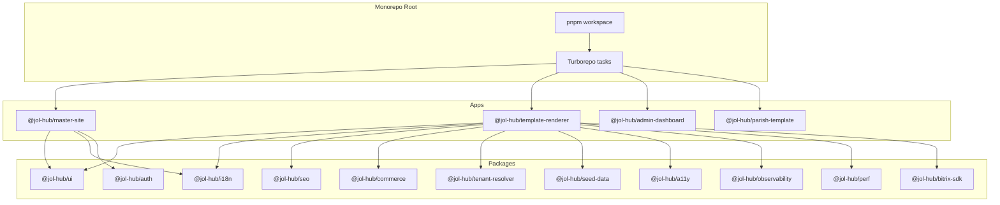
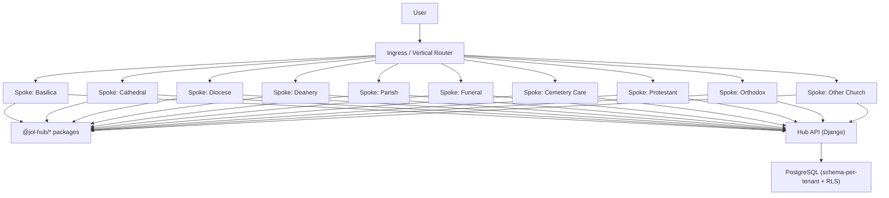
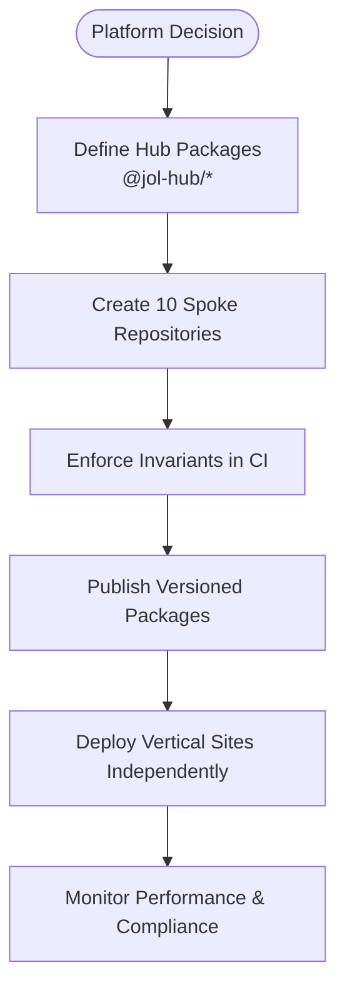
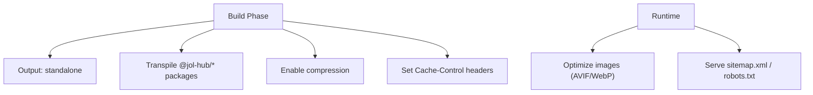
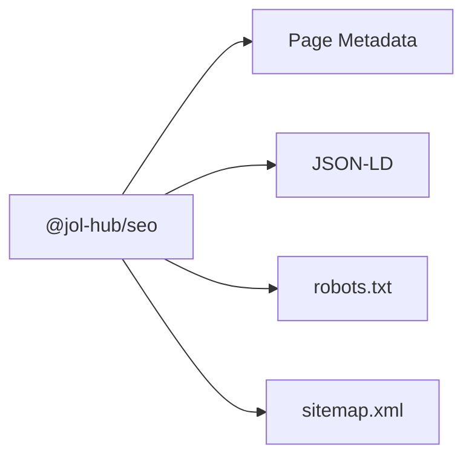
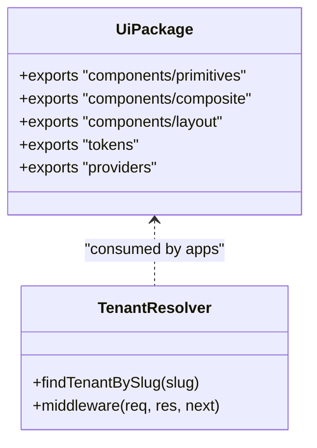
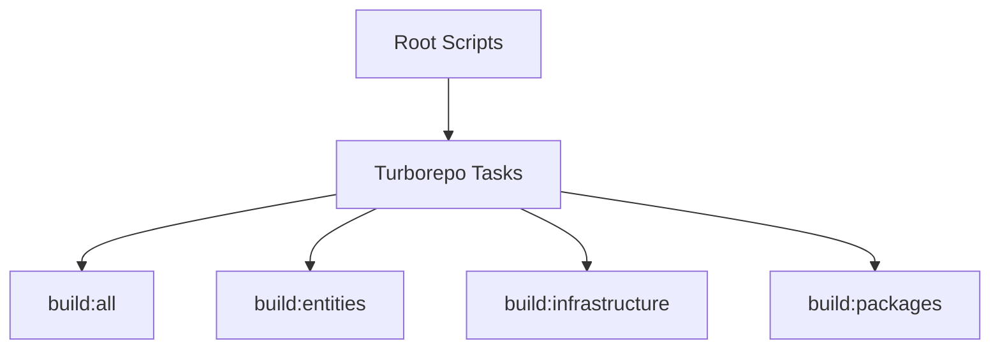

# Frontend Architecture Decisions

<cite>
**Referenced Files in This Document**
- [frontend-topology-10-verticals.md](file://docs/architecture/frontend-topology-10-verticals.md)
- [ADR-011-ten-vertical-frontends-hub-and-spoke.md](file://docs/decisions/ADR-011-ten-vertical-frontends-hub-and-spoke.md)
- [package.json](file://frontend/package.json)
- [turbo.json](file://frontend/turbo.json)
- [apps/master-site/package.json](file://frontend/apps/master-site/package.json)
- [apps/template-renderer/package.json](file://frontend/apps/template-renderer/package.json)
- [apps/template-renderer/next.config.js](file://frontend/apps/template-renderer/next.config.js)
- [apps/master-site/next.config.js](file://frontend/apps/master-site/next.config.js)
- [RENDERING.md](file://frontend/apps/template-renderer/RENDERING.md)
- [SEO.md](file://frontend/apps/template-renderer/SEO.md)
- [route-dispatch.tsx](file://frontend/apps/template-renderer/src/lib/route-dispatch.tsx)
- [packages/tenant-resolver/package.json](file://frontend/packages/tenant-resolver/package.json)
- [packages/ui/package.json](file://frontend/packages/ui/package.json)
</cite>

## Table of Contents
1. Introduction
2. Project Structure
3. Core Components
4. Architecture Overview
5. Detailed Component Analysis
6. Dependency Analysis
7. Performance Considerations
8. Troubleshooting Guide
9. Conclusion
10. Appendices

## Introduction
This document explains the frontend architectural decisions for the JOL-HUB platform, focusing on the hub-and-spoke pattern that serves ten vertical frontends (catholic, orthodox, protestant, and related ecclesiastical types). The master site acts as a central hub while individual parish sites operate as spokes. It also documents the Next.js monorepo structure with Turborepo orchestration, shared packages, component libraries, build optimization strategies, and the template rendering engine that enables dynamic site generation across religious institution types. Finally, it outlines migration strategies from legacy systems, performance optimizations, and scalability patterns for handling thousands of tenant websites.

## Project Structure
JOL-HUB is organized as a pnpm workspace managed by Turborepo. The root orchestrates builds, tests, linting, and type checks across apps and packages. Apps include the master site, an admin dashboard, a parish template, and a multi-tenant template renderer used for integration testing and pilot tenants. Packages encapsulate shared concerns such as UI primitives, i18n, SEO, commerce, authentication, observability, performance monitoring, seed data, tenant resolution, and Bitrix SDK integration.



**Diagram sources**
- [package.json:11-37](file://frontend/package.json#L11-L37)
- [turbo.json:5-30](file://frontend/turbo.json#L5-L30)
- [apps/master-site/package.json:13-43](file://frontend/apps/master-site/package.json#L13-L43)
- [apps/template-renderer/package.json:23-42](file://frontend/apps/template-renderer/package.json#L23-L42)

**Section sources**
- [package.json:1-67](file://frontend/package.json#L1-L67)
- [turbo.json:1-33](file://frontend/turbo.json#L1-L33)

## Core Components
- Hub-and-spoke topology: The platform defines a Tier-0 hub containing shared packages and a template renderer, plus ten independently deployable spoke repositories per vertical. Each spoke contains only vertical composition code and consumes versioned @jol-hub/* packages.
- Shared packages: UI primitives, i18n, SEO builders, commerce feature flags, tenant resolver, seed data, auth contracts, Bitrix SDK, accessibility utilities, performance monitoring, observability, and testing utilities.
- Template renderer: A single multi-tenant app that renders all pilot tenants using fixture-first delegation and a composition/collection system, serving as both integration test-bed and production-grade renderer during transition.
- Master site: Central hub-facing application providing administrative and marketplace surfaces, consuming shared packages and configured for trilingual locales.

Key responsibilities:
- Tenant routing and resolution via middleware and tenant-resolver package.
- Rendering strategy per page class (SSR/ISR/SSG) with request-scoped language and tenant context.
- SEO surface built from shared SEO package and composed into pages and metadata.
- Build-time transpilation of shared packages to keep bundles lean on modest hardware.

**Section sources**
- [frontend-topology-10-verticals.md:40-87](file://docs/architecture/frontend-topology-10-verticals.md#L40-L87)
- [ADR-011-ten-vertical-frontends-hub-and-spoke.md:60-110](file://docs/decisions/ADR-011-ten-vertical-frontends-hub-and-spoke.md#L60-L110)
- [apps/template-renderer/package.json:23-42](file://frontend/apps/template-renderer/package.json#L23-L42)
- [apps/master-site/package.json:13-43](file://frontend/apps/master-site/package.json#L13-L43)

## Architecture Overview
The hub-and-spoke architecture separates shared logic into versioned packages consumed by each vertical spoke. The master site provides cross-cutting services and governance surfaces. The template renderer demonstrates the runtime behavior for multi-tenant rendering and remains the integration test-bed.



**Diagram sources**
- [frontend-topology-10-verticals.md:8-37](file://docs/architecture/frontend-topology-10-verticals.md#L8-L37)
- [frontend-topology-10-verticals.md:91-109](file://docs/architecture/frontend-topology-10-verticals.md#L91-L109)

## Detailed Component Analysis

### Hub-and-Spoke Topology and Ten Verticals
The platform adopts a hub-and-spoke model where the hub owns shared packages and governance, and each vertical has its own repository and deployment target. Invariants enforce single source of truth, versioned packages, closed payment boundary, schema-per-tenant isolation, theme verticalization, uniform stack, identical CI, GDPR compliance, accessibility, and reversibility.



**Diagram sources**
- [ADR-011-ten-vertical-frontends-hub-and-spoke.md:60-110](file://docs/decisions/ADR-011-ten-vertical-frontends-hub-and-spoke.md#L60-L110)

**Section sources**
- [ADR-011-ten-vertical-frontends-hub-and-spoke.md:60-110](file://docs/decisions/ADR-011-ten-vertical-frontends-hub-and-spoke.md#L60-L110)
- [frontend-topology-10-verticals.md:115-128](file://docs/architecture/frontend-topology-10-verticals.md#L115-L128)

### Template Rendering Engine
The template renderer implements a fixture-first delegation strategy: if seed fixtures contain content for a route, they render first; otherwise, the composition/collection system generates content. Pages are server-rendered due to request-scoped language and tenant resolution, with data caching honoring revalidate windows at the fetch layer.

```mermaid
sequenceDiagram
participant C as "Client"
participant N as "Next.js App"
participant RD as "Route Dispatcher"
participant FL as "Fixture Loader"
let TR as "Template Renderer"
participant API as "Content API"
C->>N : GET /[locale]/[tenant]/...
N->>RD : resolveTenantRoute()
RD->>FL : loadTenantFixture(tenant)
alt Fixture exists for route
FL-->>RD : Fixture page
RD->>TR : Render with fixture
TR-->>C : HTML (SSR)
else No fixture or no page
RD->>API : Fetch collection/content
API-->>RD : JSON
RD->>TR : Render with composition
TR-->>C : HTML (SSR)
end
```

**Diagram sources**
- [route-dispatch.tsx:49-78](file://frontend/apps/template-renderer/src/lib/route-dispatch.tsx#L49-L78)
- [RENDERING.md:66-83](file://frontend/apps/template-renderer/RENDERING.md#L66-L83)

**Section sources**
- [RENDERING.md:6-31](file://frontend/apps/template-renderer/RENDERING.md#L6-L31)
- [RENDERING.md:33-49](file://frontend/apps/template-renderer/RENDERING.md#L33-L49)
- [RENDERING.md:66-83](file://frontend/apps/template-renderer/RENDERING.md#L66-L83)
- [route-dispatch.tsx:49-78](file://frontend/apps/template-renderer/src/lib/route-dispatch.tsx#L49-L78)

### Next.js Configuration and SSR Strategy
The template renderer uses standalone output for self-contained deployments, transpiles shared packages to optimize bundle size, compresses responses, and sets aggressive cache headers for static assets and images. The master site configures locales and image domains.



**Diagram sources**
- [apps/template-renderer/next.config.js:1-86](file://frontend/apps/template-renderer/next.config.js#L1-L86)
- [apps/master-site/next.config.js:1-15](file://frontend/apps/master-site/next.config.js#L1-L15)

**Section sources**
- [apps/template-renderer/next.config.js:1-86](file://frontend/apps/template-renderer/next.config.js#L1-L86)
- [apps/master-site/next.config.js:1-15](file://frontend/apps/master-site/next.config.js#L1-L15)

### SEO Architecture
SEO is implemented through shared primitives in the SEO package and composed into Next.js Metadata, JSON-LD, robots.txt, and sitemap.xml. Every page emits title, description, canonical, hreflang alternates, Open Graph, and structured data appropriate to the page type.



**Diagram sources**
- [SEO.md:1-19](file://frontend/apps/template-renderer/SEO.md#L1-L19)

**Section sources**
- [SEO.md:1-19](file://frontend/apps/template-renderer/SEO.md#L1-L19)

### Shared Packages: UI and Tenant Resolution
The UI package exposes primitives, composites, layout families, tokens, and providers, with explicit exports for components and styles. The tenant-resolver package resolves tenants via headers or subdomains and integrates with seed data.



**Diagram sources**
- [packages/ui/package.json:5-58](file://frontend/packages/ui/package.json#L5-L58)
- [packages/tenant-resolver/package.json:5-33](file://frontend/packages/tenant-resolver/package.json#L5-L33)

**Section sources**
- [packages/ui/package.json:5-118](file://frontend/packages/ui/package.json#L5-L118)
- [packages/tenant-resolver/package.json:1-44](file://frontend/packages/tenant-resolver/package.json#L1-L44)

## Dependency Analysis
Turborepo coordinates task execution across apps and packages, ensuring dependencies are built before consumers run. The root scripts define build targets for entities, infrastructure, and packages, enabling parallelized workflows and consistent outputs.



**Diagram sources**
- [package.json:11-37](file://frontend/package.json#L11-L37)
- [turbo.json:5-30](file://frontend/turbo.json#L5-L30)

**Section sources**
- [package.json:11-37](file://frontend/package.json#L11-L37)
- [turbo.json:5-30](file://frontend/turbo.json#L5-L30)

## Performance Considerations
- Request-scoped rendering: Language and tenant context force per-request SSR for tenant routes; data caching honors revalidate windows to approximate ISR behavior for content.
- Bundle optimization: Transpile shared packages and enable experimental package import optimization to tree-shake unused imports from large libraries.
- Caching strategy: Aggressive immutable caching for hashed static assets; long TTL for optimized images; short cache for SEO endpoints like sitemap.xml and robots.txt.
- Compression: Enable compression at the Next layer with nginx/proxy handling brotli/gzip in front.
- Observability: Performance monitoring and bundle analysis tools integrated for budget enforcement and regression detection.

**Section sources**
- [RENDERING.md:6-31](file://frontend/apps/template-renderer/RENDERING.md#L6-L31)
- [apps/template-renderer/next.config.js:23-73](file://frontend/apps/template-renderer/next.config.js#L23-L73)

## Troubleshooting Guide
Common issues and resolutions:
- Unknown tenant or locale: Ensure middleware sets correct locale header and tenant resolver returns valid tenant; unknown tenants should return bare 404 without enumeration.
- Soft 200 instead of 404: Avoid tenant-level loading boundaries that can mask notFound() behavior; place skeletons only on safe routes.
- SEO freshness: Verify revalidate values and fetch options for collections; ensure sitemap.xml and robots.txt headers are set correctly.
- Bundle bloat: Use bundle analyzer to identify heavy imports; rely on experimental optimizePackageImports and selective imports from @jol-hub/ui and @jol-hub/commerce.

**Section sources**
- [RENDERING.md:95-116](file://frontend/apps/template-renderer/RENDERING.md#L95-L116)
- [apps/template-renderer/next.config.js:48-73](file://frontend/apps/template-renderer/next.config.js#L48-L73)

## Conclusion
The JOL-HUB frontend architecture leverages a hub-and-spoke pattern to deliver ten vertically focused, independently deployable sites while maintaining a single source of truth through shared packages. The template renderer demonstrates robust multi-tenant SSR with fixture-first fidelity and strong SEO. Turborepo and pnpm provide efficient orchestration, and Next.js configuration ensures performance and scalability. Migration from legacy per-entity apps to this unified renderer simplifies operations and supports growth to thousands of tenants across multiple countries.

## Appendices

### Migration Strategies from Legacy Systems
- Replace legacy lt-* per-entity demo apps with the single multi-tenant template renderer.
- Maintain fixture-first fidelity to preserve exact outputs for pilot tenants during transition.
- Gradually migrate vertical-specific composition and collections to the new system while keeping back-compatibility.

**Section sources**
- [apps/template-renderer/package.json:1-6](file://frontend/apps/template-renderer/package.json#L1-L6)
- [RENDERING.md:66-83](file://frontend/apps/template-renderer/RENDERING.md#L66-L83)

### Scalability Patterns for Thousands of Tenants
- Schema-per-tenant isolation with row-level security in PostgreSQL.
- Closed payment boundary to minimize PCI scope.
- Independent deployability per vertical to limit blast radius and enable targeted scaling.
- Consistent CI and governance to maintain quality and compliance at scale.

**Section sources**
- [frontend-topology-10-verticals.md:170-181](file://docs/architecture/frontend-topology-10-verticals.md#L170-L181)
- [ADR-011-ten-vertical-frontends-hub-and-spoke.md:93-110](file://docs/decisions/ADR-011-ten-vertical-frontends-hub-and-spoke.md#L93-L110)