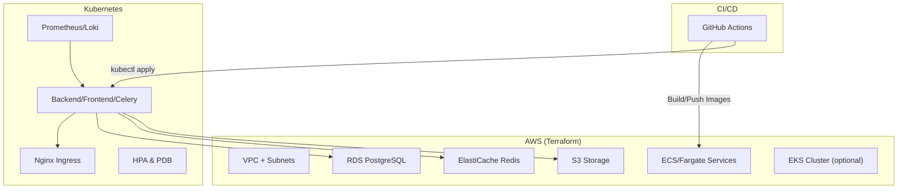
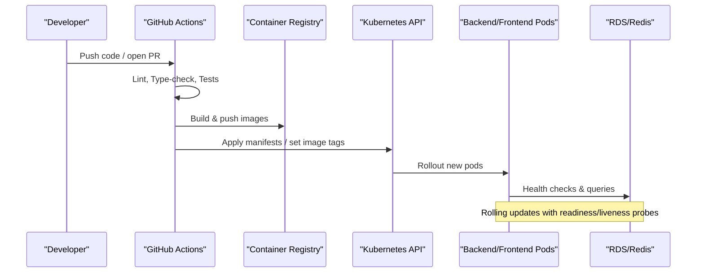
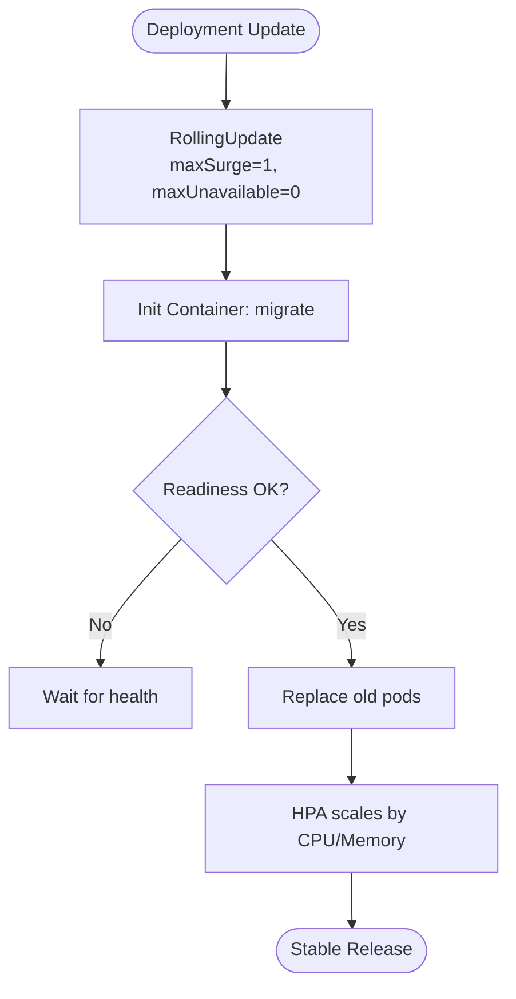
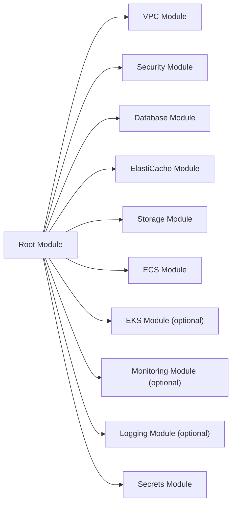
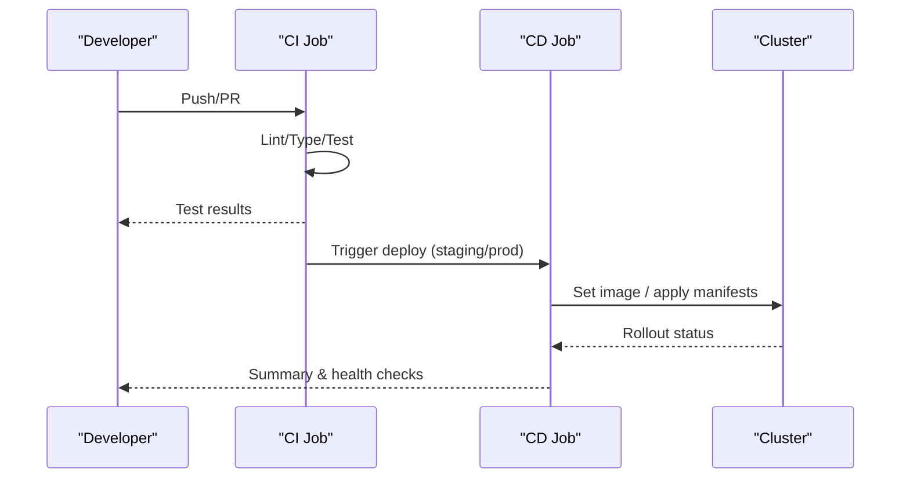
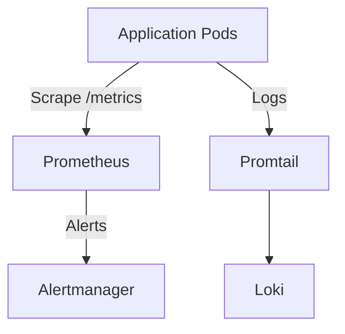
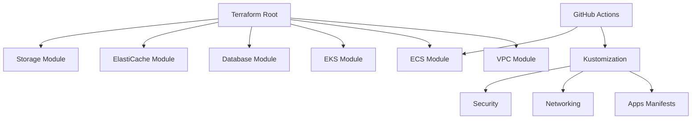

# Infrastructure Architecture Decisions

<cite>
**Referenced Files in This Document**
- [infra/terraform/main.tf](file://infra/terraform/main.tf)
- [infra/terraform/modules/vpc/main.tf](file://infra/terraform/modules/vpc/main.tf)
- [infra/terraform/modules/ecs/main.tf](file://infra/terraform/modules/ecs/main.tf)
- [infra/terraform/modules/eks/main.tf](file://infra/terraform/modules/eks/main.tf)
- [infra/kubernetes/kustomization.yaml](file://infra/kubernetes/kustomization.yaml)
- [infra/kubernetes/apps/backend.yaml](file://infra/kubernetes/apps/backend.yaml)
- [infra/kubernetes/networking/ingress.yaml](file://infra/kubernetes/networking/ingress.yaml)
- [infra/helm/jol-hub/values.yaml](file://infra/helm/jol-hub/values.yaml)
- [.github/workflows/ci.yml](file://.github/workflows/ci.yml)
- [.github/workflows/cd.yml](file://.github/workflows/cd.yml)
- [infra/kubernetes/monitoring/prometheus.yaml](file://infra/kubernetes/monitoring/prometheus.yaml)
- [infra/kubernetes/logging/loki.yaml](file://infra/kubernetes/logging/loki.yaml)
- [docs/architecture/system-overview.md](file://docs/architecture/system-overview.md)
</cite>

## Table of Contents
1. Introduction
2. Project Structure
3. Core Components
4. Architecture Overview
5. Detailed Component Analysis
6. Dependency Analysis
7. Performance Considerations
8. Troubleshooting Guide
9. Conclusion

## Introduction
This document explains the infrastructure architecture decisions that support the JOL-HUB platform, focusing on container orchestration, infrastructure as code, CI/CD pipelines, monitoring and observability, cloud provider selection, security, and disaster recovery. It synthesizes evidence from Terraform modules, Kubernetes manifests, Helm values, GitHub Actions workflows, and internal architecture documentation to provide a clear, actionable view of how JOL-HUB is provisioned, deployed, scaled, observed, and secured.

## Project Structure
The repository organizes infrastructure across three primary layers:
- Infrastructure as Code (Terraform): AWS networking, compute, storage, databases, optional EKS cluster, and optional managed services for monitoring and logging.
- Container Orchestration (Kubernetes/Kustomize/Helm): Application deployments, services, ingress, autoscaling, network policies, and observability components.
- CI/CD (GitHub Actions): Automated testing, image builds, and deployment to staging and production with rollback capabilities.

**Diagram sources**
- [infra/terraform/main.tf:60-271](file://infra/terraform/main.tf#L60-L271)
- [infra/kubernetes/kustomization.yaml:9-27](file://infra/kubernetes/kustomization.yaml#L9-L27)
- [.github/workflows/ci.yml:321-342](file://.github/workflows/ci.yml#L321-L342)
- [.github/workflows/cd.yml:153-295](file://.github/workflows/cd.yml#L153-L295)

**Section sources**
- [infra/terraform/main.tf:1-326](file://infra/terraform/main.tf#L1-L326)
- [infra/kubernetes/kustomization.yaml:1-58](file://infra/kubernetes/kustomization.yaml#L1-L58)
- [.github/workflows/ci.yml:1-379](file://.github/workflows/ci.yml#L1-L379)
- [.github/workflows/cd.yml:1-335](file://.github/workflows/cd.yml#L1-L335)

## Core Components
- Networking and isolation: Multi-AZ VPC with public/private/database subnets, NAT Gateways per AZ, and VPC endpoints to reduce egress costs and improve security.
- Compute and orchestration:
  - ECS/Fargate for serverless containers with ALB, auto-scaling, and CloudWatch logging.
  - Optional EKS cluster with managed node groups, IRSA, and CSI driver for persistent volumes.
- Data services: RDS PostgreSQL with backups and performance insights; ElastiCache Redis for caching and task queues.
- Storage: S3 buckets with lifecycle policies and CloudFront integration for static assets.
- Observability: Prometheus and Loki stacks deployed into Kubernetes for metrics and logs.
- CI/CD: GitHub Actions for linting, type checks, tests, Docker builds, and deployments to staging/production with rollbacks.

**Section sources**
- [infra/terraform/modules/vpc/main.tf:1-283](file://infra/terraform/modules/vpc/main.tf#L1-L283)
- [infra/terraform/modules/ecs/main.tf:1-711](file://infra/terraform/modules/ecs/main.tf#L1-L711)
- [infra/terraform/modules/eks/main.tf:1-405](file://infra/terraform/modules/eks/main.tf#L1-L405)
- [infra/kubernetes/monitoring/prometheus.yaml:1-225](file://infra/kubernetes/monitoring/prometheus.yaml#L1-L225)
- [infra/kubernetes/logging/loki.yaml:1-251](file://infra/kubernetes/logging/loki.yaml#L1-L251)

## Architecture Overview
JOL-HUB supports two runtime modes:
- ECS/Fargate mode: Fully managed serverless containers behind an Application Load Balancer with target tracking scaling based on CPU/memory.
- EKS mode: Managed Kubernetes cluster with separate general-purpose and compute-optimized node groups, enabling fine-grained scheduling and autoscaling via HPA.

Both modes share common IaC patterns: modular Terraform, environment tagging, secrets management via AWS Secrets Manager, and centralized logging/metrics where applicable.

**Diagram sources**
- [.github/workflows/ci.yml:321-342](file://.github/workflows/ci.yml#L321-L342)
- [.github/workflows/cd.yml:153-295](file://.github/workflows/cd.yml#L153-L295)
- [infra/kubernetes/apps/backend.yaml:18-117](file://infra/kubernetes/apps/backend.yaml#L18-L117)

**Section sources**
- [infra/terraform/main.tf:147-224](file://infra/terraform/main.tf#L147-L224)
- [infra/terraform/modules/ecs/main.tf:552-638](file://infra/terraform/modules/ecs/main.tf#L552-L638)
- [infra/terraform/modules/eks/main.tf:153-240](file://infra/terraform/modules/eks/main.tf#L153-L240)

## Detailed Component Analysis

### Container Orchestration: Kubernetes Design, Scaling, and Resources
- Namespace and resource organization: Kustomization defines namespace, base resources, security, networking, and application manifests with common labels and image overrides.
- Backend deployment: Rolling update strategy, init container for migrations, readiness/liveness probes, resource requests/limits, and anti-affinity to spread pods.
- Autoscaling: HorizontalPodAutoscaler targets CPU and memory utilization thresholds with scale-up/down policies and PodDisruptionBudget to maintain availability.
- Ingress: Nginx Ingress with TLS via cert-manager, host-based routing for main site, API, admin dashboard, and wildcard parish subdomains.
- Helm values: Provide defaults for replicas, resources, autoscaling, ingress annotations, pod security context, and monitoring toggles.

**Diagram sources**
- [infra/kubernetes/apps/backend.yaml:18-117](file://infra/kubernetes/apps/backend.yaml#L18-L117)
- [infra/kubernetes/apps/backend.yaml:148-204](file://infra/kubernetes/apps/backend.yaml#L148-L204)
- [infra/kubernetes/networking/ingress.yaml:1-115](file://infra/kubernetes/networking/ingress.yaml#L1-L115)
- [infra/helm/jol-hub/values.yaml:19-139](file://infra/helm/jol-hub/values.yaml#L19-L139)

**Section sources**
- [infra/kubernetes/kustomization.yaml:9-58](file://infra/kubernetes/kustomization.yaml#L9-L58)
- [infra/kubernetes/apps/backend.yaml:1-204](file://infra/kubernetes/apps/backend.yaml#L1-L204)
- [infra/kubernetes/networking/ingress.yaml:1-115](file://infra/kubernetes/networking/ingress.yaml#L1-L115)
- [infra/helm/jol-hub/values.yaml:1-264](file://infra/helm/jol-hub/values.yaml#L1-L264)

### Terraform-Based Infrastructure as Code
- Module organization: Root module composes VPC, Security, Database, ElastiCache, Storage, ECS/EKS, Monitoring, Logging, and Secrets modules.
- Environment management: Variables drive region, environment, CIDRs, instance types, and feature flags (e.g., enable_eks, enable_monitoring).
- State handling: Remote state backend configuration is present but commented out; recommended to enable S3 backend with DynamoDB locking for production.
- Networking: VPC module provisions multi-AZ subnets, IGW, NAT Gateways per AZ, route tables, and VPC endpoints for cost optimization and private access.
- Compute options:
  - ECS: Fargate tasks with ALB, target tracking scaling, CloudWatch log groups, and IAM roles for least privilege.
  - EKS: Managed cluster with node groups, IRSA, EBS CSI driver, and addons (vpc-cni, coredns, kube-proxy).

**Diagram sources**
- [infra/terraform/main.tf:60-271](file://infra/terraform/main.tf#L60-L271)
- [infra/terraform/modules/vpc/main.tf:1-283](file://infra/terraform/modules/vpc/main.tf#L1-L283)
- [infra/terraform/modules/ecs/main.tf:1-711](file://infra/terraform/modules/ecs/main.tf#L1-L711)
- [infra/terraform/modules/eks/main.tf:1-405](file://infra/terraform/modules/eks/main.tf#L1-L405)

**Section sources**
- [infra/terraform/main.tf:1-326](file://infra/terraform/main.tf#L1-L326)
- [infra/terraform/modules/vpc/main.tf:1-283](file://infra/terraform/modules/vpc/main.tf#L1-L283)
- [infra/terraform/modules/ecs/main.tf:1-711](file://infra/terraform/modules/ecs/main.tf#L1-L711)
- [infra/terraform/modules/eks/main.tf:1-405](file://infra/terraform/modules/eks/main.tf#L1-L405)

### CI/CD Pipeline Architecture
- Continuous Integration:
  - Backend: Linting (Black, isort, Flake8), type checking (mypy), unit/integration tests against ephemeral Postgres and Redis, coverage reporting.
  - Frontend: Linting/formatting, TypeScript checks, unit tests, build artifacts.
  - Docker build test: Validates image creation with caching.
- Continuous Deployment:
  - Builds and pushes images with metadata tags (branch, PR, semver, sha, latest).
  - Deploys to staging on develop or workflow dispatch; deploys to production on main or tagged releases.
  - Uses kubectl to set images and wait for rollout; runs smoke/health checks.
  - Rollback job triggers on failure to undo deployments.

**Diagram sources**
- [.github/workflows/ci.yml:32-174](file://.github/workflows/ci.yml#L32-L174)
- [.github/workflows/ci.yml:179-342](file://.github/workflows/ci.yml#L179-L342)
- [.github/workflows/cd.yml:39-148](file://.github/workflows/cd.yml#L39-L148)
- [.github/workflows/cd.yml:153-335](file://.github/workflows/cd.yml#L153-L335)

**Section sources**
- [.github/workflows/ci.yml:1-379](file://.github/workflows/ci.yml#L1-L379)
- [.github/workflows/cd.yml:1-335](file://.github/workflows/cd.yml#L1-L335)

### Monitoring and Observability
- Metrics:
  - Prometheus stack deployed in a dedicated namespace with RBAC, scrape configs for Kubernetes objects and application pods annotated for scraping.
  - ServiceMonitor enabled via Helm values to expose app metrics endpoint.
- Logs:
  - Loki stack with Promtail DaemonSet collecting pod and system logs; retention configured; compactor enabled.
- Alerting:
  - Prometheus configured with alertmanager target; rules mounted via ConfigMap.
- Visualization:
  - Grafana can be added alongside Prometheus to visualize dashboards (not shown here but commonly paired).

**Diagram sources**
- [infra/kubernetes/monitoring/prometheus.yaml:51-151](file://infra/kubernetes/monitoring/prometheus.yaml#L51-L151)
- [infra/kubernetes/logging/loki.yaml:18-147](file://infra/kubernetes/logging/loki.yaml#L18-L147)
- [infra/helm/jol-hub/values.yaml:242-255](file://infra/helm/jol-hub/values.yaml#L242-L255)

**Section sources**
- [infra/kubernetes/monitoring/prometheus.yaml:1-225](file://infra/kubernetes/monitoring/prometheus.yaml#L1-L225)
- [infra/kubernetes/logging/loki.yaml:1-251](file://infra/kubernetes/logging/loki.yaml#L1-L251)
- [infra/helm/jol-hub/values.yaml:242-255](file://infra/helm/jol-hub/values.yaml#L242-L255)

### Cloud Provider Selection and Cost Optimization
- Provider: AWS, evidenced by provider configuration and modules for VPC, ECS, EKS, RDS, ElastiCache, S3, and Route53.
- Cost optimizations:
  - VPC endpoints for ECR APIs, logs, and S3 to avoid NAT egress costs.
  - NAT Gateways per AZ for HA while isolating database subnets without internet access.
  - ECR lifecycle policy to retain recent images and expire older ones.
  - Target tracking scaling with cooldowns to right-size capacity.
  - Optional EKS node groups separated by workload type for efficient scheduling.

**Section sources**
- [infra/terraform/main.tf:8-46](file://infra/terraform/main.tf#L8-L46)
- [infra/terraform/modules/vpc/main.tf:198-283](file://infra/terraform/modules/vpc/main.tf#L198-L283)
- [infra/terraform/modules/ecs/main.tf:66-85](file://infra/terraform/modules/ecs/main.tf#L66-L85)
- [infra/terraform/modules/ecs/main.tf:644-711](file://infra/terraform/modules/ecs/main.tf#L644-L711)
- [infra/terraform/modules/eks/main.tf:153-240](file://infra/terraform/modules/eks/main.tf#L153-L240)

### Security Infrastructure
- Network policies:
  - Kubernetes NetworkPolicy included in Kustomization for traffic control within namespaces.
  - Ingress enforces HTTPS redirect and sets security headers.
- Secret management:
  - AWS Secrets Manager used for Django settings and credentials; ECS tasks reference secrets via valueFrom.
  - EKS uses KMS encryption for secrets at rest.
- Compliance automation:
  - CI includes compliance-related checks and reusable workflows referenced in docs.
  - Documentation references security model and ADRs guiding boundaries and controls.

**Section sources**
- [infra/kubernetes/kustomization.yaml:15-20](file://infra/kubernetes/kustomization.yaml#L15-L20)
- [infra/kubernetes/networking/ingress.yaml:12-28](file://infra/kubernetes/networking/ingress.yaml#L12-L28)
- [infra/terraform/modules/ecs/main.tf:371-394](file://infra/terraform/modules/ecs/main.tf#L371-L394)
- [infra/terraform/modules/eks/main.tf:36-46](file://infra/terraform/modules/eks/main.tf#L36-L46)
- [docs/architecture/security-model.md](file://docs/architecture/security-model.md)

### Disaster Recovery and Business Continuity
- Backups:
  - RDS backup retention configurable; ElastiCache snapshot retention supported.
  - S3 lifecycle policies manage log retention.
- Availability:
  - Multi-AZ networking and services; ECS services use minimum healthy percent and graceful termination.
  - Kubernetes PDB ensures minimum available pods during disruptions.
- Recovery objectives:
  - Internal documentation notes RPO/RTO targets and emphasizes periodic restoration tests.

**Section sources**
- [infra/terraform/main.tf:94-131](file://infra/terraform/main.tf#L94-L131)
- [infra/terraform/modules/ecs/main.tf:122-168](file://infra/terraform/modules/ecs/main.tf#L122-L168)
- [infra/kubernetes/apps/backend.yaml:190-204](file://infra/kubernetes/apps/backend.yaml#L190-L204)
- [docs/architecture/system-overview.md:205-217](file://docs/architecture/system-overview.md#L205-L217)

## Dependency Analysis
- Terraform root module depends on multiple modules for networking, compute, data, storage, and optional services.
- Kubernetes layer depends on cluster-level components (Ingress, NetworkPolicy, ServiceAccounts) and application manifests.
- CI/CD depends on repository structure and toolchains; CD depends on cluster access and secrets.

**Diagram sources**
- [infra/terraform/main.tf:60-271](file://infra/terraform/main.tf#L60-L271)
- [infra/kubernetes/kustomization.yaml:9-27](file://infra/kubernetes/kustomization.yaml#L9-L27)
- [.github/workflows/cd.yml:153-295](file://.github/workflows/cd.yml#L153-L295)

**Section sources**
- [infra/terraform/main.tf:1-326](file://infra/terraform/main.tf#L1-L326)
- [infra/kubernetes/kustomization.yaml:1-58](file://infra/kubernetes/kustomization.yaml#L1-L58)
- [.github/workflows/cd.yml:1-335](file://.github/workflows/cd.yml#L1-L335)

## Performance Considerations
- Autoscaling:
  - ECS target tracking on CPU and memory with cooldowns to stabilize scaling behavior.
  - Kubernetes HPA targeting CPU and memory utilization with aggressive scale-up and conservative scale-down policies.
- Resource requests/limits:
  - Explicit requests/limits for backend, frontend, Celery workers, and background jobs to ensure predictable scheduling and QoS.
- Networking:
  - Ingress timeouts and body size limits tuned for API workloads; TLS termination at edge.
- Caching:
  - Redis for session/cache and message queue acceleration.
- Storage:
  - Persistent volumes for media/static with appropriate sizing; S3 lifecycle policies for log retention.

[No sources needed since this section provides general guidance]

## Troubleshooting Guide
- Deployment failures:
  - Use kubectl rollout status to inspect rollout progress; verify readiness/liveness probes and init container success.
  - Check CI job outputs for lint/type/test failures before deploying.
- Scaling issues:
  - Review HPA metrics and events; adjust target utilization or min/max replicas if necessary.
  - For ECS, review CloudWatch metrics and scaling policies; validate CPU/memory thresholds.
- Observability gaps:
  - Ensure pods are annotated for Prometheus scraping and that Prometheus scrape configs include the correct namespaces and labels.
  - Verify Promtail DaemonSet is running and scraping pod logs; check Loki retention and storage PVCs.
- Networking problems:
  - Validate Ingress rules and TLS secrets; confirm service selectors match pod labels.
  - Inspect NetworkPolicies for unintended denials.

**Section sources**
- [.github/workflows/cd.yml:186-196](file://.github/workflows/cd.yml#L186-L196)
- [.github/workflows/cd.yml:264-275](file://.github/workflows/cd.yml#L264-L275)
- [infra/kubernetes/apps/backend.yaml:82-117](file://infra/kubernetes/apps/backend.yaml#L82-L117)
- [infra/kubernetes/monitoring/prometheus.yaml:100-151](file://infra/kubernetes/monitoring/prometheus.yaml#L100-L151)
- [infra/kubernetes/logging/loki.yaml:169-195](file://infra/kubernetes/logging/loki.yaml#L169-L195)

## Conclusion
JOL-HUB’s infrastructure combines robust IaC with flexible orchestration choices. Terraform modules standardize networking, compute, data, and storage, while Kubernetes manifests and Helm values define consistent application deployments, autoscaling, and security postures. GitHub Actions enforce quality gates and automate safe deployments with rollback paths. The monitoring and logging stack provides comprehensive visibility, and security controls are embedded throughout networking, secrets, and compliance automation. With multi-AZ design, scalable compute, and disciplined CI/CD, JOL-HUB is positioned for reliable, secure, and cost-effective operations at scale.