# Architecture & Design

<cite>
**Referenced Files in This Document**
- [README.md](file://README.md)
- [system-overview.md](file://docs/architecture/system-overview.md)
- [frontend-topology-10-verticals.md](file://docs/architecture/frontend-topology-10-verticals.md)
- [ADR-011-ten-vertical-frontends-hub-and-spoke.md](file://docs/decisions/ADR-011-ten-vertical-frontends-hub-and-spoke.md)
- [base.py](file://backend/django/core/settings/base.py)
- [bitrix24_service.py](file://backend/django/apps/crm/bitrix24_service.py)
- [jol_hub_etl.py](file://data/airflow/dags/jol_hub_etl.py)
- [template_sync.py](file://data/src/pipelines/country_sync/template_sync.py)
- [layout.tsx](file://frontend/apps/template-renderer/src/app/layout.tsx)
- [vertical-router.yaml](file://infra/kubernetes/networking/vertical-router.yaml)
- [kustomization.yaml](file://infra/kubernetes/kustomization.yaml)
- [values.yaml](file://infra/helm/jol-hub/values.yaml)
- [package.json](file://frontend/package.json)
- [core/models.py](file://backend/django/apps/core/models.py)
- [data-flow.md](file://docs/architecture/data-flow.md)
</cite>

## Table of Contents
1. Introduction
2. Project Structure
3. Core Components
4. Architecture Overview
5. Detailed Component Analysis
6. Dependency Analysis
7. Performance Considerations
8. Troubleshooting Guide
9. Conclusion
10. Appendices

## Introduction
This document describes the JOL-HUB platform architecture for a multi-tenant, hub-and-spoke system that serves ten vertical frontends (basilica, cathedral, diocese, deanery, parish, funeral, cemetery-care, protestant, orthodox, other-church). It explains how user requests traverse the ingress and vertical router to Next.js spokes, which render pages using shared packages from the hub and call the Django backend API. Data is isolated per organization via schema-per-tenant with PostgreSQL Row-Level Security. The platform integrates Bitrix24 CRM, runs ETL jobs with Apache Airflow, and deploys on Kubernetes with Helm/Kustomize. Cross-cutting concerns include security, monitoring, GDPR compliance, and disaster recovery.

## Project Structure
JOL-HUB is a monorepo that centralizes platform logic, configuration, and infrastructure:
- Backend: Django monolith with DRF, Celery, Redis, PostgreSQL, and MongoDB for high-volume logs/webhooks.
- Frontend: Next.js 14 App Router monorepo with shared packages and ten vertical spoke repositories.
- Data: Airflow DAGs, dbt models, quality checks, and country sync templates.
- Infrastructure: Kubernetes manifests (Kustomize), Helm values, networking (Ingress + vertical router), and observability.

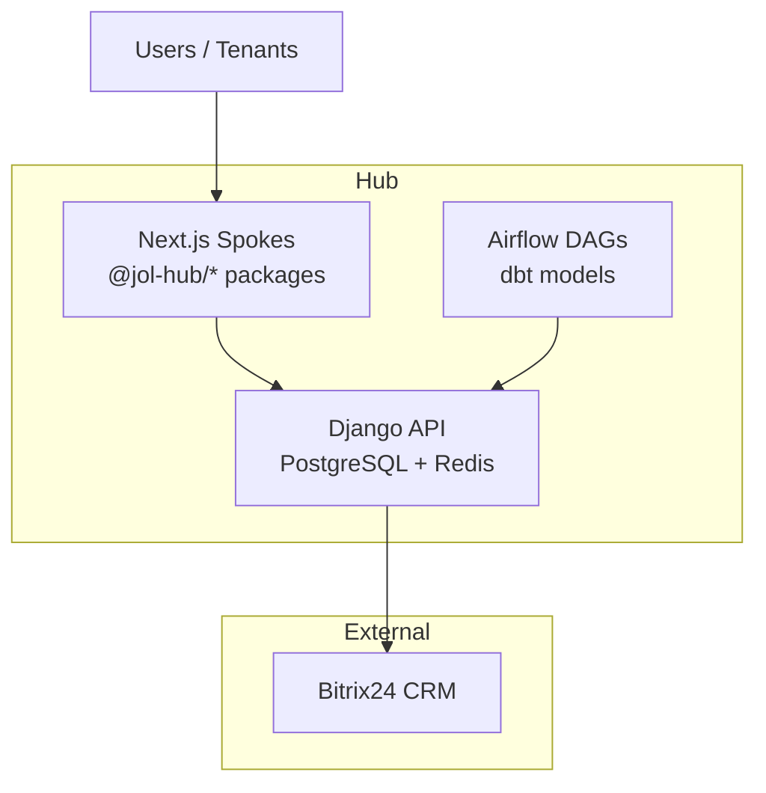

**Diagram sources**
- [frontend-topology-10-verticals.md:40-88](file://docs/architecture/frontend-topology-10-verticals.md#L40-L88)
- [base.py:172-186](file://backend/django/core/settings/base.py#L172-L186)
- [base.py:392-410](file://backend/django/core/settings/base.py#L392-L410)
- [base.py:688-725](file://backend/django/core/settings/base.py#L688-L725)
- [package.json:1-67](file://frontend/package.json#L1-L67)

**Section sources**
- [README.md:33-81](file://README.md#L33-L81)
- [frontend-topology-10-verticals.md:40-88](file://docs/architecture/frontend-topology-10-verticals.md#L40-L88)

## Core Components
- Hub-and-Spoke Frontends: Ten independently deployable vertical sites consuming versioned @jol-hub/* packages.
- Django Monolith API: Centralized business logic, authentication, permissions, rate limiting, and tenant isolation.
- Data Layer: PostgreSQL (schema-per-tenant + RLS), Redis cache, MongoDB for webhooks/logs, Celery for background tasks.
- ETL and Analytics: Airflow DAGs orchestrating daily processing, GDPR cleanup, and reporting; dbt for transformations.
- External Integrations: Bitrix24 CRM with tenant-aware client factory, circuit breaker, and audit logging.
- Deployment: Kubernetes Ingress with vertical router, Helm/Kustomize configurations, autoscaling, and network policies.

**Section sources**
- [ADR-011-ten-vertical-frontends-hub-and-spoke.md:60-110](file://docs/decisions/ADR-011-ten-vertical-frontends-hub-and-spoke.md#L60-L110)
- [base.py:282-327](file://backend/django/core/settings/base.py#L282-L327)
- [base.py:358-386](file://backend/django/core/settings/base.py#L358-L386)
- [base.py:688-725](file://backend/django/core/settings/base.py#L688-L725)
- [jol_hub_etl.py:73-113](file://data/airflow/dags/jol_hub_etl.py#L73-L113)
- [values.yaml:19-47](file://infra/helm/jol-hub/values.yaml#L19-L47)

## Architecture Overview
The platform uses a hub-and-spoke topology where each vertical has its own Next.js application (spoke) deployed behind an ingress that routes by host and vertical label. The template-renderer app in the hub serves as an integration test-bed and reference implementation. Requests flow through the vertical router to the appropriate spoke, which renders content using shared packages and calls the Django API. Data is persisted in PostgreSQL with schema-per-tenant isolation and enforced via RLS.

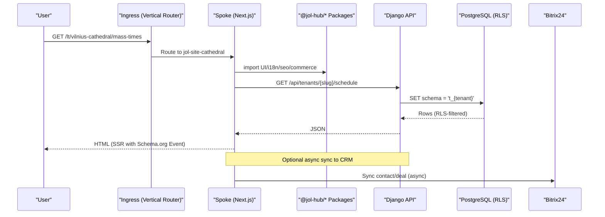

**Diagram sources**
- [frontend-topology-10-verticals.md:89-109](file://docs/architecture/frontend-topology-10-verticals.md#L89-L109)
- [vertical-router.yaml:27-69](file://infra/kubernetes/networking/vertical-router.yaml#L27-L69)
- [base.py:172-186](file://backend/django/core/settings/base.py#L172-L186)
- [bitrix24_service.py:238-300](file://backend/django/apps/crm/bitrix24_service.py#L238-L300)

**Section sources**
- [frontend-topology-10-verticals.md:1-38](file://docs/architecture/frontend-topology-10-verticals.md#L1-L38)
- [vertical-router.yaml:150-226](file://infra/kubernetes/networking/vertical-router.yaml#L150-L226)

## Detailed Component Analysis

### Hub-and-Spoke Frontends (Ten Verticals)
- Each spoke contains only vertical composition code and consumes versioned @jol-hub/* packages.
- Shared packages include UI primitives, i18n, SEO builders, commerce feature flags, tenant resolver, seed data, auth contracts, Bitrix24 SDK, accessibility, performance, observability, and testing utilities.
- CI enforces invariants: single source of truth, versioned packages, payment boundary closed, schema-per-tenant, theme vertical, governance, uniform stack, identical CI, GDPR records, accessibility, and reversibility.

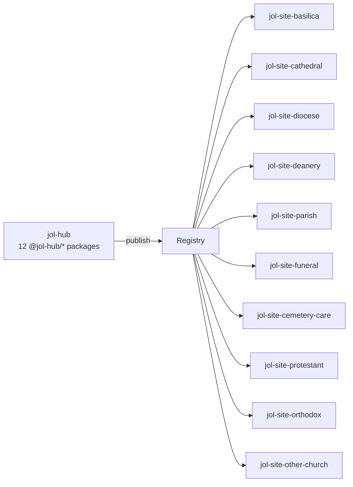

**Diagram sources**
- [frontend-topology-10-verticals.md:40-88](file://docs/architecture/frontend-topology-10-verticals.md#L40-L88)
- [ADR-011-ten-vertical-frontends-hub-and-spoke.md:60-110](file://docs/decisions/ADR-011-ten-vertical-frontends-hub-and-spoke.md#L60-L110)

**Section sources**
- [frontend-topology-10-verticals.md:40-88](file://docs/architecture/frontend-topology-10-verticals.md#L40-L88)
- [ADR-011-ten-vertical-frontends-hub-and-spoke.md:60-110](file://docs/decisions/ADR-011-ten-vertical-frontends-hub-and-spoke.md#L60-L110)

### Template Rendering System (Next.js Root Layout)
- The root layout sets language dynamically from middleware headers, applies theme initialization before first paint, and mounts consent-gated Web Vitals and observability clients.
- Tenant identity and navigation are rendered by locale/tenant layouts; default metadata avoids leaking tenant hints.

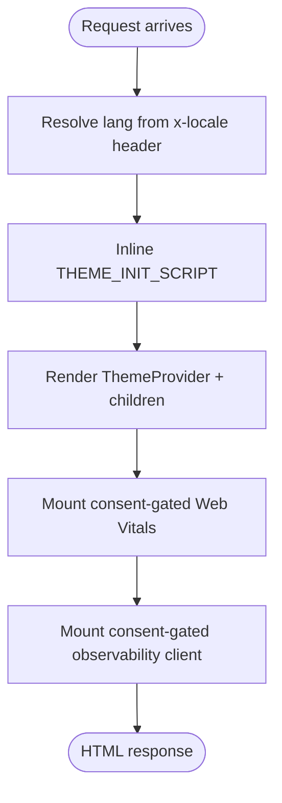

**Diagram sources**
- [layout.tsx:1-72](file://frontend/apps/template-renderer/src/app/layout.tsx#L1-L72)

**Section sources**
- [layout.tsx:1-72](file://frontend/apps/template-renderer/src/app/layout.tsx#L1-L72)

### Django Monolith API (Backend)
- Settings define REST framework, JWT, Celery, caching, email, logging, security, CORS, and observability endpoints.
- Multi-tenancy: schema-per-tenant with RLS enforced at the database level; tenant context middleware used across apps.
- Rate limiting and throttling protect sensitive endpoints (auth, GDPR export/delete, donations).

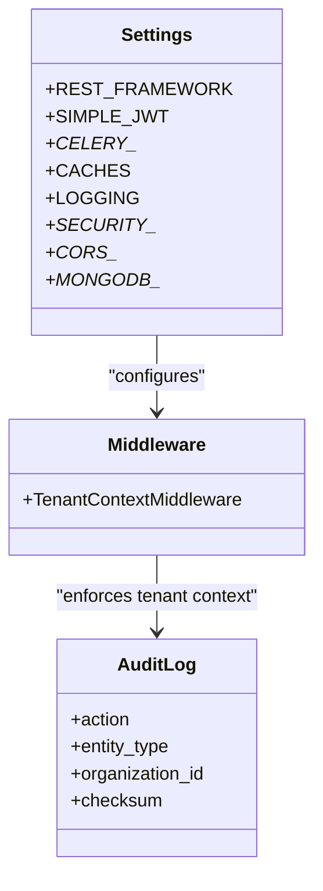

**Diagram sources**
- [base.py:282-327](file://backend/django/core/settings/base.py#L282-L327)
- [base.py:358-386](file://backend/django/core/settings/base.py#L358-L386)
- [base.py:439-513](file://backend/django/core/settings/base.py#L439-L513)
- [base.py:519-578](file://backend/django/core/settings/base.py#L519-L578)
- [base.py:676-725](file://backend/django/core/settings/base.py#L676-L725)
- [core/models.py:67-200](file://backend/django/apps/core/models.py#L67-L200)

**Section sources**
- [base.py:282-327](file://backend/django/core/settings/base.py#L282-L327)
- [base.py:358-386](file://backend/django/core/settings/base.py#L358-L386)
- [base.py:439-513](file://backend/django/core/settings/base.py#L439-L513)
- [base.py:519-578](file://backend/django/core/settings/base.py#L519-L578)
- [base.py:676-725](file://backend/django/core/settings/base.py#L676-L725)
- [core/models.py:67-200](file://backend/django/apps/core/models.py#L67-L200)

### Bitrix24 CRM Integration
- Tenant-aware client factory caches configs and provides per-tenant clients with circuit breaker protection.
- Services map CRM entities to Bitrix24 fields, handle conflicts, and create audit entries for synchronization events.
- Error handling covers rate limits, auth failures, and generic API errors.

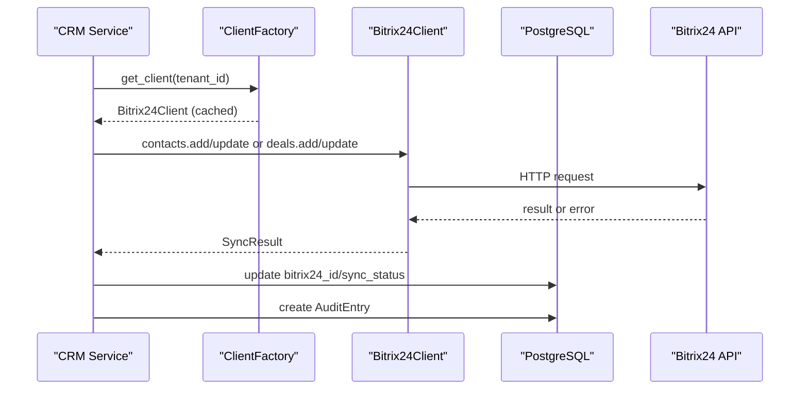

**Diagram sources**
- [bitrix24_service.py:109-236](file://backend/django/apps/crm/bitrix24_service.py#L109-L236)
- [bitrix24_service.py:238-300](file://backend/django/apps/crm/bitrix24_service.py#L238-L300)
- [bitrix24_service.py:302-393](file://backend/django/apps/crm/bitrix24_service.py#L302-L393)
- [bitrix24_service.py:395-468](file://backend/django/apps/crm/bitrix24_service.py#L395-L468)

**Section sources**
- [bitrix24_service.py:109-236](file://backend/django/apps/crm/bitrix24_service.py#L109-L236)
- [bitrix24_service.py:238-300](file://backend/django/apps/crm/bitrix24_service.py#L238-L300)
- [bitrix24_service.py:302-393](file://backend/django/apps/crm/bitrix24_service.py#L302-L393)
- [bitrix24_service.py:395-468](file://backend/django/apps/crm/bitrix24_service.py#L395-L468)

### ETL and Data Processing (Apache Airflow)
- Daily ETL DAG processes donations, validates data quality, performs retention cleanup, and generates compliance reports.
- GDPR DAG supports manual triggers for access, erasure, and portability requests with audit logging.

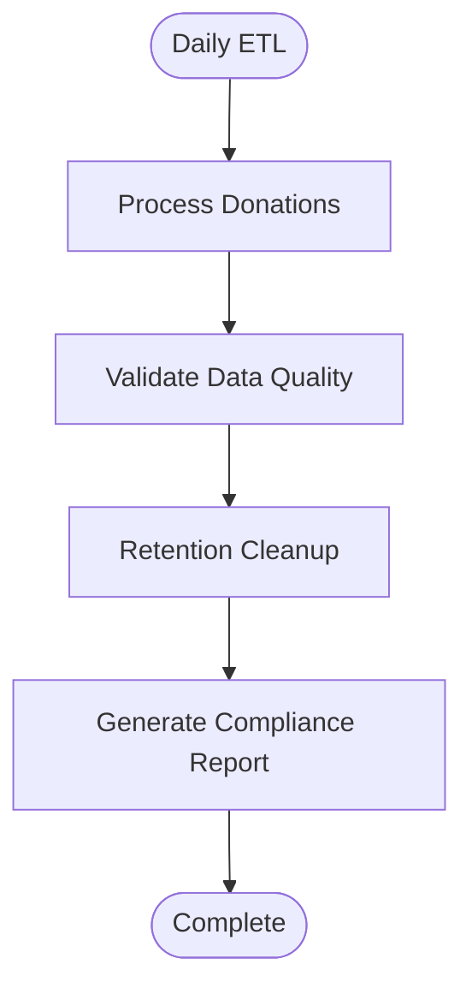

**Diagram sources**
- [jol_hub_etl.py:73-113](file://data/airflow/dags/jol_hub_etl.py#L73-L113)

**Section sources**
- [jol_hub_etl.py:73-113](file://data/airflow/dags/jol_hub_etl.py#L73-L113)
- [jol_hub_etl.py:116-214](file://data/airflow/dags/jol_hub_etl.py#L116-L214)

### Country Sync Templates
- Provides a reusable template for new country pipelines with GDPR classification, legal basis, retention, and audit logging.
- Orchestrates entity, donation, and event synchronization with error handling and metrics.

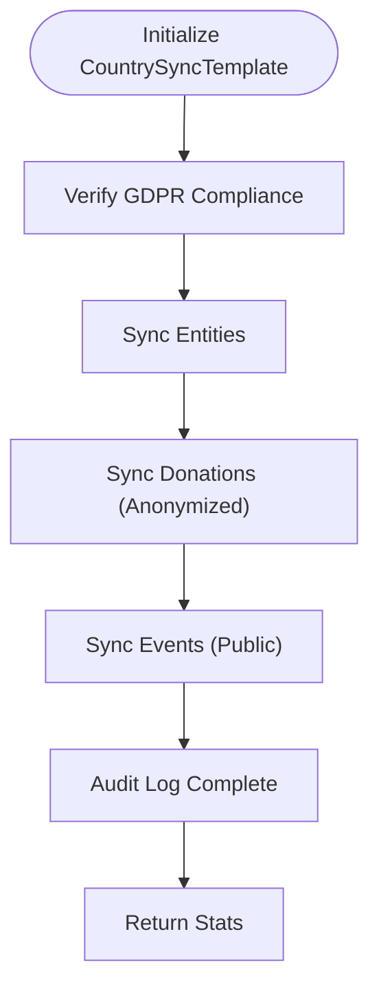

**Diagram sources**
- [template_sync.py:22-47](file://data/src/pipelines/country_sync/template_sync.py#L22-L47)
- [template_sync.py:84-127](file://data/src/pipelines/country_sync/template_sync.py#L84-L127)

**Section sources**
- [template_sync.py:22-47](file://data/src/pipelines/country_sync/template_sync.py#L22-L47)
- [template_sync.py:84-127](file://data/src/pipelines/country_sync/template_sync.py#L84-L127)

### Kubernetes Deployment and Networking
- Kustomization composes base resources, security, networking, applications, and patches replicas.
- Helm values configure backend/frontend replicas, autoscaling, resources, ingress TLS, and monitoring.
- Vertical router Ingress maps wildcard domains to a service that routes to spoke deployments labeled by vertical.

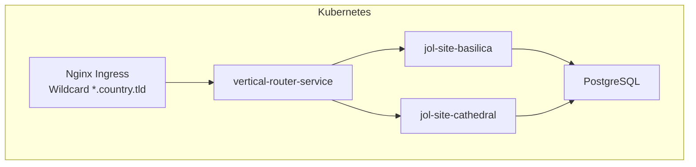

**Diagram sources**
- [kustomization.yaml:1-58](file://infra/kubernetes/kustomization.yaml#L1-L58)
- [values.yaml:19-47](file://infra/helm/jol-hub/values.yaml#L19-L47)
- [values.yaml:57-83](file://infra/helm/jol-hub/values.yaml#L57-L83)
- [values.yaml:140-183](file://infra/helm/jol-hub/values.yaml#L140-L183)
- [vertical-router.yaml:27-69](file://infra/kubernetes/networking/vertical-router.yaml#L27-L69)
- [vertical-router.yaml:150-226](file://infra/kubernetes/networking/vertical-router.yaml#L150-L226)

**Section sources**
- [kustomization.yaml:1-58](file://infra/kubernetes/kustomization.yaml#L1-L58)
- [values.yaml:19-47](file://infra/helm/jol-hub/values.yaml#L19-L47)
- [values.yaml:57-83](file://infra/helm/jol-hub/values.yaml#L57-L83)
- [values.yaml:140-183](file://infra/helm/jol-hub/values.yaml#L140-L183)
- [vertical-router.yaml:27-69](file://infra/kubernetes/networking/vertical-router.yaml#L27-L69)
- [vertical-router.yaml:150-226](file://infra/kubernetes/networking/vertical-router.yaml#L150-L226)

## Dependency Analysis
- Frontend dependencies are managed via pnpm workspaces and Turborepo scripts for build/test/lint across apps and packages.
- Backend depends on Django, DRF, Celery, Redis, PostgreSQL, and optional MongoDB for webhooks/logs.
- Data layer depends on Airflow operators and providers for Postgres and Python tasks.
- Infrastructure depends on Kubernetes, Nginx Ingress, cert-manager, and Helm/Kustomize.

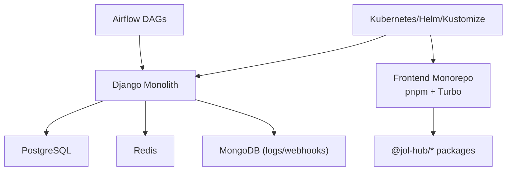

**Diagram sources**
- [package.json:1-67](file://frontend/package.json#L1-L67)
- [base.py:172-186](file://backend/django/core/settings/base.py#L172-L186)
- [base.py:392-410](file://backend/django/core/settings/base.py#L392-L410)
- [base.py:688-725](file://backend/django/core/settings/base.py#L688-L725)
- [jol_hub_etl.py:73-113](file://data/airflow/dags/jol_hub_etl.py#L73-L113)
- [values.yaml:19-47](file://infra/helm/jol-hub/values.yaml#L19-L47)

**Section sources**
- [package.json:1-67](file://frontend/package.json#L1-L67)
- [base.py:172-186](file://backend/django/core/settings/base.py#L172-L186)
- [base.py:392-410](file://backend/django/core/settings/base.py#L392-L410)
- [base.py:688-725](file://backend/django/core/settings/base.py#L688-L725)
- [jol_hub_etl.py:73-113](file://data/airflow/dags/jol_hub_etl.py#L73-L113)
- [values.yaml:19-47](file://infra/helm/jol-hub/values.yaml#L19-L47)

## Performance Considerations
- Frontend: SSR with Next.js 14, theme init script to prevent FOUT, consent-gated Web Vitals and observability.
- Backend: Redis caching with compression and connection pooling; Celery workers with concurrency and time limits; rate limiting for sensitive endpoints.
- Database: PostgreSQL with schema-per-tenant and RLS; connection health checks and timeouts configured.
- Infrastructure: Autoscaling for backend/frontend/Celery; Nginx Ingress caching with TTLs; resource requests/limits defined.

[No sources needed since this section provides general guidance]

## Troubleshooting Guide
- Authentication/Authorization: Check JWT settings, session cookies, CSRF, and allowed hosts.
- Tenant Isolation: Ensure tenant context middleware is active and organization IDs match current tenant; audit log saves enforce tenant validation.
- Bitrix24 Sync Failures: Inspect circuit breaker state, rate limit errors, and auth errors; verify tenant config and cached client instances.
- ETL Issues: Review Airflow task logs for data quality/validation failures; confirm retention cleanup and report generation steps.
- Deployment: Validate Ingress rules, TLS secrets, and vertical router service selectors; check pod readiness/liveness probes.

**Section sources**
- [base.py:282-327](file://backend/django/core/settings/base.py#L282-L327)
- [base.py:519-578](file://backend/django/core/settings/base.py#L519-L578)
- [core/models.py:156-200](file://backend/django/apps/core/models.py#L156-L200)
- [bitrix24_service.py:238-300](file://backend/django/apps/crm/bitrix24_service.py#L238-L300)
- [bitrix24_service.py:302-393](file://backend/django/apps/crm/bitrix24_service.py#L302-L393)
- [jol_hub_etl.py:73-113](file://data/airflow/dags/jol_hub_etl.py#L73-L113)
- [vertical-router.yaml:171-226](file://infra/kubernetes/networking/vertical-router.yaml#L171-L226)

## Conclusion
JOL-HUB implements a robust hub-and-spoke architecture with ten vertical frontends, a Django monolith API, and strong multi-tenancy via schema-per-tenant and RLS. The system integrates Bitrix24 CRM, runs ETL with Airflow, and deploys on Kubernetes with Helm/Kustomize. Security, monitoring, GDPR compliance, and disaster recovery are embedded throughout the stack. The design balances maintainability, scalability, and compliance while enabling independent deployment and versioning of each vertical.

[No sources needed since this section summarizes without analyzing specific files]

## Appendices

### System Context Diagram
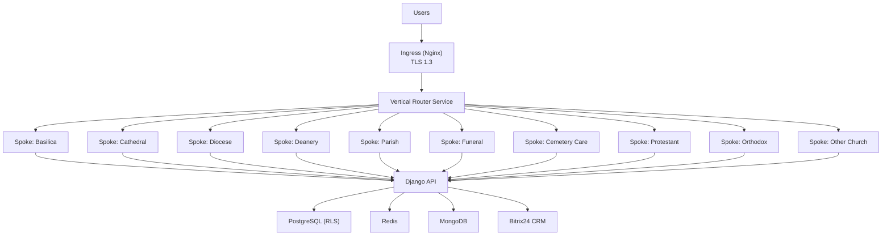

**Diagram sources**
- [vertical-router.yaml:27-69](file://infra/kubernetes/networking/vertical-router.yaml#L27-L69)
- [vertical-router.yaml:150-226](file://infra/kubernetes/networking/vertical-router.yaml#L150-L226)
- [base.py:172-186](file://backend/django/core/settings/base.py#L172-L186)
- [base.py:392-410](file://backend/django/core/settings/base.py#L392-L410)
- [base.py:688-725](file://backend/django/core/settings/base.py#L688-L725)
- [bitrix24_service.py:238-300](file://backend/django/apps/crm/bitrix24_service.py#L238-L300)

### Data Flow Diagram
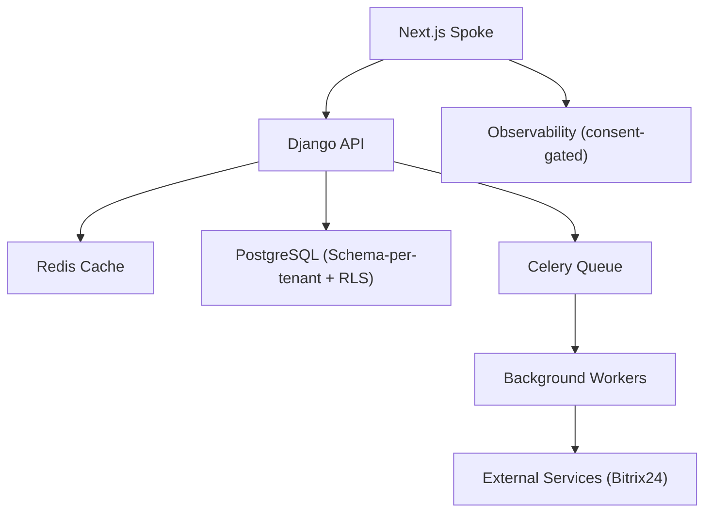

**Diagram sources**
- [data-flow.md:17-32](file://docs/architecture/data-flow.md#L17-L32)
- [base.py:358-386](file://backend/django/core/settings/base.py#L358-L386)
- [base.py:392-410](file://backend/django/core/settings/base.py#L392-L410)
- [base.py:172-186](file://backend/django/core/settings/base.py#L172-L186)
- [bitrix24_service.py:238-300](file://backend/django/apps/crm/bitrix24_service.py#L238-L300)