# Asynchronous Processing

<cite>
**Referenced Files in This Document**
- [celery.py](file://backend/django/core/celery.py)
- [base.py](file://backend/django/core/settings/base.py)
- [development.py](file://backend/django/core/settings/development.py)
- [tasks.py](file://backend/django/apps/core/tasks.py)
- [tasks.py](file://backend/django/apps/integrations/tasks.py)
- [email.py](file://backend/integrations/bitrix24/api/email.py)
- [email.ts](file://frontend/packages/bitrix-sdk/src/api/email.ts)
- [route.ts](file://frontend/apps/admin-dashboard/src/app/api/bitrix24/webhook/route.ts)
- [logger.ts](file://frontend/packages/observability/src/logger.ts)
- [celery.yaml](file://infra/kubernetes/apps/celery.yaml)
- [jol_daily_sync.py](file://data/airflow/dags/jol_daily_sync.py)
- [jol_weekly_reporting.py](file://data/airflow/dags/jol_weekly_reporting.py)
- [retention_manager.py](file://data/src/gdpr/retention_manager.py)
- [processors.py](file://data/src/processors.py)
</cite>

## Table of Contents
1. [Introduction](#introduction)
2. [Project Structure](#project-structure)
3. [Core Components](#core-components)
4. [Architecture Overview](#architecture-overview)
5. [Detailed Component Analysis](#detailed-component-analysis)
6. [Dependency Analysis](#dependency-analysis)
7. [Performance Considerations](#performance-considerations)
8. [Troubleshooting Guide](#troubleshooting-guide)
9. [Conclusion](#conclusion)
10. [Appendices](#appendices)

## Introduction
This document explains JOL-HUB’s asynchronous processing patterns, focusing on Celery task queues, background job orchestration, and scheduled tasks. It covers email notification processing, report generation, data synchronization, cleanup operations, prioritization, retries, dead letter handling, monitoring, and scaling strategies for high-volume workloads. It also provides common async workflows such as CRM synchronization, analytics aggregation, file processing, and batch operations, along with error handling, logging, and debugging techniques for distributed systems.

## Project Structure
JOL-HUB uses a layered approach:
- Django app defines Celery configuration and discovers tasks across apps.
- Task modules implement background jobs (e.g., webhook processing, session cleanup).
- Airflow DAGs schedule ETL and reporting pipelines.
- Frontend components include retry queues and observability utilities.
- Kubernetes manifests deploy Celery workers and the scheduler.

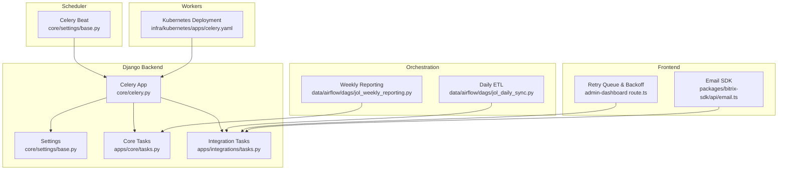

**Diagram sources**
- [celery.py:1-32](file://backend/django/core/celery.py#L1-L32)
- [base.py:361-386](file://backend/django/core/settings/base.py#L361-L386)
- [tasks.py:1-25](file://backend/django/apps/core/tasks.py#L1-L25)
- [tasks.py:1-668](file://backend/django/apps/integrations/tasks.py#L1-L668)
- [celery.yaml:43-89](file://infra/kubernetes/apps/celery.yaml#L43-L89)
- [jol_daily_sync.py:1-126](file://data/airflow/dags/jol_daily_sync.py#L1-L126)
- [jol_weekly_reporting.py:1-78](file://data/airflow/dags/jol_weekly_reporting.py#L1-L78)
- [route.ts:208-303](file://frontend/apps/admin-dashboard/src/app/api/bitrix24/webhook/route.ts#L208-L303)
- [email.ts:266-300](file://frontend/packages/bitrix-sdk/src/api/email.ts#L266-L300)

**Section sources**
- [celery.py:1-32](file://backend/django/core/celery.py#L1-L32)
- [base.py:361-386](file://backend/django/core/settings/base.py#L361-L386)
- [celery.yaml:43-89](file://infra/kubernetes/apps/celery.yaml#L43-L89)

## Core Components
- Celery application initialization and autodiscovery of tasks.
- Celery settings for broker, result backend, time zone, concurrency, and task limits.
- Scheduled tasks via Celery Beat (daily digest, session cleanup, recurring donations).
- Background tasks for core housekeeping and integration webhooks.
- Airflow DAGs for daily ETL and weekly reporting.
- Frontend retry queue with exponential backoff and circuit breaker logic.
- Observability logger with batching and environment-aware log levels.

**Section sources**
- [celery.py:1-32](file://backend/django/core/celery.py#L1-L32)
- [base.py:361-386](file://backend/django/core/settings/base.py#L361-L386)
- [development.py:59-92](file://backend/django/core/settings/development.py#L59-L92)
- [tasks.py:1-25](file://backend/django/apps/core/tasks.py#L1-L25)
- [tasks.py:1-668](file://backend/django/apps/integrations/tasks.py#L1-L668)
- [jol_daily_sync.py:1-126](file://data/airflow/dags/jol_daily_sync.py#L1-L126)
- [jol_weekly_reporting.py:1-78](file://data/airflow/dags/jol_weekly_reporting.py#L1-L78)
- [route.ts:208-303](file://frontend/apps/admin-dashboard/src/app/api/bitrix24/webhook/route.ts#L208-L303)
- [logger.ts:36-139](file://frontend/packages/observability/src/logger.ts#L36-L139)

## Architecture Overview
The system combines real-time background processing with scheduled orchestration:
- Webhooks and API calls enqueue Celery tasks to process events asynchronously.
- Celery workers consume tasks from a Redis broker and persist results to a Redis backend.
- Celery Beat schedules periodic tasks for maintenance and business cycles.
- Airflow DAGs run long-running ETL and reporting jobs, often invoking Python functions that interact with databases and external services.
- Frontend retry queues provide resilience for transient failures before or alongside backend processing.

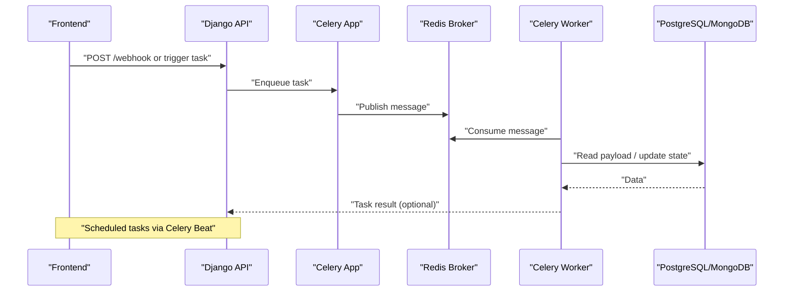

**Diagram sources**
- [celery.py:1-32](file://backend/django/core/celery.py#L1-L32)
- [base.py:361-386](file://backend/django/core/settings/base.py#L361-L386)
- [tasks.py:93-295](file://backend/django/apps/integrations/tasks.py#L93-L295)

## Detailed Component Analysis

### Celery Application and Configuration
- The Celery app is initialized and configured using Django settings under the CELERY namespace.
- Autodiscovery loads tasks from installed apps.
- Settings define broker URL, result backend, serializer, timezone, concurrency, and task time limits.
- Development overrides enable eager execution for testing.

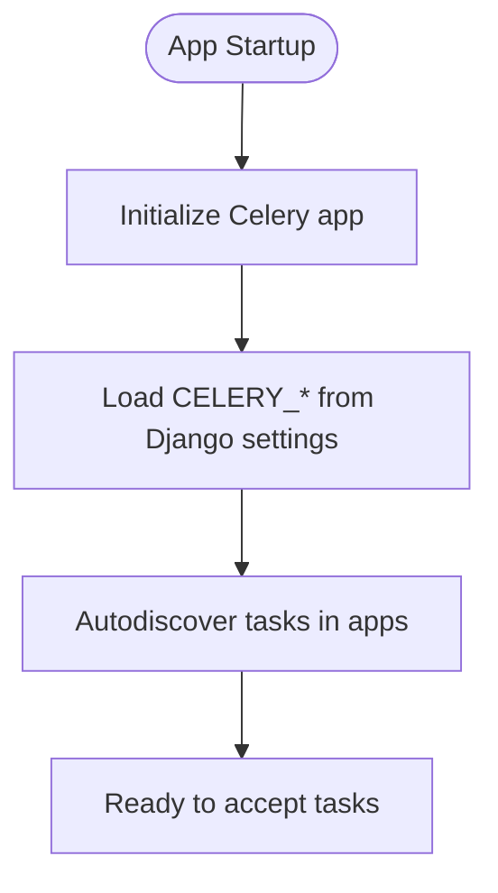

**Diagram sources**
- [celery.py:1-32](file://backend/django/core/celery.py#L1-L32)
- [base.py:361-386](file://backend/django/core/settings/base.py#L361-L386)
- [development.py:59-92](file://backend/django/core/settings/development.py#L59-L92)

**Section sources**
- [celery.py:1-32](file://backend/django/core/celery.py#L1-L32)
- [base.py:361-386](file://backend/django/core/settings/base.py#L361-L386)
- [development.py:59-92](file://backend/django/core/settings/development.py#L59-L92)

### Scheduled Tasks (Celery Beat)
- Daily digest, session cleanup, and recurring donation processing are scheduled via Celery Beat.
- These tasks run at defined cron-like schedules and execute background jobs without blocking request paths.

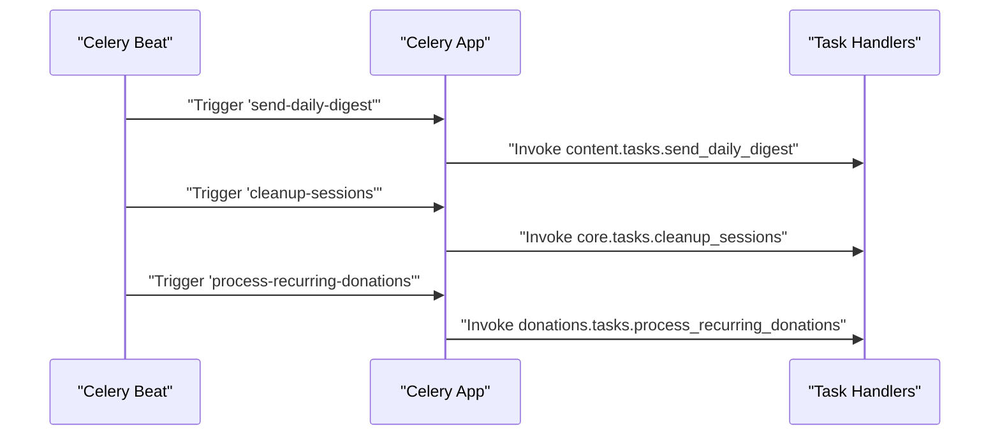

**Diagram sources**
- [base.py:372-386](file://backend/django/core/settings/base.py#L372-L386)

**Section sources**
- [base.py:372-386](file://backend/django/core/settings/base.py#L372-L386)

### Core Housekeeping Tasks
- Session cleanup removes expired sessions from the database.
- Test task provides a smoke test for development environments.

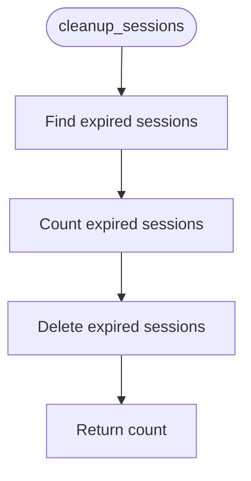

**Diagram sources**
- [tasks.py:9-18](file://backend/django/apps/core/tasks.py#L9-L18)

**Section sources**
- [tasks.py:1-25](file://backend/django/apps/core/tasks.py#L1-L25)

### Bitrix24 Webhook Processing Pipeline
- The integration task processes incoming Bitrix24 webhooks asynchronously with robust error handling.
- It fetches raw payloads from MongoDB, creates or retrieves tracking records in PostgreSQL, enforces idempotency, marks status transitions, executes business logic, and logs structured audit entries.
- Transient errors trigger autoretry with exponential backoff; permanent errors mark tasks as failed without retry.

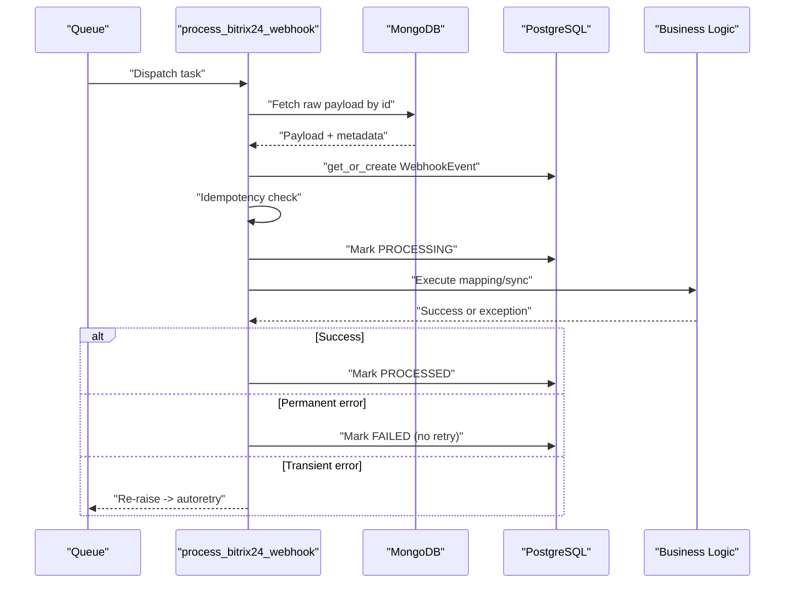

**Diagram sources**
- [tasks.py:93-295](file://backend/django/apps/integrations/tasks.py#L93-L295)

**Section sources**
- [tasks.py:93-295](file://backend/django/apps/integrations/tasks.py#L93-L295)

### Email Notification Processing
- Email sending integrates with Bitrix24 APIs, including template management and sending receipts.
- Operations are logged for GDPR compliance and return message identifiers and recipient counts.
- Frontend SDK supports sending weekly bulletins to parish subscribers by resolving contacts and dispatching emails.

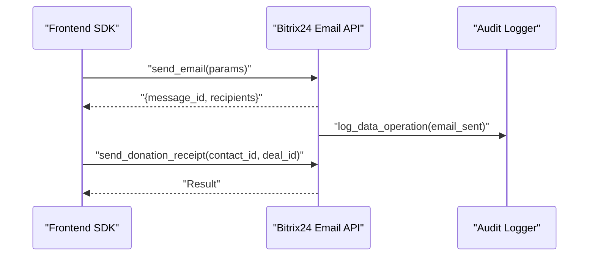

**Diagram sources**
- [email.py:174-267](file://backend/integrations/bitrix24/api/email.py#L174-L267)
- [email.ts:266-300](file://frontend/packages/bitrix-sdk/src/api/email.ts#L266-L300)

**Section sources**
- [email.py:174-267](file://backend/integrations/bitrix24/api/email.py#L174-L267)
- [email.ts:266-300](file://frontend/packages/bitrix-sdk/src/api/email.ts#L266-L300)

### Retry Mechanisms and Dead Letter Handling
- Celery autoretry with exponential backoff and jitter for transient errors in webhook processing.
- Frontend retry queue implements exponential backoff with jitter and a maximum attempt limit; exhausted retries are logged as audit events.
- No explicit dead letter queue is implemented; failed events remain in PostgreSQL with FAILED status and can be retried by a scheduled task.

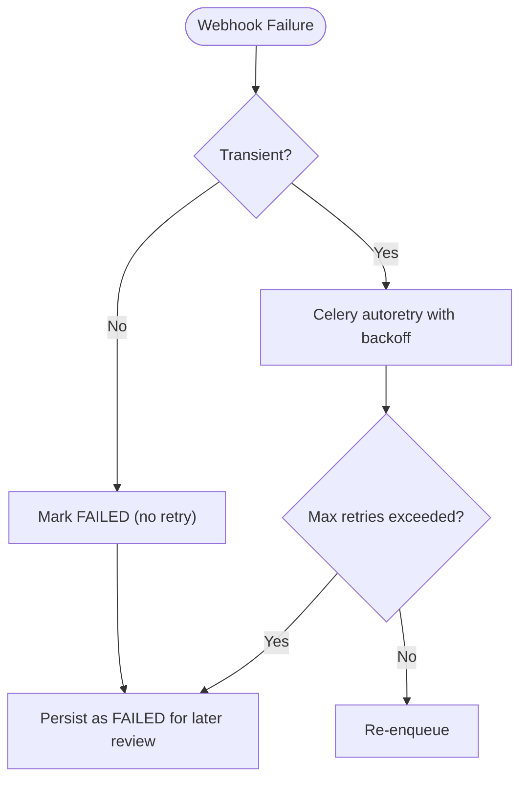

**Diagram sources**
- [tasks.py:19-36](file://backend/django/apps/integrations/tasks.py#L19-L36)
- [tasks.py:93-100](file://backend/django/apps/integrations/tasks.py#L93-L100)
- [route.ts:208-303](file://frontend/apps/admin-dashboard/src/app/api/bitrix24/webhook/route.ts#L208-L303)

**Section sources**
- [tasks.py:19-36](file://backend/django/apps/integrations/tasks.py#L19-L36)
- [tasks.py:93-100](file://backend/django/apps/integrations/tasks.py#L93-L100)
- [route.ts:208-303](file://frontend/apps/admin-dashboard/src/app/api/bitrix24/webhook/route.ts#L208-L303)

### Monitoring and Logging
- Structured audit logs capture actor, action, resource type, entity ID, tenant ID, and details for SOC2/ISO compliance.
- Frontend logger provides JSON lines output, environment-aware minimum log levels, and batching to reduce overhead.
- Kubernetes deployment exposes Celery worker resources and environment variables for broker and result backend.

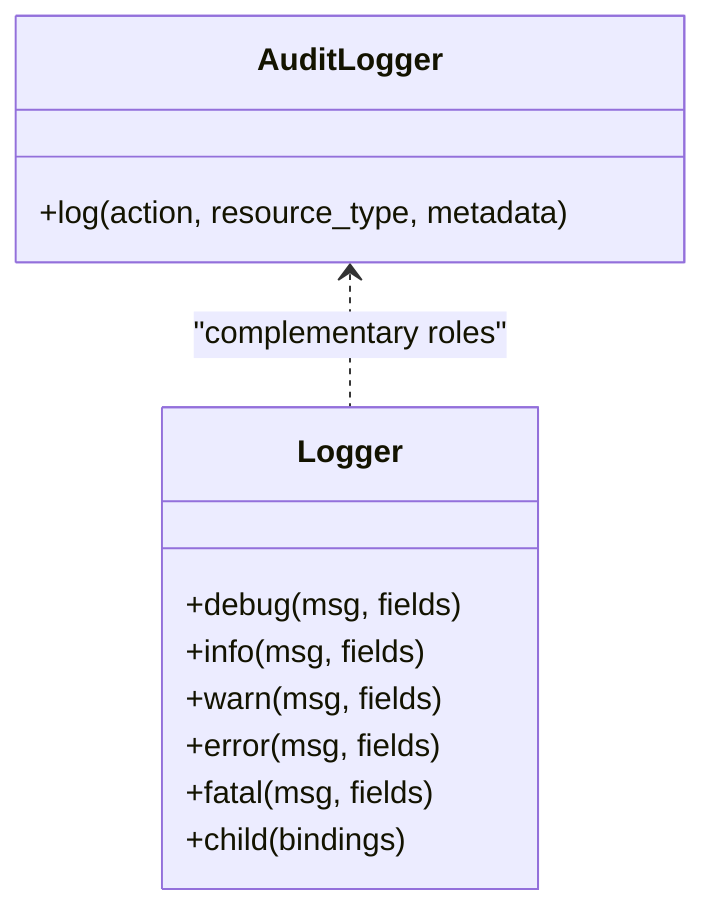

**Diagram sources**
- [tasks.py:45-73](file://backend/django/apps/integrations/tasks.py#L45-L73)
- [logger.ts:36-139](file://frontend/packages/observability/src/logger.ts#L36-L139)

**Section sources**
- [tasks.py:45-73](file://backend/django/apps/integrations/tasks.py#L45-L73)
- [logger.ts:36-139](file://frontend/packages/observability/src/logger.ts#L36-L139)
- [celery.yaml:43-89](file://infra/kubernetes/apps/celery.yaml#L43-L89)

### Data Synchronization and Cleanup
- Daily ETL synchronizes country data, runs quality checks, aggregates donations, cleans up expired data, and generates compliance reports.
- Retention manager enforces retention rules and legal holds, logging actions for auditability.
- Weekly reporting produces analytics, country metrics, and compliance scorecards.

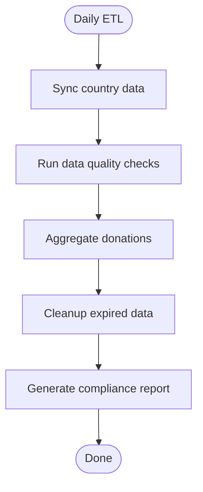

**Diagram sources**
- [jol_daily_sync.py:25-72](file://data/airflow/dags/jol_daily_sync.py#L25-L72)
- [retention_manager.py:188-265](file://data/src/gdpr/retention_manager.py#L188-L265)

**Section sources**
- [jol_daily_sync.py:25-72](file://data/airflow/dags/jol_daily_sync.py#L25-L72)
- [retention_manager.py:188-265](file://data/src/gdpr/retention_manager.py#L188-L265)
- [jol_weekly_reporting.py:20-78](file://data/airflow/dags/jol_weekly_reporting.py#L20-L78)

### Common Async Workflows
- CRM synchronization: Webhook-driven contact/lead sync with idempotent upserts and consent handling.
- Analytics aggregation: Donation aggregation with k-anonymity and scheduled runs.
- File processing: Email templates and receipts sent via Bitrix24 APIs with audit logging.
- Batch operations: Country-level sync tasks orchestrated by Airflow with parallelizable groups.

**Section sources**
- [tasks.py:325-427](file://backend/django/apps/integrations/tasks.py#L325-L427)
- [tasks.py:462-551](file://backend/django/apps/integrations/tasks.py#L462-L551)
- [tasks.py:554-641](file://backend/django/apps/integrations/tasks.py#L554-L641)
- [jol_daily_sync.py:25-72](file://data/airflow/dags/jol_daily_sync.py#L25-L72)
- [email.py:174-267](file://backend/integrations/bitrix24/api/email.py#L174-L267)

## Dependency Analysis
- Celery depends on Django settings for configuration and on Redis for messaging and results.
- Integration tasks depend on MongoDB for raw payloads and PostgreSQL for tracking and domain models.
- Airflow DAGs depend on Python modules for pipelines, quality checks, and GDPR utilities.
- Frontend retry queue depends on backend endpoints and local state for backoff scheduling.

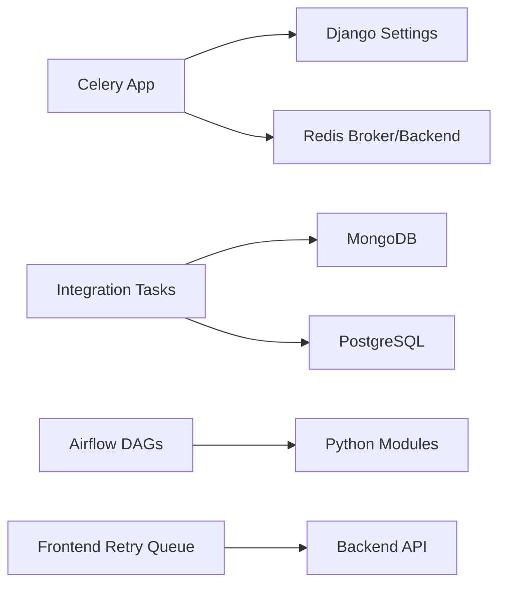

**Diagram sources**
- [celery.py:1-32](file://backend/django/core/celery.py#L1-L32)
- [base.py:361-386](file://backend/django/core/settings/base.py#L361-L386)
- [tasks.py:133-181](file://backend/django/apps/integrations/tasks.py#L133-L181)
- [jol_daily_sync.py:25-72](file://data/airflow/dags/jol_daily_sync.py#L25-L72)
- [route.ts:208-303](file://frontend/apps/admin-dashboard/src/app/api/bitrix24/webhook/route.ts#L208-L303)

**Section sources**
- [celery.py:1-32](file://backend/django/core/celery.py#L1-L32)
- [base.py:361-386](file://backend/django/core/settings/base.py#L361-L386)
- [tasks.py:133-181](file://backend/django/apps/integrations/tasks.py#L133-L181)
- [jol_daily_sync.py:25-72](file://data/airflow/dags/jol_daily_sync.py#L25-L72)
- [route.ts:208-303](file://frontend/apps/admin-dashboard/src/app/api/bitrix24/webhook/route.ts#L208-L303)

## Performance Considerations
- Concurrency and prefetch: Configure worker concurrency and prefetch multiplier to balance throughput and memory usage.
- Time limits: Enforce task time limits to prevent long-running tasks from starving workers.
- Broker and backend: Use dedicated Redis instances or clusters for broker and result backend to avoid contention.
- Batching: Employ batched logging and metric emission to reduce I/O overhead.
- Scaling: Deploy multiple Celery worker replicas with horizontal pod autoscaling based on queue depth and CPU/memory utilization.
- Idempotency: Ensure tasks are idempotent to safely retry without side effects.

[No sources needed since this section provides general guidance]

## Troubleshooting Guide
- Verify Celery connectivity: Check broker and result backend URLs in settings and environment variables.
- Inspect task logs: Use structured audit logs and worker logs to trace state transitions and errors.
- Review failed tasks: PostgreSQL WebhookEvent records show FAILED status and error messages; use scheduled retry tasks to reprocess recent failures.
- Frontend retries: Monitor retry queue size and max attempts; ensure backoff parameters are tuned for external service rate limits.
- Resource constraints: Adjust Kubernetes resource requests/limits for Celery workers to prevent OOM or throttling.

**Section sources**
- [base.py:361-386](file://backend/django/core/settings/base.py#L361-L386)
- [tasks.py:240-295](file://backend/django/apps/integrations/tasks.py#L240-L295)
- [tasks.py:644-668](file://backend/django/apps/integrations/tasks.py#L644-L668)
- [route.ts:208-303](file://frontend/apps/admin-dashboard/src/app/api/bitrix24/webhook/route.ts#L208-L303)
- [celery.yaml:43-89](file://infra/kubernetes/apps/celery.yaml#L43-L89)

## Conclusion
JOL-HUB’s asynchronous processing leverages Celery for real-time background tasks and Celery Beat for scheduled jobs, complemented by Airflow for complex ETL and reporting workflows. Robust error handling, structured auditing, and frontend retry mechanisms ensure reliability and compliance. Proper configuration, monitoring, and scaling practices enable high-volume processing while maintaining performance and observability.

[No sources needed since this section summarizes without analyzing specific files]

## Appendices

### Error Handling and Debugging Techniques
- Distinguish transient vs permanent errors to control retries and dead-letter behavior.
- Use structured audit logs to correlate events across services.
- Leverage development settings to run tasks eagerly for quick iteration.
- Apply batching and environment-aware log levels to optimize production logging.

**Section sources**
- [tasks.py:19-36](file://backend/django/apps/integrations/tasks.py#L19-L36)
- [tasks.py:45-73](file://backend/django/apps/integrations/tasks.py#L45-L73)
- [development.py:59-92](file://backend/django/core/settings/development.py#L59-L92)
- [logger.ts:36-139](file://frontend/packages/observability/src/logger.ts#L36-L139)

### Scaling and Worker Management
- Horizontal scaling: Run multiple Celery worker pods with appropriate resource limits.
- Queue partitioning: Separate queues for high-priority and low-priority tasks if needed.
- Autoscaling: Use metrics like queue length and CPU utilization to scale workers dynamically.
- Resource tuning: Adjust concurrency, prefetch multiplier, and time limits per workload characteristics.

**Section sources**
- [celery.yaml:43-89](file://infra/kubernetes/apps/celery.yaml#L43-L89)
- [base.py:361-386](file://backend/django/core/settings/base.py#L361-L386)