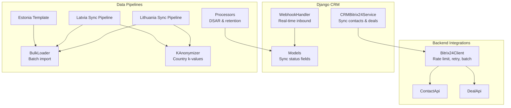
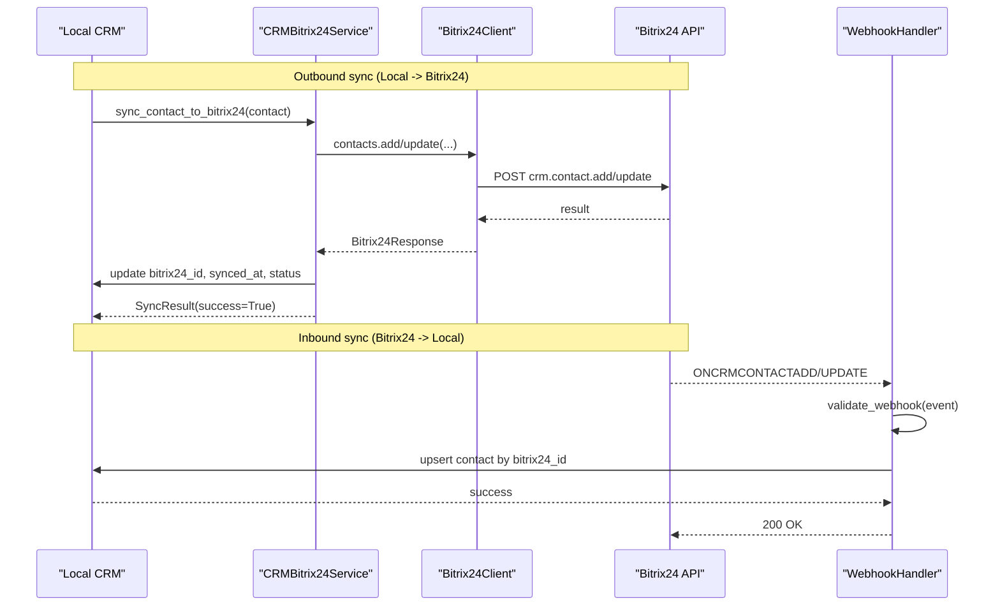
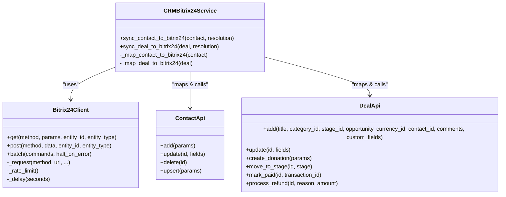
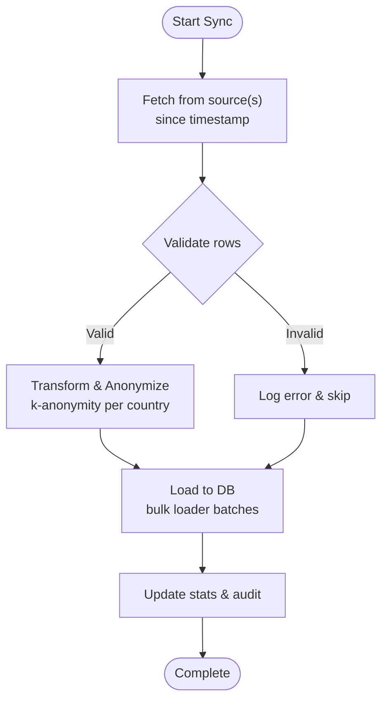
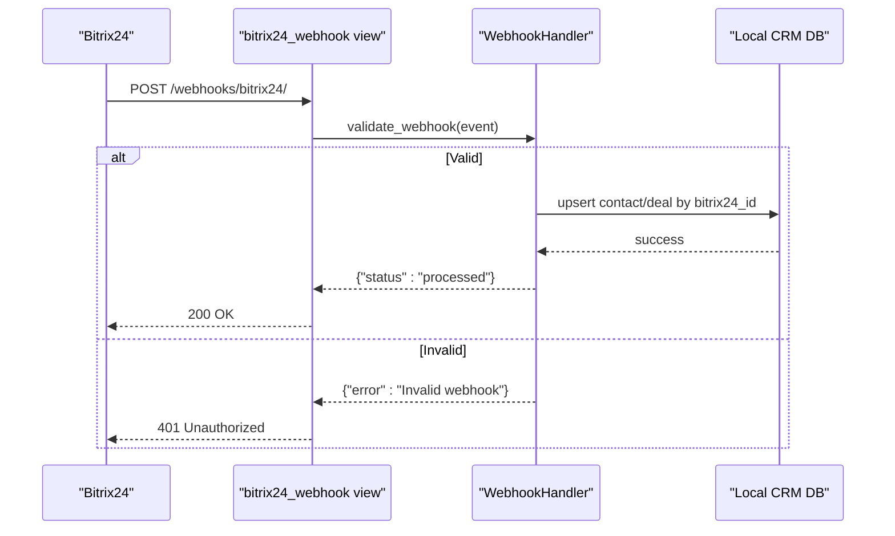
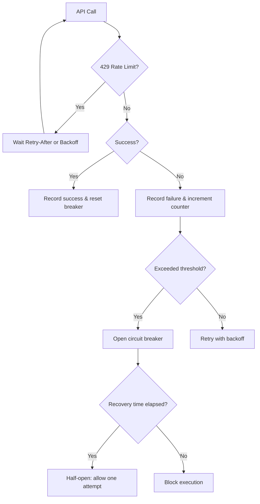
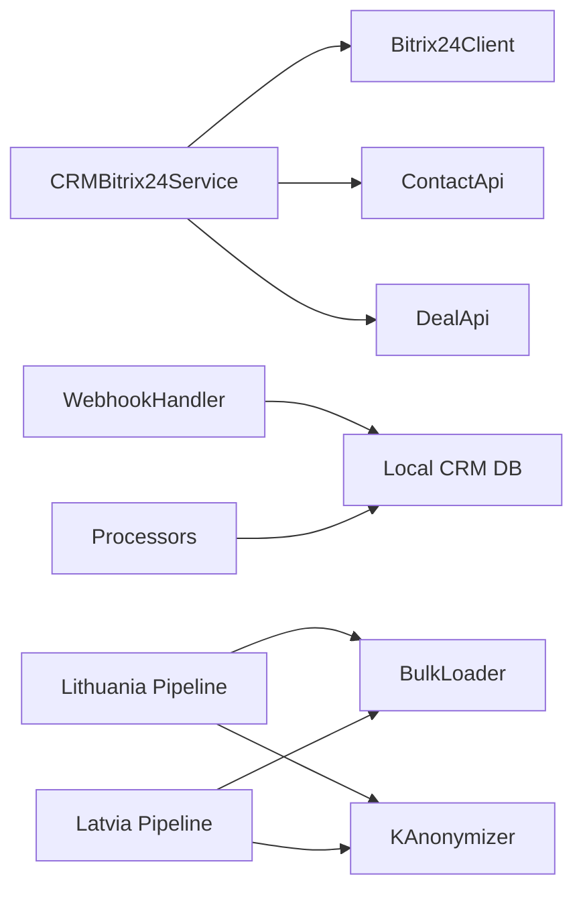

# Background Data Synchronization

<cite>
**Referenced Files in This Document**
- [client.py](file://backend/integrations/bitrix24/client.py)
- [bitrix24_service.py](file://backend/django/apps/crm/bitrix24_service.py)
- [handlers.py](file://backend/integrations/bitrix24/webhooks/handlers.py)
- [contacts.py](file://backend/integrations/bitrix24/api/contacts.py)
- [deals.py](file://backend/integrations/bitrix24/api/deals.py)
- [lt_sync.py](file://data/src/pipelines/country_sync/lt_sync.py)
- [lv_sync.py](file://data/src/pipelines/country_sync/lv_sync.py)
- [template_sync.py](file://data/src/pipelines/country_sync/template_sync.py)
- [bulk_loader.py](file://data/src/pipelines/entity_import/bulk_loader.py)
- [processors.py](file://data/src/processors.py)
- [anonymizer.py](file://data/src/gdpr/anonymizer.py)
- [models.py](file://backend/django/apps/crm/models.py)
</cite>

## Table of Contents
1. Introduction
2. Project Structure
3. Core Components
4. Architecture Overview
5. Detailed Component Analysis
6. Dependency Analysis
7. Performance Considerations
8. Troubleshooting Guide
9. Conclusion

## Introduction
This document explains the background data synchronization processes in JOL-HUB with a focus on:
- CRM synchronization with Bitrix24 (contact syncing, deal updates, bidirectional flow)
- Country-specific pipelines for Estonia, Lithuania, and Latvia
- Conflict resolution strategies, data validation, and incremental sync mechanisms
- Webhook handlers, batch processing, and real-time sync operations
- Error recovery, retry logic, and sync status monitoring
- Performance optimization techniques for large dataset synchronization

The system is designed to be GDPR-compliant, tenant-aware, and resilient under failure conditions. It supports both push (local to Bitrix24) and pull (Bitrix24 to local) synchronization via webhooks and scheduled jobs.

## Project Structure
JOL-HUB organizes synchronization across backend integrations, Django apps, and data pipelines:
- Backend Bitrix24 client and APIs handle authentication, rate limiting, retries, and batch operations
- Django CRM service abstracts contact and deal synchronization with conflict resolution and circuit breaker patterns
- Webhook handlers receive Bitrix24 events and update local CRM records
- Country-specific pipelines define data sources, validation, anonymization, and loading for EU countries
- Bulk loader provides batch import with progress tracking and rollback support
- Processors implement GDPR data subject rights and retention policies
- Anonymizer enforces k-anonymity thresholds per country

**Diagram sources**
- [client.py:91-244](file://backend/integrations/bitrix24/client.py#L91-L244)
- [contacts.py:138-290](file://backend/integrations/bitrix24/api/contacts.py#L138-L290)
- [deals.py:149-386](file://backend/integrations/bitrix24/api/deals.py#L149-L386)
- [bitrix24_service.py:238-547](file://backend/django/apps/crm/bitrix24_service.py#L238-L547)
- [handlers.py:63-170](file://backend/integrations/bitrix24/webhooks/handlers.py#L63-L170)
- [lt_sync.py:48-140](file://data/src/pipelines/country_sync/lt_sync.py#L48-L140)
- [lv_sync.py:47-97](file://data/src/pipelines/country_sync/lv_sync.py#L47-L97)
- [template_sync.py:49-163](file://data/src/pipelines/country_sync/template_sync.py#L49-L163)
- [bulk_loader.py:72-257](file://data/src/pipelines/entity_import/bulk_loader.py#L72-L257)
- [processors.py:94-192](file://data/src/processors.py#L94-L192)
- [anonymizer.py:106-180](file://data/src/gdpr/anonymizer.py#L106-L180)
- [models.py:154-177](file://backend/django/apps/crm/models.py#L154-L177)

**Section sources**
- [client.py:91-244](file://backend/integrations/bitrix24/client.py#L91-L244)
- [bitrix24_service.py:238-547](file://backend/django/apps/crm/bitrix24_service.py#L238-L547)
- [handlers.py:63-170](file://backend/integrations/bitrix24/webhooks/handlers.py#L63-L170)
- [lt_sync.py:48-140](file://data/src/pipelines/country_sync/lt_sync.py#L48-L140)
- [lv_sync.py:47-97](file://data/src/pipelines/country_sync/lv_sync.py#L47-L97)
- [template_sync.py:49-163](file://data/src/pipelines/country_sync/template_sync.py#L49-L163)
- [bulk_loader.py:72-257](file://data/src/pipelines/entity_import/bulk_loader.py#L72-L257)
- [processors.py:94-192](file://data/src/processors.py#L94-L192)
- [anonymizer.py:106-180](file://data/src/gdpr/anonymizer.py#L106-L180)
- [models.py:154-177](file://backend/django/apps/crm/models.py#L154-L177)

## Core Components
- Bitrix24 Client: Provides async HTTP calls, rate limiting, retry with exponential backoff, batch requests, and audit logging.
- CRM Service: Maps local CRM entities to Bitrix24 fields, handles create/update/upsert, conflict resolution strategies, and circuit breaker protection.
- Webhook Handlers: Validate incoming Bitrix24 webhooks, route events, and perform real-time sync into local CRM with soft deletes and audit trails.
- Country Pipelines: Define data sources, validation, anonymization, and loading for each country; include incremental sync hooks.
- Bulk Loader: Batch import with configurable batch size, progress tracking, rollback, and PII anonymization.
- Processors: Implement GDPR DSAR (access/erasure), retention policies, and audit logging for donations and user data.
- K-Anonymizer: Enforces country-specific k-anonymity thresholds for sensitive datasets.

**Section sources**
- [client.py:91-244](file://backend/integrations/bitrix24/client.py#L91-L244)
- [bitrix24_service.py:238-547](file://backend/django/apps/crm/bitrix24_service.py#L238-L547)
- [handlers.py:63-170](file://backend/integrations/bitrix24/webhooks/handlers.py#L63-L170)
- [lt_sync.py:48-140](file://data/src/pipelines/country_sync/lt_sync.py#L48-L140)
- [lv_sync.py:47-97](file://data/src/pipelines/country_sync/lv_sync.py#L47-L97)
- [template_sync.py:49-163](file://data/src/pipelines/country_sync/template_sync.py#L49-L163)
- [bulk_loader.py:72-257](file://data/src/pipelines/entity_import/bulk_loader.py#L72-L257)
- [processors.py:94-192](file://data/src/processors.py#L94-L192)
- [anonymizer.py:106-180](file://data/src/gdpr/anonymizer.py#L106-L180)

## Architecture Overview
The synchronization architecture combines outbound push (local to Bitrix24) and inbound pull (Bitrix24 to local) flows:
- Outbound: CRM service maps local Contact/Deal to Bitrix24 fields and uses the Bitrix24 API to create or update records. It tracks sync status and timestamps on local models.
- Inbound: Webhook handler validates Bitrix24 events and updates local CRM records, marking them as synced or deleted.
- Country pipelines fetch, validate, anonymize, and load data into local storage, often using bulk loaders for performance.
- Processors manage data subject rights and retention, ensuring compliance during access and erasure workflows.

**Diagram sources**
- [bitrix24_service.py:302-468](file://backend/django/apps/crm/bitrix24_service.py#L302-L468)
- [client.py:168-244](file://backend/integrations/bitrix24/client.py#L168-L244)
- [contacts.py:183-230](file://backend/integrations/bitrix24/api/contacts.py#L183-L230)
- [handlers.py:173-291](file://backend/integrations/bitrix24/webhooks/handlers.py#L173-L291)

## Detailed Component Analysis

### CRM Synchronization with Bitrix24
- Contact Sync: Maps local fields to Bitrix24 standard and custom fields, creates or updates contacts, and persists sync metadata locally.
- Deal Sync: Maps donation types, stages, categories, and financial fields; links deals to contacts when available; logs financial transactions for PCI-DSS compliance.
- Bidirectional Flow: Outbound via CRM service; inbound via webhook handlers that upsert local records based on Bitrix24 IDs.

**Diagram sources**
- [bitrix24_service.py:238-547](file://backend/django/apps/crm/bitrix24_service.py#L238-L547)
- [client.py:91-244](file://backend/integrations/bitrix24/client.py#L91-L244)
- [contacts.py:138-290](file://backend/integrations/bitrix24/api/contacts.py#L138-L290)
- [deals.py:149-386](file://backend/integrations/bitrix24/api/deals.py#L149-L386)

**Section sources**
- [bitrix24_service.py:302-468](file://backend/django/apps/crm/bitrix24_service.py#L302-L468)
- [contacts.py:183-230](file://backend/integrations/bitrix24/api/contacts.py#L183-L230)
- [deals.py:195-386](file://backend/integrations/bitrix24/api/deals.py#L195-L386)

### Country-Specific Data Synchronization Pipelines
- Lithuania: Defines data sources (bishopric, registry, donation system), incremental sync via since timestamp, validation, anonymization, and loading.
- Latvia: Supports multiple denominations (Catholic, Lutheran, Orthodox), aggregates results, and logs start/complete events.
- Estonia: Uses template pipeline to scaffold new country implementations with required configuration and GDPR checks.

**Diagram sources**
- [lt_sync.py:72-140](file://data/src/pipelines/country_sync/lt_sync.py#L72-L140)
- [lv_sync.py:62-97](file://data/src/pipelines/country_sync/lv_sync.py#L62-L97)
- [template_sync.py:84-163](file://data/src/pipelines/country_sync/template_sync.py#L84-L163)
- [bulk_loader.py:96-151](file://data/src/pipelines/entity_import/bulk_loader.py#L96-L151)
- [anonymizer.py:106-180](file://data/src/gdpr/anonymizer.py#L106-L180)

**Section sources**
- [lt_sync.py:48-140](file://data/src/pipelines/country_sync/lt_sync.py#L48-L140)
- [lv_sync.py:47-97](file://data/src/pipelines/country_sync/lv_sync.py#L47-L97)
- [template_sync.py:49-163](file://data/src/pipelines/country_sync/template_sync.py#L49-L163)

### Webhook Handlers and Real-Time Sync
- Validation: Verifies application token and HMAC signature to ensure authenticity.
- Routing: Registers handlers for contact and deal add/update/delete events.
- Processing: Upserts local CRM records by Bitrix24 ID, marks sync status, and performs soft deletes for deletions.
- Audit: Logs all webhook processing outcomes for compliance.

**Diagram sources**
- [handlers.py:100-170](file://backend/integrations/bitrix24/webhooks/handlers.py#L100-L170)
- [handlers.py:173-291](file://backend/integrations/bitrix24/webhooks/handlers.py#L173-L291)
- [handlers.py:486-514](file://backend/integrations/bitrix24/webhooks/handlers.py#L486-L514)

**Section sources**
- [handlers.py:100-170](file://backend/integrations/bitrix24/webhooks/handlers.py#L100-L170)
- [handlers.py:173-291](file://backend/integrations/bitrix24/webhooks/handlers.py#L173-L291)
- [handlers.py:486-514](file://backend/integrations/bitrix24/webhooks/handlers.py#L486-L514)

### Conflict Resolution Strategies
- Local Wins: Prefer local CRM data when conflicts occur.
- Remote Wins: Overwrite local data with Bitrix24 values.
- Latest Wins: Use most recent timestamp to decide.
- Manual: Flag conflicts for human review.

These strategies are exposed via the CRM service methods and can be applied per sync operation.

**Section sources**
- [bitrix24_service.py:51-57](file://backend/django/apps/crm/bitrix24_service.py#L51-L57)

### Data Validation and Incremental Sync
- Validation: Country pipelines use validators to check schema compliance before loading.
- Incremental Sync: Both Lithuania and Latvia pipelines accept a since timestamp to process only changed records since last sync.
- Bulk Loading: Configurable batch sizes, progress callbacks, and rollback on failure.

**Section sources**
- [lt_sync.py:142-179](file://data/src/pipelines/country_sync/lt_sync.py#L142-L179)
- [lv_sync.py:93-97](file://data/src/pipelines/country_sync/lv_sync.py#L93-L97)
- [bulk_loader.py:96-151](file://data/src/pipelines/entity_import/bulk_loader.py#L96-L151)

### Error Recovery, Retry Logic, and Sync Status Monitoring
- Retry Logic: Bitrix24 client implements exponential backoff for timeouts and rate limits, with max retries.
- Circuit Breaker: CRM service tracks failures per tenant and opens circuit to prevent cascading failures; half-open allows recovery attempts.
- Sync Status: Models track bitrix24_sync_status (pending, synced, failed, conflict) and timestamps for monitoring.
- Monitoring: Webhook handler exposes circuit breaker status for health checks.

**Diagram sources**
- [client.py:246-321](file://backend/integrations/bitrix24/client.py#L246-L321)
- [bitrix24_service.py:71-107](file://backend/django/apps/crm/bitrix24_service.py#L71-L107)
- [models.py:154-177](file://backend/django/apps/crm/models.py#L154-L177)
- [handlers.py:421-442](file://backend/integrations/bitrix24/webhooks/handlers.py#L421-L442)

**Section sources**
- [client.py:246-321](file://backend/integrations/bitrix24/client.py#L246-L321)
- [bitrix24_service.py:71-107](file://backend/django/apps/crm/bitrix24_service.py#L71-L107)
- [models.py:154-177](file://backend/django/apps/crm/models.py#L154-L177)
- [handlers.py:421-442](file://backend/integrations/bitrix24/webhooks/handlers.py#L421-L442)

### Performance Optimization Techniques
- Batch Requests: Bitrix24 client supports batching multiple API calls to reduce overhead.
- Batch Size Tuning: Bulk loader allows configurable batch sizes to balance throughput and memory usage.
- Rate Limiting: Client enforces per-second request limits to avoid throttling.
- Incremental Sync: Since-based queries minimize payload size and processing time.
- Asynchronous Processing: Async client and webhook handling improve concurrency.

**Section sources**
- [client.py:204-244](file://backend/integrations/bitrix24/client.py#L204-L244)
- [bulk_loader.py:60-69](file://data/src/pipelines/entity_import/bulk_loader.py#L60-L69)
- [client.py:323-336](file://backend/integrations/bitrix24/client.py#L323-L336)
- [lt_sync.py:72-140](file://data/src/pipelines/country_sync/lt_sync.py#L72-L140)

## Dependency Analysis
Key dependencies and relationships:
- CRM service depends on Bitrix24 client and APIs for outbound sync.
- Webhook handlers depend on Django views and audit logger for inbound sync.
- Country pipelines depend on validators, anonymizer, and bulk loader for data ingestion.
- Processors depend on database connections and audit logger for DSAR and retention.

**Diagram sources**
- [bitrix24_service.py:238-547](file://backend/django/apps/crm/bitrix24_service.py#L238-L547)
- [client.py:91-244](file://backend/integrations/bitrix24/client.py#L91-L244)
- [contacts.py:138-290](file://backend/integrations/bitrix24/api/contacts.py#L138-L290)
- [deals.py:149-386](file://backend/integrations/bitrix24/api/deals.py#L149-L386)
- [handlers.py:63-170](file://backend/integrations/bitrix24/webhooks/handlers.py#L63-L170)
- [lt_sync.py:48-140](file://data/src/pipelines/country_sync/lt_sync.py#L48-L140)
- [lv_sync.py:47-97](file://data/src/pipelines/country_sync/lv_sync.py#L47-L97)
- [bulk_loader.py:72-257](file://data/src/pipelines/entity_import/bulk_loader.py#L72-L257)
- [processors.py:94-192](file://data/src/processors.py#L94-L192)
- [anonymizer.py:106-180](file://data/src/gdpr/anonymizer.py#L106-L180)

**Section sources**
- [bitrix24_service.py:238-547](file://backend/django/apps/crm/bitrix24_service.py#L238-L547)
- [client.py:91-244](file://backend/integrations/bitrix24/client.py#L91-L244)
- [handlers.py:63-170](file://backend/integrations/bitrix24/webhooks/handlers.py#L63-L170)
- [lt_sync.py:48-140](file://data/src/pipelines/country_sync/lt_sync.py#L48-L140)
- [lv_sync.py:47-97](file://data/src/pipelines/country_sync/lv_sync.py#L47-L97)
- [bulk_loader.py:72-257](file://data/src/pipelines/entity_import/bulk_loader.py#L72-L257)
- [processors.py:94-192](file://data/src/processors.py#L94-L192)
- [anonymizer.py:106-180](file://data/src/gdpr/anonymizer.py#L106-L180)

## Performance Considerations
- Use batch requests to reduce API overhead when creating or updating many records.
- Tune bulk loader batch sizes based on memory constraints and database write throughput.
- Apply incremental sync with since timestamps to minimize data transfer and processing.
- Leverage asynchronous client and webhook handling to improve concurrency.
- Monitor rate limits and adjust request intervals to avoid throttling.

[No sources needed since this section provides general guidance]

## Troubleshooting Guide
Common issues and resolutions:
- Authentication failures: Ensure valid access tokens and refresh tokens; handle expired tokens gracefully.
- Rate limiting: Respect Retry-After headers and implement backoff; monitor circuit breaker status.
- Webhook validation errors: Verify application token and HMAC signature; check webhook secret configuration.
- Sync status anomalies: Inspect bitrix24_sync_status and timestamps; re-run sync for failed records.
- Data validation failures: Review validator outputs and fix malformed records before loading.

**Section sources**
- [client.py:246-321](file://backend/integrations/bitrix24/client.py#L246-L321)
- [bitrix24_service.py:71-107](file://backend/django/apps/crm/bitrix24_service.py#L71-L107)
- [handlers.py:100-170](file://backend/integrations/bitrix24/webhooks/handlers.py#L100-L170)
- [models.py:154-177](file://backend/django/apps/crm/models.py#L154-L177)

## Conclusion
JOL-HUB’s background data synchronization integrates Bitrix24 CRM with robust error handling, GDPR compliance, and country-specific pipelines. The system supports bidirectional sync, conflict resolution, incremental updates, and performance optimizations suitable for large datasets. Monitoring and troubleshooting tools ensure reliability and maintainability across tenants and regions.

[No sources needed since this section summarizes without analyzing specific files]