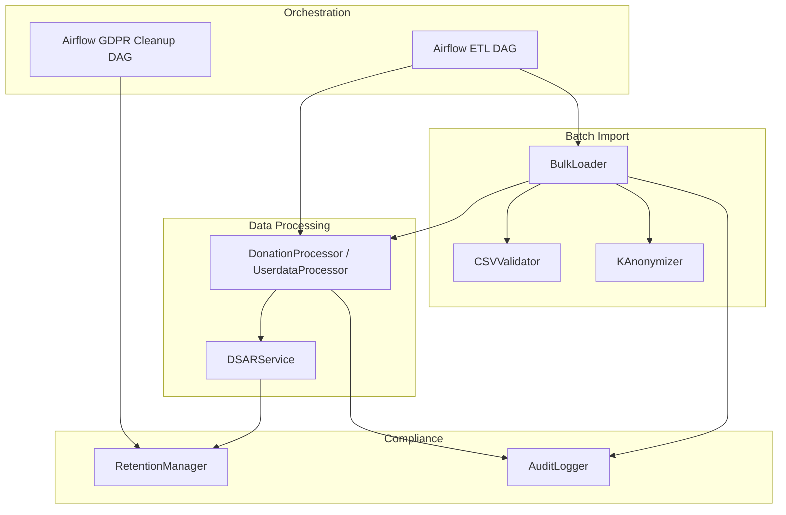
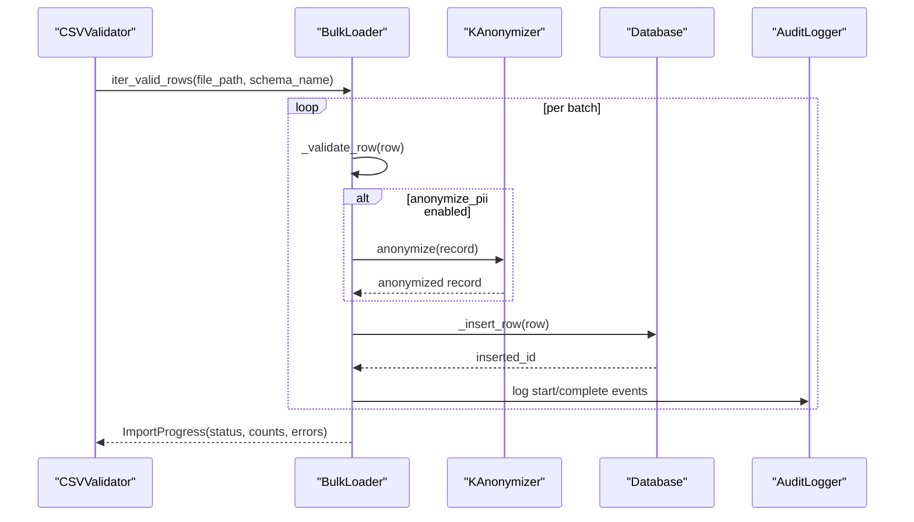
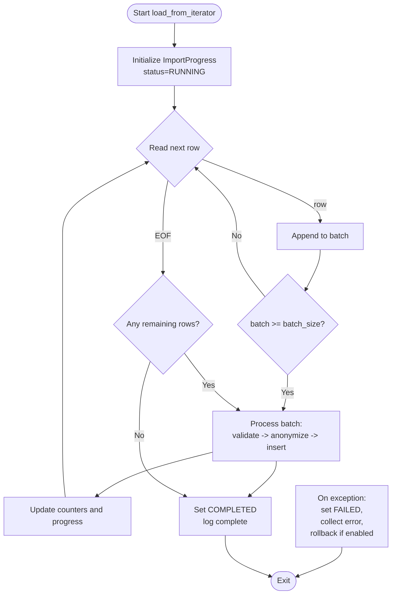
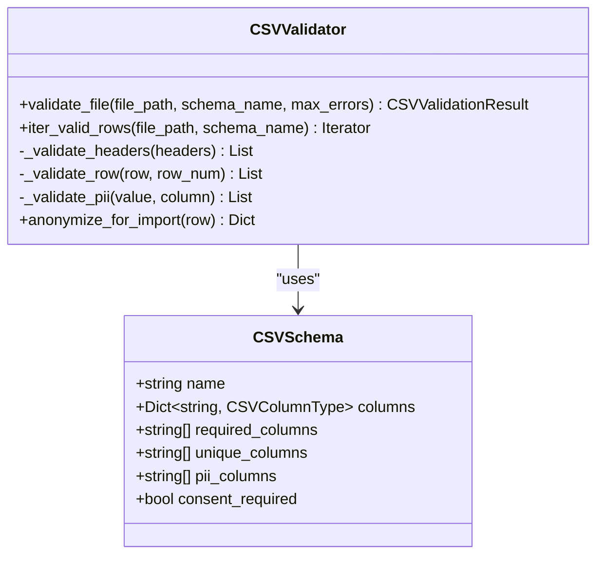
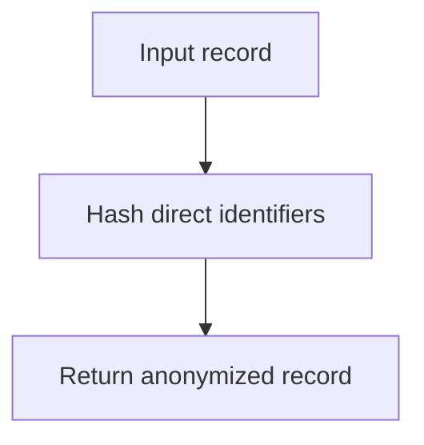
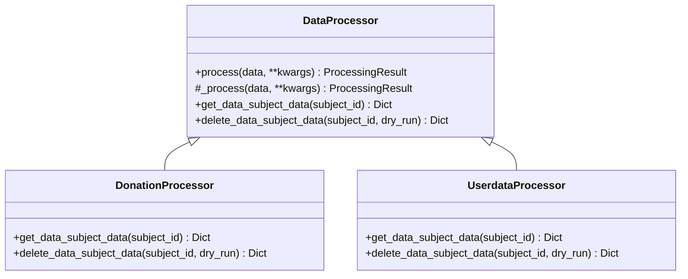
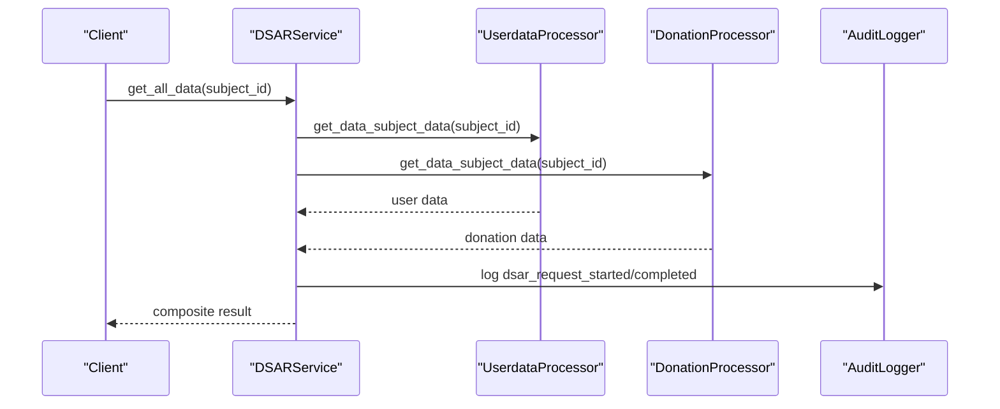
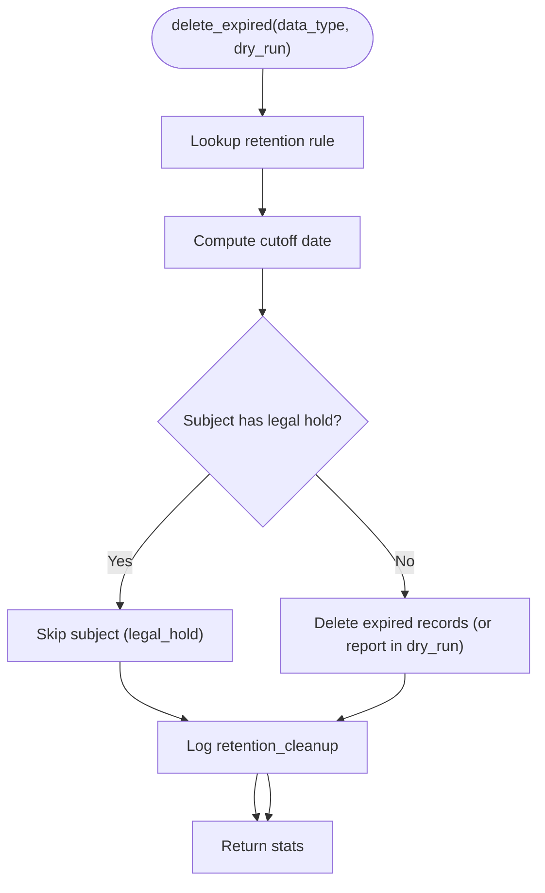
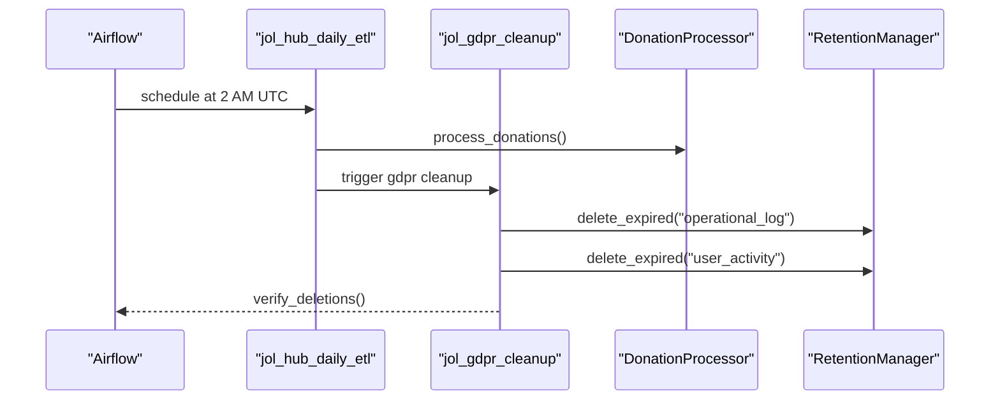
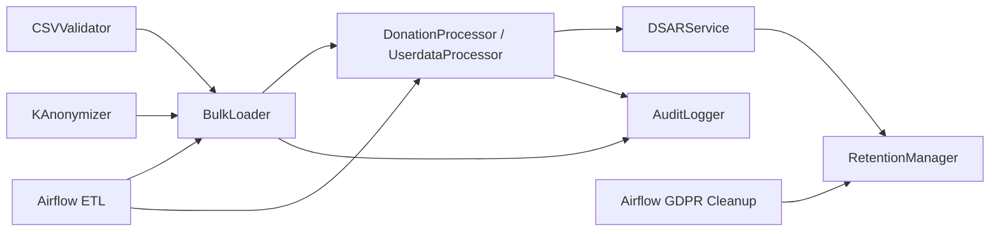

# Batch Processing Operations

<cite>
**Referenced Files in This Document**
- [bulk_loader.py](file://data/src/pipelines/entity_import/bulk_loader.py)
- [csv_validator.py](file://data/src/pipelines/entity_import/csv_validator.py)
- [anonymizer.py](file://data/src/gdpr/anonymizer.py)
- [processors.py](file://data/src/processors.py)
- [dsar_service.py](file://data/src/dsar_service.py)
- [validators.py](file://data/src/validators.py)
- [audit.py](file://data/src/audit.py)
- [retention_manager.py](file://data/src/gdpr/retention_manager.py)
- [config.py](file://data/src/config.py)
- [utils.py](file://data/src/utils.py)
- [jol_hub_etl.py](file://data/airflow/dags/jol_hub_etl.py)
- [jol_gdpr_cleanup.py](file://data/airflow/dags/jol_gdpr_cleanup.py)
- [sample_entities_lt.csv](file://data/sample_entities_lt.csv)
</cite>

## Table of Contents
1. [Introduction](#introduction)
2. [Project Structure](#project-structure)
3. [Core Components](#core-components)
4. [Architecture Overview](#architecture-overview)
5. [Detailed Component Analysis](#detailed-component-analysis)
6. [Dependency Analysis](#dependency-analysis)
7. [Performance Considerations](#performance-considerations)
8. [Troubleshooting Guide](#troubleshooting-guide)
9. [Conclusion](#conclusion)
10. [Appendices](#appendices)

## Introduction
This document explains how JOL-HUB performs batch processing for bulk entity imports, GDPR data anonymization, and large-scale data transformations. It covers chunked processing strategies, memory management, progress tracking for long-running operations, CSV/JSON processing, validation, error handling, performance optimization (parallelism, connection pooling, transactions), monitoring, partial failure handling, and rollback mechanisms.

## Project Structure
The batch processing capabilities are implemented primarily under the data module:
- Bulk import pipeline with chunking, validation, anonymization, and rollback
- GDPR anonymization and retention enforcement
- Data processors implementing DSAR (access/erasure/portability)
- Airflow DAGs orchestrating ETL and GDPR cleanup tasks
- Audit logging with integrity protection for compliance reporting

**Diagram sources**
- [bulk_loader.py:72-256](file://data/src/pipelines/entity_import/bulk_loader.py#L72-L256)
- [csv_validator.py:120-339](file://data/src/pipelines/entity_import/csv_validator.py#L120-L339)
- [anonymizer.py:106-180](file://data/src/gdpr/anonymizer.py#L106-L180)
- [processors.py:94-197](file://data/src/processors.py#L94-L197)
- [dsar_service.py:59-157](file://data/src/dsar_service.py#L59-L157)
- [retention_manager.py:188-336](file://data/src/gdpr/retention_manager.py#L188-L336)
- [audit.py:205-369](file://data/src/audit.py#L205-L369)
- [jol_hub_etl.py:73-113](file://data/airflow/dags/jol_hub_etl.py#L73-L113)
- [jol_gdpr_cleanup.py:36-67](file://data/airflow/dags/jol_gdpr_cleanup.py#L36-L67)

**Section sources**
- [bulk_loader.py:72-256](file://data/src/pipelines/entity_import/bulk_loader.py#L72-L256)
- [csv_validator.py:120-339](file://data/src/pipelines/entity_import/csv_validator.py#L120-L339)
- [processors.py:94-197](file://data/src/processors.py#L94-L197)
- [dsar_service.py:59-157](file://data/src/dsar_service.py#L59-L157)
- [retention_manager.py:188-336](file://data/src/gdpr/retention_manager.py#L188-L336)
- [audit.py:205-369](file://data/src/audit.py#L205-L369)
- [jol_hub_etl.py:73-113](file://data/airflow/dags/jol_hub_etl.py#L73-L113)
- [jol_gdpr_cleanup.py:36-67](file://data/airflow/dags/jol_gdpr_cleanup.py#L36-L67)

## Core Components
- BulkLoader: Chunked ingestion with configurable batch size, progress tracking, optional PII anonymization, audit logging, and rollback on failure.
- CSVValidator: Schema-based validation for CSV imports, consent checks, PII detection, and encryption guidance.
- KAnonymizer: Country-aware k-anonymity thresholds and hashing of direct identifiers for anonymization.
- DataProcessors: Donation and user data processors with DSAR support (access, erasure, portability).
- DSARService: Orchestrates cross-entity DSAR requests and exports.
- RetentionManager: Enforces retention policies and legal holds before deletion.
- AuditLogger: Immutable, signed audit log chain for compliance and forensics.
- Airflow DAGs: Orchestrate daily ETL and GDPR cleanup tasks.

**Section sources**
- [bulk_loader.py:24-256](file://data/src/pipelines/entity_import/bulk_loader.py#L24-L256)
- [csv_validator.py:27-117](file://data/src/pipelines/entity_import/csv_validator.py#L27-L117)
- [anonymizer.py:25-180](file://data/src/gdpr/anonymizer.py#L25-L180)
- [processors.py:94-197](file://data/src/processors.py#L94-L197)
- [dsar_service.py:59-157](file://data/src/dsar_service.py#L59-L157)
- [retention_manager.py:188-336](file://data/src/gdpr/retention_manager.py#L188-L336)
- [audit.py:205-369](file://data/src/audit.py#L205-L369)
- [jol_hub_etl.py:73-113](file://data/airflow/dags/jol_hub_etl.py#L73-L113)
- [jol_gdpr_cleanup.py:36-67](file://data/airflow/dags/jol_gdpr_cleanup.py#L36-L67)

## Architecture Overview
End-to-end flow for a typical batch import:
- Ingest CSV via CSVValidator to validate schema, required fields, consent, and PII rules.
- Stream rows into BulkLoader which chunks them by configured batch_size.
- For each row: validate, optionally anonymize PII, insert into storage, track progress, and audit.
- On failure: stop behavior depends on configuration; optional rollback deletes previously inserted records.
- Long-running jobs expose progress via callback or structured logs; Airflow DAGs can schedule and monitor these jobs.

**Diagram sources**
- [csv_validator.py:320-339](file://data/src/pipelines/entity_import/csv_validator.py#L320-L339)
- [bulk_loader.py:96-151](file://data/src/pipelines/entity_import/bulk_loader.py#L96-L151)
- [anonymizer.py:112-121](file://data/src/gdpr/anonymizer.py#L112-L121)
- [audit.py:330-369](file://data/src/audit.py#L330-L369)

## Detailed Component Analysis

### Bulk Loader (Chunked Processing, Progress, Rollback)
- Chunking: Processes rows in batches defined by ImportConfig.batch_size to control memory usage and optimize throughput.
- Progress tracking: ImportProgress tracks total, processed, successful, failed rows, timestamps, status, and errors; supports percentage and duration metrics.
- Validation and Anonymization: Optional per-row validation and PII anonymization before insertion.
- Error Handling: Configurable stop_on_error and max_errors; collects errors and can halt early.
- Rollback: Maintains imported IDs and deletes them on failure if enable_rollback is set.
- Audit: Logs start and completion events with metadata.

**Diagram sources**
- [bulk_loader.py:96-151](file://data/src/pipelines/entity_import/bulk_loader.py#L96-L151)
- [bulk_loader.py:160-229](file://data/src/pipelines/entity_import/bulk_loader.py#L160-L229)

**Section sources**
- [bulk_loader.py:24-256](file://data/src/pipelines/entity_import/bulk_loader.py#L24-L256)

### CSV Validator (Schema, Consent, PII)
- Schemas: Predefined schemas for parish, donation, priest define column types, required columns, unique keys, and PII fields.
- Validation: Checks headers, required fields, consent presence, and PII format rules; limits collected errors per run.
- Streaming: Provides an iterator over valid rows to avoid loading entire files into memory.
- Encryption Guidance: Marks PII fields for encryption prior to import using configured encryption utilities.

**Diagram sources**
- [csv_validator.py:36-117](file://data/src/pipelines/entity_import/csv_validator.py#L36-L117)
- [csv_validator.py:120-339](file://data/src/pipelines/entity_import/csv_validator.py#L120-L339)

**Section sources**
- [csv_validator.py:27-117](file://data/src/pipelines/entity_import/csv_validator.py#L27-L117)
- [csv_validator.py:120-339](file://data/src/pipelines/entity_import/csv_validator.py#L120-L339)

### GDPR Anonymization (K-Anonymity)
- Country-specific k values: Defaults vary by country code; environment override supported.
- Anonymization: Hashes direct identifiers (name, email, donor_id, phone) to pseudonyms.
- Utility: Provides batch anonymization helper and k-anonymity checks.

**Diagram sources**
- [anonymizer.py:106-121](file://data/src/gdpr/anonymizer.py#L106-L121)
- [anonymizer.py:160-180](file://data/src/gdpr/anonymizer.py#L160-L180)

**Section sources**
- [anonymizer.py:25-180](file://data/src/gdpr/anonymizer.py#L25-L180)

### Data Processors (DSAR Support)
- Base processor: Wraps processing with pre/post hooks, audit logging, and standardized results.
- DonationProcessor: Validates donations, transforms, stores, and supports DSAR access and erasure with retention-aware logic.
- UserdataProcessor: Validates users, applies privacy rules, masks sensitive fields, and supports DSAR access and erasure.

**Diagram sources**
- [processors.py:94-197](file://data/src/processors.py#L94-L197)
- [processors.py:223-503](file://data/src/processors.py#L223-L503)
- [processors.py:506-762](file://data/src/processors.py#L506-L762)

**Section sources**
- [processors.py:94-197](file://data/src/processors.py#L94-L197)
- [processors.py:223-503](file://data/src/processors.py#L223-L503)
- [processors.py:506-762](file://data/src/processors.py#L506-L762)

### DSAR Service (Cross-Entity Requests)
- Aggregates data from multiple processors for access requests and coordinates erasure across entities.
- Audits all steps and returns structured results including totals and export formats.

**Diagram sources**
- [dsar_service.py:88-157](file://data/src/dsar_service.py#L88-L157)
- [audit.py:330-369](file://data/src/audit.py#L330-L369)

**Section sources**
- [dsar_service.py:59-157](file://data/src/dsar_service.py#L59-L157)

### Retention Manager (Legal Holds and Deletion)
- Enforces retention periods per data type and blocks deletions when legal holds are active.
- Provides dry-run capability and detailed stats for audits.

**Diagram sources**
- [retention_manager.py:206-246](file://data/src/gdpr/retention_manager.py#L206-L246)
- [retention_manager.py:257-317](file://data/src/gdpr/retention_manager.py#L257-L317)

**Section sources**
- [retention_manager.py:188-336](file://data/src/gdpr/retention_manager.py#L188-L336)

### Airflow Orchestration (ETL and GDPR Cleanup)
- Daily ETL DAG: Runs donation processing and data quality checks, followed by GDPR cleanup and compliance reporting.
- GDPR Cleanup DAG: Deletes expired operational logs and user activity, then verifies deletions.

**Diagram sources**
- [jol_hub_etl.py:73-113](file://data/airflow/dags/jol_hub_etl.py#L73-L113)
- [jol_gdpr_cleanup.py:36-67](file://data/airflow/dags/jol_gdpr_cleanup.py#L36-L67)

**Section sources**
- [jol_hub_etl.py:73-113](file://data/airflow/dags/jol_hub_etl.py#L73-L113)
- [jol_gdpr_cleanup.py:36-67](file://data/airflow/dags/jol_gdpr_cleanup.py#L36-L67)

## Dependency Analysis
Key dependencies and relationships:
- BulkLoader depends on CSVValidator for schema validation and streaming, and on KAnonymizer for PII anonymization.
- DataProcessors implement DSAR methods that query databases and apply retention rules via RetentionManager.
- DSARService composes multiple processors and centralizes audit logging.
- Airflow DAGs orchestrate calls to processors and retention manager.

**Diagram sources**
- [bulk_loader.py:72-256](file://data/src/pipelines/entity_import/bulk_loader.py#L72-L256)
- [csv_validator.py:120-339](file://data/src/pipelines/entity_import/csv_validator.py#L120-L339)
- [anonymizer.py:106-180](file://data/src/gdpr/anonymizer.py#L106-L180)
- [processors.py:94-197](file://data/src/processors.py#L94-L197)
- [dsar_service.py:59-157](file://data/src/dsar_service.py#L59-L157)
- [retention_manager.py:188-336](file://data/src/gdpr/retention_manager.py#L188-L336)
- [audit.py:205-369](file://data/src/audit.py#L205-L369)
- [jol_hub_etl.py:73-113](file://data/airflow/dags/jol_hub_etl.py#L73-L113)
- [jol_gdpr_cleanup.py:36-67](file://data/airflow/dags/jol_gdpr_cleanup.py#L36-L67)

**Section sources**
- [bulk_loader.py:72-256](file://data/src/pipelines/entity_import/bulk_loader.py#L72-L256)
- [csv_validator.py:120-339](file://data/src/pipelines/entity_import/csv_validator.py#L120-L339)
- [processors.py:94-197](file://data/src/processors.py#L94-L197)
- [dsar_service.py:59-157](file://data/src/dsar_service.py#L59-L157)
- [retention_manager.py:188-336](file://data/src/gdpr/retention_manager.py#L188-L336)
- [audit.py:205-369](file://data/src/audit.py#L205-L369)
- [jol_hub_etl.py:73-113](file://data/airflow/dags/jol_hub_etl.py#L73-L113)
- [jol_gdpr_cleanup.py:36-67](file://data/airflow/dags/jol_gdpr_cleanup.py#L36-L67)

## Performance Considerations
- Chunked processing: Use ImportConfig.batch_size to balance memory usage and throughput; default is small enough for safe streaming but can be tuned based on workload.
- Memory management: Prefer CSVValidator.iter_valid_rows to stream rows instead of loading entire files; BulkLoader processes batches incrementally.
- Parallel processing: Airflow TaskGroups allow parallel execution of independent tasks (e.g., processing vs. validation vs. cleanup); ensure idempotency and isolation.
- Database connections: The current implementation opens connections per operation; consider connection pooling at the application layer to reduce overhead for high-throughput scenarios.
- Transactions: Implement atomic batch commits around inserts to ensure consistency; use savepoints for partial failures within a batch where supported by the database.
- Monitoring: Leverage AuditLogger for structured event logs and generate compliance reports; integrate with Airflow UI for job-level progress and metrics.

[No sources needed since this section provides general guidance]

## Troubleshooting Guide
Common issues and resolutions:
- Validation failures: CSVValidator reports missing required fields, invalid PII formats, or absent consent; adjust input files or schema accordingly.
- Excessive errors: BulkLoader stops after max_errors; review error lists in ImportProgress and fix upstream data quality issues.
- Partial failures: Configure stop_on_error to control whether processing halts immediately; collect and handle errors gracefully.
- Rollback not applied: Ensure enable_rollback is true; verify that _delete_row is implemented for your storage backend.
- Legal holds blocking deletion: RetentionManager will block erasure if active legal holds exist; lift holds or exclude subjects from deletion runs.
- Audit integrity: Use AuditLogger.verify_chain to detect tampering or chain breaks in audit logs.

**Section sources**
- [csv_validator.py:135-210](file://data/src/pipelines/entity_import/csv_validator.py#L135-L210)
- [bulk_loader.py:160-229](file://data/src/pipelines/entity_import/bulk_loader.py#L160-L229)
- [retention_manager.py:257-317](file://data/src/gdpr/retention_manager.py#L257-L317)
- [audit.py:513-589](file://data/src/audit.py#L513-L589)

## Conclusion
JOL-HUB’s batch processing stack provides robust, GDPR-compliant tools for bulk imports, anonymization, and large-scale transformations. With chunked processing, streaming validation, progress tracking, audit logging, and retention enforcement, it supports reliable, observable, and compliant operations. Airflow DAGs enable scheduled orchestration, while DSAR services ensure data subject rights are honored across entities.

[No sources needed since this section summarizes without analyzing specific files]

## Appendices

### Example: CSV File Processing Workflow
- Prepare CSV with required columns and consent fields per schema.
- Validate using CSVValidator.validate_file or iterate via iter_valid_rows.
- Feed valid rows into BulkLoader.load_from_iterator for chunked processing.
- Monitor progress via ImportProgress and audit logs.

**Section sources**
- [csv_validator.py:135-210](file://data/src/pipelines/entity_import/csv_validator.py#L135-L210)
- [csv_validator.py:320-339](file://data/src/pipelines/entity_import/csv_validator.py#L320-L339)
- [bulk_loader.py:96-151](file://data/src/pipelines/entity_import/bulk_loader.py#L96-L151)
- [sample_entities_lt.csv:1-5](file://data/sample_entities_lt.csv#L1-L5)

### Example: JSON Export for Data Portability
- Use DSARService.export_to_json to retrieve and serialize all personal data for a subject in JSON format.

**Section sources**
- [dsar_service.py:269-289](file://data/src/dsar_service.py#L269-L289)

### Configuration and Utilities
- DataModuleConfig defines defaults for processing limits and retention.
- Utils provide masking functions and retention helpers.

**Section sources**
- [config.py:55-82](file://data/src/config.py#L55-L82)
- [utils.py:52-80](file://data/src/utils.py#L52-L80)
- [utils.py:83-103](file://data/src/utils.py#L83-L103)