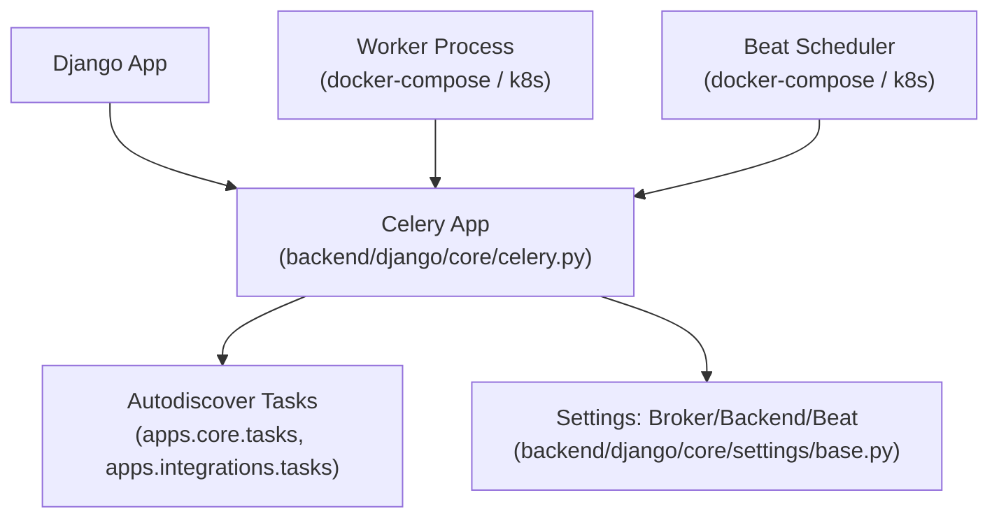
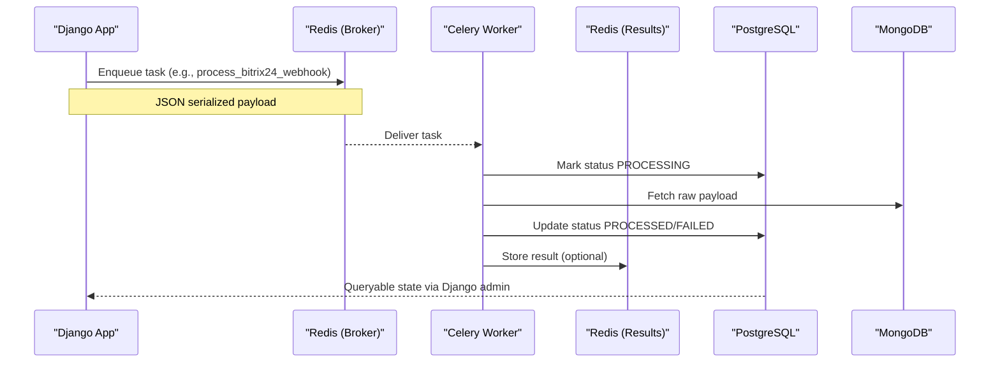
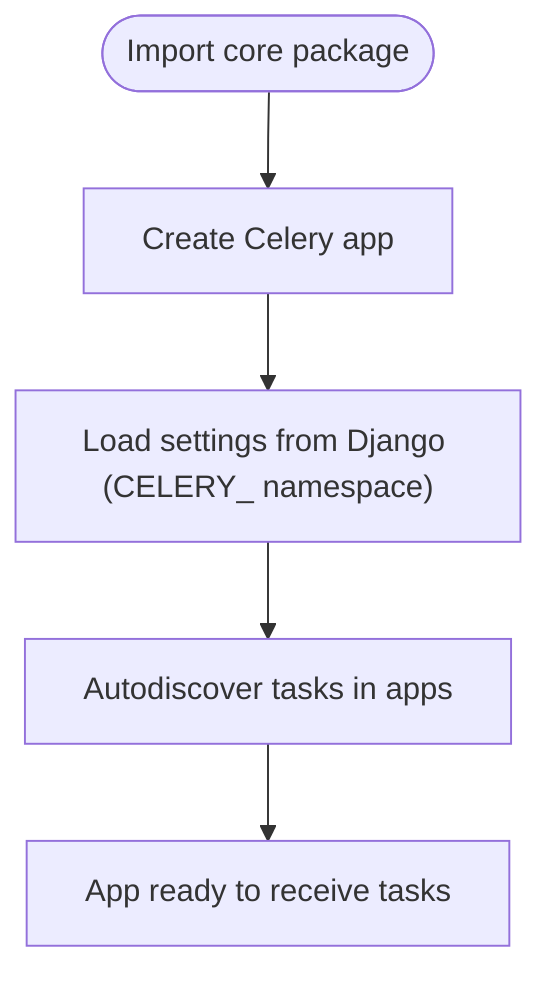
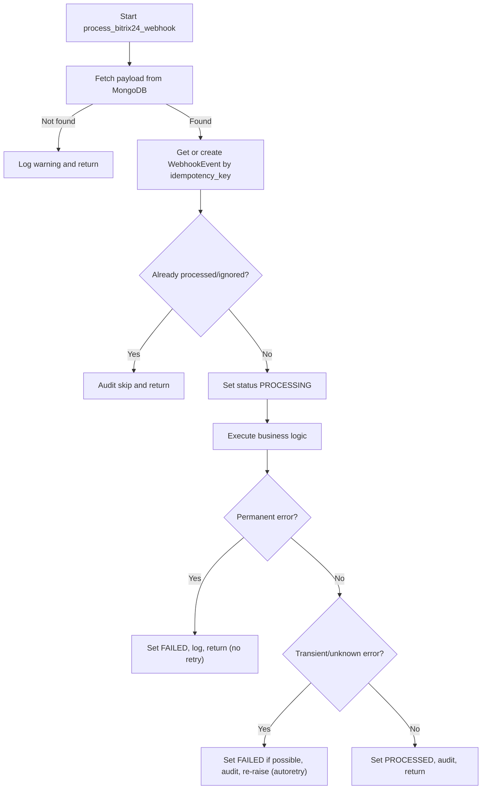
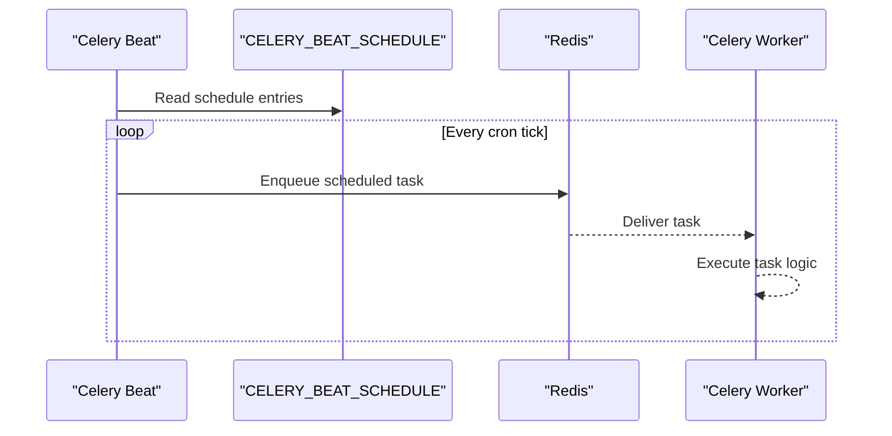
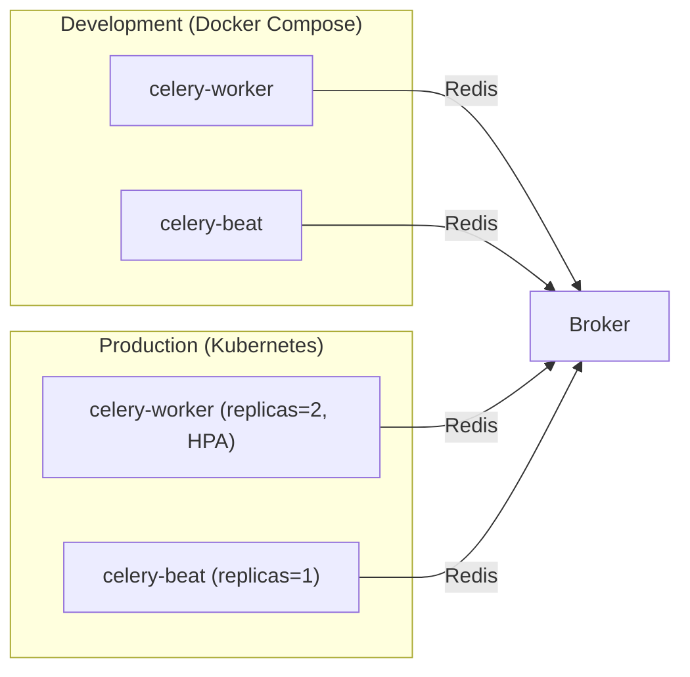
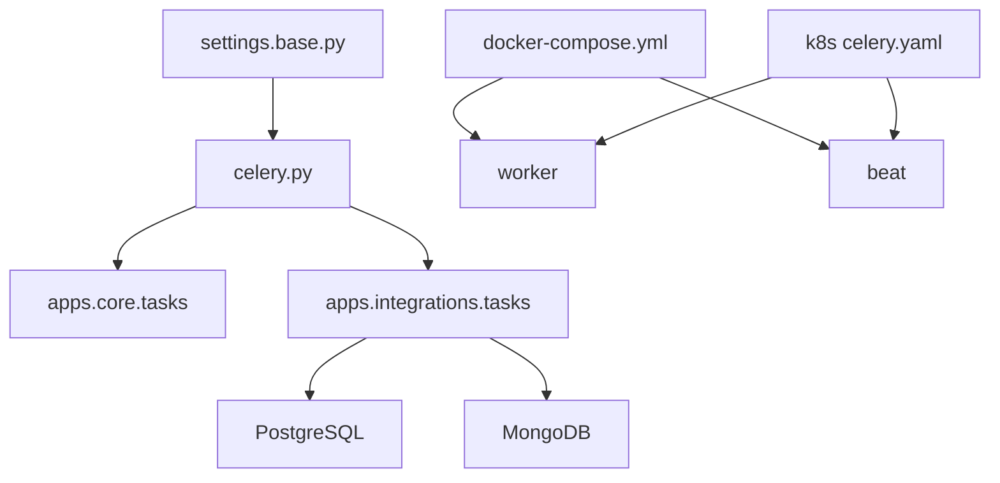

# Celery Task Queue

<cite>
**Referenced Files in This Document**
- [celery.py](file://backend/django/core/celery.py)
- [__init__.py](file://backend/django/core/__init__.py)
- [base.py](file://backend/django/core/settings/base.py)
- [tasks.py](file://backend/django/apps/core/tasks.py)
- [integrations_tasks.py](file://backend/django/apps/integrations/tasks.py)
- [docker-compose.yml](file://docker-compose.yml)
- [celery_k8s.yaml](file://infra/kubernetes/apps/celery.yaml)
</cite>

## Table of Contents
1. [Introduction](#introduction)
2. [Project Structure](#project-structure)
3. [Core Components](#core-components)
4. [Architecture Overview](#architecture-overview)
5. [Detailed Component Analysis](#detailed-component-analysis)
6. [Dependency Analysis](#dependency-analysis)
7. [Performance Considerations](#performance-considerations)
8. [Troubleshooting Guide](#troubleshooting-guide)
9. [Conclusion](#conclusion)
10. [Appendices](#appendices)

## Introduction
This document explains the Celery task queue implementation in JOL-HUB. It covers how tasks are defined and registered, naming conventions, execution flow, worker and scheduler configuration, result handling, retries, monitoring via Django admin and Celery Flower, prioritization strategies, and troubleshooting for common issues such as connectivity, timeouts, and memory leaks.

## Project Structure
Celery is initialized in a dedicated module and imported by Django so workers start correctly. Tasks live in app-specific modules and are auto-discovered. Configuration is centralized in Django settings under the CELERY_ namespace. Workers and beat run as separate processes in both Docker Compose (development) and Kubernetes (production).

**Diagram sources**
- [celery.py:1-32](file://backend/django/core/celery.py#L1-L32)
- [base.py:361-386](file://backend/django/core/settings/base.py#L361-L386)
- [docker-compose.yml:104-148](file://docker-compose.yml#L104-L148)
- [celery_k8s.yaml:30-106](file://infra/kubernetes/apps/celery.yaml#L30-L106)

**Section sources**
- [celery.py:1-32](file://backend/django/core/celery.py#L1-L32)
- [__init__.py:1-9](file://backend/django/core/__init__.py#L1-L9)
- [base.py:361-386](file://backend/django/core/settings/base.py#L361-L386)
- [docker-compose.yml:104-148](file://docker-compose.yml#L104-L148)
- [celery_k8s.yaml:30-106](file://infra/kubernetes/apps/celery.yaml#L30-L106)

## Core Components
- Celery application initialization and autodiscovery
- Task definitions using shared_task with explicit names
- Centralized configuration via Django settings
- Worker and Beat deployments in development and production environments

Key responsibilities:
- celery.py: Create the Celery app, load settings from Django, enable autodiscovery, and provide a debug task.
- __init__.py: Ensure the Celery app is loaded when Django starts.
- base.py: Define broker, result backend, serializers, time limits, concurrency, prefetch multiplier, and scheduled tasks.
- tasks.py: Provide core housekeeping tasks (e.g., session cleanup).
- integrations_tasks.py: Implement webhook processing tasks with robust retry and error handling.

**Section sources**
- [celery.py:1-32](file://backend/django/core/celery.py#L1-L32)
- [__init__.py:1-9](file://backend/django/core/__init__.py#L1-L9)
- [base.py:361-386](file://backend/django/core/settings/base.py#L361-L386)
- [tasks.py:1-25](file://backend/django/apps/core/tasks.py#L1-L25)
- [integrations_tasks.py:1-132](file://backend/django/apps/integrations/tasks.py#L1-L132)

## Architecture Overview
The system uses Redis as both broker and result backend. Django views or management commands enqueue tasks; Celery workers consume them and execute business logic. Celery Beat schedules periodic tasks. Results are stored in Redis and can be inspected via Django admin or Flower.

**Diagram sources**
- [integrations_tasks.py:101-294](file://backend/django/apps/integrations/tasks.py#L101-L294)
- [base.py:361-368](file://backend/django/core/settings/base.py#L361-L368)

## Detailed Component Analysis

### Celery Application Initialization
- The Celery app is created and configured to read settings from Django using the CELERY_ namespace.
- Autodiscovery scans installed apps for tasks modules.
- A debug task is provided for quick verification.

**Diagram sources**
- [celery.py:14-25](file://backend/django/core/celery.py#L14-L25)
- [__init__.py:3-8](file://backend/django/core/__init__.py#L3-L8)

**Section sources**
- [celery.py:14-32](file://backend/django/core/celery.py#L14-L32)
- [__init__.py:3-8](file://backend/django/core/__init__.py#L3-L8)

### Task Registration Patterns and Naming Conventions
- Tasks are defined with shared_task and an explicit name following the pattern <app>.<module>.<function>.
- Examples:
  - apps.core.tasks.cleanup_sessions
  - apps.core.tasks.test_task
  - apps.integrations.tasks.process_paypal_webhook
  - apps.integrations.tasks.process_bitrix24_webhook
  - apps.integrations.tasks.process_bitrix24_retry_queue

Benefits:
- Stable task names across deployments
- Clear routing and grouping
- Easy monitoring and filtering in Flower/admin

**Section sources**
- [tasks.py:9-24](file://backend/django/apps/core/tasks.py#L9-L24)
- [integrations_tasks.py:81-100](file://backend/django/apps/integrations/tasks.py#L81-L100)
- [integrations_tasks.py:644-667](file://backend/django/apps/integrations/tasks.py#L644-L667)

### Task Execution Flow: Bitrix24 Webhook Processing
- Idempotency key prevents double-processing.
- Status transitions: not found → skipped, otherwise PROCESSING → PROCESSED or FAILED.
- Permanent errors do not retry; transient errors trigger autoretry with exponential backoff and jitter.
- Audit logs capture state changes without PII.

**Diagram sources**
- [integrations_tasks.py:101-294](file://backend/django/apps/integrations/tasks.py#L101-L294)

**Section sources**
- [integrations_tasks.py:101-294](file://backend/django/apps/integrations/tasks.py#L101-L294)

### Scheduled Tasks (Celery Beat)
- Periodic tasks are defined in settings and executed by Celery Beat using the database-backed scheduler.
- Examples include daily digest, session cleanup, and recurring donations processing.

**Diagram sources**
- [base.py:372-386](file://backend/django/core/settings/base.py#L372-L386)

**Section sources**
- [base.py:372-386](file://backend/django/core/settings/base.py#L372-L386)

### Worker and Scheduler Deployment
- Development: Docker Compose runs a worker and beat alongside the Django app and services.
- Production: Kubernetes Deployments run worker(s) and beat with resource requests/limits and autoscaling.

**Diagram sources**
- [docker-compose.yml:104-148](file://docker-compose.yml#L104-L148)
- [celery_k8s.yaml:30-106](file://infra/kubernetes/apps/celery.yaml#L30-L106)

**Section sources**
- [docker-compose.yml:104-148](file://docker-compose.yml#L104-L148)
- [celery_k8s.yaml:30-106](file://infra/kubernetes/apps/celery.yaml#L30-L106)

### Result Handling
- Results are serialized to JSON and stored in the configured result backend (Redis).
- Use django-celery-results to expose results in Django admin for inspection.
- For fire-and-forget tasks, set ignore_result=True where appropriate.

**Section sources**
- [base.py:361-368](file://backend/django/core/settings/base.py#L361-L368)
- [celery.py:28-31](file://backend/django/core/celery.py#L28-L31)

### Task Chaining and Grouping
- While no explicit chains are present in the analyzed files, Celery supports chaining and grouping via .chain() and .group().
- Recommended pattern: define small, focused tasks and compose them at call sites to build pipelines (e.g., validate → transform → persist → notify).

[No sources needed since this section provides general guidance]

### Monitoring Approaches
- Django Admin: Inspect queued jobs and results via django-celery-results.
- Celery Flower: Visualize queues, workers, tasks, and metrics. Configure authentication and secure access in production.
- Logging: Structured logging and AUDIT records help track state transitions and errors.

[No sources needed since this section provides general guidance]

### Prioritization Strategies
- Prefetch multiplier is set to 1 to reduce pre-fetching overhead and improve fairness.
- To implement priority queues, use multiple queues (e.g., high, default, low) and route tasks accordingly.
- Consider rate limiting for CPU-bound tasks to protect resources.

**Section sources**
- [base.py:369-370](file://backend/django/core/settings/base.py#L369-L370)

### Retry Mechanisms and Dead Letter Management
- Autoretry with exponential backoff and jitter is enabled for transient infrastructure errors.
- Permanent data errors are marked FAILED without retry.
- A retry queue task periodically reschedules failed events within a time window.
- For dead letter handling, consider configuring a dead-letter exchange or a dedicated DLQ queue and a consumer that archives or alerts on unprocessable messages.

**Section sources**
- [integrations_tasks.py:93-100](file://backend/django/apps/integrations/tasks.py#L93-L100)
- [integrations_tasks.py:240-294](file://backend/django/apps/integrations/tasks.py#L240-L294)
- [integrations_tasks.py:644-667](file://backend/django/apps/integrations/tasks.py#L644-L667)

## Dependency Analysis
- Celery app depends on Django settings for broker, backend, and scheduling.
- Tasks depend on Django ORM models and external stores (PostgreSQL, MongoDB).
- Deployment manifests inject environment variables for broker/backend URLs and database credentials.

**Diagram sources**
- [base.py:361-386](file://backend/django/core/settings/base.py#L361-L386)
- [celery.py:14-25](file://backend/django/core/celery.py#L14-L25)
- [integrations_tasks.py:101-294](file://backend/django/apps/integrations/tasks.py#L101-L294)
- [docker-compose.yml:104-148](file://docker-compose.yml#L104-L148)
- [celery_k8s.yaml:30-106](file://infra/kubernetes/apps/celery.yaml#L30-L106)

**Section sources**
- [base.py:361-386](file://backend/django/core/settings/base.py#L361-L386)
- [celery.py:14-25](file://backend/django/core/celery.py#L14-L25)
- [integrations_tasks.py:101-294](file://backend/django/apps/integrations/tasks.py#L101-L294)
- [docker-compose.yml:104-148](file://docker-compose.yml#L104-L148)
- [celery_k8s.yaml:30-106](file://infra/kubernetes/apps/celery.yaml#L30-L106)

## Performance Considerations
- Time limit: 30 minutes per task to prevent long-running tasks from blocking workers.
- Concurrency: 4 workers per process; tune based on CPU and I/O characteristics.
- Prefetch multiplier: 1 to avoid worker starvation and improve responsiveness.
- Serialization: JSON for interoperability and smaller payloads.
- Autoscaling: HorizontalPodAutoscaler scales workers based on CPU utilization.

**Section sources**
- [base.py:367-370](file://backend/django/core/settings/base.py#L367-L370)
- [celery_k8s.yaml:108-130](file://infra/kubernetes/apps/celery.yaml#L108-L130)

## Troubleshooting Guide
Common issues and resolutions:
- Worker cannot connect to broker/backend:
  - Verify CELERY_BROKER_URL and CELERY_RESULT_BACKEND in environment and deployment manifests.
  - Check network policies and service endpoints for Redis.
- Task timeouts:
  - Review CELERY_TASK_TIME_LIMIT and adjust if necessary.
  - Identify slow operations and optimize or split into smaller tasks.
- Memory leaks:
  - Monitor worker memory usage; consider periodic restarts or tuning worker max-tasks-per-child.
  - Avoid holding large objects in memory; stream data where possible.
- Stuck or failed tasks:
  - Inspect Django admin for task results and statuses.
  - Use Flower to view queue lengths and worker health.
  - For permanent failures, review audit logs and error fields on tracking records.
- Excessive retries:
  - Confirm autoretry_for lists only transient exceptions.
  - Ensure permanent errors are caught and marked FAILED without re-raising.

**Section sources**
- [base.py:361-368](file://backend/django/core/settings/base.py#L361-L368)
- [celery_k8s.yaml:30-106](file://infra/kubernetes/apps/celery.yaml#L30-L106)
- [integrations_tasks.py:240-294](file://backend/django/apps/integrations/tasks.py#L240-L294)

## Conclusion
JOL-HUB’s Celery setup follows best practices: centralized configuration, explicit task naming, robust retry and error handling, scheduled tasks via Beat, and clear separation between worker and scheduler processes. Monitoring through Django admin and Flower, combined with structured logging and audit trails, provides visibility into task lifecycle and outcomes. Scaling is supported via Kubernetes HPA, and performance is tuned with sensible defaults for concurrency, prefetch, and time limits.

## Appendices

### Example: Background Job Creation
- Enqueue a task from Django code using .delay() or .apply_async() with optional queue/routing.
- For immediate execution in tests, set CELERY_TASK_ALWAYS_EAGER=True.

[No sources needed since this section provides general guidance]

### Example: Task Chaining
- Compose tasks using .chain() to build pipelines (e.g., validate → transform → persist → notify).
- Use groups for parallel branches and chain them together.

[No sources needed since this section provides general guidance]

### Example: Error Handling Pattern
- Distinguish transient vs permanent errors.
- Mark failures in persistent storage and log structured audit entries.
- Re-raise transient errors to trigger autoretry; swallow permanent errors after marking failure.

**Section sources**
- [integrations_tasks.py:93-100](file://backend/django/apps/integrations/tasks.py#L93-L100)
- [integrations_tasks.py:240-294](file://backend/django/apps/integrations/tasks.py#L240-L294)