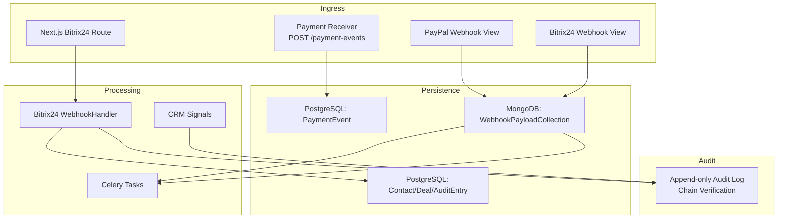
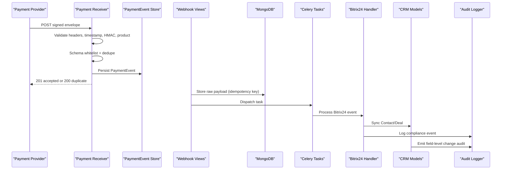
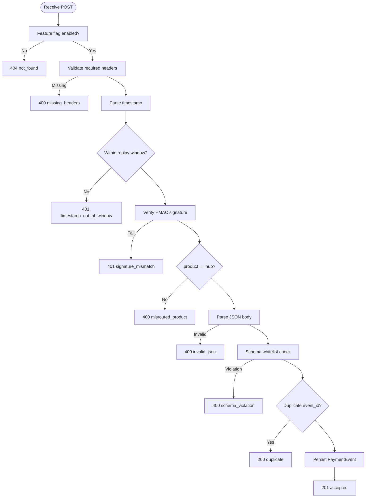
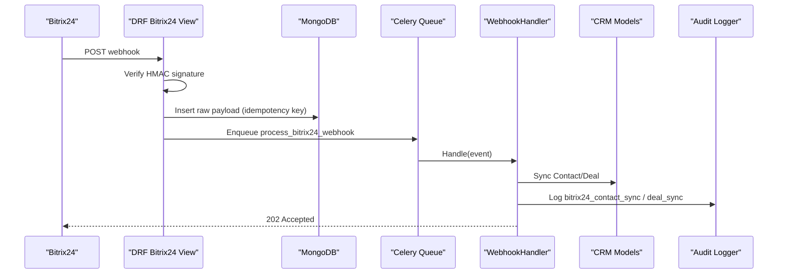
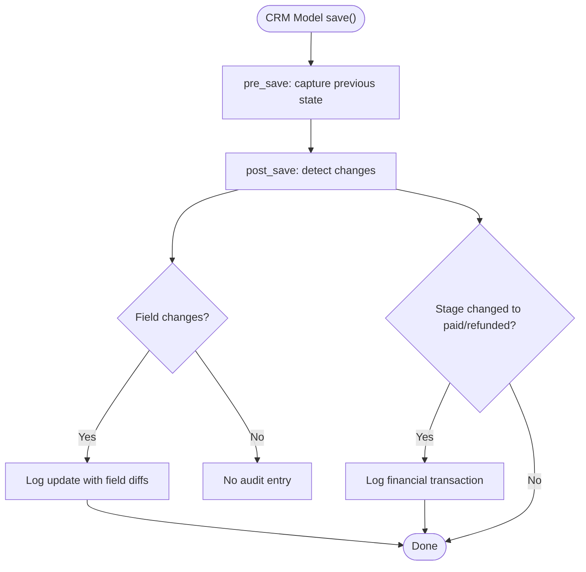
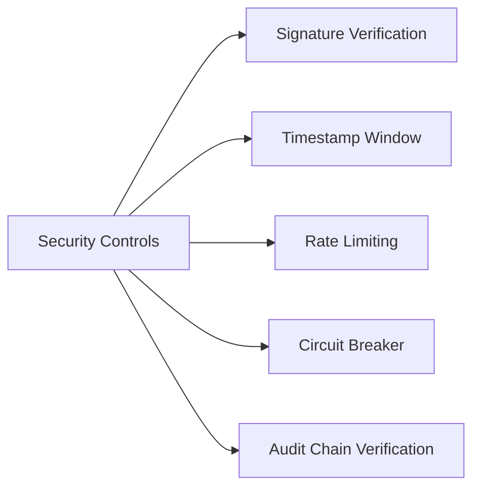
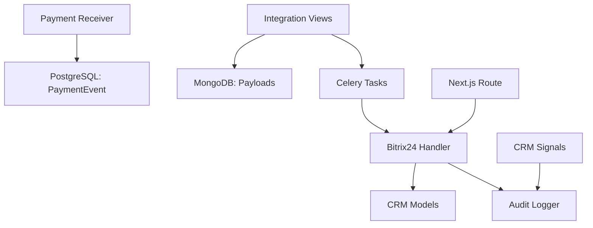

# Event-Driven Processing

<cite>
**Referenced Files in This Document**
- [views.py](file://backend/django/apps/payment_events/views.py)
- [models.py](file://backend/django/apps/payment_events/models.py)
- [views.py](file://backend/django/apps/integrations/views.py)
- [models.py](file://backend/django/apps/integrations/models.py)
- [handlers.py](file://backend/integrations/bitrix24/webhooks/handlers.py)
- [models.py](file://backend/django/apps/crm/models.py)
- [signals.py](file://backend/django/apps/crm/signals.py)
- [security.py](file://backend/django/apps/crm/security.py)
- [audit.py](file://data/src/audit.py)
- [route.ts](file://frontend/apps/admin-dashboard/src/app/api/bitrix24/webhook/route.ts)
- [rate-limit.ts](file://frontend/apps/template-renderer/src/lib/rate-limit.ts)
</cite>

## Table of Contents
1. Introduction
2. Project Structure
3. Core Components
4. Architecture Overview
5. Detailed Component Analysis
6. Dependency Analysis
7. Performance Considerations
8. Troubleshooting Guide
9. Conclusion
10. Appendices

## Introduction
This document explains the event-driven processing architecture in JOL-HUB with a focus on:
- Webhook handling for payment events, CRM webhooks (Bitrix24), and system events
- Event schema definitions, message routing, and persistence strategies
- Examples of payment event processing, user action tracking, and system state changes
- Event sourcing patterns, event versioning, and backward compatibility
- Security considerations for webhook validation, rate limiting, and replay capabilities
- Debugging tools and logging strategies for distributed event processing

The design emphasizes durable acceptance, idempotency, strict schema whitelisting, tamper-evident audit trails, and country-scoped routing to comply with GDPR Article 44 and SOC 2 controls.

## Project Structure
JOL-HUB implements event ingestion across multiple layers:
- Payment boundary: A dedicated receiver for signed marketplace payment events
- Integration layer: Generic webhook ingestion for PayPal and Bitrix24 with MongoDB storage and Celery tasks
- CRM layer: Django models and signals that persist CRM entities and emit audit events
- Frontend admin dashboard: Next.js route handlers for Bitrix24 webhooks with circuit breaker and retry queue
- Audit subsystem: Tamper-evident append-only audit log with chain verification

**Diagram sources**
- [views.py:79-143](file://backend/django/apps/payment_events/views.py#L79-L143)
- [views.py:30-51](file://backend/django/apps/integrations/views.py#L30-L51)
- [views.py:54-293](file://backend/django/apps/integrations/views.py#L54-L293)
- [handlers.py:486-513](file://backend/integrations/bitrix24/webhooks/handlers.py#L486-L513)
- [signals.py:117-240](file://backend/django/apps/crm/signals.py#L117-L240)
- [audit.py:350-369](file://data/src/audit.py#L350-L369)

**Section sources**
- [views.py:79-143](file://backend/django/apps/payment_events/views.py#L79-L143)
- [views.py:30-51](file://backend/django/apps/integrations/views.py#L30-L51)
- [views.py:54-293](file://backend/django/apps/integrations/views.py#L54-L293)
- [handlers.py:486-513](file://backend/integrations/bitrix24/webhooks/handlers.py#L486-L513)
- [signals.py:117-240](file://backend/django/apps/crm/signals.py#L117-L240)
- [audit.py:350-369](file://data/src/audit.py#L350-L369)

## Core Components
- Payment event receiver: Validates headers, timestamp window, HMAC signature, product routing, schema whitelist, deduplication, and durable persistence. It is feature-gated and test-mode only.
- Integration webhook views: Accept PayPal and Bitrix24 webhooks, verify signatures, compute idempotency keys, store raw payloads in MongoDB, and dispatch background tasks.
- Bitrix24 webhook handler: Routes events to typed handlers (contacts, deals, calendar), performs async syncs into CRM, and logs compliance events.
- CRM models and signals: Persist contacts/deals with tenant isolation and data classification; emit field-level change audits and financial transaction events.
- Audit logger: Append-only tamper-evident log with sequence numbers, hash chains, and verification utilities.

**Section sources**
- [views.py:79-143](file://backend/django/apps/payment_events/views.py#L79-L143)
- [models.py:6-35](file://backend/django/apps/payment_events/models.py#L6-L35)
- [views.py:30-51](file://backend/django/apps/integrations/views.py#L30-L51)
- [views.py:54-293](file://backend/django/apps/integrations/views.py#L54-L293)
- [handlers.py:63-152](file://backend/integrations/bitrix24/webhooks/handlers.py#L63-L152)
- [models.py:255-771](file://backend/django/apps/crm/models.py#L255-L771)
- [signals.py:117-240](file://backend/django/apps/crm/signals.py#L117-L240)
- [audit.py:350-369](file://data/src/audit.py#L350-L369)

## Architecture Overview
The system follows an event-sourcing-inspired pattern:
- Ingress endpoints accept external events and validate them strictly
- Events are persisted before any side effects (durable acceptance)
- Background workers process events asynchronously
- CRM state changes emit audit events forming a verifiable chain

**Diagram sources**
- [views.py:79-143](file://backend/django/apps/payment_events/views.py#L79-L143)
- [views.py:54-293](file://backend/django/apps/integrations/views.py#L54-L293)
- [handlers.py:129-152](file://backend/integrations/bitrix24/webhooks/handlers.py#L129-L152)
- [signals.py:117-240](file://backend/django/apps/crm/signals.py#L117-L240)
- [audit.py:350-369](file://data/src/audit.py#L350-L369)

## Detailed Component Analysis

### Payment Event Processing
- Validation pipeline:
  - Feature flag gating
  - Required headers: X-Product, X-JOL-Timestamp, X-JOL-Signature
  - Replay window enforcement
  - HMAC signature verification using delivery key
  - Product routing (hub only)
  - JSON parsing and schema whitelist validation
  - Idempotency via event_id
  - Durable persistence of minimal fields
- Response contract:
  - 201 accepted for new events
  - 200 duplicate no-op for known event_id
  - 4xx for client errors (no retry signal)
  - 5xx reserved for genuine unavailability

**Diagram sources**
- [views.py:79-143](file://backend/django/apps/payment_events/views.py#L79-L143)

**Section sources**
- [views.py:79-143](file://backend/django/apps/payment_events/views.py#L79-L143)
- [models.py:6-35](file://backend/django/apps/payment_events/models.py#L6-L35)

### CRM Webhooks (Bitrix24)
- Two ingestion paths:
  - Django DRF view: verifies HMAC, computes idempotency key, stores raw payload in MongoDB, queues Celery task
  - Next.js route: validates signature, applies circuit breaker, routes by event type, logs and queues retries
- Handler responsibilities:
  - Register handlers for contact/deal/calendar events
  - Validate application token and optional HMAC signature
  - Async sync to CRM models with tenant context and audit logging
  - Soft-delete semantics for deletions to preserve audit trail

**Diagram sources**
- [views.py:54-293](file://backend/django/apps/integrations/views.py#L54-L293)
- [handlers.py:129-152](file://backend/integrations/bitrix24/webhooks/handlers.py#L129-L152)
- [handlers.py:173-291](file://backend/integrations/bitrix24/webhooks/handlers.py#L173-L291)

**Section sources**
- [views.py:54-293](file://backend/django/apps/integrations/views.py#L54-L293)
- [handlers.py:63-152](file://backend/integrations/bitrix24/webhooks/handlers.py#L63-L152)
- [route.ts:400-458](file://frontend/apps/admin-dashboard/src/app/api/bitrix24/webhook/route.ts#L400-L458)

### System Events and User Action Tracking
- CRM signals capture create/update/delete operations on Contacts and Deals
- Field-level change detection records precise diffs
- Financial transitions (paid/refunded) are logged as special audit events
- Consent status changes are tracked with versioning

**Diagram sources**
- [signals.py:89-240](file://backend/django/apps/crm/signals.py#L89-L240)

**Section sources**
- [signals.py:89-240](file://backend/django/apps/crm/signals.py#L89-L240)
- [models.py:255-771](file://backend/django/apps/crm/models.py#L255-L771)

### Event Sourcing Patterns, Versioning, and Backward Compatibility
- Durable acceptance first: Payment events are persisted before downstream work; duplicates return idempotent success
- Schema whitelisting: Only allowed event types and required fields are accepted; extra fields are ignored but never stored
- Idempotency keys:
  - Payment events use sender-provided event_id
  - Bitrix24 uses structured key (domain, event, entity ID, timestamp) or SHA-256 of raw body
- Event versioning:
  - Allowed event types are explicitly enumerated per contract version
  - CRM consent_version tracks policy versions
- Backward compatibility:
  - Tolerant parsing ignores unknown fields
  - Feature flags gate new boundaries until approved

**Section sources**
- [views.py:28-76](file://backend/django/apps/payment_events/views.py#L28-L76)
- [views.py:79-143](file://backend/django/apps/payment_events/views.py#L79-L143)
- [models.py:6-35](file://backend/django/apps/payment_events/models.py#L6-L35)
- [views.py:150-177](file://backend/django/apps/integrations/views.py#L150-L177)
- [models.py:131-152](file://backend/django/apps/crm/models.py#L131-L152)

### Security Considerations
- Webhook validation:
  - Payment receiver enforces header presence, timestamp window, HMAC signature, and product routing
  - Bitrix24 views verify HMAC against configured secret; development mode logs warning when secret is absent
  - Next.js route validates Bitrix24 signature and supports timing-safe comparison
- Rate limiting:
  - Backend sliding-window limiter with per-tenant/user/IP keys and configurable policies
  - Frontend fixed-window counters with bounded memory and eviction
- Circuit breakers and retries:
  - Bitrix24 handler exposes health endpoint and circuit breaker status
  - Next.js route queues failed events for retry when circuit breaker is open
- Replay protection:
  - Payment receiver rejects timestamps outside configured window
  - Audit chain verification ensures integrity of recorded events

**Diagram sources**
- [views.py:79-143](file://backend/django/apps/payment_events/views.py#L79-L143)
- [views.py:101-148](file://backend/django/apps/integrations/views.py#L101-L148)
- [route.ts:113-151](file://frontend/apps/admin-dashboard/src/app/api/bitrix24/webhook/route.ts#L113-L151)
- [security.py:327-378](file://backend/django/apps/crm/security.py#L327-L378)
- [rate-limit.ts:1-88](file://frontend/apps/template-renderer/src/lib/rate-limit.ts#L1-L88)
- [audit.py:525-560](file://data/src/audit.py#L525-L560)

**Section sources**
- [views.py:79-143](file://backend/django/apps/payment_events/views.py#L79-L143)
- [views.py:101-148](file://backend/django/apps/integrations/views.py#L101-L148)
- [route.ts:113-151](file://frontend/apps/admin-dashboard/src/app/api/bitrix24/webhook/route.ts#L113-L151)
- [security.py:327-378](file://backend/django/apps/crm/security.py#L327-L378)
- [rate-limit.ts:1-88](file://frontend/apps/template-renderer/src/lib/rate-limit.ts#L1-L88)
- [audit.py:525-560](file://data/src/audit.py#L525-L560)

## Dependency Analysis
Key dependencies and coupling:
- Payment receiver depends on settings for feature flags and delivery key; persists to PostgreSQL
- Integration views depend on MongoDB for raw payload storage and Celery for async processing
- Bitrix24 handler depends on CRM models for synchronization and audit logger for compliance
- CRM signals depend on audit logger and model managers for tenant-aware queries
- Frontend route depends on environment secrets and in-memory retry queue

**Diagram sources**
- [views.py:79-143](file://backend/django/apps/payment_events/views.py#L79-L143)
- [views.py:54-293](file://backend/django/apps/integrations/views.py#L54-L293)
- [handlers.py:129-152](file://backend/integrations/bitrix24/webhooks/handlers.py#L129-L152)
- [signals.py:117-240](file://backend/django/apps/crm/signals.py#L117-L240)

**Section sources**
- [views.py:79-143](file://backend/django/apps/payment_events/views.py#L79-L143)
- [views.py:54-293](file://backend/django/apps/integrations/views.py#L54-L293)
- [handlers.py:129-152](file://backend/integrations/bitrix24/webhooks/handlers.py#L129-L152)
- [signals.py:117-240](file://backend/django/apps/crm/signals.py#L117-L240)

## Performance Considerations
- Fast path for webhooks:
  - Bitrix24 view returns 202 Accepted quickly after storing payload and queuing tasks
  - Idempotency checks prevent reprocessing overhead
- Asynchronous processing:
  - Celery tasks decouple ingestion from CRM sync and audit logging
- Memory-bounded rate limiters:
  - Fixed-window counters evict oldest entries to prevent unbounded growth
- Database indexing:
  - PaymentEvent and CRM models include indexes for high-throughput lookups

[No sources needed since this section provides general guidance]

## Troubleshooting Guide
Common issues and diagnostics:
- Signature mismatches:
  - Ensure correct secrets and constant-time comparisons
  - Confirm raw body used for HMAC computation
- Duplicate events:
  - Payment receiver returns 200 duplicate; integration views return 409 conflict for duplicates
- Timestamp out of window:
  - Adjust replay window setting if legitimate events are rejected
- Circuit breaker open:
  - Use health endpoint to inspect breaker status and retry queue
- Audit chain integrity:
  - Run chain verification to detect gaps or tampering

Operational hooks:
- Health endpoints for webhook services
- Admin endpoints to clear or process retry queues
- Audit chain verification utilities

**Section sources**
- [views.py:79-143](file://backend/django/apps/payment_events/views.py#L79-L143)
- [views.py:296-332](file://backend/django/apps/integrations/views.py#L296-L332)
- [route.ts:592-654](file://frontend/apps/admin-dashboard/src/app/api/bitrix24/webhook/route.ts#L592-L654)
- [audit.py:525-560](file://data/src/audit.py#L525-L560)

## Conclusion
JOL-HUB’s event-driven architecture combines strict ingress validation, durable acceptance, asynchronous processing, and tamper-evident auditing to support secure, scalable event handling across payments, CRM integrations, and system state changes. The design emphasizes idempotency, schema whitelisting, replay protection, and compliance-oriented logging, enabling reliable operation and robust debugging in distributed environments.

[No sources needed since this section summarizes without analyzing specific files]

## Appendices

### Example Scenarios
- Payment event processing:
  - Receive signed envelope, validate headers and signature, enforce replay window, dedupe by event_id, persist minimal fields, respond with accepted or duplicate
- User action tracking:
  - CRM model saves trigger pre/post signals, compute field diffs, log updates and financial transactions, record consent changes
- System state changes:
  - Bitrix24 webhooks sync contacts/deals, mark soft deletes, and emit audit events; frontend route applies circuit breaker and queues retries

**Section sources**
- [views.py:79-143](file://backend/django/apps/payment_events/views.py#L79-L143)
- [signals.py:117-240](file://backend/django/apps/crm/signals.py#L117-L240)
- [handlers.py:173-396](file://backend/integrations/bitrix24/webhooks/handlers.py#L173-L396)
- [route.ts:400-458](file://frontend/apps/admin-dashboard/src/app/api/bitrix24/webhook/route.ts#L400-L458)