# Scheduled Jobs & Cron Tasks

<cite>
**Referenced Files in This Document**
- [jol_daily_sync.py](file://data/airflow/dags/jol_daily_sync.py)
- [jol_weekly_reporting.py](file://data/airflow/dags/jol_weekly_reporting.py)
- [jol_gdpr_cleanup.py](file://data/airflow/dags/jol_gdpr_cleanup.py)
- [jol_hub_etl.py](file://data/airflow/dags/jol_hub_etl.py)
- [jol_operators.py](file://data/airflow/plugins/jol_operators.py)
- [airflow.cfg](file://data/airflow/config/airflow.cfg)
- [template_sync.py](file://data/src/pipelines/country_sync/template_sync.py)
- [retention_manager.py](file://data/src/gdpr/retention_manager.py)
- [ropa_generator.py](file://data/src/gdpr/ropa_generator.py)
- [rules.yaml.tpl](file://infra/terraform/modules/monitoring/templates/rules.yaml.tpl)
- [alertmanager.yaml.tpl](file://infra/terraform/modules/monitoring/templates/alertmanager.yaml.tpl)
</cite>

## Table of Contents
1. [Introduction](#introduction)
2. [Project Structure](#project-structure)
3. [Core Components](#core-components)
4. [Architecture Overview](#architecture-overview)
5. [Detailed Component Analysis](#detailed-component-analysis)
6. [Dependency Analysis](#dependency-analysis)
7. [Performance Considerations](#performance-considerations)
8. [Troubleshooting Guide](#troubleshooting-guide)
9. [Conclusion](#conclusion)

## Introduction
This document explains how JOL-HUB orchestrates scheduled jobs with Apache Airflow. It covers DAG structure, task dependencies, scheduling configurations, and the operational lifecycle for:
- Daily synchronization across 27 EU countries
- Weekly analytics and compliance reporting
- GDPR cleanup operations (automated deletion and retention enforcement)

It also details cron-like schedules, time-based triggers, conditional execution patterns, error handling and alerting, monitoring via the Airflow UI, and scaling strategies for high-frequency or resource-intensive jobs.

## Project Structure
JOL-HUB’s Airflow orchestration is organized under data/airflow:
- DAGs define job graphs and schedules
- Plugins provide reusable operators
- Configuration sets runtime behavior and logging
- Supporting modules implement GDPR, country sync templates, and reporting

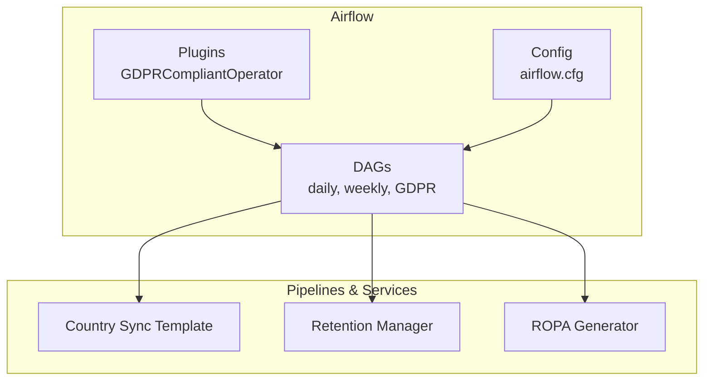

**Diagram sources**
- [jol_daily_sync.py:83-126](file://data/airflow/dags/jol_daily_sync.py#L83-L126)
- [jol_weekly_reporting.py:52-78](file://data/airflow/dags/jol_weekly_reporting.py#L52-L78)
- [jol_gdpr_cleanup.py:36-68](file://data/airflow/dags/jol_gdpr_cleanup.py#L36-L68)
- [jol_operators.py:10-34](file://data/airflow/plugins/jol_operators.py#L10-L34)
- [airflow.cfg:1-25](file://data/airflow/config/airflow.cfg#L1-L25)
- [template_sync.py:49-127](file://data/src/pipelines/country_sync/template_sync.py#L49-L127)
- [retention_manager.py:188-246](file://data/src/gdpr/retention_manager.py#L188-L246)
- [ropa_generator.py:103-182](file://data/src/gdpr/ropa_generator.py#L103-L182)

**Section sources**
- [jol_daily_sync.py:83-126](file://data/airflow/dags/jol_daily_sync.py#L83-L126)
- [jol_weekly_reporting.py:52-78](file://data/airflow/dags/jol_weekly_reporting.py#L52-L78)
- [jol_gdpr_cleanup.py:36-68](file://data/airflow/dags/jol_gdpr_cleanup.py#L36-L68)
- [airflow.cfg:1-25](file://data/airflow/config/airflow.cfg#L1-L25)

## Core Components
- Daily ETL DAG: Orchestrates per-country sync, data quality checks, donation aggregation, retention cleanup, and compliance report generation.
- Weekly Reporting DAG: Produces analytics, country metrics, and a compliance scorecard on a weekly cadence.
- GDPR Cleanup DAG: Automates deletion of expired logs and activity records, then verifies deletions.
- Hub ETL DAG: Processes donations, validates data quality, performs retention cleanup, and generates compliance reports; includes a manual-only GDPR requests DAG for access, erasure, and portability.
- Custom Plugin: Provides a GDPR-compliant operator that ensures audit logging and PII-safe logs.
- Configuration: Sets DAG folders, plugins, logging, database connection, webserver workers, and scheduler behavior.

Key responsibilities:
- Scheduling: Cron expressions control when DAGs run.
- Task dependencies: Directed edges ensure correct ordering and parallelization where appropriate.
- Compliance: Retention rules, legal holds, ROPA generation, and audit logging are enforced within tasks.

**Section sources**
- [jol_daily_sync.py:15-126](file://data/airflow/dags/jol_daily_sync.py#L15-L126)
- [jol_weekly_reporting.py:13-78](file://data/airflow/dags/jol_weekly_reporting.py#L13-L78)
- [jol_gdpr_cleanup.py:14-68](file://data/airflow/dags/jol_gdpr_cleanup.py#L14-L68)
- [jol_hub_etl.py:14-114](file://data/airflow/dags/jol_hub_etl.py#L14-L114)
- [jol_operators.py:10-34](file://data/airflow/plugins/jol_operators.py#L10-L34)
- [airflow.cfg:1-25](file://data/airflow/config/airflow.cfg#L1-L25)

## Architecture Overview
The system uses Airflow to schedule and execute DAGs that call into domain-specific Python modules for data processing, compliance, and reporting. Monitoring and alerting are provided by Prometheus/Grafana/Alertmanager infrastructure.

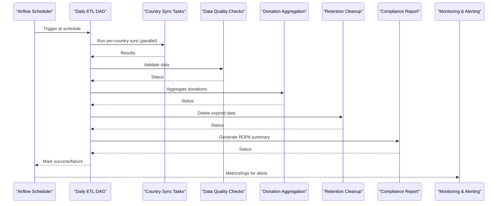

**Diagram sources**
- [jol_daily_sync.py:83-126](file://data/airflow/dags/jol_daily_sync.py#L83-L126)
- [retention_manager.py:206-246](file://data/src/gdpr/retention_manager.py#L206-L246)
- [ropa_generator.py:121-182](file://data/src/gdpr/ropa_generator.py#L121-L182)
- [rules.yaml.tpl:84-145](file://infra/terraform/modules/monitoring/templates/rules.yaml.tpl#L84-L145)
- [alertmanager.yaml.tpl:1-24](file://infra/terraform/modules/monitoring/templates/alertmanager.yaml.tpl#L1-L24)

## Detailed Component Analysis

### Daily ETL DAG (jol_daily_sync)
- Schedule: Runs daily at 2 AM UTC.
- Structure:
  - Start marker
  - Parallel per-country sync using a TaskGroup loop over 27 EU countries
  - Data quality checks
  - Donation aggregation
  - Retention cleanup
  - Compliance report generation
  - End marker
- Dependencies: Sequential flow from start through country group to end, with intermediate steps chained.

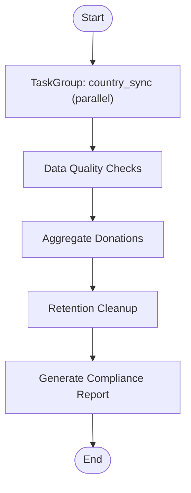

**Diagram sources**
- [jol_daily_sync.py:83-126](file://data/airflow/dags/jol_daily_sync.py#L83-L126)

**Section sources**
- [jol_daily_sync.py:15-126](file://data/airflow/dags/jol_daily_sync.py#L15-L126)

### Weekly Reporting DAG (jol_weekly_reporting)
- Schedule: Runs weekly on Mondays at 3 AM.
- Tasks:
  - Weekly analytics generation
  - Country-level metrics generation
  - Compliance scorecard generation
- Dependencies: Linear chain analytics -> country_metrics -> compliance_scorecard.

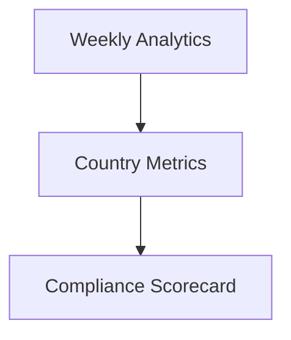

**Diagram sources**
- [jol_weekly_reporting.py:52-78](file://data/airflow/dags/jol_weekly_reporting.py#L52-L78)

**Section sources**
- [jol_weekly_reporting.py:13-78](file://data/airflow/dags/jol_weekly_reporting.py#L13-L78)

### GDPR Cleanup DAG (jol_gdpr_cleanup)
- Schedule: Runs daily at 4 AM.
- Tasks:
  - Cleanup operational logs
  - Cleanup user activity
  - Verify deletions
- Dependencies: Parallel cleanup tasks followed by verification.

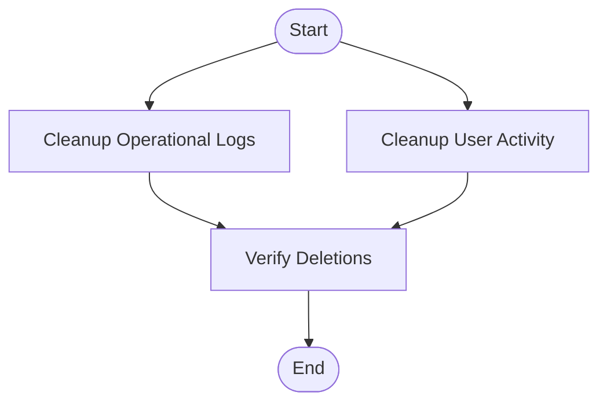

**Diagram sources**
- [jol_gdpr_cleanup.py:36-68](file://data/airflow/dags/jol_gdpr_cleanup.py#L36-L68)

**Section sources**
- [jol_gdpr_cleanup.py:14-68](file://data/airflow/dags/jol_gdpr_cleanup.py#L14-L68)

### Hub ETL DAG (jol_hub_etl)
- Schedule: Daily at 2 AM UTC.
- Groups:
  - Data processing: process donations -> validate data quality
  - GDPR compliance: retention cleanup -> generate compliance report
- Manual-only GDPR Requests DAG:
  - Triggers only manually (schedule_interval=None)
  - Tasks for access, erasure, and portability requests
  - Each task reads dag_run.conf for subject_id and requestor, processes accordingly, and logs via audit logger

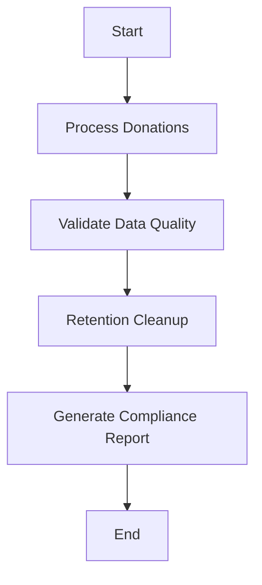

**Diagram sources**
- [jol_hub_etl.py:73-114](file://data/airflow/dags/jol_hub_etl.py#L73-L114)

**Section sources**
- [jol_hub_etl.py:14-214](file://data/airflow/dags/jol_hub_etl.py#L14-L214)

### Custom Operator Plugin (jol_operators)
- Purpose: Provide a base operator that enforces GDPR-compliant logging and PII masking in logs.
- Usage: Extendable for tasks requiring consistent audit trails and safe logging practices.

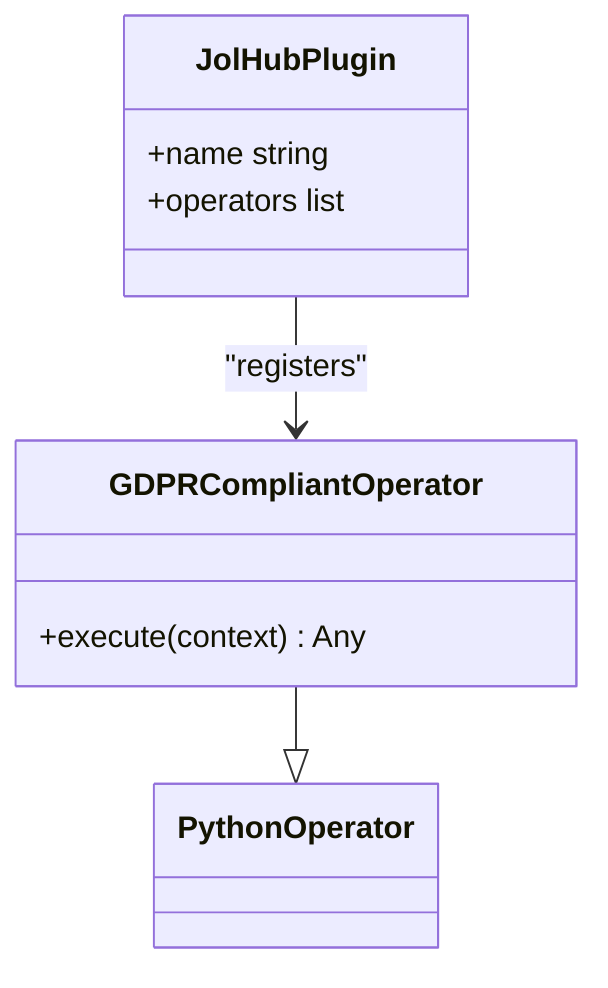

**Diagram sources**
- [jol_operators.py:10-34](file://data/airflow/plugins/jol_operators.py#L10-L34)

**Section sources**
- [jol_operators.py:1-35](file://data/airflow/plugins/jol_operators.py#L1-L35)

### Country Sync Template (template_sync)
- Purpose: Standardized template for building per-country sync pipelines with GDPR considerations.
- Key behaviors:
  - Validates configuration (country code, legal basis)
  - Audits start/completion events
  - Orchestrates entity, donation, and event sync
  - Supports GDPR Art. 15 and 17 methods for access and erasure

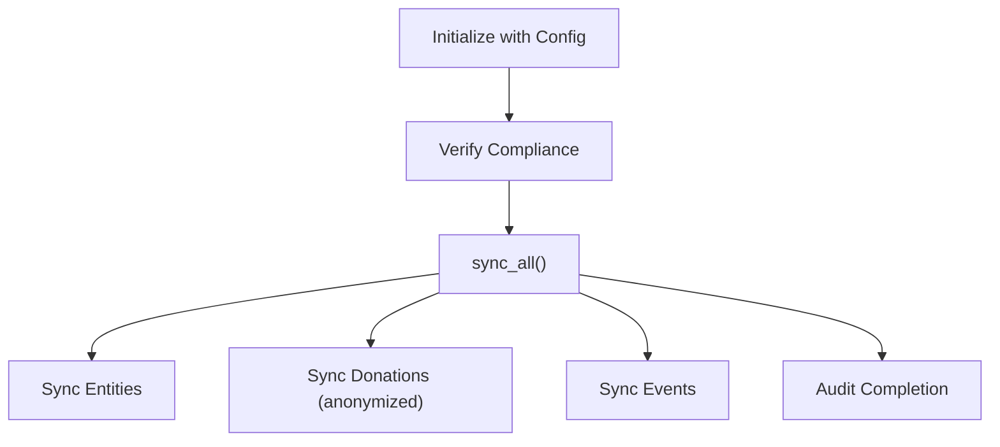

**Diagram sources**
- [template_sync.py:49-127](file://data/src/pipelines/country_sync/template_sync.py#L49-L127)

**Section sources**
- [template_sync.py:1-163](file://data/src/pipelines/country_sync/template_sync.py#L1-L163)

### Retention Manager (retention_manager)
- Purpose: Enforce storage limitation and right to erasure with legal hold protection.
- Key features:
  - Retention rules per data type
  - LegalHoldRegistry to block deletions when necessary
  - Dry-run support and audit logging
  - Subject-level deletion checks and summaries

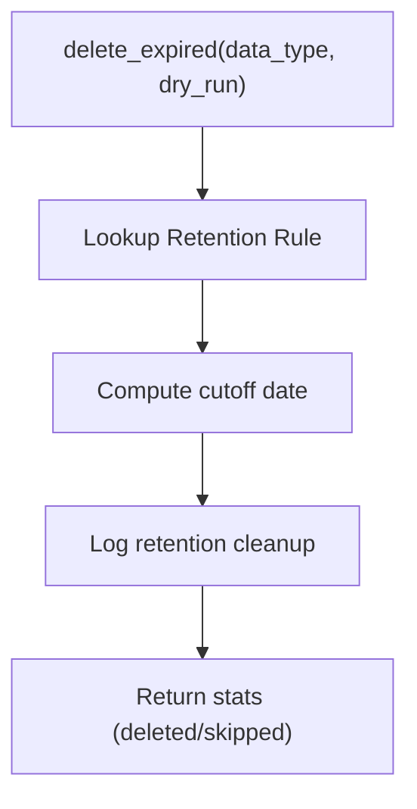

**Diagram sources**
- [retention_manager.py:206-246](file://data/src/gdpr/retention_manager.py#L206-L246)

**Section sources**
- [retention_manager.py:188-336](file://data/src/gdpr/retention_manager.py#L188-L336)

### ROPA Generator (ropa_generator)
- Purpose: Generate Records of Processing Activities per GDPR Article 30.
- Outputs: JSON or Markdown reports saved to disk; provides summary metrics.

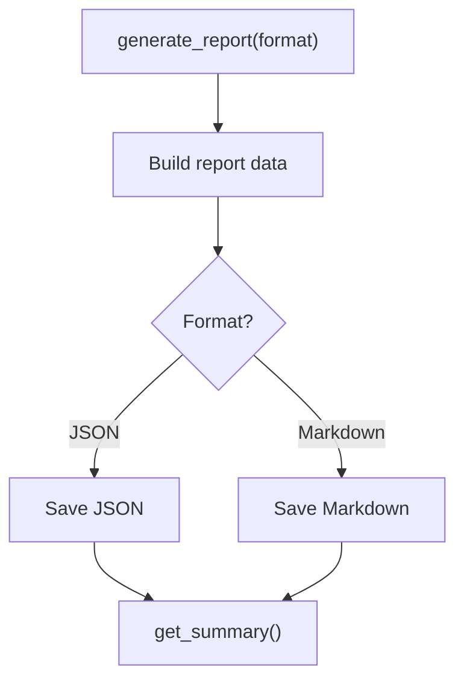

**Diagram sources**
- [ropa_generator.py:121-182](file://data/src/gdpr/ropa_generator.py#L121-L182)

**Section sources**
- [ropa_generator.py:1-182](file://data/src/gdpr/ropa_generator.py#L1-L182)

## Dependency Analysis
- DAG-to-module dependencies:
  - Daily ETL depends on country sync template, data quality checkpoints, donation aggregation, retention manager, and ROPA generator.
  - Weekly reporting depends on donation analytics and ROPA generator.
  - GDPR cleanup depends on retention manager and verification logic.
  - Hub ETL depends on processors, validators, audit logger, and retention manager.
- External integrations:
  - Postgres for Airflow metadata (configured in airflow.cfg).
  - Prometheus/Grafana/Alertmanager for monitoring and alerting.

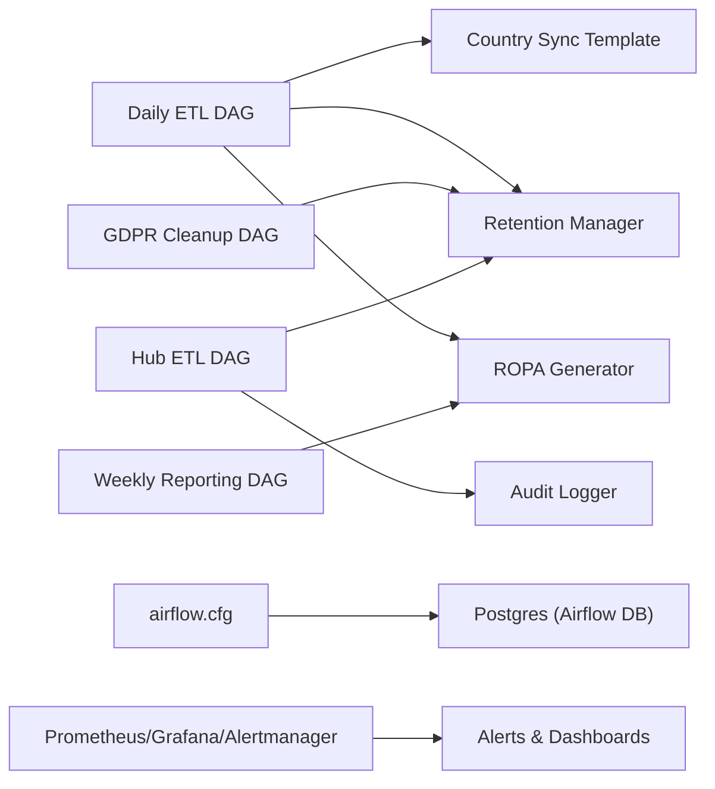

**Diagram sources**
- [jol_daily_sync.py:83-126](file://data/airflow/dags/jol_daily_sync.py#L83-L126)
- [jol_weekly_reporting.py:52-78](file://data/airflow/dags/jol_weekly_reporting.py#L52-L78)
- [jol_gdpr_cleanup.py:36-68](file://data/airflow/dags/jol_gdpr_cleanup.py#L36-L68)
- [jol_hub_etl.py:73-114](file://data/airflow/dags/jol_hub_etl.py#L73-L114)
- [airflow.cfg:10-16](file://data/airflow/config/airflow.cfg#L10-L16)
- [rules.yaml.tpl:84-145](file://infra/terraform/modules/monitoring/templates/rules.yaml.tpl#L84-L145)
- [alertmanager.yaml.tpl:1-24](file://infra/terraform/modules/monitoring/templates/alertmanager.yaml.tpl#L1-L24)

**Section sources**
- [airflow.cfg:1-25](file://data/airflow/config/airflow.cfg#L1-L25)
- [rules.yaml.tpl:84-145](file://infra/terraform/modules/monitoring/templates/rules.yaml.tpl#L84-L145)
- [alertmanager.yaml.tpl:1-24](file://infra/terraform/modules/monitoring/templates/alertmanager.yaml.tpl#L1-L24)

## Performance Considerations
- Parallelism:
  - Use TaskGroup to parallelize per-country sync tasks to reduce total runtime.
  - Ensure worker concurrency is sufficient for the number of concurrent tasks.
- Scheduling:
  - Stagger DAG schedules to avoid resource contention (e.g., daily at 2 AM, GDPR cleanup at 4 AM, weekly on Monday at 3 AM).
- Resource allocation:
  - Tune Airflow webserver workers and executor settings based on workload.
  - Monitor container CPU/memory usage and set appropriate limits/requests in Kubernetes.
- High-frequency jobs:
  - For higher frequency than daily, consider splitting workloads into smaller DAGs and staggering schedules.
  - Use backoff and retry policies judiciously to avoid cascading failures.
- Observability:
  - Leverage Prometheus rules and Alertmanager to detect queue backlogs, worker down states, and high resource usage.

[No sources needed since this section provides general guidance]

## Troubleshooting Guide
Common issues and resolutions:
- DAG not triggering:
  - Verify schedule_interval and timezone alignment.
  - Check scheduler logs and dag_dir_list_interval in airflow.cfg.
- Task retries and failures:
  - Review default_args retries and retry_delay.
  - Inspect task logs for exceptions; ensure email_on_failure is configured.
- GDPR deletion blocked:
  - Check for active legal holds before deletion attempts.
  - Use retention manager’s check_deletion_allowed to pre-validate.
- Monitoring and alerting:
  - Confirm Prometheus rule groups are deployed and firing.
  - Validate Alertmanager receivers and routing for critical alerts.

Operational tips:
- Use Airflow UI to inspect task state, logs, and duration.
- Enable mask_sensitive_data in airflow.cfg to protect PII in logs.
- For manual GDPR requests DAG, trigger via UI/API with proper conf payload.

**Section sources**
- [airflow.cfg:18-24](file://data/airflow/config/airflow.cfg#L18-L24)
- [retention_manager.py:257-336](file://data/src/gdpr/retention_manager.py#L257-L336)
- [rules.yaml.tpl:84-145](file://infra/terraform/modules/monitoring/templates/rules.yaml.tpl#L84-L145)
- [alertmanager.yaml.tpl:1-24](file://infra/terraform/modules/monitoring/templates/alertmanager.yaml.tpl#L1-L24)

## Conclusion
JOL-HUB’s Airflow-based orchestration provides robust, compliant scheduling for daily syncs, weekly reporting, and GDPR cleanup. The design emphasizes:
- Clear DAG structures with explicit dependencies
- Strong GDPR controls including retention rules and legal holds
- Comprehensive audit logging and compliance reporting
- Scalable execution via parallelization and careful scheduling
- Integrated monitoring and alerting for operational reliability

Adhering to these patterns ensures predictable, auditable, and resilient data workflows across all supported regions.