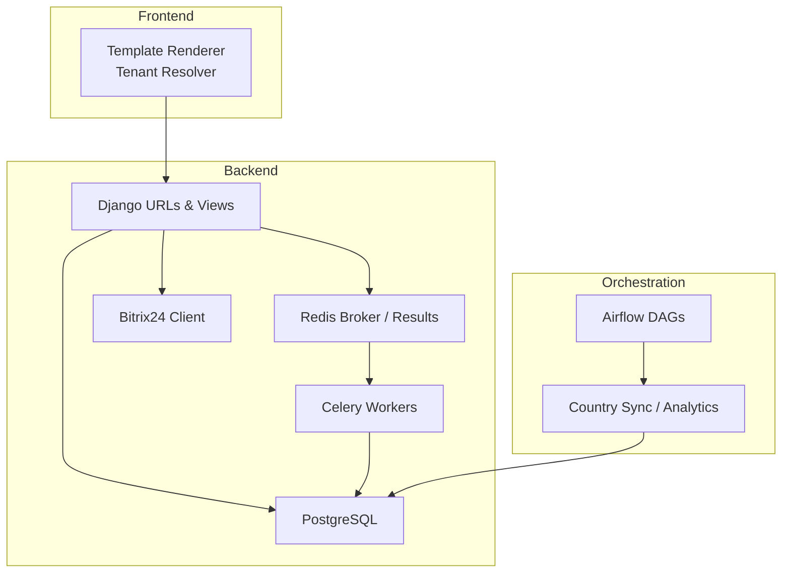
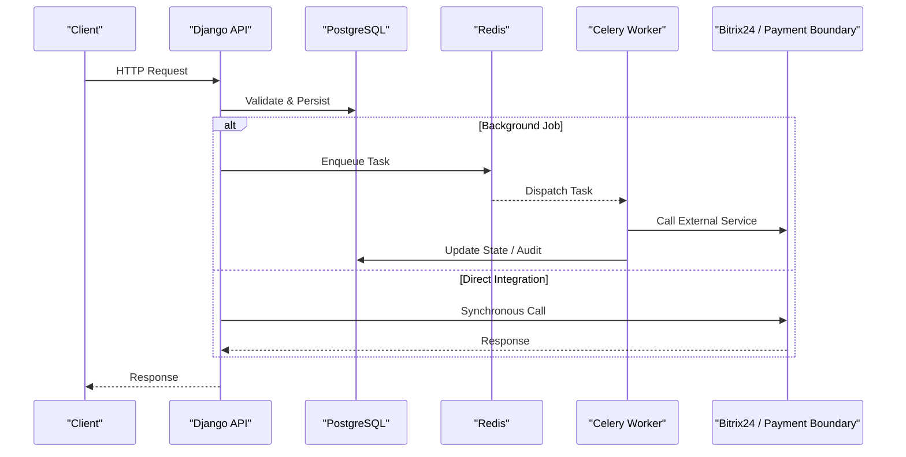
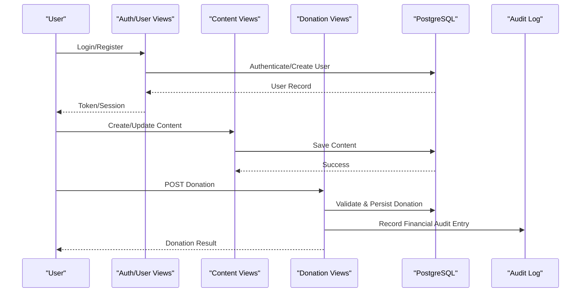
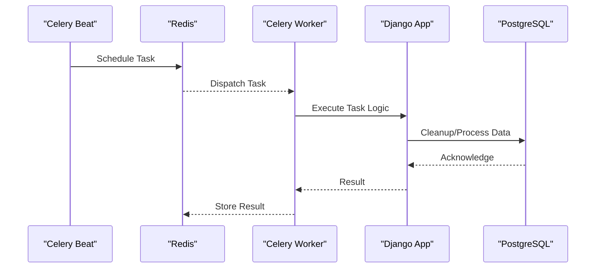
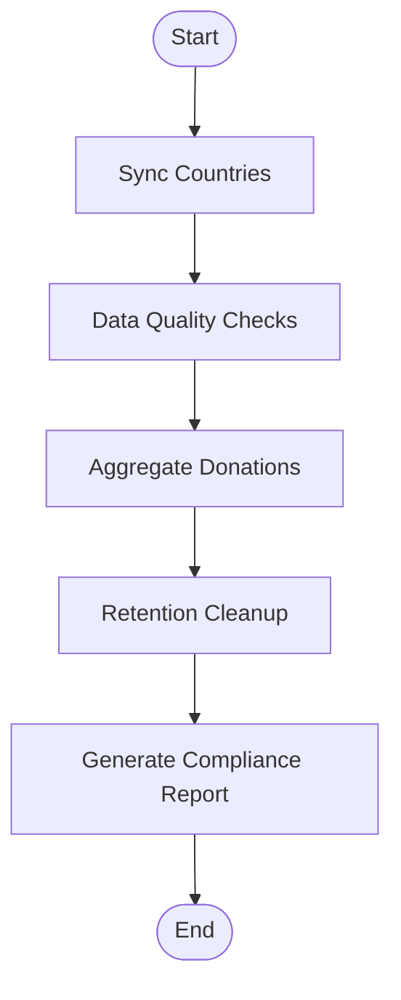
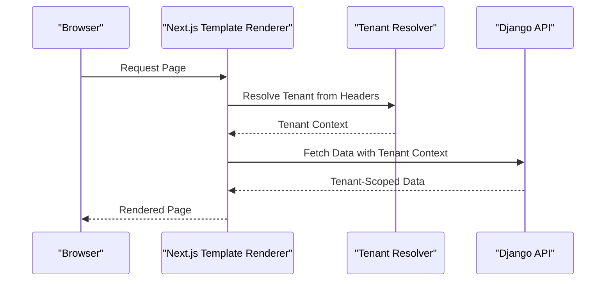
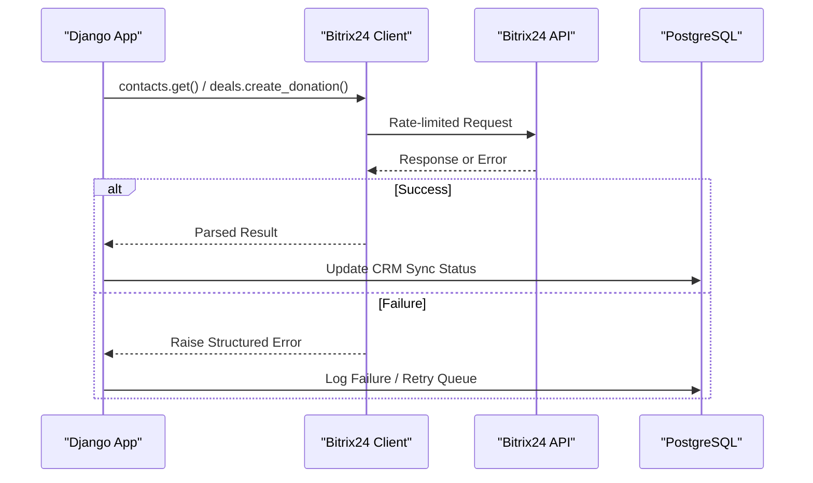
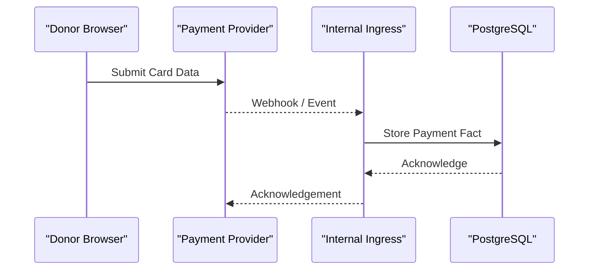
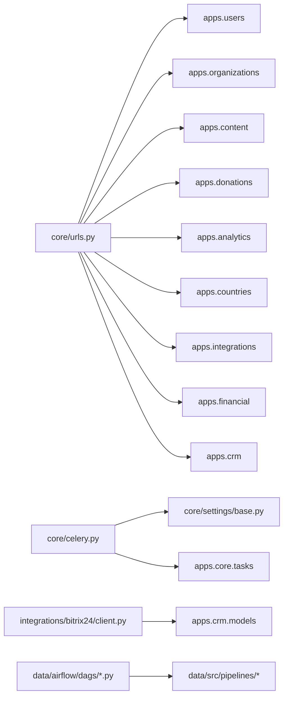

# Data Flow Patterns

<cite>
**Referenced Files in This Document**
- [base.py](file://backend/django/core/settings/base.py)
- [celery.py](file://backend/django/core/celery.py)
- [urls.py](file://backend/django/core/urls.py)
- [models.py](file://backend/django/apps/core/models.py)
- [views.py](file://backend/django/apps/donations/views.py)
- [tasks.py](file://backend/django/apps/core/tasks.py)
- [client.py](file://backend/integrations/bitrix24/client.py)
- [lt_sync.py](file://data/src/pipelines/country_sync/lt_sync.py)
- [jol_daily_sync.py](file://data/airflow/dags/jol_daily_sync.py)
- [jol_hub_etl.py](file://data/airflow/dags/jol_hub_etl.py)
- [tenant-resolver.ts](file://frontend/apps/template-renderer/src/lib/tenant-resolver.ts)
</cite>

## Table of Contents
1. Introduction
2. Project Structure
3. Core Components
4. Architecture Overview
5. Detailed Component Analysis
6. Dependency Analysis
7. Performance Considerations
8. Troubleshooting Guide
9. Conclusion

## Introduction
This document describes the end-to-end data flow patterns for the JOL-HUB platform, covering:
- Synchronous request flows from user input through API layer to database persistence
- Asynchronous background processing with Celery workers
- ETL orchestration with Apache Airflow
- Template rendering data flows for tenant-specific websites
- External integrations (Bitrix24 CRM and payment boundary)
- Error handling, retries, dead letter queues, and data consistency strategies across distributed components

The goal is to provide a clear mental model of how data moves through the system, where it is validated, transformed, persisted, and audited.

## Project Structure
JOL-HUB is organized into layered modules:
- Backend Django application with REST APIs, middleware, models, tasks, and integrations
- Celery worker configuration for asynchronous jobs
- Apache Airflow DAGs for scheduled ETL and compliance workflows
- Frontend template renderer that resolves tenants and renders dynamic sites
- Data pipelines for country synchronization and analytics

**Diagram sources**
- [urls.py:39-66](file://backend/django/core/urls.py#L39-L66)
- [base.py:172-186](file://backend/django/core/settings/base.py#L172-L186)
- [base.py:361-386](file://backend/django/core/settings/base.py#L361-L386)
- [celery.py:12-25](file://backend/django/core/celery.py#L12-L25)
- [client.py:91-166](file://backend/integrations/bitrix24/client.py#L91-L166)
- [jol_daily_sync.py:83-125](file://data/airflow/dags/jol_daily_sync.py#L83-L125)
- [lt_sync.py:48-113](file://data/src/pipelines/country_sync/lt_sync.py#L48-L113)

**Section sources**
- [urls.py:39-66](file://backend/django/core/urls.py#L39-L66)
- [base.py:172-186](file://backend/django/core/settings/base.py#L172-L186)
- [celery.py:12-25](file://backend/django/core/celery.py#L12-L25)

## Core Components
- API routing and middleware: Central URL router mounts app endpoints and enables tenant context middleware.
- Database: PostgreSQL configured with connection pooling and health checks; MongoDB used for high-volume logs and raw payloads.
- Celery: Background task execution with Redis broker/results and scheduled jobs via Beat.
- Integrations: Bitrix24 client with rate limiting, retry logic, and audit logging.
- ETL: Airflow DAGs orchestrating daily syncs, quality checks, aggregation, retention cleanup, and compliance reporting.
- Tenant resolution: Server-side tenant resolver for Next.js template renderer.

**Section sources**
- [urls.py:39-66](file://backend/django/core/urls.py#L39-L66)
- [base.py:172-186](file://backend/django/core/settings/base.py#L172-L186)
- [base.py:361-386](file://backend/django/core/settings/base.py#L361-L386)
- [celery.py:12-25](file://backend/django/core/celery.py#L12-L25)
- [client.py:91-166](file://backend/integrations/bitrix24/client.py#L91-L166)
- [jol_daily_sync.py:83-125](file://data/airflow/dags/jol_daily_sync.py#L83-L125)
- [tenant-resolver.ts:20-33](file://frontend/apps/template-renderer/src/lib/tenant-resolver.ts#L20-L33)

## Architecture Overview
The platform uses a hybrid synchronous/asynchronous architecture:
- Synchronous paths handle real-time operations like authentication, content management, and donation creation/refunds.
- Asynchronous paths use Celery for email notifications, report generation, recurring donations, and CRM synchronization.
- ETL pipelines run on Airflow for batch extraction, transformation, and loading into analytics databases.
- Template rendering loads tenant configurations server-side to produce dynamic websites.

**Diagram sources**
- [urls.py:39-66](file://backend/django/core/urls.py#L39-L66)
- [base.py:361-386](file://backend/django/core/settings/base.py#L361-L386)
- [celery.py:12-25](file://backend/django/core/celery.py#L12-L25)
- [client.py:168-202](file://backend/integrations/bitrix24/client.py#L168-L202)

## Detailed Component Analysis

### Synchronous Data Flows: Authentication, Content Management, Donations
- Authentication and user management are mounted under /api/v1/auth and /api/v1/users.
- Content management endpoints are mounted under /api/v1/content.
- Donation endpoints include list/create and refund operations with strict throttling and audit logging.

**Diagram sources**
- [urls.py:52-62](file://backend/django/core/urls.py#L52-L62)
- [views.py:24-46](file://backend/django/apps/donations/views.py#L24-L46)
- [views.py:59-168](file://backend/django/apps/donations/views.py#L59-L168)
- [models.py:67-151](file://backend/django/apps/core/models.py#L67-L151)

**Section sources**
- [urls.py:52-62](file://backend/django/core/urls.py#L52-L62)
- [views.py:24-46](file://backend/django/apps/donations/views.py#L24-L46)
- [views.py:59-168](file://backend/django/apps/donations/views.py#L59-L168)
- [models.py:67-151](file://backend/django/apps/core/models.py#L67-L151)

### Asynchronous Data Flows: Celery Workers
- Celery is initialized with Django settings and auto-discovers tasks.
- Scheduled tasks include daily digest, session cleanup, and recurring donations processing.
- Housekeeping tasks delete expired sessions and provide smoke tests.

**Diagram sources**
- [celery.py:12-25](file://backend/django/core/celery.py#L12-L25)
- [base.py:361-386](file://backend/django/core/settings/base.py#L361-L386)
- [tasks.py:9-18](file://backend/django/apps/core/tasks.py#L9-L18)

**Section sources**
- [celery.py:12-25](file://backend/django/core/celery.py#L12-L25)
- [base.py:361-386](file://backend/django/core/settings/base.py#L361-L386)
- [tasks.py:9-18](file://backend/django/apps/core/tasks.py#L9-L18)

### ETL Pipeline Data Flows: Apache Airflow
- Daily ETL runs at 2 AM UTC, orchestrating country syncs, data quality checks, donation aggregation, retention cleanup, and compliance reports.
- Country-specific pipelines (e.g., Lithuania) fetch, validate, anonymize, and load data with audit logging.
- GDPR-focused DAGs process access, erasure, and portability requests with audit trails.

**Diagram sources**
- [jol_daily_sync.py:83-125](file://data/airflow/dags/jol_daily_sync.py#L83-L125)
- [lt_sync.py:72-113](file://data/src/pipelines/country_sync/lt_sync.py#L72-L113)
- [lt_sync.py:115-140](file://data/src/pipelines/country_sync/lt_sync.py#L115-L140)
- [jol_hub_etl.py:73-113](file://data/airflow/dags/jol_hub_etl.py#L73-L113)

**Section sources**
- [jol_daily_sync.py:83-125](file://data/airflow/dags/jol_daily_sync.py#L83-L125)
- [lt_sync.py:72-113](file://data/src/pipelines/country_sync/lt_sync.py#L72-L113)
- [lt_sync.py:115-140](file://data/src/pipelines/country_sync/lt_sync.py#L115-L140)
- [jol_hub_etl.py:73-113](file://data/airflow/dags/jol_hub_etl.py#L73-L113)

### Template Rendering Data Flows: Tenant-Specific Websites
- The template renderer resolves tenant context from headers using a server-side resolver.
- Tenant context includes schema information for row-level security propagation to backend calls.
- Unknown slugs yield null to prevent enumeration and ensure GDPR compliance.

**Diagram sources**
- [tenant-resolver.ts:20-33](file://frontend/apps/template-renderer/src/lib/tenant-resolver.ts#L20-L33)

**Section sources**
- [tenant-resolver.ts:20-33](file://frontend/apps/template-renderer/src/lib/tenant-resolver.ts#L20-L33)

### External Integration Data Flows: Bitrix24 CRM
- The Bitrix24 client provides async/sync interfaces with rate limiting, retries, and audit logging.
- It supports batch operations and token refresh, with structured error types for auth, rate limits, and API errors.
- CRM models track sync status and timestamps for Bitrix24 entities.

**Diagram sources**
- [client.py:168-202](file://backend/integrations/bitrix24/client.py#L168-L202)
- [client.py:246-321](file://backend/integrations/bitrix24/client.py#L246-L321)
- [client.py:338-361](file://backend/integrations/bitrix24/client.py#L338-L361)

**Section sources**
- [client.py:168-202](file://backend/integrations/bitrix24/client.py#L168-L202)
- [client.py:246-321](file://backend/integrations/bitrix24/client.py#L246-L321)
- [client.py:338-361](file://backend/integrations/bitrix24/client.py#L338-L361)

### Payment Processing Data Flow: Internal Ingress
- The platform enforces a payment boundary: the hub does not hold payment service provider keys; card data flows directly between donor browser and provider.
- An internal ingress endpoint receives marketplace payment events (flag-gated), storing only payment facts without touching PSP secrets.

**Diagram sources**
- [urls.py:64-66](file://backend/django/core/urls.py#L64-L66)
- [base.py:788-798](file://backend/django/core/settings/base.py#L788-L798)

**Section sources**
- [urls.py:64-66](file://backend/django/core/urls.py#L64-L66)
- [base.py:788-798](file://backend/django/core/settings/base.py#L788-L798)

## Dependency Analysis
Key dependencies and relationships:
- Django URLs mount apps for users, organizations, content, donations, analytics, countries, integrations, financial, and CRM.
- Celery reads configuration from Django settings and discovers tasks automatically.
- Bitrix24 client depends on httpx and integrates with CRM models for sync tracking.
- Airflow DAGs invoke Python callables that use pipeline modules and audit/logging utilities.
- Template renderer depends on tenant resolver package for secure tenant context resolution.

**Diagram sources**
- [urls.py:39-66](file://backend/django/core/urls.py#L39-L66)
- [celery.py:12-25](file://backend/django/core/celery.py#L12-L25)
- [base.py:361-386](file://backend/django/core/settings/base.py#L361-L386)
- [client.py:91-166](file://backend/integrations/bitrix24/client.py#L91-L166)
- [jol_daily_sync.py:83-125](file://data/airflow/dags/jol_daily_sync.py#L83-L125)

**Section sources**
- [urls.py:39-66](file://backend/django/core/urls.py#L39-L66)
- [celery.py:12-25](file://backend/django/core/celery.py#L12-L25)
- [base.py:361-386](file://backend/django/core/settings/base.py#L361-L386)
- [client.py:91-166](file://backend/integrations/bitrix24/client.py#L91-L166)
- [jol_daily_sync.py:83-125](file://data/airflow/dags/jol_daily_sync.py#L83-L125)

## Performance Considerations
- Database connections are pooled and health-checked; consider tuning timeouts and max pool sizes based on workload.
- Celery concurrency and prefetch multiplier are set; adjust worker concurrency and queue sizing for peak loads.
- Redis cache is configured with compression and timeouts; tune TTL policies per data type.
- Email backend and templates are configurable; ensure SMTP reliability and template caching.
- ETL pipelines should be scheduled during off-peak hours and use incremental syncs where possible.

[No sources needed since this section provides general guidance]

## Troubleshooting Guide
Common issues and patterns:
- Authentication failures: Check JWT configuration, token lifetimes, and blacklisting behavior.
- Rate limiting: Review throttle classes and rates for sensitive endpoints (auth, donations).
- Celery tasks: Verify broker connectivity, task discovery, and scheduled jobs.
- Bitrix24 integration: Inspect rate limit errors, token expiration, and retry backoff; check audit logs for failed API calls.
- ETL failures: Examine DAG retries, task logs, and data quality checkpoints; ensure source systems are reachable.
- Tenant isolation: Confirm middleware sets tenant context and models enforce organization scoping.

**Section sources**
- [base.py:282-327](file://backend/django/core/settings/base.py#L282-L327)
- [base.py:361-386](file://backend/django/core/settings/base.py#L361-L386)
- [client.py:246-321](file://backend/integrations/bitrix24/client.py#L246-L321)
- [jol_daily_sync.py:83-125](file://data/airflow/dags/jol_daily_sync.py#L83-L125)

## Conclusion
JOL-HUB implements robust data flow patterns across synchronous and asynchronous layers:
- Real-time operations are handled by Django APIs with validation, throttling, and audit logging.
- Background jobs leverage Celery for scalability and resilience.
- ETL pipelines orchestrated by Airflow ensure reliable batch processing and compliance.
- Tenant-aware rendering delivers personalized experiences while maintaining security and privacy.
- External integrations are encapsulated with retry logic, rate limiting, and audit trails.
- Consistency and integrity are enforced through tamper-evident audit logs, hash chains, and transactional boundaries.

[No sources needed since this section summarizes without analyzing specific files]