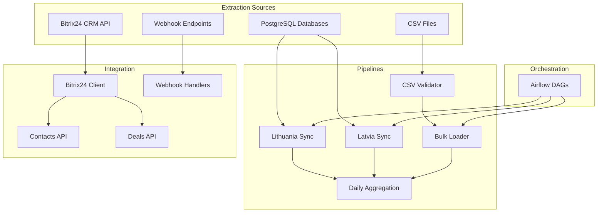
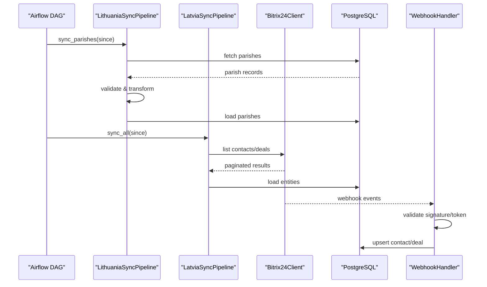
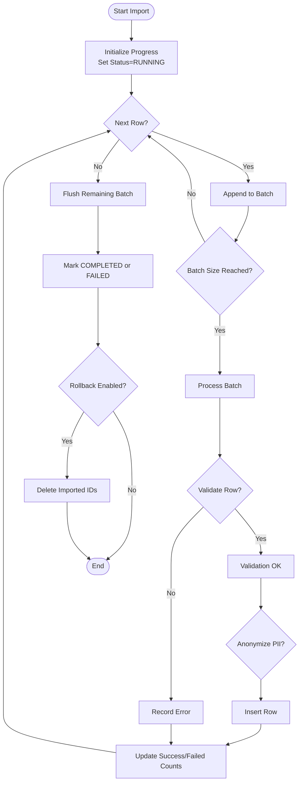
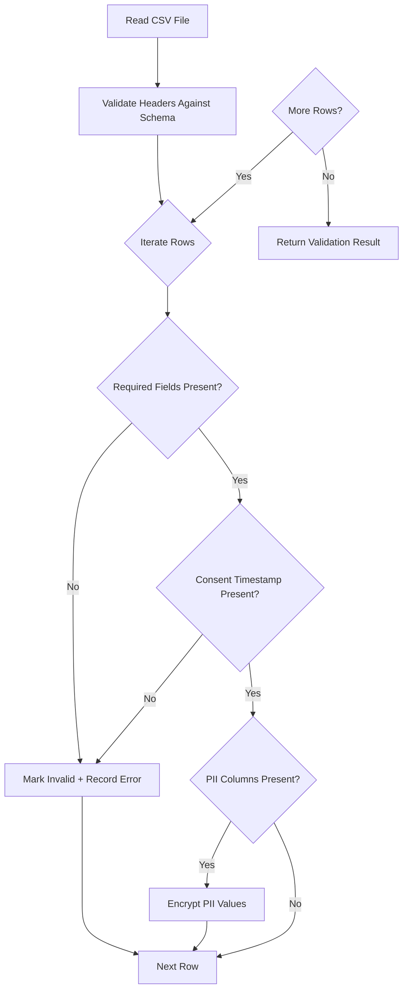
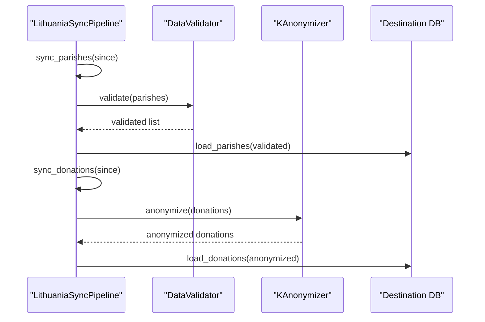
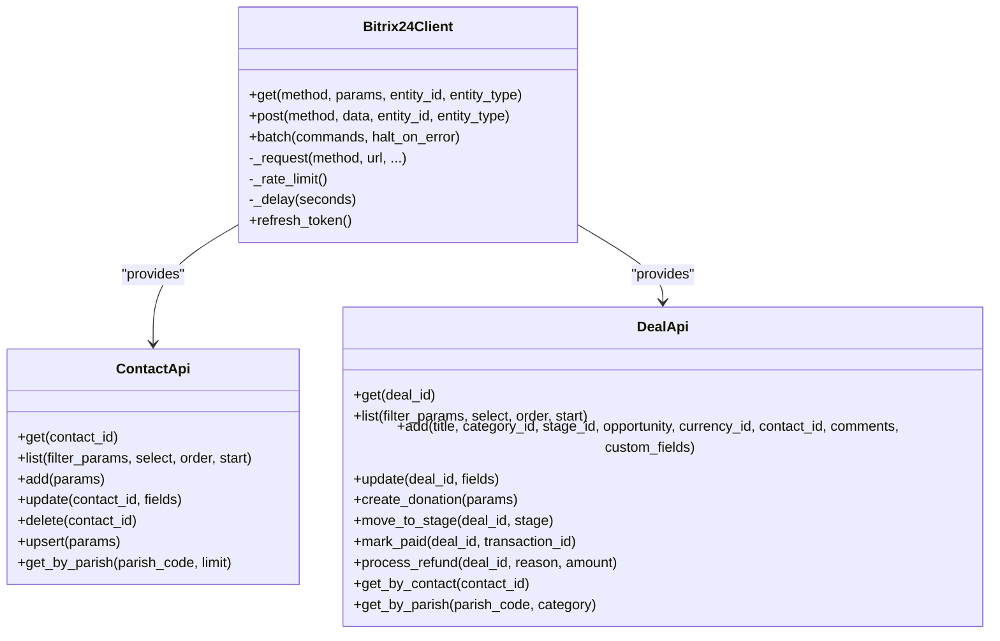
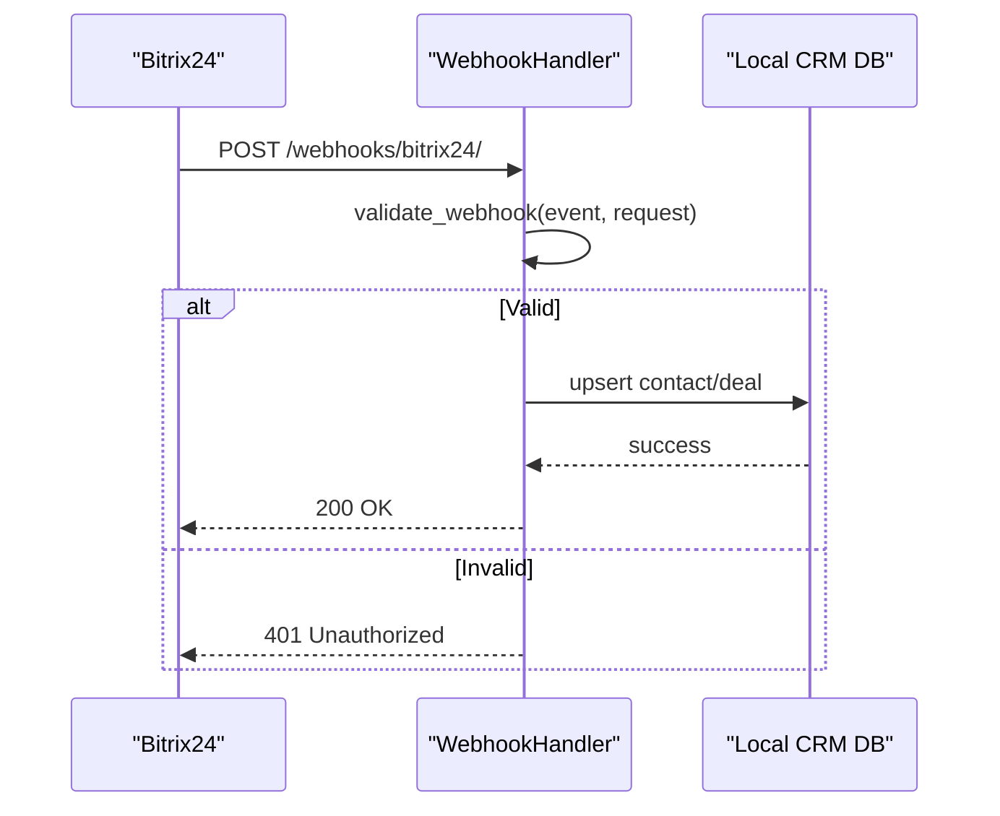
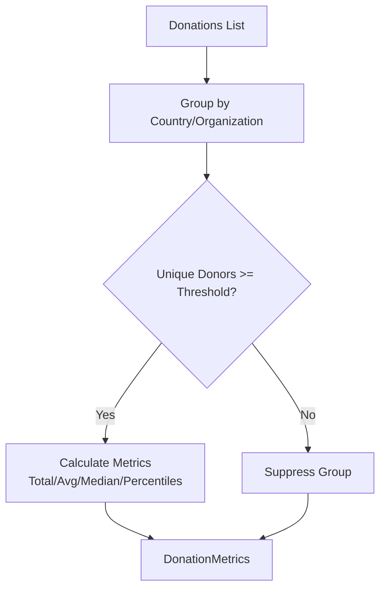
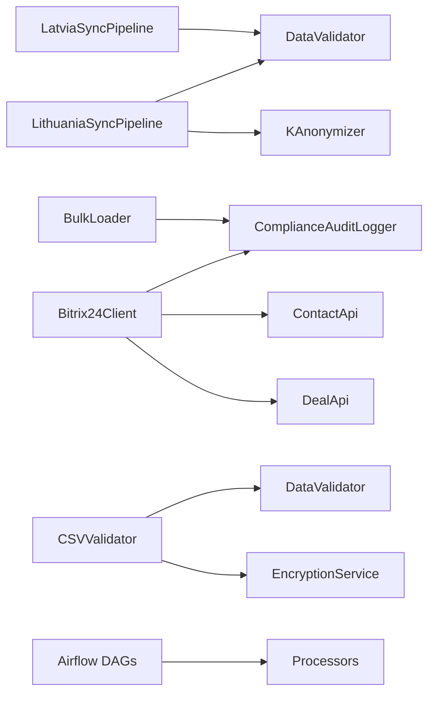

# Data Extraction Layer

<cite>
**Referenced Files in This Document**
- [bulk_loader.py](file://data/src/pipelines/entity_import/bulk_loader.py)
- [csv_validator.py](file://data/src/pipelines/entity_import/csv_validator.py)
- [lt_sync.py](file://data/src/pipelines/country_sync/lt_sync.py)
- [lv_sync.py](file://data/src/pipelines/country_sync/lv_sync.py)
- [client.py](file://backend/integrations/bitrix24/client.py)
- [contacts.py](file://backend/integrations/bitrix24/api/contacts.py)
- [deals.py](file://backend/integrations/bitrix24/api/deals.py)
- [handlers.py](file://backend/integrations/bitrix24/webhooks/handlers.py)
- [daily_aggregation.py](file://data/src/pipelines/donation_analytics/daily_aggregation.py)
- [config.py](file://data/src/config.py)
- [validators.py](file://data/src/validators.py)
- [anonymizer.py](file://data/src/gdpr/anonymizer.py)
- [jol_hub_etl.py](file://data/airflow/dags/jol_hub_etl.py)
- [mcp-postgres.py](file://tools/mcp-postgres.py)
- [processors.py](file://data/src/processors.py)
</cite>

## Table of Contents
1. Introduction
2. Project Structure
3. Core Components
4. Architecture Overview
5. Detailed Component Analysis
6. Dependency Analysis
7. Performance Considerations
8. Troubleshooting Guide
9. Conclusion

## Introduction
This document describes the data extraction layer powering JOL-HUB ETL pipelines. It explains how data is extracted from multiple sources:
- PostgreSQL databases (country-scoped warehouses)
- External APIs (Bitrix24 CRM)
- CSV files for bulk entity imports
- Webhook endpoints for real-time event ingestion

It also documents the bulk loader implementation, country-specific sync processes for Estonia, Lithuania, and Latvia, connection management strategies, error handling and retry mechanisms, validation during extraction, examples for donations, users, organization hierarchies, and compliance-related information, plus performance optimization techniques and monitoring approaches for extraction failures.

## Project Structure
The extraction layer spans several modules across the repository:
- Data pipelines under data/src/pipelines handle batch processing, validation, and aggregation
- Country sync modules under data/src/pipelines/country_sync implement per-country extraction logic
- Bitrix24 integration under backend/integrations/bitrix24 provides API clients, webhooks, and audit logging
- Airflow DAGs under data/airflow/dags orchestrate scheduled extractions and GDPR workflows
- Configuration and validation utilities under data/src provide shared settings and validators
- PostgreSQL connectivity via psycopg2 is used by processors and tools

**Diagram sources**
- [lt_sync.py:48-113](file://data/src/pipelines/country_sync/lt_sync.py#L48-L113)
- [lv_sync.py:47-91](file://data/src/pipelines/country_sync/lv_sync.py#L47-L91)
- [client.py:91-321](file://backend/integrations/bitrix24/client.py#L91-L321)
- [contacts.py:138-290](file://backend/integrations/bitrix24/api/contacts.py#L138-L290)
- [deals.py:149-386](file://backend/integrations/bitrix24/api/deals.py#L149-L386)
- [handlers.py:63-152](file://backend/integrations/bitrix24/webhooks/handlers.py#L63-L152)
- [bulk_loader.py:72-151](file://data/src/pipelines/entity_import/bulk_loader.py#L72-L151)
- [csv_validator.py:120-210](file://data/src/pipelines/entity_import/csv_validator.py#L120-L210)
- [daily_aggregation.py:62-142](file://data/src/pipelines/donation_analytics/daily_aggregation.py#L62-L142)
- [jol_hub_etl.py:73-113](file://data/airflow/dags/jol_hub_etl.py#L73-L113)

**Section sources**
- [lt_sync.py:48-113](file://data/src/pipelines/country_sync/lt_sync.py#L48-L113)
- [lv_sync.py:47-91](file://data/src/pipelines/country_sync/lv_sync.py#L47-L91)
- [client.py:91-321](file://backend/integrations/bitrix24/client.py#L91-L321)
- [contacts.py:138-290](file://backend/integrations/bitrix24/api/contacts.py#L138-L290)
- [deals.py:149-386](file://backend/integrations/bitrix24/api/deals.py#L149-L386)
- [handlers.py:63-152](file://backend/integrations/bitrix24/webhooks/handlers.py#L63-L152)
- [bulk_loader.py:72-151](file://data/src/pipelines/entity_import/bulk_loader.py#L72-L151)
- [csv_validator.py:120-210](file://data/src/pipelines/entity_import/csv_validator.py#L120-L210)
- [daily_aggregation.py:62-142](file://data/src/pipelines/donation_analytics/daily_aggregation.py#L62-L142)
- [jol_hub_etl.py:73-113](file://data/airflow/dags/jol_hub_etl.py#L73-L113)

## Core Components
- BulkLoader: Batch import with progress tracking, rollback, audit logging, and PII anonymization hooks
- CSVValidator: Schema-based validation, consent checks, PII encryption requirements, streaming iteration
- Country Sync Pipelines: LithuaniaSyncPipeline and LatviaSyncPipeline orchestrate source fetches, validation, anonymization, and loading
- Bitrix24Client: Async client with rate limiting, retries, batch requests, token refresh, and audit logging
- WebhookHandlers: Ingests Bitrix24 events, validates authenticity, routes to handlers, logs tamper-evident audit entries
- DailyAggregationPipeline: Produces k-anonymized analytics, suppresses small groups, computes metrics and trends
- Validators: Generic and domain-specific validators for donations and users, including GDPR-sensitive pattern detection
- Anonymizer: K-anonymity with country-specific thresholds and helper functions
- Config: Central configuration for database connections, retention policies, and processing activities
- Airflow DAGs: Orchestrate daily ETL tasks and GDPR request processing

**Section sources**
- [bulk_loader.py:72-151](file://data/src/pipelines/entity_import/bulk_loader.py#L72-L151)
- [csv_validator.py:120-210](file://data/src/pipelines/entity_import/csv_validator.py#L120-L210)
- [lt_sync.py:48-113](file://data/src/pipelines/country_sync/lt_sync.py#L48-L113)
- [lv_sync.py:47-91](file://data/src/pipelines/country_sync/lv_sync.py#L47-L91)
- [client.py:91-321](file://backend/integrations/bitrix24/client.py#L91-L321)
- [handlers.py:63-152](file://backend/integrations/bitrix24/webhooks/handlers.py#L63-L152)
- [daily_aggregation.py:62-142](file://data/src/pipelines/donation_analytics/daily_aggregation.py#L62-L142)
- [validators.py:75-119](file://data/src/validators.py#L75-L119)
- [anonymizer.py:106-143](file://data/src/gdpr/anonymizer.py#L106-L143)
- [config.py:55-82](file://data/src/config.py#L55-L82)
- [jol_hub_etl.py:73-113](file://data/airflow/dags/jol_hub_etl.py#L73-L113)

## Architecture Overview
The extraction layer integrates multiple sources into a unified pipeline with strong GDPR and PCI-DSS considerations:
- PostgreSQL: Country-scoped read-only connections for efficient extraction
- Bitrix24: REST API with async client, rate limiting, retries, and batch operations; webhooks for real-time updates
- CSV: Pre-import validation and encryption of PII fields before bulk load
- Airflow: Orchestrates scheduled extractions, validations, cleanup, and compliance reporting

**Diagram sources**
- [lt_sync.py:72-113](file://data/src/pipelines/country_sync/lt_sync.py#L72-L113)
- [lv_sync.py:62-91](file://data/src/pipelines/country_sync/lv_sync.py#L62-L91)
- [client.py:168-321](file://backend/integrations/bitrix24/client.py#L168-L321)
- [handlers.py:129-152](file://backend/integrations/bitrix24/webhooks/handlers.py#L129-L152)
- [mcp-postgres.py:18-30](file://tools/mcp-postgres.py#L18-L30)

## Detailed Component Analysis

### Bulk Loader for Entity Imports
- Purpose: Batch import with configurable batch size, progress tracking, rollback on failure, audit logging, and optional PII anonymization
- Key behaviors:
  - Iterative processing with batch accumulation and final flush
  - Per-row validation and anonymization hooks
  - Error collection with max error threshold and stop-on-error option
  - Rollback by deleting imported IDs on failure
  - Audit events for start and completion with metrics

**Diagram sources**
- [bulk_loader.py:96-151](file://data/src/pipelines/entity_import/bulk_loader.py#L96-L151)
- [bulk_loader.py:160-197](file://data/src/pipelines/entity_import/bulk_loader.py#L160-L197)
- [bulk_loader.py:213-229](file://data/src/pipelines/entity_import/bulk_loader.py#L213-L229)

**Section sources**
- [bulk_loader.py:72-151](file://data/src/pipelines/entity_import/bulk_loader.py#L72-L151)
- [bulk_loader.py:160-197](file://data/src/pipelines/entity_import/bulk_loader.py#L160-L197)
- [bulk_loader.py:213-229](file://data/src/pipelines/entity_import/bulk_loader.py#L213-L229)

### CSV Validation and Secure Import
- Purpose: Validate CSV schemas, enforce consent requirements, detect PII, and encrypt sensitive fields prior to import
- Key behaviors:
  - Predefined schemas for parish, donation, priest with required columns and unique constraints
  - Consent timestamp enforcement for PII-bearing rows
  - Streaming iteration to avoid memory pressure on large files
  - Encryption of PII using configured encryption service or fallback hashing

**Diagram sources**
- [csv_validator.py:135-210](file://data/src/pipelines/entity_import/csv_validator.py#L135-L210)
- [csv_validator.py:226-274](file://data/src/pipelines/entity_import/csv_validator.py#L226-L274)
- [csv_validator.py:276-306](file://data/src/pipelines/entity_import/csv_validator.py#L276-L306)

**Section sources**
- [csv_validator.py:60-117](file://data/src/pipelines/entity_import/csv_validator.py#L60-L117)
- [csv_validator.py:135-210](file://data/src/pipelines/entity_import/csv_validator.py#L135-L210)
- [csv_validator.py:226-306](file://data/src/pipelines/entity_import/csv_validator.py#L226-L306)

### Country-Specific Sync Processes
- LithuaniaSyncPipeline:
  - Fetches parish and donation data from Lithuanian sources
  - Validates using DataValidator
  - Applies k-anonymization to donations
  - Loads validated/anonymized data to destination
  - Audits start/complete events and supports GDPR access/erasure methods

- LatviaSyncPipeline:
  - Supports Catholic, Lutheran, Orthodox denominations
  - Iterates configured data sources and aggregates stats
  - Audits start/complete events

**Diagram sources**
- [lt_sync.py:72-140](file://data/src/pipelines/country_sync/lt_sync.py#L72-L140)
- [lt_sync.py:147-179](file://data/src/pipelines/country_sync/lt_sync.py#L147-L179)
- [lv_sync.py:62-91](file://data/src/pipelines/country_sync/lv_sync.py#L62-L91)

**Section sources**
- [lt_sync.py:48-113](file://data/src/pipelines/country_sync/lt_sync.py#L48-L113)
- [lt_sync.py:147-179](file://data/src/pipelines/country_sync/lt_sync.py#L147-L179)
- [lv_sync.py:47-91](file://data/src/pipelines/country_sync/lv_sync.py#L47-L91)

### Bitrix24 API Integration
- Bitrix24Client:
  - Async HTTP client with rate limiting and exponential backoff retries
  - Handles 429 rate limit errors with Retry-After support
  - Token refresh flow for OAuth
  - Batch requests to reduce API calls
  - Audit logging for API calls and data operations

- Contacts API:
  - CRUD operations for contacts with custom JOL-HUB fields
  - Upsert by email and retrieval by parish code

- Deals API:
  - Donation deal creation with PCI-DSS compliant financial transaction logging
  - Stage transitions and refund processing with audit trails

**Diagram sources**
- [client.py:91-321](file://backend/integrations/bitrix24/client.py#L91-L321)
- [contacts.py:138-290](file://backend/integrations/bitrix24/api/contacts.py#L138-L290)
- [deals.py:149-386](file://backend/integrations/bitrix24/api/deals.py#L149-L386)

**Section sources**
- [client.py:91-321](file://backend/integrations/bitrix24/client.py#L91-L321)
- [contacts.py:138-290](file://backend/integrations/bitrix24/api/contacts.py#L138-L290)
- [deals.py:149-386](file://backend/integrations/bitrix24/api/deals.py#L149-L386)

### Webhook Endpoints for Real-Time Extraction
- WebhookHandler:
  - Validates authenticity via application token and HMAC signature
  - Routes events to specific handlers (contact add/update/delete, deal add/update/delete, calendar events)
  - Logs all webhook processing for compliance
  - Integrates with Django models to upsert local CRM records and maintain soft deletes for audit trails

**Diagram sources**
- [handlers.py:100-152](file://backend/integrations/bitrix24/webhooks/handlers.py#L100-L152)
- [handlers.py:173-291](file://backend/integrations/bitrix24/webhooks/handlers.py#L173-L291)
- [handlers.py:295-396](file://backend/integrations/bitrix24/webhooks/handlers.py#L295-L396)
- [handlers.py:486-514](file://backend/integrations/bitrix24/webhooks/handlers.py#L486-L514)

**Section sources**
- [handlers.py:63-152](file://backend/integrations/bitrix24/webhooks/handlers.py#L63-L152)
- [handlers.py:173-396](file://backend/integrations/bitrix24/webhooks/handlers.py#L173-L396)
- [handlers.py:486-514](file://backend/integrations/bitrix24/webhooks/handlers.py#L486-L514)

### Donation Analytics and Aggregation
- DailyAggregationPipeline:
  - Groups donations by country and organization type
  - Suppresses small groups below minimum donor threshold for privacy
  - Computes aggregated metrics (totals, averages, percentiles)
  - Generates anonymized trend reports

**Diagram sources**
- [daily_aggregation.py:82-142](file://data/src/pipelines/donation_analytics/daily_aggregation.py#L82-L142)
- [daily_aggregation.py:144-214](file://data/src/pipelines/donation_analytics/daily_aggregation.py#L144-L214)

**Section sources**
- [daily_aggregation.py:62-142](file://data/src/pipelines/donation_analytics/daily_aggregation.py#L62-L142)
- [daily_aggregation.py:144-214](file://data/src/pipelines/donation_analytics/daily_aggregation.py#L144-L214)

### Connection Management Strategies
- PostgreSQL:
  - Country-scoped read-only connections via psycopg2 with SSL and statement timeouts
  - Environment-driven connection parameters for host, port, database, user, password
  - Centralized connection helper in processors module

- Bitrix24:
  - Async client with httpx, timeout configuration, and retry logic
  - Rate limiting enforced per second based on configuration
  - Token refresh using OAuth refresh token flow

- Redis:
  - Configuration present for caching (used elsewhere for circuit breaker states and temporary storage)

**Section sources**
- [mcp-postgres.py:18-30](file://tools/mcp-postgres.py#L18-L30)
- [processors.py:29-37](file://data/src/processors.py#L29-L37)
- [client.py:51-72](file://backend/integrations/bitrix24/client.py#L51-L72)
- [client.py:168-321](file://backend/integrations/bitrix24/client.py#L168-L321)
- [config.py:55-82](file://data/src/config.py#L55-L82)

### Error Handling and Retry Mechanisms
- Bitrix24Client:
  - Retries on rate limits and timeouts with exponential backoff
  - Distinguishes auth errors (expired/invalid tokens) and raises specialized exceptions
  - Logs failed API calls with error details

- BulkLoader:
  - Collects row-level errors and respects max_errors threshold
  - Optional stop_on_error to fail fast
  - Automatic rollback on exception by deleting imported IDs

- WebhookHandler:
  - Validates signatures and tokens; returns 401 for invalid requests
  - Logs errors and continues processing other events

**Section sources**
- [client.py:246-321](file://backend/integrations/bitrix24/client.py#L246-L321)
- [bulk_loader.py:160-197](file://data/src/pipelines/entity_import/bulk_loader.py#L160-L197)
- [bulk_loader.py:213-229](file://data/src/pipelines/entity_import/bulk_loader.py#L213-L229)
- [handlers.py:100-152](file://backend/integrations/bitrix24/webhooks/handlers.py#L100-L152)

### Data Validation During Extraction
- CSVValidator:
  - Enforces schema-defined required columns and unique constraints
  - Requires consent timestamps for PII-bearing rows
  - Validates email formats and masks values in error logs

- DataValidator:
  - Detects sensitive data patterns (health, religion, political, sexual, biometric, genetic)
  - Validates field types and flags unexpected types
  - Checks for potential injection patterns and empty strings

- DonationValidator and UserValidator:
  - Domain-specific rules for amounts, currencies, and consent fields

**Section sources**
- [csv_validator.py:135-210](file://data/src/pipelines/entity_import/csv_validator.py#L135-L210)
- [csv_validator.py:226-274](file://data/src/pipelines/entity_import/csv_validator.py#L226-L274)
- [validators.py:75-119](file://data/src/validators.py#L75-L119)
- [validators.py:201-269](file://data/src/validators.py#L201-L269)

### Examples of Extracting Records
- Donation records:
  - Via Bitrix24 deals API for financial transactions with PCI-DSS logging
  - Via CSV bulk loader with validation and anonymization
  - Aggregated into k-anonymized metrics for analytics

- User data:
  - Via Bitrix24 contacts API with upsert by email and parish scoping
  - Validated for consent fields and personal data patterns

- Organization hierarchies:
  - Parish and diocese structures synchronized via country sync pipelines
  - Loaded through bulk loader with validation and audit logging

- Compliance-related information:
  - GDPR Art. 15/17/20 support via country sync methods and Airflow DAGs
  - K-anonymization applied to outputs to protect donor privacy

**Section sources**
- [deals.py:247-295](file://backend/integrations/bitrix24/api/deals.py#L247-L295)
- [contacts.py:183-290](file://backend/integrations/bitrix24/api/contacts.py#L183-L290)
- [lt_sync.py:72-140](file://data/src/pipelines/country_sync/lt_sync.py#L72-L140)
- [lv_sync.py:62-91](file://data/src/pipelines/country_sync/lv_sync.py#L62-L91)
- [daily_aggregation.py:82-142](file://data/src/pipelines/donation_analytics/daily_aggregation.py#L82-L142)
- [jol_hub_etl.py:117-214](file://data/airflow/dags/jol_hub_etl.py#L117-L214)

## Dependency Analysis
Key dependencies and relationships:
- Country sync pipelines depend on validators and anonymizers
- Bitrix24 integration depends on client, contacts, deals, and audit logger
- Bulk loader depends on audit logger and optional anonymizer
- CSV validator depends on data validators and encryption utilities
- Airflow DAGs orchestrate processors and validators

**Diagram sources**
- [lt_sync.py:147-179](file://data/src/pipelines/country_sync/lt_sync.py#L147-L179)
- [lv_sync.py:76-91](file://data/src/pipelines/country_sync/lv_sync.py#L76-L91)
- [client.py:109-166](file://backend/integrations/bitrix24/client.py#L109-L166)
- [contacts.py:138-290](file://backend/integrations/bitrix24/api/contacts.py#L138-L290)
- [deals.py:149-386](file://backend/integrations/bitrix24/api/deals.py#L149-L386)
- [bulk_loader.py:84-95](file://data/src/pipelines/entity_import/bulk_loader.py#L84-L95)
- [csv_validator.py:131-133](file://data/src/pipelines/entity_import/csv_validator.py#L131-L133)
- [csv_validator.py:276-306](file://data/src/pipelines/entity_import/csv_validator.py#L276-L306)
- [jol_hub_etl.py:25-70](file://data/airflow/dags/jol_hub_etl.py#L25-L70)

**Section sources**
- [lt_sync.py:147-179](file://data/src/pipelines/country_sync/lt_sync.py#L147-L179)
- [lv_sync.py:76-91](file://data/src/pipelines/country_sync/lv_sync.py#L76-L91)
- [client.py:109-166](file://backend/integrations/bitrix24/client.py#L109-L166)
- [contacts.py:138-290](file://backend/integrations/bitrix24/api/contacts.py#L138-L290)
- [deals.py:149-386](file://backend/integrations/bitrix24/api/deals.py#L149-L386)
- [bulk_loader.py:84-95](file://data/src/pipelines/entity_import/bulk_loader.py#L84-L95)
- [csv_validator.py:131-133](file://data/src/pipelines/entity_import/csv_validator.py#L131-L133)
- [csv_validator.py:276-306](file://data/src/pipelines/entity_import/csv_validator.py#L276-L306)
- [jol_hub_etl.py:25-70](file://data/airflow/dags/jol_hub_etl.py#L25-L70)

## Performance Considerations
- Batch sizes:
  - BulkLoader uses configurable batch_size to balance throughput and memory usage
  - Country sync pipelines use larger batch sizes for efficient DB writes

- Pagination and rate limiting:
  - Bitrix24Client enforces per-second rate limits and handles pagination via next tokens
  - Exponential backoff reduces load during transient failures

- Streaming CSV:
  - CSVValidator iter_valid_rows enables memory-efficient processing of large files

- K-anonymity thresholds:
  - Country-specific k-values minimize re-identification risk while preserving utility

- Database connections:
  - Read-only connections with timeouts prevent long-running queries from blocking resources

[No sources needed since this section provides general guidance]

## Troubleshooting Guide
Common issues and resolutions:
- Bitrix24 rate limits:
  - Observe Retry-After headers and adjust client rate_limit_per_second
  - Monitor audit logs for failed API calls

- Authentication failures:
  - Refresh tokens when expired or invalid
  - Verify access_token and refresh_token configuration

- CSV validation errors:
  - Ensure required columns and consent timestamps are present
  - Fix email formats and PII encryption requirements

- Bulk import failures:
  - Check max_errors threshold and stop_on_error behavior
  - Inspect rollback status and deleted IDs

- Webhook processing errors:
  - Validate application token and HMAC signature
  - Review error logs for handler exceptions

**Section sources**
- [client.py:246-321](file://backend/integrations/bitrix24/client.py#L246-L321)
- [client.py:338-361](file://backend/integrations/bitrix24/client.py#L338-L361)
- [csv_validator.py:135-210](file://data/src/pipelines/entity_import/csv_validator.py#L135-L210)
- [bulk_loader.py:160-197](file://data/src/pipelines/entity_import/bulk_loader.py#L160-L197)
- [handlers.py:100-152](file://backend/integrations/bitrix24/webhooks/handlers.py#L100-L152)

## Conclusion
The JOL-HUB data extraction layer provides robust, GDPR-compliant pipelines for extracting data from PostgreSQL, Bitrix24, CSV files, and webhooks. It features configurable batch processing, strong validation and anonymization, resilient retry mechanisms, and comprehensive audit logging. Country-specific sync processes ensure localized compliance and operational needs are met. With Airflow orchestration and performance optimizations, the system supports large-scale extractions while maintaining data integrity and privacy.

[No sources needed since this section summarizes without analyzing specific files]