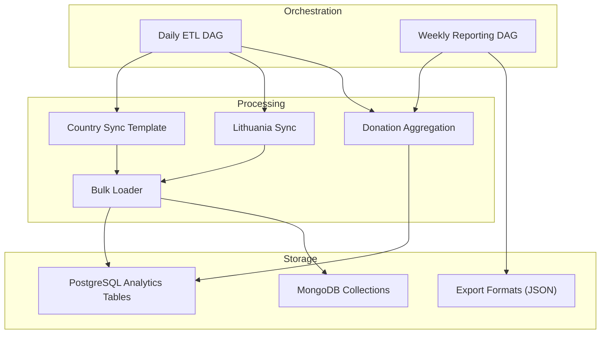
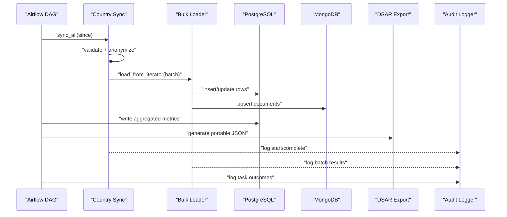
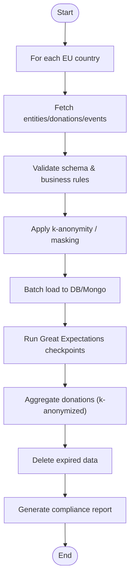
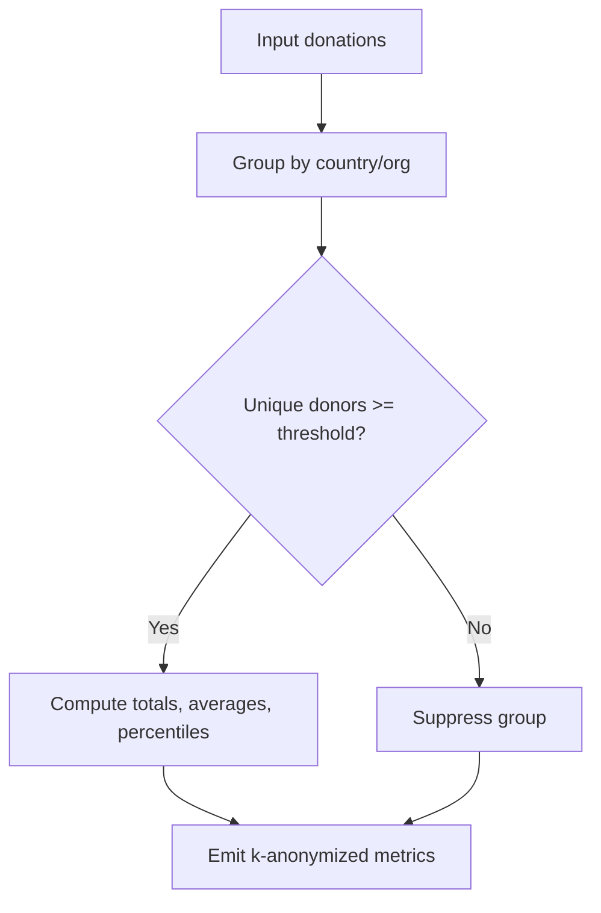
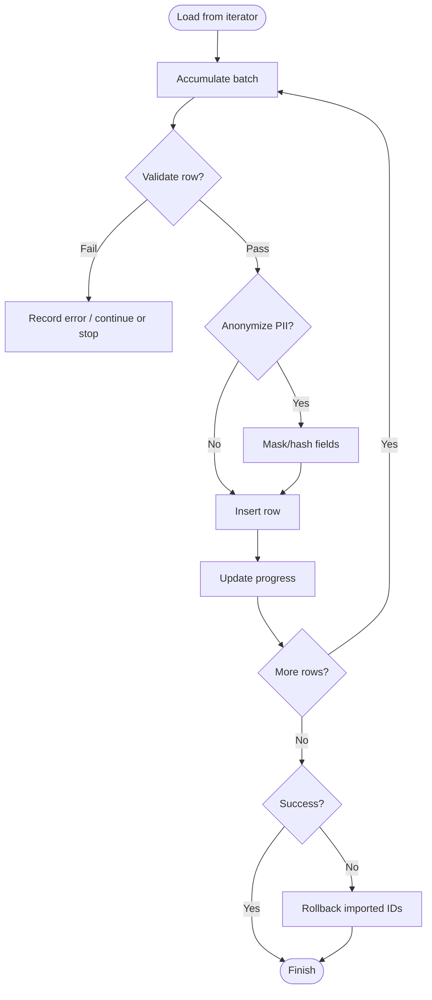
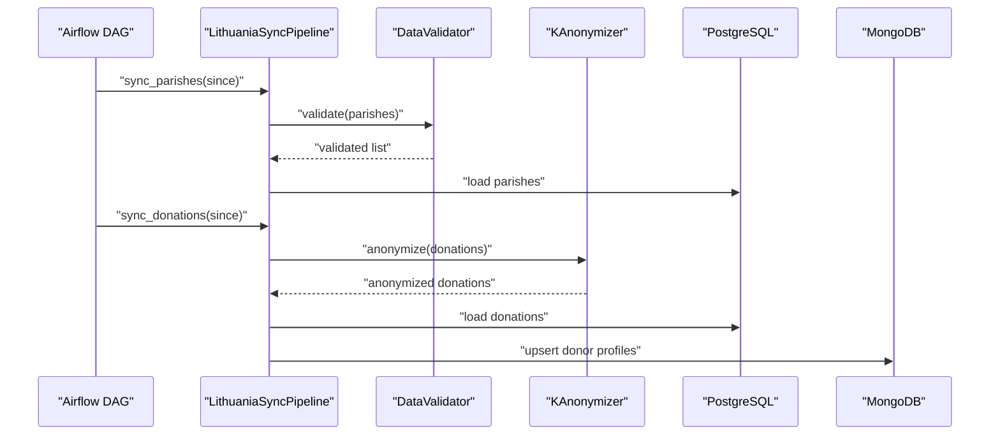
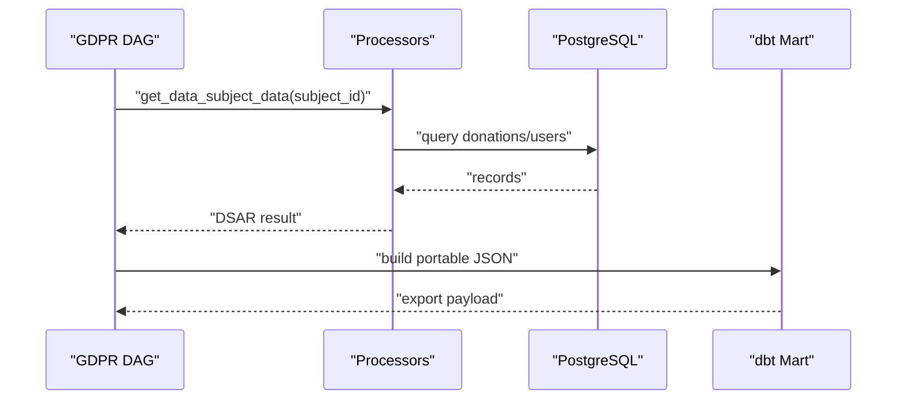
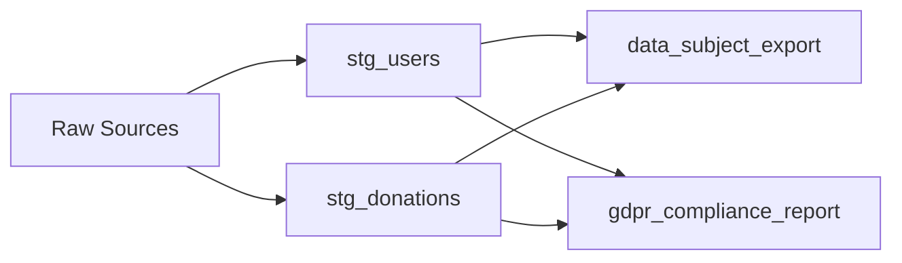
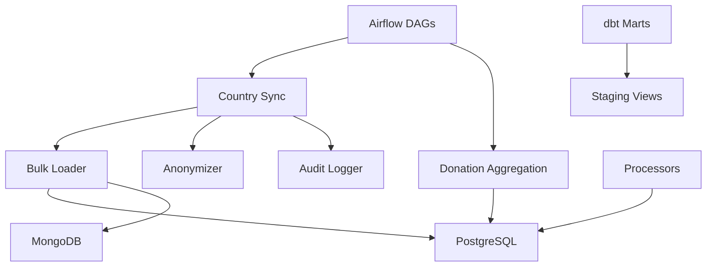

# Data Loading Layer

<cite>
**Referenced Files in This Document**
- [jol_hub_etl.py](file://data/airflow/dags/jol_hub_etl.py)
- [jol_daily_sync.py](file://data/airflow/dags/jol_daily_sync.py)
- [jol_weekly_reporting.py](file://data/airflow/dags/jol_weekly_reporting.py)
- [daily_aggregation.py](file://data/src/pipelines/donation_analytics/daily_aggregation.py)
- [bulk_loader.py](file://data/src/pipelines/entity_import/bulk_loader.py)
- [template_sync.py](file://data/src/pipelines/country_sync/template_sync.py)
- [lt_sync.py](file://data/src/pipelines/country_sync/lt_sync.py)
- [processors.py](file://data/src/processors.py)
- [config.py](file://data/src/config.py)
- [anonymizer.py](file://data/src/gdpr/anonymizer.py)
- [audit.py](file://data/src/audit.py)
- [stg_donations.sql](file://data/dbt/models/staging/stg_donations.sql)
- [stg_users.sql](file://data/dbt/models/staging/stg_users.sql)
- [data_subject_export.sql](file://data/dbt/models/marts/data_subject_export.sql)
- [gdpr_compliance_report.sql](file://data/dbt/models/marts/gdpr_compliance_report.sql)
</cite>

## Table of Contents
1. Introduction
2. Project Structure
3. Core Components
4. Architecture Overview
5. Detailed Component Analysis
6. Dependency Analysis
7. Performance Considerations
8. Troubleshooting Guide
9. Conclusion
10. Appendices

## Introduction
This document describes the data loading layer for JOL-HUB ETL pipelines. It explains how transformed data is loaded into target systems (PostgreSQL analytics tables, MongoDB collections via backend integrations, and export formats for data subject requests), outlines daily synchronization and weekly reporting workflows, and details batch loading strategies, incremental updates, conflict resolution, integrity checks, rollback procedures, monitoring, and performance optimizations for large datasets and concurrent loads.

## Project Structure
The data loading layer spans orchestration (Airflow DAGs), processing (Python modules), staging and marts (dbt SQL), and compliance/export utilities. Key areas:
- Orchestration: Daily and weekly Airflow DAGs trigger country syncs, donation aggregation, quality checks, retention cleanup, and compliance reporting.
- Processing: Country-specific sync templates and implementations fetch, validate, anonymize, and load data; bulk loaders provide batched imports with rollback and audit.
- Staging/Marts: dbt models define GDPR-compliant staging views and marts for exports and compliance reports.
- Compliance: K-anonymization, audit logging with hash chains, and DSAR support.

**Diagram sources**
- [jol_daily_sync.py:83-126](file://data/airflow/dags/jol_daily_sync.py#L83-L126)
- [jol_weekly_reporting.py:52-78](file://data/airflow/dags/jol_weekly_reporting.py#L52-L78)
- [template_sync.py:84-127](file://data/src/pipelines/country_sync/template_sync.py#L84-L127)
- [lt_sync.py:72-140](file://data/src/pipelines/country_sync/lt_sync.py#L72-L140)
- [daily_aggregation.py:62-142](file://data/src/pipelines/donation_analytics/daily_aggregation.py#L62-L142)
- [bulk_loader.py:72-151](file://data/src/pipelines/entity_import/bulk_loader.py#L72-L151)

**Section sources**
- [jol_daily_sync.py:83-126](file://data/airflow/dags/jol_daily_sync.py#L83-L126)
- [jol_weekly_reporting.py:52-78](file://data/airflow/dags/jol_weekly_reporting.py#L52-L78)
- [template_sync.py:84-127](file://data/src/pipelines/country_sync/template_sync.py#L84-L127)
- [lt_sync.py:72-140](file://data/src/pipelines/country_sync/lt_sync.py#L72-L140)
- [daily_aggregation.py:62-142](file://data/src/pipelines/donation_analytics/daily_aggregation.py#L62-L142)
- [bulk_loader.py:72-151](file://data/src/pipelines/entity_import/bulk_loader.py#L72-L151)

## Core Components
- Airflow DAGs:
  - Daily ETL orchestrates per-country syncs, data quality checks, donation aggregation, retention cleanup, and compliance reporting.
  - Weekly reporting aggregates trends, country metrics, and compliance scorecards.
  - A separate DAG supports GDPR data subject request processing (access, erasure, portability).
- Country Synchronization:
  - Template defines a standard pipeline structure; Lithuania implementation demonstrates fetching, validating, anonymizing, and loading donations and entities.
- Donation Analytics:
  - Aggregates donations by country/organization with k-anonymity thresholds and suppresses small groups to protect privacy.
- Bulk Loader:
  - Batch import with progress tracking, validation, optional PII anonymization, rollback on failure, and audit logging.
- Processors:
  - Donation and User processors implement data transformations, storage calls, and DSAR operations with retention-aware deletion.
- dbt Models:
  - Staging views mask PII and add classification/retention fields; marts produce portable exports and compliance reports.
- Anonymizer:
  - Country-specific k-anonymity thresholds and hashing of direct identifiers.
- Audit Logger:
  - Immutable, signed, chained audit logs with verification tools and compliance report generation.

**Section sources**
- [jol_hub_etl.py:73-113](file://data/airflow/dags/jol_hub_etl.py#L73-L113)
- [jol_daily_sync.py:83-126](file://data/airflow/dags/jol_daily_sync.py#L83-L126)
- [jol_weekly_reporting.py:52-78](file://data/airflow/dags/jol_weekly_reporting.py#L52-L78)
- [template_sync.py:84-127](file://data/src/pipelines/country_sync/template_sync.py#L84-L127)
- [lt_sync.py:72-140](file://data/src/pipelines/country_sync/lt_sync.py#L72-L140)
- [daily_aggregation.py:62-142](file://data/src/pipelines/donation_analytics/daily_aggregation.py#L62-L142)
- [bulk_loader.py:72-151](file://data/src/pipelines/entity_import/bulk_loader.py#L72-L151)
- [processors.py:223-503](file://data/src/processors.py#L223-L503)
- [stg_donations.sql:4-35](file://data/dbt/models/staging/stg_donations.sql#L4-L35)
- [stg_users.sql:4-49](file://data/dbt/models/staging/stg_users.sql#L4-L49)
- [data_subject_export.sql:4-55](file://data/dbt/models/marts/data_subject_export.sql#L4-L55)
- [gdpr_compliance_report.sql:4-68](file://data/dbt/models/marts/gdpr_compliance_report.sql#L4-L68)
- [anonymizer.py:106-143](file://data/src/gdpr/anonymizer.py#L106-L143)
- [audit.py:205-369](file://data/src/audit.py#L205-L369)

## Architecture Overview
End-to-end flow from ingestion to target stores:
- Airflow triggers country syncs and analytics tasks.
- Country syncs fetch source data, validate, apply k-anonymity, and load via bulk loader.
- Donation aggregation computes k-anonymized metrics and writes to PostgreSQL analytics tables.
- dbt staging/marts prepare compliant views and exports.
- Audit logger records every step with chain integrity.

**Diagram sources**
- [jol_daily_sync.py:83-126](file://data/airflow/dags/jol_daily_sync.py#L83-L126)
- [template_sync.py:84-127](file://data/src/pipelines/country_sync/template_sync.py#L84-L127)
- [lt_sync.py:72-140](file://data/src/pipelines/country_sync/lt_sync.py#L72-L140)
- [bulk_loader.py:96-151](file://data/src/pipelines/entity_import/bulk_loader.py#L96-L151)
- [daily_aggregation.py:82-142](file://data/src/pipelines/donation_analytics/daily_aggregation.py#L82-L142)
- [data_subject_export.sql:4-55](file://data/dbt/models/marts/data_subject_export.sql#L4-L55)
- [audit.py:330-369](file://data/src/audit.py#L330-L369)

## Detailed Component Analysis

### Daily Synchronization Pipeline
- Triggers per-country syncs, runs data quality checks, aggregates donations, enforces retention, and generates compliance reports.
- Each country sync follows a consistent pattern: fetch, validate, anonymize, load, and audit.

**Diagram sources**
- [jol_daily_sync.py:83-126](file://data/airflow/dags/jol_daily_sync.py#L83-L126)
- [template_sync.py:84-127](file://data/src/pipelines/country_sync/template_sync.py#L84-L127)
- [daily_aggregation.py:82-142](file://data/src/pipelines/donation_analytics/daily_aggregation.py#L82-L142)

**Section sources**
- [jol_daily_sync.py:83-126](file://data/airflow/dags/jol_daily_sync.py#L83-L126)
- [template_sync.py:84-127](file://data/src/pipelines/country_sync/template_sync.py#L84-L127)

### Donation Analytics Aggregation
- Groups donations by country and organization type, applies k-anonymity thresholds, suppresses small groups, calculates percentiles, and produces anonymized metrics.

**Diagram sources**
- [daily_aggregation.py:112-142](file://data/src/pipelines/donation_analytics/daily_aggregation.py#L112-L142)
- [daily_aggregation.py:170-214](file://data/src/pipelines/donation_analytics/daily_aggregation.py#L170-L214)

**Section sources**
- [daily_aggregation.py:62-142](file://data/src/pipelines/donation_analytics/daily_aggregation.py#L62-L142)
- [daily_aggregation.py:170-214](file://data/src/pipelines/donation_analytics/daily_aggregation.py#L170-L214)

### Bulk Loader and Rollback Strategy
- Processes data in configurable batches, validates rows, optionally anonymizes PII, inserts to targets, tracks progress, and rolls back on failure.

**Diagram sources**
- [bulk_loader.py:96-151](file://data/src/pipelines/entity_import/bulk_loader.py#L96-L151)
- [bulk_loader.py:160-229](file://data/src/pipelines/entity_import/bulk_loader.py#L160-L229)

**Section sources**
- [bulk_loader.py:72-151](file://data/src/pipelines/entity_import/bulk_loader.py#L72-L151)
- [bulk_loader.py:160-229](file://data/src/pipelines/entity_import/bulk_loader.py#L160-L229)

### Country-Specific Sync (Lithuania Example)
- Demonstrates fetching parishes and donations, validating, applying k-anonymity, and loading to targets with full audit trails.

**Diagram sources**
- [lt_sync.py:72-140](file://data/src/pipelines/country_sync/lt_sync.py#L72-L140)
- [lt_sync.py:147-179](file://data/src/pipelines/country_sync/lt_sync.py#L147-L179)
- [anonymizer.py:106-143](file://data/src/gdpr/anonymizer.py#L106-L143)

**Section sources**
- [lt_sync.py:72-140](file://data/src/pipelines/country_sync/lt_sync.py#L72-L140)
- [lt_sync.py:147-179](file://data/src/pipelines/country_sync/lt_sync.py#L147-L179)

### Data Subject Requests (Access, Erasure, Portability)
- Access: Retrieves all personal data for a subject across processors and returns in portable format.
- Erasure: Soft-deletes or anonymizes records respecting legal retention (e.g., 7-year financial records).
- Portability: Generates JSON export aggregating user and donation data.

**Diagram sources**
- [jol_hub_etl.py:117-213](file://data/airflow/dags/jol_hub_etl.py#L117-L213)
- [processors.py:282-379](file://data/src/processors.py#L282-L379)
- [processors.py:570-666](file://data/src/processors.py#L570-L666)
- [data_subject_export.sql:4-55](file://data/dbt/models/marts/data_subject_export.sql#L4-L55)

**Section sources**
- [jol_hub_etl.py:117-213](file://data/airflow/dags/jol_hub_etl.py#L117-L213)
- [processors.py:282-379](file://data/src/processors.py#L282-L379)
- [processors.py:570-666](file://data/src/processors.py#L570-L666)
- [data_subject_export.sql:4-55](file://data/dbt/models/marts/data_subject_export.sql#L4-L55)

### Staging and Marts for Compliance and Exports
- Staging views mask PII, add classification and retention expiry fields.
- Marts aggregate user and donation data for portable exports and generate compliance reports with retention status.

**Diagram sources**
- [stg_users.sql:4-49](file://data/dbt/models/staging/stg_users.sql#L4-L49)
- [stg_donations.sql:4-35](file://data/dbt/models/staging/stg_donations.sql#L4-L35)
- [data_subject_export.sql:4-55](file://data/dbt/models/marts/data_subject_export.sql#L4-L55)
- [gdpr_compliance_report.sql:4-68](file://data/dbt/models/marts/gdpr_compliance_report.sql#L4-L68)

**Section sources**
- [stg_users.sql:4-49](file://data/dbt/models/staging/stg_users.sql#L4-L49)
- [stg_donations.sql:4-35](file://data/dbt/models/staging/stg_donations.sql#L4-L35)
- [data_subject_export.sql:4-55](file://data/dbt/models/marts/data_subject_export.sql#L4-L55)
- [gdpr_compliance_report.sql:4-68](file://data/dbt/models/marts/gdpr_compliance_report.sql#L4-L68)

## Dependency Analysis
Key dependencies and relationships:
- Airflow DAGs depend on Python modules for country syncs, donation aggregation, and bulk loading.
- Country syncs rely on validators, anonymizers, and audit logger.
- Processors interact directly with PostgreSQL for DSAR operations.
- dbt models depend on staging views and produce marts for exports and compliance.

**Diagram sources**
- [jol_daily_sync.py:83-126](file://data/airflow/dags/jol_daily_sync.py#L83-L126)
- [daily_aggregation.py:62-142](file://data/src/pipelines/donation_analytics/daily_aggregation.py#L62-L142)
- [bulk_loader.py:72-151](file://data/src/pipelines/entity_import/bulk_loader.py#L72-L151)
- [processors.py:223-503](file://data/src/processors.py#L223-L503)
- [stg_donations.sql:4-35](file://data/dbt/models/staging/stg_donations.sql#L4-L35)
- [stg_users.sql:4-49](file://data/dbt/models/staging/stg_users.sql#L4-L49)

**Section sources**
- [jol_daily_sync.py:83-126](file://data/airflow/dags/jol_daily_sync.py#L83-L126)
- [daily_aggregation.py:62-142](file://data/src/pipelines/donation_analytics/daily_aggregation.py#L62-L142)
- [bulk_loader.py:72-151](file://data/src/pipelines/entity_import/bulk_loader.py#L72-L151)
- [processors.py:223-503](file://data/src/processors.py#L223-L503)

## Performance Considerations
- Batch sizing: Configure batch_size in bulk loader to balance throughput and memory usage; larger batches improve throughput but increase memory footprint.
- Incremental syncs: Use since timestamps in country syncs to limit data volume and reduce load times.
- K-anonymity thresholds: Adjust k values per country to meet regulatory guidance while controlling suppression rates.
- Concurrency: Airflow TaskGroups enable parallel execution per country; tune worker concurrency to match resource capacity.
- Database optimization: Ensure indexes on frequently filtered columns (e.g., donor_id, created_at) and use upsert patterns to avoid duplicate writes.
- Monitoring: Leverage audit logs and DAG metrics to detect bottlenecks and failures early.

[No sources needed since this section provides general guidance]

## Troubleshooting Guide
Common issues and remedies:
- Import failures: Bulk loader records errors per row; configure stop_on_error and max_errors to control behavior. Review progress and error lists for root causes.
- Rollbacks: On exceptions, enabled rollback deletes previously inserted IDs; verify _delete_row implementation for actual targets.
- DSAR failures: Processors log detailed errors; check database connectivity and query correctness.
- Chain integrity: Use audit logger verification to detect tampering or sequence gaps; investigate any chain breaks.
- Retention enforcement: Ensure cleanup tasks run successfully; monitor logs for skipped deletions due to legal holds.

**Section sources**
- [bulk_loader.py:160-229](file://data/src/pipelines/entity_import/bulk_loader.py#L160-L229)
- [processors.py:381-503](file://data/src/processors.py#L381-L503)
- [audit.py:513-589](file://data/src/audit.py#L513-L589)

## Conclusion
The data loading layer integrates orchestrated daily and weekly workflows with robust batch loading, k-anonymization, and comprehensive audit trails. It supports PostgreSQL analytics, MongoDB collections, and GDPR-compliant exports. With incremental syncs, configurable batching, and strong integrity checks, it scales to large datasets while maintaining compliance and reliability.

[No sources needed since this section summarizes without analyzing specific files]

## Appendices

### Examples of Loaded Outputs
- Processed donations: Loaded via bulk loader after validation and anonymization; stored in PostgreSQL and mirrored to MongoDB for flexible queries.
- Aggregated metrics: Produced by donation analytics pipeline with k-anonymity and percentiles; written to analytics tables for reporting.
- Compliance reports: Generated via dbt marts and audit logger summaries; include retention status and activity metrics.

**Section sources**
- [bulk_loader.py:287-320](file://data/src/pipelines/entity_import/bulk_loader.py#L287-L320)
- [daily_aggregation.py:170-214](file://data/src/pipelines/donation_analytics/daily_aggregation.py#L170-L214)
- [gdpr_compliance_report.sql:4-68](file://data/dbt/models/marts/gdpr_compliance_report.sql#L4-L68)
- [audit.py:475-511](file://data/src/audit.py#L475-L511)