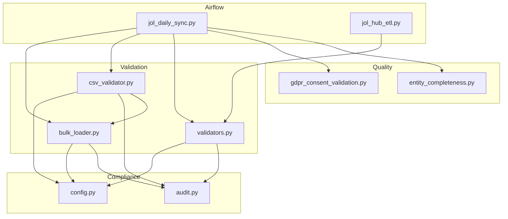
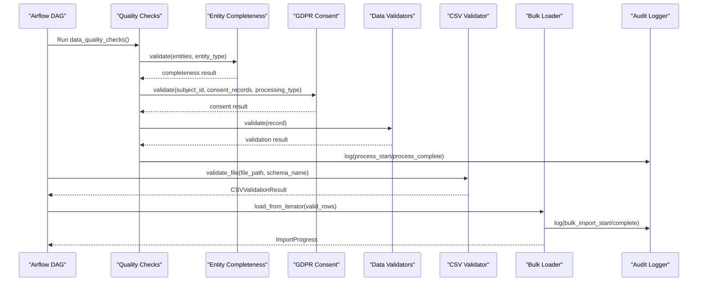
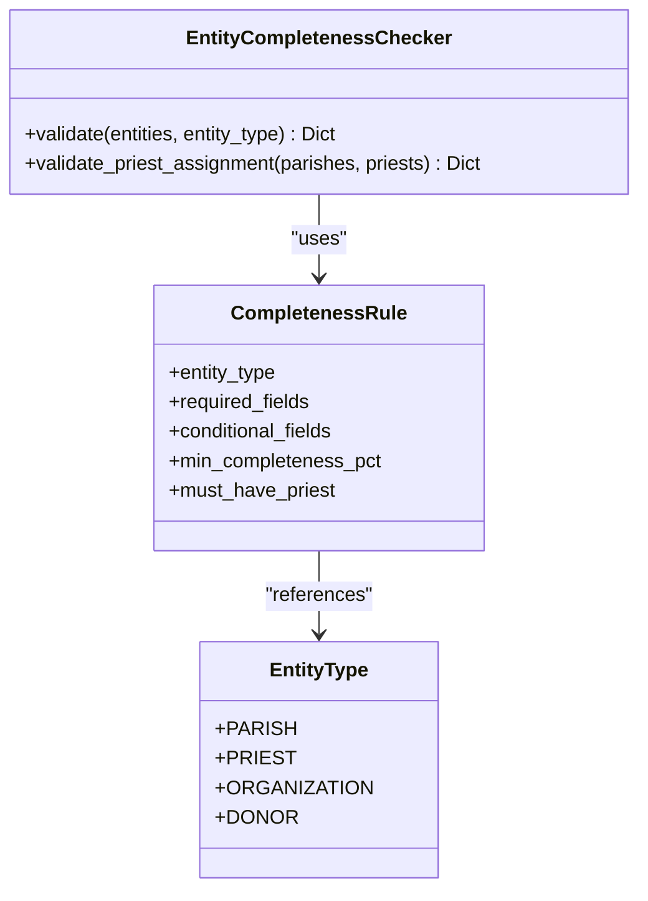
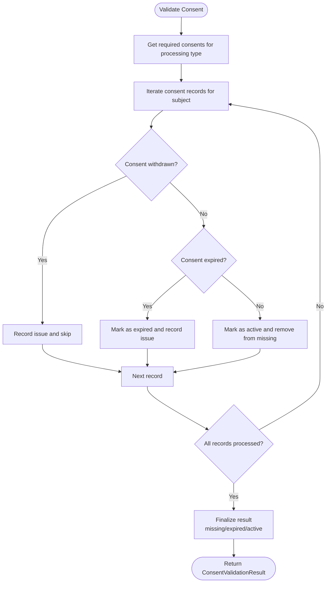
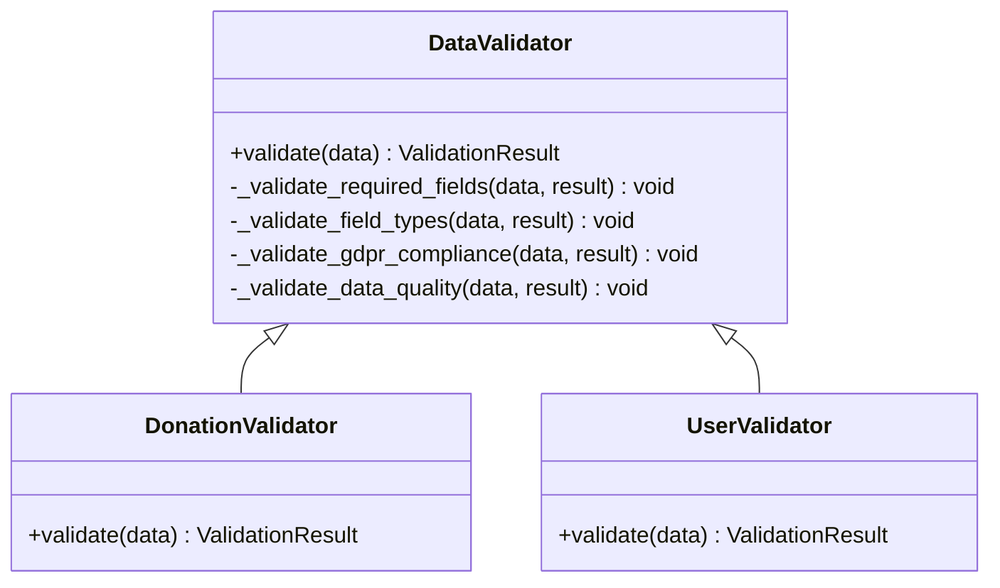
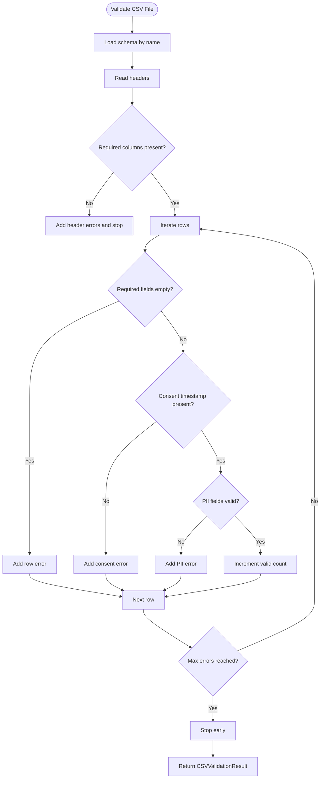
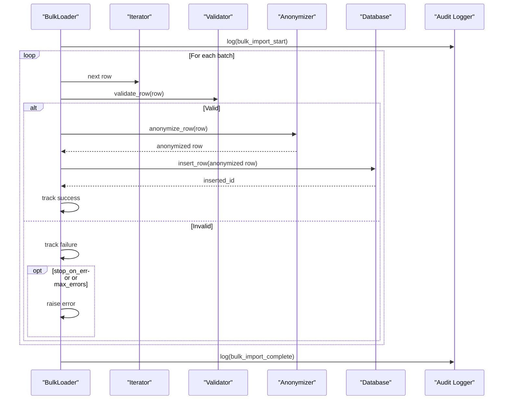
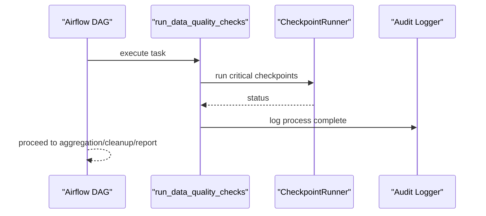
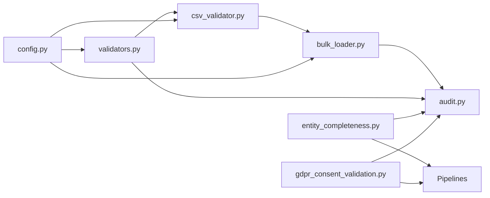

# Data Quality & Validation

<cite>
**Referenced Files in This Document**
- [entity_completeness.py](file://data/src/quality/expectations/entity_completeness.py)
- [gdpr_consent_validation.py](file://data/src/quality/expectations/gdpr_consent_validation.py)
- [validators.py](file://data/src/validators.py)
- [csv_validator.py](file://data/src/pipelines/entity_import/csv_validator.py)
- [bulk_loader.py](file://data/src/pipelines/entity_import/bulk_loader.py)
- [audit.py](file://data/src/audit.py)
- [config.py](file://data/src/config.py)
- [jol_daily_sync.py](file://data/airflow/dags/jol_daily_sync.py)
- [jol_hub_etl.py](file://data/airflow/dags/jol_hub_etl.py)
</cite>

## Table of Contents
1. Introduction
2. Project Structure
3. Core Components
4. Architecture Overview
5. Detailed Component Analysis
6. Dependency Analysis
7. Performance Considerations
8. Troubleshooting Guide
9. Conclusion

## Introduction
This document explains the data quality and validation processes used in JOL-HUB ETL pipelines. It covers:
- Automated data quality checks for entity completeness and GDPR consent verification
- Checkpoint orchestration within Airflow DAGs
- Custom validators for donations, users, and organizational entities
- Schema validation and referential integrity checks during bulk imports
- Failure handling, alerting, and remediation workflows
- Performance considerations and optimization techniques for large-scale validation

The system integrates Great Expectations-style expectations via dedicated expectation modules and enforces compliance through structured validators and audit logging.

## Project Structure
Quality-related code is organized under data/src/quality with expectation modules for entity completeness and GDPR consent. Bulk import validation lives under data/src/pipelines/entity_import. Validators are centralized in data/src/validators.py. Audit logging and configuration support compliance and operational visibility. Airflow DAGs orchestrate daily sync and quality checks.

**Diagram sources**
- [jol_daily_sync.py:35-41](file://data/airflow/dags/jol_daily_sync.py#L35-L41)
- [jol_hub_etl.py:35-41](file://data/airflow/dags/jol_hub_etl.py#L35-L41)
- [entity_completeness.py:81-166](file://data/src/quality/expectations/entity_completeness.py#L81-L166)
- [gdpr_consent_validation.py:52-142](file://data/src/quality/expectations/gdpr_consent_validation.py#L52-L142)
- [validators.py:75-269](file://data/src/validators.py#L75-L269)
- [csv_validator.py:120-210](file://data/src/pipelines/entity_import/csv_validator.py#L120-L210)
- [bulk_loader.py:72-151](file://data/src/pipelines/entity_import/bulk_loader.py#L72-L151)
- [audit.py:205-369](file://data/src/audit.py#L205-L369)
- [config.py:12-27](file://data/src/config.py#L12-L27)

**Section sources**
- [jol_daily_sync.py:35-41](file://data/airflow/dags/jol_daily_sync.py#L35-L41)
- [jol_hub_etl.py:35-41](file://data/airflow/dags/jol_hub_etl.py#L35-L41)
- [entity_completeness.py:81-166](file://data/src/quality/expectations/entity_completeness.py#L81-L166)
- [gdpr_consent_validation.py:52-142](file://data/src/quality/expectations/gdpr_consent_validation.py#L52-L142)
- [validators.py:75-269](file://data/src/validators.py#L75-L269)
- [csv_validator.py:120-210](file://data/src/pipelines/entity_import/csv_validator.py#L120-L210)
- [bulk_loader.py:72-151](file://data/src/pipelines/entity_import/bulk_loader.py#L72-L151)
- [audit.py:205-369](file://data/src/audit.py#L205-L369)
- [config.py:12-27](file://data/src/config.py#L12-L27)

## Core Components
- Entity Completeness Checker: Validates required and conditional fields per entity type and enforces minimum completeness thresholds; includes cross-entity checks such as parish-to-priest assignment.
- GDPR Consent Validator: Verifies consent records for processing types, checks expiry and withdrawal status, and produces compliance statistics.
- Data Validators: Base and domain-specific validators (DonationValidator, UserValidator) enforce schema, format, GDPR-sensitive content detection, and business rules.
- CSV Validator: Pre-import validation against schemas, PII classification, consent requirements, and row-level checks; supports streaming iteration for large files.
- Bulk Loader: Batched ingestion with progress tracking, optional rollback, anonymization hooks, and audit logging.
- Audit Logger: Immutable, signed audit log chain for tamper detection and compliance reporting.
- Configuration: Retention policies and module settings that influence validation behavior and retention-driven cleanup.

**Section sources**
- [entity_completeness.py:81-166](file://data/src/quality/expectations/entity_completeness.py#L81-L166)
- [gdpr_consent_validation.py:52-142](file://data/src/quality/expectations/gdpr_consent_validation.py#L52-L142)
- [validators.py:75-269](file://data/src/validators.py#L75-L269)
- [csv_validator.py:120-210](file://data/src/pipelines/entity_import/csv_validator.py#L120-L210)
- [bulk_loader.py:72-151](file://data/src/pipelines/entity_import/bulk_loader.py#L72-L151)
- [audit.py:205-369](file://data/src/audit.py#L205-L369)
- [config.py:20-27](file://data/src/config.py#L20-L27)

## Architecture Overview
The daily pipeline orchestrates country data sync, runs data quality checks, aggregates donations, performs retention cleanup, and generates compliance reports. Quality checks invoke expectation suites and custom validators. Import paths validate CSVs before bulk loading, with anonymization and audit logging.

**Diagram sources**
- [jol_daily_sync.py:35-41](file://data/airflow/dags/jol_daily_sync.py#L35-L41)
- [entity_completeness.py:95-166](file://data/src/quality/expectations/entity_completeness.py#L95-L166)
- [gdpr_consent_validation.py:77-142](file://data/src/quality/expectations/gdpr_consent_validation.py#L77-L142)
- [validators.py:101-119](file://data/src/validators.py#L101-L119)
- [csv_validator.py:135-210](file://data/src/pipelines/entity_import/csv_validator.py#L135-L210)
- [bulk_loader.py:96-151](file://data/src/pipelines/entity_import/bulk_loader.py#L96-L151)
- [audit.py:330-369](file://data/src/audit.py#L330-L369)

## Detailed Component Analysis

### Entity Completeness Validation
- Purpose: Ensure parishes, priests, organizations, and donors meet completeness thresholds and conditional field rules; verify cross-entity relationships like parish-to-priest assignment.
- Key behaviors:
  - Required field presence per entity type
  - Conditional field enforcement based on other fields
  - Minimum completeness percentage threshold
  - Cross-entity validation for priest assignments to parishes

**Diagram sources**
- [entity_completeness.py:14-33](file://data/src/quality/expectations/entity_completeness.py#L14-L33)
- [entity_completeness.py:81-166](file://data/src/quality/expectations/entity_completeness.py#L81-L166)
- [entity_completeness.py:168-189](file://data/src/quality/expectations/entity_completeness.py#L168-L189)

**Section sources**
- [entity_completeness.py:81-166](file://data/src/quality/expectations/entity_completeness.py#L81-L166)
- [entity_completeness.py:168-189](file://data/src/quality/expectations/entity_completeness.py#L168-L189)

### GDPR Consent Verification
- Purpose: Validate consent records for specific processing types, ensuring they are active, not withdrawn, and not expired.
- Key behaviors:
  - Mapping from processing type to required consent types
  - Expiry check based on configured validity period
  - Batch validation across subjects and compliance statistics generation

**Diagram sources**
- [gdpr_consent_validation.py:77-142](file://data/src/quality/expectations/gdpr_consent_validation.py#L77-L142)
- [gdpr_consent_validation.py:144-150](file://data/src/quality/expectations/gdpr_consent_validation.py#L144-L150)
- [gdpr_consent_validation.py:152-172](file://data/src/quality/expectations/gdpr_consent_validation.py#L152-L172)
- [gdpr_consent_validation.py:174-211](file://data/src/quality/expectations/gdpr_consent_validation.py#L174-L211)

**Section sources**
- [gdpr_consent_validation.py:52-142](file://data/src/quality/expectations/gdpr_consent_validation.py#L52-L142)
- [gdpr_consent_validation.py:152-211](file://data/src/quality/expectations/gdpr_consent_validation.py#L152-L211)

### Custom Validators for Business Rules
- DonationValidator: Enforces required fields, positive amounts, currency validation, and suspicious large donation warnings.
- UserValidator: Ensures email presence and flags missing explicit consent fields.
- Base validation includes type checks, GDPR-sensitive content detection, and security checks (e.g., injection patterns).

**Diagram sources**
- [validators.py:75-119](file://data/src/validators.py#L75-L119)
- [validators.py:201-233](file://data/src/validators.py#L201-L233)
- [validators.py:236-269](file://data/src/validators.py#L236-L269)

**Section sources**
- [validators.py:75-119](file://data/src/validators.py#L75-L119)
- [validators.py:201-233](file://data/src/validators.py#L201-L233)
- [validators.py:236-269](file://data/src/validators.py#L236-L269)

### CSV Schema Validation and Referential Integrity
- Schema definitions classify columns by sensitivity (PII, sensitive, consent, business, public), define required and unique columns, and specify consent requirements.
- Row-level validation checks required fields, consent timestamps, and PII formats; supports streaming iteration for large files.
- Referential integrity: Unique column constraints (e.g., donation_id, parish_id) enforced at schema level; cross-entity checks can be added via loader or downstream validation.

**Diagram sources**
- [csv_validator.py:60-117](file://data/src/pipelines/entity_import/csv_validator.py#L60-L117)
- [csv_validator.py:135-210](file://data/src/pipelines/entity_import/csv_validator.py#L135-L210)
- [csv_validator.py:226-274](file://data/src/pipelines/entity_import/csv_validator.py#L226-L274)
- [csv_validator.py:320-339](file://data/src/pipelines/entity_import/csv_validator.py#L320-L339)

**Section sources**
- [csv_validator.py:60-117](file://data/src/pipelines/entity_import/csv_validator.py#L60-L117)
- [csv_validator.py:135-210](file://data/src/pipelines/entity_import/csv_validator.py#L135-L210)
- [csv_validator.py:226-274](file://data/src/pipelines/entity_import/csv_validator.py#L226-L274)
- [csv_validator.py:320-339](file://data/src/pipelines/entity_import/csv_validator.py#L320-L339)

### Bulk Loading with Anonymization and Rollback
- Batch processing with configurable batch size, progress tracking, and optional rollback on failure.
- Optional PII anonymization via K-anonymity for donor information in donations; masking for emails in parish data.
- Audit logging for start and completion events with metadata including success/failure counts and duration.

**Diagram sources**
- [bulk_loader.py:96-151](file://data/src/pipelines/entity_import/bulk_loader.py#L96-L151)
- [bulk_loader.py:160-197](file://data/src/pipelines/entity_import/bulk_loader.py#L160-L197)
- [bulk_loader.py:259-320](file://data/src/pipelines/entity_import/bulk_loader.py#L259-L320)
- [audit.py:330-369](file://data/src/audit.py#L330-L369)

**Section sources**
- [bulk_loader.py:72-151](file://data/src/pipelines/entity_import/bulk_loader.py#L72-L151)
- [bulk_loader.py:160-197](file://data/src/pipelines/entity_import/bulk_loader.py#L160-L197)
- [bulk_loader.py:259-320](file://data/src/pipelines/entity_import/bulk_loader.py#L259-L320)
- [audit.py:330-369](file://data/src/audit.py#L330-L369)

### Airflow Orchestration of Quality Checks
- Daily DAG triggers country sync, runs data quality checks, aggregates donations, performs retention cleanup, and generates compliance reports.
- Quality checks task invokes a checkpoint runner placeholder; integration points exist for Great Expectations-style execution.

**Diagram sources**
- [jol_daily_sync.py:35-41](file://data/airflow/dags/jol_daily_sync.py#L35-L41)
- [audit.py:330-369](file://data/src/audit.py#L330-L369)

**Section sources**
- [jol_daily_sync.py:35-41](file://data/airflow/dags/jol_daily_sync.py#L35-L41)
- [audit.py:330-369](file://data/src/audit.py#L330-L369)

## Dependency Analysis
- Quality expectations depend on domain models and enums; they produce results consumed by pipeline tasks.
- Validators rely on configuration for retention and classification; they feed into CSV validation and bulk loaders.
- CSV validator depends on validators and encryption utilities; it yields validated rows to bulk loaders.
- Bulk loaders integrate anonymizers and database insertion logic; they emit audit events for compliance.
- Audit logger provides immutable logs used across components for traceability and reporting.

**Diagram sources**
- [entity_completeness.py:81-166](file://data/src/quality/expectations/entity_completeness.py#L81-L166)
- [gdpr_consent_validation.py:52-142](file://data/src/quality/expectations/gdpr_consent_validation.py#L52-L142)
- [validators.py:75-269](file://data/src/validators.py#L75-L269)
- [csv_validator.py:120-210](file://data/src/pipelines/entity_import/csv_validator.py#L120-L210)
- [bulk_loader.py:72-151](file://data/src/pipelines/entity_import/bulk_loader.py#L72-L151)
- [audit.py:205-369](file://data/src/audit.py#L205-L369)
- [config.py:12-27](file://data/src/config.py#L12-L27)

**Section sources**
- [entity_completeness.py:81-166](file://data/src/quality/expectations/entity_completeness.py#L81-L166)
- [gdpr_consent_validation.py:52-142](file://data/src/quality/expectations/gdpr_consent_validation.py#L52-L142)
- [validators.py:75-269](file://data/src/validators.py#L75-L269)
- [csv_validator.py:120-210](file://data/src/pipelines/entity_import/csv_validator.py#L120-L210)
- [bulk_loader.py:72-151](file://data/src/pipelines/entity_import/bulk_loader.py#L72-L151)
- [audit.py:205-369](file://data/src/audit.py#L205-L369)
- [config.py:12-27](file://data/src/config.py#L12-L27)

## Performance Considerations
- Streaming CSV validation: Use iterator-based validation to avoid loading entire files into memory; limit errors per row and cap total errors to prevent runaway processing.
- Batch sizing: Tune bulk loader batch sizes to balance throughput and memory usage; adjust max_errors and stop_on_error based on data reliability.
- Thresholds and sampling: Set completeness thresholds conservatively; consider sampling for expensive cross-entity checks when datasets are large.
- Consent expiry checks: Cache current time and minimize repeated datetime operations; batch consent validations where possible.
- Audit overhead: Keep audit logging efficient; use append-only logs and periodic rotation to reduce I/O pressure.

[No sources needed since this section provides general guidance]

## Troubleshooting Guide
Common issues and remedies:
- Missing required fields in CSV: Ensure schema-defined required columns are present; add consent timestamps for PII-bearing rows.
- Invalid email formats: Correct formatting or mask values; re-validate after fixes.
- Consent expired or withdrawn: Re-collect consent or restrict processing until valid consent is recorded; update consent records accordingly.
- Large donation anomalies: Investigate potential AML concerns; flag and review high-value transactions.
- Bulk import failures: Enable rollback to revert partial loads; inspect progress and error lists; adjust batch size and error limits.
- Audit integrity: Verify hash chain and signatures if tampering is suspected; regenerate chain state only with proper controls.

**Section sources**
- [csv_validator.py:226-274](file://data/src/pipelines/entity_import/csv_validator.py#L226-L274)
- [gdpr_consent_validation.py:77-142](file://data/src/quality/expectations/gdpr_consent_validation.py#L77-L142)
- [validators.py:201-233](file://data/src/validators.py#L201-L233)
- [bulk_loader.py:160-197](file://data/src/pipelines/entity_import/bulk_loader.py#L160-L197)
- [audit.py:513-589](file://data/src/audit.py#L513-L589)

## Conclusion
JOL-HUB’s data quality framework combines expectation-driven checks, robust validators, schema-aware CSV validation, and secure bulk ingestion with comprehensive audit logging. The Airflow DAGs orchestrate these steps to ensure GDPR compliance, data integrity, and operational reliability. By tuning thresholds, batching, and monitoring, teams can maintain high-quality data at scale while minimizing performance impact.

[No sources needed since this section summarizes without analyzing specific files]