# Data Transformation Layer

<cite>
**Referenced Files in This Document**
- [dbt_project.yml](file://data/dbt/dbt_project.yml)
- [profiles.yml](file://data/dbt/profiles.yml)
- [stg_donations.sql](file://data/dbt/models/staging/stg_donations.sql)
- [stg_users.sql](file://data/dbt/models/staging/stg_users.sql)
- [schema.yml](file://data/dbt/models/staging/schema.yml)
- [gdpr_compliance_report.sql](file://data/dbt/models/marts/gdpr_compliance_report.sql)
- [data_subject_export.sql](file://data/dbt/models/marts/data_subject_export.sql)
- [stg_entities.sql](file://data/src/transformations/staging/stg_entities.sql)
- [int_donation_trends.sql](file://data/src/transformations/intermediate/int_donation_trends.sql)
- [mart_canonical_compliance.sql](file://data/src/transformations/marts/mart_canonical_compliance.sql)
- [mart_country_metrics.sql](file://data/src/transformations/marts/mart_country_metrics.sql)
- [test_compliance.py](file://data/tests/test_compliance.py)
- [test_gdpr.py](file://data/tests/test_gdpr.py)
</cite>

## Table of Contents
1. [Introduction](#introduction)
2. [Project Structure](#project-structure)
3. [Core Components](#core-components)
4. [Architecture Overview](#architecture-overview)
5. [Detailed Component Analysis](#detailed-component-analysis)
6. [Dependency Analysis](#dependency-analysis)
7. [Performance Considerations](#performance-considerations)
8. [Troubleshooting Guide](#troubleshooting-guide)
9. [Conclusion](#conclusion)
10. [Appendices](#appendices)

## Introduction
This document describes the data transformation layer for JOL-HUB built with dbt and complementary SQL transformations. It focuses on:
- Staging transformations that clean, normalize, and protect sensitive data (donations, users, entities).
- Marts layer models that produce business-ready analytics and compliance outputs (canonical compliance reporting, country-specific metrics, GDPR portability exports).
- SQL patterns, data quality checks, validation rules, testing strategies, performance techniques, and debugging approaches used across the pipeline.

The design emphasizes GDPR compliance (consent handling, retention, k-anonymity), canonical reporting aligned with GDPR Articles, and multi-country aggregation with privacy safeguards.

## Project Structure
The transformation layer is organized into:
- dbt project configuration and profiles for database connectivity and model materialization.
- dbt staging models for raw-to-staged normalization and PII masking.
- dbt marts models for compliance reporting and data subject export.
- Additional SQL transformations under src/transformations for intermediate analytics and advanced marts.
- Tests and compliance validations to ensure correctness and regulatory adherence.

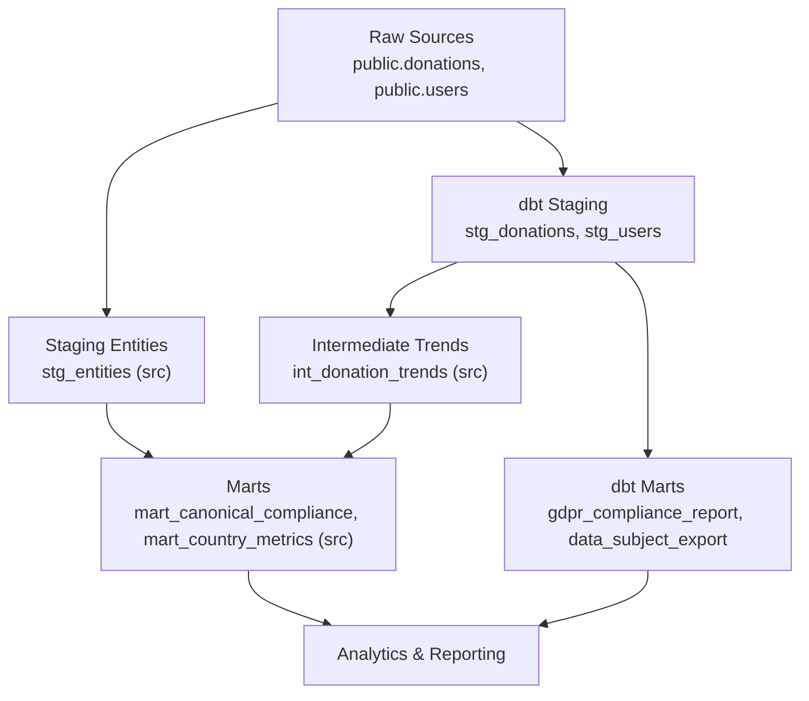

**Diagram sources**
- [dbt_project.yml:1-44](file://data/dbt/dbt_project.yml#L1-L44)
- [profiles.yml:1-26](file://data/dbt/profiles.yml#L1-L26)
- [stg_donations.sql:1-36](file://data/dbt/models/staging/stg_donations.sql#L1-L36)
- [stg_users.sql:1-50](file://data/dbt/models/staging/stg_users.sql#L1-L50)
- [stg_entities.sql:1-46](file://data/src/transformations/staging/stg_entities.sql#L1-L46)
- [int_donation_trends.sql:1-74](file://data/src/transformations/intermediate/int_donation_trends.sql#L1-L74)
- [mart_canonical_compliance.sql:1-115](file://data/src/transformations/marts/mart_canonical_compliance.sql#L1-L115)
- [mart_country_metrics.sql:1-96](file://data/src/transformations/marts/mart_country_metrics.sql#L1-L96)
- [gdpr_compliance_report.sql:1-68](file://data/dbt/models/marts/gdpr_compliance_report.sql#L1-L68)
- [data_subject_export.sql:1-55](file://data/dbt/models/marts/data_subject_export.sql#L1-L55)

**Section sources**
- [dbt_project.yml:1-44](file://data/dbt/dbt_project.yml#L1-L44)
- [profiles.yml:1-26](file://data/dbt/profiles.yml#L1-L26)

## Core Components
- Staging models:
  - stg_donations: Normalizes donation records, masks payment references unless explicitly allowed via variables, adds data classification and retention expiry.
  - stg_users: Masks emails and IP addresses by default, includes consent fields, adds retention expiry based on user activity or creation time.
  - stg_entities (src): Deduplicates entity records by recency/completeness and masks names when PII inclusion is disabled.
- Intermediate model:
  - int_donation_trends (src): Computes daily donation aggregates per country and organization type, applies k-anonymity thresholds, rolling averages, and week/month-over-month changes.
- Marts models:
  - gdpr_compliance_report (dbt): Aggregates processing activities (donations, users) with legal basis and retention windows; flags approaching retention expiry.
  - data_subject_export (dbt): Produces a portable dataset per data subject combining user profile and donations JSON array.
  - mart_canonical_compliance (src): Calculates an overall compliance score per organization based on GDPR articles and Canon Law requirements; identifies gaps.
  - mart_country_metrics (src): Country-level aggregated metrics with k-anonymity applied to donor counts and financial totals; maps codes to names.

Data quality and validation:
- Source schema tests enforce uniqueness, non-null constraints, and accepted currency values.
- K-anonymity enforced at intermediate and country metric layers to prevent re-identification.
- Retention policies integrated via variables and computed expiry timestamps.

**Section sources**
- [stg_donations.sql:1-36](file://data/dbt/models/staging/stg_donations.sql#L1-L36)
- [stg_users.sql:1-50](file://data/dbt/models/staging/stg_users.sql#L1-L50)
- [stg_entities.sql:1-46](file://data/src/transformations/staging/stg_entities.sql#L1-L46)
- [int_donation_trends.sql:1-74](file://data/src/transformations/intermediate/int_donation_trends.sql#L1-L74)
- [gdpr_compliance_report.sql:1-68](file://data/dbt/models/marts/gdpr_compliance_report.sql#L1-L68)
- [data_subject_export.sql:1-55](file://data/dbt/models/marts/data_subject_export.sql#L1-L55)
- [mart_canonical_compliance.sql:1-115](file://data/src/transformations/marts/mart_canonical_compliance.sql#L1-L115)
- [mart_country_metrics.sql:1-96](file://data/src/transformations/marts/mart_country_metrics.sql#L1-L96)
- [schema.yml:1-48](file://data/dbt/models/staging/schema.yml#L1-L48)

## Architecture Overview
The transformation architecture follows a layered approach:
- Raw sources are ingested into staging views for consistent cleaning and PII protection.
- Intermediate tables compute trend metrics with privacy-preserving aggregations.
- Marts deliver final analytics and compliance artifacts, including canonical compliance scores and country-level reports.

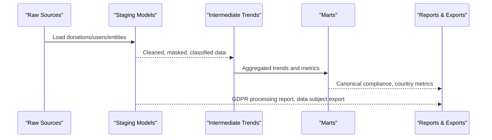

**Diagram sources**
- [stg_donations.sql:1-36](file://data/dbt/models/staging/stg_donations.sql#L1-L36)
- [stg_users.sql:1-50](file://data/dbt/models/staging/stg_users.sql#L1-L50)
- [stg_entities.sql:1-46](file://data/src/transformations/staging/stg_entities.sql#L1-L46)
- [int_donation_trends.sql:1-74](file://data/src/transformations/intermediate/int_donation_trends.sql#L1-L74)
- [mart_canonical_compliance.sql:1-115](file://data/src/transformations/marts/mart_canonical_compliance.sql#L1-L115)
- [mart_country_metrics.sql:1-96](file://data/src/transformations/marts/mart_country_metrics.sql#L1-L96)
- [gdpr_compliance_report.sql:1-68](file://data/dbt/models/marts/gdpr_compliance_report.sql#L1-L68)
- [data_subject_export.sql:1-55](file://data/dbt/models/marts/data_subject_export.sql#L1-L55)

## Detailed Component Analysis

### Staging: Donations (stg_donations)
- Purpose: Normalize raw donations, mask sensitive payment references unless include_pii is enabled, add data classification and retention expiry based on financial_retention_days variable.
- Key patterns:
  - Conditional masking using dbt vars for PII control.
  - Filtering out soft-deleted records.
  - Adding metadata for classification and retention.

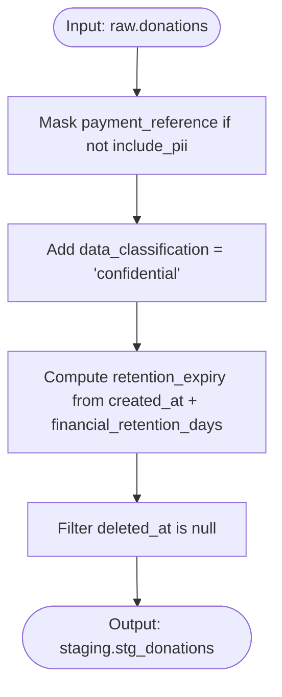

**Diagram sources**
- [stg_donations.sql:1-36](file://data/dbt/models/staging/stg_donations.sql#L1-L36)

**Section sources**
- [stg_donations.sql:1-36](file://data/dbt/models/staging/stg_donations.sql#L1-L36)

### Staging: Users (stg_users)
- Purpose: Normalize user records, mask emails and IPs by default, preserve consent fields, compute retention expiry based on last login or creation date.
- Key patterns:
  - Regex-based email masking and IP partial masking.
  - Inclusion of consent flags for marketing, analytics, third-party.
  - Retention calculation using user_data_retention_days variable.

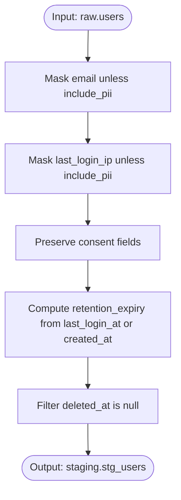

**Diagram sources**
- [stg_users.sql:1-50](file://data/dbt/models/staging/stg_users.sql#L1-L50)

**Section sources**
- [stg_users.sql:1-50](file://data/dbt/models/staging/stg_users.sql#L1-L50)

### Staging: Entities (stg_entities)
- Purpose: Deduplicate entity records by recency and completeness; mask names when PII inclusion is disabled.
- Key patterns:
  - Window function ranking by updated_at and presence of contact info.
  - Conditional name masking controlled by include_pii variable.
  - Soft-delete filtering.

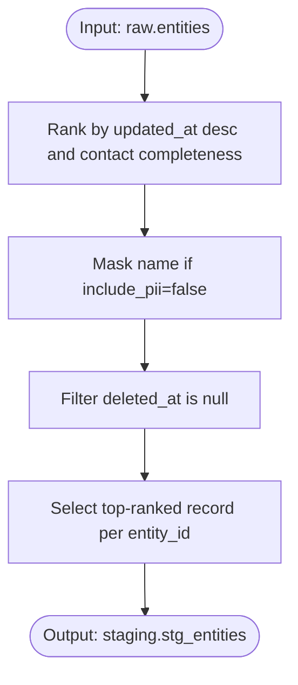

**Diagram sources**
- [stg_entities.sql:1-46](file://data/src/transformations/staging/stg_entities.sql#L1-L46)

**Section sources**
- [stg_entities.sql:1-46](file://data/src/transformations/staging/stg_entities.sql#L1-L46)

### Intermediate: Donation Trends (int_donation_trends)
- Purpose: Compute daily donation aggregates per country and organization type with k-anonymity, rolling averages, and WoW/MoM change percentages.
- Key patterns:
  - Grouping by day, country_code, organization_type.
  - K-anonymity filter requiring at least 5 unique donors per group.
  - Anonymized donor count rounded to nearest 5.
  - Rolling 7-day average and lag-based comparisons.

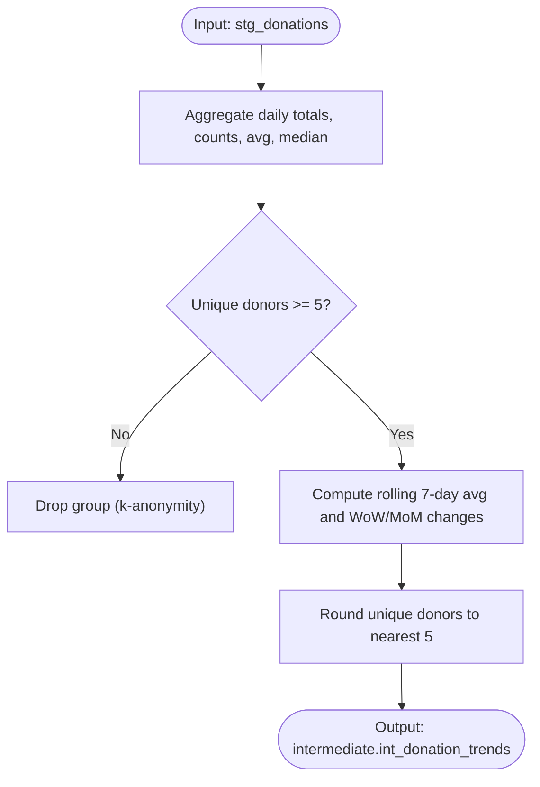

**Diagram sources**
- [int_donation_trends.sql:1-74](file://data/src/transformations/intermediate/int_donation_trends.sql#L1-L74)

**Section sources**
- [int_donation_trends.sql:1-74](file://data/src/transformations/intermediate/int_donation_trends.sql#L1-L74)

### Marts: Canonical Compliance Report (mart_canonical_compliance)
- Purpose: Calculate an overall compliance score per organization based on GDPR Articles (30, 7, 17, 32) and Canon Law registration; identify gaps for remediation.
- Key patterns:
  - Boolean flags for each requirement derived from source metrics.
  - Weighted scoring with explicit weights per article.
  - Status classification: COMPLIANT, PARTIALLY_COMPLIANT, AT_RISK, NON_COMPLIANT.
  - Gap columns indicating missing requirements.

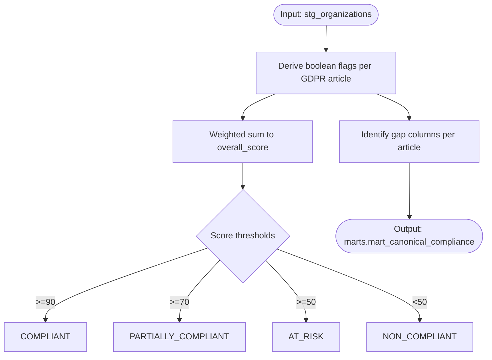

**Diagram sources**
- [mart_canonical_compliance.sql:1-115](file://data/src/transformations/marts/mart_canonical_compliance.sql#L1-L115)

**Section sources**
- [mart_canonical_compliance.sql:1-115](file://data/src/transformations/marts/mart_canonical_compliance.sql#L1-L115)

### Marts: Country Metrics (mart_country_metrics)
- Purpose: Produce country-level aggregated metrics with k-anonymity for financial and donor counts; map country codes to names.
- Key patterns:
  - Left join between entities and aggregated donations per country.
  - K-anonymity enforcement: minimum 5 unique donors required for donation aggregation.
  - Unique donors anonymized by rounding to nearest 5.
  - Entity counts filtered to satisfy k-anonymity threshold.

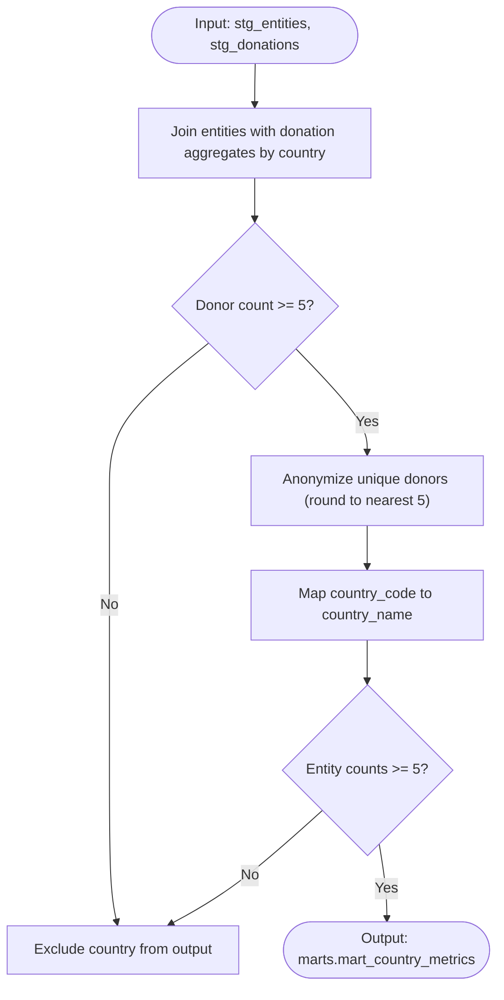

**Diagram sources**
- [mart_country_metrics.sql:1-96](file://data/src/transformations/marts/mart_country_metrics.sql#L1-L96)

**Section sources**
- [mart_country_metrics.sql:1-96](file://data/src/transformations/marts/mart_country_metrics.sql#L1-L96)

### Marts: GDPR Compliance Report (gdpr_compliance_report)
- Purpose: Summarize processing activities (donation_processing, user_management) with legal basis, record counts, and retention status.
- Key patterns:
  - Union of activity summaries from stg_donations and stg_users.
  - Legal basis annotations per activity.
  - Flagging records approaching retention expiry within 30 days.

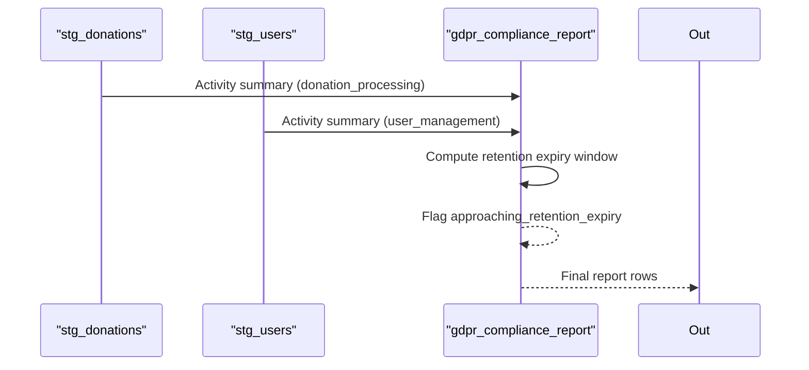

**Diagram sources**
- [gdpr_compliance_report.sql:1-68](file://data/dbt/models/marts/gdpr_compliance_report.sql#L1-L68)

**Section sources**
- [gdpr_compliance_report.sql:1-68](file://data/dbt/models/marts/gdpr_compliance_report.sql#L1-L68)

### Marts: Data Subject Export (data_subject_export)
- Purpose: Support GDPR Article 20 (Right to Data Portability) by aggregating user data and associated donations into a portable structure.
- Key patterns:
  - Left join user profile with aggregated donations JSON array.
  - Coalesce empty arrays for subjects without donations.
  - Include consent flags and account metadata.

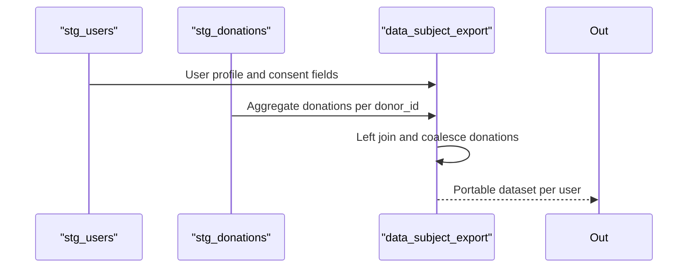

**Diagram sources**
- [data_subject_export.sql:1-55](file://data/dbt/models/marts/data_subject_export.sql#L1-L55)

**Section sources**
- [data_subject_export.sql:1-55](file://data/dbt/models/marts/data_subject_export.sql#L1-L55)

## Dependency Analysis
- dbt project configuration defines schemas and materializations:
  - staging views in schema staging.
  - marts tables in schema marts.
  - gdpr tables in schema gdpr_compliance.
- Profiles configure Postgres connections with environment variables and thread counts.
- Model dependencies:
  - gdpr_compliance_report depends on stg_donations and stg_users.
  - data_subject_export depends on stg_users and stg_donations.
  - mart_canonical_compliance depends on stg_organizations (referenced via ref).
  - mart_country_metrics depends on stg_entities and stg_donations.
  - int_donation_trends depends on stg_donations.

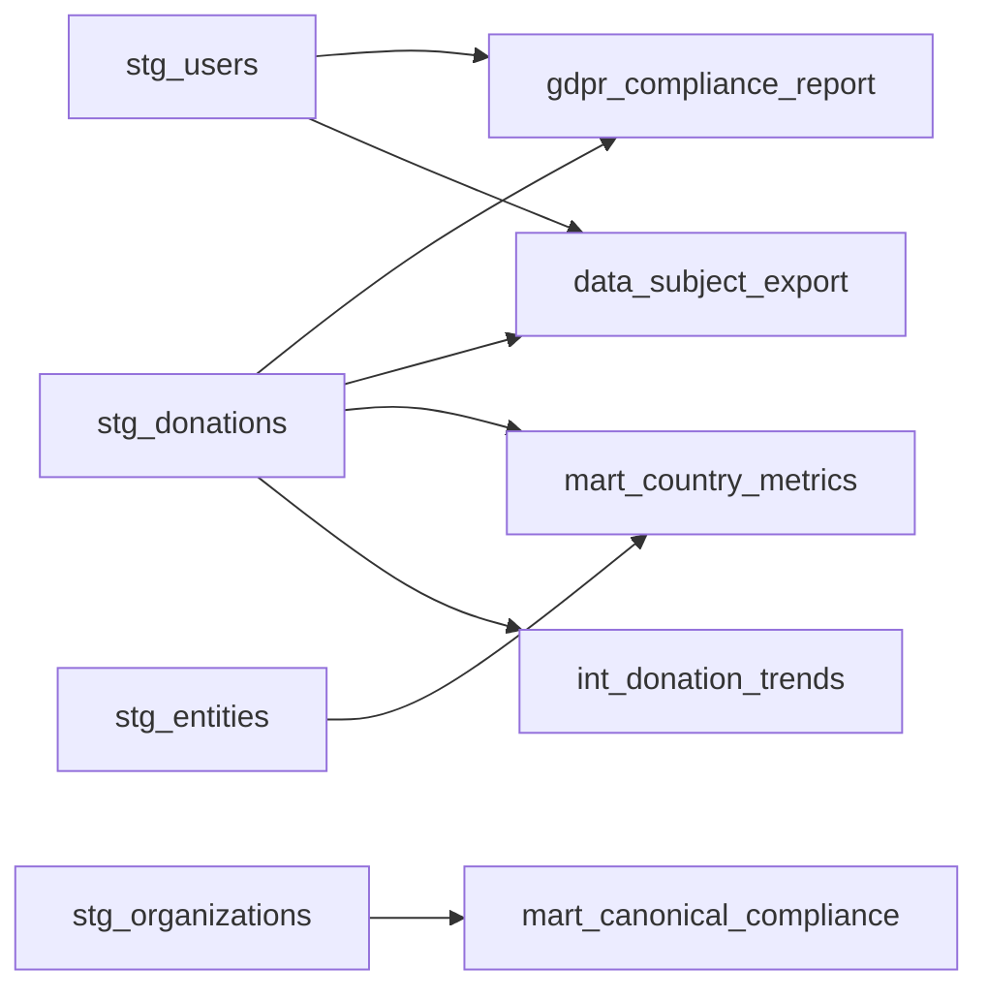

**Diagram sources**
- [dbt_project.yml:33-44](file://data/dbt/dbt_project.yml#L33-L44)
- [profiles.yml:1-26](file://data/dbt/profiles.yml#L1-L26)
- [gdpr_compliance_report.sql:10-34](file://data/dbt/models/marts/gdpr_compliance_report.sql#L10-L34)
- [data_subject_export.sql:13-40](file://data/dbt/models/marts/data_subject_export.sql#L13-L40)
- [mart_canonical_compliance.sql:11-61](file://data/src/transformations/marts/mart_canonical_compliance.sql#L11-L61)
- [mart_country_metrics.sql:11-41](file://data/src/transformations/marts/mart_country_metrics.sql#L11-L41)
- [int_donation_trends.sql:11-26](file://data/src/transformations/intermediate/int_donation_trends.sql#L11-L26)

**Section sources**
- [dbt_project.yml:33-44](file://data/dbt/dbt_project.yml#L33-L44)
- [profiles.yml:1-26](file://data/dbt/profiles.yml#L1-L26)

## Performance Considerations
- Use views for staging to avoid redundant storage and enable incremental recomputation.
- Apply k-anonymity filters early to reduce downstream aggregation costs.
- Partition or index by frequently grouped columns (e.g., country_code, donation_date) in underlying sources where possible.
- Limit threads in dev vs prod profiles to balance concurrency and resource usage.
- Prefer window functions for rolling metrics and lag calculations to minimize joins.
- Use variables for retention periods to centralize policy management and avoid hardcoding intervals.

[No sources needed since this section provides general guidance]

## Troubleshooting Guide
Common issues and debugging steps:
- Missing or invalid source columns:
  - Verify source schema tests (unique, not_null, accepted_values) pass before running models.
  - Check schema.yml definitions for expected columns and constraints.
- PII masking not applied:
  - Ensure include_pii variable is set appropriately; confirm conditional logic in stg_donations and stg_users.
- K-anonymity violations:
  - Review having clauses and thresholds in int_donation_trends and mart_country_metrics; adjust k value or filters as needed.
- Retention expiry misclassification:
  - Validate retention_days variables and interval arithmetic; confirm latest_record dates are correct.
- Compliance score anomalies:
  - Inspect boolean flags and weights in mart_canonical_compliance; verify input metrics from stg_organizations.
- Test failures:
  - Run pytest suites in data/tests to validate GDPR, SOC2, PCI-DSS requirements and data classification/retention policies.

**Section sources**
- [schema.yml:1-48](file://data/dbt/models/staging/schema.yml#L1-L48)
- [stg_donations.sql:1-36](file://data/dbt/models/staging/stg_donations.sql#L1-L36)
- [stg_users.sql:1-50](file://data/dbt/models/staging/stg_users.sql#L1-L50)
- [int_donation_trends.sql:11-26](file://data/src/transformations/intermediate/int_donation_trends.sql#L11-L26)
- [mart_country_metrics.sql:11-41](file://data/src/transformations/marts/mart_country_metrics.sql#L11-L41)
- [mart_canonical_compliance.sql:63-82](file://data/src/transformations/marts/mart_canonical_compliance.sql#L63-L82)
- [test_compliance.py:1-800](file://data/tests/test_compliance.py#L1-L800)
- [test_gdpr.py:1-145](file://data/tests/test_gdpr.py#L1-L145)

## Conclusion
The JOL-HUB data transformation layer uses dbt and SQL to deliver robust, privacy-preserving analytics and compliance outputs. Staging models standardize and protect sensitive data, intermediate models compute trends with k-anonymity, and marts provide canonical compliance reporting and country-level metrics. Testing and validation ensure adherence to GDPR, SOC2, and PCI-DSS standards. The modular design supports scalability, maintainability, and clear traceability from raw sources to final reports.

[No sources needed since this section summarizes without analyzing specific files]

## Appendices
- Configuration highlights:
  - Retention periods defined in dbt_project.yml variables for financial, user data, and logs.
  - EU countries list configured for country mapping and reporting scope.
- Data quality checks:
  - Source schema tests enforce primary key uniqueness, non-null constraints, and accepted currency codes.
- Compliance indicators:
  - K-anonymity flags and k values embedded in country metrics.
  - Approaching retention expiry alerts in GDPR compliance report.

**Section sources**
- [dbt_project.yml:22-31](file://data/dbt/dbt_project.yml#L22-L31)
- [schema.yml:8-29](file://data/dbt/models/staging/schema.yml#L8-L29)
- [mart_country_metrics.sql:80-95](file://data/src/transformations/marts/mart_country_metrics.sql#L80-L95)
- [gdpr_compliance_report.sql:36-54](file://data/dbt/models/marts/gdpr_compliance_report.sql#L36-L54)