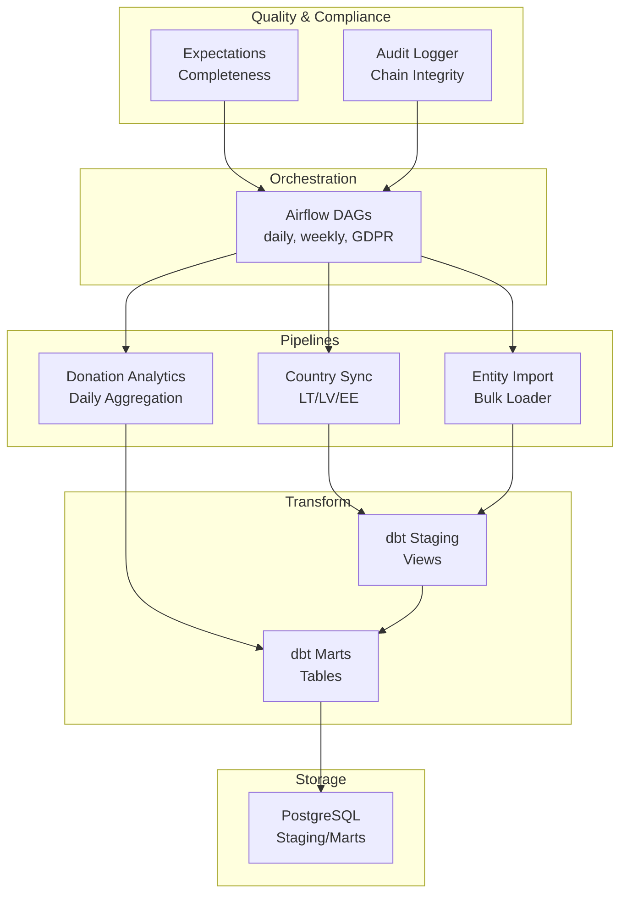
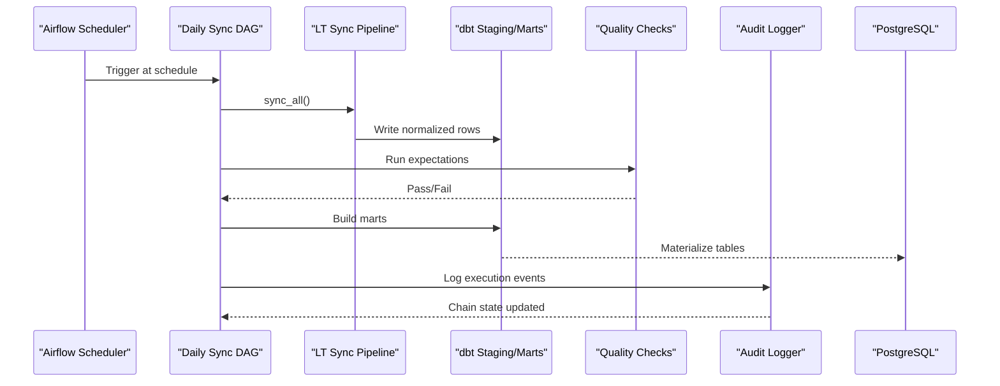
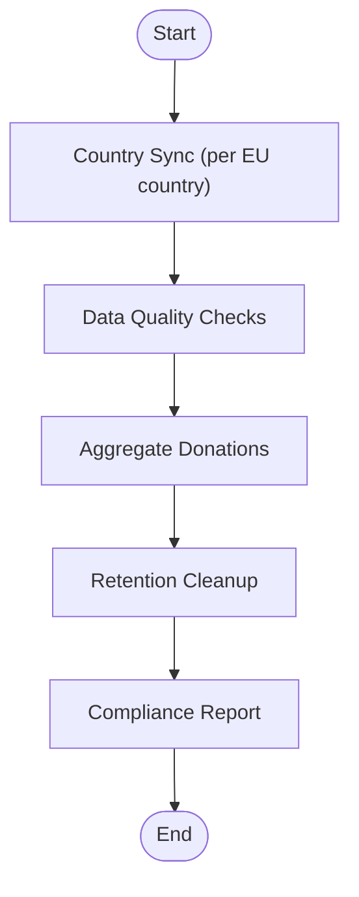
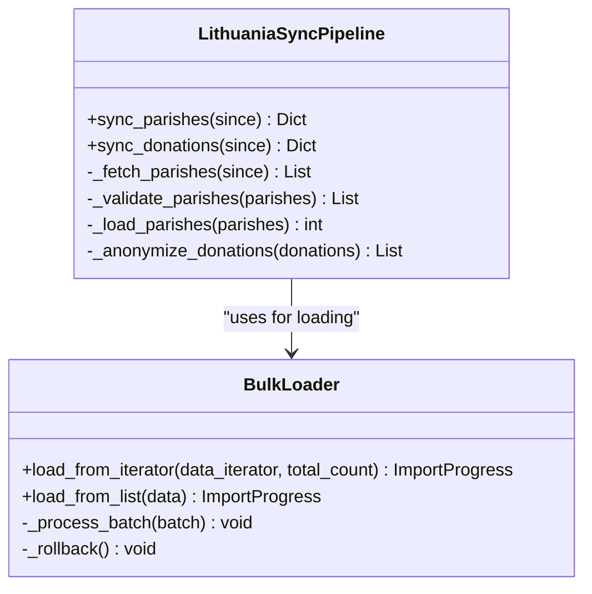
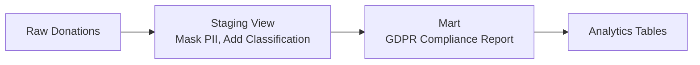
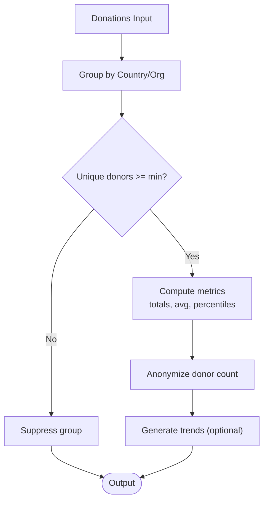
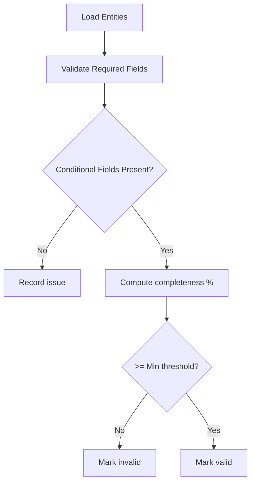
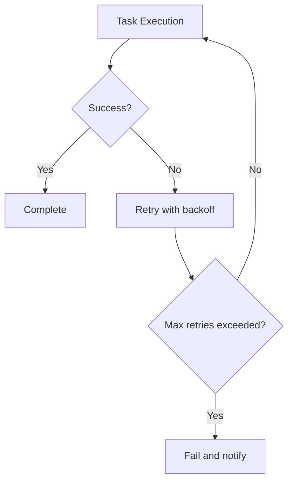
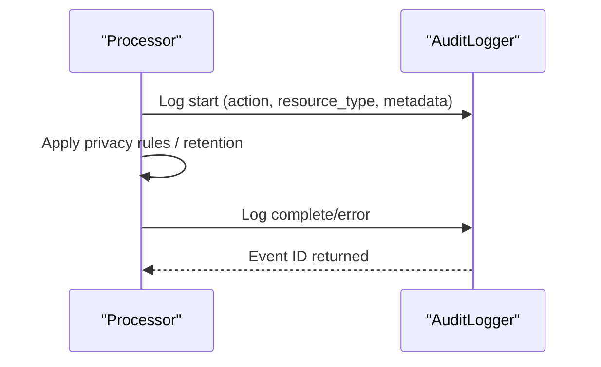
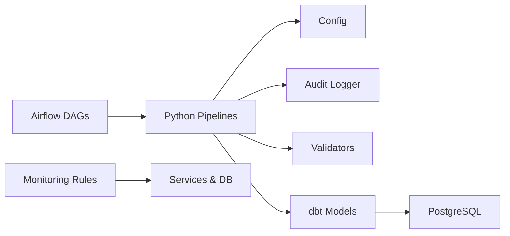

# ETL Pipeline Flows

<cite>
**Referenced Files in This Document**
- [jol_hub_etl.py](file://data/airflow/dags/jol_hub_etl.py)
- [jol_daily_sync.py](file://data/airflow/dags/jol_daily_sync.py)
- [jol_weekly_reporting.py](file://data/airflow/dags/jol_weekly_reporting.py)
- [dbt_project.yml](file://data/dbt/dbt_project.yml)
- [stg_donations.sql](file://data/dbt/models/staging/stg_donations.sql)
- [gdpr_compliance_report.sql](file://data/dbt/models/marts/gdpr_compliance_report.sql)
- [daily_aggregation.py](file://data/src/pipelines/donation_analytics/daily_aggregation.py)
- [lt_sync.py](file://data/src/pipelines/country_sync/lt_sync.py)
- [bulk_loader.py](file://data/src/pipelines/entity_import/bulk_loader.py)
- [entity_completeness.py](file://data/src/quality/expectations/entity_completeness.py)
- [config.py](file://data/src/config.py)
- [audit.py](file://data/src/audit.py)
- [processors.py](file://data/src/processors.py)
- [jol_operators.py](file://data/airflow/plugins/jol_operators.py)
- [rules.yaml.tpl](file://infra/terraform/modules/monitoring/templates/rules.yaml.tpl)
- [data-flow.md](file://docs/architecture/data-flow.md)
</cite>

## Table of Contents
1. Introduction
2. Project Structure
3. Core Components
4. Architecture Overview
5. Detailed Component Analysis
6. Dependency Analysis
7. Performance Considerations
8. Troubleshooting Guide
9. Conclusion
10. Appendices

## Introduction
This document explains the end-to-end ETL pipeline flows in JOL-HUB, covering Apache Airflow DAG orchestration, data extraction from multiple sources (databases, APIs, file uploads), transformation using dbt models, and loading into analytics databases. It details data quality checks, validation rules, error handling, retry mechanisms, GDPR compliance, monitoring, alerting, and troubleshooting for production pipelines. It also provides examples of common workflows such as daily aggregations, entity imports, donation analytics, and compliance reporting.

## Project Structure
JOL-HUB organizes ETL-related code across:
- Airflow DAGs for scheduling and orchestration
- Python pipelines for extraction, transformation, and loading
- dbt models for staging and marts
- Quality expectations and validators
- Audit logging and configuration
- Monitoring and alerting templates

**Diagram sources**
- [jol_daily_sync.py:83-126](file://data/airflow/dags/jol_daily_sync.py#L83-L126)
- [daily_aggregation.py:62-142](file://data/src/pipelines/donation_analytics/daily_aggregation.py#L62-L142)
- [bulk_loader.py:72-151](file://data/src/pipelines/entity_import/bulk_loader.py#L72-L151)
- [stg_donations.sql:1-36](file://data/dbt/models/staging/stg_donations.sql#L1-L36)
- [gdpr_compliance_report.sql:1-68](file://data/dbt/models/marts/gdpr_compliance_report.sql#L1-L68)
- [entity_completeness.py:81-166](file://data/src/quality/expectations/entity_completeness.py#L81-L166)
- [audit.py:205-369](file://data/src/audit.py#L205-L369)

**Section sources**
- [jol_daily_sync.py:83-126](file://data/airflow/dags/jol_daily_sync.py#L83-L126)
- [dbt_project.yml:1-44](file://data/dbt/dbt_project.yml#L1-L44)

## Core Components
- Orchestration: Airflow DAGs define schedules, retries, and task dependencies for daily sync, weekly reporting, and GDPR requests.
- Extraction: Country-specific sync pipelines pull data from external systems; bulk loader ingests files or iterators.
- Transformation: dbt staging views normalize raw data; marts compute analytics and compliance metrics.
- Loading: Results are materialized into PostgreSQL schemas (staging, marts, gdpr_compliance).
- Quality: Expectations validate completeness and conditional fields; processors enforce business rules.
- Compliance: Audit logger records all processing with hash-chain integrity; retention policies enforced.
- Monitoring: Prometheus-style alert rules cover DB, Redis, Celery, containers, and pods.

**Section sources**
- [jol_hub_etl.py:14-113](file://data/airflow/dags/jol_hub_etl.py#L14-L113)
- [daily_aggregation.py:62-142](file://data/src/pipelines/donation_analytics/daily_aggregation.py#L62-L142)
- [bulk_loader.py:72-151](file://data/src/pipelines/entity_import/bulk_loader.py#L72-L151)
- [stg_donations.sql:1-36](file://data/dbt/models/staging/stg_donations.sql#L1-L36)
- [gdpr_compliance_report.sql:1-68](file://data/dbt/models/marts/gdpr_compliance_report.sql#L1-L68)
- [entity_completeness.py:81-166](file://data/src/quality/expectations/entity_completeness.py#L81-L166)
- [audit.py:205-369](file://data/src/audit.py#L205-L369)
- [rules.yaml.tpl:37-162](file://infra/terraform/modules/monitoring/templates/rules.yaml.tpl#L37-L162)

## Architecture Overview
The ETL architecture orchestrates scheduled jobs that extract data from country sources, transform via dbt, and load into analytics tables while enforcing data quality and GDPR compliance.

**Diagram sources**
- [jol_daily_sync.py:83-126](file://data/airflow/dags/jol_daily_sync.py#L83-L126)
- [lt_sync.py:72-140](file://data/src/pipelines/country_sync/lt_sync.py#L72-L140)
- [stg_donations.sql:1-36](file://data/dbt/models/staging/stg_donations.sql#L1-L36)
- [gdpr_compliance_report.sql:1-68](file://data/dbt/models/marts/gdpr_compliance_report.sql#L1-L68)
- [audit.py:330-369](file://data/src/audit.py#L330-L369)

## Detailed Component Analysis

### Airflow DAG Orchestration
- Daily ETL: Orchestrates per-country sync, data quality checks, donation aggregation, retention cleanup, and compliance report generation.
- Weekly Reporting: Generates analytics trends, country metrics, and compliance scorecards.
- GDPR Requests: Supports access, erasure, and portability tasks triggered manually.

**Diagram sources**
- [jol_daily_sync.py:83-126](file://data/airflow/dags/jol_daily_sync.py#L83-L126)
- [jol_weekly_reporting.py:52-78](file://data/airflow/dags/jol_weekly_reporting.py#L52-L78)
- [jol_hub_etl.py:73-113](file://data/airflow/dags/jol_hub_etl.py#L73-L113)

**Section sources**
- [jol_daily_sync.py:83-126](file://data/airflow/dags/jol_daily_sync.py#L83-L126)
- [jol_weekly_reporting.py:52-78](file://data/airflow/dags/jol_weekly_reporting.py#L52-L78)
- [jol_hub_etl.py:73-113](file://data/airflow/dags/jol_hub_etl.py#L73-L113)

### Data Extraction: Country Sync and Bulk Import
- Country Sync: Lithuania pipeline fetches parishes and donations, validates, anonymizes, and loads to database with audit logs.
- Bulk Import: Batch loader supports iterator/list ingestion, progress tracking, rollback on failure, PII anonymization, and configurable validation.

**Diagram sources**
- [lt_sync.py:48-140](file://data/src/pipelines/country_sync/lt_sync.py#L48-L140)
- [bulk_loader.py:72-151](file://data/src/pipelines/entity_import/bulk_loader.py#L72-L151)

**Section sources**
- [lt_sync.py:72-140](file://data/src/pipelines/country_sync/lt_sync.py#L72-L140)
- [bulk_loader.py:96-151](file://data/src/pipelines/entity_import/bulk_loader.py#L96-L151)

### Transformation: dbt Models
- Staging: Views normalize raw donations, mask sensitive fields based on variables, and add GDPR metadata (classification, retention expiry).
- Marts: Compute GDPR compliance metrics, including record counts, unique subjects, retention status, and approaching-expiry flags.

**Diagram sources**
- [stg_donations.sql:1-36](file://data/dbt/models/staging/stg_donations.sql#L1-L36)
- [gdpr_compliance_report.sql:1-68](file://data/dbt/models/marts/gdpr_compliance_report.sql#L1-L68)

**Section sources**
- [stg_donations.sql:1-36](file://data/dbt/models/staging/stg_donations.sql#L1-L36)
- [gdpr_compliance_report.sql:1-68](file://data/dbt/models/marts/gdpr_compliance_report.sql#L1-L68)

### Donation Analytics: Daily Aggregation
- Aggregates donations by country and organization type.
- Enforces k-anonymity thresholds to suppress small groups.
- Computes totals, averages, percentiles, and trend summaries.

**Diagram sources**
- [daily_aggregation.py:82-142](file://data/src/pipelines/donation_analytics/daily_aggregation.py#L82-L142)
- [daily_aggregation.py:170-214](file://data/src/pipelines/donation_analytics/daily_aggregation.py#L170-L214)
- [daily_aggregation.py:216-242](file://data/src/pipelines/donation_analytics/daily_aggregation.py#L216-L242)

**Section sources**
- [daily_aggregation.py:62-142](file://data/src/pipelines/donation_analytics/daily_aggregation.py#L62-L142)
- [daily_aggregation.py:170-214](file://data/src/pipelines/donation_analytics/daily_aggregation.py#L170-L214)
- [daily_aggregation.py:216-242](file://data/src/pipelines/donation_analytics/daily_aggregation.py#L216-L242)

### Data Quality and Validation
- Completeness expectations define required and conditional fields per entity type and enforce minimum completeness thresholds.
- Cross-entity validation ensures relationships (e.g., parishes must have priests).

**Diagram sources**
- [entity_completeness.py:81-166](file://data/src/quality/expectations/entity_completeness.py#L81-L166)
- [entity_completeness.py:168-189](file://data/src/quality/expectations/entity_completeness.py#L168-L189)

**Section sources**
- [entity_completeness.py:81-166](file://data/src/quality/expectations/entity_completeness.py#L81-L166)
- [entity_completeness.py:168-189](file://data/src/quality/expectations/entity_completeness.py#L168-L189)

### Error Handling and Retry Mechanisms
- Airflow default_args configure retries, retry delays, timeouts, and email notifications on failure.
- Custom operators wrap execution with logging and ensure PII masking in logs.
- Pipelines capture errors, log them, and support rollback for bulk imports.

**Diagram sources**
- [jol_daily_sync.py:15-22](file://data/airflow/dags/jol_daily_sync.py#L15-L22)
- [jol_operators.py:10-29](file://data/airflow/plugins/jol_operators.py#L10-L29)
- [bulk_loader.py:138-151](file://data/src/pipelines/entity_import/bulk_loader.py#L138-L151)

**Section sources**
- [jol_daily_sync.py:15-22](file://data/airflow/dags/jol_daily_sync.py#L15-L22)
- [jol_operators.py:10-29](file://data/airflow/plugins/jol_operators.py#L10-L29)
- [bulk_loader.py:138-151](file://data/src/pipelines/entity_import/bulk_loader.py#L138-L151)

### GDPR Compliance and Audit Logging
- Audit logger creates immutable event chains with HMAC signatures and sequence numbers for tamper detection.
- Retention policies enforce deletion/anonymization timelines for different data types.
- Processors implement DSAR (access, erasure) with legal basis documentation and exemptions.

**Diagram sources**
- [audit.py:205-369](file://data/src/audit.py#L205-L369)
- [config.py:20-27](file://data/src/config.py#L20-L27)
- [processors.py:223-380](file://data/src/processors.py#L223-L380)
- [processors.py:506-762](file://data/src/processors.py#L506-L762)

**Section sources**
- [audit.py:205-369](file://data/src/audit.py#L205-L369)
- [config.py:20-27](file://data/src/config.py#L20-L27)
- [processors.py:223-380](file://data/src/processors.py#L223-L380)
- [processors.py:506-762](file://data/src/processors.py#L506-L762)

### Monitoring and Alerting
- Prometheus alert rules monitor database connections, replication lag, Redis memory/connections, Celery queue/backlog, container CPU/memory, pod health, and restart frequency.
- These alerts enable proactive intervention for production pipelines.

**Section sources**
- [rules.yaml.tpl:37-162](file://infra/terraform/modules/monitoring/templates/rules.yaml.tpl#L37-L162)

## Dependency Analysis
Key dependencies between components:
- Airflow DAGs depend on Python pipelines and dbt models for transformations.
- Pipelines rely on configuration, audit logging, and validators.
- dbt models depend on source schemas and variables for retention and masking.
- Monitoring depends on infrastructure metrics exposed by services.

**Diagram sources**
- [jol_daily_sync.py:83-126](file://data/airflow/dags/jol_daily_sync.py#L83-L126)
- [daily_aggregation.py:62-142](file://data/src/pipelines/donation_analytics/daily_aggregation.py#L62-L142)
- [bulk_loader.py:72-151](file://data/src/pipelines/entity_import/bulk_loader.py#L72-L151)
- [dbt_project.yml:1-44](file://data/dbt/dbt_project.yml#L1-L44)
- [rules.yaml.tpl:37-162](file://infra/terraform/modules/monitoring/templates/rules.yaml.tpl#L37-L162)

**Section sources**
- [jol_daily_sync.py:83-126](file://data/airflow/dags/jol_daily_sync.py#L83-L126)
- [dbt_project.yml:1-44](file://data/dbt/dbt_project.yml#L1-L44)
- [rules.yaml.tpl:37-162](file://infra/terraform/modules/monitoring/templates/rules.yaml.tpl#L37-L162)

## Performance Considerations
- Use incremental syncs where possible to reduce load on external sources.
- Configure batch sizes in bulk loaders to balance throughput and memory usage.
- Leverage dbt materializations (views vs tables) appropriately to optimize query performance.
- Monitor database connections and replication lag; adjust resources if alerts trigger frequently.
- Apply caching strategies for read-heavy analytics queries.

[No sources needed since this section provides general guidance]

## Troubleshooting Guide
Common issues and resolutions:
- DAG failures: Check retries, email notifications, and task logs; verify environment variables for DB connections.
- Data quality failures: Review expectation results and completeness thresholds; adjust rules if necessary.
- Audit chain integrity: Use verification methods to detect tampering or gaps; investigate chain breaks.
- Monitoring alerts: Address high DB connections, replication lag, Redis memory, Celery backlog, container CPU/memory, and pod readiness.

**Section sources**
- [audit.py:513-589](file://data/src/audit.py#L513-L589)
- [rules.yaml.tpl:37-162](file://infra/terraform/modules/monitoring/templates/rules.yaml.tpl#L37-L162)
- [data-flow.md:487-505](file://docs/architecture/data-flow.md#L487-L505)

## Conclusion
JOL-HUB’s ETL pipeline integrates Airflow orchestration, robust Python pipelines, dbt transformations, comprehensive quality checks, and strong GDPR compliance through audit logging and retention enforcement. Monitoring and alerting provide visibility into system health, enabling reliable production operations. The modular design supports scaling across countries and use cases while maintaining data integrity and privacy.

[No sources needed since this section summarizes without analyzing specific files]

## Appendices

### Common ETL Workflows
- Daily Aggregations: Scheduled via daily DAG; aggregates donations with k-anonymity and generates trends.
- Entity Imports: Bulk loader processes CSV or iterators with validation, anonymization, and rollback capability.
- Donation Analytics: Computes aggregated metrics and percentiles for reporting dashboards.
- Compliance Reporting: Builds GDPR compliance reports and scorecards weekly.

**Section sources**
- [jol_daily_sync.py:83-126](file://data/airflow/dags/jol_daily_sync.py#L83-L126)
- [daily_aggregation.py:62-142](file://data/src/pipelines/donation_analytics/daily_aggregation.py#L62-L142)
- [bulk_loader.py:72-151](file://data/src/pipelines/entity_import/bulk_loader.py#L72-L151)
- [jol_weekly_reporting.py:52-78](file://data/airflow/dags/jol_weekly_reporting.py#L52-L78)