# GDPR Compliance Pipeline

<cite>
**Referenced Files in This Document**
- [anonymizer.py](file://data/src/gdpr/anonymizer.py)
- [retention_manager.py](file://data/src/gdpr/retention_manager.py)
- [entity_ropa.py](file://data/src/gdpr/entity_ropa.py)
- [ropa_generator.py](file://data/src/gdpr/ropa_generator.py)
- [dsar_service.py](file://data/src/dsar_service.py)
- [audit.py](file://data/src/audit.py)
- [encryption.py](file://data/src/encryption.py)
- [processors.py](file://data/src/processors.py)
- [jol_gdpr_cleanup.py](file://data/airflow/dags/jol_gdpr_cleanup.py)
- [jol_daily_sync.py](file://data/airflow/dags/jol_daily_sync.py)
- [gdpr_compliance_report.sql](file://data/dbt/models/marts/gdpr_compliance_report.sql)
- [data_subject_export.sql](file://data/dbt/models/marts/data_subject_export.sql)
- [consent_validation.py](file://data/src/quality/expectations/gdpr_consent_validation.py)
- [ConsentService (backend)](file://backend/django/apps/core/dsr_service.py)
</cite>

## Table of Contents
1. [Introduction](#introduction)
2. [Project Structure](#project-structure)
3. [Core Components](#core-components)
4. [Architecture Overview](#architecture-overview)
5. [Detailed Component Analysis](#detailed-component-analysis)
6. [Dependency Analysis](#dependency-analysis)
7. [Performance Considerations](#performance-considerations)
8. [Troubleshooting Guide](#troubleshooting-guide)
9. [Conclusion](#conclusion)
10. [Appendices](#appendices)

## Introduction
This document describes the GDPR compliance pipeline implemented across JOL-HUB ETL processes. It covers automated data retention and deletion, anonymization for privacy protection, Right to Erasure, data portability exports, Record of Processing Activities (ROPA) generation, comprehensive audit logging, consent management integration, compliance monitoring and alerting, and security measures including encryption throughout the pipeline. The goal is to provide a clear, code-grounded reference for engineers, auditors, and compliance officers.

## Project Structure
The GDPR compliance capabilities are distributed across Python modules under data/src, Airflow DAGs under data/airflow/dags, dbt models under data/dbt/models/marts, and backend services under backend/django/apps/core. Key areas:
- Data processing and DSAR orchestration: processors.py, dsar_service.py
- Retention and legal holds: retention_manager.py
- Anonymization and k-anonymity: anonymizer.py
- ROPA generation and entity-specific activities: ropa_generator.py, entity_ropa.py
- Audit logging with integrity chain: audit.py
- Encryption key management: encryption.py
- Automated scheduling: jol_daily_sync.py, jol_gdpr_cleanup.py
- Reporting and exports: gdpr_compliance_report.sql, data_subject_export.sql
- Consent validation and management: consent_validation.py, ConsentService (backend)

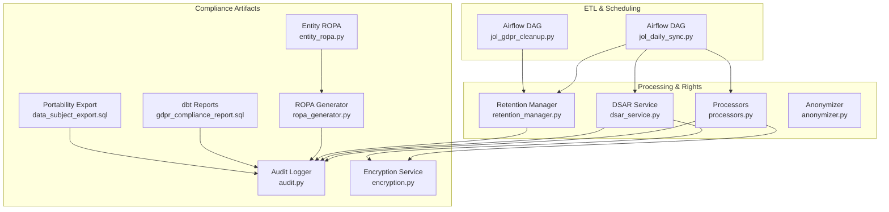

**Diagram sources**
- [jol_daily_sync.py:83-126](file://data/airflow/dags/jol_daily_sync.py#L83-L126)
- [jol_gdpr_cleanup.py:36-68](file://data/airflow/dags/jol_gdpr_cleanup.py#L36-L68)
- [processors.py:94-220](file://data/src/processors.py#L94-L220)
- [dsar_service.py:59-157](file://data/src/dsar_service.py#L59-L157)
- [retention_manager.py:188-246](file://data/src/gdpr/retention_manager.py#L188-L246)
- [anonymizer.py:106-180](file://data/src/gdpr/anonymizer.py#L106-L180)
- [audit.py:205-369](file://data/src/audit.py#L205-L369)
- [encryption.py:346-521](file://data/src/encryption.py#L346-L521)
- [ropa_generator.py:103-182](file://data/src/gdpr/ropa_generator.py#L103-L182)
- [entity_ropa.py:39-797](file://data/src/gdpr/entity_ropa.py#L39-L797)
- [gdpr_compliance_report.sql:1-68](file://data/dbt/models/marts/gdpr_compliance_report.sql#L1-L68)
- [data_subject_export.sql:1-55](file://data/dbt/models/marts/data_subject_export.sql#L1-L55)

**Section sources**
- [jol_daily_sync.py:83-126](file://data/airflow/dags/jol_daily_sync.py#L83-L126)
- [jol_gdpr_cleanup.py:36-68](file://data/airflow/dags/jol_gdpr_cleanup.py#L36-L68)

## Core Components
- DSAR Service: Orchestrates access and erasure requests across processors, producing portable JSON exports and auditing every step.
- Processors: Implement per-domain rights handling (donations, users), applying retention rules, soft-deletion, anonymization, and audit logging.
- Retention Manager: Enforces storage limitation by deleting expired records, honoring legal holds, and logging all actions.
- Anonymizer: Provides k-anonymity with country-specific thresholds and hashing of direct identifiers.
- ROPA Generator and Entity ROPA: Generate Article 30 records, including entity-specific activities and compliance frameworks.
- Audit Logger: Immutable, hash-chained logs with HMAC signatures, sequence numbers, and verification utilities.
- Encryption Service: Pluggable key providers (AWS KMS/local), envelope encryption, rotation, and secure lifecycle management.
- dbt Models: Produce compliance reports and subject export datasets for audits and portability.
- Consent Validation and Management: Validates consent validity and integrates with backend consent service for recording and auditing consent events.

**Section sources**
- [dsar_service.py:59-157](file://data/src/dsar_service.py#L59-L157)
- [processors.py:94-220](file://data/src/processors.py#L94-L220)
- [retention_manager.py:188-246](file://data/src/gdpr/retention_manager.py#L188-L246)
- [anonymizer.py:106-180](file://data/src/gdpr/anonymizer.py#L106-L180)
- [ropa_generator.py:103-182](file://data/src/gdpr/ropa_generator.py#L103-L182)
- [entity_ropa.py:39-797](file://data/src/gdpr/entity_ropa.py#L39-L797)
- [audit.py:205-369](file://data/src/audit.py#L205-L369)
- [encryption.py:346-521](file://data/src/encryption.py#L346-L521)
- [gdpr_compliance_report.sql:1-68](file://data/dbt/models/marts/gdpr_compliance_report.sql#L1-L68)
- [data_subject_export.sql:1-55](file://data/dbt/models/marts/data_subject_export.sql#L1-L55)
- [consent_validation.py:52-93](file://data/src/quality/expectations/gdpr_consent_validation.py#L52-L93)
- [ConsentService (backend):378-426](file://backend/django/apps/core/dsr_service.py#L378-L426)

## Architecture Overview
The pipeline integrates scheduled ETL tasks with GDPR controls at each stage:
- Daily ETL runs country syncs, quality checks, donation aggregation with anonymization, retention cleanup, and compliance report generation.
- Dedicated GDPR cleanup DAG executes retention-based deletions on operational logs and user activity.
- DSAR Service coordinates cross-processor retrieval and deletion, ensuring legal basis and exemptions are respected.
- All operations produce immutable audit logs and can be verified for integrity.
- Encryption secures sensitive data at rest and in transit via pluggable key providers.

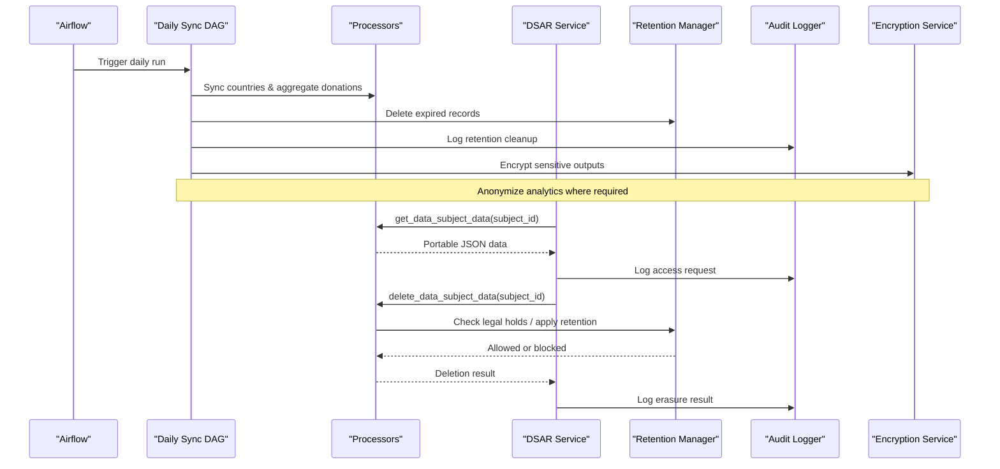

**Diagram sources**
- [jol_daily_sync.py:83-126](file://data/airflow/dags/jol_daily_sync.py#L83-L126)
- [dsar_service.py:88-157](file://data/src/dsar_service.py#L88-L157)
- [processors.py:282-503](file://data/src/processors.py#L282-L503)
- [retention_manager.py:257-317](file://data/src/gdpr/retention_manager.py#L257-L317)
- [audit.py:330-369](file://data/src/audit.py#L330-L369)
- [encryption.py:414-462](file://data/src/encryption.py#L414-L462)

## Detailed Component Analysis

### Automated Data Retention and Legal Holds
- RetentionManager enforces storage limitation by computing cutoff dates per data type and performing dry-run or actual deletions. It consults a LegalHoldRegistry before any deletion; active legal holds block erasure and are logged.
- Standard retention rules include donation (7 years), user account/activity (2 years), audit log (7 years), and operational logs (90 days).
- Airflow DAGs schedule cleanup tasks for operational logs and user activity.

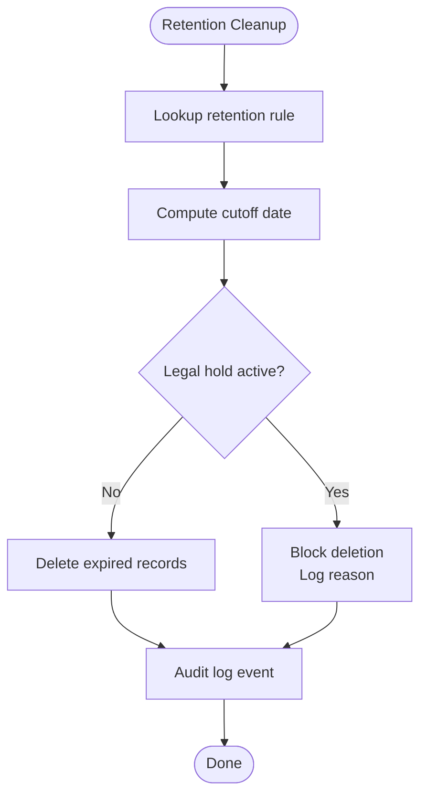

**Diagram sources**
- [retention_manager.py:206-246](file://data/src/gdpr/retention_manager.py#L206-L246)
- [retention_manager.py:257-317](file://data/src/gdpr/retention_manager.py#L257-L317)
- [jol_gdpr_cleanup.py:21-33](file://data/airflow/dags/jol_gdpr_cleanup.py#L21-L33)
- [jol_daily_sync.py:53-62](file://data/airflow/dags/jol_daily_sync.py#L53-L62)

**Section sources**
- [retention_manager.py:78-106](file://data/src/gdpr/retention_manager.py#L78-L106)
- [retention_manager.py:188-246](file://data/src/gdpr/retention_manager.py#L188-L246)
- [retention_manager.py:257-317](file://data/src/gdpr/retention_manager.py#L257-L317)
- [jol_gdpr_cleanup.py:21-33](file://data/airflow/dags/jol_gdpr_cleanup.py#L21-L33)
- [jol_daily_sync.py:53-62](file://data/airflow/dags/jol_daily_sync.py#L53-L62)

### Data Anonymization and Privacy Protection
- KAnonymizer applies country-specific k-thresholds and hashes direct identifiers (name, email, donor_id, phone). It supports checking k-anonymity against quasi-identifiers and rounding counts to satisfy k.
- Donation aggregation uses anonymization steps within the daily pipeline.

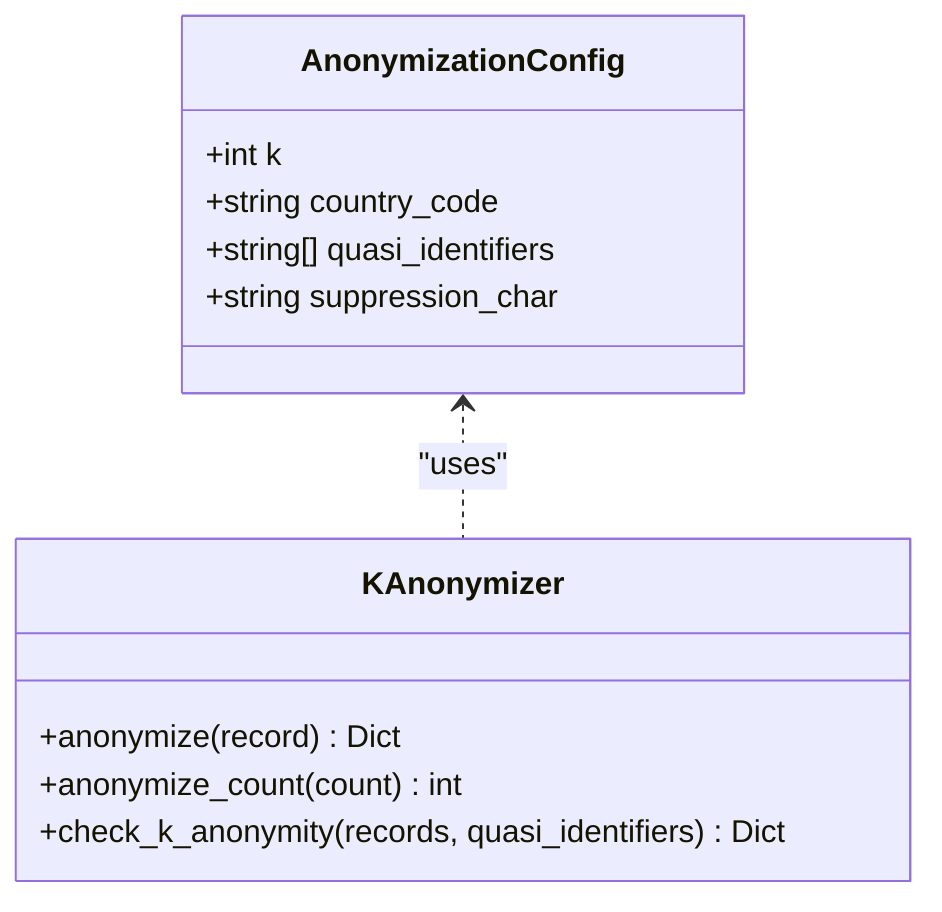

**Diagram sources**
- [anonymizer.py:86-126](file://data/src/gdpr/anonymizer.py#L86-L126)
- [anonymizer.py:127-180](file://data/src/gdpr/anonymizer.py#L127-L180)

**Section sources**
- [anonymizer.py:25-83](file://data/src/gdpr/anonymizer.py#L25-L83)
- [anonymizer.py:106-180](file://data/src/gdpr/anonymizer.py#L106-L180)
- [jol_daily_sync.py:44-50](file://data/airflow/dags/jol_daily_sync.py#L44-L50)

### Right to Erasure Implementation
- DSAR Service coordinates erasure across processors, respecting exemptions and legal holds. Processors implement domain-specific deletion logic:
  - DonationProcessor: Soft-deletes records past retention, anonymizes retained financial records, and logs exemptions.
  - UserdataProcessor: Checks active memberships and blocks deletion if necessary; otherwise performs soft-delete with PII redaction.
- All erasures are audited with legal basis and metadata.

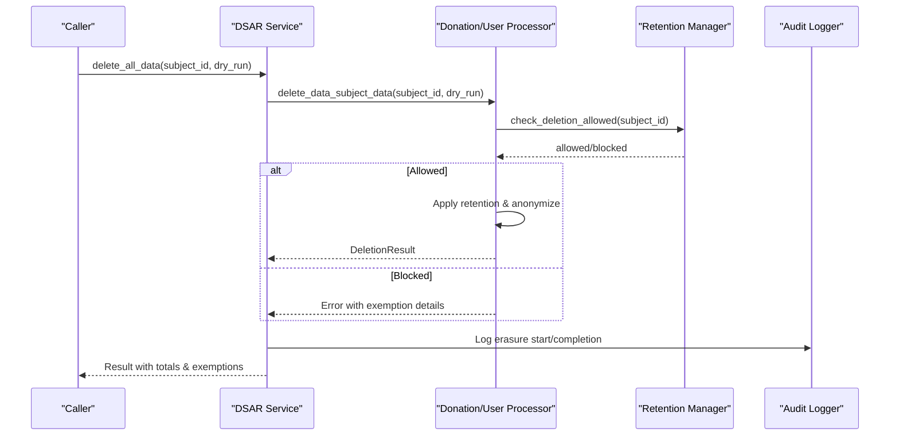

**Diagram sources**
- [dsar_service.py:159-267](file://data/src/dsar_service.py#L159-L267)
- [processors.py:381-503](file://data/src/processors.py#L381-L503)
- [processors.py:668-761](file://data/src/processors.py#L668-L761)
- [retention_manager.py:319-335](file://data/src/gdpr/retention_manager.py#L319-L335)
- [audit.py:391-407](file://data/src/audit.py#L391-L407)

**Section sources**
- [dsar_service.py:159-267](file://data/src/dsar_service.py#L159-L267)
- [processors.py:381-503](file://data/src/processors.py#L381-L503)
- [processors.py:668-761](file://data/src/processors.py#L668-L761)

### Data Portability Exports
- DSAR Service provides get_all_data to retrieve all personal data in machine-readable JSON format and export_to_json for file-based portability.
- dbt model data_subject_export.sql aggregates user and donation data for portability queries.

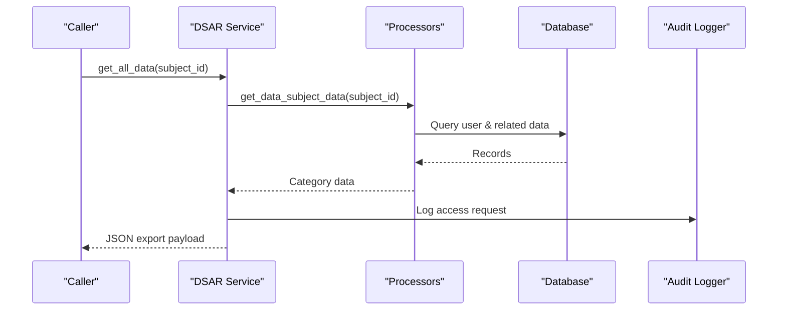

**Diagram sources**
- [dsar_service.py:88-157](file://data/src/dsar_service.py#L88-L157)
- [processors.py:282-379](file://data/src/processors.py#L282-L379)
- [processors.py:570-666](file://data/src/processors.py#L570-L666)
- [data_subject_export.sql:13-55](file://data/dbt/models/marts/data_subject_export.sql#L13-L55)

**Section sources**
- [dsar_service.py:88-157](file://data/src/dsar_service.py#L88-L157)
- [data_subject_export.sql:13-55](file://data/dbt/models/marts/data_subject_export.sql#L13-L55)

### Record of Processing Activities (ROPA) Generation
- ROPAGenerator produces Article 30 records in JSON or Markdown, saving timestamped files.
- Entity ROPA extends base generator with entity-specific activities for basilica, cathedral, diocese, deanery, church, protestant, orthodox, greek_catholic, funeral, cemetery, including legal bases, retention periods, and security measures.

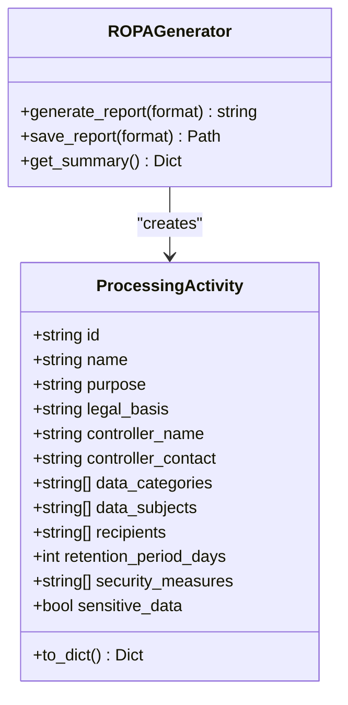

**Diagram sources**
- [ropa_generator.py:19-42](file://data/src/gdpr/ropa_generator.py#L19-L42)
- [ropa_generator.py:103-182](file://data/src/gdpr/ropa_generator.py#L103-L182)
- [entity_ropa.py:39-797](file://data/src/gdpr/entity_ropa.py#L39-L797)

**Section sources**
- [ropa_generator.py:103-182](file://data/src/gdpr/ropa_generator.py#L103-L182)
- [entity_ropa.py:39-797](file://data/src/gdpr/entity_ropa.py#L39-L797)

### Audit Logging and Integrity
- AuditLogger writes append-only JSONL logs with hash chaining and HMAC signatures. Events include GDPR fields (legal basis, data categories, retention). Utilities support querying, generating compliance reports, and verifying chain integrity.
- All DSAR and retention operations log start/completion with metadata.

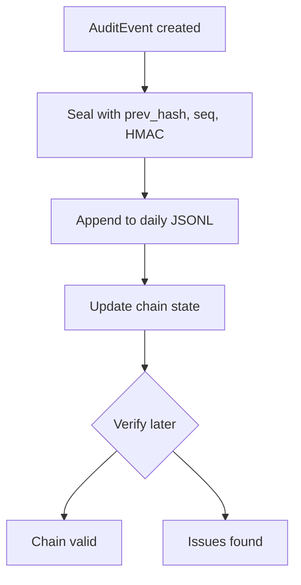

**Diagram sources**
- [audit.py:65-203](file://data/src/audit.py#L65-L203)
- [audit.py:330-369](file://data/src/audit.py#L330-L369)
- [audit.py:475-589](file://data/src/audit.py#L475-L589)

**Section sources**
- [audit.py:205-369](file://data/src/audit.py#L205-L369)
- [audit.py:475-589](file://data/src/audit.py#L475-L589)

### Consent Management Integration
- Consent validation ensures consents are specific, informed, unambiguous, documented, and time-bounded. Required consents vary by processing type.
- Backend ConsentService records consent with versioning, IP/user-agent context, and audit trail.

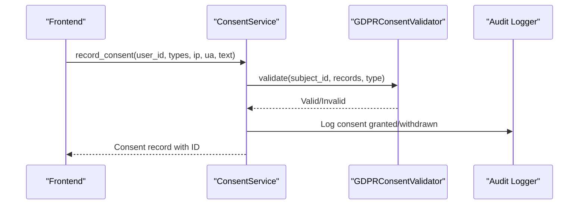

**Diagram sources**
- [consent_validation.py:52-93](file://data/src/quality/expectations/gdpr_consent_validation.py#L52-L93)
- [ConsentService (backend):378-426](file://backend/django/apps/core/dsr_service.py#L378-L426)

**Section sources**
- [consent_validation.py:52-93](file://data/src/quality/expectations/gdpr_consent_validation.py#L52-L93)
- [ConsentService (backend):378-426](file://backend/django/apps/core/dsr_service.py#L378-L426)

### Security Measures and Encryption
- EncryptionService supports AWS KMS and local providers, envelope encryption, automatic rotation, and secure key lifecycle management.
- Used to encrypt sensitive outputs and protect keys during processing.

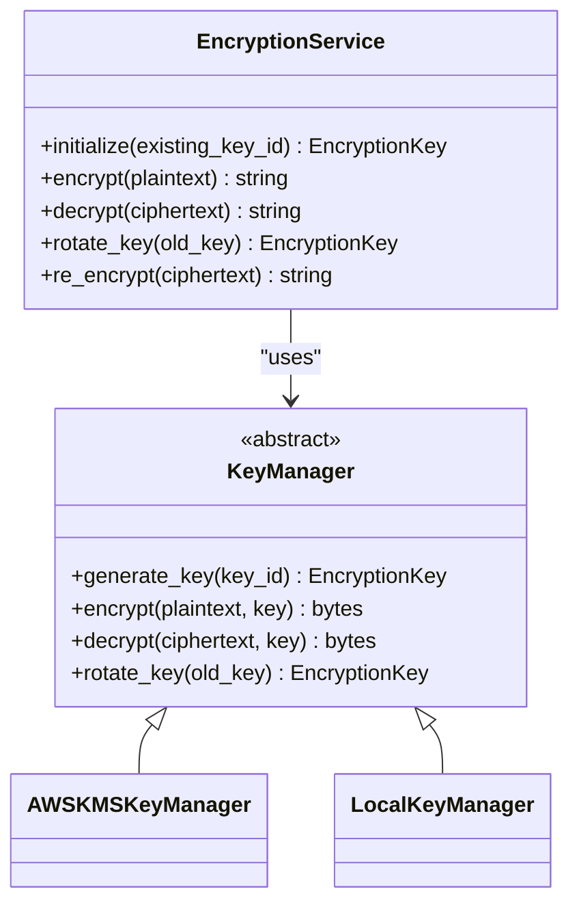

**Diagram sources**
- [encryption.py:346-521](file://data/src/encryption.py#L346-L521)
- [encryption.py:104-243](file://data/src/encryption.py#L104-L243)
- [encryption.py:246-343](file://data/src/encryption.py#L246-L343)

**Section sources**
- [encryption.py:346-521](file://data/src/encryption.py#L346-L521)

## Dependency Analysis
- DSAR Service depends on Processors for data retrieval/deletion and AuditLogger for logging.
- Processors depend on database connections and may call RetentionManager for legal hold checks and exemptions.
- RetentionManager depends on LegalHoldRegistry and AuditLogger.
- ROPA components generate compliance artifacts consumed by reporting and audits.
- Airflow DAGs orchestrate these components in scheduled workflows.

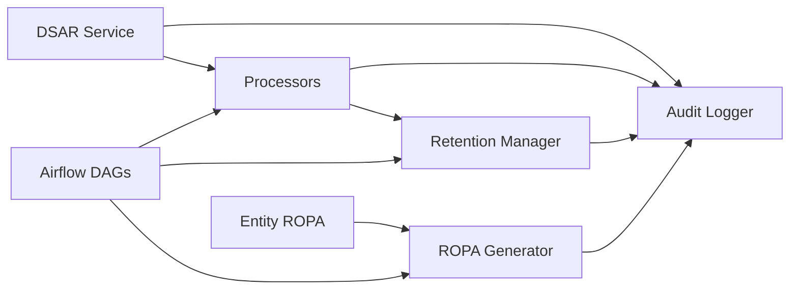

**Diagram sources**
- [dsar_service.py:59-157](file://data/src/dsar_service.py#L59-L157)
- [processors.py:94-220](file://data/src/processors.py#L94-L220)
- [retention_manager.py:188-246](file://data/src/gdpr/retention_manager.py#L188-L246)
- [ropa_generator.py:103-182](file://data/src/gdpr/ropa_generator.py#L103-L182)
- [entity_ropa.py:39-797](file://data/src/gdpr/entity_ropa.py#L39-L797)
- [jol_daily_sync.py:83-126](file://data/airflow/dags/jol_daily_sync.py#L83-L126)
- [jol_gdpr_cleanup.py:36-68](file://data/airflow/dags/jol_gdpr_cleanup.py#L36-L68)

**Section sources**
- [dsar_service.py:59-157](file://data/src/dsar_service.py#L59-L157)
- [processors.py:94-220](file://data/src/processors.py#L94-L220)
- [retention_manager.py:188-246](file://data/src/gdpr/retention_manager.py#L188-L246)
- [ropa_generator.py:103-182](file://data/src/gdpr/ropa_generator.py#L103-L182)
- [entity_ropa.py:39-797](file://data/src/gdpr/entity_ropa.py#L39-L797)
- [jol_daily_sync.py:83-126](file://data/airflow/dags/jol_daily_sync.py#L83-L126)
- [jol_gdpr_cleanup.py:36-68](file://data/airflow/dags/jol_gdpr_cleanup.py#L36-L68)

## Performance Considerations
- Batch operations: DSAR Service aggregates results from multiple processors; ensure efficient queries and pagination for large datasets.
- Anonymization: Grouping for k-anonymity can be O(n); consider partitioning by quasi-identifier groups for large volumes.
- Retention cleanup: Use dry runs to estimate impact before execution; schedule off-peak hours.
- Audit logs: Append-only JSONL scales well; monitor disk usage and rotate archives.
- Encryption: Envelope encryption minimizes KMS calls; cache data keys with TTL to reduce latency.

[No sources needed since this section provides general guidance]

## Troubleshooting Guide
- DSAR failures: Check processor error lists and audit logs for exceptions; verify database connectivity and permissions.
- Retention blocks: Inspect legal hold registry for active holds; lift holds when appropriate and re-run deletion.
- Audit integrity: Use verify_chain to detect chain breaks, sequence gaps, hash mismatches, or signature invalidations.
- Encryption errors: Ensure correct provider configuration and key availability; verify key rotation status.

**Section sources**
- [audit.py:513-589](file://data/src/audit.py#L513-L589)
- [retention_manager.py:257-317](file://data/src/gdpr/retention_manager.py#L257-L317)
- [encryption.py:346-521](file://data/src/encryption.py#L346-L521)

## Conclusion
JOL-HUB’s GDPR compliance pipeline integrates robust automation for retention, anonymization, rights fulfillment, ROPA generation, audit logging, consent management, and encryption. Scheduled DAGs enforce timely cleanup and reporting, while DSAR orchestration ensures compliant handling of access and erasure requests. The system’s design emphasizes verifiable integrity, regulatory alignment, and operational reliability.

[No sources needed since this section summarizes without analyzing specific files]

## Appendices

### Example Workflows

- Processing a Right to Erasure Request
  - Call DSAR Service delete_all_data with subject_id and optional dry_run.
  - Processors apply retention rules and legal hold checks; anonymize retained records where required.
  - Review returned totals, exemptions, and audit logs.

- Generating a Compliance Report
  - Run dbt model gdpr_compliance_report.sql to compute metrics like approaching retention expiry.
  - Use ROPAGenerator to save timestamped ROPA artifacts.

- Maintaining Audit Trails
  - Query AuditLogger for GDPR-related actions and verify chain integrity periodically.

**Section sources**
- [dsar_service.py:159-267](file://data/src/dsar_service.py#L159-L267)
- [gdpr_compliance_report.sql:1-68](file://data/dbt/models/marts/gdpr_compliance_report.sql#L1-L68)
- [ropa_generator.py:121-169](file://data/src/gdpr/ropa_generator.py#L121-L169)
- [audit.py:409-473](file://data/src/audit.py#L409-L473)