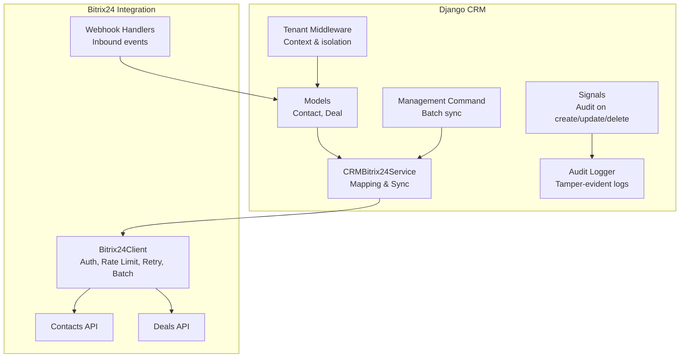
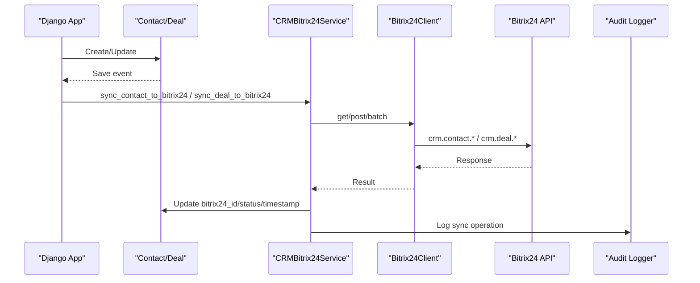
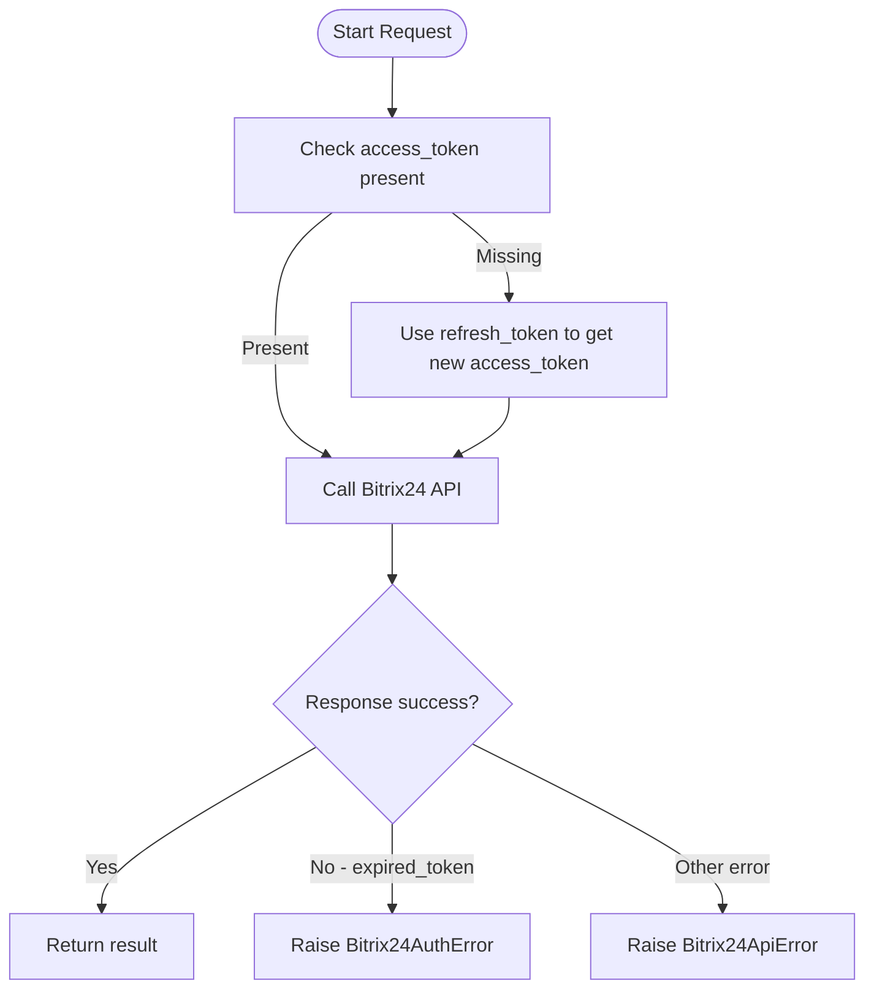
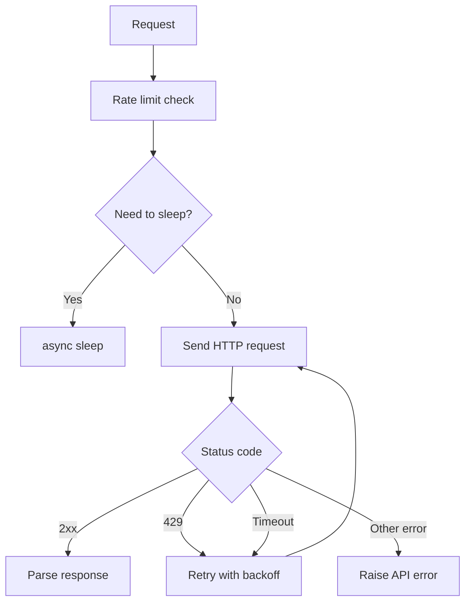
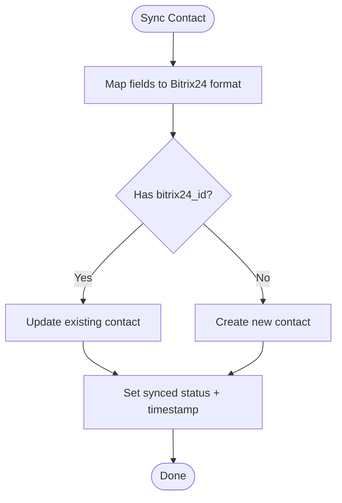
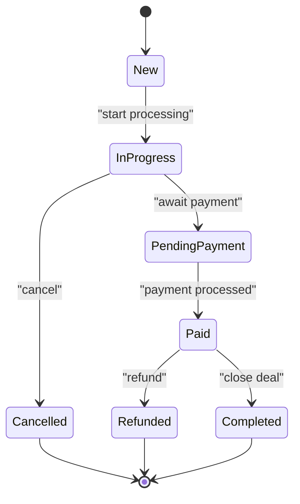
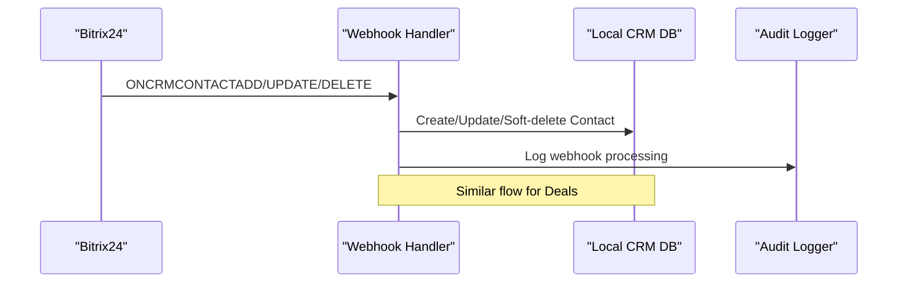
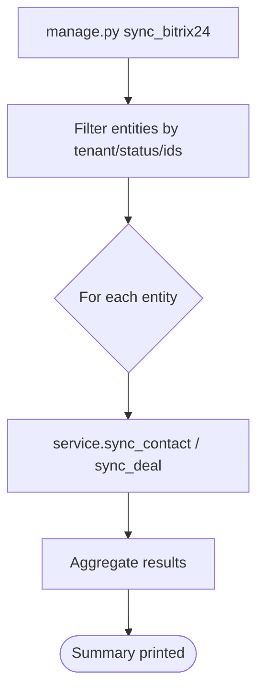
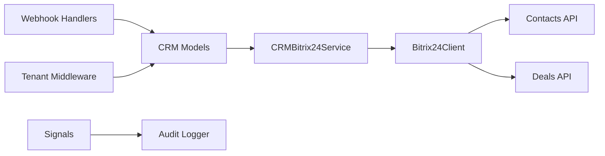

# Bitrix24 CRM Integration

<cite>
**Referenced Files in This Document**
- [models.py](file://backend/django/apps/crm/models.py)
- [bitrix24_service.py](file://backend/django/apps/crm/bitrix24_service.py)
- [client.py](file://backend/integrations/bitrix24/client.py)
- [contacts.py](file://backend/integrations/bitrix24/api/contacts.py)
- [deals.py](file://backend/integrations/bitrix24/api/deals.py)
- [handlers.py](file://backend/integrations/bitrix24/webhooks/handlers.py)
- [signals.py](file://backend/django/apps/crm/signals.py)
- [audit_logger.py](file://backend/django/apps/crm/audit_logger.py)
- [middleware.py](file://backend/django/apps/crm/middleware.py)
- [sync_bitrix24.py](file://backend/django/apps/crm/management/commands/sync_bitrix24.py)
</cite>

## Table of Contents
1. Introduction
2. Project Structure
3. Core Components
4. Architecture Overview
5. Detailed Component Analysis
6. Dependency Analysis
7. Performance Considerations
8. Troubleshooting Guide
9. Conclusion

## Introduction
This document explains the Bitrix24 CRM integration in JOL-HUB, focusing on bidirectional synchronization between internal Contact and Deal models and Bitrix24 entities. It covers authentication via OAuth tokens, rate limiting and retry strategies, contact mapping with field transformations and validation, conflict resolution for duplicates, deal lifecycle from donation creation to payment completion, batch operations, automated follow-up triggers, real-time sync events, error handling, audit logging, and monitoring approaches for sync failures.

## Project Structure
The integration spans Django CRM app logic and a dedicated Bitrix24 integration layer:
- Django CRM app: models, service abstraction, signals, middleware, audit logger, management commands
- Bitrix24 integration: HTTP client, API modules (contacts, deals), webhooks, audit logger

**Diagram sources**
- [models.py:255-707](file://backend/django/apps/crm/models.py#L255-L707)
- [bitrix24_service.py:238-547](file://backend/django/apps/crm/bitrix24_service.py#L238-L547)
- [client.py:91-337](file://backend/integrations/bitrix24/client.py#L91-L337)
- [contacts.py:138-290](file://backend/integrations/bitrix24/api/contacts.py#L138-L290)
- [deals.py:149-386](file://backend/integrations/bitrix24/api/deals.py#L149-L386)
- [handlers.py:63-170](file://backend/integrations/bitrix24/webhooks/handlers.py#L63-L170)
- [signals.py:89-240](file://backend/django/apps/crm/signals.py#L89-L240)
- [audit_logger.py:154-716](file://backend/django/apps/crm/audit_logger.py#L154-L716)
- [middleware.py:96-197](file://backend/django/apps/crm/middleware.py#L96-L197)
- [sync_bitrix24.py:22-233](file://backend/django/apps/crm/management/commands/sync_bitrix24.py#L22-L233)

**Section sources**
- [models.py:255-707](file://backend/django/apps/crm/models.py#L255-L707)
- [bitrix24_service.py:238-547](file://backend/django/apps/crm/bitrix24_service.py#L238-L547)
- [client.py:91-337](file://backend/integrations/bitrix24/client.py#L91-L337)
- [contacts.py:138-290](file://backend/integrations/bitrix24/api/contacts.py#L138-L290)
- [deals.py:149-386](file://backend/integrations/bitrix24/api/deals.py#L149-L386)
- [handlers.py:63-170](file://backend/integrations/bitrix24/webhooks/handlers.py#L63-L170)
- [signals.py:89-240](file://backend/django/apps/crm/signals.py#L89-L240)
- [audit_logger.py:154-716](file://backend/django/apps/crm/audit_logger.py#L154-L716)
- [middleware.py:96-197](file://backend/django/apps/crm/middleware.py#L96-L197)
- [sync_bitrix24.py:22-233](file://backend/django/apps/crm/management/commands/sync_bitrix24.py#L22-L233)

## Core Components
- Models: Contact and Deal with tenant isolation, consent, legal hold, Bitrix24 sync tracking fields, and financial fields for deals.
- Service: CRMBitrix24Service maps local models to Bitrix24 payloads, handles create/update flows, updates sync status, and records audit entries.
- Client: Bitrix24Client provides authenticated requests, rate limiting, retries, batch support, and token refresh.
- APIs: ContactApi and DealApi encapsulate Bitrix24 endpoints and map to typed dataclasses.
- Webhooks: Inbound handlers process Bitrix24 events to keep local CRM in sync.
- Signals: Automatic audit logging for model changes, including financial transactions and consent changes.
- Middleware: Tenant context extraction and enforcement for multi-tenant isolation.
- Management command: Batch sync tool for contacts and deals.

**Section sources**
- [models.py:255-707](file://backend/django/apps/crm/models.py#L255-L707)
- [bitrix24_service.py:238-547](file://backend/django/apps/crm/bitrix24_service.py#L238-L547)
- [client.py:91-337](file://backend/integrations/bitrix24/client.py#L91-L337)
- [contacts.py:138-290](file://backend/integrations/bitrix24/api/contacts.py#L138-L290)
- [deals.py:149-386](file://backend/integrations/bitrix24/api/deals.py#L149-L386)
- [handlers.py:63-170](file://backend/integrations/bitrix24/webhooks/handlers.py#L63-L170)
- [signals.py:89-240](file://backend/django/apps/crm/signals.py#L89-L240)
- [middleware.py:96-197](file://backend/django/apps/crm/middleware.py#L96-L197)
- [sync_bitrix24.py:22-233](file://backend/django/apps/crm/management/commands/sync_bitrix24.py#L22-L233)

## Architecture Overview
Bidirectional sync is implemented through:
- Outbound: Django models trigger sync via CRMBitrix24Service which uses Bitrix24Client to call Contacts/Deals APIs.
- Inbound: Bitrix24 webhooks are received by webhook handlers that update or create local Contact/Deal records.

**Diagram sources**
- [bitrix24_service.py:302-468](file://backend/django/apps/crm/bitrix24_service.py#L302-L468)
- [client.py:168-321](file://backend/integrations/bitrix24/client.py#L168-L321)
- [contacts.py:148-230](file://backend/integrations/bitrix24/api/contacts.py#L148-L230)
- [deals.py:160-245](file://backend/integrations/bitrix24/api/deals.py#L160-L245)
- [audit_logger.py:218-348](file://backend/django/apps/crm/audit_logger.py#L218-L348)

## Detailed Component Analysis

### Authentication Flow with OAuth Tokens
- Configuration: Bitrix24Config holds domain, access_token, optional refresh_token, client credentials, timeouts, and rate limits.
- Token usage: Requests include an auth parameter; POSTs append auth in query string.
- Token refresh: A dedicated method exchanges refresh_token for a new access_token using the OAuth endpoint.
- Error handling: Expired or invalid tokens raise specific exceptions that propagate up to callers.

**Diagram sources**
- [client.py:51-72](file://backend/integrations/bitrix24/client.py#L51-L72)
- [client.py:168-202](file://backend/integrations/bitrix24/client.py#L168-L202)
- [client.py:338-361](file://backend/integrations/bitrix24/client.py#L338-L361)
- [client.py:246-321](file://backend/integrations/bitrix24/client.py#L246-L321)

**Section sources**
- [client.py:51-72](file://backend/integrations/bitrix24/client.py#L51-L72)
- [client.py:168-202](file://backend/integrations/bitrix24/client.py#L168-L202)
- [client.py:246-321](file://backend/integrations/bitrix24/client.py#L246-L321)
- [client.py:338-361](file://backend/integrations/bitrix24/client.py#L338-L361)

### Rate Limiting and Retry Mechanisms
- Rate limiting: The client enforces a per-second limit before each request and sleeps if needed.
- Retries: On 429 responses, it reads Retry-After and retries with exponential backoff; also retries on timeouts.
- Circuit breaker: The service tracks failures per tenant and opens a circuit breaker after threshold failures, allowing half-open recovery attempts.

**Diagram sources**
- [client.py:323-336](file://backend/integrations/bitrix24/client.py#L323-L336)
- [client.py:246-321](file://backend/integrations/bitrix24/client.py#L246-L321)
- [bitrix24_service.py:71-107](file://backend/django/apps/crm/bitrix24_service.py#L71-L107)

**Section sources**
- [client.py:323-336](file://backend/integrations/bitrix24/client.py#L323-L336)
- [client.py:246-321](file://backend/integrations/bitrix24/client.py#L246-L321)
- [bitrix24_service.py:71-107](file://backend/django/apps/crm/bitrix24_service.py#L71-L107)

### Contact Mapping, Validation, and Duplicate Handling
- Field mapping: Standard fields map to Bitrix24 fields; emails and phones are wrapped as typed arrays; custom UF_* fields are mapped for religious affiliation, sacraments, parish codes, envelope numbers, etc.
- Validation: Contact.clean enforces special category classification when religious affiliation is set; unique constraints prevent duplicate emails per organization and duplicate Bitrix24 IDs per organization.
- Conflict resolution: The service supports strategies such as latest_wins, local_wins, remote_wins, and manual. Upsert-like behavior is supported by the ContactApi’s find_by_email and upsert methods.

**Diagram sources**
- [bitrix24_service.py:470-491](file://backend/django/apps/crm/bitrix24_service.py#L470-L491)
- [bitrix24_service.py:302-364](file://backend/django/apps/crm/bitrix24_service.py#L302-L364)
- [contacts.py:257-278](file://backend/integrations/bitrix24/api/contacts.py#L257-L278)
- [models.py:340-362](file://backend/django/apps/crm/models.py#L340-L362)
- [models.py:371-375](file://backend/django/apps/crm/models.py#L371-L375)

**Section sources**
- [bitrix24_service.py:470-491](file://backend/django/apps/crm/bitrix24_service.py#L470-L491)
- [bitrix24_service.py:302-364](file://backend/django/apps/crm/bitrix24_service.py#L302-L364)
- [contacts.py:257-278](file://backend/integrations/bitrix24/api/contacts.py#L257-L278)
- [models.py:340-362](file://backend/django/apps/crm/models.py#L340-L362)
- [models.py:371-375](file://backend/django/apps/crm/models.py#L371-L375)

### Deal Lifecycle Management (Donation Creation to Payment Completion)
- Creation: Deals have types including donations, mass intentions, services, contracts, and products. Stage transitions reflect lifecycle states.
- Payment flow: mark_paid sets stage to paid, records paid amount and timestamp, and logs a financial transaction for PCI-DSS compliance.
- Metadata preservation: Custom fields store donation type, recurring flag, tax deductibility, mass intention details, and dates.

**Diagram sources**
- [models.py:523-707](file://backend/django/apps/crm/models.py#L523-L707)
- [deals.py:247-322](file://backend/integrations/bitrix24/api/deals.py#L247-L322)

**Section sources**
- [models.py:523-707](file://backend/django/apps/crm/models.py#L523-L707)
- [deals.py:247-322](file://backend/integrations/bitrix24/api/deals.py#L247-L322)

### Bidirectional Sync and Real-Time Events
- Outbound: CRMBitrix24Service maps and pushes Contact/Deal changes to Bitrix24, updating local sync metadata.
- Inbound: Webhook handlers receive Bitrix24 events, validate authenticity, and synchronize local CRM records accordingly. They log all processing for compliance.

**Diagram sources**
- [handlers.py:173-291](file://backend/integrations/bitrix24/webhooks/handlers.py#L173-L291)
- [handlers.py:295-396](file://backend/integrations/bitrix24/webhooks/handlers.py#L295-L396)
- [handlers.py:100-170](file://backend/integrations/bitrix24/webhooks/handlers.py#L100-L170)

**Section sources**
- [handlers.py:100-170](file://backend/integrations/bitrix24/webhooks/handlers.py#L100-L170)
- [handlers.py:173-291](file://backend/integrations/bitrix24/webhooks/handlers.py#L173-L291)
- [handlers.py:295-396](file://backend/integrations/bitrix24/webhooks/handlers.py#L295-L396)

### Batch Operations and Bulk Imports
- Management command: Provides options to sync contacts and deals per tenant, filter by IDs, run dry-run, and control batch size. It iterates over filtered querysets and calls the sync service for each entity.
- Bitrix24 batch API: The client supports sending multiple commands in one batch request to reduce overhead.

**Diagram sources**
- [sync_bitrix24.py:61-233](file://backend/django/apps/crm/management/commands/sync_bitrix24.py#L61-L233)
- [client.py:204-244](file://backend/integrations/bitrix24/client.py#L204-L244)

**Section sources**
- [sync_bitrix24.py:61-233](file://backend/django/apps/crm/management/commands/sync_bitrix24.py#L61-L233)
- [client.py:204-244](file://backend/integrations/bitrix24/client.py#L204-L244)

### Automated Follow-Up Triggers
- Webhook-driven triggers: Inbound events for contacts and deals automatically create or update local records, enabling immediate follow-ups based on updated statuses.
- Signal-driven triggers: Post-save signals detect stage changes to paid/refunded and log financial transactions, which can drive downstream workflows.

**Section sources**
- [handlers.py:173-396](file://backend/integrations/bitrix24/webhooks/handlers.py#L173-L396)
- [signals.py:171-240](file://backend/django/apps/crm/signals.py#L171-L240)

### Error Handling Patterns
- Exceptions: Distinct exceptions for auth errors, rate limits, and API errors allow targeted handling.
- Retries: Exponential backoff and respect for Retry-After headers improve resilience.
- Circuit breaker: Prevents cascading failures by temporarily halting requests after repeated errors.
- Audit logging: All sync attempts, successes, and failures are logged with context for traceability.

**Section sources**
- [client.py:23-49](file://backend/integrations/bitrix24/client.py#L23-L49)
- [client.py:246-321](file://backend/integrations/bitrix24/client.py#L246-L321)
- [bitrix24_service.py:71-107](file://backend/django/apps/crm/bitrix24_service.py#L71-L107)
- [audit_logger.py:218-348](file://backend/django/apps/crm/audit_logger.py#L218-L348)

### Audit Logging Requirements and Monitoring
- Tamper-evident logs: AuditEntry stores structured details, actor context, GDPR legal basis, and retention periods for financial transactions.
- Field-level change tracking: Signals compute differences and log them for updates.
- Financial transaction logging: Payments and refunds are recorded with amounts, currencies, and methods for PCI-DSS compliance.
- Monitoring: Logs include structured entries for webhook processing, sync operations, and security events, suitable for SIEM ingestion.

**Section sources**
- [audit_logger.py:154-716](file://backend/django/apps/crm/audit_logger.py#L154-L716)
- [signals.py:89-240](file://backend/django/apps/crm/signals.py#L89-L240)
- [handlers.py:154-170](file://backend/integrations/bitrix24/webhooks/handlers.py#L154-L170)

## Dependency Analysis
Key dependencies and relationships:
- CRMBitrix24Service depends on Bitrix24Client and CRM models; it orchestrates mapping and persistence.
- Bitrix24Client depends on httpx and exposes typed APIs for contacts and deals.
- Webhook handlers depend on CRM models and audit logger to persist inbound changes.
- Signals depend on audit logger to record changes and financial events.
- Middleware injects tenant context used across components for isolation.

**Diagram sources**
- [bitrix24_service.py:238-547](file://backend/django/apps/crm/bitrix24_service.py#L238-L547)
- [client.py:91-337](file://backend/integrations/bitrix24/client.py#L91-L337)
- [contacts.py:138-290](file://backend/integrations/bitrix24/api/contacts.py#L138-L290)
- [deals.py:149-386](file://backend/integrations/bitrix24/api/deals.py#L149-L386)
- [handlers.py:63-170](file://backend/integrations/bitrix24/webhooks/handlers.py#L63-L170)
- [signals.py:89-240](file://backend/django/apps/crm/signals.py#L89-L240)
- [middleware.py:96-197](file://backend/django/apps/crm/middleware.py#L96-L197)

**Section sources**
- [bitrix24_service.py:238-547](file://backend/django/apps/crm/bitrix24_service.py#L238-L547)
- [client.py:91-337](file://backend/integrations/bitrix24/client.py#L91-L337)
- [contacts.py:138-290](file://backend/integrations/bitrix24/api/contacts.py#L138-L290)
- [deals.py:149-386](file://backend/integrations/bitrix24/api/deals.py#L149-L386)
- [handlers.py:63-170](file://backend/integrations/bitrix24/webhooks/handlers.py#L63-L170)
- [signals.py:89-240](file://backend/django/apps/crm/signals.py#L89-L240)
- [middleware.py:96-197](file://backend/django/apps/crm/middleware.py#L96-L197)

## Performance Considerations
- Use batch API for bulk operations to reduce round trips.
- Leverage rate limiting and retries to avoid throttling penalties.
- Employ circuit breaker to protect against sustained outages.
- Keep payload mappings minimal and only include non-empty fields.
- Use management command batching to process large datasets efficiently.

[No sources needed since this section provides general guidance]

## Troubleshooting Guide
Common issues and resolutions:
- Authentication failures: Ensure valid access_token or refresh_token; handle Bitrix24AuthError and refresh tokens.
- Rate limiting: Respect Retry-After and adjust rate_limit_per_second; monitor 429 responses.
- Sync conflicts: Choose appropriate conflict resolution strategy; use upsert patterns where applicable.
- Webhook processing errors: Validate signatures and application tokens; inspect webhook logs for event details.
- Financial discrepancies: Verify deal stage transitions and audit logs for payment events.

**Section sources**
- [client.py:246-321](file://backend/integrations/bitrix24/client.py#L246-L321)
- [handlers.py:100-170](file://backend/integrations/bitrix24/webhooks/handlers.py#L100-L170)
- [signals.py:171-240](file://backend/django/apps/crm/signals.py#L171-L240)

## Conclusion
The Bitrix24 CRM integration in JOL-HUB provides robust bidirectional synchronization with strong compliance and reliability features. It leverages tenant isolation, comprehensive audit logging, resilient networking with rate limiting and retries, and clear mapping strategies for contacts and deals. Webhooks enable real-time updates, while management commands support bulk operations. Together, these components ensure accurate, auditable, and maintainable CRM data flows aligned with GDPR and PCI-DSS requirements.

[No sources needed since this section summarizes without analyzing specific files]