# External API Communication

<cite>
**Referenced Files in This Document**
- [backend-client.ts](file://frontend/packages/bitrix-sdk/src/backend-client.ts)
- [crm.test.ts](file://frontend/packages/bitrix-sdk/src/__tests__/crm.test.ts)
- [client.py](file://backend/integrations/bitrix24/client.py)
- [contacts.py](file://backend/integrations/bitrix24/api/contacts.py)
- [vault.py](file://backend/django/apps/core/vault.py)
- [secrets.py](file://backend/django/apps/core/secrets.py)
- [throttling.py](file://backend/django/apps/core/throttling.py)
- [route.ts](file://frontend/apps/admin-dashboard/src/app/api/bitrix24/webhook/route.ts)
- [bitrix-api.ts](file://frontend/packages/auth/src/lib/bitrix-api.ts)
- [apiClient.ts](file://frontend/react/src/lib/apiClient.ts)
- [base.py](file://backend/django/core/settings/base.py)
- [security-model.md](file://docs/architecture/security-model.md)
- [testing.md](file://frontend/docs/testing.md)
- [index.ts](file://frontend/packages/testing/src/index.ts)
- [api.ts](file://frontend/packages/testing/src/mocks/api.ts)
</cite>

## Table of Contents
1. Introduction
2. Project Structure
3. Core Components
4. Architecture Overview
5. Detailed Component Analysis
6. Dependency Analysis
7. Performance Considerations
8. Troubleshooting Guide
9. Conclusion
10. Appendices

## Introduction
This document explains how JOL-HUB communicates with external services through a unified client architecture and integration patterns. It covers HTTP request handling, connection pooling, timeouts, retries, rate limiting, circuit breaking, configuration management for credentials (Django secrets and HashiCorp Vault), request/response transformation, serialization formats, graceful degradation, security best practices, and testing strategies for external dependencies.

## Project Structure
JOL-HUB implements external API communication across two layers:
- Frontend CRM client that calls the JOL-HUB backend’s CRM endpoints with tenant scoping, retry/backoff, and error taxonomy.
- Backend integrations that call Bitrix24 REST APIs with rate limiting, retries, batch operations, and audit logging.
- Secrets are managed via AWS Secrets Manager and HashiCorp Vault with environment fallbacks.
- Django throttling protects sensitive endpoints.
- Webhooks include a per-country circuit breaker and retry queue with exponential backoff.

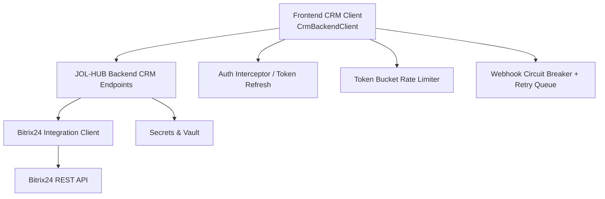

**Diagram sources**
- [backend-client.ts:94-262](file://frontend/packages/bitrix-sdk/src/backend-client.ts#L94-L262)
- [client.py:91-362](file://backend/integrations/bitrix24/client.py#L91-L362)
- [vault.py:59-458](file://backend/django/apps/core/vault.py#L59-L458)
- [secrets.py:100-200](file://backend/django/apps/core/secrets.py#L100-L200)
- [route.ts:157-264](file://frontend/apps/admin-dashboard/src/app/api/bitrix24/webhook/route.ts#L157-L264)
- [bitrix-api.ts:105-161](file://frontend/packages/auth/src/lib/bitrix-api.ts#L105-L161)
- [apiClient.ts:45-89](file://frontend/react/src/lib/apiClient.ts#L45-L89)

**Section sources**
- [backend-client.ts:1-262](file://frontend/packages/bitrix-sdk/src/backend-client.ts#L1-L262)
- [client.py:1-403](file://backend/integrations/bitrix24/client.py#L1-L403)
- [vault.py:1-459](file://backend/django/apps/core/vault.py#L1-L459)
- [secrets.py:1-418](file://backend/django/apps/core/secrets.py#L1-L418)
- [route.ts:157-264](file://frontend/apps/admin-dashboard/src/app/api/bitrix24/webhook/route.ts#L157-L264)
- [bitrix-api.ts:105-161](file://frontend/packages/auth/src/lib/bitrix-api.ts#L105-L161)
- [apiClient.ts:45-89](file://frontend/react/src/lib/apiClient.ts#L45-L89)

## Core Components
- Frontend CRM client: A typed HTTP client that calls JOL-HUB backend CRM endpoints, enforces timeouts, classifies errors, and applies idempotent GET retries with exponential backoff; POST requests only retry on rate-limit to avoid duplicates.
- Backend Bitrix24 client: An async HTTP client using httpx with rate limiting, retries, batch support, token refresh, and audit logging.
- Secrets management: Unified access to AWS Secrets Manager and HashiCorp Vault with caching, TTL, and environment variable fallbacks.
- Throttling: Django rate limiters for auth, GDPR export/delete, donations create/refund.
- Webhook resilience: Per-country circuit breaker state machine and retry queue with exponential backoff and jitter.
- Auth interceptor: Axios interceptors inject Authorization headers and handle silent token refresh on 401.

**Section sources**
- [backend-client.ts:73-109](file://frontend/packages/bitrix-sdk/src/backend-client.ts#L73-L109)
- [client.py:51-127](file://backend/integrations/bitrix24/client.py#L51-L127)
- [vault.py:59-126](file://backend/django/apps/core/vault.py#L59-L126)
- [secrets.py:38-80](file://backend/django/apps/core/secrets.py#L38-L80)
- [throttling.py:15-77](file://backend/django/apps/core/throttling.py#L15-L77)
- [route.ts:157-264](file://frontend/apps/admin-dashboard/src/app/api/bitrix24/webhook/route.ts#L157-L264)
- [apiClient.ts:45-89](file://frontend/react/src/lib/apiClient.ts#L45-L89)

## Architecture Overview
The system uses a layered approach:
- Frontend CRM client sends tenant-scoped requests to the backend CRM API. It classifies errors into a stable taxonomy and retries idempotent GETs with exponential backoff.
- The backend integrates with Bitrix24 via an async client that enforces rate limits, retries transient failures, supports batch operations, and logs compliance events.
- Credentials are loaded from AWS Secrets Manager or HashiCorp Vault with environment fallbacks and caching.
- Webhooks use a per-tenant circuit breaker and retry queue to degrade gracefully under upstream failures.

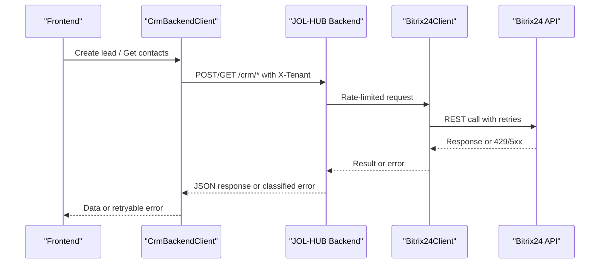

**Diagram sources**
- [backend-client.ts:116-162](file://frontend/packages/bitrix-sdk/src/backend-client.ts#L116-L162)
- [client.py:168-202](file://backend/integrations/bitrix24/client.py#L168-L202)
- [client.py:246-321](file://backend/integrations/bitrix24/client.py#L246-L321)

## Detailed Component Analysis

### Frontend CRM Client (CrmBackendClient)
- Purpose: Call JOL-HUB backend CRM endpoints with tenant isolation, timeouts, and resilient retries.
- Key behaviors:
  - Timeouts via AbortController.
  - Error classification into a stable taxonomy (auth-rotation, rate-limit, validation, server, network, timeout).
  - Idempotent GET retries with exponential backoff; mutations only retry on 429 to prevent duplicates.
  - Tenant scoping via X-Tenant header.
  - Safe user-facing messages without leaking internals.

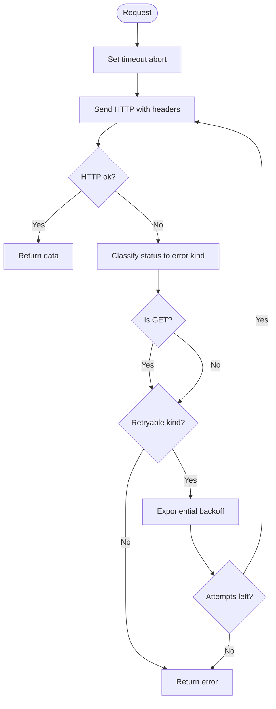

**Diagram sources**
- [backend-client.ts:168-243](file://frontend/packages/bitrix-sdk/src/backend-client.ts#L168-L243)

**Section sources**
- [backend-client.ts:73-109](file://frontend/packages/bitrix-sdk/src/backend-client.ts#L73-L109)
- [backend-client.ts:168-243](file://frontend/packages/bitrix-sdk/src/backend-client.ts#L168-L243)
- [crm.test.ts:101-228](file://frontend/packages/bitrix-sdk/src/__tests__/crm.test.ts#L101-L228)

### Backend Bitrix24 Client
- Purpose: Provide a robust async client for Bitrix24 REST API with rate limiting, retries, batch operations, token refresh, and audit logging.
- Key behaviors:
  - Rate limiting per second to respect Bitrix quotas.
  - Retries on rate-limit and timeouts with exponential backoff.
  - Batch endpoint support for multiple commands.
  - Audit logging for successful and failed calls.
  - Sync wrapper for synchronous contexts.

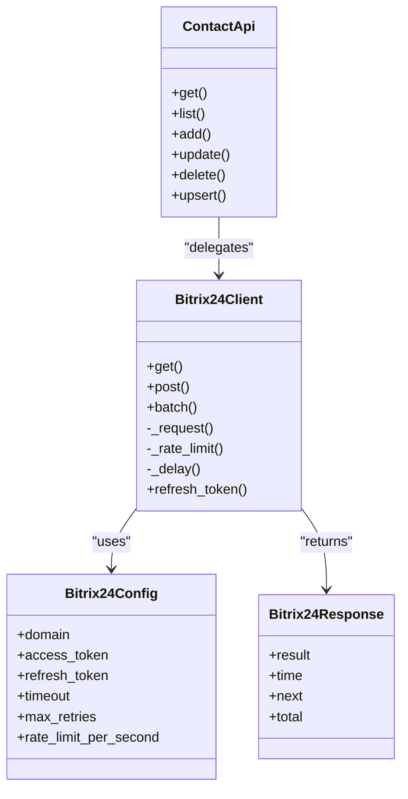

**Diagram sources**
- [client.py:51-127](file://backend/integrations/bitrix24/client.py#L51-L127)
- [client.py:168-362](file://backend/integrations/bitrix24/client.py#L168-L362)
- [contacts.py:13-81](file://backend/integrations/bitrix24/api/contacts.py#L13-L81)
- [contacts.py:138-290](file://backend/integrations/bitrix24/api/contacts.py#L138-L290)

**Section sources**
- [client.py:91-362](file://backend/integrations/bitrix24/client.py#L91-L362)
- [contacts.py:138-290](file://backend/integrations/bitrix24/api/contacts.py#L138-L290)

### Secrets Management (AWS Secrets Manager and HashiCorp Vault)
- AWS Secrets Manager:
  - Centralized retrieval with TTL-based caching and environment fallback.
  - Helpers for database URL, email credentials, Bitrix24 credentials, encryption keys, Django secret key, NextAuth secret.
- HashiCorp Vault:
  - Multi-auth methods (IAM role, Kubernetes, AppRole, token).
  - KV v2 reads with caching and environment fallback.
  - Secret write and cache invalidation.
  - Singleton client and convenience functions.

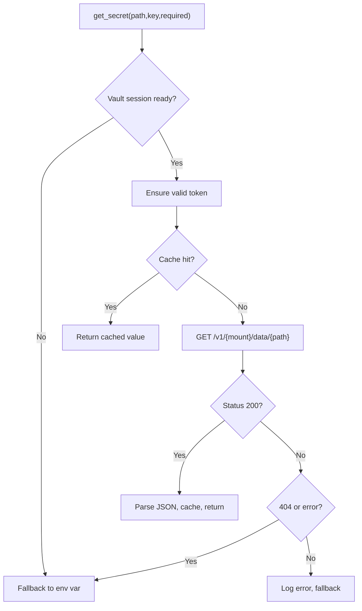

**Diagram sources**
- [vault.py:293-378](file://backend/django/apps/core/vault.py#L293-L378)
- [secrets.py:100-200](file://backend/django/apps/core/secrets.py#L100-L200)

**Section sources**
- [vault.py:59-458](file://backend/django/apps/core/vault.py#L59-L458)
- [secrets.py:100-200](file://backend/django/apps/core/secrets.py#L100-L200)

### Request/Response Transformation and Serialization
- Frontend CRM client serializes payloads to JSON and sets appropriate headers; responses are parsed to typed models defined by the SDK types.
- Backend Bitrix24 client wraps responses in a standard Bitrix24Response and maps fields to domain models (e.g., Bitrix24Contact).
- Data mapping includes custom fields for CRM entities and parsing helpers for dates and booleans.

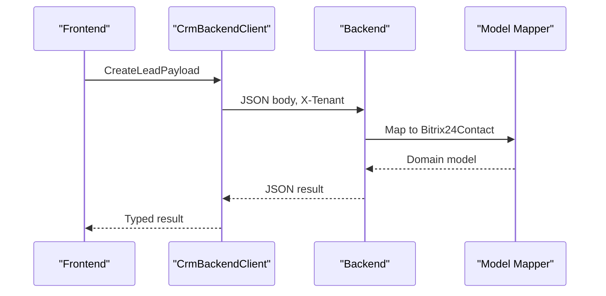

**Diagram sources**
- [backend-client.ts:116-162](file://frontend/packages/bitrix-sdk/src/backend-client.ts#L116-L162)
- [contacts.py:13-81](file://backend/integrations/bitrix24/api/contacts.py#L13-L81)
- [contacts.py:183-205](file://backend/integrations/bitrix24/api/contacts.py#L183-L205)

**Section sources**
- [backend-client.ts:116-162](file://frontend/packages/bitrix-sdk/src/backend-client.ts#L116-L162)
- [contacts.py:13-81](file://backend/integrations/bitrix24/api/contacts.py#L13-L81)

### Rate Limiting Strategies
- Frontend token bucket: Limits outgoing requests per second to Bitrix24 via a token refill mechanism.
- Backend Bitrix24 client: Enforces per-second rate limiting before each request.
- Django throttling: Protects sensitive endpoints with per-user scopes.

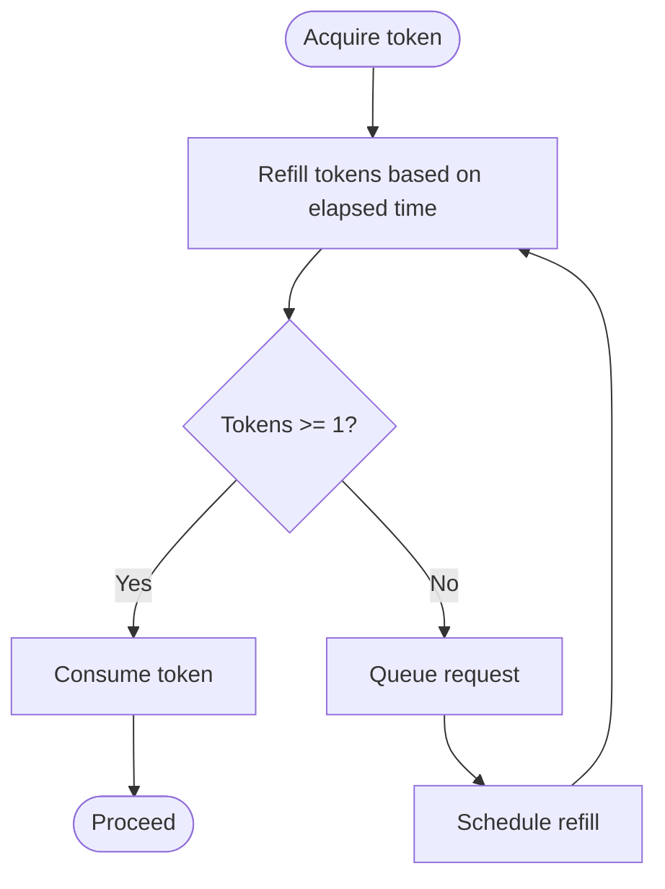

**Diagram sources**
- [bitrix-api.ts:105-161](file://frontend/packages/auth/src/lib/bitrix-api.ts#L105-L161)
- [client.py:323-336](file://backend/integrations/bitrix24/client.py#L323-L336)
- [throttling.py:15-77](file://backend/django/apps/core/throttling.py#L15-L77)

**Section sources**
- [bitrix-api.ts:105-161](file://frontend/packages/auth/src/lib/bitrix-api.ts#L105-L161)
- [client.py:323-336](file://backend/integrations/bitrix24/client.py#L323-L336)
- [throttling.py:15-77](file://backend/django/apps/core/throttling.py#L15-L77)

### Exponential Backoff and Graceful Degradation
- Frontend CRM client: Exponential backoff for GET retries; POST only retries on 429 to avoid duplicate side effects.
- Backend Bitrix24 client: Retries on 429 and timeouts with exponential delays.
- Webhook handler: Per-country circuit breaker with open/half-open/closed states and retry queue with exponential backoff and jitter.

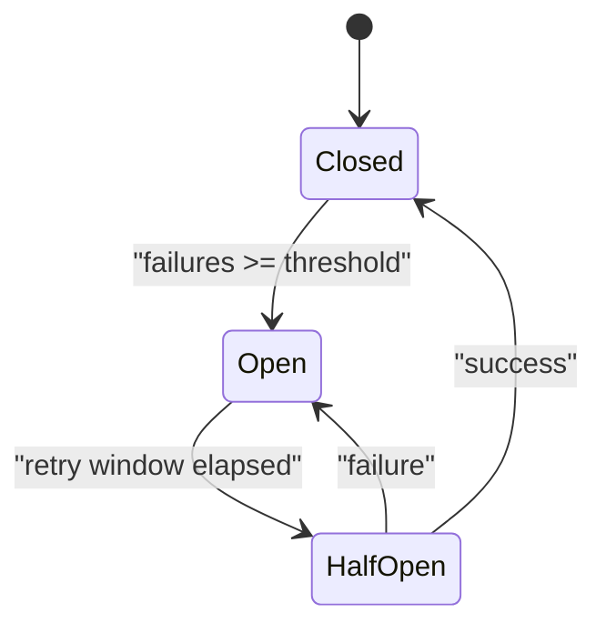

**Diagram sources**
- [route.ts:157-221](file://frontend/apps/admin-dashboard/src/app/api/bitrix24/webhook/route.ts#L157-L221)

**Section sources**
- [backend-client.ts:168-192](file://frontend/packages/bitrix-sdk/src/backend-client.ts#L168-L192)
- [client.py:258-321](file://backend/integrations/bitrix24/client.py#L258-L321)
- [route.ts:224-264](file://frontend/apps/admin-dashboard/src/app/api/bitrix24/webhook/route.ts#L224-L264)

### Security Best Practices
- TLS enforcement and secure transport policies documented in the security model.
- Secrets stored in AWS Secrets Manager and HashiCorp Vault with environment fallbacks.
- Django settings load environment variables securely; CSRF and CORS configured.
- Frontend auth interceptor ensures Authorization headers and handles token refresh on 401.

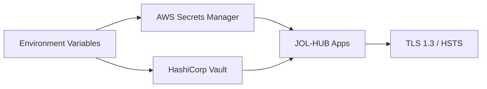

**Diagram sources**
- [security-model.md:144-166](file://docs/architecture/security-model.md#L144-L166)
- [secrets.py:100-200](file://backend/django/apps/core/secrets.py#L100-L200)
- [vault.py:59-126](file://backend/django/apps/core/vault.py#L59-L126)
- [base.py:121-145](file://backend/django/core/settings/base.py#L121-L145)
- [apiClient.ts:45-89](file://frontend/react/src/lib/apiClient.ts#L45-L89)

**Section sources**
- [security-model.md:110-166](file://docs/architecture/security-model.md#L110-L166)
- [secrets.py:100-200](file://backend/django/apps/core/secrets.py#L100-L200)
- [vault.py:59-126](file://backend/django/apps/core/vault.py#L59-L126)
- [base.py:121-145](file://backend/django/core/settings/base.py#L121-L145)
- [apiClient.ts:45-89](file://frontend/react/src/lib/apiClient.ts#L45-L89)

### Testing Strategies for External Dependencies
- Deterministic tests with no real network: MSW handlers mock backend responses; injected fetch implementations simulate failures and retries.
- Contract testing: Tests assert error taxonomy, retry counts, and headers (e.g., X-Tenant).
- Shared test harness provides render utilities, mocks, and fixtures ensuring isolation and determinism.

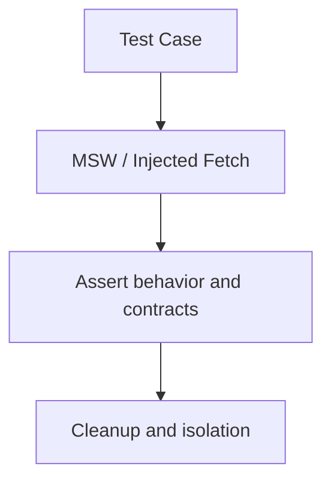

**Diagram sources**
- [crm.test.ts:71-99](file://frontend/packages/bitrix-sdk/src/__tests__/crm.test.ts#L71-L99)
- [api.ts:1-33](file://frontend/packages/testing/src/mocks/api.ts#L1-L33)
- [index.ts:1-38](file://frontend/packages/testing/src/index.ts#L1-L38)
- [testing.md:91-117](file://frontend/docs/testing.md#L91-L117)

**Section sources**
- [crm.test.ts:101-228](file://frontend/packages/bitrix-sdk/src/__tests__/crm.test.ts#L101-L228)
- [testing.md:91-117](file://frontend/docs/testing.md#L91-L117)
- [index.ts:1-38](file://frontend/packages/testing/src/index.ts#L1-L38)
- [api.ts:1-33](file://frontend/packages/testing/src/mocks/api.ts#L1-L33)

## Dependency Analysis
- Frontend CRM client depends on:
  - Fetch implementation (injectable for tests).
  - Error taxonomy and backoff utilities.
  - Tenant context via X-Tenant header.
- Backend Bitrix24 client depends on:
  - httpx for async HTTP.
  - Settings for domain and credentials.
  - Audit logger for compliance.
- Secrets clients depend on:
  - boto3 for AWS Secrets Manager.
  - requests for Vault interactions.
  - Environment variables for fallback.

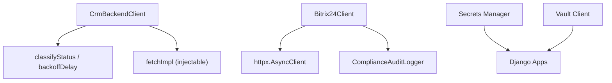

**Diagram sources**
- [backend-client.ts:73-109](file://frontend/packages/bitrix-sdk/src/backend-client.ts#L73-L109)
- [client.py:246-321](file://backend/integrations/bitrix24/client.py#L246-L321)
- [vault.py:59-126](file://backend/django/apps/core/vault.py#L59-L126)
- [secrets.py:53-75](file://backend/django/apps/core/secrets.py#L53-L75)

**Section sources**
- [backend-client.ts:73-109](file://frontend/packages/bitrix-sdk/src/backend-client.ts#L73-L109)
- [client.py:246-321](file://backend/integrations/bitrix24/client.py#L246-L321)
- [vault.py:59-126](file://backend/django/apps/core/vault.py#L59-L126)
- [secrets.py:53-75](file://backend/django/apps/core/secrets.py#L53-L75)

## Performance Considerations
- Use exponential backoff to reduce load during transient failures.
- Limit retries for non-idempotent operations to prevent duplicates.
- Apply rate limiting at both frontend and backend to respect service quotas.
- Cache secrets with TTL to minimize remote calls.
- Use batch endpoints where available to reduce round trips.
- Configure timeouts to fail fast and release resources promptly.

[No sources needed since this section provides general guidance]

## Troubleshooting Guide
- Authentication rotation: 401 indicates credential rotation; surface a retryable message to users and allow UI-level retry.
- Rate limits: 429 triggers backoff; honor Retry-After when present.
- Network issues: Network errors map to a retryable category for GETs; ensure timeouts are set appropriately.
- Validation errors: Non-retryable; surface truncated details safely.
- Secrets not found: Check Vault/Secrets Manager paths and environment fallbacks; required flags will raise explicit errors.

**Section sources**
- [backend-client.ts:168-243](file://frontend/packages/bitrix-sdk/src/backend-client.ts#L168-L243)
- [client.py:258-321](file://backend/integrations/bitrix24/client.py#L258-L321)
- [vault.py:293-378](file://backend/django/apps/core/vault.py#L293-L378)
- [secrets.py:100-200](file://backend/django/apps/core/secrets.py#L100-L200)

## Conclusion
JOL-HUB implements a resilient, secure, and maintainable external API communication pattern:
- Frontend CRM client focuses on tenant isolation, error classification, and safe retries.
- Backend integration enforces rate limits, retries, batching, and audit logging.
- Secrets are centrally managed with caching and fallbacks.
- Webhooks degrade gracefully with circuit breakers and retry queues.
- Security is enforced via TLS, strict headers, and centralized credential storage.
- Testing ensures deterministic behavior and contract adherence.

[No sources needed since this section summarizes without analyzing specific files]

## Appendices

### Example API Clients by Service Type
- REST APIs: CrmBackendClient for hub CRM endpoints; Bitrix24Client for Bitrix24 REST.
- SOAP endpoints: Not implemented in the referenced code; extend the integration layer with a SOAP client if needed.
- File-based integrations: Not present in the referenced code; consider adding file upload/download handlers with secure storage and scanning.

[No sources needed since this section does not analyze specific files]