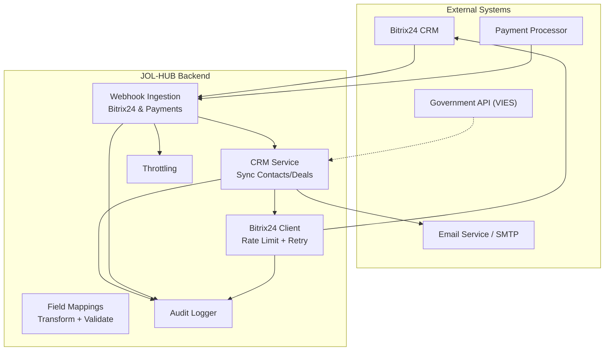
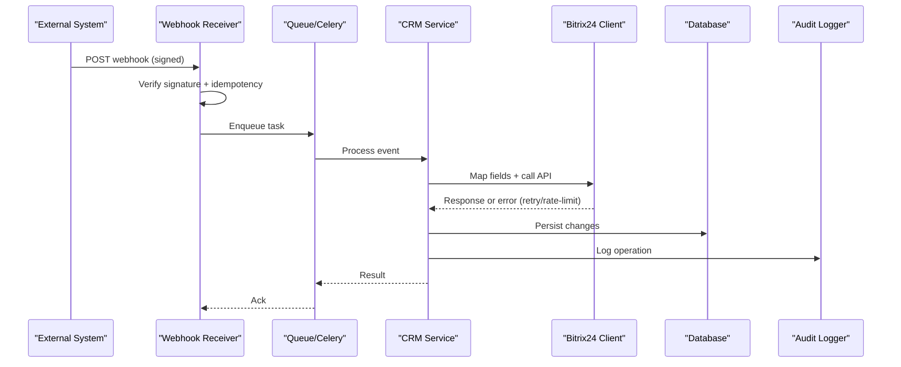
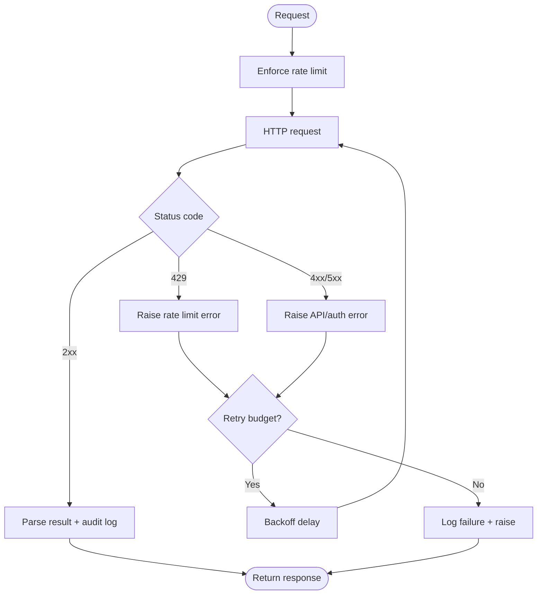
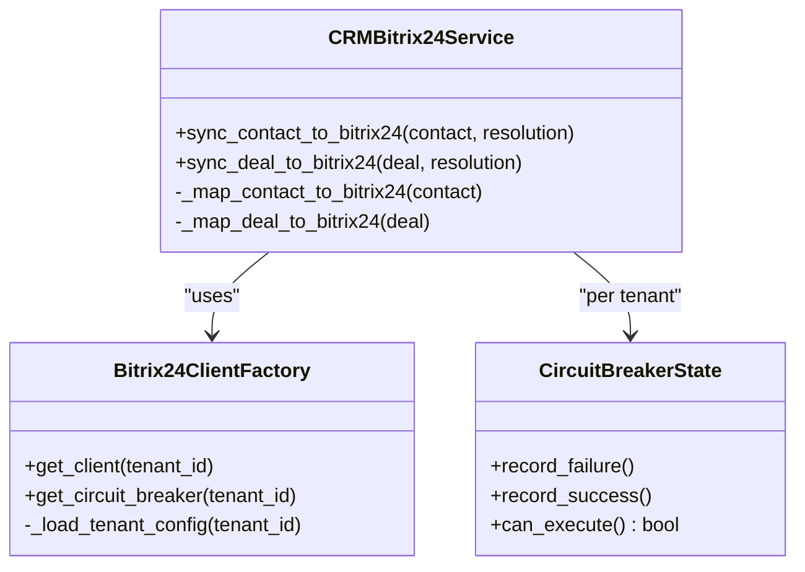
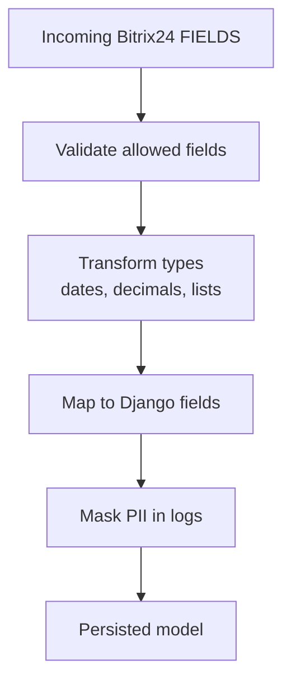
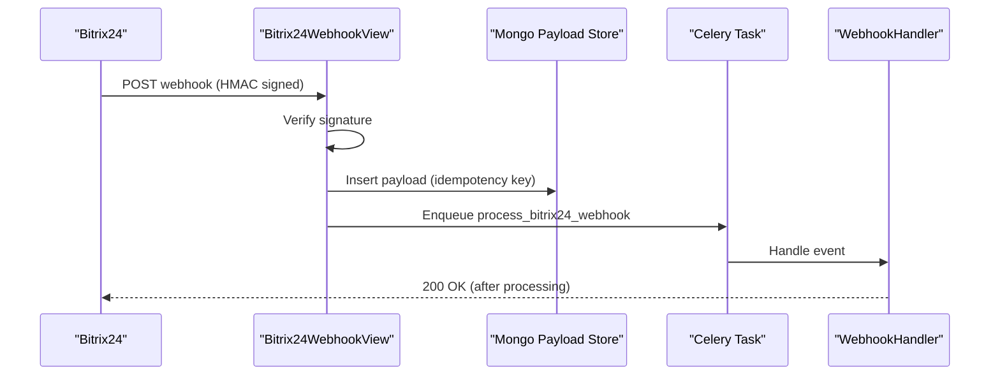
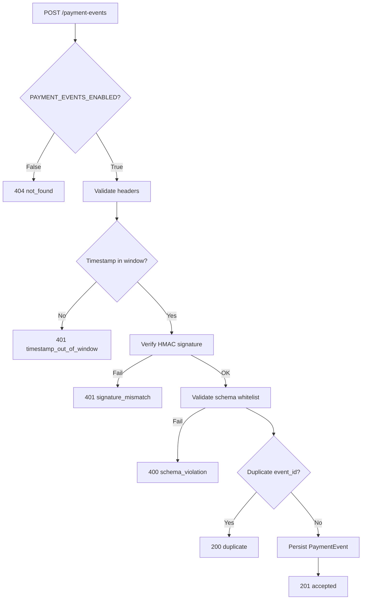
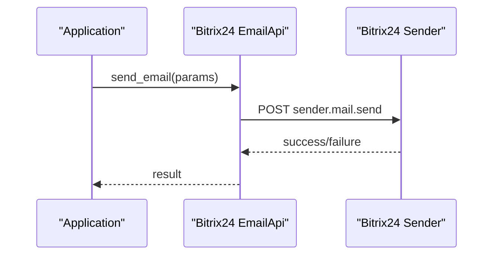
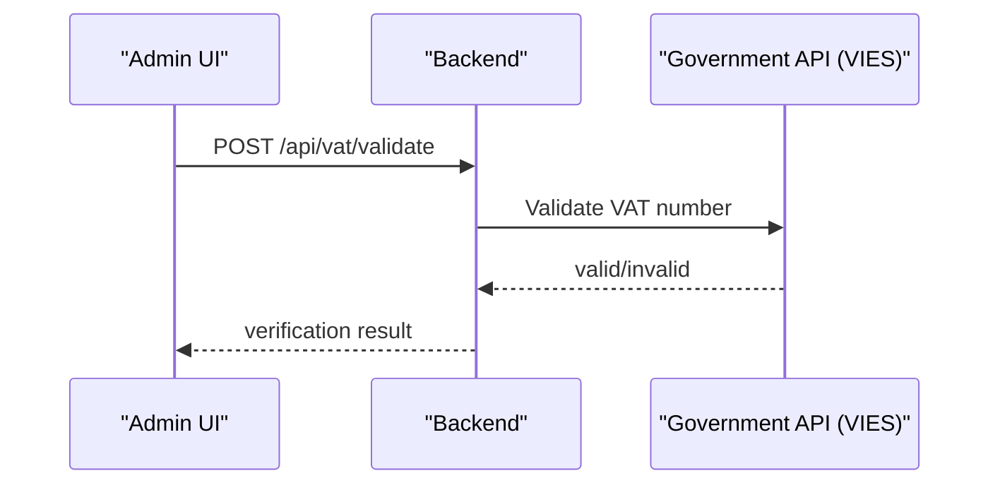
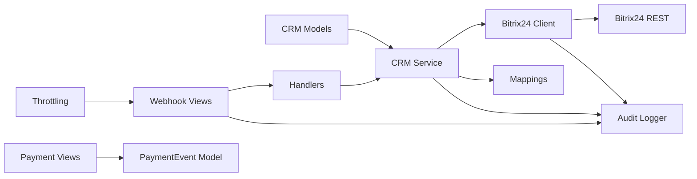

# External Integration Flows

<cite>
**Referenced Files in This Document**
- [client.py](file://backend/integrations/bitrix24/client.py)
- [bitrix24_service.py](file://backend/django/apps/crm/bitrix24_service.py)
- [bitrix24_mappings.py](file://backend/django/apps/integrations/bitrix24_mappings.py)
- [handlers.py](file://backend/integrations/bitrix24/webhooks/handlers.py)
- [views.py](file://backend/django/apps/integrations/views.py)
- [payment_views.py](file://backend/django/apps/payment_events/views.py)
- [contacts.py](file://backend/integrations/bitrix24/api/contacts.py)
- [deals.py](file://backend/integrations/bitrix24/api/deals.py)
- [models.py](file://backend/django/apps/crm/models.py)
- [throttling.py](file://backend/django/apps/core/throttling.py)
- [secrets.py](file://backend/django/apps/core/secrets.py)
- [email_api.py](file://backend/integrations/bitrix24/api/email.py)
</cite>

## Table of Contents
1. [Introduction](#introduction)
2. [Project Structure](#project-structure)
3. [Core Components](#core-components)
4. [Architecture Overview](#architecture-overview)
5. [Detailed Component Analysis](#detailed-component-analysis)
6. [Dependency Analysis](#dependency-analysis)
7. [Performance Considerations](#performance-considerations)
8. [Troubleshooting Guide](#troubleshooting-guide)
9. [Conclusion](#conclusion)
10. [Appendices](#appendices)

## Introduction
This document explains how JOL-HUB integrates with external systems, focusing on:
- Bi-directional synchronization with Bitrix24 CRM (contacts and deals)
- Payment processor event ingestion and idempotent acceptance
- Email service integration via Bitrix24 sender API and SMTP configuration
- Government identity verification patterns (VAT validation flow)
It covers webhook handling, API rate limiting, retry mechanisms, error recovery, data mapping, field transformations, validation rules, security, authentication, audit logging, monitoring, alerting, and troubleshooting.

## Project Structure
The integration surface spans several modules:
- Bitrix24 client and APIs for contacts, deals, email, and events
- Webhook handlers for Bitrix24 and payment events
- Mapping and transformation utilities for safe, auditable data conversion
- Throttling and circuit breaker patterns to protect services
- Audit logging and compliance helpers

**Diagram sources**
- [views.py:195-293](file://backend/django/apps/integrations/views.py#L195-L293)
- [payment_views.py:79-143](file://backend/django/apps/payment_events/views.py#L79-L143)
- [client.py:168-321](file://backend/integrations/bitrix24/client.py#L168-L321)
- [bitrix24_service.py:302-468](file://backend/django/apps/crm/bitrix24_service.py#L302-L468)
- [bitrix24_mappings.py:30-162](file://backend/django/apps/integrations/bitrix24_mappings.py#L30-L162)
- [throttling.py:18-77](file://backend/django/apps/core/throttling.py#L18-L77)

**Section sources**
- [views.py:1-332](file://backend/django/apps/integrations/views.py#L1-L332)
- [payment_views.py:1-144](file://backend/django/apps/payment_events/views.py#L1-L144)
- [client.py:1-403](file://backend/integrations/bitrix24/client.py#L1-L403)
- [bitrix24_service.py:1-572](file://backend/django/apps/crm/bitrix24_service.py#L1-L572)
- [bitrix24_mappings.py:1-368](file://backend/django/apps/integrations/bitrix24_mappings.py#L1-L368)
- [throttling.py:1-77](file://backend/django/apps/core/throttling.py#L1-L77)

## Core Components
- Bitrix24 client: HTTP client with rate limiting, retries, batch support, and audit logging.
- CRM service: Tenant-aware sync for contacts and deals with conflict resolution and circuit breaker.
- Field mappings: Explicit, validated transformations between Bitrix24 and internal models, including PII masking and consent detection.
- Webhook ingestion: Secure, idempotent receivers for Bitrix24 and payment events; async processing via Celery.
- Payment event receiver: Strict envelope validation, HMAC signature verification, replay window, deduplication, and durable persistence.
- Email integration: Bitrix24 sender API and SMTP credential management.
- Throttling: Rate limits for sensitive endpoints to prevent abuse.

**Section sources**
- [client.py:91-321](file://backend/integrations/bitrix24/client.py#L91-L321)
- [bitrix24_service.py:109-300](file://backend/django/apps/crm/bitrix24_service.py#L109-L300)
- [bitrix24_mappings.py:25-162](file://backend/django/apps/integrations/bitrix24_mappings.py#L25-L162)
- [views.py:195-293](file://backend/django/apps/integrations/views.py#L195-L293)
- [payment_views.py:79-143](file://backend/django/apps/payment_events/views.py#L79-L143)
- [email_api.py:214-224](file://backend/integrations/bitrix24/api/email.py#L214-L224)
- [secrets.py:255-298](file://backend/django/apps/core/secrets.py#L255-L298)
- [throttling.py:18-77](file://backend/django/apps/core/throttling.py#L18-L77)

## Architecture Overview
End-to-end flows for key integrations:

**Diagram sources**
- [views.py:195-293](file://backend/django/apps/integrations/views.py#L195-L293)
- [handlers.py:129-152](file://backend/integrations/bitrix24/webhooks/handlers.py#L129-L152)
- [bitrix24_service.py:302-468](file://backend/django/apps/crm/bitrix24_service.py#L302-L468)
- [client.py:246-321](file://backend/integrations/bitrix24/client.py#L246-L321)

## Detailed Component Analysis

### Bitrix24 Client: Rate Limiting, Retries, Batch, Audit
- Rate limiting: Enforces per-second request cadence before outbound calls.
- Retries: Exponential backoff with jitter for timeouts and rate limit errors; distinguishes auth vs. API errors.
- Batch: Aggregates multiple commands into a single request to reduce overhead.
- Audit: Logs successful and failed API calls with entity context.

**Diagram sources**
- [client.py:168-321](file://backend/integrations/bitrix24/client.py#L168-L321)

**Section sources**
- [client.py:91-321](file://backend/integrations/bitrix24/client.py#L91-L321)

### CRM Service: Contact and Deal Sync
- Tenant-aware client factory with caching and circuit breaker.
- Bidirectional sync: Local → Bitrix24 and Bitrix24 → Local via webhooks.
- Conflict resolution strategies: local_wins, remote_wins, latest_wins, manual.
- Audit entries created for each sync operation.

**Diagram sources**
- [bitrix24_service.py:109-300](file://backend/django/apps/crm/bitrix24_service.py#L109-L300)
- [bitrix24_service.py:302-468](file://backend/django/apps/crm/bitrix24_service.py#L302-L468)

**Section sources**
- [bitrix24_service.py:109-468](file://backend/django/apps/crm/bitrix24_service.py#L109-L468)

### Field Mappings and Validation
- Explicit maps from Bitrix24 fields to Django model attributes for contacts and leads.
- Whitelist validation rejects unknown fields to prevent leakage from undocumented API changes.
- Helpers extract multi-value fields (emails, phones), parse dates, decimals, and map source IDs.
- PII masking for audit logs and consent detection from custom fields.

**Diagram sources**
- [bitrix24_mappings.py:30-162](file://backend/django/apps/integrations/bitrix24_mappings.py#L30-L162)
- [bitrix24_mappings.py:169-368](file://backend/django/apps/integrations/bitrix24_mappings.py#L169-L368)

**Section sources**
- [bitrix24_mappings.py:25-368](file://backend/django/apps/integrations/bitrix24_mappings.py#L25-L368)

### Webhook Handling: Bitrix24
- Signature verification using HMAC-SHA256 against configured secret.
- Idempotency via structured keys (domain, event, entity ID, timestamp) or raw body hash.
- Country-scoped routing for GDPR Article 44 compliance.
- Fast path: store payload and enqueue async task; return 202 Accepted quickly.

**Diagram sources**
- [views.py:195-293](file://backend/django/apps/integrations/views.py#L195-L293)
- [handlers.py:129-152](file://backend/integrations/bitrix24/webhooks/handlers.py#L129-L152)

**Section sources**
- [views.py:54-293](file://backend/django/apps/integrations/views.py#L54-L293)
- [handlers.py:63-152](file://backend/integrations/bitrix24/webhooks/handlers.py#L63-L152)

### Webhook Handling: Payment Events
- Feature-gated endpoint; returns 404 when disabled.
- Required headers: product, timestamp, signature.
- Replay window enforcement and HMAC verification.
- Schema whitelist validation; duplicates return 200 no-op.
- Durable persistence before downstream processing.

**Diagram sources**
- [payment_views.py:79-143](file://backend/django/apps/payment_events/views.py#L79-L143)

**Section sources**
- [payment_views.py:1-144](file://backend/django/apps/payment_events/views.py#L1-L144)

### Email Integrations
- Bitrix24 sender API supports sending emails and managing templates with audit logging.
- SMTP credentials are retrieved securely from secrets manager with environment fallbacks.

**Diagram sources**
- [email_api.py:214-224](file://backend/integrations/bitrix24/api/email.py#L214-L224)
- [secrets.py:255-298](file://backend/django/apps/core/secrets.py#L255-L298)

**Section sources**
- [email_api.py:174-224](file://backend/integrations/bitrix24/api/email.py#L174-L224)
- [secrets.py:255-298](file://backend/django/apps/core/secrets.py#L255-L298)

### Government Identity Verification (VAT)
- Frontend triggers VAT validation via backend endpoint; backend can call government APIs (e.g., VIES).
- Results update verification status and maintain audit trail.

[No diagram sources needed since this section describes a conceptual flow without direct file mapping]

**Section sources**
- [CommercialVerify.tsx:92-127](file://frontend/apps/admin-dashboard/src/components/entities/CommercialVerify.tsx#L92-L127)

## Dependency Analysis
Key dependencies and coupling:
- CRM service depends on Bitrix24 client and mapping utilities.
- Webhook views depend on secure signature verification and idempotency storage.
- Payment receiver depends on strict header/schema validation and HMAC verification.
- Audit logger is used across clients and services for compliance.
- Throttling protects sensitive endpoints.

**Diagram sources**
- [bitrix24_service.py:302-468](file://backend/django/apps/crm/bitrix24_service.py#L302-L468)
- [client.py:168-321](file://backend/integrations/bitrix24/client.py#L168-L321)
- [views.py:195-293](file://backend/django/apps/integrations/views.py#L195-L293)
- [payment_views.py:79-143](file://backend/django/apps/payment_events/views.py#L79-L143)
- [throttling.py:18-77](file://backend/django/apps/core/throttling.py#L18-L77)

**Section sources**
- [bitrix24_service.py:109-468](file://backend/django/apps/crm/bitrix24_service.py#L109-L468)
- [client.py:91-321](file://backend/integrations/bitrix24/client.py#L91-L321)
- [views.py:195-293](file://backend/django/apps/integrations/views.py#L195-L293)
- [payment_views.py:79-143](file://backend/django/apps/payment_events/views.py#L79-L143)
- [throttling.py:18-77](file://backend/django/apps/core/throttling.py#L18-L77)

## Performance Considerations
- Bitrix24 client enforces per-second rate limits and uses exponential backoff for retries.
- Webhook receivers return early acknowledgments (202 Accepted) and queue work asynchronously to meet tight SLAs.
- Payment receiver validates envelopes and deduplicates to avoid redundant processing.
- Circuit breakers prevent cascade failures during outages.
- Throttling protects sensitive endpoints from abuse.

[No sources needed since this section provides general guidance]

## Troubleshooting Guide
Common issues and resolutions:
- Invalid webhook signatures: Ensure correct secret configuration and verify HMAC computation.
- Duplicate events: Idempotency keys prevent reprocessing; check stored payloads.
- Rate limit errors: Adjust client rate limits or implement backoff; monitor 429 responses.
- Authentication failures: Refresh tokens or reconfigure credentials; check token expiry handling.
- Payment endpoint disabled: Enable feature flag and provision delivery key.
- Audit chain integrity: Use health endpoint to verify chain validity and entry counts.

**Section sources**
- [views.py:101-148](file://backend/django/apps/integrations/views.py#L101-L148)
- [payment_views.py:87-110](file://backend/django/apps/payment_events/views.py#L87-L110)
- [client.py:246-321](file://backend/integrations/bitrix24/client.py#L246-L321)
- [bitrix24_service.py:286-300](file://backend/django/apps/crm/bitrix24_service.py#L286-L300)
- [views.py:296-332](file://backend/django/apps/integrations/views.py#L296-L332)

## Conclusion
JOL-HUB implements robust, compliant external integrations with strong emphasis on security, reliability, and auditability:
- Bitrix24 CRM sync is bidirectional with explicit mappings, conflict resolution, and circuit breaking.
- Payment events are ingested with strict validation, HMAC verification, and idempotent persistence.
- Email integrations leverage Bitrix24 sender API and secure SMTP credentials.
- Government verification flows integrate with external validation services.
Monitoring, throttling, and audit logging ensure operational visibility and compliance.

[No sources needed since this section summarizes without analyzing specific files]

## Appendices

### Data Mapping Examples
- Contact sync: Maps standard and custom fields; handles multi-value emails/phones; masks PII in logs.
- Deal sync: Maps stages, categories, amounts, currencies; links to contacts; records financial transactions.

**Section sources**
- [bitrix24_mappings.py:30-162](file://backend/django/apps/integrations/bitrix24_mappings.py#L30-L162)
- [bitrix24_service.py:470-546](file://backend/django/apps/crm/bitrix24_service.py#L470-L546)

### Security and Authentication
- Webhook signatures verified via HMAC-SHA256.
- Payment events use timestamped HMAC and replay windows.
- Secrets managed centrally with environment fallbacks.
- Audit logging captures all critical operations.

**Section sources**
- [views.py:101-148](file://backend/django/apps/integrations/views.py#L101-L148)
- [payment_views.py:87-110](file://backend/django/apps/payment_events/views.py#L87-L110)
- [secrets.py:255-298](file://backend/django/apps/core/secrets.py#L255-L298)

### Monitoring and Alerting
- Health endpoint exposes circuit breaker status and audit chain integrity.
- Throttling metrics help detect abuse patterns.
- Audit logs provide tamper-evident trails for compliance.

**Section sources**
- [views.py:296-332](file://backend/django/apps/integrations/views.py#L296-L332)
- [throttling.py:18-77](file://backend/django/apps/core/throttling.py#L18-L77)