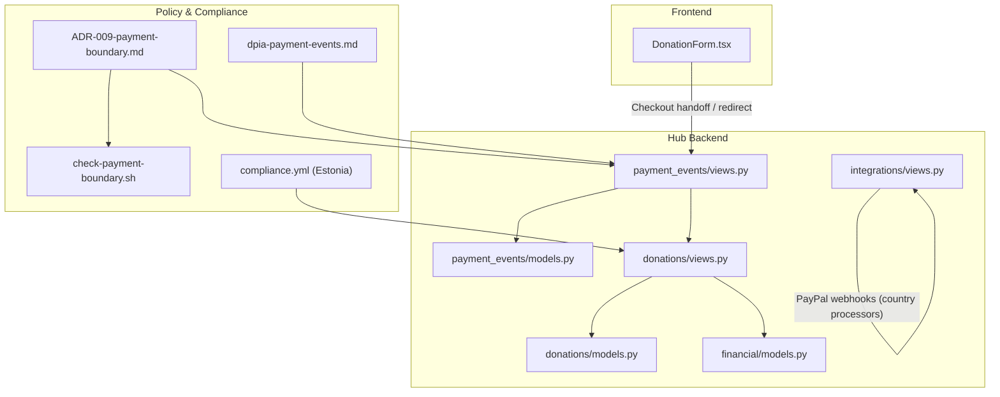
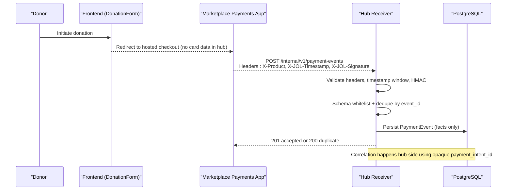
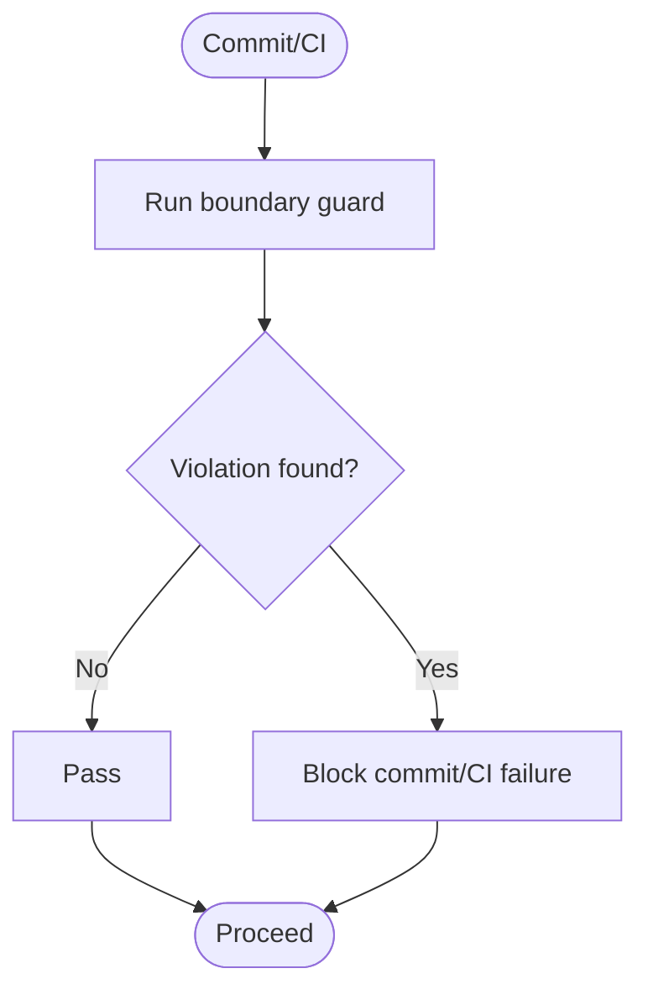
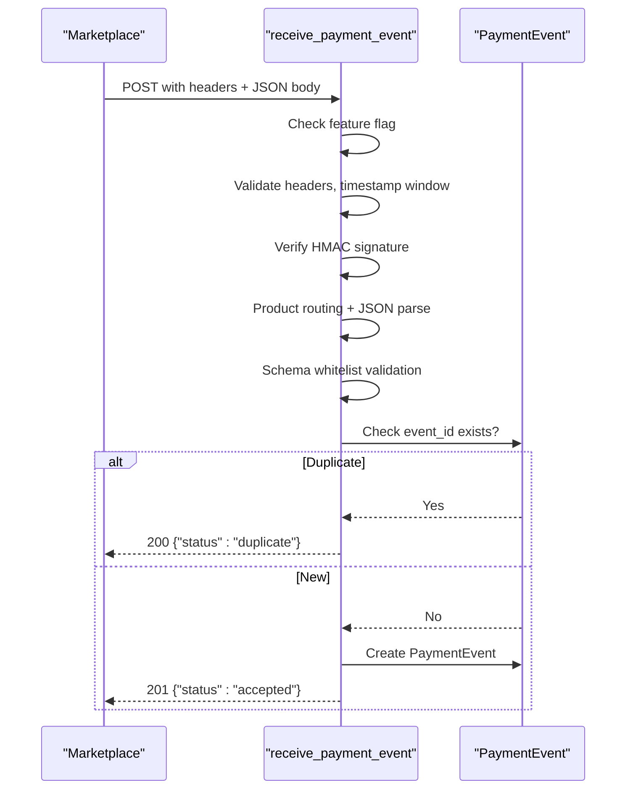
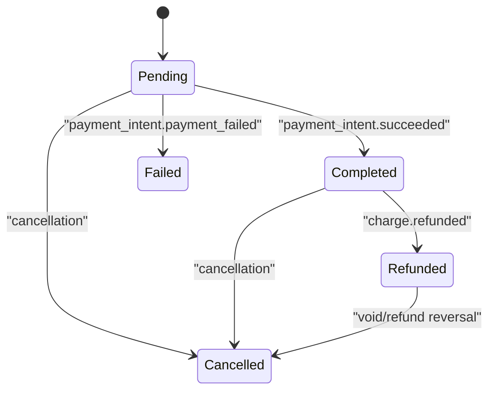
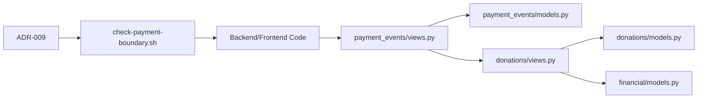

# Payment Processing Integration

<cite>
**Referenced Files in This Document**
- [ADR-009-payment-boundary.md](file://docs/decisions/ADR-009-payment-boundary.md)
- [check-payment-boundary.sh](file://scripts/check-payment-boundary.sh)
- [payment_events/models.py](file://backend/django/apps/payment_events/models.py)
- [payment_events/views.py](file://backend/django/apps/payment_events/views.py)
- [payment_events/test_receiver.py](file://backend/django/apps/payment_events/test_receiver.py)
- [donations/models.py](file://backend/django/apps/donations/models.py)
- [donations/views.py](file://backend/django/apps/donations/views.py)
- [financial/models.py](file://backend/django/apps/financial/models.py)
- [integrations/views.py](file://backend/django/apps/integrations/views.py)
- [core/exceptions.py](file://backend/django/apps/core/exceptions.py)
- [dpia-payment-events.md](file://docs/compliance/dpia-payment-events.md)
- [DonationForm.tsx](file://frontend/apps/template-renderer/src/components/commerce/DonationForm.tsx)
- [compliance.yml (Estonia)](file://countries/ee/config/compliance.yml)
</cite>

## Table of Contents
1. Introduction
2. Project Structure
3. Core Components
4. Architecture Overview
5. Detailed Component Analysis
6. Dependency Analysis
7. Performance Considerations
8. Troubleshooting Guide
9. Conclusion
10. Appendices

## Introduction
This document explains how JOL-HUB implements a PCI-DSS compliant payment boundary and processes payment events from external payment providers. The hub does not directly integrate with payment service providers (PSPs). Instead, it receives signed, schema-whitelisted payment facts via an internal webhook receiver that enforces signature verification, replay protection, idempotency, and strict data minimization. Donation flows, recurring payments, refunds, tax receipts, audit trails, and monitoring are described with concrete references to the codebase.

## Project Structure
The payment-related functionality is split across:
- A closed payment boundary enforced by policy and CI guards
- An internal payment event receiver for durable acceptance of signed facts
- Donation models and views supporting one-time and recurring donations, refunds, and audit logging
- Financial models for invoices and payouts
- Country-specific compliance configuration (e.g., Estonia)

**Diagram sources**
- [ADR-009-payment-boundary.md:1-111](file://docs/decisions/ADR-009-payment-boundary.md#L1-L111)
- [check-payment-boundary.sh:1-193](file://scripts/check-payment-boundary.sh#L1-L193)
- [payment_events/views.py:1-144](file://backend/django/apps/payment_events/views.py#L1-L144)
- [payment_events/models.py:1-36](file://backend/django/apps/payment_events/models.py#L1-L36)
- [donations/models.py:1-146](file://backend/django/apps/donations/models.py#L1-L146)
- [donations/views.py:1-139](file://backend/django/apps/donations/views.py#L1-L139)
- [financial/models.py:1-170](file://backend/django/apps/financial/models.py#L1-L170)
- [integrations/views.py:1-34](file://backend/django/apps/integrations/views.py#L1-L34)
- [dpia-payment-events.md:1-88](file://docs/compliance/dpia-payment-events.md#L1-L88)
- [compliance.yml (Estonia):127-162](file://countries/ee/config/compliance.yml#L127-L162)

**Section sources**
- [ADR-009-payment-boundary.md:1-111](file://docs/decisions/ADR-009-payment-boundary.md#L1-L111)
- [check-payment-boundary.sh:1-193](file://scripts/check-payment-boundary.sh#L1-L193)
- [payment_events/views.py:1-144](file://backend/django/apps/payment_events/views.py#L1-L144)
- [payment_events/models.py:1-36](file://backend/django/apps/payment_events/models.py#L1-L36)
- [donations/models.py:1-146](file://backend/django/apps/donations/models.py#L1-L146)
- [donations/views.py:1-139](file://backend/django/apps/donations/views.py#L1-L139)
- [financial/models.py:1-170](file://backend/django/apps/financial/models.py#L1-L170)
- [integrations/views.py:1-34](file://backend/django/apps/integrations/views.py#L1-L34)
- [dpia-payment-events.md:1-88](file://docs/compliance/dpia-payment-events.md#L1-L88)
- [DonationForm.tsx:1-31](file://frontend/apps/template-renderer/src/components/commerce/DonationForm.tsx#L1-L31)
- [compliance.yml (Estonia):127-162](file://countries/ee/config/compliance.yml#L127-L162)

## Core Components
- Payment Boundary Policy: The hub remains out of PCI scope; PSP integration is confined to the marketplace. Enforcement is automated via a guard script and tests.
- Payment Event Receiver: Accepts signed envelopes, validates headers, timestamps, HMAC signatures, product routing, schema whitelist, deduplicates by event_id, and persists durable facts.
- Donation Model and Views: Tracks donation lifecycle, supports recurring donations, stores transaction IDs and gateway responses, and provides refund handling with tamper-evident audit entries.
- Financial Models: Invoices and payouts for settlement tracking.
- Integrations Webhooks: Country-scoped webhook ingestion (e.g., PayPal) routed to local processors.
- Compliance Configuration: Retention periods and consent templates per country (e.g., Estonia).

**Section sources**
- [ADR-009-payment-boundary.md:1-111](file://docs/decisions/ADR-009-payment-boundary.md#L1-L111)
- [payment_events/views.py:1-144](file://backend/django/apps/payment_events/views.py#L1-L144)
- [payment_events/models.py:1-36](file://backend/django/apps/payment_events/models.py#L1-L36)
- [donations/models.py:1-146](file://backend/django/apps/donations/models.py#L1-L146)
- [donations/views.py:1-139](file://backend/django/apps/donations/views.py#L1-L139)
- [financial/models.py:1-170](file://backend/django/apps/financial/models.py#L1-L170)
- [integrations/views.py:1-34](file://backend/django/apps/integrations/views.py#L1-L34)
- [compliance.yml (Estonia):127-162](file://countries/ee/config/compliance.yml#L127-L162)

## Architecture Overview
The payment flow follows a strict boundary:
- Frontend performs checkout handoff without touching card data (PCI SAQ-A posture).
- Marketplace handles PSP interactions and emits signed payment events to the hub.
- Hub receiver validates and stores only whitelisted facts, never personal data.
- Hub correlates opaque intent IDs to tenant context within isolated schemas.

**Diagram sources**
- [DonationForm.tsx:1-31](file://frontend/apps/template-renderer/src/components/commerce/DonationForm.tsx#L1-L31)
- [payment_events/views.py:79-144](file://backend/django/apps/payment_events/views.py#L79-L144)
- [payment_events/models.py:6-36](file://backend/django/apps/payment_events/models.py#L6-L36)
- [dpia-payment-events.md:22-33](file://docs/compliance/dpia-payment-events.md#L22-L33)

## Detailed Component Analysis

### Payment Boundary and Guardrails
- Policy: The hub stays out of PCI scope; PSP integrations are restricted to the marketplace. Opening the boundary requires verified SAQ A and change control.
- Enforcement: Automated checks scan server code, manifests, full tree, and frontend source for forbidden PSP SDK usage, keys, and endpoints. Exemptions are strictly enumerated and require ADR approval.

**Diagram sources**
- [ADR-009-payment-boundary.md:45-75](file://docs/decisions/ADR-009-payment-boundary.md#L45-L75)
- [check-payment-boundary.sh:132-187](file://scripts/check-payment-boundary.sh#L132-L187)

**Section sources**
- [ADR-009-payment-boundary.md:1-111](file://docs/decisions/ADR-009-payment-boundary.md#L1-L111)
- [check-payment-boundary.sh:1-193](file://scripts/check-payment-boundary.sh#L1-L193)

### Payment Event Receiver (Webhook Handling)
- Security: Requires X-Product, X-JOL-Timestamp, X-JOL-Signature; validates timestamp window; computes constant-time HMAC over {timestamp}.{sha256(body)}; rejects misrouted products.
- Validation: JSON parse, schema whitelist enforcement (exact fields), type checks, ISO datetime parsing.
- Idempotency: Deduplication by unique event_id before side effects; duplicates return 200 no-op.
- Persistence: Durable acceptance first; downstream fulfillment hooks are gated and absent in this scope.
- Feature Flag: Endpoint disabled by default; returns 404 when flag is off.

**Diagram sources**
- [payment_events/views.py:79-144](file://backend/django/apps/payment_events/views.py#L79-L144)
- [payment_events/models.py:6-36](file://backend/django/apps/payment_events/models.py#L6-L36)

**Section sources**
- [payment_events/views.py:1-144](file://backend/django/apps/payment_events/views.py#L1-L144)
- [payment_events/models.py:1-36](file://backend/django/apps/payment_events/models.py#L1-L36)
- [payment_events/test_receiver.py:1-183](file://backend/django/apps/payment_events/test_receiver.py#L1-L183)

### Donation Lifecycle and State Management
- States: pending, completed, failed, refunded, cancelled.
- Fields: amount, currency, payment_method, transaction_id, gateway_response, donor info (optional anonymous), recurring flags, next_charge_at, gift_aid, message.
- Methods: mark_completed updates status, transaction_id, gateway_response, processed_at atomically.
- Refunds: Processed via dedicated view with atomic transaction ensuring refund state and tamper-evident audit entry creation.

**Diagram sources**
- [donations/models.py:13-83](file://backend/django/apps/donations/models.py#L13-L83)
- [donations/views.py:110-139](file://backend/django/apps/donations/views.py#L110-L139)

**Section sources**
- [donations/models.py:1-146](file://backend/django/apps/donations/models.py#L1-L146)
- [donations/views.py:1-139](file://backend/django/apps/donations/views.py#L1-L139)

### Financial Settlement and Records
- Invoice: Tracks issuance, due dates, VAT, totals, line items, and status transitions.
- Payout: Tracks settlement amounts, currencies, statuses, bank account last digits, references, and processing timestamps.
- Tenant isolation: Save methods enforce tenant context validation to prevent cross-tenant manipulation.

**Section sources**
- [financial/models.py:1-170](file://backend/django/apps/financial/models.py#L1-L170)

### Integrations Webhooks (PayPal and Local Processors)
- Country-scoped webhook ingestion routes to local processors per GDPR Article 44.
- PayPal webhook endpoint defined; Stripe webhooks do not land here (marketplace-only).
- Audit logging and circuit breaker considerations apply.

**Section sources**
- [integrations/views.py:1-34](file://backend/django/apps/integrations/views.py#L1-L34)

### Compliance and Retention (Estonia Example)
- Retention periods configured per jurisdiction (e.g., donation records 7 years, financial records 10 years).
- Consent text templates provided in multiple languages.
- Data subject rights and operational constraints documented.

**Section sources**
- [compliance.yml (Estonia):127-162](file://countries/ee/config/compliance.yml#L127-L162)

## Dependency Analysis
- Payment boundary policy depends on automated guard scripts and tests to enforce Model A posture.
- Payment event receiver depends on settings for feature flag, delivery key, and replay window.
- Donation views depend on CRM audit models for tamper-evident logs.
- Financial models depend on organization relationships and tenant context middleware.

**Diagram sources**
- [ADR-009-payment-boundary.md:45-75](file://docs/decisions/ADR-009-payment-boundary.md#L45-L75)
- [check-payment-boundary.sh:132-187](file://scripts/check-payment-boundary.sh#L132-L187)
- [payment_events/views.py:79-144](file://backend/django/apps/payment_events/views.py#L79-L144)
- [payment_events/models.py:6-36](file://backend/django/apps/payment_events/models.py#L6-L36)
- [donations/views.py:110-139](file://backend/django/apps/donations/views.py#L110-L139)
- [donations/models.py:13-83](file://backend/django/apps/donations/models.py#L13-L83)
- [financial/models.py:14-170](file://backend/django/apps/financial/models.py#L14-L170)

**Section sources**
- [ADR-009-payment-boundary.md:1-111](file://docs/decisions/ADR-009-payment-boundary.md#L1-L111)
- [check-payment-boundary.sh:1-193](file://scripts/check-payment-boundary.sh#L1-L193)
- [payment_events/views.py:1-144](file://backend/django/apps/payment_events/views.py#L1-L144)
- [payment_events/models.py:1-36](file://backend/django/apps/payment_events/models.py#L1-L36)
- [donations/views.py:1-139](file://backend/django/apps/donations/views.py#L1-L139)
- [donations/models.py:1-146](file://backend/django/apps/donations/models.py#L1-L146)
- [financial/models.py:1-170](file://backend/django/apps/financial/models.py#L1-L170)

## Performance Considerations
- Signature verification uses constant-time comparison to mitigate timing attacks.
- Deduplication via unique event_id prevents redundant processing and ensures idempotent acceptance.
- Schema whitelist reduces payload size and processing overhead while enforcing minimal data crossing the boundary.
- Feature flag gating avoids unnecessary load when the receiver is disabled.

[No sources needed since this section provides general guidance]

## Troubleshooting Guide
Common issues and resolutions:
- Missing or invalid headers: Ensure X-Product, X-JOL-Timestamp, X-JOL-Signature are present and correctly formatted.
- Timestamp out of window: Align sender clock with receiver; adjust replay window if necessary.
- Signature mismatch: Verify delivery key and HMAC computation on sender side; ensure body hashing matches receiver expectations.
- Schema violation: Confirm all required fields are present and types match; remove extra fields to avoid confusion.
- Duplicate events: Expected behavior; receiver returns 200 with duplicate status.
- Endpoint unavailable: When PAYMENT_EVENTS_ENABLED is false, the endpoint returns 404; enable via change-controlled process.

Error envelope shape:
- Uniform error responses include error code, message, and optional details.

**Section sources**
- [payment_events/views.py:79-144](file://backend/django/apps/payment_events/views.py#L79-L144)
- [payment_events/test_receiver.py:73-183](file://backend/django/apps/payment_events/test_receiver.py#L73-L183)
- [core/exceptions.py:1-50](file://backend/django/apps/core/exceptions.py#L1-L50)

## Conclusion
JOL-HUB implements a robust, PCI-compliant payment boundary by receiving only signed, schema-whitelisted payment facts through a secure webhook receiver. The design minimizes risk, enforces idempotency, and maintains strong audit trails. Donation lifecycle management supports one-time and recurring donations, refunds, and compliance-aligned retention. Country-specific configurations ensure adherence to local regulations.

[No sources needed since this section summarizes without analyzing specific files]

## Appendices

### Payment Event Envelope Contract
- Required fields: event_id, type, product, payment_intent_id, status, amount_cents, currency, occurred_at.
- Allowed event types: payment_intent.succeeded, payment_intent.payment_failed, charge.refunded.
- Extra fields are ignored and never stored.

**Section sources**
- [payment_events/views.py:28-48](file://backend/django/apps/payment_events/views.py#L28-L48)
- [payment_events/models.py:15-29](file://backend/django/apps/payment_events/models.py#L15-L29)

### Donation Processing Flows
- One-time donation: Frontend redirects to hosted checkout; upon success, marketplace sends payment_intent.succeeded; hub accepts and persists fact; donation marked completed.
- Recurring setup: Donation model includes frequency, recurring_plan_id, next_charge_at; future charges scheduled by marketplace; hub receives subsequent events.
- Refund handling: DonationRefundView updates status to refunded and creates tamper-evident audit entry atomically.
- Tax receipt generation: Not implemented in referenced files; typically triggered post-completion based on donation attributes and jurisdiction rules.

**Section sources**
- [donations/models.py:13-83](file://backend/django/apps/donations/models.py#L13-L83)
- [donations/views.py:110-139](file://backend/django/apps/donations/views.py#L110-L139)

### Monitoring and Audit Trails
- Audit entries capture who, when, what changed, and integrity hashes for financial operations.
- Error envelopes standardize response shapes for consistent monitoring and alerting.

**Section sources**
- [donations/views.py:110-139](file://backend/django/apps/donations/views.py#L110-L139)
- [core/exceptions.py:1-50](file://backend/django/apps/core/exceptions.py#L1-L50)