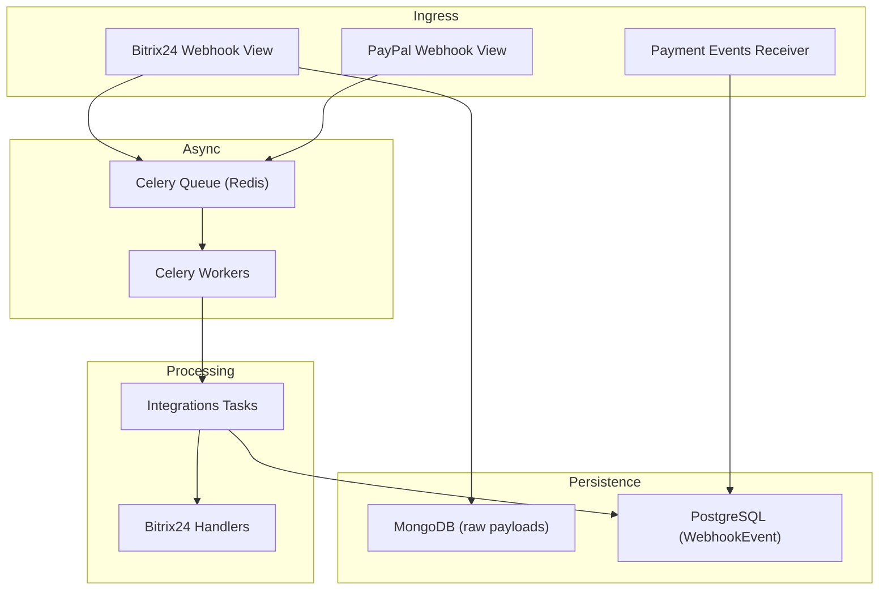
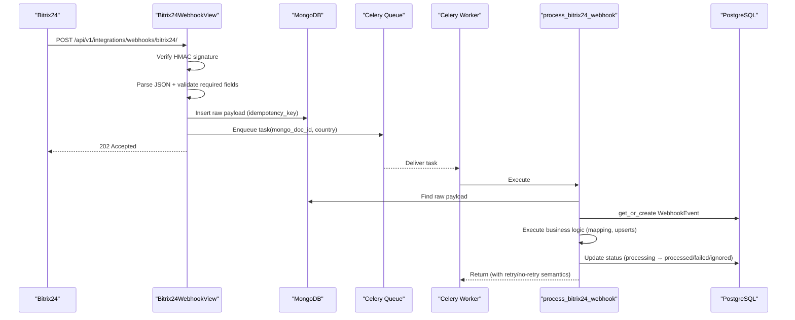
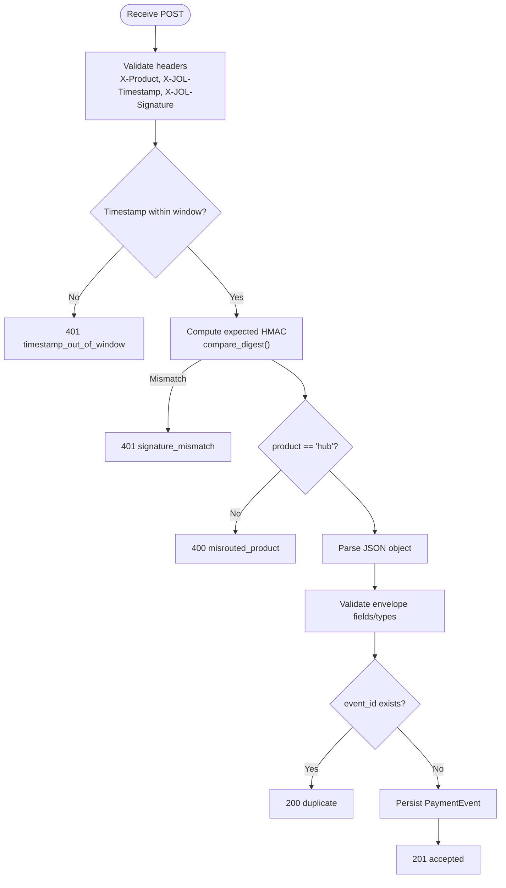
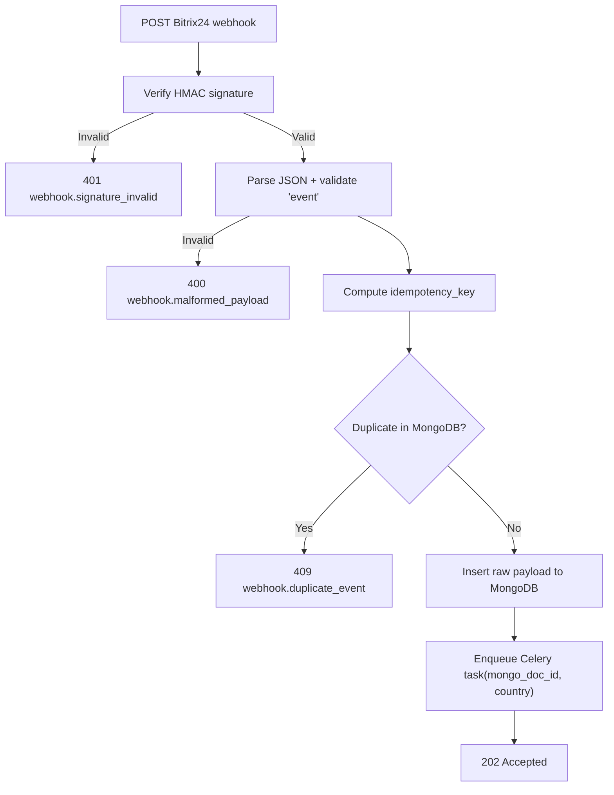
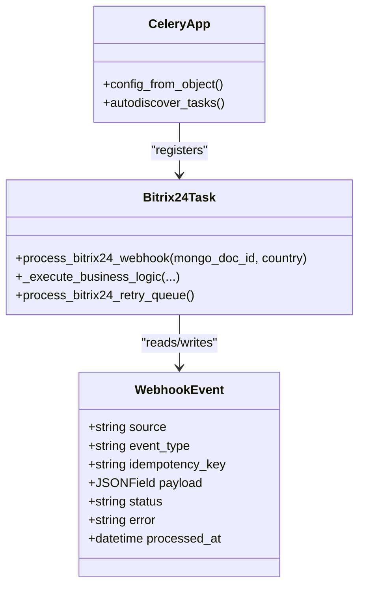
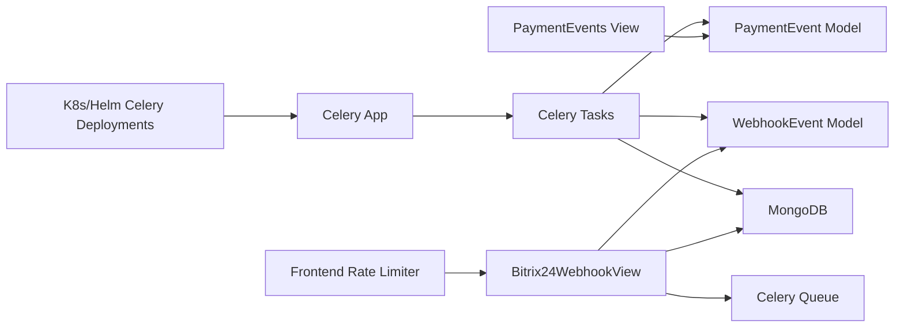

# Webhook Handling System

<cite>
**Referenced Files in This Document**
- [views.py](file://backend/django/apps/payment_events/views.py)
- [test_receiver.py](file://backend/django/apps/payment_events/test_receiver.py)
- [views.py](file://backend/django/apps/integrations/views.py)
- [tasks.py](file://backend/django/apps/integrations/tasks.py)
- [models.py](file://backend/django/apps/integrations/models.py)
- [celery.py](file://backend/django/core/celery.py)
- [handlers.py](file://backend/integrations/bitrix24/webhooks/handlers.py)
- [metrics_endpoint.py](file://backend/django/apps/core/metrics_endpoint.py)
- [health.py](file://backend/django/apps/core/health.py)
- [rate-limit.ts](file://frontend/apps/template-renderer/src/lib/rate-limit.ts)
- [middleware.ts](file://frontend/apps/template-renderer/src/middleware.ts)
- [route.ts](file://frontend/apps/admin-dashboard/src/app/api/bitrix24/webhook/route.ts)
- [celery.yaml (Kubernetes)](file://infra/kubernetes/apps/celery.yaml)
- [celery.yaml (Helm)](file://infra/helm/jol-hub/templates/celery.yaml)
- [payment-api-contract.md](file://docs/payment-api-contract.md)
</cite>

## Table of Contents
1. [Introduction](#introduction)
2. [Project Structure](#project-structure)
3. [Core Components](#core-components)
4. [Architecture Overview](#architecture-overview)
5. [Detailed Component Analysis](#detailed-component-analysis)
6. [Dependency Analysis](#dependency-analysis)
7. [Performance Considerations](#performance-considerations)
8. [Troubleshooting Guide](#troubleshooting-guide)
9. [Conclusion](#conclusion)
10. [Appendices](#appendices)

## Introduction
This document explains the webhook handling system in JOL-HUB with a focus on:
- Centralized ingestion and routing for multiple providers (payments, Bitrix24 CRM, PayPal).
- Request validation, signature verification, payload parsing, and schema validation.
- Asynchronous processing via Celery with retry policies and dead-letter-like handling.
- Security controls including HMAC signatures, replay protection, rate limiting, and input sanitization.
- Monitoring and observability through structured logging, health checks, and Prometheus metrics.

## Project Structure
The webhook system spans several layers:
- Ingress endpoints accept provider webhooks, validate them, persist raw payloads, and enqueue background tasks.
- Background workers process events, map data into internal models, and update state with idempotency guarantees.
- Infrastructure defines Celery workers and schedulers, plus autoscaling for throughput.
- Frontend components implement rate limiting and admin utilities for retries and circuit breakers.

**Diagram sources**
- [views.py:79-143](file://backend/django/apps/payment_events/views.py#L79-L143)
- [views.py:195-293](file://backend/django/apps/integrations/views.py#L195-L293)
- [tasks.py:93-294](file://backend/django/apps/integrations/tasks.py#L93-L294)
- [celery.py:1-31](file://backend/django/core/celery.py#L1-L31)

**Section sources**
- [views.py:79-143](file://backend/django/apps/payment_events/views.py#L79-L143)
- [views.py:195-293](file://backend/django/apps/integrations/views.py#L195-L293)
- [tasks.py:93-294](file://backend/django/apps/integrations/tasks.py#L93-L294)
- [celery.py:1-31](file://backend/django/core/celery.py#L1-L31)

## Core Components
- Payment Events Receiver: Validates signed envelopes, enforces replay window, persists durable acceptance, and deduplicates by event_id.
- Bitrix24 Webhook View: Verifies HMAC, parses JSON, validates required fields, computes idempotency key, stores raw payload in MongoDB, and queues Celery task.
- PayPal Webhook View: Deduplicates by transmission ID, stores minimal metadata, and queues task.
- Celery Tasks: Process Bitrix24 and PayPal webhooks asynchronously with transient vs permanent error handling and audit logging.
- Models: Track webhook lifecycle states and outbound request audits.
- Metrics and Health: Prometheus endpoint with IP allowlist and optional bearer token; health check verifies broker connectivity.

**Section sources**
- [views.py:79-143](file://backend/django/apps/payment_events/views.py#L79-L143)
- [views.py:195-293](file://backend/django/apps/integrations/views.py#L195-L293)
- [tasks.py:93-294](file://backend/django/apps/integrations/tasks.py#L93-L294)
- [models.py:12-47](file://backend/django/apps/integrations/models.py#L12-L47)
- [metrics_endpoint.py:68-153](file://backend/django/apps/core/metrics_endpoint.py#L68-L153)
- [health.py:197-212](file://backend/django/apps/core/health.py#L197-L212)

## Architecture Overview
End-to-end flow for Bitrix24 webhooks:
- Ingress validates signature and payload, stores raw payload in MongoDB, and dispatches a Celery task.
- Worker fetches payload from MongoDB, creates or reuses tracking record in PostgreSQL, executes business logic, and updates status.
- Errors are classified as transient (retry) or permanent (no retry), with structured audit logs.

**Diagram sources**
- [views.py:195-293](file://backend/django/apps/integrations/views.py#L195-L293)
- [tasks.py:93-294](file://backend/django/apps/integrations/tasks.py#L93-L294)

**Section sources**
- [views.py:195-293](file://backend/django/apps/integrations/views.py#L195-L293)
- [tasks.py:93-294](file://backend/django/apps/integrations/tasks.py#L93-L294)

## Detailed Component Analysis

### Payment Events Receiver
- Signature verification: Computes expected HMAC over timestamp and body hash using delivery key; compares in constant time.
- Replay protection: Rejects timestamps outside configured window.
- Routing: Accepts only product label hub.
- Schema validation: Enforces required fields and types; returns detailed error codes.
- Idempotency: Deduplicates by event_id; duplicate returns 200 no-op.
- Persistence: Persists accepted events before downstream processing.

**Diagram sources**
- [views.py:55-76](file://backend/django/apps/payment_events/views.py#L55-L76)
- [views.py:79-143](file://backend/django/apps/payment_events/views.py#L79-L143)

**Section sources**
- [views.py:55-76](file://backend/django/apps/payment_events/views.py#L55-L76)
- [views.py:79-143](file://backend/django/apps/payment_events/views.py#L79-L143)
- [test_receiver.py:47-78](file://backend/django/apps/payment_events/test_receiver.py#L47-L78)
- [payment-api-contract.md:29-57](file://docs/payment-api-contract.md#L29-L57)

### Bitrix24 Webhook Ingestion
- Signature verification: HMAC-SHA256 over raw body using configured secret; constant-time comparison.
- Payload parsing: Ensures JSON object and presence of required fields.
- Idempotency: Derives deterministic key from domain/event/entity/timestamp or falls back to SHA-256 of body; rejects duplicates.
- Storage: Raw payload stored in MongoDB with metadata (source, event_type, idempotency_key, country).
- Dispatch: Enqueues Celery task with mongo_doc_id and country for async processing.

**Diagram sources**
- [views.py:101-148](file://backend/django/apps/integrations/views.py#L101-L148)
- [views.py:195-293](file://backend/django/apps/integrations/views.py#L195-L293)

**Section sources**
- [views.py:101-148](file://backend/django/apps/integrations/views.py#L101-L148)
- [views.py:195-293](file://backend/django/apps/integrations/views.py#L195-L293)

### PayPal Webhook Ingestion
- Deduplication: Uses PayPal transmission ID as idempotency key; returns duplicate if already seen.
- Minimal persistence: Stores source, event_type, and payload for audit.
- Async processing: Queues task for further handling.

**Section sources**
- [views.py:30-51](file://backend/django/apps/integrations/views.py#L30-L51)

### Celery Background Processing
- Initialization: Celery app reads configuration from Django settings under CELERY namespace and autodiscovers tasks.
- Bitrix24 task:
  - Fetches raw payload from MongoDB.
  - Creates or retrieves PostgreSQL tracking record.
  - Early exit if already processed or ignored.
  - Marks processing, executes business logic, then marks processed/ignored.
  - Error classification:
    - Transient errors trigger autoretry with exponential backoff and jitter.
    - Permanent errors mark failed and do not retry.
  - Structured audit logs for every state transition.
- Retry queue task: Periodically reschedules recent failed Bitrix24 events.

**Diagram sources**
- [celery.py:1-31](file://backend/django/core/celery.py#L1-L31)
- [tasks.py:93-294](file://backend/django/apps/integrations/tasks.py#L93-L294)
- [tasks.py:644-668](file://backend/django/apps/integrations/tasks.py#L644-L668)
- [models.py:12-47](file://backend/django/apps/integrations/models.py#L12-L47)

**Section sources**
- [celery.py:1-31](file://backend/django/core/celery.py#L1-L31)
- [tasks.py:93-294](file://backend/django/apps/integrations/tasks.py#L93-L294)
- [tasks.py:644-668](file://backend/django/apps/integrations/tasks.py#L644-L668)
- [models.py:12-47](file://backend/django/apps/integrations/models.py#L12-L47)

### Bitrix24 Handler Layer (Alternative Path)
- Provides an async handler registry for contact, deal, and calendar events.
- Validates application token and optional HMAC signature.
- Logs structured entries for success/error and supports circuit breaker status and chain integrity verification.

**Section sources**
- [handlers.py:63-152](file://backend/integrations/bitrix24/webhooks/handlers.py#L63-L152)
- [handlers.py:421-471](file://backend/integrations/bitrix24/webhooks/handlers.py#L421-L471)
- [handlers.py:486-514](file://backend/integrations/bitrix24/webhooks/handlers.py#L486-L514)

### Error Handling Strategies
- Payment Events:
  - 4xx indicates client/configuration issues; never retried.
  - 5xx reserved for genuine unavailability.
  - Duplicate events return 200 no-op.
- Bitrix24:
  - Transient exceptions (database/network) trigger Celery autoretry with exponential backoff and jitter.
  - Permanent exceptions (validation/data errors) mark FAILED and do not retry.
  - Unknown exceptions attempt best-effort status update then re-raise to ensure retry.
- Retry Queue:
  - Scheduled task reschedules recent failed Bitrix24 events for retry.
  - Frontend admin endpoints support manual processing and clearing of in-memory retry queues with exponential backoff and jitter.

**Section sources**
- [views.py:79-143](file://backend/django/apps/payment_events/views.py#L79-L143)
- [tasks.py:19-36](file://backend/django/apps/integrations/tasks.py#L19-L36)
- [tasks.py:240-294](file://backend/django/apps/integrations/tasks.py#L240-L294)
- [tasks.py:644-668](file://backend/django/apps/integrations/tasks.py#L644-L668)
- [route.ts:208-264](file://frontend/apps/admin-dashboard/src/app/api/bitrix24/webhook/route.ts#L208-L264)

### Security Considerations
- Signature Verification:
  - Payment Events: HMAC-SHA256 over timestamp and body hash; constant-time comparison; strict replay window.
  - Bitrix24: HMAC-SHA256 over raw body using configured secret; constant-time comparison.
- Replay Protection:
  - Payment Events enforce timestamp window.
- Input Sanitization:
  - General text sanitization and XSS pattern removal implemented in security utilities.
- Rate Limiting:
  - Middleware-level fixed-window limiter per client IP and tenant; login brute-force limiter.
  - Applied early in request pipeline; logs security events on hits.
- Access Control:
  - Prometheus metrics endpoint gated by IP allowlist and optional bearer token.

**Section sources**
- [views.py:55-76](file://backend/django/apps/payment_events/views.py#L55-L76)
- [views.py:101-148](file://backend/django/apps/integrations/views.py#L101-L148)
- [security.py:284-324](file://backend/django/apps/crm/security.py#L284-L324)
- [rate-limit.ts:1-88](file://frontend/apps/template-renderer/src/lib/rate-limit.ts#L1-L88)
- [middleware.ts:183-215](file://frontend/apps/template-renderer/src/middleware.ts#L183-L215)
- [metrics_endpoint.py:68-153](file://backend/django/apps/core/metrics_endpoint.py#L68-L153)

### Monitoring and Debugging
- Structured Audit Logging:
  - Every state transition logged with actor, action, resource type, event type, entity ID, tenant ID, and details.
- Health Checks:
  - Celery broker connectivity checked; returns healthy/degraded with latency.
- Metrics:
  - Prometheus endpoint exposes standard metrics format with multi-process support and access controls.

**Section sources**
- [tasks.py:45-73](file://backend/django/apps/integrations/tasks.py#L45-L73)
- [health.py:197-212](file://backend/django/apps/core/health.py#L197-L212)
- [metrics_endpoint.py:68-153](file://backend/django/apps/core/metrics_endpoint.py#L68-L153)

## Dependency Analysis
Key dependencies and interactions:
- Views depend on models and external services (MongoDB, PostgreSQL).
- Tasks depend on models and external services; use Celery for retries.
- Celery app depends on Django settings and auto-discovers tasks.
- Frontend middleware applies rate limiting before backend calls.
- Kubernetes/Helm define worker deployments and autoscaling.

**Diagram sources**
- [views.py:79-143](file://backend/django/apps/payment_events/views.py#L79-L143)
- [views.py:195-293](file://backend/django/apps/integrations/views.py#L195-L293)
- [tasks.py:93-294](file://backend/django/apps/integrations/tasks.py#L93-L294)
- [celery.py:1-31](file://backend/django/core/celery.py#L1-L31)
- [celery.yaml (Kubernetes):1-129](file://infra/kubernetes/apps/celery.yaml#L1-L129)
- [celery.yaml (Helm):1-104](file://infra/helm/jol-hub/templates/celery.yaml#L1-L104)

**Section sources**
- [celery.yaml (Kubernetes):1-129](file://infra/kubernetes/apps/celery.yaml#L1-L129)
- [celery.yaml (Helm):1-104](file://infra/helm/jol-hub/templates/celery.yaml#L1-L104)

## Performance Considerations
- Fast-path acceptance:
  - Bitrix24 view returns 202 Accepted quickly after storing payload and queuing task to respect provider timeouts.
- Idempotency:
  - Prevents duplicate processing and reduces load.
- Celery scaling:
  - HorizontalPodAutoscaler scales workers based on CPU utilization; concurrency and replicas configurable via Helm values.
- Broker health:
  - Health endpoint reports degraded status when broker is unreachable.

[No sources needed since this section provides general guidance]

## Troubleshooting Guide
Common issues and diagnostics:
- Signature mismatch:
  - Ensure correct delivery key and timestamp header; verify constant-time comparison behavior.
- Duplicate events:
  - Payment events return 200 duplicate; Bitrix24 returns 409 conflict; investigate sender retries.
- Transient failures:
  - Check Celery broker connectivity and worker logs; transient errors will be retried automatically.
- Permanent failures:
  - Inspect error field on WebhookEvent; fix data issues and reschedule via retry queue task.
- Rate limiting:
  - Monitor 429 responses; adjust limits upstream if necessary; review rate limiter logs.
- Metrics access:
  - Ensure Prometheus IP allowlist and optional bearer token are configured correctly.

**Section sources**
- [views.py:79-143](file://backend/django/apps/payment_events/views.py#L79-L143)
- [views.py:195-293](file://backend/django/apps/integrations/views.py#L195-L293)
- [tasks.py:240-294](file://backend/django/apps/integrations/tasks.py#L240-L294)
- [health.py:197-212](file://backend/django/apps/core/health.py#L197-L212)
- [metrics_endpoint.py:68-153](file://backend/django/apps/core/metrics_endpoint.py#L68-L153)

## Conclusion
JOL-HUB’s webhook system provides robust ingestion, validation, and asynchronous processing for multiple providers. It emphasizes security through signature verification and replay protection, reliability via idempotency and retry policies, and observability through structured logging and metrics. The architecture supports scalable worker pools and clear operational runbooks for troubleshooting and maintenance.

## Appendices

### Example Handlers for External Services
- Payment Providers:
  - Payment Events receiver validates signed envelopes and persists durable acceptance for marketplace payment facts.
- Email Services:
  - While specific email webhook endpoints are not shown here, the same patterns apply: signature verification, payload parsing, schema validation, idempotency, and async processing via Celery tasks.
- Government APIs:
  - For government integrations, follow the Bitrix24 model: HMAC verification, strict schema validation, idempotency keys, and background processing with transient/permanent error handling.

[No sources needed since this section provides general guidance]