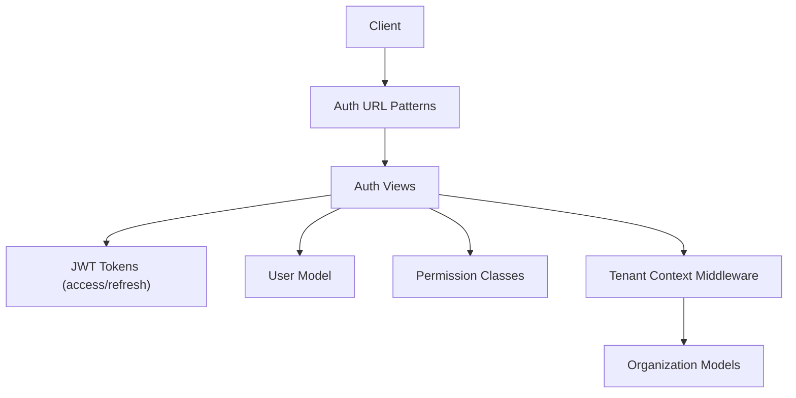
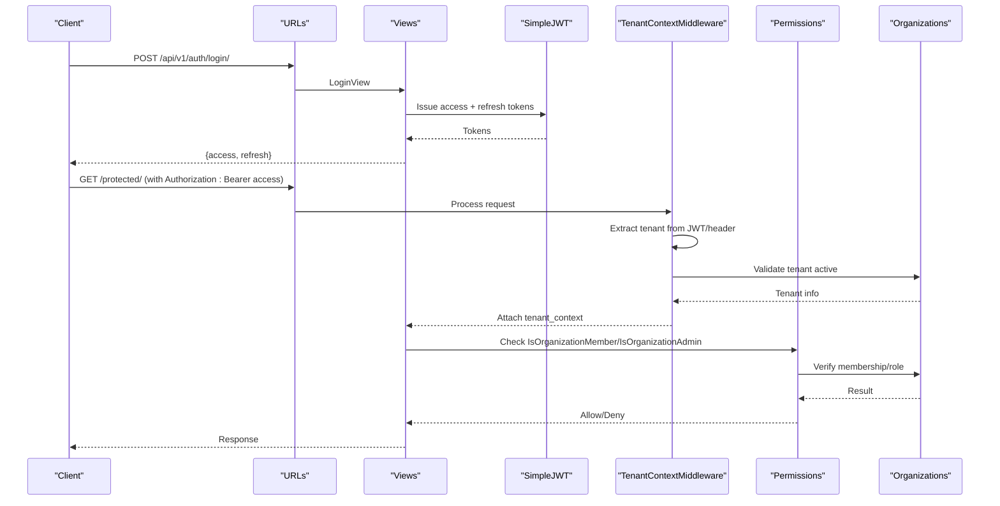
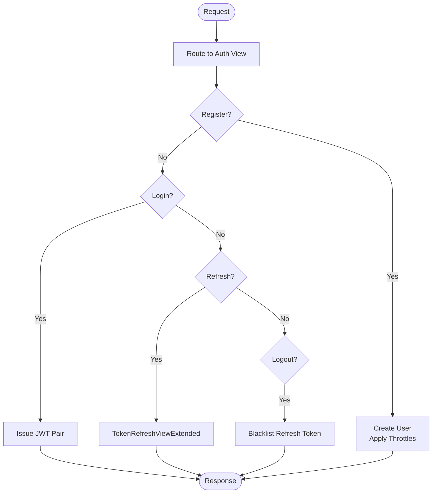
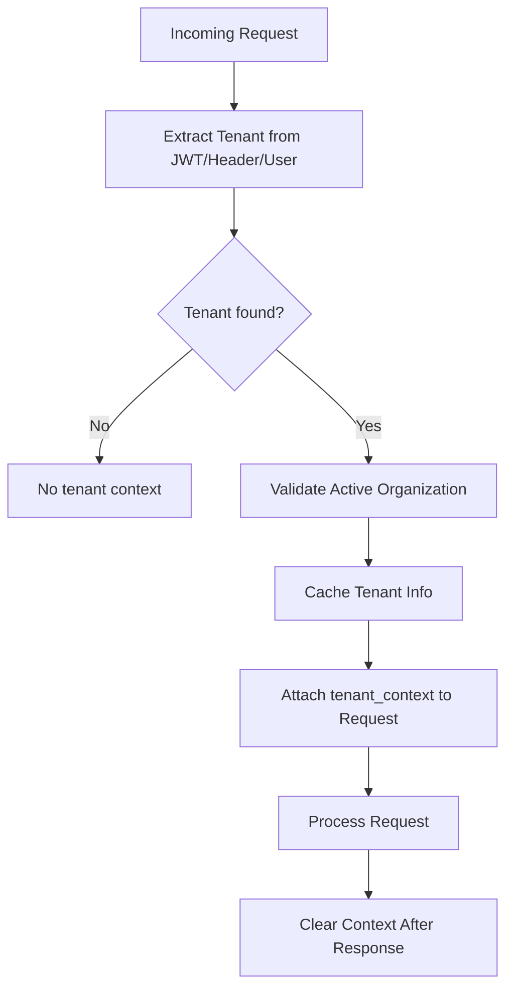
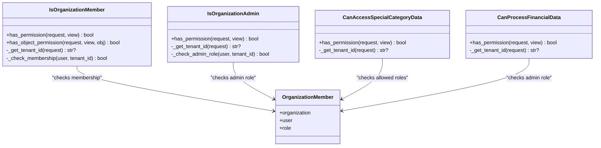
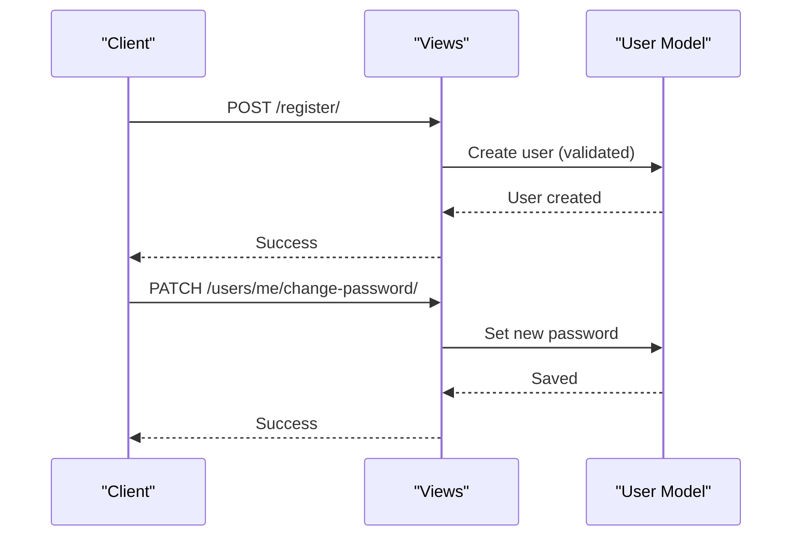
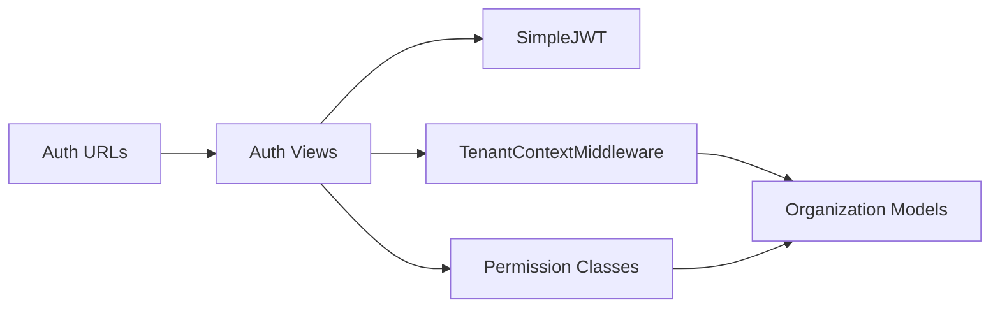

# Authentication & Authorization Flows

<cite>
**Referenced Files in This Document**
- [auth_urls.py](file://backend/django/apps/users/auth_urls.py)
- [views.py](file://backend/django/apps/users/views.py)
- [models.py](file://backend/django/apps/users/models.py)
- [permissions.py](file://backend/django/apps/core/permissions.py)
- [middleware.py](file://backend/django/apps/crm/middleware.py)
- [organizations_models.py](file://backend/django/apps/organizations/models.py)
</cite>

## Table of Contents
1. [Introduction](#introduction)
2. [Project Structure](#project-structure)
3. [Core Components](#core-components)
4. [Architecture Overview](#architecture-overview)
5. [Detailed Component Analysis](#detailed-component-analysis)
6. [Dependency Analysis](#dependency-analysis)
7. [Performance Considerations](#performance-considerations)
8. [Troubleshooting Guide](#troubleshooting-guide)
9. [Conclusion](#conclusion)
10. [Appendices](#appendices)

## Introduction
This document explains the authentication and authorization flows in JOL-HUB, focusing on synchronous request handling from HTTP to JWT issuance, session management via token blacklisting, multi-tenant isolation, organization-scoped permissions, and security middleware. It also covers user registration, password changes, token refresh, logout behavior, and how role-based access control is enforced per tenant. Where applicable, it references the concrete Django REST Framework views, URL patterns, permission classes, and middleware that implement these behaviors.

## Project Structure
Authentication and authorization are implemented across a small set of focused modules:
- URL routing for auth endpoints
- Views implementing login, registration, token refresh, logout, profile, GDPR data rights
- User model with MFA fields and roles
- Permission classes enforcing organization membership and roles
- Tenant context middleware extracting tenant from JWT or headers and caching tenant info
- Organization models defining tenants, members, and roles

**Diagram sources**
- [auth_urls.py:1-22](file://backend/django/apps/users/auth_urls.py#L1-L22)
- [views.py:31-70](file://backend/django/apps/users/views.py#L31-L70)
- [models.py:17-75](file://backend/django/apps/users/models.py#L17-L75)
- [permissions.py:26-137](file://backend/django/apps/core/permissions.py#L26-L137)
- [middleware.py:96-197](file://backend/django/apps/crm/middleware.py#L96-L197)
- [organizations_models.py:12-180](file://backend/django/apps/organizations/models.py#L12-L180)

**Section sources**
- [auth_urls.py:1-22](file://backend/django/apps/users/auth_urls.py#L1-L22)
- [views.py:31-70](file://backend/django/apps/users/views.py#L31-L70)
- [models.py:17-75](file://backend/django/apps/users/models.py#L17-L75)
- [permissions.py:26-137](file://backend/django/apps/core/permissions.py#L26-L137)
- [middleware.py:96-197](file://backend/django/apps/crm/middleware.py#L96-L197)
- [organizations_models.py:12-180](file://backend/django/apps/organizations/models.py#L12-L180)

## Core Components
- Auth endpoints: register, login, logout, token refresh
- JWT flow: obtain pair on login; refresh via extended view; blacklist refresh on logout
- Multi-tenant isolation: tenant context extracted from JWT claims or header, validated against active organizations
- RBAC: organization-level roles (admin/editor/viewer) plus owner implicit admin
- Security middleware: thread-local tenant context, caching, audit metadata injection
- User model: email as username, roles, MFA fields, soft delete, GDPR consent fields

**Section sources**
- [auth_urls.py:11-21](file://backend/django/apps/users/auth_urls.py#L11-L21)
- [views.py:31-70](file://backend/django/apps/users/views.py#L31-L70)
- [middleware.py:96-197](file://backend/django/apps/crm/middleware.py#L96-L197)
- [permissions.py:26-137](file://backend/django/apps/core/permissions.py#L26-L137)
- [models.py:17-75](file://backend/django/apps/users/models.py#L17-L75)
- [organizations_models.py:239-279](file://backend/django/apps/organizations/models.py#L239-L279)

## Architecture Overview
The synchronous authentication flow proceeds through DRF’s URL routing to views, which use SimpleJWT to issue tokens and enforce rate limits. On subsequent requests, middleware establishes a tenant context from JWT claims or headers, validates tenant existence and activity, and attaches it to the request. Permission classes then enforce membership and roles scoped to the tenant.

**Diagram sources**
- [auth_urls.py:16-21](file://backend/django/apps/users/auth_urls.py#L16-L21)
- [views.py:40-70](file://backend/django/apps/users/views.py#L40-L70)
- [middleware.py:122-197](file://backend/django/apps/crm/middleware.py#L122-L197)
- [permissions.py:45-137](file://backend/django/apps/core/permissions.py#L45-L137)
- [organizations_models.py:12-180](file://backend/django/apps/organizations/models.py#L12-L180)

## Detailed Component Analysis

### Authentication Endpoints and Token Lifecycle
- Register: creates a new user with throttling applied
- Login: obtains JWT access and refresh tokens using SimpleJWT serializer
- Refresh: extends SimpleJWT refresh to support additional logic if needed
- Logout: blacklists the provided refresh token to invalidate sessions

**Diagram sources**
- [auth_urls.py:16-21](file://backend/django/apps/users/auth_urls.py#L16-L21)
- [views.py:31-70](file://backend/django/apps/users/views.py#L31-L70)

**Section sources**
- [auth_urls.py:16-21](file://backend/django/apps/users/auth_urls.py#L16-L21)
- [views.py:31-70](file://backend/django/apps/users/views.py#L31-L70)

### Multi-Tenant Isolation and Session Management
- Tenant context extraction order: JWT claims (preferred), X-Tenant-ID header, user’s default organization
- Tenant validation: ensures organization exists and is active; caches tenant info for performance
- Thread-local storage: tenant context attached to request and cleared after response to prevent leakage
- Audit metadata: request ID, IP, user agent captured for traceability

**Diagram sources**
- [middleware.py:122-197](file://backend/django/apps/crm/middleware.py#L122-L197)
- [middleware.py:233-265](file://backend/django/apps/crm/middleware.py#L233-L265)

**Section sources**
- [middleware.py:96-197](file://backend/django/apps/crm/middleware.py#L96-L197)
- [middleware.py:233-265](file://backend/django/apps/crm/middleware.py#L233-L265)

### Role-Based Access Control and Organization Scoping
- Membership checks: ensure user is an active member of the requested organization
- Admin checks: require admin role or ownership for sensitive operations
- Special category and financial data: restrict to specific roles (e.g., admin/editor)
- Object-level scoping: verify object belongs to current tenant before allowing access

**Diagram sources**
- [permissions.py:26-137](file://backend/django/apps/core/permissions.py#L26-L137)
- [permissions.py:140-202](file://backend/django/apps/core/permissions.py#L140-L202)
- [permissions.py:221-269](file://backend/django/apps/core/permissions.py#L221-L269)
- [permissions.py:272-325](file://backend/django/apps/core/permissions.py#L272-L325)
- [organizations_models.py:239-279](file://backend/django/apps/organizations/models.py#L239-L279)

**Section sources**
- [permissions.py:26-137](file://backend/django/apps/core/permissions.py#L26-L137)
- [permissions.py:140-202](file://backend/django/apps/core/permissions.py#L140-L202)
- [permissions.py:221-269](file://backend/django/apps/core/permissions.py#L221-L269)
- [permissions.py:272-325](file://backend/django/apps/core/permissions.py#L272-L325)
- [organizations_models.py:239-279](file://backend/django/apps/organizations/models.py#L239-L279)

### User Registration, Password Reset, and MFA
- Registration: create user with throttling; email used as unique identifier
- Password change: authenticated endpoint updates password securely
- MFA: user model includes MFA enable flag and secret field for future setup flows

**Diagram sources**
- [views.py:31-70](file://backend/django/apps/users/views.py#L31-L70)
- [models.py:17-75](file://backend/django/apps/users/models.py#L17-L75)

**Section sources**
- [views.py:31-70](file://backend/django/apps/users/views.py#L31-L70)
- [models.py:17-75](file://backend/django/apps/users/models.py#L17-L75)

### API Key Management and External Identity Providers
- API key usage: tenant context can be derived from X-Tenant-ID header when authenticating via API keys
- External identity providers: JWT authentication is leveraged; tenant claim extraction supports integration points where external IdPs issue tokens containing tenant identifiers

**Section sources**
- [middleware.py:156-197](file://backend/django/apps/crm/middleware.py#L156-L197)

### Error Handling for Authentication Failures
- Invalid or missing tenant context: logged and denied by permission checks
- Cross-tenant access attempts: logged warnings and blocked by permission classes
- Rate limiting: anonymous and authenticated throttles protect sensitive endpoints

**Section sources**
- [permissions.py:45-137](file://backend/django/apps/core/permissions.py#L45-L137)
- [middleware.py:122-197](file://backend/django/apps/crm/middleware.py#L122-L197)
- [views.py:31-70](file://backend/django/apps/users/views.py#L31-L70)

### Token Refresh Mechanisms and Session Timeout Handling
- Refresh: dedicated endpoint extends SimpleJWT refresh behavior
- Logout: blacklists refresh token to terminate sessions
- Session timeout: governed by JWT configuration; refresh allows controlled renewal while maintaining tenant context

**Section sources**
- [auth_urls.py:16-21](file://backend/django/apps/users/auth_urls.py#L16-L21)
- [views.py:52-70](file://backend/django/apps/users/views.py#L52-L70)

## Dependency Analysis
The authentication subsystem depends on:
- Django REST Framework views and SimpleJWT for token handling
- Tenant context middleware for request-scoped isolation
- Permission classes for RBAC enforcement
- Organization models for membership and role resolution

**Diagram sources**
- [auth_urls.py:16-21](file://backend/django/apps/users/auth_urls.py#L16-L21)
- [views.py:31-70](file://backend/django/apps/users/views.py#L31-L70)
- [middleware.py:96-197](file://backend/django/apps/crm/middleware.py#L96-L197)
- [permissions.py:26-137](file://backend/django/apps/core/permissions.py#L26-L137)
- [organizations_models.py:12-180](file://backend/django/apps/organizations/models.py#L12-L180)

**Section sources**
- [auth_urls.py:16-21](file://backend/django/apps/users/auth_urls.py#L16-L21)
- [views.py:31-70](file://backend/django/apps/users/views.py#L31-L70)
- [middleware.py:96-197](file://backend/django/apps/crm/middleware.py#L96-L197)
- [permissions.py:26-137](file://backend/django/apps/core/permissions.py#L26-L137)
- [organizations_models.py:12-180](file://backend/django/apps/organizations/models.py#L12-L180)

## Performance Considerations
- Tenant info caching: reduces repeated database lookups for tenant metadata
- Selective queries: permission checks use targeted filters to minimize overhead
- Throttling: protects endpoints from abuse without impacting legitimate traffic

[No sources needed since this section provides general guidance]

## Troubleshooting Guide
Common issues and resolutions:
- Missing tenant context: ensure JWT contains tenant claim or include X-Tenant-ID header; verify user has default organization if relying on fallback
- Cross-tenant access denied: confirm user membership and role in the target organization; check logs for cross-tenant warnings
- Rate-limited requests: adjust client retry strategy; ensure proper separation of anonymous vs authenticated throttles
- Logout not revoking session: verify refresh token is included and valid; confirm blacklist operation succeeded

**Section sources**
- [middleware.py:122-197](file://backend/django/apps/crm/middleware.py#L122-L197)
- [permissions.py:45-137](file://backend/django/apps/core/permissions.py#L45-L137)
- [views.py:56-70](file://backend/django/apps/users/views.py#L56-L70)

## Conclusion
JOL-HUB implements a robust, multi-tenant authentication and authorization system built on Django REST Framework and SimpleJWT. The middleware enforces tenant isolation at the request level, while permission classes provide fine-grained, organization-scoped access control. Token lifecycle management supports secure login, refresh, and logout workflows. The design emphasizes security, compliance, and performance through caching, throttling, and careful query strategies.

[No sources needed since this section summarizes without analyzing specific files]

## Appendices

### Example Workflows

#### User Registration
- Endpoint: POST /api/v1/auth/register/
- Behavior: Creates user with throttling; email is unique identifier

**Section sources**
- [auth_urls.py:16-21](file://backend/django/apps/users/auth_urls.py#L16-L21)
- [views.py:31-38](file://backend/django/apps/users/views.py#L31-L38)

#### Password Change
- Endpoint: PATCH /api/v1/users/me/change-password/
- Behavior: Requires authentication; updates password securely

**Section sources**
- [views.py:164-175](file://backend/django/apps/users/views.py#L164-L175)

#### Token Refresh
- Endpoint: POST /api/v1/auth/refresh/
- Behavior: Extends SimpleJWT refresh to support additional logic if required

**Section sources**
- [auth_urls.py:16-21](file://backend/django/apps/users/auth_urls.py#L16-L21)
- [views.py:52-55](file://backend/django/apps/users/views.py#L52-L55)

#### Logout
- Endpoint: POST /api/v1/auth/logout/
- Behavior: Blacklists refresh token to terminate session

**Section sources**
- [auth_urls.py:16-21](file://backend/django/apps/users/auth_urls.py#L16-L21)
- [views.py:56-70](file://backend/django/apps/users/views.py#L56-L70)

#### Multi-Factor Authentication Setup
- Fields: mfa_enabled, mfa_secret on User model
- Note: MFA fields exist; setup flow would validate and store secrets securely

**Section sources**
- [models.py:51-54](file://backend/django/apps/users/models.py#L51-L54)

#### API Key Management
- Header: X-Tenant-ID used to establish tenant context for API key requests
- Behavior: Middleware extracts tenant from header when JWT does not contain tenant claim

**Section sources**
- [middleware.py:156-197](file://backend/django/apps/crm/middleware.py#L156-L197)

#### External Identity Providers and SSO
- Integration point: JWT authentication; tenant claim extraction supports external IdPs issuing tokens with tenant identifiers
- Behavior: Middleware retrieves tenant from JWT claims during request processing

**Section sources**
- [middleware.py:199-213](file://backend/django/apps/crm/middleware.py#L199-L213)