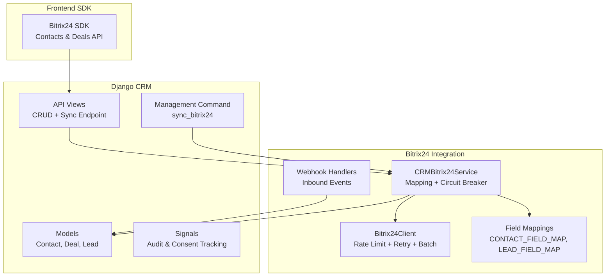
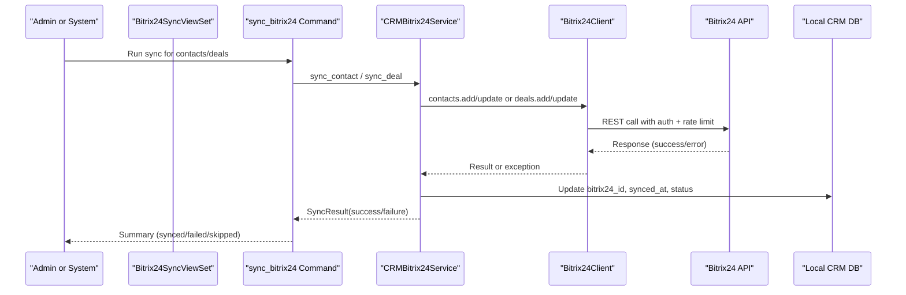
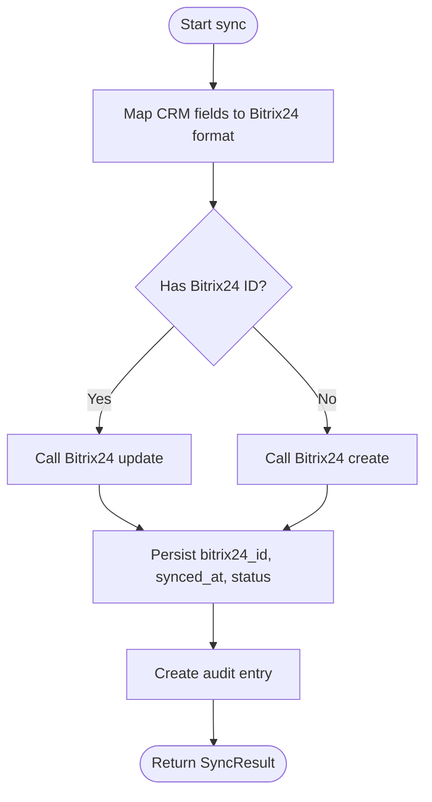
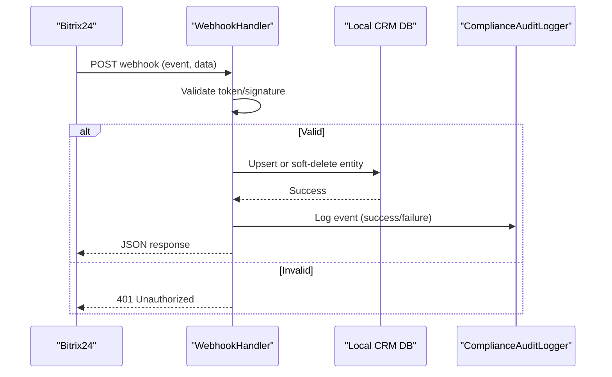
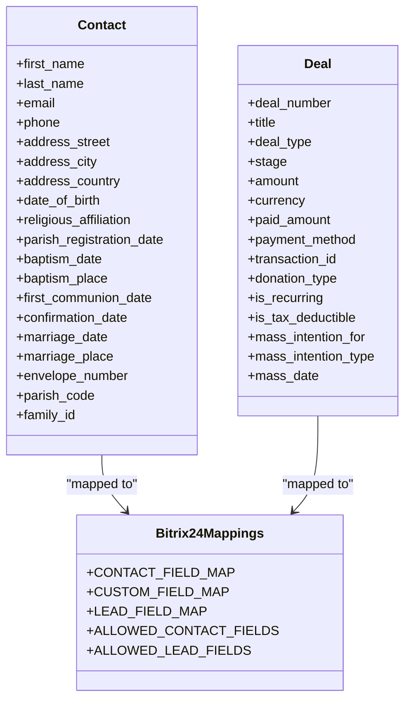
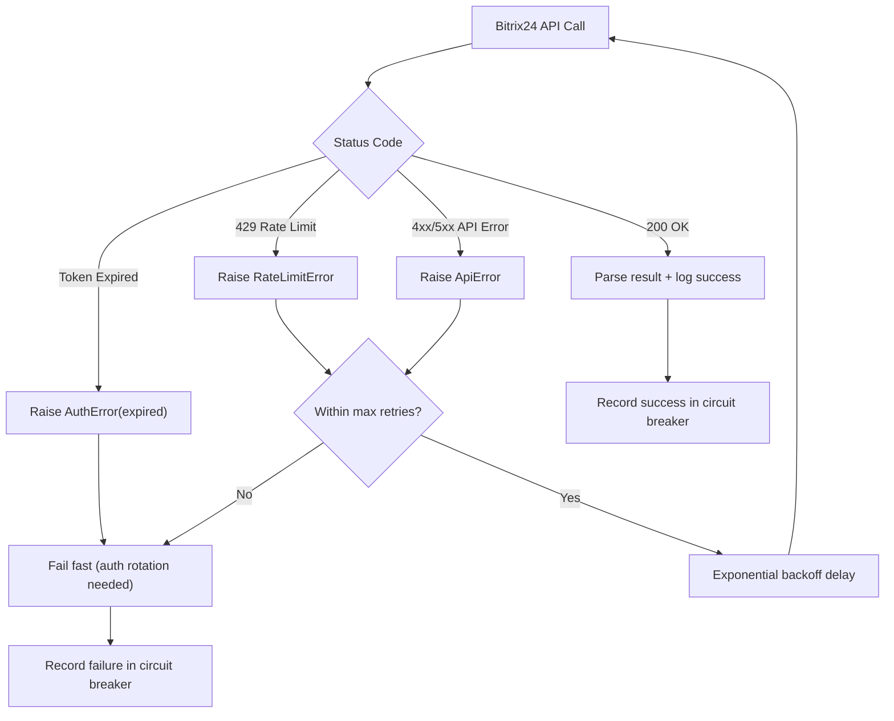
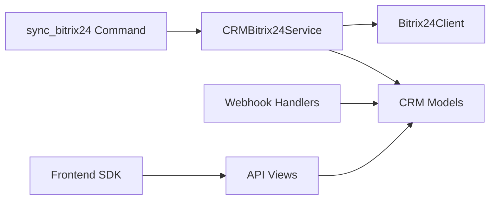

# CRM Data Synchronization

<cite>
**Referenced Files in This Document**
- [bitrix24_service.py](file://backend/django/apps/crm/bitrix24_service.py)
- [client.py](file://backend/integrations/bitrix24/client.py)
- [handlers.py](file://backend/integrations/bitrix24/webhooks/handlers.py)
- [models.py](file://backend/django/apps/crm/models.py)
- [signals.py](file://backend/django/apps/crm/signals.py)
- [views.py](file://backend/django/apps/crm/api/views.py)
- [sync_bitrix24.py](file://backend/django/apps/crm/management/commands/sync_bitrix24.py)
- [bitrix24_mappings.py](file://backend/django/apps/integrations/bitrix24_mappings.py)
- [crm.ts](file://frontend/packages/bitrix-sdk/src/api/crm.ts)
- [ADR-001-schema-per-tenant-isolation.md](file://docs/decisions/ADR-001-schema-per-tenant-isolation.md)
</cite>

## Table of Contents
1. [Introduction](#introduction)
2. [Project Structure](#project-structure)
3. [Core Components](#core-components)
4. [Architecture Overview](#architecture-overview)
5. [Detailed Component Analysis](#detailed-component-analysis)
6. [Dependency Analysis](#dependency-analysis)
7. [Performance Considerations](#performance-considerations)
8. [Troubleshooting Guide](#troubleshooting-guide)
9. [Conclusion](#conclusion)
10. [Appendices](#appendices)

## Introduction
This document explains how JOL-HUB synchronizes CRM data bidirectionally with Bitrix24. It covers contact updates, deal tracking, lead scoring synchronization, conflict resolution strategies, data mapping transformations, error handling, rate limiting, retry mechanisms, monitoring, tenant isolation, and data privacy safeguards. It also provides concrete examples for contact creation, deal stage updates, email campaign tracking, and custom field synchronization.

## Project Structure
The CRM synchronization spans several layers:
- Django CRM models and signals define entities, consent, legal hold, and audit trails.
- The Bitrix24 abstraction service orchestrates sync operations, mappings, and circuit breaking.
- The Bitrix24 client handles HTTP requests, rate limiting, retries, and batch calls.
- Webhook handlers receive Bitrix24 events and synchronize changes back into the local CRM.
- Management commands and API views expose operational controls for syncing and monitoring.
- Frontend SDKs provide typed APIs for contacts and deals.

**Diagram sources**
- [bitrix24_service.py:238-572](file://backend/django/apps/crm/bitrix24_service.py#L238-L572)
- [client.py:91-337](file://backend/integrations/bitrix24/client.py#L91-L337)
- [handlers.py:63-514](file://backend/integrations/bitrix24/webhooks/handlers.py#L63-L514)
- [models.py:71-771](file://backend/django/apps/crm/models.py#L71-L771)
- [views.py:739-769](file://backend/django/apps/crm/api/views.py#L739-L769)
- [sync_bitrix24.py:22-233](file://backend/django/apps/crm/management/commands/sync_bitrix24.py#L22-L233)
- [bitrix24_mappings.py:25-162](file://backend/django/apps/integrations/bitrix24_mappings.py#L25-L162)
- [crm.ts:205-255](file://frontend/packages/bitrix-sdk/src/api/crm.ts#L205-L255)

**Section sources**
- [bitrix24_service.py:1-572](file://backend/django/apps/crm/bitrix24_service.py#L1-L572)
- [client.py:1-403](file://backend/integrations/bitrix24/client.py#L1-L403)
- [handlers.py:1-514](file://backend/integrations/bitrix24/webhooks/handlers.py#L1-L514)
- [models.py:1-800](file://backend/django/apps/crm/models.py#L1-L800)
- [views.py:1-769](file://backend/django/apps/crm/api/views.py#L1-L769)
- [sync_bitrix24.py:1-233](file://backend/django/apps/crm/management/commands/sync_bitrix24.py#L1-L233)
- [bitrix24_mappings.py:1-368](file://backend/django/apps/integrations/bitrix24_mappings.py#L1-L368)
- [crm.ts:205-255](file://frontend/packages/bitrix-sdk/src/api/crm.ts#L205-L255)

## Core Components
- CRMBitrix24Service: Maps CRM entities to Bitrix24 fields, performs create/update, tracks sync status, and applies circuit breaker protection.
- Bitrix24Client: Manages authentication, rate limiting, retries, batch requests, and audit logging for API calls.
- Webhook Handlers: Receive Bitrix24 events (contact/deal add/update/delete), validate authenticity, and synchronize changes into local CRM.
- Models and Signals: Define Contact, Deal, Lead; enforce tenant isolation, consent, legal hold, and comprehensive audit logging.
- Management Command: Provides batched sync operations for contacts and deals with dry-run support.
- Field Mappings: Centralized, explicit mappings and validators for safe transformation between systems.
- Frontend SDK: Typed API for contacts and deals including upsert by email.

**Section sources**
- [bitrix24_service.py:238-572](file://backend/django/apps/crm/bitrix24_service.py#L238-L572)
- [client.py:91-337](file://backend/integrations/bitrix24/client.py#L91-L337)
- [handlers.py:63-514](file://backend/integrations/bitrix24/webhooks/handlers.py#L63-L514)
- [models.py:71-771](file://backend/django/apps/crm/models.py#L71-L771)
- [sync_bitrix24.py:22-233](file://backend/django/apps/crm/management/commands/sync_bitrix24.py#L22-L233)
- [bitrix24_mappings.py:25-162](file://backend/django/apps/integrations/bitrix24_mappings.py#L25-L162)
- [crm.ts:205-255](file://frontend/packages/bitrix-sdk/src/api/crm.ts#L205-L255)

## Architecture Overview
JOL-HUB implements a robust bidirectional sync:
- Outbound: Django CRM → Bitrix24 via CRMBitrix24Service using mapped fields, with circuit breaker and audit entries.
- Inbound: Bitrix24 webhooks → Webhook Handlers → Local CRM models with GDPR-compliant processing and audit logs.
- Rate limiting and retries are enforced at the client layer; failures are recorded and surfaced through sync results.
- Tenant isolation is enforced at model, query, and API levels to prevent cross-tenant data leakage.

**Diagram sources**
- [sync_bitrix24.py:61-233](file://backend/django/apps/crm/management/commands/sync_bitrix24.py#L61-L233)
- [bitrix24_service.py:302-468](file://backend/django/apps/crm/bitrix24_service.py#L302-L468)
- [client.py:168-337](file://backend/integrations/bitrix24/client.py#L168-L337)
- [views.py:739-769](file://backend/django/apps/crm/api/views.py#L739-L769)

## Detailed Component Analysis

### Outbound Sync: Contacts and Deals
- Mapping: Standard and custom fields are explicitly mapped from CRM to Bitrix24 formats. Email and phone are wrapped as multi-value structures where required.
- Create vs Update: If a Bitrix24 ID exists, update; otherwise create new and persist the returned ID.
- Audit: On success, an audit entry records operation details and Bitrix24 IDs.
- Error Handling: Specific exceptions (rate limit, auth, API errors) are caught and converted to SyncResult with failure details. Circuit breaker prevents cascading failures.

**Diagram sources**
- [bitrix24_service.py:302-468](file://backend/django/apps/crm/bitrix24_service.py#L302-L468)
- [bitrix24_service.py:470-546](file://backend/django/apps/crm/bitrix24_service.py#L470-L546)

**Section sources**
- [bitrix24_service.py:302-468](file://backend/django/apps/crm/bitrix24_service.py#L302-L468)
- [bitrix24_service.py:470-546](file://backend/django/apps/crm/bitrix24_service.py#L470-L546)

### Inbound Sync: Webhook Handlers
- Validation: Application token and optional HMAC signature verification ensure webhook authenticity.
- Routing: Event types map to entity operations (contact/deal add/update/delete).
- Processing: For contacts and deals, existing records are updated or new ones created; deletions are soft-deleted to preserve audit trails.
- Audit: Each processed event is logged with status and identifiers.

**Diagram sources**
- [handlers.py:100-170](file://backend/integrations/bitrix24/webhooks/handlers.py#L100-L170)
- [handlers.py:173-291](file://backend/integrations/bitrix24/webhooks/handlers.py#L173-L291)
- [handlers.py:295-396](file://backend/integrations/bitrix24/webhooks/handlers.py#L295-L396)

**Section sources**
- [handlers.py:63-514](file://backend/integrations/bitrix24/webhooks/handlers.py#L63-L514)

### Conflict Resolution Strategies
- Strategy Enum: LOCAL_WINS, REMOTE_WINS, LATEST_WINS, MANUAL are defined for conflict scenarios.
- Current Behavior: Default strategy is LATEST_WINS; outbound sync overwrites remote state when updating.
- Recommendation: Implement explicit conflict detection by comparing timestamps or change sets before applying updates, especially for fields like amounts or stages that may diverge.

**Section sources**
- [bitrix24_service.py:43-57](file://backend/django/apps/crm/bitrix24_service.py#L43-L57)
- [bitrix24_service.py:302-468](file://backend/django/apps/crm/bitrix24_service.py#L302-L468)

### Data Mapping Transformations
- Contact Mapping: Standard fields (name, email, phone, address, birthdate) and custom UF_* fields are mapped explicitly.
- Deal Mapping: Title, opportunity amount, currency, stage/category, and type-specific fields (donation/mass intention) are mapped.
- Lead Mapping: Title, name, status, source, opportunity, currency, comments are mapped with allowed field validation.
- Helpers: Extract primary email/phone, parse dates, parse decimals, map source IDs, and validate unknown fields to prevent data leakage.

**Diagram sources**
- [models.py:255-771](file://backend/django/apps/crm/models.py#L255-L771)
- [bitrix24_mappings.py:25-162](file://backend/django/apps/integrations/bitrix24_mappings.py#L25-L162)
- [bitrix24_service.py:249-546](file://backend/django/apps/crm/bitrix24_service.py#L249-L546)

**Section sources**
- [bitrix24_mappings.py:25-162](file://backend/django/apps/integrations/bitrix24_mappings.py#L25-L162)
- [bitrix24_mappings.py:210-317](file://backend/django/apps/integrations/bitrix24_mappings.py#L210-L317)
- [bitrix24_service.py:470-546](file://backend/django/apps/crm/bitrix24_service.py#L470-L546)

### Error Handling for Failed Synchronizations
- Exceptions: Auth errors, rate limits, API errors, timeouts are handled distinctly.
- Circuit Breaker: Tracks failures per tenant; opens after threshold and allows half-open recovery attempts.
- SyncResult: Returns structured outcomes with success flag, entity, Bitrix24 ID, error message, and conflict flags.
- Audit Logging: Failed API calls are logged with method, entity type, and error details.

**Diagram sources**
- [client.py:246-337](file://backend/integrations/bitrix24/client.py#L246-L337)
- [bitrix24_service.py:71-107](file://backend/django/apps/crm/bitrix24_service.py#L71-L107)
- [bitrix24_service.py:366-393](file://backend/django/apps/crm/bitrix24_service.py#L366-L393)

**Section sources**
- [client.py:246-337](file://backend/integrations/bitrix24/client.py#L246-L337)
- [bitrix24_service.py:71-107](file://backend/django/apps/crm/bitrix24_service.py#L71-L107)
- [bitrix24_service.py:366-393](file://backend/django/apps/crm/bitrix24_service.py#L366-L393)

### Examples

#### Contact Creation
- Trigger: Create a Contact in Django CRM or receive ONCRMCONTACTADD webhook.
- Flow: CRMBitrix24Service maps fields, calls Bitrix24 contacts.add, persists bitrix24_id and sync metadata, creates audit entry.
- Frontend: Use Bitrix24 SDK upsert by email to avoid duplicates.

**Section sources**
- [bitrix24_service.py:302-364](file://backend/django/apps/crm/bitrix24_service.py#L302-L364)
- [handlers.py:173-266](file://backend/integrations/bitrix24/webhooks/handlers.py#L173-L266)
- [crm.ts:205-229](file://frontend/packages/bitrix-sdk/src/api/crm.ts#L205-L229)

#### Deal Stage Updates
- Trigger: Update Deal stage in Django CRM or receive ONCRMDEALUPDATE webhook.
- Flow: CRMBitrix24Service maps stage to Bitrix24 stage ID, calls deals.update, persists sync metadata, creates audit entry.
- Example Stages: new→NEW, in_progress→PREPARATION, pending_payment→PREPAYMENT_INVOICE, paid→FINAL_INVOICE, completed→WON, cancelled→LOSE, refunded→APOLOGY.

**Section sources**
- [bitrix24_service.py:395-468](file://backend/django/apps/crm/bitrix24_service.py#L395-L468)
- [bitrix24_service.py:521-532](file://backend/django/apps/crm/bitrix24_service.py#L521-L532)

#### Email Campaign Tracking
- Capability: Email module exposed via Bitrix24Client.email property for marketing integrations.
- Usage: Use Bitrix24Client.email endpoints to track campaigns and link them to contacts/deals as supported by Bitrix24.
- Note: Ensure proper field mapping and consent checks before sending emails to comply with GDPR.

**Section sources**
- [client.py:152-158](file://backend/integrations/bitrix24/client.py#L152-L158)
- [bitrix24_mappings.py:351-367](file://backend/django/apps/integrations/bitrix24_mappings.py#L351-L367)

#### Custom Field Synchronization
- Fields: Religious affiliation, sacramental dates, envelope numbers, parish codes, family IDs are mapped to UF_* fields.
- Validation: Unknown fields are rejected to prevent data leakage; only whitelisted fields are persisted.
- Transformation: Dates parsed safely; decimals parsed with defaults; PII masked in audit logs.

**Section sources**
- [bitrix24_service.py:263-273](file://backend/django/apps/crm/bitrix24_service.py#L263-L273)
- [bitrix24_mappings.py:41-47](file://backend/django/apps/integrations/bitrix24_mappings.py#L41-L47)
- [bitrix24_mappings.py:252-292](file://backend/django/apps/integrations/bitrix24_mappings.py#L252-L292)
- [bitrix24_mappings.py:169-203](file://backend/django/apps/integrations/bitrix24_mappings.py#L169-L203)

### Rate Limiting and Retry Mechanisms
- Client-Level Rate Limiting: Enforces minimum interval between requests based on configured rate_limit_per_second.
- Retry Logic: Exponential backoff for rate limits and timeouts; max retries configurable.
- Frontend Retries: GET requests retry on server/network/timeout; POST retries only on 429 to avoid duplicate side effects.
- Circuit Breaker: Per-tenant breaker opens after repeated failures and allows controlled recovery attempts.

**Section sources**
- [client.py:323-337](file://backend/integrations/bitrix24/client.py#L323-L337)
- [client.py:258-321](file://backend/integrations/bitrix24/client.py#L258-L321)
- [bitrix24_service.py:71-107](file://backend/django/apps/crm/bitrix24_service.py#L71-L107)
- [frontend packages/bitrix-sdk backend-client.ts:73-191](file://frontend/packages/bitrix-sdk/src/backend-client.ts#L73-L191)

### Monitoring and Observability
- Audit Entries: Every sync operation creates detailed audit entries with entity types, IDs, and details.
- Webhook Logs: Incoming webhooks are logged with event, status, and data identifiers.
- Metrics: Compliance reports include DSR counts, consent metrics, legal holds, audit integrity, and security events.
- Integrity Verification: Audit chain can be verified to ensure tamper-evident logs.

**Section sources**
- [bitrix24_service.py:350-358](file://backend/django/apps/crm/bitrix24_service.py#L350-L358)
- [handlers.py:154-170](file://backend/integrations/bitrix24/webhooks/handlers.py#L154-L170)
- [observability/metrics.py:125-169](file://backend/django/apps/crm/observability/metrics.py#L125-L169)

### Tenant Isolation and Data Privacy Safeguards
- Schema-per-Tenant: ADR-001 enforces schema-per-tenant isolation for strong data boundaries.
- Model-Level Isolation: CRMTenantModel includes organization foreign key, indexes, and constraints; managers filter by tenant context.
- API-Level Isolation: ViewSets inject tenant context on create and filter queries by tenant; unauthorized access attempts are logged.
- Consent and Legal Hold: Consent tracking and legal hold enforcement protect sensitive data and honor erasure requests.
- PII Masking: Audit logs mask emails, phones, and generic values to prevent exposure.

**Section sources**
- [ADR-001-schema-per-tenant-isolation.md:40-52](file://docs/decisions/ADR-001-schema-per-tenant-isolation.md#L40-L52)
- [models.py:48-68](file://backend/django/apps/crm/models.py#L48-L68)
- [models.py:71-196](file://backend/django/apps/crm/models.py#L71-L196)
- [views.py:83-126](file://backend/django/apps/crm/api/views.py#L83-L126)
- [bitrix24_mappings.py:169-203](file://backend/django/apps/integrations/bitrix24_mappings.py#L169-L203)

## Dependency Analysis
- CRMBitrix24Service depends on Bitrix24Client for API calls and on CRM models for persistence and audit.
- Webhook Handlers depend on CRM models and compliance audit logger for inbound synchronization.
- Management Command depends on CRMBitrix24Service for batched sync operations.
- Frontend SDK depends on backend API views for CRUD and sync endpoints.

**Diagram sources**
- [bitrix24_service.py:238-572](file://backend/django/apps/crm/bitrix24_service.py#L238-L572)
- [client.py:91-337](file://backend/integrations/bitrix24/client.py#L91-L337)
- [handlers.py:63-514](file://backend/integrations/bitrix24/webhooks/handlers.py#L63-L514)
- [sync_bitrix24.py:22-233](file://backend/django/apps/crm/management/commands/sync_bitrix24.py#L22-L233)
- [views.py:739-769](file://backend/django/apps/crm/api/views.py#L739-L769)

**Section sources**
- [bitrix24_service.py:238-572](file://backend/django/apps/crm/bitrix24_service.py#L238-L572)
- [client.py:91-337](file://backend/integrations/bitrix24/client.py#L91-L337)
- [handlers.py:63-514](file://backend/integrations/bitrix24/webhooks/handlers.py#L63-L514)
- [sync_bitrix24.py:22-233](file://backend/django/apps/crm/management/commands/sync_bitrix24.py#L22-L233)
- [views.py:739-769](file://backend/django/apps/crm/api/views.py#L739-L769)

## Performance Considerations
- Batch Operations: Bitrix24Client supports batch requests to reduce API overhead.
- Caching: Tenant configs and clients are cached to minimize configuration lookups.
- Query Optimization: Managers and viewsets filter by tenant and use indexes for performance.
- Dry-Run Mode: Management command supports dry-run to preview syncs without changes.

[No sources needed since this section provides general guidance]

## Troubleshooting Guide
- Authentication Failures: Check application token and webhook secret; handle expired tokens via refresh flow.
- Rate Limits: Monitor 429 responses; adjust rate_limit_per_second and retry intervals; use circuit breaker insights.
- Mapping Errors: Validate field mappings; ensure custom UF_* fields exist in Bitrix24; use allowed field validation to catch unknown fields.
- Sync Failures: Inspect SyncResult.error messages; review audit entries and webhook logs for root causes.
- Tenant Context Issues: Verify tenant context is set correctly; check manager filtering and API tenant injection.

**Section sources**
- [client.py:246-321](file://backend/integrations/bitrix24/client.py#L246-L321)
- [bitrix24_service.py:366-393](file://backend/django/apps/crm/bitrix24_service.py#L366-L393)
- [handlers.py:100-170](file://backend/integrations/bitrix24/webhooks/handlers.py#L100-L170)
- [bitrix24_mappings.py:323-344](file://backend/django/apps/integrations/bitrix24_mappings.py#L323-L344)

## Conclusion
JOL-HUB’s CRM synchronization with Bitrix24 is designed for reliability, compliance, and scalability. It provides explicit field mappings, robust error handling, tenant isolation, and comprehensive audit trails. Bidirectional sync ensures consistency across systems while respecting data privacy and regulatory requirements. Operational tools like management commands and API views enable efficient monitoring and control.

[No sources needed since this section summarizes without analyzing specific files]

## Appendices

### API Endpoints for Sync Operations
- Bitrix24SyncViewSet.sync: Queues sync for specified entity types and IDs.
- ContactViewSet.export: Exports contact data for GDPR Art. 15 requests.
- DealViewSet.mark_paid/refund: Financial operations with PCI-DSS audit logging.

**Section sources**
- [views.py:739-769](file://backend/django/apps/crm/api/views.py#L739-L769)
- [views.py:250-276](file://backend/django/apps/crm/api/views.py#L250-L276)
- [views.py:334-387](file://backend/django/apps/crm/api/views.py#L334-L387)

### Signal-Based Audit and Consent Tracking
- pre_save/post_save signals capture field-level changes and consent transitions.
- Financial transactions (paid/refunded) are logged with transaction details.

**Section sources**
- [signals.py:89-240](file://backend/django/apps/crm/signals.py#L89-L240)