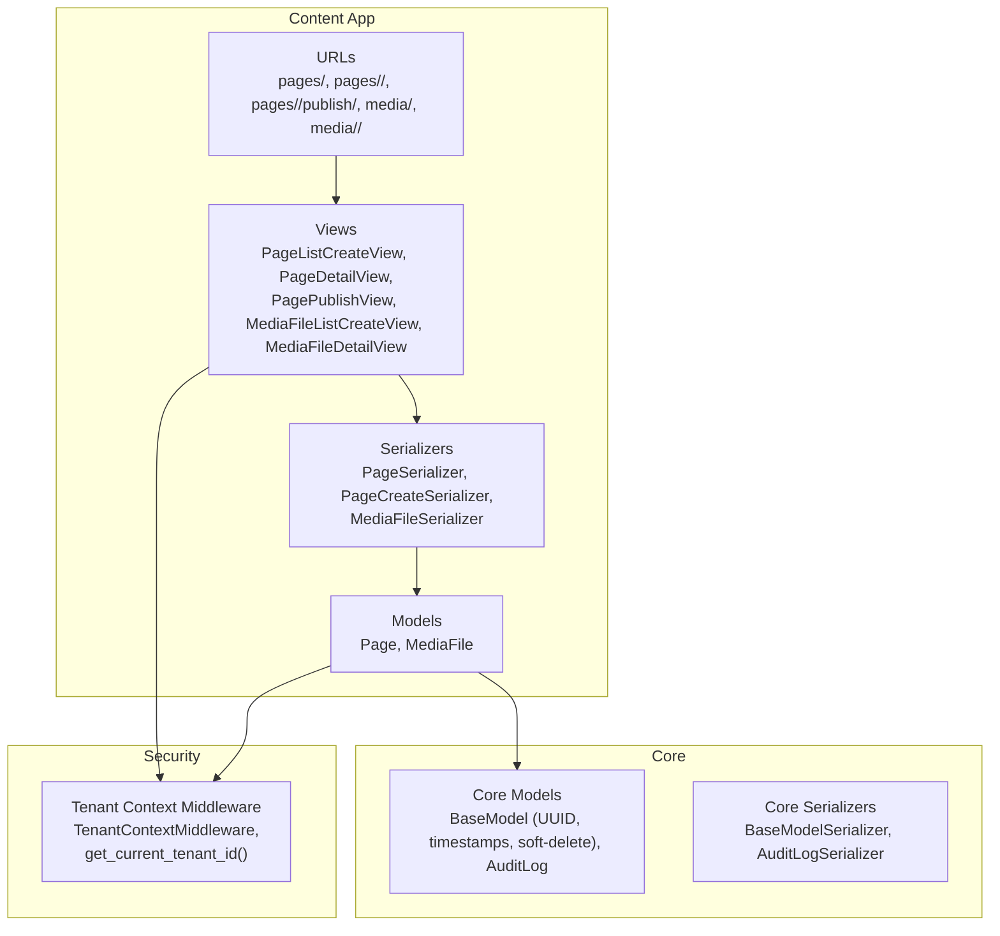
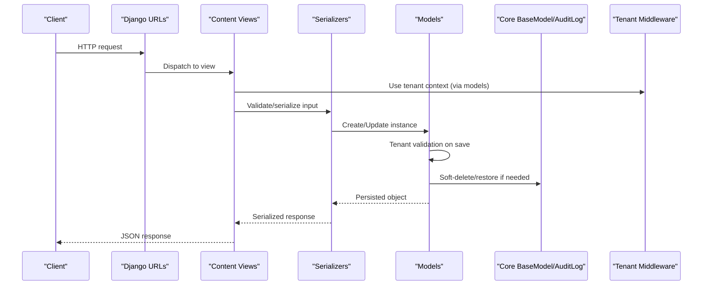
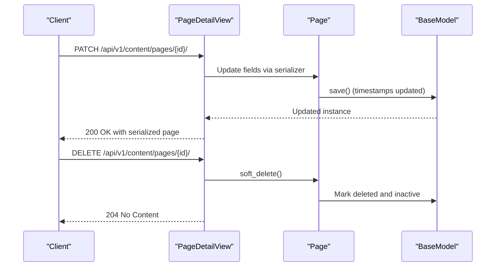
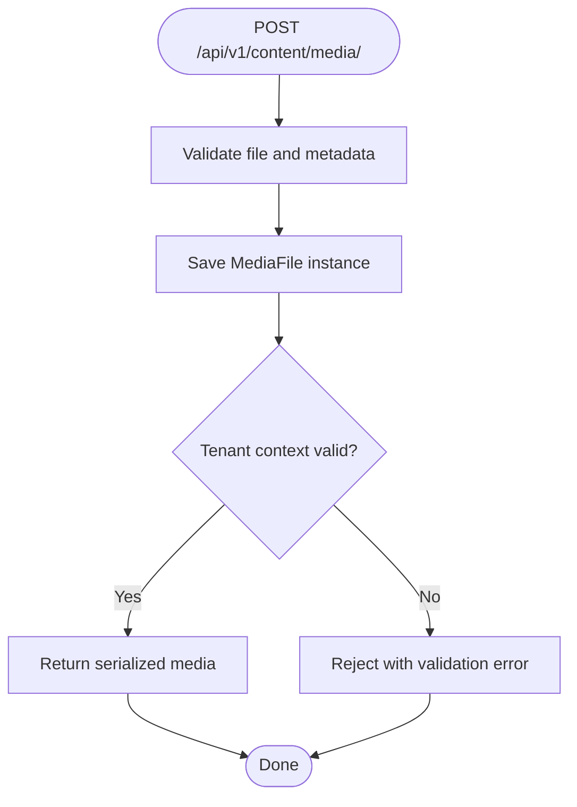
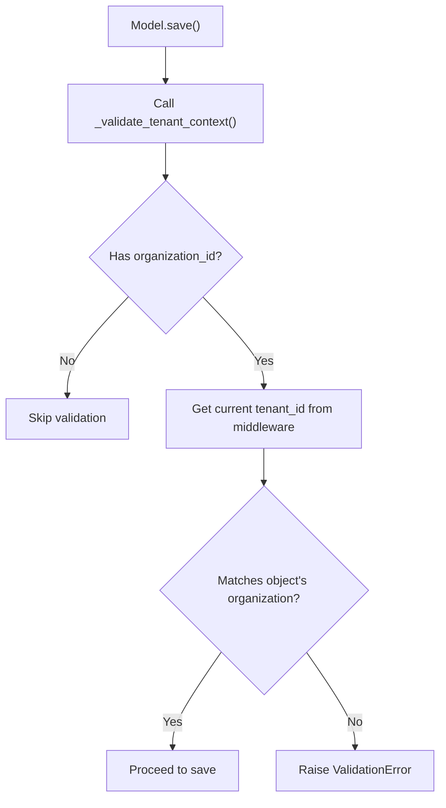
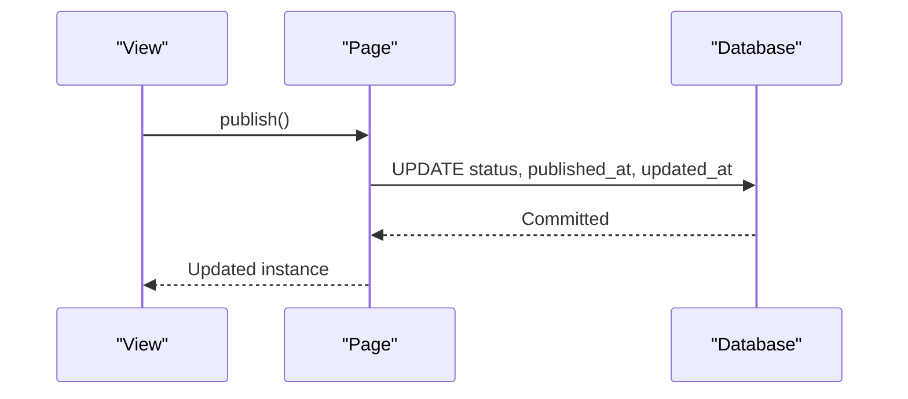
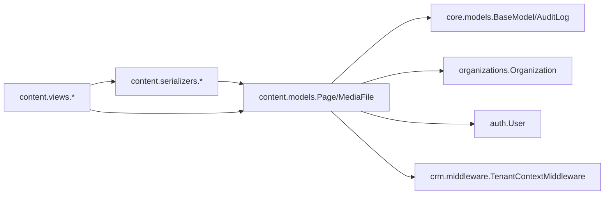

# Content Management Operations

<cite>
**Referenced Files in This Document**
- [models.py](file://backend/django/apps/content/models.py)
- [serializers.py](file://backend/django/apps/content/serializers.py)
- [views.py](file://backend/django/apps/content/views.py)
- [urls.py](file://backend/django/apps/content/urls.py)
- [core_models.py](file://backend/django/apps/core/models.py)
- [core_serializers.py](file://backend/django/apps/core/serializers.py)
- [middleware.py](file://backend/django/apps/crm/middleware.py)
- [migration_0001_initial.py](file://backend/django/apps/content/migrations/0001_initial.py)
- [migration_0002_initial.py](file://backend/django/apps/content/migrations/0002_initial.py)
- [migration_0003_initial.py](file://backend/django/apps/content/migrations/0003_initial.py)
</cite>

## Table of Contents
1. Introduction
2. Project Structure
3. Core Components
4. Architecture Overview
5. Detailed Component Analysis
6. Dependency Analysis
7. Performance Considerations
8. Troubleshooting Guide
9. Conclusion

## Introduction
This document explains the synchronous content management operations in JOL-HUB for creating, reading, updating, and deleting pages and media assets. It covers validation, serialization, database transactions, tenant isolation, soft deletes, publishing workflows, and audit logging. It also outlines where versioning, approval workflows, search indexing, cache invalidation, and real-time synchronization fit into the system based on current code.

## Project Structure
The content management feature is implemented as a Django app with models, serializers, views, and URL routes. Tenant isolation and audit capabilities are provided by shared core components.

**Diagram sources**
- [views.py:14-84](file://backend/django/apps/content/views.py#L14-L84)
- [serializers.py:10-51](file://backend/django/apps/content/serializers.py#L10-L51)
- [models.py:13-202](file://backend/django/apps/content/models.py#L13-L202)
- [urls.py:6-12](file://backend/django/apps/content/urls.py#L6-L12)
- [core_models.py:36-227](file://backend/django/apps/core/models.py#L36-L227)
- [core_serializers.py:9-29](file://backend/django/apps/core/serializers.py#L9-L29)
- [middleware.py:96-154](file://backend/django/apps/crm/middleware.py#L96-L154)

**Section sources**
- [urls.py:6-12](file://backend/django/apps/content/urls.py#L6-L12)
- [views.py:14-84](file://backend/django/apps/content/views.py#L14-L84)
- [models.py:13-202](file://backend/django/apps/content/models.py#L13-L202)
- [core_models.py:36-227](file://backend/django/apps/core/models.py#L36-L227)
- [middleware.py:96-154](file://backend/django/apps/crm/middleware.py#L96-L154)

## Core Components
- Page model: Represents a web page with title, slug, content, language, template, status, published_at, featured image, SEO fields, sort order, and extra metadata. Includes tenant context validation on save and a publish method to set status and timestamp.
- MediaFile model: Represents uploaded assets with type, MIME type, size, alt text, caption, and organization linkage. Also enforces tenant context on save.
- Base model: Provides UUID primary key, timestamps, active/deleted flags, and soft delete/restore methods.
- Audit log: Immutable record of actions with checksum integrity and tenant validation.
- Serializers: Define API input/output shapes; PageCreateSerializer injects author from request user.
- Views: REST endpoints for listing, retrieving, updating, deleting, and publishing pages; listing and uploading media.
- Middleware: Establishes per-request tenant context and provides helpers used by models to enforce multi-tenant isolation.

**Section sources**
- [models.py:13-202](file://backend/django/apps/content/models.py#L13-L202)
- [core_models.py:36-227](file://backend/django/apps/core/models.py#L36-L227)
- [serializers.py:10-51](file://backend/django/apps/content/serializers.py#L10-L51)
- [views.py:14-84](file://backend/django/apps/content/views.py#L14-L84)
- [middleware.py:74-88](file://backend/django/apps/crm/middleware.py#L74-L88)

## Architecture Overview
The content API follows a layered design:
- URLs route requests to DRF view classes.
- Views handle permissions, query filtering, and delegate to serializers.
- Serializers validate and transform data, then persist via Django ORM.
- Models enforce business rules (e.g., tenant validation, publishing).
- Core base model ensures consistent lifecycle and soft deletes.
- Middleware injects tenant context for cross-tenant safety.

**Diagram sources**
- [urls.py:6-12](file://backend/django/apps/content/urls.py#L6-L12)
- [views.py:14-84](file://backend/django/apps/content/views.py#L14-L84)
- [serializers.py:10-51](file://backend/django/apps/content/serializers.py#L10-L51)
- [models.py:73-118](file://backend/django/apps/content/models.py#L73-L118)
- [core_models.py:51-64](file://backend/django/apps/core/models.py#L51-L64)
- [middleware.py:96-154](file://backend/django/apps/crm/middleware.py#L96-L154)

## Detailed Component Analysis

### Pages CRUD and Publishing
- List/Create:
  - GET filters by organization_id, language, and status; includes related author and featured image.
  - POST uses PageCreateSerializer to create a page and sets author from the authenticated user.
- Retrieve/Update/Delete:
  - GET/PATCH/DELETE operate on non-deleted pages; DELETE performs a soft delete.
- Publish:
  - Sets status to published and records published_at atomically within a single update.

**Diagram sources**
- [views.py:36-45](file://backend/django/apps/content/views.py#L36-L45)
- [models.py:73-80](file://backend/django/apps/content/models.py#L73-L80)
- [core_models.py:51-57](file://backend/django/apps/core/models.py#L51-L57)

**Section sources**
- [views.py:14-55](file://backend/django/apps/content/views.py#L14-L55)
- [serializers.py:21-51](file://backend/django/apps/content/serializers.py#L21-L51)
- [models.py:13-118](file://backend/django/apps/content/models.py#L13-L118)
- [core_models.py:51-64](file://backend/django/apps/core/models.py#L51-L64)

### Media Assets Upload and Management
- List/Create:
  - GET lists non-deleted media files, optionally filtered by organization_id.
  - POST uploads a file and records uploader as uploaded_by.
- Retrieve/Delete:
  - GET retrieves details; DELETE performs soft delete.

**Diagram sources**
- [views.py:58-73](file://backend/django/apps/content/views.py#L58-L73)
- [models.py:121-202](file://backend/django/apps/content/models.py#L121-L202)
- [middleware.py:74-88](file://backend/django/apps/crm/middleware.py#L74-L88)

**Section sources**
- [views.py:58-84](file://backend/django/apps/content/views.py#L58-L84)
- [models.py:121-202](file://backend/django/apps/content/models.py#L121-L202)

### Tenant Isolation and Validation
- Models enforce tenant context during save by comparing the object’s organization against the current tenant ID obtained from middleware.
- If mismatched, a validation error is raised to prevent cross-tenant manipulation.
- Middleware extracts tenant ID from JWT claims, headers, or user membership and stores it in thread-local storage for the request lifetime.

**Diagram sources**
- [models.py:73-113](file://backend/django/apps/content/models.py#L73-L113)
- [models.py:164-201](file://backend/django/apps/content/models.py#L164-L201)
- [middleware.py:74-88](file://backend/django/apps/crm/middleware.py#L74-L88)

**Section sources**
- [models.py:73-113](file://backend/django/apps/content/models.py#L73-L113)
- [models.py:164-201](file://backend/django/apps/content/models.py#L164-L201)
- [middleware.py:96-154](file://backend/django/apps/crm/middleware.py#L96-L154)

### Data Consistency and Transactions
- Each view operation runs within Django’s default transactional behavior per request.
- Publishing updates status and timestamp in a single atomic update_fields call.
- Soft deletes mark records without removing them, preserving referential integrity.

**Diagram sources**
- [views.py:47-55](file://backend/django/apps/content/views.py#L47-L55)
- [models.py:114-118](file://backend/django/apps/content/models.py#L114-L118)

**Section sources**
- [views.py:47-55](file://backend/django/apps/content/views.py#L47-L55)
- [models.py:114-118](file://backend/django/apps/content/models.py#L114-L118)

### Versioning, Approval Workflows, and Media Handling
- Versioning: Not present in the current codebase. The Page model does not include version fields or history tracking.
- Approval workflow: Not present. Pages have a simple status field (draft/published/archived) with no explicit approval steps.
- Media handling: Supports file upload with metadata and organization linkage; deletion is soft.

[No sources needed since this section summarizes capabilities not implemented]

### Search Indexing, Cache Invalidation, and Real-Time Sync
- Search indexing: No indexing logic found in the content app.
- Cache invalidation: No cache invalidation hooks in the content app.
- Real-time sync: No WebSocket or event-driven sync mechanisms in the content app.

[No sources needed since this section summarizes absence of features]

## Dependency Analysis
The content app depends on core models and middleware for shared behavior and security.

**Diagram sources**
- [models.py:13-202](file://backend/django/apps/content/models.py#L13-L202)
- [core_models.py:36-227](file://backend/django/apps/core/models.py#L36-L227)
- [serializers.py:10-51](file://backend/django/apps/content/serializers.py#L10-L51)
- [views.py:14-84](file://backend/django/apps/content/views.py#L14-L84)
- [middleware.py:96-154](file://backend/django/apps/crm/middleware.py#L96-L154)

**Section sources**
- [models.py:13-202](file://backend/django/apps/content/models.py#L13-L202)
- [core_models.py:36-227](file://backend/django/apps/core/models.py#L36-L227)
- [serializers.py:10-51](file://backend/django/apps/content/serializers.py#L10-L51)
- [views.py:14-84](file://backend/django/apps/content/views.py#L14-L84)
- [middleware.py:96-154](file://backend/django/apps/crm/middleware.py#L96-L154)

## Performance Considerations
- Query efficiency:
  - Use select_related for author and featured_image when listing pages to reduce N+1 queries.
  - Filter by organization_id, language, and status at the database level to minimize payload.
- Database indexes:
  - Page has an index on (organization, status, language) and a unique constraint on (organization, slug, language) to support fast lookups and uniqueness checks.
- Soft deletes:
  - Filtering by is_deleted avoids scanning archived records in most queries.
- Publishing:
  - Atomic update_fields minimizes contention on publish operations.

**Section sources**
- [views.py:22-33](file://backend/django/apps/content/views.py#L22-L33)
- [models.py:61-68](file://backend/django/apps/content/models.py#L61-L68)
- [core_models.py:51-57](file://backend/django/apps/core/models.py#L51-L57)
- [models.py:114-118](file://backend/django/apps/content/models.py#L114-L118)

## Troubleshooting Guide
Common issues and how to diagnose them:
- Cross-tenant access errors:
  - Cause: Attempting to modify content belonging to another tenant.
  - Symptom: Validation error indicating organization does not match tenant context.
  - Resolution: Ensure the request carries the correct tenant context (JWT claim or header) and that the target resource belongs to that tenant.
- Missing tenant context:
  - Cause: Middleware did not establish tenant context.
  - Symptom: Tenant validation skipped or warnings in logs.
  - Resolution: Verify authentication and tenant resolution path in middleware.
- Soft-deleted resources not visible:
  - Cause: Queries filter out is_deleted=True records.
  - Resolution: Adjust query parameters or admin tools to include deleted items if necessary.

**Section sources**
- [models.py:73-113](file://backend/django/apps/content/models.py#L73-L113)
- [models.py:164-201](file://backend/django/apps/content/models.py#L164-L201)
- [middleware.py:96-154](file://backend/django/apps/crm/middleware.py#L96-L154)

## Conclusion
JOL-HUB’s content management provides robust, tenant-isolated CRUD for pages and media with clear publishing semantics and soft deletes. While versioning, approval workflows, search indexing, cache invalidation, and real-time sync are not implemented in the current codebase, the foundation supports future extensions. For high-throughput scenarios, leverage existing indexes, selective filtering, and atomic updates. For compliance and auditing, rely on the core audit log and tenant isolation enforced by middleware.