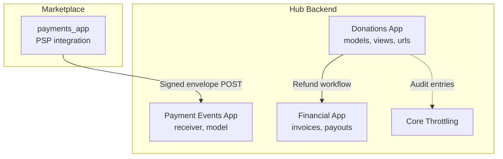
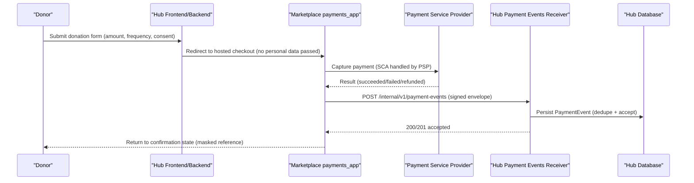
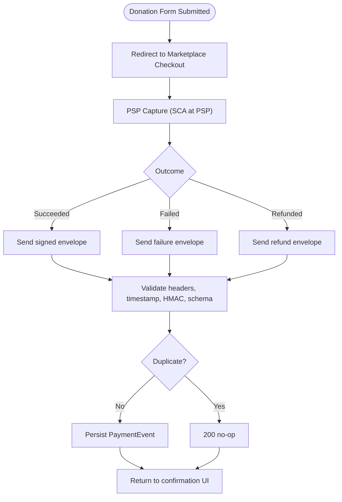
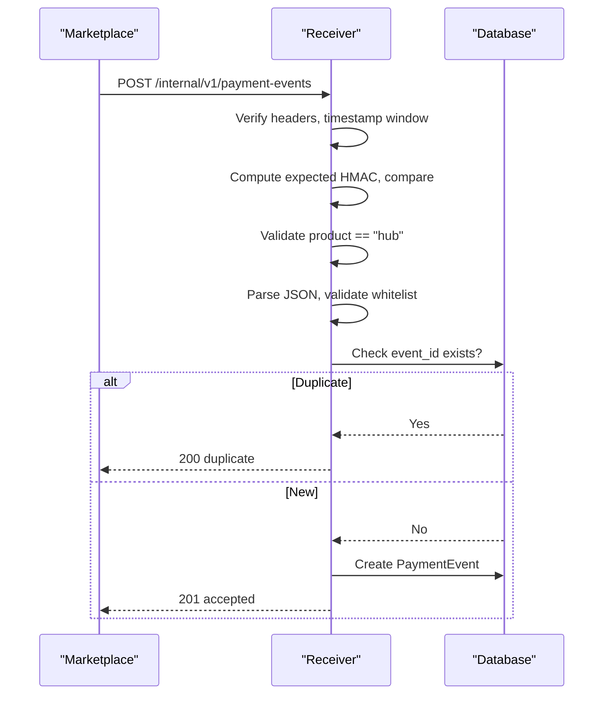
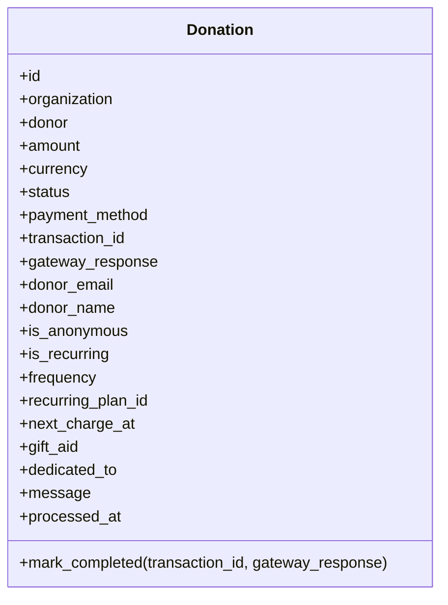
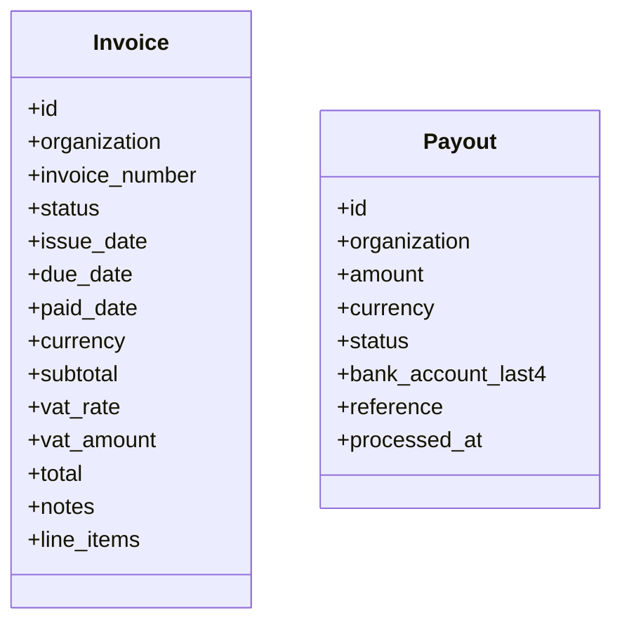
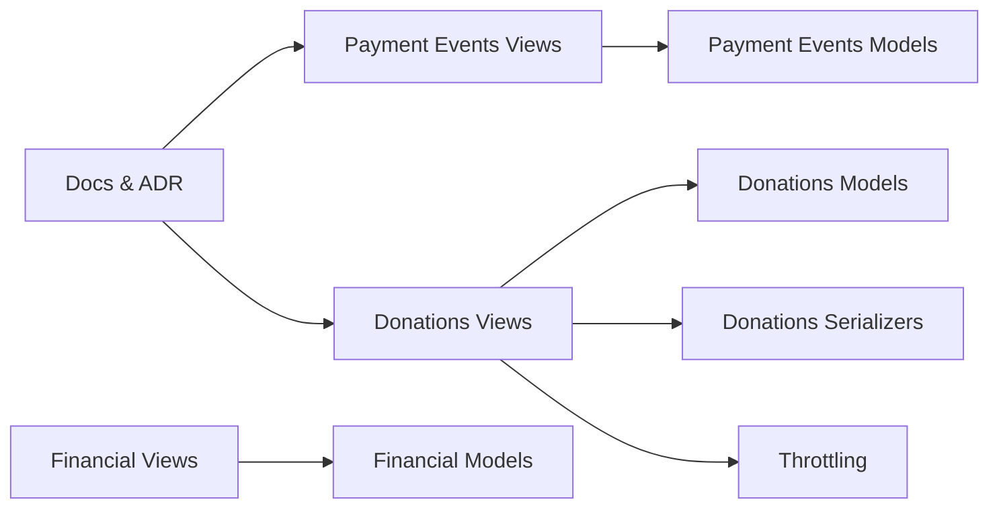

# Donation & Payment Processing

<cite>
**Referenced Files in This Document**
- [donations/models.py](file://backend/django/apps/donations/models.py)
- [donations/views.py](file://backend/django/apps/donations/views.py)
- [donations/urls.py](file://backend/django/apps/donations/urls.py)
- [donations/serializers.py](file://backend/django/apps/donations/serializers.py)
- [payment_events/models.py](file://backend/django/apps/payment_events/models.py)
- [payment_events/views.py](file://backend/django/apps/payment_events/views.py)
- [payment_events/urls.py](file://backend/django/apps/payment_events/urls.py)
- [financial/models.py](file://backend/django/apps/financial/models.py)
- [financial/views.py](file://backend/django/apps/financial/views.py)
- [core/throttling.py](file://backend/django/apps/core/throttling.py)
- [commerce/donation-flow-spec.md](file://docs/commerce/donation-flow-spec.md)
- [payment-api-contract.md](file://docs/payment-api-contract.md)
- [ADR-009-payment-boundary.md](file://docs/decisions/ADR-009-payment-boundary.md)
</cite>

## Table of Contents
1. Introduction
2. Project Structure
3. Core Components
4. Architecture Overview
5. Detailed Component Analysis
6. Dependency Analysis
7. Performance Considerations
8. Troubleshooting Guide
9. Conclusion
10. Appendices

## Introduction
This document explains the donation and payment processing synchronous flows in JOL-HUB, from form submission through payment gateway handoff, event ingestion, transaction recording, and receipting. It clarifies PCI-DSS compliance boundaries, secure payment handling, fraud controls, error handling for failures and webhooks, reconciliation considerations, audit logging, compliance reporting, and data retention policies. The system follows a strict boundary: the hub never touches cardholder data or PSP endpoints; it receives signed, minimal “facts” about payments from the marketplace’s payment application.

## Project Structure
The donation and payment capability spans several Django apps and supporting documentation:
- Donations app: models, serializers, views, and URLs for donations and refunds.
- Payment events app: internal receiver for signed payment facts from the marketplace.
- Financial app: invoices and payouts for settlement tracking.
- Core throttling: rate limiting to prevent abuse on sensitive endpoints.
- Docs: donation flow spec, payment API contract, and ADR defining the payment boundary.

**Diagram sources**
- [donations/models.py:13-94](file://backend/django/apps/donations/models.py#L13-L94)
- [payment_events/models.py:6-35](file://backend/django/apps/payment_events/models.py#L6-L35)
- [financial/models.py:14-170](file://backend/django/apps/financial/models.py#L14-L170)
- [core/throttling.py:59-76](file://backend/django/apps/core/throttling.py#L59-L76)

**Section sources**
- [donations/models.py:13-94](file://backend/django/apps/donations/models.py#L13-L94)
- [payment_events/models.py:6-35](file://backend/django/apps/payment_events/models.py#L6-L35)
- [financial/models.py:14-170](file://backend/django/apps/financial/models.py#L14-L170)
- [core/throttling.py:59-76](file://backend/django/apps/core/throttling.py#L59-L76)

## Core Components
- Donation model: represents one-off and recurring donations with status, method, amounts, currency, donor context, and recurrence fields. Includes tenant validation and helper to mark completed.
- PaymentEvent model: durable, minimal storage of signed payment facts (event_id, type, product, payment_intent_id, status, amount_cents, currency, occurred_at).
- Invoice and Payout models: financial records for platform invoicing and settlement payouts.
- Donation views: list/create donations, retrieve details, and process refunds with full audit trail and rate limits.
- Payment events receiver: validates headers, timestamp window, HMAC signature, product routing, schema whitelist, dedupes by event_id, persists before processing.
- Throttling: custom rate limiters for donation creation and refund endpoints.

**Section sources**
- [donations/models.py:13-146](file://backend/django/apps/donations/models.py#L13-L146)
- [payment_events/models.py:6-35](file://backend/django/apps/payment_events/models.py#L6-L35)
- [financial/models.py:14-170](file://backend/django/apps/financial/models.py#L14-L170)
- [donations/views.py:24-176](file://backend/django/apps/donations/views.py#L24-L176)
- [payment_events/views.py:81-143](file://backend/django/apps/payment_events/views.py#L81-L143)
- [core/throttling.py:59-76](file://backend/django/apps/core/throttling.py#L59-L76)

## Architecture Overview
The donation lifecycle is split across the frontend/hub UI and the marketplace’s payment application. The hub remains out of PCI scope and only stores minimal facts about payments.

**Diagram sources**
- [commerce/donation-flow-spec.md:5-21](file://docs/commerce/donation-flow-spec.md#L5-L21)
- [payment-api-contract.md:21-83](file://docs/payment-api-contract.md#L21-L83)
- [payment_events/views.py:81-143](file://backend/django/apps/payment_events/views.py#L81-L143)

## Detailed Component Analysis

### Donation Lifecycle (Form to Receipt)
- Form submission: The hub renders a donation form that collects non-sensitive context and explicit consent per jurisdictional rules. Personal data is not embedded in the handoff to the marketplace checkout.
- Handoff: The user is redirected to the marketplace-hosted checkout where identity and payment details are collected. The hub never sees cardholder data.
- Payment capture: The marketplace integrates directly with the PSP and handles SCA and capture.
- Event delivery: On completion/failure/refund, the marketplace sends a signed envelope to the hub’s internal endpoint.
- Fact persistence: The receiver validates and persists the event idempotently.
- Confirmation: The donor returns to the hub confirmation page showing a masked reference and outcome-appropriate messaging.

**Diagram sources**
- [commerce/donation-flow-spec.md:5-21](file://docs/commerce/donation-flow-spec.md#L5-L21)
- [payment-api-contract.md:21-83](file://docs/payment-api-contract.md#L21-L83)
- [payment_events/views.py:81-143](file://backend/django/apps/payment_events/views.py#L81-L143)

**Section sources**
- [commerce/donation-flow-spec.md:5-21](file://docs/commerce/donation-flow-spec.md#L5-L21)
- [payment-api-contract.md:21-83](file://docs/payment-api-contract.md#L21-L83)
- [payment_events/views.py:81-143](file://backend/django/apps/payment_events/views.py#L81-L143)

### Payment Events Receiver
- Authentication and transport: Requires X-Product, X-JOL-Timestamp, X-JOL-Signature; enforces ±300 s replay window; uses HMAC-SHA256 over raw body bytes; constant-time comparison.
- Routing and schema: Accepts only product “hub”; validates required whitelist fields and types; ignores unknown fields.
- Idempotency: Dedupes by event_id; known IDs return 200 no-op.
- Persistence: Persists before any downstream processing; currently acts as durable acceptance.

**Diagram sources**
- [payment-api-contract.md:21-83](file://docs/payment-api-contract.md#L21-L83)
- [payment_events/views.py:81-143](file://backend/django/apps/payment_events/views.py#L81-L143)

**Section sources**
- [payment-api-contract.md:21-83](file://docs/payment-api-contract.md#L21-L83)
- [payment_events/views.py:81-143](file://backend/django/apps/payment_events/views.py#L81-L143)

### Donation Model and Refunds
- Donation states: pending, completed, failed, refunded, cancelled.
- Fields include amount, currency, payment_method, transaction_id, gateway_response, donor context, recurrence flags, gift aid, and timestamps.
- Tenant validation prevents cross-tenant manipulation.
- Refund flow: authenticated request, rate-limited, updates status to refunded, creates tamper-evident audit entry with actor, IP, user agent, field changes, and organization context.

**Diagram sources**
- [donations/models.py:13-94](file://backend/django/apps/donations/models.py#L13-L94)

**Section sources**
- [donations/models.py:13-146](file://backend/django/apps/donations/models.py#L13-L146)
- [donations/views.py:59-176](file://backend/django/apps/donations/views.py#L59-L176)

### Financial Records (Invoices and Payouts)
- Invoice: tracks issuance, due/paid dates, VAT, totals, line items, and status.
- Payout: tracks settlement amounts, bank account last four, references, and status.
- Both enforce tenant context validation on save.

**Diagram sources**
- [financial/models.py:14-170](file://backend/django/apps/financial/models.py#L14-L170)

**Section sources**
- [financial/models.py:14-170](file://backend/django/apps/financial/models.py#L14-L170)
- [financial/views.py:7-39](file://backend/django/apps/financial/views.py#L7-L39)

### Error Handling and Webhook Processing
- Payment events receiver errors:
  - Missing/invalid headers → 400
  - Timestamp outside window → 401
  - Signature mismatch → 401
  - Misrouted product → 400
  - Invalid JSON/schema → 400
  - Unknown event type → 400
  - Unavailable/unconfigured → 503 (sender retries)
- Duplicate event_id → 200 no-op (idempotent).
- Donation refund errors:
  - Not found → 404
  - Invalid state (only completed can be refunded) → 400

**Section sources**
- [payment-api-contract.md:129-145](file://docs/payment-api-contract.md#L129-L145)
- [payment_events/views.py:81-143](file://backend/django/apps/payment_events/views.py#L81-L143)
- [donations/views.py:80-102](file://backend/django/apps/donations/views.py#L80-L102)

### PCI-DSS Compliance Boundaries and Secure Payment Handling
- Boundary: The hub stays out of PCI scope. No PSP SDKs, keys, or endpoints in the hub tree. The marketplace payments_app is the sole PSP integrator.
- Data minimization: Only minimal payment facts cross into the hub via a whitelisted envelope; no personal data, no card data, no device fingerprints.
- Transport security: Internal TLS termination at hub ingress; HMAC-SHA256 signatures with timestamp replay protection; constant-time signature verification.
- Key management: Delivery key stored securely, rotated on a cadence with dual-key window; rotation recorded.

**Section sources**
- [ADR-009-payment-boundary.md:45-105](file://docs/decisions/ADR-009-payment-boundary.md#L45-L105)
- [payment-api-contract.md:21-83](file://docs/payment-api-contract.md#L21-L83)
- [payment-api-contract.md:147-177](file://docs/payment-api-contract.md#L147-L177)

### Fraud Detection and Rate Limiting
- Donation creation: rate limited to reduce fraud attempts.
- Donation refunds: stricter rate limiting to prevent financial abuse.
- Audit logging: every refund action includes actor, IP, user agent, field changes, and organization context.

**Section sources**
- [core/throttling.py:59-76](file://backend/django/apps/core/throttling.py#L59-L76)
- [donations/views.py:24-46](file://backend/django/apps/donations/views.py#L24-L46)
- [donations/views.py:59-176](file://backend/django/apps/donations/views.py#L59-L176)

### Examples and Use Cases
- One-time donations:
  - Create a donation record via the donations API; redirect to marketplace checkout; receive success/failure via payment events; display confirmation with masked reference.
- Recurring payments:
  - Donation model supports frequency and next_charge_at; recurrence scheduling and plan linkage are managed marketplace-side; hub records facts when events arrive.
- Refund processing:
  - Authenticated refund request updates donation status to refunded and creates an audit entry; marketplace emits charge.refunded event which the hub records against the original intent.
- Tax receipts:
  - Receipt generation relies on persisted facts and donor acknowledgment; anonymous donors receive receipts based on opaque references only.

[No sources needed since this section provides conceptual examples grounded by prior sections]

### Audit Logging, Compliance Reporting, and Data Retention
- Audit logging:
  - Refund actions create tamper-evident audit entries with actor, IP, user agent, field changes, and organization context.
  - Payment events receiver logs structured responses and rejects without logging raw bodies per contract obligations.
- Compliance reporting:
  - Facts table enables aggregates and reconciliation without exposing personal data.
  - Invoices and payouts support settlement reporting.
- Data retention:
  - Fiscal/accounting records retained per jurisdiction (e.g., LT 10 years); LV/EE use “being confirmed” where applicable.
  - Consent records retained with fiscal anchors; withdrawal stops future processing but not lawful past retention.
  - Erasure path: hub erases its pseudonymous facts rows and forwards identity-bearing portions to the marketplace under processor obligations.

**Section sources**
- [donations/views.py:104-168](file://backend/django/apps/donations/views.py#L104-L168)
- [payment-api-contract.md:139-145](file://docs/payment-api-contract.md#L139-L145)
- [commerce/donation-flow-spec.md:23-35](file://docs/commerce/donation-flow-spec.md#L23-L35)

## Dependency Analysis
Key dependencies and relationships:
- Donation views depend on Donation model and serializers; they apply throttling and create audit entries.
- Payment events receiver depends on PaymentEvent model and settings for feature flag, replay window, and delivery key.
- Financial views depend on Invoice and Payout models.
- Documentation defines the boundary and contract that constrain implementation.

**Diagram sources**
- [donations/views.py:24-176](file://backend/django/apps/donations/views.py#L24-L176)
- [donations/models.py:13-146](file://backend/django/apps/donations/models.py#L13-L146)
- [donations/serializers.py:10-44](file://backend/django/apps/donations/serializers.py#L10-L44)
- [payment_events/views.py:81-143](file://backend/django/apps/payment_events/views.py#L81-L143)
- [payment_events/models.py:6-35](file://backend/django/apps/payment_events/models.py#L6-L35)
- [financial/views.py:7-39](file://backend/django/apps/financial/views.py#L7-L39)
- [financial/models.py:14-170](file://backend/django/apps/financial/models.py#L14-L170)

**Section sources**
- [donations/views.py:24-176](file://backend/django/apps/donations/views.py#L24-L176)
- [payment_events/views.py:81-143](file://backend/django/apps/payment_events/views.py#L81-L143)
- [financial/views.py:7-39](file://backend/django/apps/financial/views.py#L7-L39)

## Performance Considerations
- Idempotent event acceptance avoids duplicate side effects and reduces reprocessing overhead.
- Minimal payload and strict schema validation minimize parsing and storage costs.
- Rate limiting protects endpoints from abuse while maintaining availability.
- Persistent acceptance before processing ensures durability even if downstream work is deferred.

[No sources needed since this section provides general guidance]

## Troubleshooting Guide
Common issues and resolutions:
- 400 missing_headers: Ensure X-Product, X-JOL-Timestamp, X-JOL-Signature are present.
- 401 timestamp_out_of_window: Align clocks; ensure timestamp within ±300 s.
- 401 signature_mismatch: Verify delivery key and HMAC computation over raw body bytes.
- 400 misrouted_product: Product must be “hub”.
- 400 invalid_json/schema_violation: Validate JSON structure and whitelist fields.
- 503 receiver_unconfigured: Provision HUB_PAYMENT_DELIVERY_KEY and enable PAYMENT_EVENTS_ENABLED.
- Donation refund invalid_state: Only completed donations can be refunded.

**Section sources**
- [payment_events/views.py:81-143](file://backend/django/apps/payment_events/views.py#L81-L143)
- [donations/views.py:80-102](file://backend/django/apps/donations/views.py#L80-L102)

## Conclusion
JOL-HUB implements a secure, compliant donation and payment processing architecture that keeps the hub out of PCI scope while providing durable, auditable records of payment facts. The marketplace handles PSP integration and cardholder data; the hub validates signed envelopes, persists minimal facts idempotently, and exposes safe APIs for donations and refunds with strong rate limiting and audit trails. Operational safeguards—HMAC signatures, replay windows, tenant validation, and feature gating—ensure robustness and compliance.

[No sources needed since this section summarizes without analyzing specific files]

## Appendices

### API Endpoints Summary
- Donations
  - GET/POST /api/v1/donations/
  - GET /api/v1/donations/{id}/
  - POST /api/v1/donations/{id}/refund/
- Financial
  - GET /api/v1/financial/invoices/?organization_id=
  - GET /api/v1/financial/payouts/?organization_id=
- Internal Payment Events
  - POST /internal/v1/payment-events

**Section sources**
- [donations/urls.py:6-10](file://backend/django/apps/donations/urls.py#L6-L10)
- [financial/views.py:7-39](file://backend/django/apps/financial/views.py#L7-L39)
- [payment_events/urls.py:7-9](file://backend/django/apps/payment_events/urls.py#L7-L9)

### Contract Envelope Fields
- Required fields: event_id, type, product, payment_intent_id, status, amount_cents, currency, occurred_at.
- Allowed event types: payment_intent.succeeded, payment_intent.payment_failed, charge.refunded.

**Section sources**
- [payment-api-contract.md:84-107](file://docs/payment-api-contract.md#L84-L107)