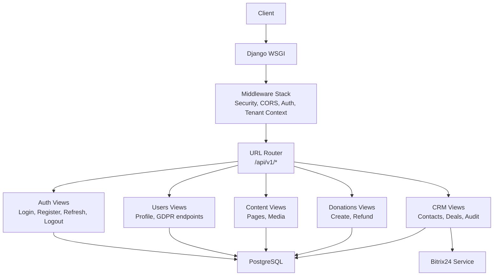
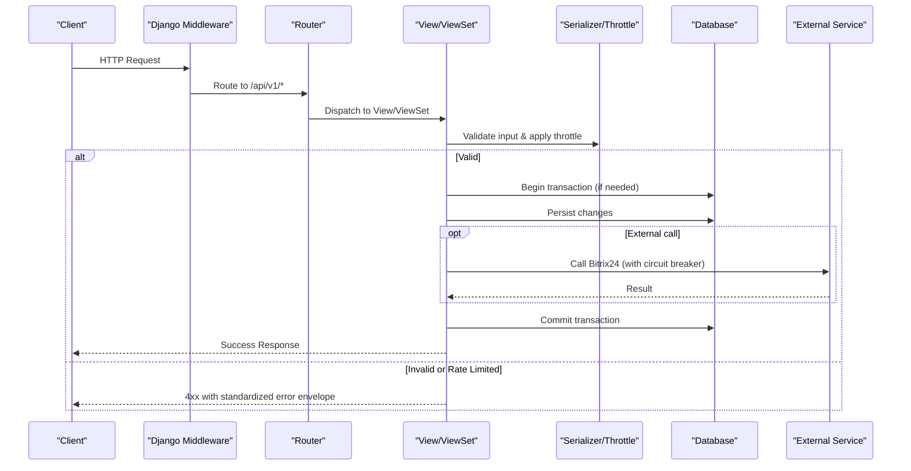
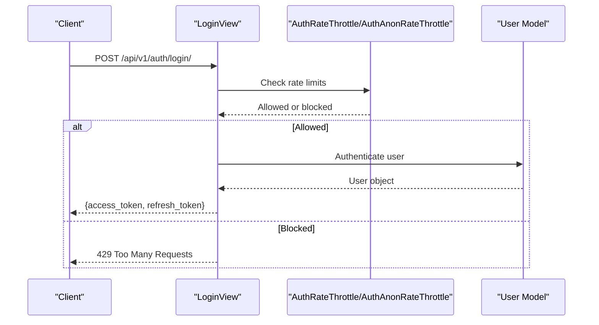
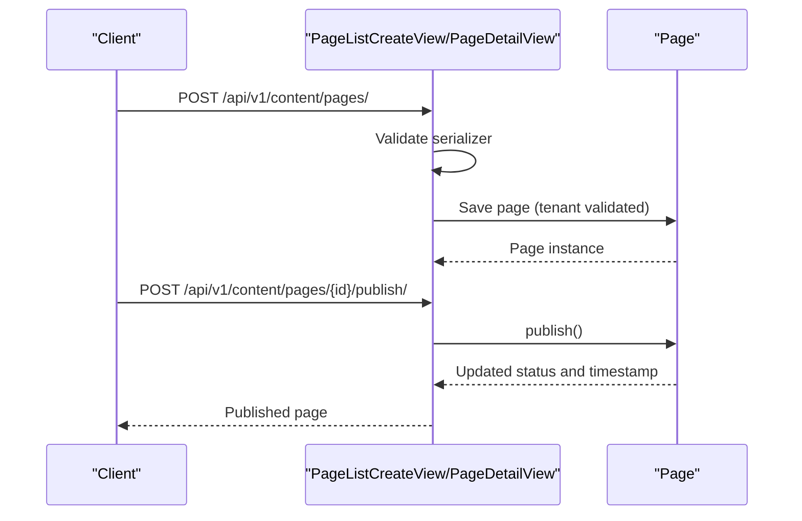
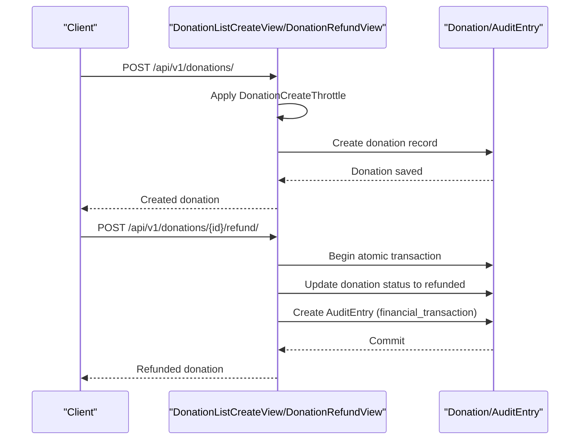
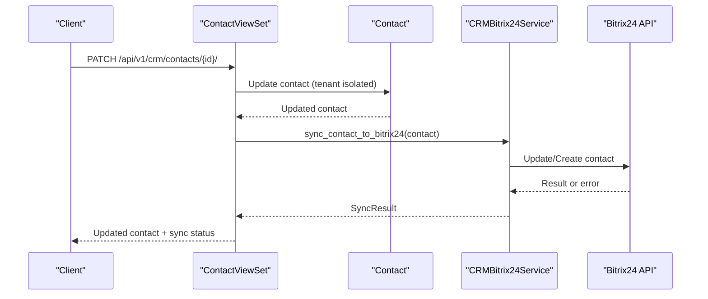
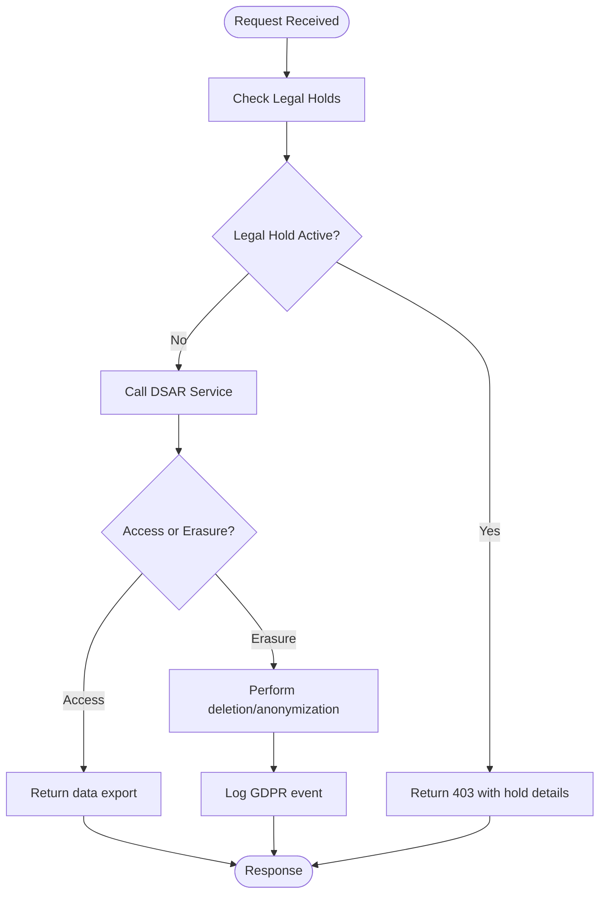
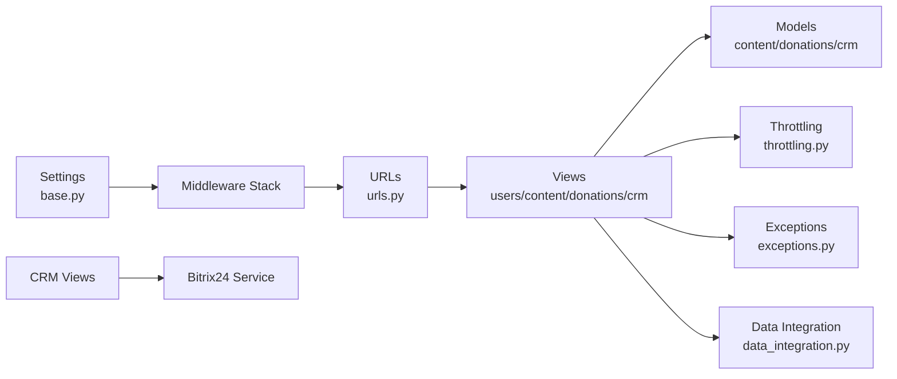

# Synchronous Data Flows

<cite>
**Referenced Files in This Document**
- [base.py](file://backend/django/core/settings/base.py)
- [urls.py](file://backend/django/core/urls.py)
- [views.py](file://backend/django/apps/users/views.py)
- [api.py](file://backend/django/apps/users/api.py)
- [views.py](file://backend/django/apps/content/views.py)
- [models.py](file://backend/django/apps/content/models.py)
- [views.py](file://backend/django/apps/donations/views.py)
- [models.py](file://backend/django/apps/donations/models.py)
- [views.py](file://backend/django/apps/crm/api/views.py)
- [bitrix24_service.py](file://backend/django/apps/crm/bitrix24_service.py)
- [exceptions.py](file://backend/django/apps/core/exceptions.py)
- [throttling.py](file://backend/django/apps/core/throttling.py)
- [data_integration.py](file://backend/django/apps/core/data_integration.py)
</cite>

## Table of Contents
1. [Introduction](#introduction)
2. [Project Structure](#project-structure)
3. [Core Components](#core-components)
4. [Architecture Overview](#architecture-overview)
5. [Detailed Component Analysis](#detailed-component-analysis)
6. [Dependency Analysis](#dependency-analysis)
7. [Performance Considerations](#performance-considerations)
8. [Troubleshooting Guide](#troubleshooting-guide)
9. [Conclusion](#conclusion)

## Introduction
This document explains synchronous request-response flows across the JOL-HUB platform’s HTTP API surface. It covers authentication, content management, donation processing, and CRM synchronization with a focus on:
- End-to-end lifecycle from HTTP entry to response generation
- Authentication middleware, validation layers, business logic, database operations
- Error handling strategies, transaction management, and consistency guarantees
- Real-world workflows: user login, content creation, donation submission, contact updates
- Performance considerations, caching, and optimization techniques for high-throughput scenarios

## Project Structure
The backend is a Django application exposing REST APIs under /api/v1/. The root URL configuration mounts app-specific URL namespaces for auth, users, content, donations, analytics, countries, integrations, financial, and CRM. Core services include:
- Authentication via JWT and session
- Content management (pages, media)
- Donation processing with strict throttling and audit trails
- CRM with tenant isolation, GDPR controls, and Bitrix24 sync
- Centralized exception handling and rate limiting

**Diagram sources**
- [urls.py:39-66](file://backend/django/core/urls.py#L39-L66)
- [base.py:121-145](file://backend/django/core/settings/base.py#L121-L145)

**Section sources**
- [urls.py:39-66](file://backend/django/core/urls.py#L39-L66)
- [base.py:121-145](file://backend/django/core/settings/base.py#L121-L145)

## Core Components
- Authentication and User Management: JWT-based login, refresh, logout; profile access; GDPR data rights endpoints with rate limits and legal hold checks.
- Content Management: Pages and media CRUD with tenant-aware persistence and publish workflow.
- Donation Processing: Create and refund flows with strict throttling, atomic transactions, and tamper-evident audit entries.
- CRM and Bitrix24 Sync: Multi-tenant contacts and deals, consent and legal hold enforcement, Bitrix24 integration with circuit breaker and retry semantics.
- Cross-cutting: Centralized DRF exception handler, global rate limiting, Redis cache, and data integration layer for DSAR and retention.

**Section sources**
- [views.py:31-70](file://backend/django/apps/users/views.py#L31-L70)
- [views.py:73-174](file://backend/django/apps/users/views.py#L73-L174)
- [views.py:196-351](file://backend/django/apps/users/views.py#L196-L351)
- [views.py:14-83](file://backend/django/apps/content/views.py#L14-L83)
- [models.py:13-118](file://backend/django/apps/content/models.py#L13-L118)
- [views.py:24-176](file://backend/django/apps/donations/views.py#L24-L176)
- [models.py:13-146](file://backend/django/apps/donations/models.py#L13-L146)
- [views.py:141-445](file://backend/django/apps/crm/api/views.py#L141-L445)
- [bitrix24_service.py:238-572](file://backend/django/apps/crm/bitrix24_service.py#L238-L572)
- [exceptions.py:10-49](file://backend/django/apps/core/exceptions.py#L10-L49)
- [throttling.py:18-76](file://backend/django/apps/core/throttling.py#L18-L76)
- [data_integration.py:156-344](file://backend/django/apps/core/data_integration.py#L156-L344)

## Architecture Overview
Synchronous requests traverse a consistent pipeline:
1. HTTP entry through Django WSGI
2. Middleware stack: security headers, CORS, CSRF, session/auth, locale, tenant context
3. URL routing to app-specific views
4. DRF authentication and permission checks
5. Validation via serializers and custom throttles
6. Business logic in views or viewsets
7. Database writes within atomic transactions where required
8. Optional external calls (e.g., Bitrix24) with resilience patterns
9. Consistent JSON error envelopes via custom exception handler
10. Response serialization and return

**Diagram sources**
- [base.py:121-145](file://backend/django/core/settings/base.py#L121-L145)
- [urls.py:39-66](file://backend/django/core/urls.py#L39-L66)
- [exceptions.py:10-49](file://backend/django/apps/core/exceptions.py#L10-L49)
- [throttling.py:18-76](file://backend/django/apps/core/throttling.py#L18-L76)
- [bitrix24_service.py:238-394](file://backend/django/apps/crm/bitrix24_service.py#L238-L394)

## Detailed Component Analysis

### Authentication Flow (User Login)
Real-time flow for obtaining JWT tokens:
- Endpoint: POST /api/v1/auth/login/
- Throttling: Anonymous and per-user auth throttles applied
- Validation: TokenObtainPairSerializer validates credentials
- Response: Access and refresh tokens returned
- Security: Brute-force protection via rate limits

**Diagram sources**
- [views.py:40-49](file://backend/django/apps/users/views.py#L40-L49)
- [throttling.py:18-35](file://backend/django/apps/core/throttling.py#L18-L35)

**Section sources**
- [views.py:40-49](file://backend/django/apps/users/views.py#L40-L49)
- [throttling.py:18-35](file://backend/django/apps/core/throttling.py#L18-L35)

### Content Creation Flow (Page Publish)
Real-time flow for creating and publishing pages:
- Endpoints: POST /api/v1/content/pages/, PATCH /api/v1/content/pages/{id}/, POST /api/v1/content/pages/{id}/publish/
- Validation: PageCreateSerializer for create, PageSerializer for read/update
- Persistence: Page model with tenant context validation and publish method
- Permissions: IsAuthenticated required

**Diagram sources**
- [views.py:14-55](file://backend/django/apps/content/views.py#L14-L55)
- [models.py:13-118](file://backend/django/apps/content/models.py#L13-L118)

**Section sources**
- [views.py:14-55](file://backend/django/apps/content/views.py#L14-L55)
- [models.py:13-118](file://backend/django/apps/content/models.py#L13-L118)

### Donation Submission and Refund Flow
Real-time flows for donations:
- Create: POST /api/v1/donations/ with stricter throttling for POST
- Refund: POST /api/v1/donations/{id}/refund/ with atomic transaction and audit trail
- Compliance: Tamper-evident audit entries, actor tracking, and logging

**Diagram sources**
- [views.py:24-46](file://backend/django/apps/donations/views.py#L24-L46)
- [views.py:59-168](file://backend/django/apps/donations/views.py#L59-L168)
- [models.py:13-146](file://backend/django/apps/donations/models.py#L13-L146)

**Section sources**
- [views.py:24-46](file://backend/django/apps/donations/views.py#L24-L46)
- [views.py:59-168](file://backend/django/apps/donations/views.py#L59-L168)
- [models.py:13-146](file://backend/django/apps/donations/models.py#L13-L146)

### CRM Contact Update and Bitrix24 Sync
Real-time flow for updating CRM contacts and syncing to Bitrix24:
- Endpoints: CRM ViewSets for Contacts and Deals with tenant isolation
- Validation: Minimal serializers for lists, full serializers for detail actions
- Sync: CRMBitrix24Service with circuit breaker and retry semantics

**Diagram sources**
- [views.py:141-275](file://backend/django/apps/crm/api/views.py#L141-L275)
- [bitrix24_service.py:302-394](file://backend/django/apps/crm/bitrix24_service.py#L302-L394)

**Section sources**
- [views.py:141-275](file://backend/django/apps/crm/api/views.py#L141-L275)
- [bitrix24_service.py:302-394](file://backend/django/apps/crm/bitrix24_service.py#L302-L394)

### GDPR Data Rights Flow (Access and Erasure)
Real-time flows for data subject requests:
- Access: GET /api/v1/users/me/gdpr/export/ returns comprehensive data export
- Erasure: DELETE /api/v1/users/me/gdpr/delete/ enforces legal holds and performs erasure
- Integration: DataModuleIntegration handles DSAR services and legal hold checks

**Diagram sources**
- [views.py:196-351](file://backend/django/apps/users/views.py#L196-L351)
- [data_integration.py:156-344](file://backend/django/apps/core/data_integration.py#L156-L344)

**Section sources**
- [views.py:196-351](file://backend/django/apps/users/views.py#L196-L351)
- [data_integration.py:156-344](file://backend/django/apps/core/data_integration.py#L156-L344)

## Dependency Analysis
Key dependencies and relationships:
- Settings configure middleware, DRF, JWT, caching, and rate limits
- URLs mount app namespaces for all synchronous endpoints
- Views depend on models and serializers for validation and persistence
- CRM views depend on Bitrix24 service for external synchronization
- Exception handler standardizes error responses
- Throttling classes enforce compliance-driven rate limits
- Data integration layer provides DSAR, retention, and encryption utilities

**Diagram sources**
- [base.py:121-145](file://backend/django/core/settings/base.py#L121-L145)
- [urls.py:39-66](file://backend/django/core/urls.py#L39-L66)
- [throttling.py:18-76](file://backend/django/apps/core/throttling.py#L18-L76)
- [exceptions.py:10-49](file://backend/django/apps/core/exceptions.py#L10-L49)
- [bitrix24_service.py:238-572](file://backend/django/apps/crm/bitrix24_service.py#L238-L572)
- [data_integration.py:156-344](file://backend/django/apps/core/data_integration.py#L156-L344)

**Section sources**
- [base.py:121-145](file://backend/django/core/settings/base.py#L121-L145)
- [urls.py:39-66](file://backend/django/core/urls.py#L39-L66)
- [throttling.py:18-76](file://backend/django/apps/core/throttling.py#L18-L76)
- [exceptions.py:10-49](file://backend/django/apps/core/exceptions.py#L10-L49)
- [bitrix24_service.py:238-572](file://backend/django/apps/crm/bitrix24_service.py#L238-L572)
- [data_integration.py:156-344](file://backend/django/apps/core/data_integration.py#L156-L344)

## Performance Considerations
- Caching:
  - Redis-backed cache configured with connection pooling and compression
  - Cache keys prefixed and versioned; timeouts tuned for short/medium/long-lived data
- Rate Limiting:
  - Strict scopes for auth, GDPR export/delete, donation create/refund
  - Prevents abuse and protects sensitive endpoints
- Database:
  - Connection pooling and health checks enabled
  - Selective queries with select_related to reduce N+1
- External Services:
  - Circuit breaker pattern for Bitrix24 to avoid cascading failures
  - Retry and backoff handled by service layer
- Serialization:
  - Minimal serializers for list endpoints to reduce payload size
- Observability:
  - Structured logging and metrics endpoints available

[No sources needed since this section provides general guidance]

## Troubleshooting Guide
Common issues and resolutions:
- Validation Errors:
  - Standardized error envelope includes error code, message, and optional details
  - Use DRF validation errors to identify field-level issues
- Rate Limiting:
  - 429 responses indicate throttling; adjust client behavior or request lower frequency
- Authentication Failures:
  - Ensure valid JWT or session; check token lifetime and refresh flow
- Tenant Isolation:
  - Cross-tenant attempts raise validation errors; verify tenant context is set correctly
- External Service Failures:
  - Bitrix24 sync may fail due to auth, rate limits, or API errors; check circuit breaker state and logs
- GDPR Deletion Blocked:
  - Legal holds prevent deletion; consult legal team to resolve holds before proceeding

**Section sources**
- [exceptions.py:10-49](file://backend/django/apps/core/exceptions.py#L10-L49)
- [throttling.py:18-76](file://backend/django/apps/core/throttling.py#L18-L76)
- [views.py:196-351](file://backend/django/apps/users/views.py#L196-L351)
- [bitrix24_service.py:238-394](file://backend/django/apps/crm/bitrix24_service.py#L238-L394)

## Conclusion
JOL-HUB implements robust synchronous data flows with strong security, compliance, and performance characteristics. Authentication, content, donations, and CRM operations follow consistent patterns:
- Middleware ensures security and tenant context
- Views provide clear validation and business logic
- Transactions and audit trails guarantee consistency and compliance
- External integrations are resilient with circuit breakers
- Centralized error handling and rate limiting protect system integrity

These flows support high-throughput scenarios while maintaining GDPR, SOC2, and PCI-DSS requirements.

[No sources needed since this section summarizes without analyzing specific files]