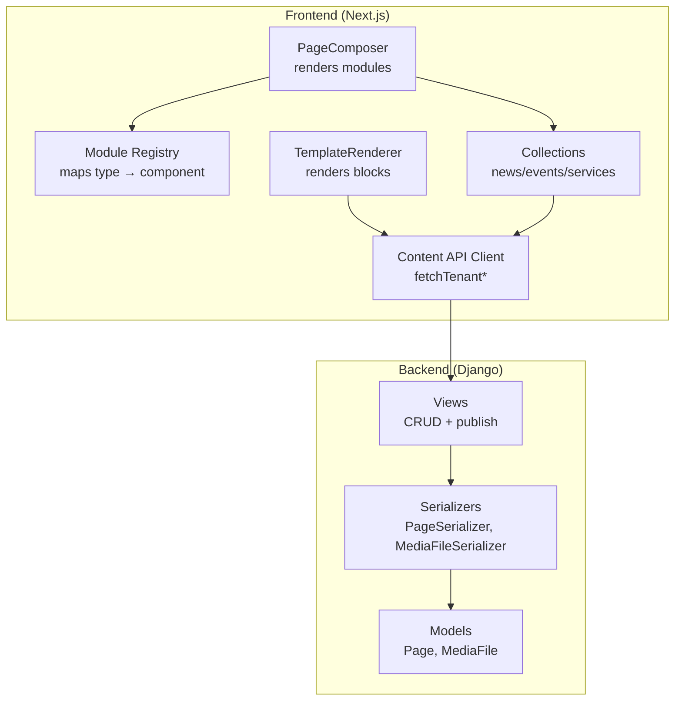
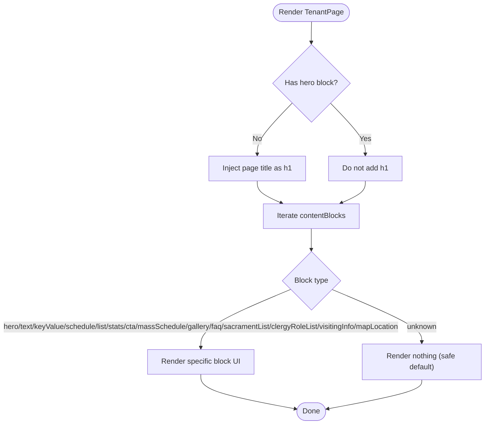
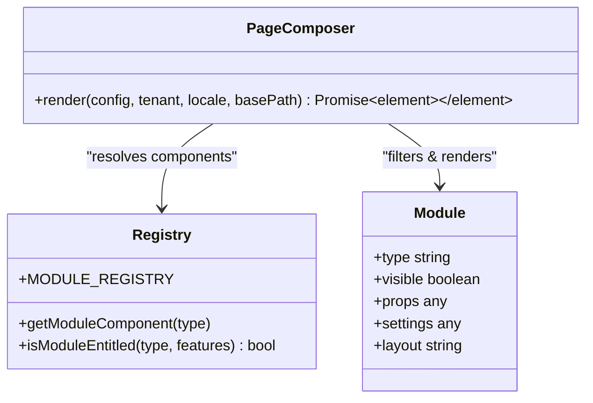
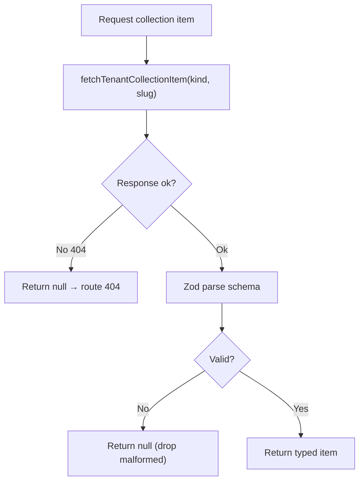
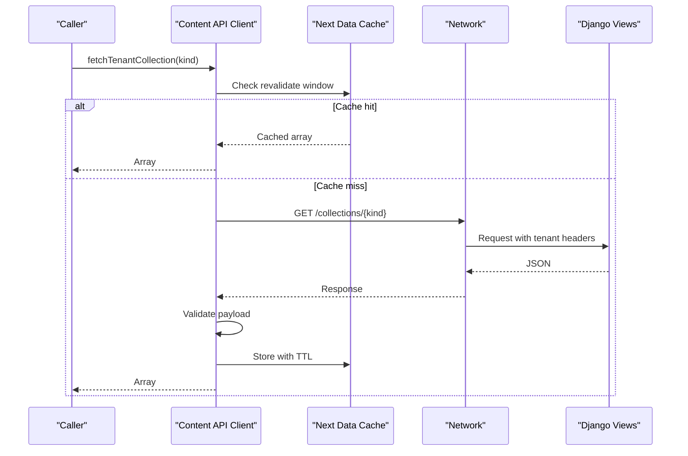
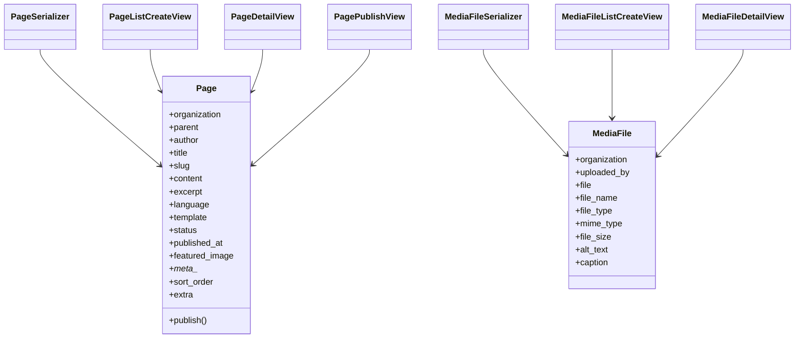
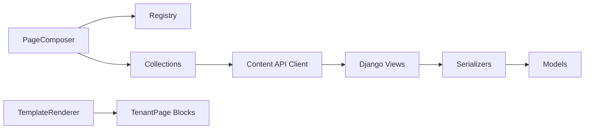

# Dynamic Content Injection & Rendering

<cite>
**Referenced Files in This Document**
- [content-api.ts](file://frontend/apps/template-renderer/src/lib/content-api.ts)
- [content-loader.ts](file://frontend/apps/template-renderer/src/lib/content-loader.ts)
- [TemplateRenderer.tsx](file://frontend/apps/template-renderer/src/components/TemplateRenderer.tsx)
- [page-composer.tsx](file://frontend/apps/template-renderer/src/lib/page-composer.tsx)
- [registry.ts](file://frontend/apps/template-renderer/src/modules/registry.ts)
- [collections.ts](file://frontend/apps/template-renderer/src/lib/collections.ts)
- [models.py](file://backend/django/apps/content/models.py)
- [views.py](file://backend/django/apps/content/views.py)
- [serializers.py](file://backend/django/apps/content/serializers.py)
</cite>

## Table of Contents
1. Introduction
2. Project Structure
3. Core Components
4. Architecture Overview
5. Detailed Component Analysis
6. Dependency Analysis
7. Performance Considerations
8. Troubleshooting Guide
9. Conclusion

## Introduction
This document explains how JOL-HUB injects and renders dynamic content into templates, including content blocks, collections, and modules. It covers the content API that supplies data to frontend components, real-time update strategies via caching and revalidation, and how CMS content integrates with static template structures to produce dynamic pages. It also documents validation, error handling, and fallback mechanisms for missing or invalid content.

## Project Structure
The rendering pipeline spans a server-side Next.js app and a Django backend:
- Frontend apps/template-renderer provides the page composition engine, module registry, block renderer, and collection loaders.
- Backend django/apps/content exposes models, serializers, and views for pages and media.



**Diagram sources**
- [page-composer.tsx:1-84](file://frontend/apps/template-renderer/src/lib/page-composer.tsx#L1-L84)
- [registry.ts:1-70](file://frontend/apps/template-renderer/src/modules/registry.ts#L1-L70)
- [TemplateRenderer.tsx:1-466](file://frontend/apps/template-renderer/src/components/TemplateRenderer.tsx#L1-L466)
- [collections.ts:1-250](file://frontend/apps/template-renderer/src/lib/collections.ts#L1-L250)
- [content-api.ts:1-218](file://frontend/apps/template-renderer/src/lib/content-api.ts#L1-L218)
- [models.py:1-202](file://backend/django/apps/content/models.py#L1-L202)
- [serializers.py:1-51](file://backend/django/apps/content/serializers.py#L1-L51)
- [views.py:1-84](file://backend/django/apps/content/views.py#L1-L84)

**Section sources**
- [page-composer.tsx:1-84](file://frontend/apps/template-renderer/src/lib/page-composer.tsx#L1-L84)
- [registry.ts:1-70](file://frontend/apps/template-renderer/src/modules/registry.ts#L1-L70)
- [TemplateRenderer.tsx:1-466](file://frontend/apps/template-renderer/src/components/TemplateRenderer.tsx#L1-L466)
- [collections.ts:1-250](file://frontend/apps/template-renderer/src/lib/collections.ts#L1-L250)
- [content-api.ts:1-218](file://frontend/apps/template-renderer/src/lib/content-api.ts#L1-L218)
- [models.py:1-202](file://backend/django/apps/content/models.py#L1-L202)
- [serializers.py:1-51](file://backend/django/apps/content/serializers.py#L1-L51)
- [views.py:1-84](file://backend/django/apps/content/views.py#L1-L84)

## Core Components
- PageComposer orchestrates modules defined by PageConfig, enforcing entitlements and layout containers.
- Module Registry maps module types to server components and feature gates.
- TemplateRenderer renders typed content blocks from TenantPage.contentBlocks.
- Collections layer fetches and validates news, events, and services.
- Content API client performs tenant-scoped requests to the backend with caching and error taxonomy.
- Backend provides Page and MediaFile models, serializers, and views for CRUD and publishing.

**Section sources**
- [page-composer.tsx:1-84](file://frontend/apps/template-renderer/src/lib/page-composer.tsx#L1-L84)
- [registry.ts:1-70](file://frontend/apps/template-renderer/src/modules/registry.ts#L1-L70)
- [TemplateRenderer.tsx:1-466](file://frontend/apps/template-renderer/src/components/TemplateRenderer.tsx#L1-L466)
- [collections.ts:1-250](file://frontend/apps/template-renderer/src/lib/collections.ts#L1-L250)
- [content-api.ts:1-218](file://frontend/apps/template-renderer/src/lib/content-api.ts#L1-L218)
- [models.py:1-202](file://backend/django/apps/content/models.py#L1-L202)
- [views.py:1-84](file://backend/django/apps/content/views.py#L1-L84)
- [serializers.py:1-51](file://backend/django/apps/content/serializers.py#L1-L51)

## Architecture Overview
End-to-end flow from request to rendered page:

```mermaid
sequenceDiagram
participant Browser as "Browser"
participant Next as "Next.js Server"
participant PC as "PageComposer"
participant MR as "Module Registry"
participant COL as "Collections"
participant API as "Content API Client"
participant DRF as "Django Views"
participant DB as "Database"
Browser->>Next : Request /[locale]/[tenant]/...
Next->>PC : Build PageConfig + tenant context
PC->>MR : Resolve module components
PC->>COL : Fetch collections (news/events/services)
COL->>API : fetchTenantCollection / fetchTenantCollectionItem
API->>DRF : GET /api/v1/tenants/{slug}/collections/{kind}
DRF->>DB : Query RLS-scoped data
DB-->>DRF : Items
DRF-->>API : JSON items
API-->>COL : Validated items
COL-->>PC : Parsed arrays
PC->>MR : Render active modules (entitled + visible)
Note over PC,MR : Modules may be async; awaited during RSC render
PC-->>Browser : HTML with injected content
```

**Diagram sources**
- [page-composer.tsx:1-84](file://frontend/apps/template-renderer/src/lib/page-composer.tsx#L1-L84)
- [registry.ts:1-70](file://frontend/apps/template-renderer/src/modules/registry.ts#L1-L70)
- [collections.ts:1-250](file://frontend/apps/template-renderer/src/lib/collections.ts#L1-L250)
- [content-api.ts:1-218](file://frontend/apps/template-renderer/src/lib/content-api.ts#L1-L218)
- [views.py:1-84](file://backend/django/apps/content/views.py#L1-L84)

## Detailed Component Analysis

### Block-based rendering with TemplateRenderer
- Renders a sequence of typed blocks from TenantPage.contentBlocks.
- Supports multiple block types (hero, text, keyValue, schedule, list, stats, cta, massSchedule, gallery, faq, sacramentList, clergyRoleList, visitingInfo, mapLocation).
- Enforces accessibility: single h1 per page when no hero heading is present; images include width/height and localized alt; details/summary used for FAQ without JS.
- Unknown block types are safely ignored to prevent leaking raw payloads.



**Diagram sources**
- [TemplateRenderer.tsx:1-466](file://frontend/apps/template-renderer/src/components/TemplateRenderer.tsx#L1-L466)

**Section sources**
- [TemplateRenderer.tsx:1-466](file://frontend/apps/template-renderer/src/components/TemplateRenderer.tsx#L1-L466)

### Modular content composition with PageComposer and Registry
- PageComposer filters modules by visibility and entitlement, then renders them in parallel using React’s RSC await semantics.
- Each module is wrapped in a consistent layout container based on its layout setting.
- Registry maps module types to server components and declares required features for commercial gating.



**Diagram sources**
- [page-composer.tsx:1-84](file://frontend/apps/template-renderer/src/lib/page-composer.tsx#L1-L84)
- [registry.ts:1-70](file://frontend/apps/template-renderer/src/modules/registry.ts#L1-L70)

**Section sources**
- [page-composer.tsx:1-84](file://frontend/apps/template-renderer/src/lib/page-composer.tsx#L1-L84)
- [registry.ts:1-70](file://frontend/apps/template-renderer/src/modules/registry.ts#L1-L70)

### Dynamic collections: News, Events, Services
- Collections are loaded via the content API client and validated with Zod schemas.
- getCollection returns parsed arrays; unknown slugs return null which routes render as 404.
- Utility helpers paginate, split events by time, build month grids, and group events by date.



**Diagram sources**
- [collections.ts:1-250](file://frontend/apps/template-renderer/src/lib/collections.ts#L1-L250)
- [content-api.ts:1-218](file://frontend/apps/template-renderer/src/lib/content-api.ts#L1-L218)

**Section sources**
- [collections.ts:1-250](file://frontend/apps/template-renderer/src/lib/collections.ts#L1-L250)
- [content-api.ts:1-218](file://frontend/apps/template-renderer/src/lib/content-api.ts#L1-L218)

### Content API client: fetching, caching, and errors
- Provides functions to fetch pages, blocks, and collections with tenant-scoped headers.
- Implements Next.js ISR revalidation windows per content type; news uses short cache, events/services use no-store for freshness.
- In-flight deduplication avoids duplicate network calls within a render pass.
- Error taxonomy maps HTTP status to typed errors for consistent UX handling.



**Diagram sources**
- [content-api.ts:1-218](file://frontend/apps/template-renderer/src/lib/content-api.ts#L1-L218)
- [views.py:1-84](file://backend/django/apps/content/views.py#L1-L84)

**Section sources**
- [content-api.ts:1-218](file://frontend/apps/template-renderer/src/lib/content-api.ts#L1-L218)

### Backend content models, serializers, and views
- Models define Pages and MediaFiles with organization scoping, language, template, status, and metadata.
- Serializers expose read/write fields and nested relationships.
- Views implement CRUD endpoints for pages and media, plus a publish action.



**Diagram sources**
- [models.py:1-202](file://backend/django/apps/content/models.py#L1-L202)
- [serializers.py:1-51](file://backend/django/apps/content/serializers.py#L1-L51)
- [views.py:1-84](file://backend/django/apps/content/views.py#L1-L84)

**Section sources**
- [models.py:1-202](file://backend/django/apps/content/models.py#L1-L202)
- [serializers.py:1-51](file://backend/django/apps/content/serializers.py#L1-L51)
- [views.py:1-84](file://backend/django/apps/content/views.py#L1-L84)

### Fixture-based loading and shared routes
- Fixture loader resolves tenants by slug and supports fallback to a default tenant for defensive rendering.
- Shared routes bypass tenant fixtures and render compliance-related pages consistently across tenants.

**Section sources**
- [content-loader.ts:1-44](file://frontend/apps/template-renderer/src/lib/content-loader.ts#L1-L44)

## Dependency Analysis
- PageComposer depends on the Module Registry to resolve components and on entitlement checks to gate features.
- Collections depend on the Content API client for tenant-scoped data retrieval and on Zod schemas for validation.
- TemplateRenderer depends on TenantPage structure and block types; it does not call the backend directly.
- Backend views depend on models and serializers; they enforce authentication and filtering.



**Diagram sources**
- [page-composer.tsx:1-84](file://frontend/apps/template-renderer/src/lib/page-composer.tsx#L1-L84)
- [registry.ts:1-70](file://frontend/apps/template-renderer/src/modules/registry.ts#L1-L70)
- [collections.ts:1-250](file://frontend/apps/template-renderer/src/lib/collections.ts#L1-L250)
- [content-api.ts:1-218](file://frontend/apps/template-renderer/src/lib/content-api.ts#L1-L218)
- [views.py:1-84](file://backend/django/apps/content/views.py#L1-L84)
- [serializers.py:1-51](file://backend/django/apps/content/serializers.py#L1-L51)
- [models.py:1-202](file://backend/django/apps/content/models.py#L1-L202)
- [TemplateRenderer.tsx:1-466](file://frontend/apps/template-renderer/src/components/TemplateRenderer.tsx#L1-L466)

**Section sources**
- [page-composer.tsx:1-84](file://frontend/apps/template-renderer/src/lib/page-composer.tsx#L1-L84)
- [registry.ts:1-70](file://frontend/apps/template-renderer/src/modules/registry.ts#L1-L70)
- [collections.ts:1-250](file://frontend/apps/template-renderer/src/lib/collections.ts#L1-L250)
- [content-api.ts:1-218](file://frontend/apps/template-renderer/src/lib/content-api.ts#L1-L218)
- [views.py:1-84](file://backend/django/apps/content/views.py#L1-L84)
- [serializers.py:1-51](file://backend/django/apps/content/serializers.py#L1-L51)
- [models.py:1-202](file://backend/django/apps/content/models.py#L1-L202)
- [TemplateRenderer.tsx:1-466](file://frontend/apps/template-renderer/src/components/TemplateRenderer.tsx#L1-L466)

## Performance Considerations
- ISR caching: Pages and blocks use revalidation windows; news uses shorter intervals; events/services use no-store to ensure fresh pricing and availability.
- In-flight deduplication: Concurrent identical requests share one network call to reduce load spikes.
- Parallel module rendering: PageComposer awaits all active modules concurrently to minimize total render time.
- Safe defaults: Unknown block types render nothing; malformed collection items are dropped to avoid expensive retries or broken layouts.

[No sources needed since this section provides general guidance]

## Troubleshooting Guide
- Missing content: If the backend is not configured, the content API client returns null; callers should render accessible empty states.
- Not found: 404 responses are mapped to typed errors; collection layers convert these to null so routes can show 404 pages.
- Forbidden: 403 responses indicate access denied; surface appropriate prompts or upgrade flows at the caller level.
- Server errors: 5xx responses are raised as typed errors; callers can retry or fall back gracefully.
- Validation failures: Zod parsing drops invalid items; inspect logs for dropped items and correct upstream payloads.
- Tenant isolation: Backend models validate tenant context on save to prevent cross-tenant mutations.

**Section sources**
- [content-api.ts:1-218](file://frontend/apps/template-renderer/src/lib/content-api.ts#L1-L218)
- [collections.ts:1-250](file://frontend/apps/template-renderer/src/lib/collections.ts#L1-L250)
- [models.py:1-202](file://backend/django/apps/content/models.py#L1-L202)

## Conclusion
JOL-HUB composes dynamic pages by combining static template structures with tenant-scoped content fetched through a robust content API. Blocks provide fine-grained content composition, while modules enable feature-gated, reusable sections. Collections deliver dynamic lists with strong validation and caching strategies. The system prioritizes safety, performance, and accessibility, with clear error handling and fallbacks to ensure reliable rendering even when backend services are unavailable or return unexpected data.