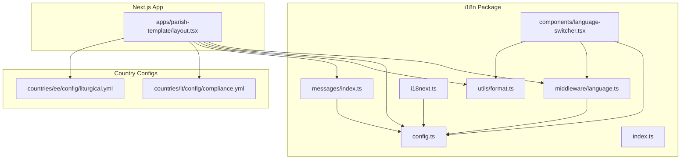
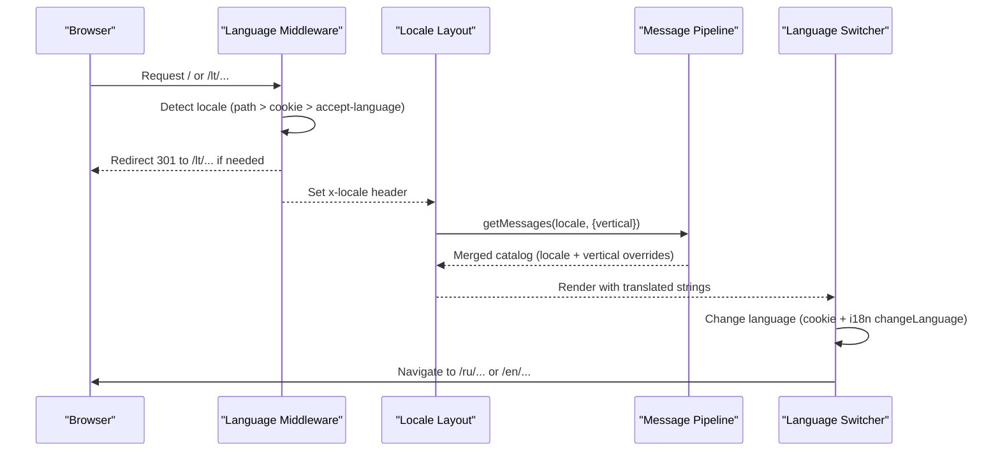
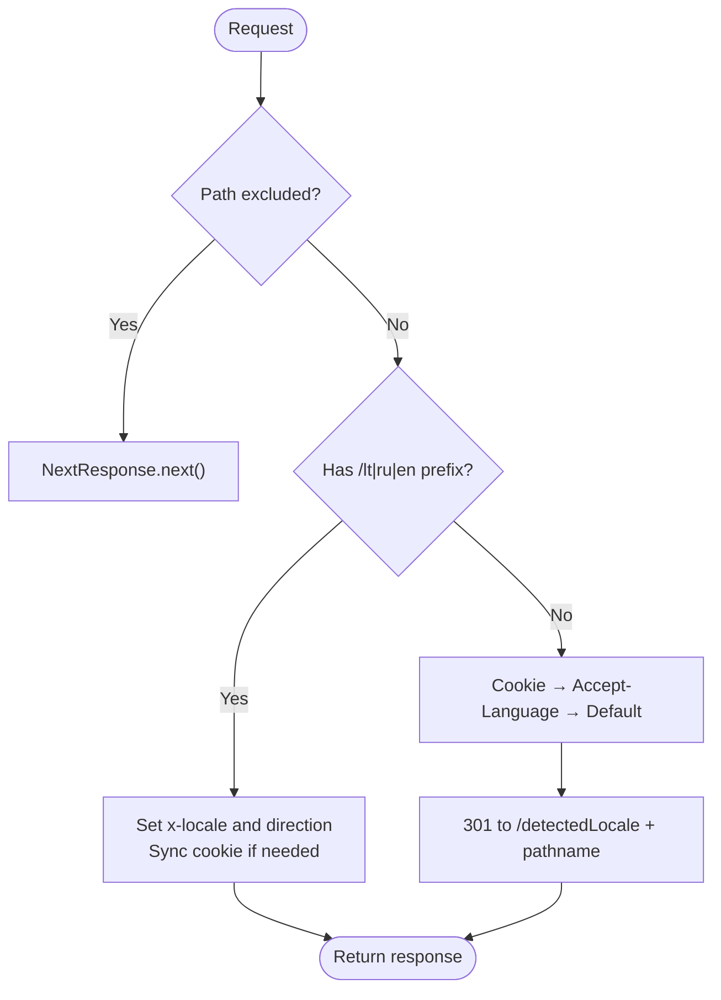
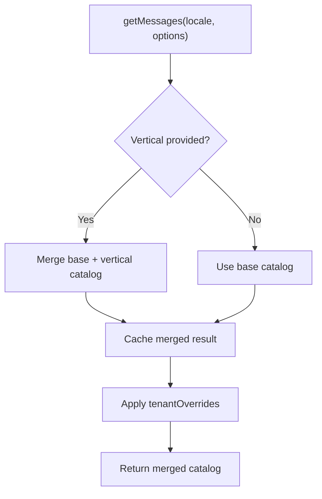
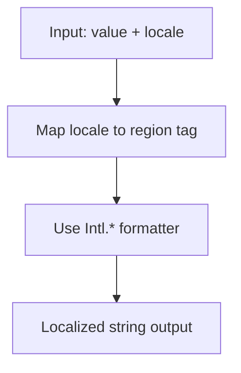
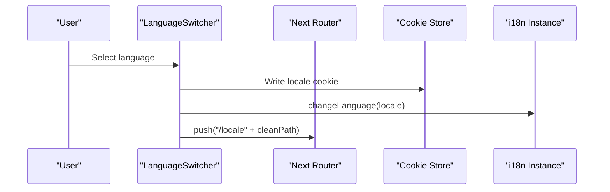
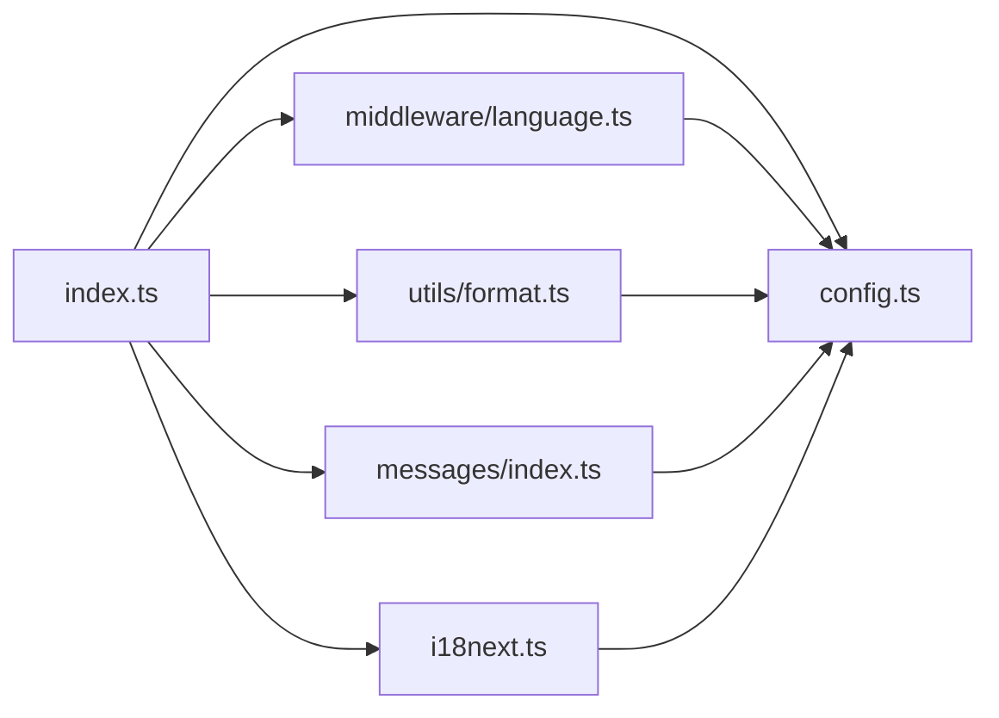

# Multi-Language & Internationalization

<cite>
**Referenced Files in This Document**
- [index.ts](file://frontend/packages/i18n/src/index.ts)
- [config.ts](file://frontend/packages/i18n/src/config.ts)
- [language.ts](file://frontend/packages/i18n/src/middleware/language.ts)
- [format.ts](file://frontend/packages/i18n/src/utils/format.ts)
- [i18next.ts](file://frontend/packages/i18n/src/i18next.ts)
- [messages/index.ts](file://frontend/packages/i18n/src/messages/index.ts)
- [language-switcher.tsx](file://frontend/packages/i18n/src/components/language-switcher.tsx)
- [layout.tsx](file://frontend/apps/parish-template/src/app/[locale]/layout.tsx)
- [compliance.yml](file://countries/lt/config/compliance.yml)
- [liturgical.yml](file://countries/ee/config/liturgical.yml)
</cite>

## Table of Contents
1. Introduction
2. Project Structure
3. Core Components
4. Architecture Overview
5. Detailed Component Analysis
6. Dependency Analysis
7. Performance Considerations
8. Troubleshooting Guide
9. Conclusion
10. Appendices

## Introduction
This document explains how JOL-HUB template rendering supports multiple languages and internationalization (i18n). It covers:
- Supported locales and routing strategy
- Locale detection, persistence, and dynamic switching
- Translation message structure and server-safe translation helpers
- Regional formatting for dates, times, numbers, and currencies
- Country-specific configuration that influences content presentation
- RTL readiness and accessibility considerations for international audiences

The system currently pilots three locales (Lithuanian, Russian, English) with a clear extension path to scale to many more locales while keeping changes data-driven.

## Project Structure
At the heart of i18n is a dedicated package that centralizes configuration, middleware, message loading, formatting utilities, and UI components. The package integrates with Next.js apps via middleware and layout-level metadata. Country-specific configurations live under a countries directory and influence compliance, liturgical calendars, and regional behavior.

**Diagram sources**
- [config.ts:1-109](file://frontend/packages/i18n/src/config.ts#L1-L109)
- [language.ts:1-285](file://frontend/packages/i18n/src/middleware/language.ts#L1-L285)
- [format.ts:1-109](file://frontend/packages/i18n/src/utils/format.ts#L1-L109)
- [i18next.ts:1-82](file://frontend/packages/i18n/src/i18next.ts#L1-L82)
- [messages/index.ts:107-132](file://frontend/packages/i18n/src/messages/index.ts#L107-L132)
- [language-switcher.tsx:1-376](file://frontend/packages/i18n/src/components/language-switcher.tsx#L1-L376)
- [layout.tsx:44-91](file://frontend/apps/parish-template/src/app/[locale]/layout.tsx#L44-L91)
- [compliance.yml:1-201](file://countries/lt/config/compliance.yml#L1-L201)
- [liturgical.yml:1-178](file://countries/ee/config/liturgical.yml#L1-L178)

**Section sources**
- [index.ts:1-152](file://frontend/packages/i18n/src/index.ts#L1-L152)
- [config.ts:1-109](file://frontend/packages/i18n/src/config.ts#L1-L109)
- [language.ts:1-285](file://frontend/packages/i18n/src/middleware/language.ts#L1-L285)
- [format.ts:1-109](file://frontend/packages/i18n/src/utils/format.ts#L1-L109)
- [i18next.ts:1-82](file://frontend/packages/i18n/src/i18next.ts#L1-L82)
- [messages/index.ts:107-132](file://frontend/packages/i18n/src/messages/index.ts#L107-L132)
- [language-switcher.tsx:1-376](file://frontend/packages/i18n/src/components/language-switcher.tsx#L1-L376)
- [layout.tsx:44-91](file://frontend/apps/parish-template/src/app/[locale]/layout.tsx#L44-L91)
- [compliance.yml:1-201](file://countries/lt/config/compliance.yml#L1-L201)
- [liturgical.yml:1-178](file://countries/ee/config/liturgical.yml#L1-L178)

## Core Components
- Configuration and constants: locale codes, prefixes, hreflang tags, cookie names, fallback order, and path helpers.
- Middleware: edge-compatible language detection and redirect logic; sets headers and cookies; prepares RTL direction.
- Message pipeline: server-safe message merging by locale and vertical, plus plain translate helper without ICU interpolation.
- Formatting utilities: date/time, number, currency, relative time, and text direction helpers using Intl APIs.
- Client runtime: legacy i18next initialization and hooks for client-only contexts.
- Language switcher UI: accessible dropdown/inline component with flags, native names, cookie persistence, and route updates.
- App integration: Next.js layout sets alternates, content-language, and og:locale based on resolved locale.

**Section sources**
- [config.ts:1-109](file://frontend/packages/i18n/src/config.ts#L1-L109)
- [language.ts:1-285](file://frontend/packages/i18n/src/middleware/language.ts#L1-L285)
- [messages/index.ts:107-132](file://frontend/packages/i18n/src/messages/index.ts#L107-L132)
- [format.ts:1-109](file://frontend/packages/i18n/src/utils/format.ts#L1-L109)
- [i18next.ts:1-82](file://frontend/packages/i18n/src/i18next.ts#L1-L82)
- [language-switcher.tsx:1-376](file://frontend/packages/i18n/src/components/language-switcher.tsx#L1-L376)
- [layout.tsx:44-91](file://frontend/apps/parish-template/src/app/[locale]/layout.tsx#L44-L91)

## Architecture Overview
The i18n architecture separates concerns into pure configuration, edge middleware, server-safe message resolution, and client runtime. The middleware resolves the best locale from URL path, cookie, or browser header, then redirects when necessary and sets response headers and cookies. Server components use the message pipeline to fetch merged catalogs per locale and vertical. Client components render localized UI and handle dynamic switching.

**Diagram sources**
- [language.ts:113-249](file://frontend/packages/i18n/src/middleware/language.ts#L113-L249)
- [messages/index.ts:107-132](file://frontend/packages/i18n/src/messages/index.ts#L107-L132)
- [layout.tsx:44-91](file://frontend/apps/parish-template/src/app/[locale]/layout.tsx#L44-L91)
- [language-switcher.tsx:185-205](file://frontend/packages/i18n/src/components/language-switcher.tsx#L185-L205)

## Detailed Component Analysis

### Locale Detection and Routing (Middleware)
- Detection priority: URL path prefix (/lt/, /ru/, /en/), cookie, Accept-Language header, default locale.
- Behavior: root paths redirect to default locale; known prefixes pass through; unknown paths keep request but set locale headers.
- Exclusions: static assets, API routes, and other non-content paths are skipped.
- Cookies: persistent preference stored with long expiry; domain and secure flags applied in production.
- Headers: x-locale and x-locale-direction set for downstream consumers.
- RTL readiness: placeholder list for future RTL locales; direction helper returns LTR for current locales.

**Diagram sources**
- [language.ts:135-249](file://frontend/packages/i18n/src/middleware/language.ts#L135-L249)

**Section sources**
- [language.ts:1-285](file://frontend/packages/i18n/src/middleware/language.ts#L1-L285)

### Message Catalogs and Translation Helpers
- Merging strategy: base catalog per locale can be extended by vertical-specific catalogs; tenant overrides can be layered at runtime.
- Server-safe lookup: plain translate function returns a string value or fallback key without ICU interpolation.
- Values type: supports strings, numbers, booleans, and Date for interpolation where used elsewhere.
- Vertical mapping: helper to map tenant verticals to override catalogs.

**Diagram sources**
- [messages/index.ts:107-132](file://frontend/packages/i18n/src/messages/index.ts#L107-L132)

**Section sources**
- [messages/index.ts:107-132](file://frontend/packages/i18n/src/messages/index.ts#L107-L132)

### Formatting Utilities (Dates, Times, Numbers, Currency)
- Dates/times: uses Intl.DateTimeFormat with locale-mapped region tags (e.g., lt-LT, ru-RU, en-US).
- Numbers/currency: uses Intl.NumberFormat with optional currency code; defaults to EUR.
- Relative time: uses Intl.RelativeTimeFormat for human-friendly expressions.
- Direction: all supported locales are LTR; helper returns 'ltr'.

**Diagram sources**
- [format.ts:1-109](file://frontend/packages/i18n/src/utils/format.ts#L1-L109)

**Section sources**
- [format.ts:1-109](file://frontend/packages/i18n/src/utils/format.ts#L1-L109)

### Client Runtime and Legacy i18next
- Initialization: client-only setup with language detector, supported locales, namespaces, and cookie/localStorage caching.
- Current locale getter and setter: safe wrappers around i18n instance.
- Note: new STEP 4 code prefers provider/hooks; this module remains for compatibility.

**Section sources**
- [i18next.ts:1-82](file://frontend/packages/i18n/src/i18next.ts#L1-L82)

### Language Switcher UI
- Variants: inline buttons or dropdown menu; both support flags and native names.
- Persistence: writes a long-lived cookie for user preference.
- Navigation: updates i18n state and navigates to the same path under the selected locale.
- Accessibility: keyboard navigation, ARIA roles, labels, and focus management.

**Diagram sources**
- [language-switcher.tsx:185-205](file://frontend/packages/i18n/src/components/language-switcher.tsx#L185-L205)
- [language-switcher.tsx:207-329](file://frontend/packages/i18n/src/components/language-switcher.tsx#L207-L329)

**Section sources**
- [language-switcher.tsx:1-376](file://frontend/packages/i18n/src/components/language-switcher.tsx#L1-L376)

### App Integration and SEO Metadata
- Alternates: declares language alternates for each supported locale and an x-default.
- Content attributes: sets content-language and og:locale based on resolved locale.
- Static params: pre-renders pages for each supported locale segment.

**Section sources**
- [layout.tsx:44-91](file://frontend/apps/parish-template/src/app/[locale]/layout.tsx#L44-L91)

## Dependency Analysis
- The package barrel re-exports configuration, messages, formatting, and middleware so consumers import from a single surface.
- Middleware depends on config constants and types; it also exposes matcher patterns for Next.js.
- Formatting utilities depend on locale-to-region mapping; they do not depend on i18next.
- Messages module depends on locale and vertical catalogs; it provides server-safe translation helpers.
- Client runtime depends on i18next and language detector; it is isolated behind a client boundary.

**Diagram sources**
- [index.ts:1-152](file://frontend/packages/i18n/src/index.ts#L1-L152)
- [config.ts:1-109](file://frontend/packages/i18n/src/config.ts#L1-L109)
- [language.ts:1-285](file://frontend/packages/i18n/src/middleware/language.ts#L1-L285)
- [format.ts:1-109](file://frontend/packages/i18n/src/utils/format.ts#L1-L109)
- [messages/index.ts:107-132](file://frontend/packages/i18n/src/messages/index.ts#L107-L132)
- [i18next.ts:1-82](file://frontend/packages/i18n/src/i18next.ts#L1-L82)

**Section sources**
- [index.ts:1-152](file://frontend/packages/i18n/src/index.ts#L1-L152)

## Performance Considerations
- Edge middleware runs early and avoids heavy work; it only detects locale and sets headers/cookies.
- Message merging is cached per locale and vertical to reduce recomputation.
- Formatting uses native Intl APIs, which are efficient and platform-optimized.
- Client runtime initializes once and caches language preferences in cookies and local storage.

[No sources needed since this section provides general guidance]

## Troubleshooting Guide
- Unknown locale path: ensure the path matches supported prefixes; otherwise, middleware will detect from cookie/browser and redirect accordingly.
- Missing translations: verify that the requested locale has corresponding message files and that vertical overrides exist if applicable.
- Incorrect formatting: confirm the locale-to-region mapping includes the target locale; add entries if extending to new regions.
- Cookie not persisting: check SameSite and Secure settings in production; ensure the domain matches your deployment.
- SEO metadata mismatch: verify that layout alternates and og:locale reflect the resolved locale.

**Section sources**
- [language.ts:113-249](file://frontend/packages/i18n/src/middleware/language.ts#L113-L249)
- [messages/index.ts:107-132](file://frontend/packages/i18n/src/messages/index.ts#L107-L132)
- [format.ts:97-109](file://frontend/packages/i18n/src/utils/format.ts#L97-L109)
- [layout.tsx:44-91](file://frontend/apps/parish-template/src/app/[locale]/layout.tsx#L44-L91)

## Conclusion
JOL-HUB’s i18n system provides a robust, scalable foundation for multi-language template rendering. It combines edge-safe locale detection, server-safe message resolution, consistent regional formatting, and accessible UI controls. Country-specific configurations further tailor compliance and cultural content. The design keeps adding new locales and regions as data changes rather than code redesigns, enabling smooth expansion to many languages while maintaining performance and accessibility.

[No sources needed since this section summarizes without analyzing specific files]

## Appendices

### Supported Locales and Routing Strategy
- Pilot locales: Lithuanian (lt), Russian (ru), English (en).
- URL strategy: locale-prefixed paths (/lt/, /ru/, /en/) with root redirect to default.
- Fallback chain: unsupported requests resolve to a supported locale using a defined order.

**Section sources**
- [config.ts:26-77](file://frontend/packages/i18n/src/config.ts#L26-L77)
- [language.ts:28-31](file://frontend/packages/i18n/src/middleware/language.ts#L28-L31)

### Translation File Structure
- Namespaces: common, liturgical, gdpr.
- Per-locale directories contain JSON files for each namespace.
- Vertical overrides allow per-vertical localization layers.

**Section sources**
- [i18next.ts:13-28](file://frontend/packages/i18n/src/i18next.ts#L13-L28)
- [messages/index.ts:107-132](file://frontend/packages/i18n/src/messages/index.ts#L107-L132)

### Dynamic Language Switching
- Persisted via cookie with long expiry.
- Updates i18n state and navigates to the same path under the selected locale.
- Accessible UI with keyboard navigation and ARIA attributes.

**Section sources**
- [language-switcher.tsx:85-100](file://frontend/packages/i18n/src/components/language-switcher.tsx#L85-L100)
- [language-switcher.tsx:185-205](file://frontend/packages/i18n/src/components/language-switcher.tsx#L185-L205)
- [language-switcher.tsx:207-329](file://frontend/packages/i18n/src/components/language-switcher.tsx#L207-L329)

### Regional Formatting Examples
- Dates: month name and day numeric format per locale.
- Times: 2-digit hour and minute.
- Numbers: locale-aware grouping and separators.
- Currency: style currency with specified currency code (default EUR).
- Relative time: human-friendly phrasing per locale.

**Section sources**
- [format.ts:6-87](file://frontend/packages/i18n/src/utils/format.ts#L6-L87)

### Country-Specific Configuration Effects
- Compliance: country-specific rules such as consent ages, retention periods, and legal references influence content and flows.
- Liturgical calendar: country-specific feast days, seasons, and jurisdictions affect displayed dates and names.

**Section sources**
- [compliance.yml:1-201](file://countries/lt/config/compliance.yml#L1-L201)
- [liturgical.yml:1-178](file://countries/ee/config/liturgical.yml#L1-L178)

### RTL Support and Accessibility
- RTL readiness: middleware and formatting include placeholders and helpers for future RTL locales; current locales are LTR.
- Accessibility: language switcher implements keyboard navigation, ARIA roles, and descriptive labels for international users.

**Section sources**
- [language.ts:48-49](file://frontend/packages/i18n/src/middleware/language.ts#L48-L49)
- [language.ts:141-166](file://frontend/packages/i18n/src/middleware/language.ts#L141-L166)
- [format.ts:90-95](file://frontend/packages/i18n/src/utils/format.ts#L90-L95)
- [language-switcher.tsx:141-183](file://frontend/packages/i18n/src/components/language-switcher.tsx#L141-L183)