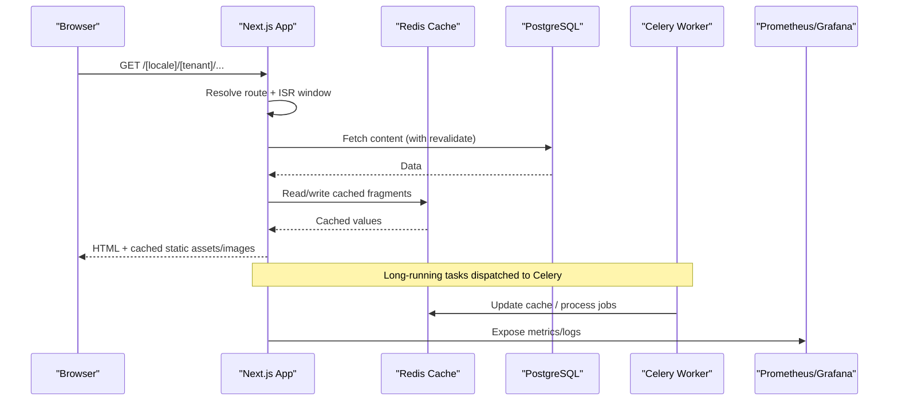
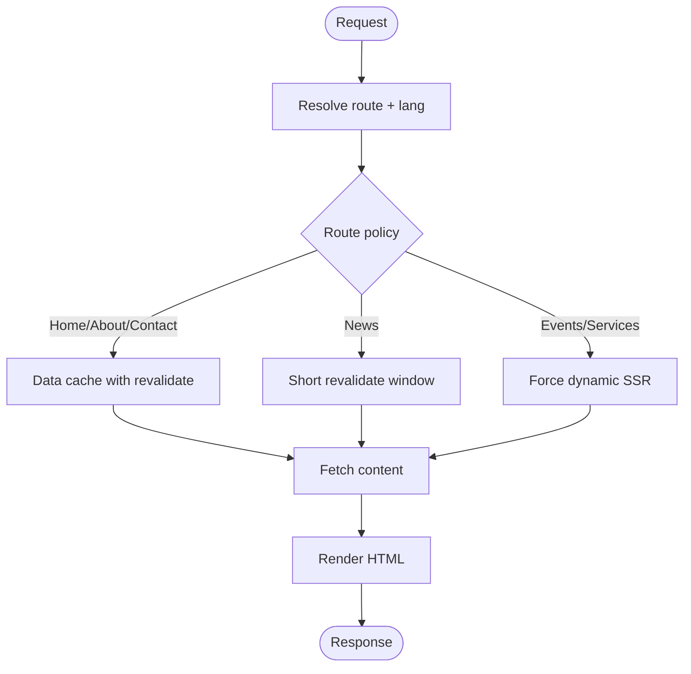
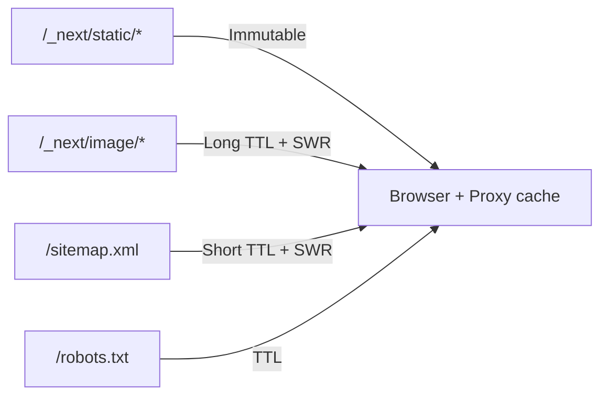
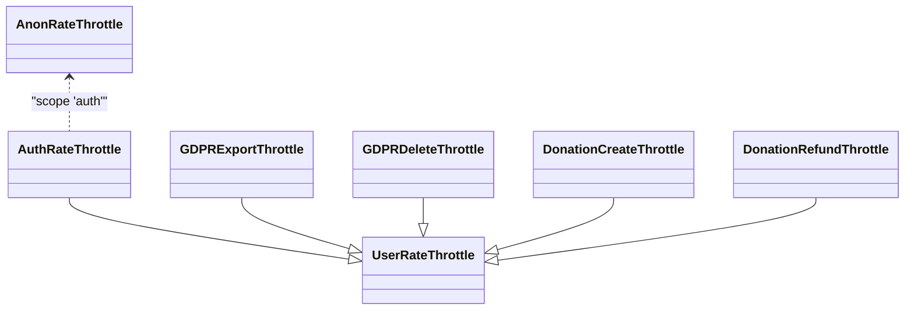
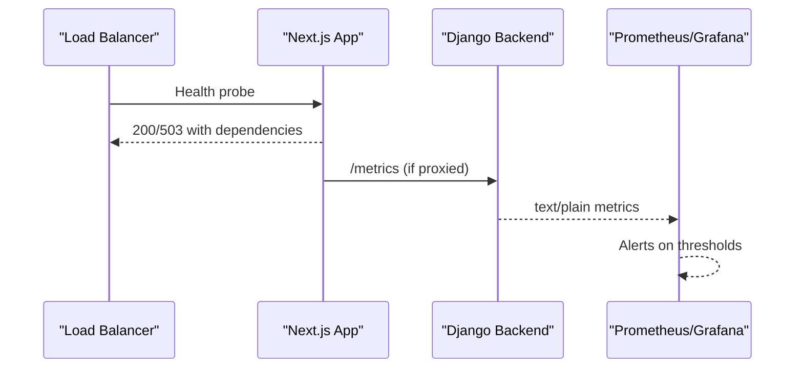
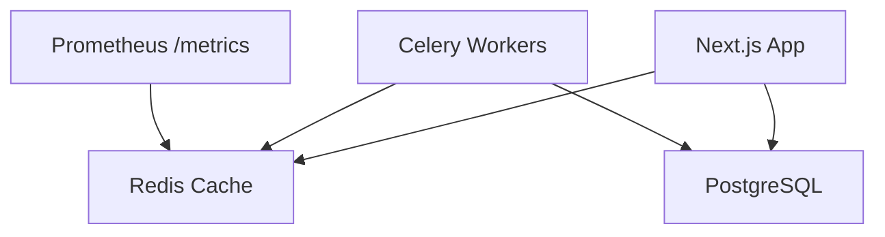

# Performance Optimization & Caching

<cite>
**Referenced Files in This Document**
- [PERFORMANCE.md](file://frontend/apps/template-renderer/PERFORMANCE.md)
- [RENDERING.md](file://frontend/apps/template-renderer/RENDERING.md)
- [next.config.js](file://frontend/apps/template-renderer/next.config.js)
- [base.py](file://backend/django/core/settings/base.py)
- [throttling.py](file://backend/django/apps/core/throttling.py)
- [metrics_endpoint.py](file://backend/django/apps/core/metrics_endpoint.py)
- [OBSERVABILITY.md](file://frontend/apps/template-renderer/OBSERVABILITY.md)
</cite>

## Table of Contents
1. Introduction
2. Project Structure
3. Core Components
4. Architecture Overview
5. Detailed Component Analysis
6. Dependency Analysis
7. Performance Considerations
8. Troubleshooting Guide
9. Conclusion

## Introduction
This document explains performance optimization and caching strategies for JOL-HUB template rendering, focusing on CDN and browser caching, server-side caching, database query optimization, rate limiting, request throttling, resource loading optimization, monitoring, error tracking, debugging, scalability across thousands of concurrent requests, memory management, connection pooling, and background job processing. It synthesizes the Next.js template renderer configuration and documentation with Django backend settings for caching, rate limiting, observability, and background tasks.

## Project Structure
The performance strategy spans two planes:
- Template Renderer (Next.js): Rendering strategy, ISR windows, image/font handling, bundle budgets, HTTP headers, RUM ingestion, and health endpoints.
- Backend (Django): Redis-backed cache, DRF rate limiting, Celery background jobs, Prometheus metrics endpoint, logging, and database connection tuning.

```mermaid
graph TB
subgraph "Template Renderer"
A["Next.js App<br/>ISR/SSR per route"]
B["Headers & Caching<br/>/_next/static, /_next/image"]
C["Images & Fonts<br/>AVIF/WebP, system-first stacks"]
D["RUM Ingress<br/>/api/perf"]
end
subgraph "Backend"
E["Redis Cache<br/>django-redis"]
F["DRF Throttling<br/>per-scope limits"]
G["Celery Workers<br/>background jobs"]
H["Prometheus /metrics"]
I["PostgreSQL<br/>connection pool"]
end
A --> B
A --> C
A --> D
D --> E
A --> I
E < --> I
F --> E
G --> E
H --> E
```

**Diagram sources**
- [next.config.js:23-74](file://frontend/apps/template-renderer/next.config.js#L23-L74)
- [base.py:392-410](file://backend/django/core/settings/base.py#L392-L410)
- [base.py:357-386](file://backend/django/core/settings/base.py#L357-L386)
- [metrics_endpoint.py:68-154](file://backend/django/apps/core/metrics_endpoint.py#L68-L154)

**Section sources**
- [PERFORMANCE.md:1-203](file://frontend/apps/template-renderer/PERFORMANCE.md#L1-L203)
- [RENDERING.md:1-117](file://frontend/apps/template-renderer/RENDERING.md#L1-L117)
- [next.config.js:1-86](file://frontend/apps/template-renderer/next.config.js#L1-L86)
- [base.py:169-186](file://backend/django/core/settings/base.py#L169-L186)
- [base.py:357-416](file://backend/django/core/settings/base.py#L357-L416)
- [metrics_endpoint.py:1-154](file://backend/django/apps/core/metrics_endpoint.py#L1-L154)
- [OBSERVABILITY.md:1-112](file://frontend/apps/template-renderer/OBSERVABILITY.md#L1-L112)

## Core Components
- Rendering strategy and data caching: Per-route ISR/SSR with revalidate windows; content fetch caching via Next.js fetch options.
- Browser and proxy caching: Immutable hashed static assets, long-lived images, short-lived SEO surfaces.
- Backend cache: Redis-backed cache with compression, timeouts, and key prefixing.
- Rate limiting and throttling: DRF scopes for auth, GDPR export/delete, donations; custom throttle classes.
- Background jobs: Celery broker/backend via Redis with scheduled tasks.
- Observability: Prometheus metrics endpoint, structured logs, alert rules, health checks.

**Section sources**
- [RENDERING.md:20-49](file://frontend/apps/template-renderer/RENDERING.md#L20-L49)
- [next.config.js:23-74](file://frontend/apps/template-renderer/next.config.js#L23-L74)
- [base.py:392-416](file://backend/django/core/settings/base.py#L392-L416)
- [base.py:307-327](file://backend/django/core/settings/base.py#L307-L327)
- [throttling.py:1-77](file://backend/django/apps/core/throttling.py#L1-L77)
- [base.py:357-386](file://backend/django/core/settings/base.py#L357-L386)
- [metrics_endpoint.py:68-154](file://backend/django/apps/core/metrics_endpoint.py#L68-L154)

## Architecture Overview
End-to-end flow for a tenant page request:
- Request arrives at the Next.js app; middleware sets locale and resolves tenant context.
- Route decides SSR vs ISR based on route config; data is fetched with revalidate windows.
- Static assets and images are served with immutable or long-lived cache headers.
- Backend calls use Redis cache where applicable; DRF throttles sensitive endpoints.
- Background jobs run via Celery using Redis as broker/backend.
- Metrics and logs are exposed and collected for monitoring and alerting.



**Diagram sources**
- [RENDERING.md:20-49](file://frontend/apps/template-renderer/RENDERING.md#L20-L49)
- [next.config.js:23-74](file://frontend/apps/template-renderer/next.config.js#L23-L74)
- [base.py:392-416](file://backend/django/core/settings/base.py#L392-L416)
- [base.py:357-386](file://backend/django/core/settings/base.py#L357-L386)
- [metrics_endpoint.py:68-154](file://backend/django/apps/core/metrics_endpoint.py#L68-L154)

## Detailed Component Analysis

### Rendering Strategy and Data Caching
- Every tenant route is server-rendered due to dynamic lang header usage; however, per-route `revalidate` windows apply at the data cache layer so repeated hits reuse fresh-enough content.
- Route-specific strategies:
  - Home: ISR with longer staleness.
  - About/Contact: SSG-like with revalidation.
  - News: Short revalidate windows for lists and details.
  - Events/Services: Force-dynamic SSR for freshness.
- Content fetches honor these windows; events/services explicitly avoid store caching to ensure live state.



**Diagram sources**
- [RENDERING.md:20-49](file://frontend/apps/template-renderer/RENDERING.md#L20-L49)

**Section sources**
- [RENDERING.md:6-32](file://frontend/apps/template-renderer/RENDERING.md#L6-L32)
- [RENDERING.md:33-49](file://frontend/apps/template-renderer/RENDERING.md#L33-L49)

### Browser and Proxy Caching
- Static assets: Immutable, long-lived cache for hashed files.
- Images: Long TTL with stale-while-revalidate to reduce load while keeping freshness.
- SEO surfaces: Short TTL with SWR to balance freshness and load.
- Compression enabled at Next layer; nginx/proxy handles brotli/gzip and HTTP/2/3.



**Diagram sources**
- [next.config.js:48-74](file://frontend/apps/template-renderer/next.config.js#L48-L74)
- [PERFORMANCE.md:118-142](file://frontend/apps/template-renderer/PERFORMANCE.md#L118-L142)

**Section sources**
- [next.config.js:23-74](file://frontend/apps/template-renderer/next.config.js#L23-L74)
- [PERFORMANCE.md:118-142](file://frontend/apps/template-renderer/PERFORMANCE.md#L118-L142)

### Image and Font Optimization
- Images: AVIF/WebP formats, responsive srcset, lazy loading, explicit dimensions to prevent layout shift, minimum cache TTL for immutable URLs.
- Fonts: System-first font stacks to eliminate webfont requests in pilot; future plans include subsetted variable fonts with preload and swap.

**Section sources**
- [PERFORMANCE.md:83-108](file://frontend/apps/template-renderer/PERFORMANCE.md#L83-L108)
- [next.config.js:29-37](file://frontend/apps/template-renderer/next.config.js#L29-L37)

### Backend Caching and Database Query Optimization
- Redis cache: Centralized with compression, timeouts, key prefixing, and connection pool tuning.
- Cache timeouts: Short/medium/long/very-long constants for consistent TTLs across services.
- Database: PostgreSQL with connection max age and health checks; MongoDB configured with pool sizes and timeouts for high-volume writes.
- Best practices: Use cache for frequent reads, set appropriate TTLs, prefer read replicas if needed, and index queries to minimize latency.

**Section sources**
- [base.py:392-416](file://backend/django/core/settings/base.py#L392-L416)
- [base.py:169-186](file://backend/django/core/settings/base.py#L169-L186)
- [base.py:699-722](file://backend/django/core/settings/base.py#L699-L722)

### Rate Limiting and Request Throttling
- DRF default throttles: Anonymous and user-based rates; stricter scopes for auth, GDPR export/delete, donation creation/refund.
- Custom throttle classes: Explicit scopes for security and compliance.
- Enforcement: Applied at API layer to protect sensitive operations and prevent abuse.



**Diagram sources**
- [throttling.py:15-77](file://backend/django/apps/core/throttling.py#L15-L77)
- [base.py:307-327](file://backend/django/core/settings/base.py#L307-L327)

**Section sources**
- [base.py:307-327](file://backend/django/core/settings/base.py#L307-L327)
- [throttling.py:1-77](file://backend/django/apps/core/throttling.py#L1-L77)

### Background Job Processing
- Celery: Broker and result backend via Redis; JSON serialization; time limits; concurrency and prefetch multiplier tuned.
- Scheduled tasks: Daily digest, session cleanup, recurring donations.
- Integration: Jobs can update caches and perform heavy work off the request path.

**Section sources**
- [base.py:357-386](file://backend/django/core/settings/base.py#L357-L386)

### Monitoring, Error Tracking, and Debugging
- Prometheus metrics endpoint: IP allowlist and optional bearer token; supports multi-process collectors.
- Structured logs: JSON-lines with requestId correlation; retention policies enforced by Loki/Promtail.
- Health checks: Liveness/readiness with dependency status; probes capped to avoid overload.
- Alerting: Rules for error rates, 5xx spikes, auth down, conversion drops, booking failures, CWV thresholds, bundle budget breaches.
- RUM: Web Vitals reported after consent to backend ingress; no PII in payloads.



**Diagram sources**
- [metrics_endpoint.py:68-154](file://backend/django/apps/core/metrics_endpoint.py#L68-L154)
- [OBSERVABILITY.md:62-79](file://frontend/apps/template-renderer/OBSERVABILITY.md#L62-L79)

**Section sources**
- [metrics_endpoint.py:1-154](file://backend/django/apps/core/metrics_endpoint.py#L1-L154)
- [OBSERVABILITY.md:1-112](file://frontend/apps/template-renderer/OBSERVABILITY.md#L1-L112)

### Scalability Considerations
- Multi-tenant rendering: Each request resolves tenant and language dynamically; ISR windows reduce backend load.
- Horizontal scaling: Stateless Next.js instances behind reverse proxy; Redis shared cache; Celery workers scaled independently.
- Connection pooling: DB and Redis pools tuned to handle thousands of concurrent tenants without exhausting resources.
- Resource isolation: Strict budgets and code splitting keep per-request CPU and memory low.

**Section sources**
- [RENDERING.md:6-32](file://frontend/apps/template-renderer/RENDERING.md#L6-L32)
- [base.py:392-416](file://backend/django/core/settings/base.py#L392-L416)
- [base.py:169-186](file://backend/django/core/settings/base.py#L169-L186)
- [PERFORMANCE.md:1-203](file://frontend/apps/template-renderer/PERFORMANCE.md#L1-L203)

## Dependency Analysis
Key runtime dependencies impacting performance:
- Next.js App Router and ISR/SSR controls drive render cost and cache behavior.
- Redis cache reduces DB pressure and accelerates repeated reads.
- Celery decouples heavy work from request paths.
- Prometheus metrics enable capacity planning and alerting.



**Diagram sources**
- [next.config.js:23-74](file://frontend/apps/template-renderer/next.config.js#L23-L74)
- [base.py:392-416](file://backend/django/core/settings/base.py#L392-L416)
- [base.py:357-386](file://backend/django/core/settings/base.py#L357-L386)
- [metrics_endpoint.py:68-154](file://backend/django/apps/core/metrics_endpoint.py#L68-L154)

**Section sources**
- [base.py:392-416](file://backend/django/core/settings/base.py#L392-L416)
- [base.py:357-386](file://backend/django/core/settings/base.py#L357-L386)
- [metrics_endpoint.py:68-154](file://backend/django/apps/core/metrics_endpoint.py#L68-L154)

## Performance Considerations
- Bundle budgets: Enforced offline and via Lighthouse CI; analyze builds when gates fail.
- Code splitting: Route-level and package-level optimizations to minimize first-load JS.
- Third-party scripts: Minimized and consent-gated; no global scripts in head.
- Mobile and accessibility: Touch targets, reduced motion, input types, and zero CLS strategies.
- Compliance-aware performance: Availability and privacy constraints shape caching and telemetry.

**Section sources**
- [PERFORMANCE.md:20-82](file://frontend/apps/template-renderer/PERFORMANCE.md#L20-L82)
- [PERFORMANCE.md:109-173](file://frontend/apps/template-renderer/PERFORMANCE.md#L109-L173)
- [PERFORMANCE.md:174-203](file://frontend/apps/template-renderer/PERFORMANCE.md#L174-L203)

## Troubleshooting Guide
- Budget breaches: Use bundle analyzer to bisect offending imports; revert changes that exceed limits.
- High error rates or 5xx spikes: Check Prometheus alerts and Loki logs; correlate via requestId.
- Slow pages: Inspect Web Vitals RUM and Lighthouse reports; validate ISR windows and cache headers.
- Rate limit issues: Review DRF scopes and custom throttle classes; adjust limits if necessary.
- Cache misses: Validate Redis connectivity and TTLs; ensure keys are scoped correctly.

**Section sources**
- [PERFORMANCE.md:42-63](file://frontend/apps/template-renderer/PERFORMANCE.md#L42-L63)
- [OBSERVABILITY.md:70-112](file://frontend/apps/template-renderer/OBSERVABILITY.md#L70-L112)
- [base.py:307-327](file://backend/django/core/settings/base.py#L307-L327)
- [base.py:392-416](file://backend/django/core/settings/base.py#L392-L416)

## Conclusion
JOL-HUB’s template rendering combines per-route ISR/SSR, strict bundle budgets, aggressive browser/proxy caching, and a robust backend cache to deliver fast, scalable experiences across thousands of tenant sites. DRF rate limiting protects sensitive endpoints, Celery offloads heavy work, and Prometheus/Loki provide visibility and alerting. Together, these layers ensure performance, reliability, and compliance under modest hardware constraints.