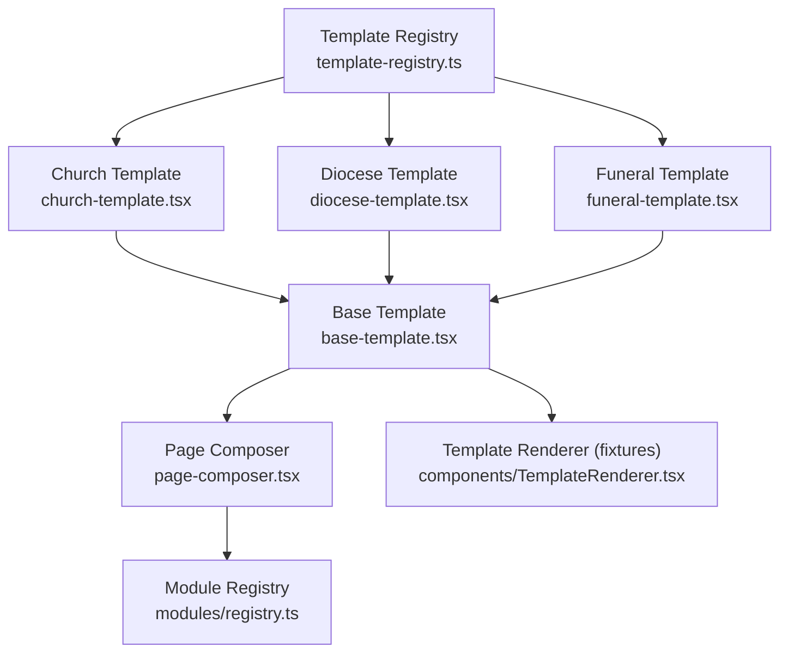
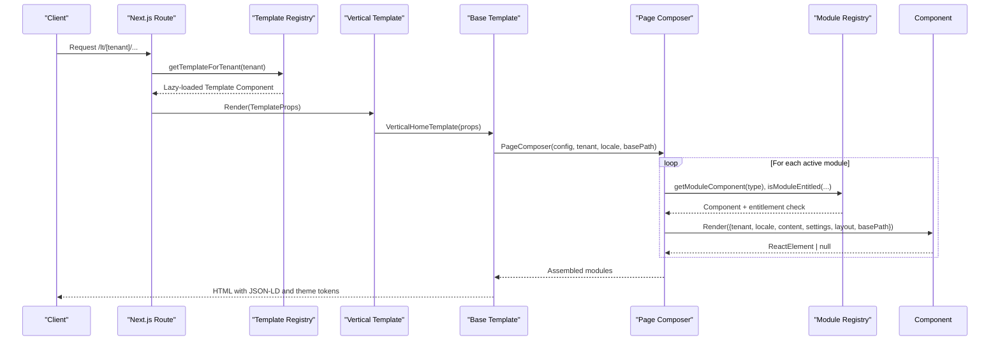
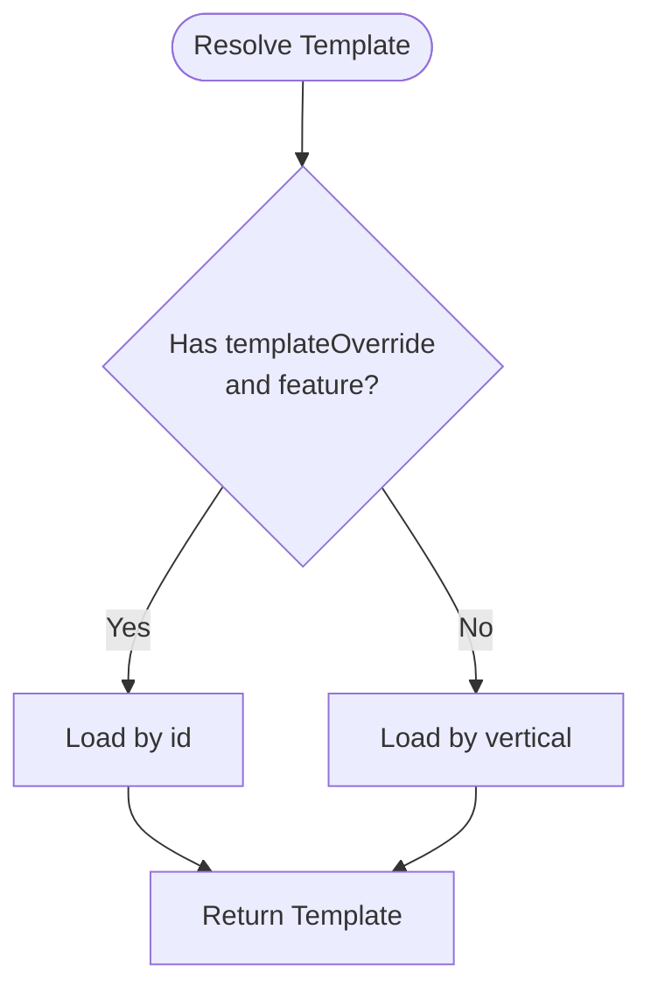
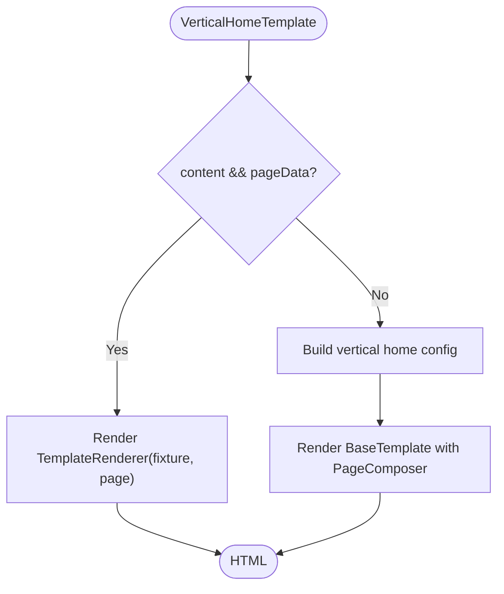
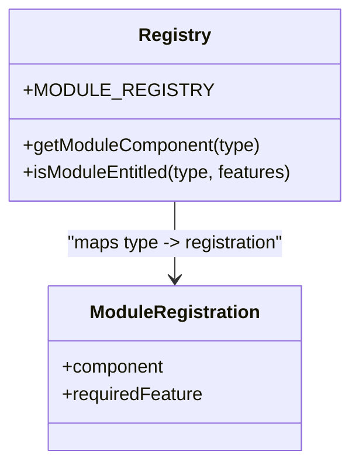
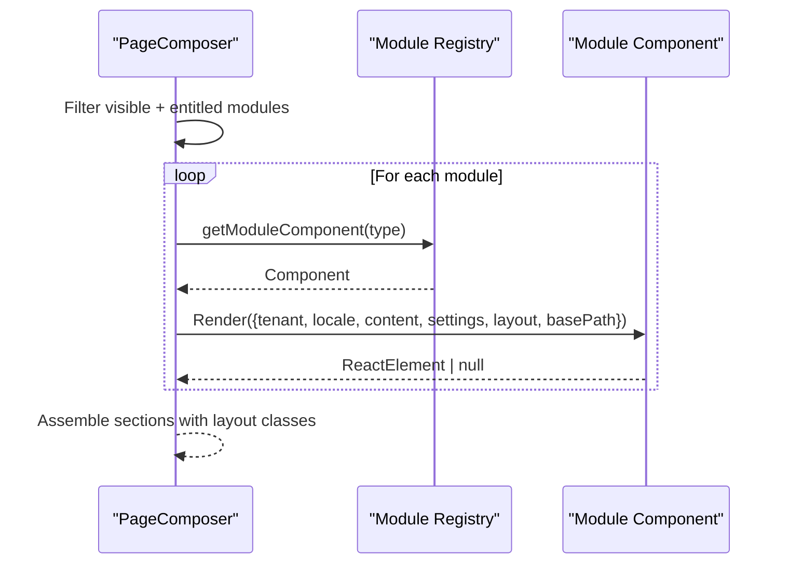
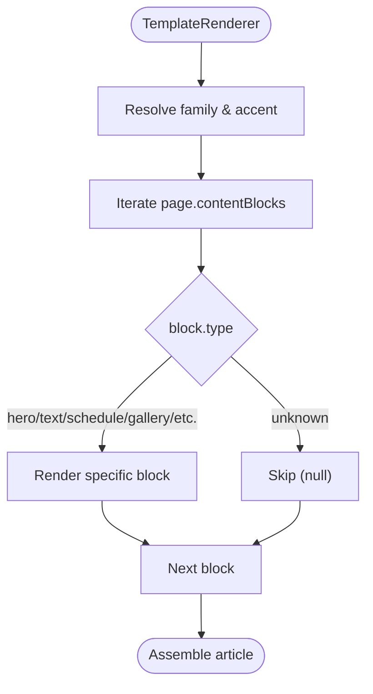
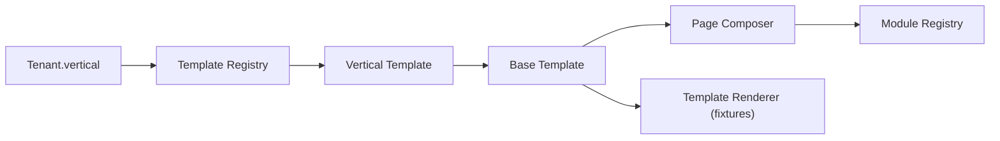

# Template Composition & Page Assembly

<cite>
**Referenced Files in This Document**
- [template-registry.ts](file://frontend/apps/template-renderer/src/lib/template-registry.ts)
- [base-template.tsx](file://frontend/apps/template-renderer/src/templates/base-template.tsx)
- [church-template.tsx](file://frontend/apps/template-renderer/src/templates/church-template.tsx)
- [diocese-template.tsx](file://frontend/apps/template-renderer/src/templates/diocese-template.tsx)
- [funeral-template.tsx](file://frontend/apps/template-renderer/src/templates/funeral-template.tsx)
- [page-composer.tsx](file://frontend/apps/template-renderer/src/lib/page-composer.tsx)
- [registry.ts](file://frontend/apps/template-renderer/src/modules/registry.ts)
- [types.ts](file://frontend/apps/template-renderer/src/modules/types.ts)
- [TemplateRenderer.tsx](file://frontend/apps/template-renderer/src/components/TemplateRenderer.tsx)
</cite>

## Table of Contents
1. [Introduction](#introduction)
2. [Project Structure](#project-structure)
3. [Core Components](#core-components)
4. [Architecture Overview](#architecture-overview)
5. [Detailed Component Analysis](#detailed-component-analysis)
6. [Dependency Analysis](#dependency-analysis)
7. [Performance Considerations](#performance-considerations)
8. [Troubleshooting Guide](#troubleshooting-guide)
9. [Conclusion](#conclusion)

## Introduction
This document explains how JOL-HUB composes templates and assembles pages for different verticals (catholic, orthodox, protestant, diocese, deanery, funeral, cemetery cleaning). It covers:
- Base template inheritance and vertical-specific overrides
- The module registry that enables dynamic component composition and content block rendering
- How tenants select templates via a registry with lazy loading
- Vertical theming and shared components across verticals
- Performance strategies including code splitting, server-side rendering, and caching considerations

## Project Structure
The template system lives in the template-renderer app under frontend/apps/template-renderer/src:
- Templates define per-vertical shells and delegate to a shared base renderer
- A registry maps tenant verticals to lazy-loaded template modules
- A page composer renders validated page configurations by invoking registered modules
- A fixture-based renderer supports pilot-era content blocks

**Diagram sources**
- [template-registry.ts:38-76](file://frontend/apps/template-renderer/src/lib/template-registry.ts#L38-L76)
- [church-template.tsx:15-20](file://frontend/apps/template-renderer/src/templates/church-template.tsx#L15-L20)
- [diocese-template.tsx:16-21](file://frontend/apps/template-renderer/src/templates/diocese-template.tsx#L16-L21)
- [funeral-template.tsx:16-21](file://frontend/apps/template-renderer/src/templates/funeral-template.tsx#L16-L21)
- [base-template.tsx:44-94](file://frontend/apps/template-renderer/src/templates/base-template.tsx#L44-L94)
- [page-composer.tsx:70-83](file://frontend/apps/template-renderer/src/lib/page-composer.tsx#L70-L83)
- [registry.ts:44-68](file://frontend/apps/template-renderer/src/modules/registry.ts#L44-L68)
- [TemplateRenderer.tsx:34-56](file://frontend/apps/template-renderer/src/components/TemplateRenderer.tsx#L34-L56)

**Section sources**
- [template-registry.ts:1-109](file://frontend/apps/template-renderer/src/lib/template-registry.ts#L1-L109)
- [base-template.tsx:1-95](file://frontend/apps/template-renderer/src/templates/base-template.tsx#L1-L95)
- [page-composer.tsx:1-84](file://frontend/apps/template-renderer/src/lib/page-composer.tsx#L1-L84)
- [registry.ts:1-70](file://frontend/apps/template-renderer/src/modules/registry.ts#L1-L70)
- [TemplateRenderer.tsx:1-466](file://frontend/apps/template-renderer/src/components/TemplateRenderer.tsx#L1-L466)

## Core Components
- Template registry: Maps tenant verticals to lazy-loaded template components; supports admin template override when permitted.
- Base template: Provides shared shell, structured data, analytics placeholder, and delegates to either fixture-based rendering or a default vertical home configuration.
- Vertical templates: church-template, diocese-template, funeral-template are thin wrappers delegating to the shared base renderer.
- Module registry: Declares available modules, their entitlements, and provides lookup/gating helpers.
- Page composer: Renders modules from a validated PageConfig in order, applying layout containers and feature gating.
- Fixture renderer: For pilot-era content, renders typed content blocks into a consistent layout.

**Section sources**
- [template-registry.ts:19-76](file://frontend/apps/template-renderer/src/lib/template-registry.ts#L19-L76)
- [base-template.tsx:44-94](file://frontend/apps/template-renderer/src/templates/base-template.tsx#L44-L94)
- [church-template.tsx:15-20](file://frontend/apps/template-renderer/src/templates/church-template.tsx#L15-L20)
- [diocese-template.tsx:16-21](file://frontend/apps/template-renderer/src/templates/diocese-template.tsx#L16-L21)
- [funeral-template.tsx:16-21](file://frontend/apps/template-renderer/src/templates/funeral-template.tsx#L16-L21)
- [registry.ts:32-68](file://frontend/apps/template-renderer/src/modules/registry.ts#L32-L68)
- [page-composer.tsx:41-83](file://frontend/apps/template-renderer/src/lib/page-composer.tsx#L41-L83)
- [TemplateRenderer.tsx:34-56](file://frontend/apps/template-renderer/src/components/TemplateRenderer.tsx#L34-L56)

## Architecture Overview
At request time, the system resolves a tenant’s vertical to a template via the registry, then renders either fixture-driven content or a default vertical home configuration. The base template injects theme tokens and structured data, and invokes the page composer to assemble modules. Modules are resolved from the module registry and rendered with feature gating and layout containers.

**Diagram sources**
- [template-registry.ts:66-76](file://frontend/apps/template-renderer/src/lib/template-registry.ts#L66-L76)
- [base-template.tsx:82-94](file://frontend/apps/template-renderer/src/templates/base-template.tsx#L82-L94)
- [page-composer.tsx:41-83](file://frontend/apps/template-renderer/src/lib/page-composer.tsx#L41-L83)
- [registry.ts:44-68](file://frontend/apps/template-renderer/src/modules/registry.ts#L44-L68)

## Detailed Component Analysis

### Template Registry and Vertical Resolution
- Vertical mapping: Each vertical (basilica, cathedral, church, protestant, orthodox, other-church, diocese, deanery, funeral, cemetery-cleaning) maps to a lazy-loaded template module.
- Admin override: When allowed by features, an explicit template id can override the vertical selection.
- Theme mapping: Vertical names map to design-system accent tokens used by UI components.

**Diagram sources**
- [template-registry.ts:52-76](file://frontend/apps/template-renderer/src/lib/template-registry.ts#L52-L76)

**Section sources**
- [template-registry.ts:38-76](file://frontend/apps/template-renderer/src/lib/template-registry.ts#L38-L76)
- [template-registry.ts:83-108](file://frontend/apps/template-renderer/src/lib/template-registry.ts#L83-L108)

### Base Template and Vertical Home Rendering
- Shared responsibilities: sets data-vertical attribute, applies accent CSS, emits JSON-LD Organization and Website, and integrates analytics placeholder gated by consent.
- Content path: If fixture content and page are present, uses TemplateRenderer; otherwise builds a default vertical home configuration and renders via PageComposer.

**Diagram sources**
- [base-template.tsx:82-94](file://frontend/apps/template-renderer/src/templates/base-template.tsx#L82-L94)
- [TemplateRenderer.tsx:34-56](file://frontend/apps/template-renderer/src/components/TemplateRenderer.tsx#L34-L56)

**Section sources**
- [base-template.tsx:44-94](file://frontend/apps/template-renderer/src/templates/base-template.tsx#L44-L94)

### Vertical Templates (Church, Diocese, Funeral)
- Thin wrappers that delegate to VerticalHomeTemplate, keeping differentiation data-driven via tenant.vertical rather than duplicated logic.
- Theming and schema are applied through the base template using vertical-aware utilities.

**Section sources**
- [church-template.tsx:15-20](file://frontend/apps/template-renderer/src/templates/church-template.tsx#L15-L20)
- [diocese-template.tsx:16-21](file://frontend/apps/template-renderer/src/templates/diocese-template.tsx#L16-L21)
- [funeral-template.tsx:16-21](file://frontend/apps/template-renderer/src/templates/funeral-template.tsx#L16-L21)
- [base-template.tsx:44-69](file://frontend/apps/template-renderer/src/templates/base-template.tsx#L44-L69)

### Module Registry and Entitlements
- Central registry declares all modules, their required features, and provides lookup and entitlement checks.
- Unknown or unentitled modules render nothing, ensuring safe fallback behavior.

**Diagram sources**
- [registry.ts:32-68](file://frontend/apps/template-renderer/src/modules/registry.ts#L32-L68)

**Section sources**
- [registry.ts:1-70](file://frontend/apps/template-renderer/src/modules/registry.ts#L1-L70)

### Page Composer and Layout Assembly
- Filters modules by visibility and entitlement, then renders each asynchronously.
- Wraps each module in a section with spacing and a layout container based on the module’s layout setting.

**Diagram sources**
- [page-composer.tsx:41-83](file://frontend/apps/template-renderer/src/lib/page-composer.tsx#L41-L83)
- [registry.ts:44-68](file://frontend/apps/template-renderer/src/modules/registry.ts#L44-L68)

**Section sources**
- [page-composer.tsx:1-84](file://frontend/apps/template-renderer/src/lib/page-composer.tsx#L1-L84)

### Fixture-Based Content Block Rendering
- TemplateRenderer selects family/accent and renders a list of typed content blocks (hero, text, schedule, gallery, etc.) with consistent styling and accessibility.
- Provides a robust fallback for unknown block types.

**Diagram sources**
- [TemplateRenderer.tsx:34-56](file://frontend/apps/template-renderer/src/components/TemplateRenderer.tsx#L34-L56)
- [TemplateRenderer.tsx:64-465](file://frontend/apps/template-renderer/src/components/TemplateRenderer.tsx#L64-L465)

**Section sources**
- [TemplateRenderer.tsx:1-466](file://frontend/apps/template-renderer/src/components/TemplateRenderer.tsx#L1-L466)

### Module Contract and Theming
- Modules receive a standardized prop shape and must be server components.
- A helper extracts a client-safe theme subset from the full tenant record.

**Section sources**
- [types.ts:1-45](file://frontend/apps/template-renderer/src/modules/types.ts#L1-L45)

## Dependency Analysis
- Template resolution depends on tenant.vertical and optional admin override.
- Base template depends on vertical theme utilities and the page composer.
- Page composer depends on the module registry for both component resolution and entitlement checks.
- Fixture rendering is independent of the module system but shares vertical theme resolution.

**Diagram sources**
- [template-registry.ts:38-76](file://frontend/apps/template-renderer/src/lib/template-registry.ts#L38-L76)
- [base-template.tsx:82-94](file://frontend/apps/template-renderer/src/templates/base-template.tsx#L82-L94)
- [page-composer.tsx:70-83](file://frontend/apps/template-renderer/src/lib/page-composer.tsx#L70-L83)
- [registry.ts:44-68](file://frontend/apps/template-renderer/src/modules/registry.ts#L44-L68)
- [TemplateRenderer.tsx:34-56](file://frontend/apps/template-renderer/src/components/TemplateRenderer.tsx#L34-L56)

**Section sources**
- [template-registry.ts:38-76](file://frontend/apps/template-renderer/src/lib/template-registry.ts#L38-L76)
- [page-composer.tsx:70-83](file://frontend/apps/template-renderer/src/lib/page-composer.tsx#L70-L83)
- [registry.ts:44-68](file://frontend/apps/template-renderer/src/modules/registry.ts#L44-L68)

## Performance Considerations
- Lazy loading of templates: Each vertical template is loaded via dynamic import, reducing initial bundle size so visitors only download the template they need.
- Code-splitting of interactive modules: Interactive UI within modules is split into client chunks automatically by the framework; server-module code does not ship to the browser.
- Server-side rendering: Modules are server components; async modules are awaited during RSC rendering, improving perceived performance and SEO.
- Feature gating: Unentitled modules are skipped early, avoiding unnecessary work.
- Caching strategy notes:
  - Template resolution is fast due to static mappings; consider memoizing resolved templates per tenant if requests are high volume.
  - PageComposer runs per request; cache PageConfig results at the route level where possible.
  - Avoid re-fetching heavy module data on every render; use server-side caching or edge caches for collections.
  - Ensure CDN caching for static assets and JSON-LD payloads where appropriate.

[No sources needed since this section provides general guidance]

## Troubleshooting Guide
- Unknown module type: The page composer returns null for unknown module types; verify the module exists in the registry and the PageConfig references a valid type.
- Missing entitlement: Modules gated by features will not render if the tenant lacks the required feature; confirm tenant.features includes the required key.
- No content rendered: If no modules are visible or entitled, the composer returns null; ensure at least one module is visible and allowed.
- Fixture vs backend content: If fixtures are absent, the base template falls back to building a default vertical home configuration; verify vertical defaults are configured.
- Theme mismatch: Verify vertical-to-accent mapping is correct; unknown mappings fall back to neutral primary.

**Section sources**
- [page-composer.tsx:41-83](file://frontend/apps/template-renderer/src/lib/page-composer.tsx#L41-L83)
- [registry.ts:44-68](file://frontend/apps/template-renderer/src/modules/registry.ts#L44-L68)
- [base-template.tsx:82-94](file://frontend/apps/template-renderer/src/templates/base-template.tsx#L82-L94)
- [template-registry.ts:83-108](file://frontend/apps/template-renderer/src/lib/template-registry.ts#L83-L108)

## Conclusion
JOL-HUB’s template system separates concerns cleanly:
- The registry resolves templates lazily by vertical or admin override
- The base template centralizes cross-cutting concerns and structured data
- The page composer orchestrates modules with entitlement and layout control
- Fixture rendering supports pilot-era content while sharing the same vertical theming
This design enables scalable composition across catholic, orthodox, and protestant verticals while maintaining performance through lazy loading, server-side rendering, and feature gating.