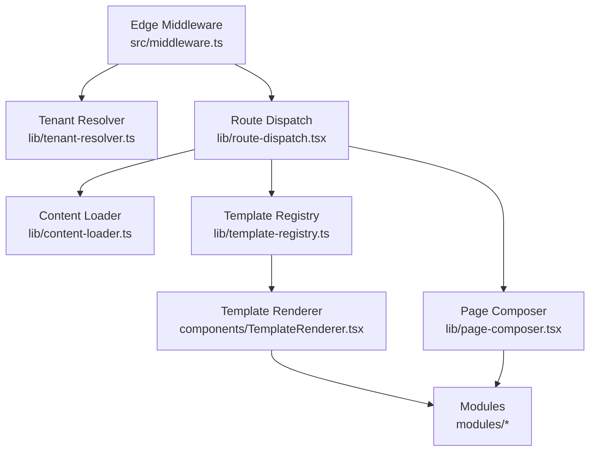
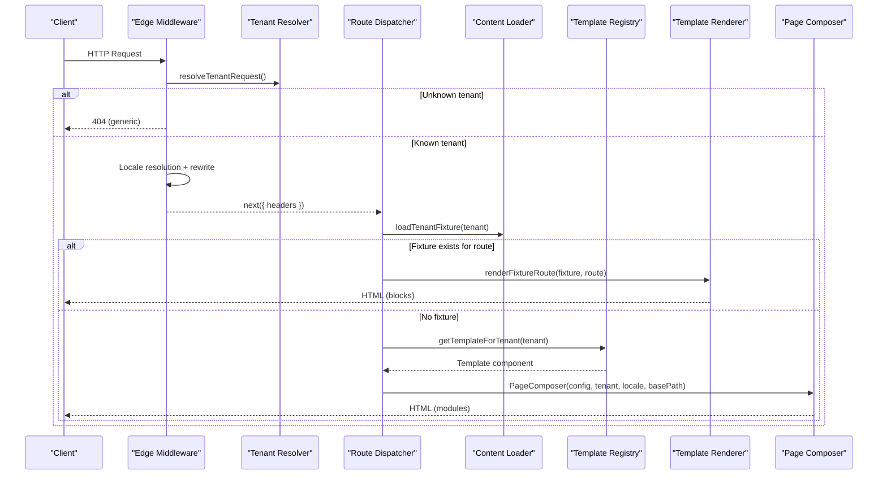
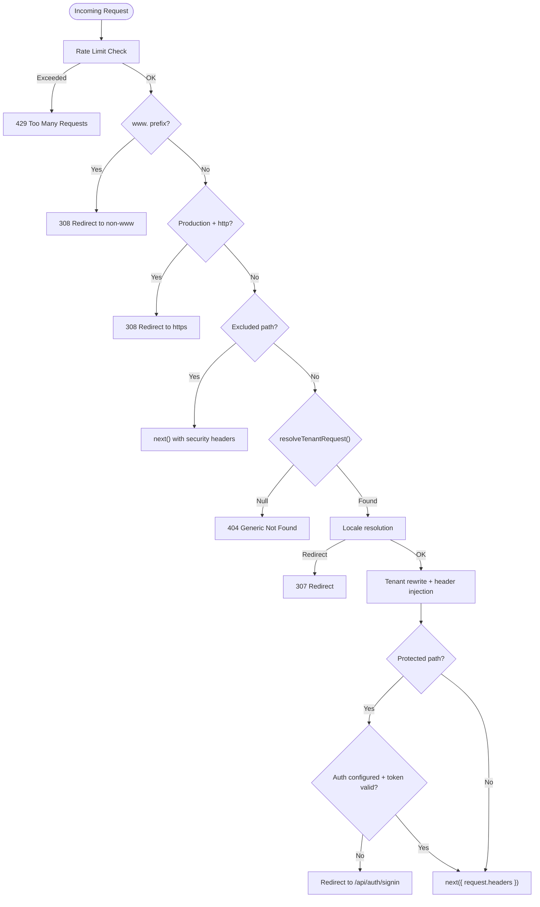
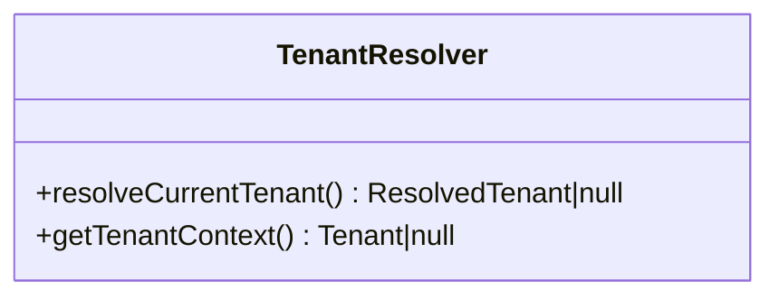
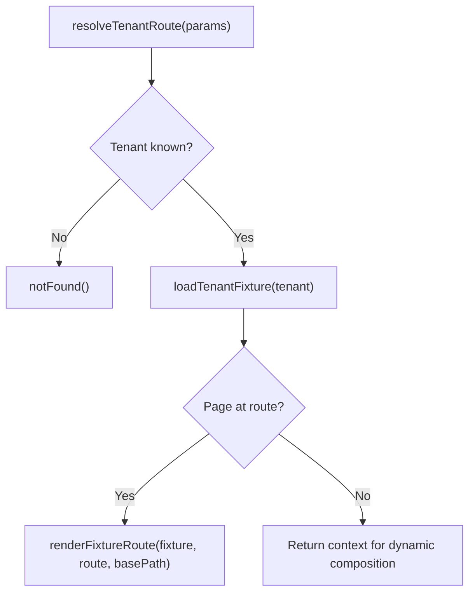
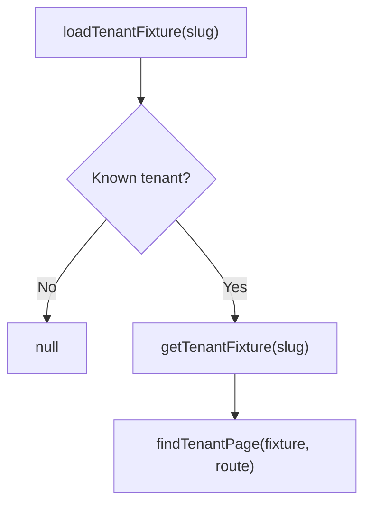
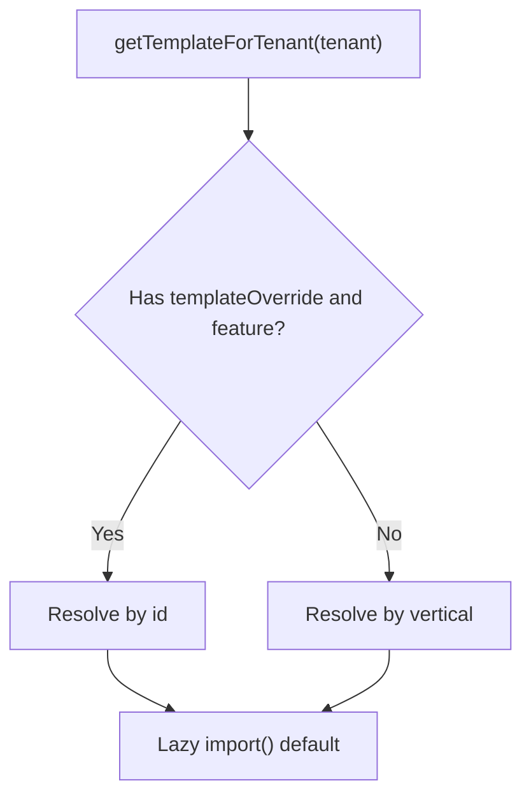
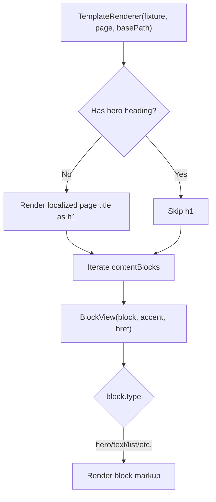
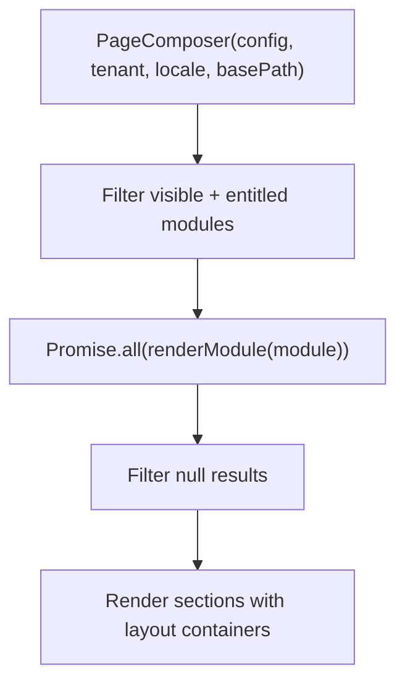
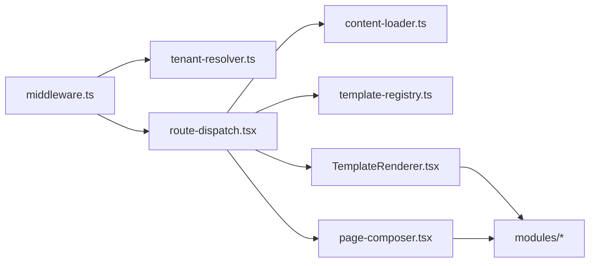

# Template Rendering Flows

<cite>
**Referenced Files in This Document**
- [RENDERING.md](file://frontend/apps/template-renderer/RENDERING.md)
- [middleware.ts](file://frontend/apps/template-renderer/src/middleware.ts)
- [tenant-resolver.ts](file://frontend/apps/template-renderer/src/lib/tenant-resolver.ts)
- [content-loader.ts](file://frontend/apps/template-renderer/src/lib/content-loader.ts)
- [route-dispatch.tsx](file://frontend/apps/template-renderer/src/lib/route-dispatch.tsx)
- [TemplateRenderer.tsx](file://frontend/apps/template-renderer/src/components/TemplateRenderer.tsx)
- [page-composer.tsx](file://frontend/apps/template-renderer/src/lib/page-composer.tsx)
- [template-registry.ts](file://frontend/apps/template-renderer/src/lib/template-registry.ts)
</cite>

## Table of Contents
1. [Introduction](#introduction)
2. [Project Structure](#project-structure)
3. [Core Components](#core-components)
4. [Architecture Overview](#architecture-overview)
5. [Detailed Component Analysis](#detailed-component-analysis)
6. [Dependency Analysis](#dependency-analysis)
7. [Performance Considerations](#performance-considerations)
8. [Troubleshooting Guide](#troubleshooting-guide)
9. [Conclusion](#conclusion)

## Introduction
This document explains how JOL-HUB’s template-renderer turns a URL into a fully rendered, tenant-specific HTML page. It covers the full request lifecycle: edge middleware routing and tenant resolution, locale negotiation, fixture-first content loading, template selection by vertical, module composition, and final HTML generation. It also documents multi-language support, country-specific customizations via fixtures, compliance-based rendering constraints, caching strategies, performance optimizations, and debugging approaches for large-scale deployments serving thousands of tenants.

## Project Structure
The template-renderer is a Next.js App Router application under frontend/apps/template-renderer. The key layers are:
- Edge middleware: request normalization, rate limiting, tenant gate, locale resolution, header injection, security headers.
- Route dispatch: tenant validation, fixture-first delegation, and fallback to dynamic composition.
- Content loader: seed-data fixtures lookup and shared route handling.
- Template registry: vertical-to-template mapping with lazy loading and optional admin override.
- Template renderer: block-by-block rendering from fixtures or modules.
- Page composer: ordered, feature-gated module rendering for dynamic pages.

**Diagram sources**
- [middleware.ts:120-310](file://frontend/apps/template-renderer/src/middleware.ts#L120-L310)
- [tenant-resolver.ts:20-34](file://frontend/apps/template-renderer/src/lib/tenant-resolver.ts#L20-L34)
- [route-dispatch.tsx:49-78](file://frontend/apps/template-renderer/src/lib/route-dispatch.tsx#L49-L78)
- [content-loader.ts:17-43](file://frontend/apps/template-renderer/src/lib/content-loader.ts#L17-L43)
- [template-registry.ts:37-76](file://frontend/apps/template-renderer/src/lib/template-registry.ts#L37-L76)
- [TemplateRenderer.tsx:34-56](file://frontend/apps/template-renderer/src/components/TemplateRenderer.tsx#L34-L56)
- [page-composer.tsx:70-83](file://frontend/apps/template-renderer/src/lib/page-composer.tsx#L70-L83)

**Section sources**
- [RENDERING.md:1-117](file://frontend/apps/template-renderer/RENDERING.md#L1-L117)
- [middleware.ts:1-316](file://frontend/apps/template-renderer/src/middleware.ts#L1-L316)

## Core Components
- Edge middleware orchestrates the request pipeline: rate limiting, www normalization, HTTPS enforcement, tenant gate, locale resolution, tenant rewrite/header injection, and security headers on every response.
- Tenant resolver provides server-side access to the resolved tenant context (including schema for RLS).
- Route dispatcher validates tenants, loads fixtures, selects locale, and delegates to either fixture rendering or dynamic composition.
- Content loader reads seed-data fixtures and identifies shared routes (privacy, cookies, consent, dsr).
- Template registry maps tenant verticals to lazy-loaded templates and supports admin-driven overrides when permitted.
- Template renderer renders fixture-defined blocks with localization and accessibility considerations.
- Page composer renders configured modules in order, gated by features and visibility.

**Section sources**
- [middleware.ts:120-310](file://frontend/apps/template-renderer/src/middleware.ts#L120-L310)
- [tenant-resolver.ts:20-34](file://frontend/apps/template-renderer/src/lib/tenant-resolver.ts#L20-L34)
- [route-dispatch.tsx:49-78](file://frontend/apps/template-renderer/src/lib/route-dispatch.tsx#L49-L78)
- [content-loader.ts:17-43](file://frontend/apps/template-renderer/src/lib/content-loader.ts#L17-L43)
- [template-registry.ts:37-76](file://frontend/apps/template-renderer/src/lib/template-registry.ts#L37-L76)
- [TemplateRenderer.tsx:34-56](file://frontend/apps/template-renderer/src/components/TemplateRenderer.tsx#L34-L56)
- [page-composer.tsx:70-83](file://frontend/apps/template-renderer/src/lib/page-composer.tsx#L70-L83)

## Architecture Overview
The end-to-end flow from URL to HTML:

**Diagram sources**
- [middleware.ts:183-310](file://frontend/apps/template-renderer/src/middleware.ts#L183-L310)
- [route-dispatch.tsx:49-78](file://frontend/apps/template-renderer/src/lib/route-dispatch.tsx#L49-L78)
- [content-loader.ts:17-43](file://frontend/apps/template-renderer/src/lib/content-loader.ts#L17-L43)
- [template-registry.ts:66-76](file://frontend/apps/template-renderer/src/lib/template-registry.ts#L66-L76)
- [TemplateRenderer.tsx:34-56](file://frontend/apps/template-renderer/src/components/TemplateRenderer.tsx#L34-L56)
- [page-composer.tsx:70-83](file://frontend/apps/template-renderer/src/lib/page-composer.tsx#L70-L83)

## Detailed Component Analysis

### Edge Middleware: Routing, Tenant Gate, Locale, Security
- Rate limits per client IP and tenant before any heavy work; protects login endpoints specifically.
- Normalizes www. prefix and enforces HTTPS in production using proxy-safe host detection.
- Exempts static/internal paths but still applies security headers.
- Enforces a strict tenant gate: unknown tenants receive a direct generic 404 without rewriting to avoid internal re-proxies and enumeration risks.
- Applies locale resolution and injects x-locale and X-Tenant-* headers for downstream components.
- Protects admin/editor areas with authentication checks when configured; logs security events.

**Diagram sources**
- [middleware.ts:183-310](file://frontend/apps/template-renderer/src/middleware.ts#L183-L310)

**Section sources**
- [middleware.ts:120-310](file://frontend/apps/template-renderer/src/middleware.ts#L120-L310)

### Tenant Resolution and Context
- Server components read the current request headers to obtain the resolved tenant record, including schema for backend RLS.
- Resolution is closed: unknown slugs return null and are handled upstream as 404.

**Diagram sources**
- [tenant-resolver.ts:20-34](file://frontend/apps/template-renderer/src/lib/tenant-resolver.ts#L20-L34)

**Section sources**
- [tenant-resolver.ts:20-34](file://frontend/apps/template-renderer/src/lib/tenant-resolver.ts#L20-L34)

### Route Dispatch: Fixture-First Delegation
- Validates tenant existence; unknown tenants trigger notFound().
- Loads tenant fixture and attempts to find a matching page for the requested route.
- If found, delegates to TemplateRenderer with the fixture page; otherwise falls through to dynamic composition.

**Diagram sources**
- [route-dispatch.tsx:49-78](file://frontend/apps/template-renderer/src/lib/route-dispatch.tsx#L49-L78)

**Section sources**
- [route-dispatch.tsx:49-78](file://frontend/apps/template-renderer/src/lib/route-dispatch.tsx#L49-L78)

### Content Loading and Shared Routes
- Loads fixtures from seed-data; unknown slugs return null.
- Provides helper to find a page by tenant-relative route.
- Identifies shared routes that use the compliance UI rather than tenant fixtures.

**Diagram sources**
- [content-loader.ts:17-43](file://frontend/apps/template-renderer/src/lib/content-loader.ts#L17-L43)

**Section sources**
- [content-loader.ts:17-43](file://frontend/apps/template-renderer/src/lib/content-loader.ts#L17-L43)

### Template Selection and Lazy Loading
- Maps tenant verticals to template components via a registry with lazy imports to minimize bundle size.
- Supports admin-driven template override when the tenant has the required feature flag.
- Bridges vertical taxonomy to design-system accent tokens for consistent theming.

**Diagram sources**
- [template-registry.ts:37-76](file://frontend/apps/template-renderer/src/lib/template-registry.ts#L37-L76)

**Section sources**
- [template-registry.ts:37-109](file://frontend/apps/template-renderer/src/lib/template-registry.ts#L37-L109)

### Fixture-Based Rendering: Blocks and Localization
- Renders a sequence of content blocks defined in the fixture, selecting layout families and accents based on vertical.
- Localizes text fields preferring Lithuanian then English; ensures accessible headings and images.
- Implements multiple block types: hero, text, keyValue, schedule, list, stats, cta, massSchedule, gallery, faq, sacramentList, clergyRoleList, visitingInfo, mapLocation.
- Enforces WCAG rules such as a single h1 per page and proper alt attributes.

**Diagram sources**
- [TemplateRenderer.tsx:34-56](file://frontend/apps/template-renderer/src/components/TemplateRenderer.tsx#L34-L56)
- [TemplateRenderer.tsx:64-465](file://frontend/apps/template-renderer/src/components/TemplateRenderer.tsx#L64-L465)

**Section sources**
- [TemplateRenderer.tsx:34-465](file://frontend/apps/template-renderer/src/components/TemplateRenderer.tsx#L34-L465)

### Dynamic Pages: Module Composition
- PageComposer renders modules defined in a validated PageConfig in JOL-controlled order.
- Modules are feature-gated by tenant entitlements and visibility flags.
- Each module is wrapped in a layout container with consistent spacing.
- Async modules are awaited during server-side rendering.

**Diagram sources**
- [page-composer.tsx:41-83](file://frontend/apps/template-renderer/src/lib/page-composer.tsx#L41-L83)

**Section sources**
- [page-composer.tsx:41-83](file://frontend/apps/template-renderer/src/lib/page-composer.tsx#L41-L83)

## Dependency Analysis
- Middleware depends on tenant resolver and i18n middleware; it sets request-scoped headers consumed by server components.
- Route dispatcher depends on tenant resolver, content loader, and template registry; it centralizes invariants for all tenant routes.
- Template renderer depends on fixture data and design system components; it does not fetch remote data.
- Page composer depends on module registry and tenant features; it orchestrates async module rendering.

**Diagram sources**
- [middleware.ts:120-310](file://frontend/apps/template-renderer/src/middleware.ts#L120-L310)
- [route-dispatch.tsx:49-78](file://frontend/apps/template-renderer/src/lib/route-dispatch.tsx#L49-L78)
- [content-loader.ts:17-43](file://frontend/apps/template-renderer/src/lib/content-loader.ts#L17-L43)
- [template-registry.ts:37-76](file://frontend/apps/template-renderer/src/lib/template-registry.ts#L37-L76)
- [TemplateRenderer.tsx:34-56](file://frontend/apps/template-renderer/src/components/TemplateRenderer.tsx#L34-L56)
- [page-composer.tsx:70-83](file://frontend/apps/template-renderer/src/lib/page-composer.tsx#L70-L83)

**Section sources**
- [middleware.ts:120-310](file://frontend/apps/template-renderer/src/middleware.ts#L120-L310)
- [route-dispatch.tsx:49-78](file://frontend/apps/template-renderer/src/lib/route-dispatch.tsx#L49-L78)

## Performance Considerations
- Per-page rendering strategy:
  - Home and news lists use ISR-style data caching with revalidate windows; detail pages may force dynamic evaluation for freshness.
  - Events/services lists/details are dynamically evaluated per request to reflect real-time availability/pricing.
- Data cache layer:
  - Fetch calls use revalidate settings so underlying content is cached even though HTML is assembled per request due to lang dependency in root layout.
- Template chunking:
  - Vertical templates are lazily imported, reducing initial payload for unrelated visitors.
- Accessibility and CLS:
  - Images specify width/height; galleries lazy-load; only hero images eager-load to avoid layout shift.
- Security headers and redirects:
  - Early redirects (www, HTTPS) reduce unnecessary processing.
- Rate limiting:
  - Protects endpoints and reduces load during abuse.

[No sources needed since this section provides general guidance]

## Troubleshooting Guide
- Unknown tenant requests:
  - The middleware returns a direct generic 404 without rewriting to avoid internal proxy issues and prevent tenant enumeration.
- Protected areas:
  - When authentication is configured, missing or invalid tokens redirect to sign-in; failed attempts are logged as security events.
- Locale and routing:
  - Root layout reads x-locale from headers; this forces per-request rendering for all tenant routes. Data caching still honors revalidate for content.
- Error boundaries:
  - Tenant-level error and not-found pages provide branded responses; catch-all handles unknown slugs safely.
- Debugging tips:
  - Inspect x-request-id in responses for correlation across middleware, API routes, and telemetry.
  - Verify tenant resolution via logs for tenant.resolved vs tenant.unknown events.
  - Confirm security headers are present on all responses.

**Section sources**
- [middleware.ts:154-181](file://frontend/apps/template-renderer/src/middleware.ts#L154-L181)
- [middleware.ts:266-286](file://frontend/apps/template-renderer/src/middleware.ts#L266-L286)
- [RENDERING.md:6-31](file://frontend/apps/template-renderer/RENDERING.md#L6-L31)
- [RENDERING.md:95-117](file://frontend/apps/template-renderer/RENDERING.md#L95-L117)

## Conclusion
JOL-HUB’s template-renderer implements a secure, efficient, and scalable flow from URL to HTML:
- Edge middleware normalizes requests, enforces security, resolves tenants and locales, and injects request-scoped headers.
- Route dispatch prioritizes fixture fidelity for pilot tenants while supporting dynamic composition for new content.
- Templates are selected by vertical with lazy loading and optional admin overrides.
- Multi-language support is enforced via locale resolution and localized text rendering.
- Country-specific customizations come from fixtures and compliance routes.
- Caching leverages revalidate windows at the data layer, while per-request rendering remains necessary due to language-aware layouts.
- The architecture scales to thousands of tenants by minimizing payloads, enforcing strict tenant gates, and centralizing rendering logic.

[No sources needed since this section summarizes without analyzing specific files]