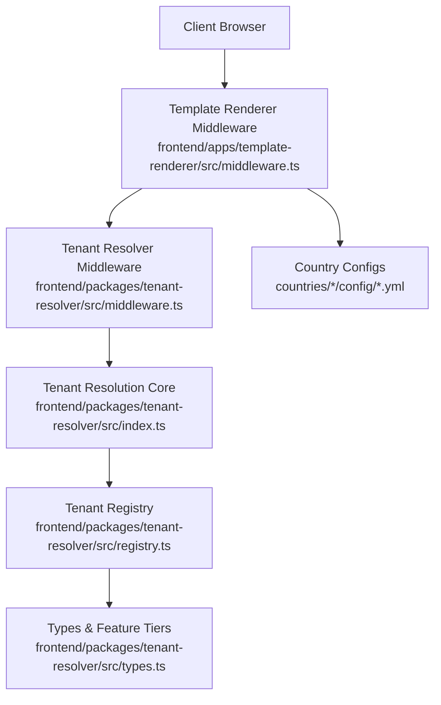
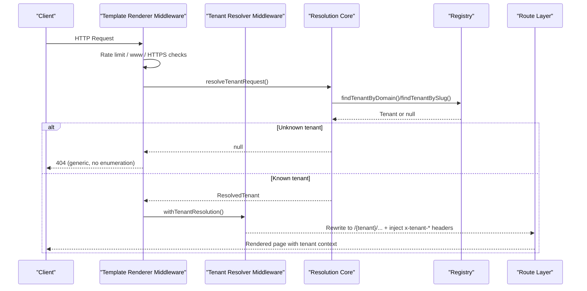
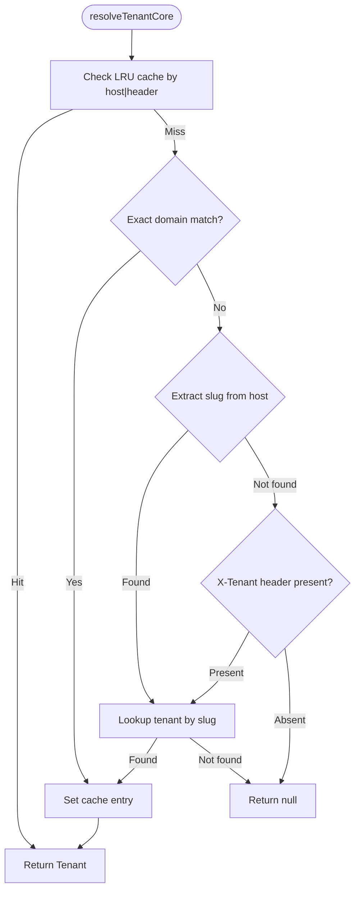
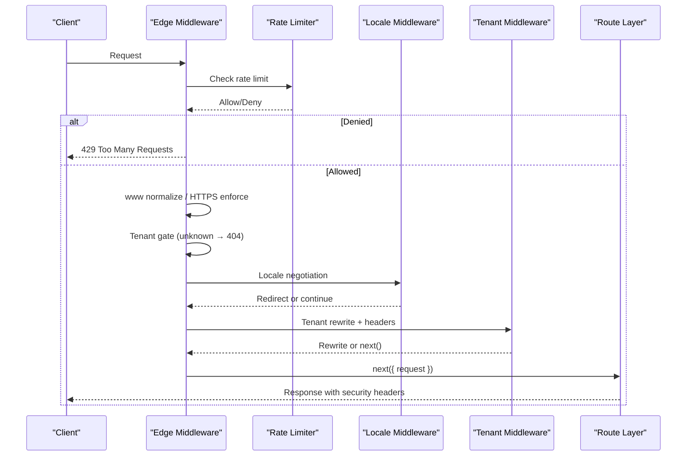
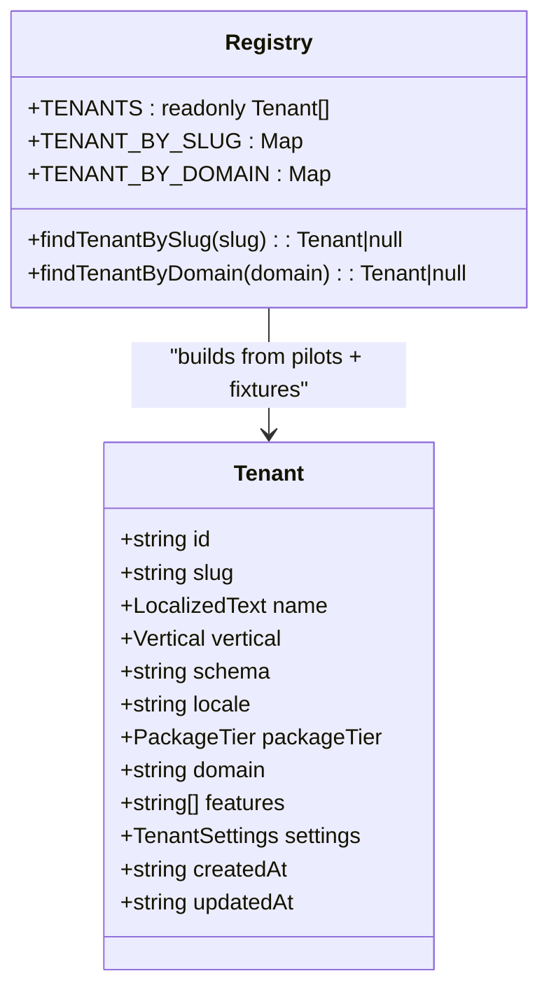
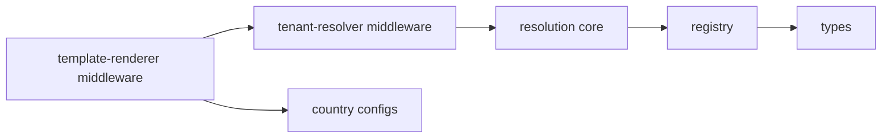

# Tenant Resolution & Configuration Loading

<cite>
**Referenced Files in This Document**
- [middleware.ts](file://frontend/apps/template-renderer/src/middleware.ts)
- [middleware.ts](file://frontend/packages/tenant-resolver/src/middleware.ts)
- [index.ts](file://frontend/packages/tenant-resolver/src/index.ts)
- [registry.ts](file://frontend/packages/tenant-resolver/src/registry.ts)
- [types.ts](file://frontend/packages/tenant-resolver/src/types.ts)
- [compliance.yml](file://countries/ee/config/compliance.yml)
- [liturgical.yml](file://countries/lt/config/liturgical.yml)
- [seo.yml](file://countries/lv/config/seo.yml)
</cite>

## Table of Contents
1. Introduction
2. Project Structure
3. Core Components
4. Architecture Overview
5. Detailed Component Analysis
6. Dependency Analysis
7. Performance Considerations
8. Troubleshooting Guide
9. Conclusion

## Introduction
This document explains how JOL-HUB identifies tenants from incoming requests, loads country-specific configurations (compliance, liturgical, SEO), and resolves tenant fixtures to render isolated religious institution websites at scale. It covers the multi-tenancy architecture that supports thousands of tenants with strict isolation, including how tenant slugs map to database schemas and configuration sources, and what happens when tenant data is unavailable.

## Project Structure
The tenant resolution and configuration loading span two layers:
- Edge middleware in the template renderer orchestrates request handling, security, rate limiting, locale negotiation, and tenant rewriting.
- The tenant resolver package performs closed lookups over a static registry (with an optional backend API fallback) and exposes helpers for Next.js middleware and server components.

**Diagram sources**
- [middleware.ts:1-316](file://frontend/apps/template-renderer/src/middleware.ts#L1-L316)
- [middleware.ts:1-91](file://frontend/packages/tenant-resolver/src/middleware.ts#L1-L91)
- [index.ts:1-195](file://frontend/packages/tenant-resolver/src/index.ts#L1-L195)
- [registry.ts:1-174](file://frontend/packages/tenant-resolver/src/registry.ts#L1-L174)
- [types.ts:1-162](file://frontend/packages/tenant-resolver/src/types.ts#L1-L162)
- [compliance.yml:1-241](file://countries/ee/config/compliance.yml#L1-L241)
- [liturgical.yml:1-184](file://countries/lt/config/liturgical.yml#L1-L184)
- [seo.yml:1-39](file://countries/lv/config/seo.yml#L1-L39)

**Section sources**
- [middleware.ts:1-316](file://frontend/apps/template-renderer/src/middleware.ts#L1-L316)
- [middleware.ts:1-91](file://frontend/packages/tenant-resolver/src/middleware.ts#L1-L91)
- [index.ts:1-195](file://frontend/packages/tenant-resolver/src/index.ts#L1-L195)
- [registry.ts:1-174](file://frontend/packages/tenant-resolver/src/registry.ts#L1-L174)
- [types.ts:1-162](file://frontend/packages/tenant-resolver/src/types.ts#L1-L162)

## Core Components
- Template renderer edge middleware: enforces rate limits, www normalization, HTTPS enforcement, tenant gate, locale resolution, tenant rewrite/header injection, and security headers on every response.
- Tenant resolver middleware: rewrites requests to include the resolved tenant path segment and injects server-only tenant context headers for downstream code.
- Tenant resolution core: resolves tenants by exact domain, subdomain slug, or explicit header; caches results; returns null for unknown tenants to prevent enumeration.
- Tenant registry: builds a closed lookup table from Wave-1 pilot entries and seed-data fixtures; maps slugs to schema names and feature tiers.
- Types: defines canonical vertical taxonomy, feature baselines per tier, and schema naming rules.
- Country configuration files: define compliance, liturgical, and SEO settings per country used during rendering and content generation.

**Section sources**
- [middleware.ts:1-316](file://frontend/apps/template-renderer/src/middleware.ts#L1-L316)
- [middleware.ts:1-91](file://frontend/packages/tenant-resolver/src/middleware.ts#L1-L91)
- [index.ts:1-195](file://frontend/packages/tenant-resolver/src/index.ts#L1-L195)
- [registry.ts:1-174](file://frontend/packages/tenant-resolver/src/registry.ts#L1-L174)
- [types.ts:1-162](file://frontend/packages/tenant-resolver/src/types.ts#L1-L162)
- [compliance.yml:1-241](file://countries/ee/config/compliance.yml#L1-L241)
- [liturgical.yml:1-184](file://countries/lt/config/liturgical.yml#L1-L184)
- [seo.yml:1-39](file://countries/lv/config/seo.yml#L1-L39)

## Architecture Overview
The system uses a closed-lookup multi-tenancy model:
- Requests arrive at the template renderer middleware.
- Unknown or unresolvable tenants receive a direct generic 404 without echoing input or enumerating tenants.
- Known tenants are rewritten to include the tenant segment and annotated with server-only headers for downstream processing.
- Downstream routes use the resolved tenant to select templates, locales, and content, while respecting feature flags derived from the tenant’s package tier.

**Diagram sources**
- [middleware.ts:120-311](file://frontend/apps/template-renderer/src/middleware.ts#L120-L311)
- [middleware.ts:49-90](file://frontend/packages/tenant-resolver/src/middleware.ts#L49-L90)
- [index.ts:112-154](file://frontend/packages/tenant-resolver/src/index.ts#L112-L154)
- [registry.ts:150-174](file://frontend/packages/tenant-resolver/src/registry.ts#L150-L174)

## Detailed Component Analysis

### Tenant Resolution Flow
- Resolution order:
  - Exact hostname match (custom domains).
  - Subdomain extraction against a configured base domain to derive a slug.
  - Explicit X-Tenant header override for dev/admin/API scenarios.
- Cache: In-memory LRU cache with TTL reduces repeated work.
- Security: Unknown tenants return null; callers must not echo attempted values. Schema names are server-only and never serialized to clients.

**Diagram sources**
- [index.ts:112-154](file://frontend/packages/tenant-resolver/src/index.ts#L112-L154)
- [registry.ts:150-174](file://frontend/packages/tenant-resolver/src/registry.ts#L150-L174)

**Section sources**
- [index.ts:1-195](file://frontend/packages/tenant-resolver/src/index.ts#L1-L195)
- [registry.ts:1-174](file://frontend/packages/tenant-resolver/src/registry.ts#L1-L174)

### Edge Middleware Orchestration
- Enforces rate limiting per client IP and tenant.
- Normalizes www prefixes and enforces HTTPS in production.
- Applies security headers to all responses.
- For SEO endpoints (/sitemap.xml, /robots.txt), resolves tenant to scope output without exposing registry details.
- Protects admin/editor/settings/dashboard paths via OIDC authentication when configured.
- Rewrites URLs to include the tenant segment and injects server-only headers for downstream consumption.

**Diagram sources**
- [middleware.ts:120-311](file://frontend/apps/template-renderer/src/middleware.ts#L120-L311)
- [middleware.ts:49-90](file://frontend/packages/tenant-resolver/src/middleware.ts#L49-L90)

**Section sources**
- [middleware.ts:1-316](file://frontend/apps/template-renderer/src/middleware.ts#L1-L316)
- [middleware.ts:1-91](file://frontend/packages/tenant-resolver/src/middleware.ts#L1-L91)

### Tenant Registry and Fixtures
- Builds a closed registry from:
  - Wave-1 pilot entries (explicitly defined tenants with names, verticals, and tiers).
  - Seed-data fixture tenants (derived into the same structure, excluding duplicates already covered by pilots).
- Maps each tenant to a PostgreSQL schema name following a deterministic rule.
- Provides read-only lookup functions that return null for unknown inputs to prevent enumeration.

**Diagram sources**
- [registry.ts:1-174](file://frontend/packages/tenant-resolver/src/registry.ts#L1-L174)
- [types.ts:44-71](file://frontend/packages/tenant-resolver/src/types.ts#L44-L71)

**Section sources**
- [registry.ts:1-174](file://frontend/packages/tenant-resolver/src/registry.ts#L1-L174)
- [types.ts:1-162](file://frontend/packages/tenant-resolver/src/types.ts#L1-L162)

### Country-Specific Configuration Loading
- Compliance configuration (example: Estonia):
  - Defines legal framework, GDPR implementation specifics, retention periods, breach notification, and religious organization considerations.
- Liturgical configuration (example: Lithuania):
  - Defines calendar type, seasons, local feasts, holy days of obligation, dioceses, and basilicas.
- SEO configuration (example: Latvia):
  - Defines default locale, hreflang alternates, indexNow key location, sitemap behavior, and robots directives.

These files provide the authoritative settings per country used during rendering and content generation. They are referenced by their file paths rather than embedded here.

**Section sources**
- [compliance.yml:1-241](file://countries/ee/config/compliance.yml#L1-L241)
- [liturgical.yml:1-184](file://countries/lt/config/liturgical.yml#L1-L184)
- [seo.yml:1-39](file://countries/lv/config/seo.yml#L1-L39)

### Relationship Between Slugs, Country Codes, and Configuration Sources
- Tenant slug:
  - Derived from subdomain labels or explicitly set via header; validated against a strict pattern.
  - Used to compute the PostgreSQL schema name deterministically.
- Country codes:
  - Stored within country configuration files to identify jurisdictional settings (e.g., ee, lt, lv).
  - Used to load appropriate compliance, liturgical, and SEO settings for rendering.
- Configuration sources:
  - Country configs live under countries/{code}/config/* and are consumed by rendering logic based on tenant locale/country mapping.
  - The registry ties slugs to verticals and features; country configs supply localized and jurisdiction-specific behavior.

[No sources needed since this section synthesizes relationships across previously cited files]

## Dependency Analysis

**Diagram sources**
- [middleware.ts:1-316](file://frontend/apps/template-renderer/src/middleware.ts#L1-L316)
- [middleware.ts:1-91](file://frontend/packages/tenant-resolver/src/middleware.ts#L1-L91)
- [index.ts:1-195](file://frontend/packages/tenant-resolver/src/index.ts#L1-L195)
- [registry.ts:1-174](file://frontend/packages/tenant-resolver/src/registry.ts#L1-L174)
- [types.ts:1-162](file://frontend/packages/tenant-resolver/src/types.ts#L1-L162)
- [compliance.yml:1-241](file://countries/ee/config/compliance.yml#L1-L241)
- [liturgical.yml:1-184](file://countries/lt/config/liturgical.yml#L1-L184)
- [seo.yml:1-39](file://countries/lv/config/seo.yml#L1-L39)

**Section sources**
- [middleware.ts:1-316](file://frontend/apps/template-renderer/src/middleware.ts#L1-L316)
- [middleware.ts:1-91](file://frontend/packages/tenant-resolver/src/middleware.ts#L1-L91)
- [index.ts:1-195](file://frontend/packages/tenant-resolver/src/index.ts#L1-L195)
- [registry.ts:1-174](file://frontend/packages/tenant-resolver/src/registry.ts#L1-L174)
- [types.ts:1-162](file://frontend/packages/tenant-resolver/src/types.ts#L1-L162)

## Performance Considerations
- Closed-lookups only: No DB calls during tenant resolution; registry is built at module load time.
- LRU caching: Tenants are cached with a short TTL to minimize repeated computations.
- Minimal allocations: Resolution core operates on plain inputs and avoids heavy object creation.
- Edge-first gating: Rate limiting and redirects happen early to reduce downstream work.
- Server-only headers: Tenant schema and identifiers are kept out of client payloads to avoid unnecessary serialization.

[No sources needed since this section provides general guidance]

## Troubleshooting Guide
- Unknown tenant returns 404:
  - If a request does not resolve to a known tenant, the edge middleware returns a generic 404 without echoing the attempted slug or revealing registry contents.
- Protected areas require authentication:
  - Admin/editor/settings/dashboard paths redirect to sign-in when authentication is configured and no valid session exists.
- SEO endpoints still respect tenant scoping:
  - Sitemap and robots endpoints resolve tenant to scope output but do not expose registry details.
- Rate limiting:
  - Excessive requests are rejected with 429; login attempts are additionally rate-limited to mitigate brute force.

**Section sources**
- [middleware.ts:143-181](file://frontend/apps/template-renderer/src/middleware.ts#L143-L181)
- [middleware.ts:266-286](file://frontend/apps/template-renderer/src/middleware.ts#L266-L286)
- [middleware.ts:230-244](file://frontend/apps/template-renderer/src/middleware.ts#L230-L244)
- [middleware.ts:186-199](file://frontend/apps/template-renderer/src/middleware.ts#L186-L199)

## Conclusion
JOL-HUB’s multi-tenancy architecture uses a secure, closed-lookup tenant resolution pipeline combined with country-specific configuration files to serve thousands of religious institution websites with isolated settings. Tenant slugs determine database schemas and feature sets, while country configs provide jurisdictional compliance, liturgical calendars, and SEO behavior. The edge middleware ensures robust security, performance, and correct routing, while the registry guarantees predictable and safe tenant identification.