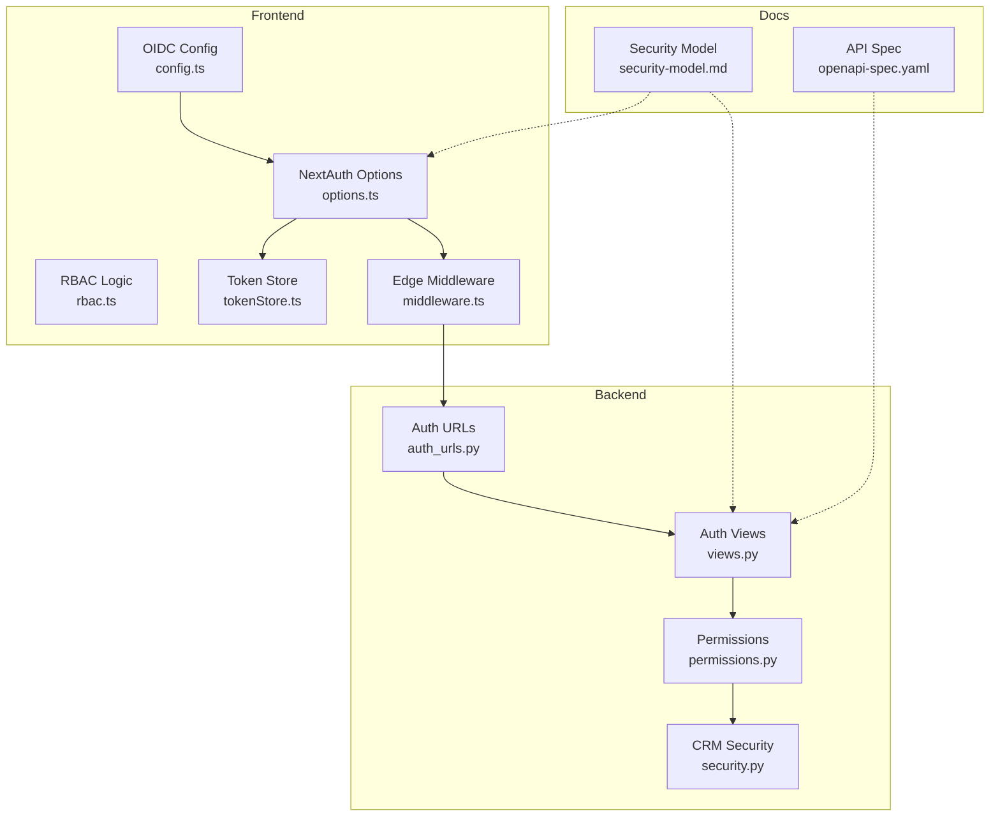
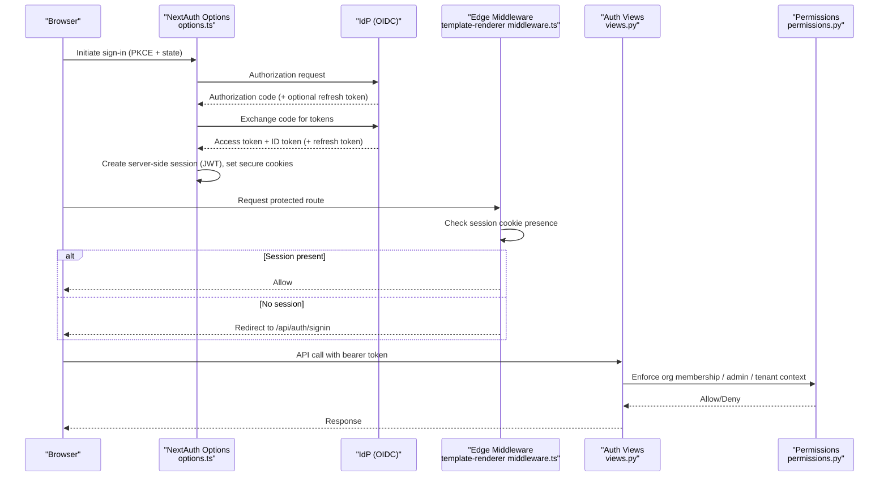
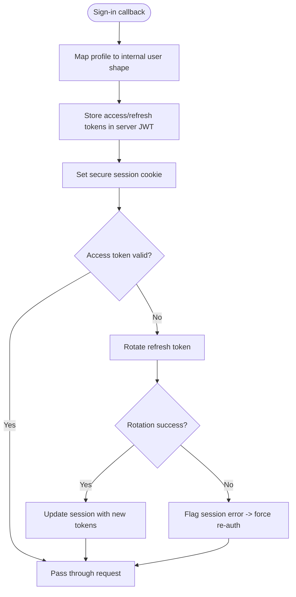
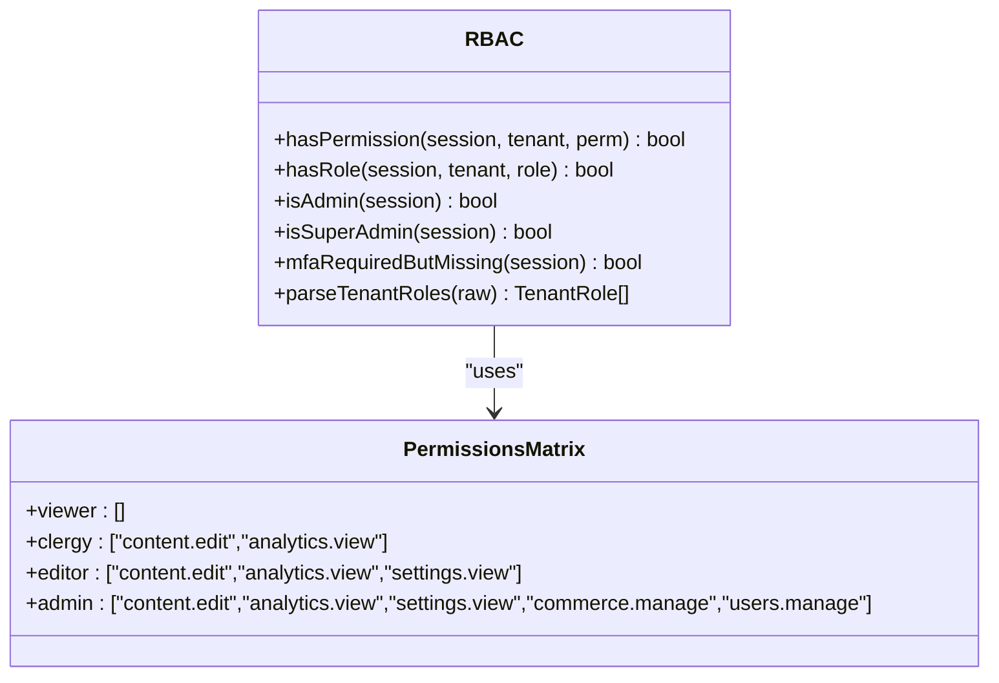
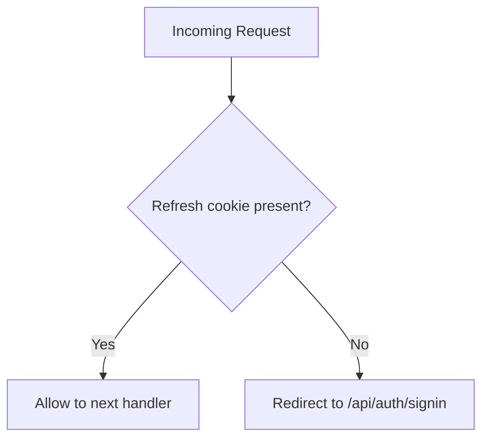
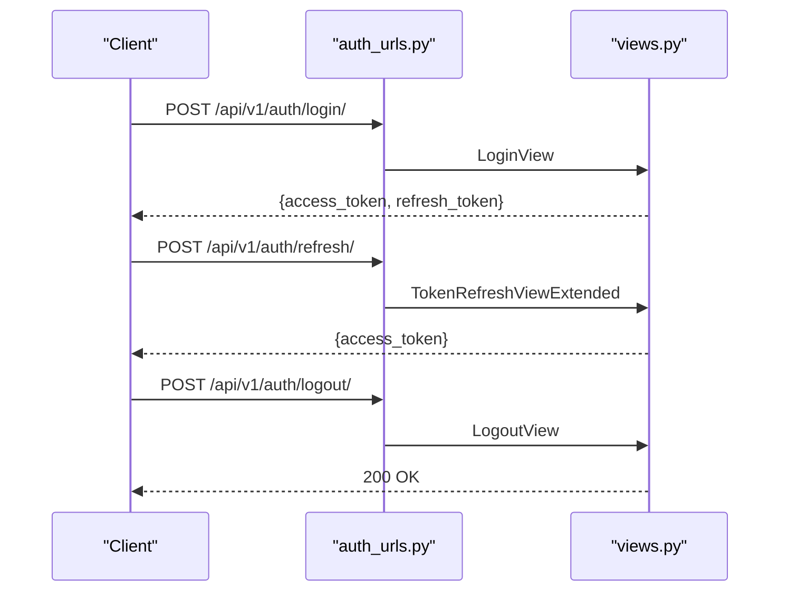
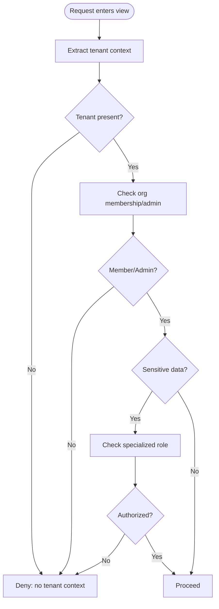
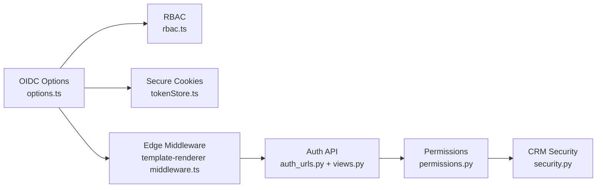

# Authentication & Authorization

<cite>
**Referenced Files in This Document**
- [security-model.md](file://docs/architecture/security-model.md)
- [openapi-spec.yaml](file://docs/api/openapi-spec.yaml)
- [auth_urls.py](file://backend/django/apps/users/auth_urls.py)
- [views.py](file://backend/django/apps/users/views.py)
- [permissions.py](file://backend/django/apps/core/permissions.py)
- [security.py](file://backend/django/apps/crm/security.py)
- [config.ts](file://frontend/packages/auth/src/oidc/config.ts)
- [options.ts](file://frontend/packages/auth/src/oidc/options.ts)
- [rbac.ts](file://frontend/packages/auth/src/oidc/rbac.ts)
- [tokenStore.ts](file://frontend/react/src/lib/tokenStore.ts)
- [middleware.ts (React app)](file://frontend/react/src/middleware.ts)
- [middleware.ts (Template Renderer)](file://frontend/apps/template-renderer/src/middleware.ts)
</cite>

## Table of Contents
1. Introduction
2. Project Structure
3. Core Components
4. Architecture Overview
5. Detailed Component Analysis
6. Dependency Analysis
7. Performance Considerations
8. Troubleshooting Guide
9. Conclusion

## Introduction
This document describes the authentication and authorization model for JOL-HUB, covering:
- OAuth 2.1/OpenID Connect with JWT tokens
- Multi-factor authentication (MFA) using TOTP and WebAuthn/FIDO2
- Role-based access control (RBAC) with resource- and action-based permissions
- User login flow from authentication to token validation and session management via secure cookies
- Privilege hierarchy from System Administrator down to Country Admin roles, including just-in-time access and approval workflows
- API authentication methods and service-to-service communication with API keys
- Integration with corporate identity providers via SAML 2.0/OIDC
- Security measures such as password policies, account lockout mechanisms, and audit logging for authentication events

## Project Structure
JOL-HUB implements a layered security architecture:
- Frontend OIDC client and RBAC logic under frontend packages
- Backend Django REST APIs for user auth endpoints and permission enforcement
- Centralized security policy documentation defining IAM, session handling, encryption, and monitoring

**Diagram sources**
- [config.ts:1-110](file://frontend/packages/auth/src/oidc/config.ts#L1-L110)
- [options.ts:26-188](file://frontend/packages/auth/src/oidc/options.ts#L26-L188)
- [rbac.ts:1-36](file://frontend/packages/auth/src/oidc/rbac.ts#L1-L36)
- [tokenStore.ts:1-40](file://frontend/react/src/lib/tokenStore.ts#L1-L40)
- [middleware.ts (Template Renderer):266-292](file://frontend/apps/template-renderer/src/middleware.ts#L266-L292)
- [auth_urls.py:1-22](file://backend/django/apps/users/auth_urls.py#L1-L22)
- [views.py:31-70](file://backend/django/apps/users/views.py#L31-L70)
- [permissions.py:26-137](file://backend/django/apps/core/permissions.py#L26-L137)
- [security.py:318-421](file://backend/django/apps/crm/security.py#L318-L421)
- [security-model.md:97-143](file://docs/architecture/security-model.md#L97-L143)
- [openapi-spec.yaml:877-947](file://docs/api/openapi-spec.yaml#L877-L947)

**Section sources**
- [security-model.md:97-143](file://docs/architecture/security-model.md#L97-L143)
- [openapi-spec.yaml:877-947](file://docs/api/openapi-spec.yaml#L877-L947)

## Core Components
- OIDC discovery and options: server-side configuration, PKCE, state checks, JWKS handling, and sliding sessions
- RBAC matrix and role parsing: tenant-scoped roles, permission matrix, MFA gating for privileged actions
- Token storage strategy: in-memory access tokens and HttpOnly-like refresh cookie flags
- Edge middleware: enforces session presence on protected routes and redirects unauthenticated users
- Auth API endpoints: register, login, logout, token refresh, profile, GDPR rights
- Permission classes: organization membership, admin checks, tenant context, special category data, financial data
- CRM security utilities: PII encryption, input validation/sanitization, rate limiting, audit decorators, cross-tenant protection

**Section sources**
- [config.ts:1-110](file://frontend/packages/auth/src/oidc/config.ts#L1-L110)
- [options.ts:26-188](file://frontend/packages/auth/src/oidc/options.ts#L26-L188)
- [rbac.ts:1-36](file://frontend/packages/auth/src/oidc/rbac.ts#L1-L36)
- [rbac.ts:96-121](file://frontend/packages/auth/src/oidc/rbac.ts#L96-L121)
- [tokenStore.ts:1-40](file://frontend/react/src/lib/tokenStore.ts#L1-L40)
- [middleware.ts (React app):1-41](file://frontend/react/src/middleware.ts#L1-L41)
- [auth_urls.py:1-22](file://backend/django/apps/users/auth_urls.py#L1-L22)
- [views.py:31-70](file://backend/django/apps/users/views.py#L31-L70)
- [permissions.py:26-137](file://backend/django/apps/core/permissions.py#L26-L137)
- [security.py:318-421](file://backend/django/apps/crm/security.py#L318-L421)

## Architecture Overview
The platform uses an OIDC-first approach with short-lived access tokens and refresh-token rotation. The frontend performs discovery, configures NextAuth with PKCE and state checks, stores tokens securely, and enforces route-level authentication. The backend exposes standard auth endpoints with rate limiting and provides fine-grained permissions for multi-tenant isolation and sensitive data access.

**Diagram sources**
- [options.ts:73-177](file://frontend/packages/auth/src/oidc/options.ts#L73-L177)
- [config.ts:69-101](file://frontend/packages/auth/src/oidc/config.ts#L69-L101)
- [middleware.ts (Template Renderer):266-292](file://frontend/apps/template-renderer/src/middleware.ts#L266-L292)
- [auth_urls.py:11-21](file://backend/django/apps/users/auth_urls.py#L11-L21)
- [views.py:40-70](file://backend/django/apps/users/views.py#L40-L70)
- [permissions.py:26-137](file://backend/django/apps/core/permissions.py#L26-L137)

## Detailed Component Analysis

### OIDC Client and Session Management
- Discovery: Fetches OpenID configuration with TTL caching; validates required endpoints; supports key rotation via JWKS
- NextAuth options: Uses OAuth provider with PKCE and state checks; sets httpOnly, SameSite=Strict, Secure cookies; defines JWT session with sliding updates
- Refresh rotation: On access token expiry, rotates refresh token server-side; marks session error if rotation fails to force re-authentication
- Claims mapping: Parses tenant roles and MFA enrollment from trusted claims; filters platform roles defensively

**Diagram sources**
- [options.ts:49-67](file://frontend/packages/auth/src/oidc/options.ts#L49-L67)
- [options.ts:108-177](file://frontend/packages/auth/src/oidc/options.ts#L108-L177)
- [options.ts:185-188](file://frontend/packages/auth/src/oidc/options.ts#L185-L188)
- [config.ts:69-101](file://frontend/packages/auth/src/oidc/config.ts#L69-L101)

**Section sources**
- [config.ts:1-110](file://frontend/packages/auth/src/oidc/config.ts#L1-L110)
- [options.ts:26-188](file://frontend/packages/auth/src/oidc/options.ts#L26-L188)

### RBAC and Tenant Scoping
- Role hierarchy per tenant: viewer, clergy, editor, admin; superadmin/platform roles are handled separately
- Permission matrix: cumulative permissions per role; admin requires MFA
- Defensive claim parsing: allowlist roles, validate tenant slugs, drop malformed entries
- Enforcement: used by guards and hooks to gate UI and API behavior

**Diagram sources**
- [rbac.ts:1-36](file://frontend/packages/auth/src/oidc/rbac.ts#L1-L36)
- [rbac.ts:96-121](file://frontend/packages/auth/src/oidc/rbac.ts#L96-L121)

**Section sources**
- [rbac.ts:1-36](file://frontend/packages/auth/src/oidc/rbac.ts#L1-L36)
- [rbac.ts:96-121](file://frontend/packages/auth/src/oidc/rbac.ts#L96-L121)

### Token Storage and Route Protection
- Access tokens: stored in memory to avoid XSS exposure
- Refresh tokens: stored in cookies with Secure and SameSite=Strict flags in production
- Edge middleware: protects routes by checking for refresh cookie; redirects to sign-in when missing

**Diagram sources**
- [tokenStore.ts:1-40](file://frontend/react/src/lib/tokenStore.ts#L1-L40)
- [middleware.ts (React app):1-41](file://frontend/react/src/middleware.ts#L1-L41)

**Section sources**
- [tokenStore.ts:1-40](file://frontend/react/src/lib/tokenStore.ts#L1-L40)
- [middleware.ts (React app):1-41](file://frontend/react/src/middleware.ts#L1-L41)

### Backend Authentication Endpoints
- Register: create user with throttling
- Login: obtain JWT pair with throttling
- Logout: blacklist refresh token
- Refresh: extend access token
- Profile and GDPR endpoints: authenticated access with rate limits

**Diagram sources**
- [auth_urls.py:11-21](file://backend/django/apps/users/auth_urls.py#L11-L21)
- [views.py:31-70](file://backend/django/apps/users/views.py#L31-L70)

**Section sources**
- [auth_urls.py:1-22](file://backend/django/apps/users/auth_urls.py#L1-L22)
- [views.py:31-70](file://backend/django/apps/users/views.py#L31-L70)
- [openapi-spec.yaml:877-947](file://docs/api/openapi-spec.yaml#L877-L947)

### Permission Classes and Tenant Isolation
- Organization membership checks: ensure user belongs to requested tenant
- Admin checks: require admin role or owner
- Special category data: restrict to authorized roles
- Financial data: restrict to admins/owners
- Cross-tenant prevention: enforce tenant context and log violations

**Diagram sources**
- [permissions.py:26-137](file://backend/django/apps/core/permissions.py#L26-L137)
- [permissions.py:140-202](file://backend/django/apps/core/permissions.py#L140-L202)
- [permissions.py:221-269](file://backend/django/apps/core/permissions.py#L221-L269)
- [permissions.py:272-325](file://backend/django/apps/core/permissions.py#L272-L325)

**Section sources**
- [permissions.py:26-137](file://backend/django/apps/core/permissions.py#L26-L137)
- [permissions.py:140-202](file://backend/django/apps/core/permissions.py#L140-L202)
- [permissions.py:221-269](file://backend/django/apps/core/permissions.py#L221-L269)
- [permissions.py:272-325](file://backend/django/apps/core/permissions.py#L272-L325)

### CRM Security Utilities
- PII encryption: field-level AES encryption with key derivation
- Input validation: email/phone/name sanitization, SQL injection/XSS pattern detection
- Rate limiting: sliding window per tenant/user/IP with configurable policies
- Audit decorators: wrap operations to log changes with tenant context
- Cross-tenant guard: prevent accessing resources outside current tenant

**Section sources**
- [security.py:38-141](file://backend/django/apps/crm/security.py#L38-L141)
- [security.py:148-311](file://backend/django/apps/crm/security.py#L148-L311)
- [security.py:318-421](file://backend/django/apps/crm/security.py#L318-L421)
- [security.py:427-524](file://backend/django/apps/crm/security.py#L427-L524)

## Dependency Analysis
- Frontend OIDC depends on discovery cache and NextAuth options for session lifecycle
- RBAC depends on parsed tenant roles and permission matrix
- Backend auth views depend on DRF SimpleJWT and throttling
- Permissions depend on organization models and tenant context resolution
- CRM security utilities provide shared primitives for encryption, validation, rate limiting, and auditing

**Diagram sources**
- [options.ts:73-177](file://frontend/packages/auth/src/oidc/options.ts#L73-L177)
- [rbac.ts:1-36](file://frontend/packages/auth/src/oidc/rbac.ts#L1-L36)
- [tokenStore.ts:1-40](file://frontend/react/src/lib/tokenStore.ts#L1-L40)
- [middleware.ts (Template Renderer):266-292](file://frontend/apps/template-renderer/src/middleware.ts#L266-L292)
- [auth_urls.py:11-21](file://backend/django/apps/users/auth_urls.py#L11-L21)
- [views.py:31-70](file://backend/django/apps/users/views.py#L31-L70)
- [permissions.py:26-137](file://backend/django/apps/core/permissions.py#L26-L137)
- [security.py:318-421](file://backend/django/apps/crm/security.py#L318-L421)

**Section sources**
- [options.ts:73-177](file://frontend/packages/auth/src/oidc/options.ts#L73-L177)
- [rbac.ts:1-36](file://frontend/packages/auth/src/oidc/rbac.ts#L1-L36)
- [auth_urls.py:11-21](file://backend/django/apps/users/auth_urls.py#L11-L21)
- [views.py:31-70](file://backend/django/apps/users/views.py#L31-L70)
- [permissions.py:26-137](file://backend/django/apps/core/permissions.py#L26-L137)
- [security.py:318-421](file://backend/django/apps/crm/security.py#L318-L421)

## Performance Considerations
- OIDC discovery caching reduces IdP load and improves resilience during key rotation
- Sliding session updates minimize full re-auth flows while maintaining short idle timeouts
- In-memory access tokens reduce serialization overhead and avoid persistent storage risks
- Rate limiting at both edge and backend prevents abuse and protects sensitive endpoints
- Tenant-aware queries and permission checks should be indexed appropriately to avoid cross-tenant scans

[No sources needed since this section provides general guidance]

## Troubleshooting Guide
Common issues and resolutions:
- OIDC discovery failures: verify issuer URL and network reachability; clear discovery cache
- Refresh token rotation errors: check IdP connectivity; force re-authentication when rotation fails
- Missing session on protected routes: ensure refresh cookie is set and not blocked by browser settings
- Cross-tenant access denied: confirm tenant context header or middleware resolution; review logs for tenant mismatch
- Rate limit exceeded: adjust throttle policies or wait for reset window; investigate potential abuse patterns

**Section sources**
- [config.ts:69-101](file://frontend/packages/auth/src/oidc/config.ts#L69-L101)
- [options.ts:185-188](file://frontend/packages/auth/src/oidc/options.ts#L185-L188)
- [middleware.ts (Template Renderer):266-292](file://frontend/apps/template-renderer/src/middleware.ts#L266-L292)
- [security.py:318-421](file://backend/django/apps/crm/security.py#L318-L421)

## Conclusion
JOL-HUB’s authentication and authorization stack combines OIDC-first login, secure session management, strict RBAC, and robust backend permissions to deliver a zero-trust, compliant experience. Short-lived tokens, refresh rotation, and tenant isolation protect users and data across multi-tenant environments. The documented privilege hierarchy, MFA requirements, and audit capabilities support enterprise-grade governance and compliance needs.

[No sources needed since this section summarizes without analyzing specific files]