# Compliance Frameworks

<cite>
**Referenced Files in This Document**
- [models.py](file://backend/django/apps/core/models.py)
- [dsr_service.py](file://backend/django/apps/core/dsr_service.py)
- [anonymizer.py](file://data/src/gdpr/anonymizer.py)
- [retention_manager.py](file://data/src/gdpr/retention_manager.py)
- [entity_ropa.py](file://data/src/gdpr/entity_ropa.py)
- [ropa_generator.py](file://data/src/gdpr/ropa_generator.py)
- [dsar_service.py](file://data/src/dsar_service.py)
- [models.py](file://backend/django/apps/analytics/models.py)
- [gdpr_consent_validation.py](file://data/src/quality/expectations/gdpr_consent_validation.py)
- [security.py](file://backend/django/apps/crm/security.py)
- [compliance.yml](file://countries/ee/config/compliance.yml)
- [compliance.yml](file://countries/lt/config/compliance.yml)
- [compliance.yml](file://countries/lv/config/compliance.yml)
- [gdpr_compliance_report.sql](file://data/dbt/models/marts/gdpr_compliance_report.sql)
- [data_subject_export.sql](file://data/dbt/models/marts/data_subject_export.sql)
- [GDPR-checklist.md](file://docs/compliance/GDPR-checklist.md)
</cite>

## Table of Contents
1. Introduction
2. Project Structure
3. Core Components
4. Architecture Overview
5. Detailed Component Analysis
6. Dependency Analysis
7. Performance Considerations
8. Troubleshooting Guide
9. Conclusion
10. Appendices

## Introduction
This document describes the JOL-HUB compliance frameworks, focusing on GDPR implementation across 27 EU jurisdictions, SOC 2 Type II and ISO 27001-aligned controls, vendor risk management, breach notification, retention policies, privacy by design, automated enforcement, and reporting for regulatory submissions. It maps platform capabilities to legal requirements and provides operational guidance for Data Protection Officers, security teams, and engineering teams.

## Project Structure
JOL-HUB implements compliance through a layered architecture:
- Backend services (Django apps) provide core models, audit logging, consent handling, and data subject request processing.
- Data layer includes anonymization, retention management, DSAR orchestration, ROPA generation, and dbt marts for reporting.
- Country-specific configurations define lawful basis, retention, consent, and transfer rules per jurisdiction.
- Security utilities enforce encryption, input validation, rate limiting, and tenant isolation.

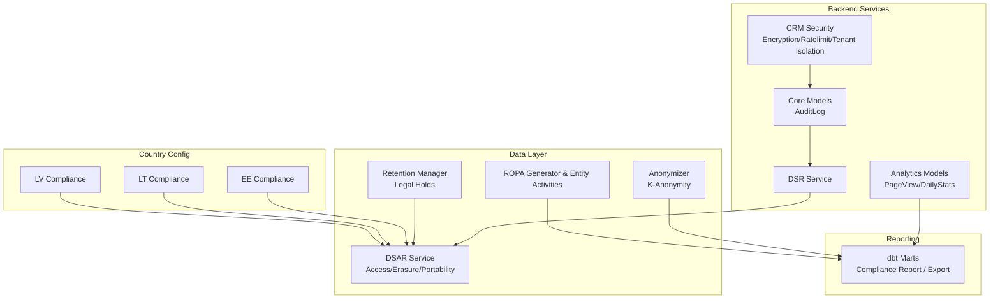

**Diagram sources**
- [models.py:67-227](file://backend/django/apps/core/models.py#L67-L227)
- [dsr_service.py:36-376](file://backend/django/apps/core/dsr_service.py#L36-L376)
- [anonymizer.py:25-180](file://data/src/gdpr/anonymizer.py#L25-L180)
- [retention_manager.py:188-336](file://data/src/gdpr/retention_manager.py#L188-L336)
- [dsar_service.py:59-303](file://data/src/dsar_service.py#L59-L303)
- [entity_ropa.py:39-800](file://data/src/gdpr/entity_ropa.py#L39-L800)
- [ropa_generator.py:19-182](file://data/src/gdpr/ropa_generator.py#L19-L182)
- [models.py:12-174](file://backend/django/apps/analytics/models.py#L12-L174)
- [security.py:38-524](file://backend/django/apps/crm/security.py#L38-L524)
- [compliance.yml:1-241](file://countries/ee/config/compliance.yml#L1-L241)
- [compliance.yml:1-201](file://countries/lt/config/compliance.yml#L1-L201)
- [compliance.yml:1-218](file://countries/lv/config/compliance.yml#L1-L218)
- [gdpr_compliance_report.sql:1-68](file://data/dbt/models/marts/gdpr_compliance_report.sql#L1-L68)
- [data_subject_export.sql:1-55](file://data/dbt/models/marts/data_subject_export.sql#L1-L55)

**Section sources**
- [models.py:67-227](file://backend/django/apps/core/models.py#L67-L227)
- [dsr_service.py:36-376](file://backend/django/apps/core/dsr_service.py#L36-L376)
- [anonymizer.py:25-180](file://data/src/gdpr/anonymizer.py#L25-L180)
- [retention_manager.py:188-336](file://data/src/gdpr/retention_manager.py#L188-L336)
- [dsar_service.py:59-303](file://data/src/dsar_service.py#L59-L303)
- [entity_ropa.py:39-800](file://data/src/gdpr/entity_ropa.py#L39-L800)
- [ropa_generator.py:19-182](file://data/src/gdpr/ropa_generator.py#L19-L182)
- [models.py:12-174](file://backend/django/apps/analytics/models.py#L12-L174)
- [security.py:38-524](file://backend/django/apps/crm/security.py#L38-L524)
- [compliance.yml:1-241](file://countries/ee/config/compliance.yml#L1-L241)
- [compliance.yml:1-201](file://countries/lt/config/compliance.yml#L1-L201)
- [compliance.yml:1-218](file://countries/lv/config/compliance.yml#L1-L218)
- [gdpr_compliance_report.sql:1-68](file://data/dbt/models/marts/gdpr_compliance_report.sql#L1-L68)
- [data_subject_export.sql:1-55](file://data/dbt/models/marts/data_subject_export.sql#L1-L55)

## Core Components
- Audit trail and tamper-evident logging with GDPR DSR actions and consent events.
- Data Subject Request service implementing Articles 15–22 with deadlines and exceptions.
- Consent management with versioning, withdrawal, and validation against country thresholds.
- Anonymization engine with k-anonymity thresholds per country.
- Retention manager with legal hold registry preventing deletion when required.
- ROPA generator and entity-specific processing activities for all supported entity types.
- DSAR orchestration across processors for access and erasure.
- Analytics models enforcing consent gating and tenant isolation.
- Security utilities for PII encryption, input sanitization, rate limiting, and cross-tenant protection.
- Country-specific compliance configuration covering lawful basis, retention, transfers, and breach notifications.
- Reporting marts for compliance metrics and data subject export.

**Section sources**
- [models.py:67-227](file://backend/django/apps/core/models.py#L67-L227)
- [dsr_service.py:36-376](file://backend/django/apps/core/dsr_service.py#L36-L376)
- [gdpr_consent_validation.py:52-211](file://data/src/quality/expectations/gdpr_consent_validation.py#L52-L211)
- [anonymizer.py:25-180](file://data/src/gdpr/anonymizer.py#L25-L180)
- [retention_manager.py:188-336](file://data/src/gdpr/retention_manager.py#L188-L336)
- [entity_ropa.py:39-800](file://data/src/gdpr/entity_ropa.py#L39-L800)
- [dsar_service.py:59-303](file://data/src/dsar_service.py#L59-L303)
- [models.py:12-174](file://backend/django/apps/analytics/models.py#L12-L174)
- [security.py:38-524](file://backend/django/apps/crm/security.py#L38-L524)
- [compliance.yml:1-241](file://countries/ee/config/compliance.yml#L1-L241)
- [compliance.yml:1-201](file://countries/lt/config/compliance.yml#L1-L201)
- [compliance.yml:1-218](file://countries/lv/config/compliance.yml#L1-L218)
- [gdpr_compliance_report.sql:1-68](file://data/dbt/models/marts/gdpr_compliance_report.sql#L1-L68)
- [data_subject_export.sql:1-55](file://data/dbt/models/marts/data_subject_export.sql#L1-L55)

## Architecture Overview
The compliance architecture integrates backend services, data processing pipelines, and reporting layers to enforce GDPR, SOC 2, and ISO 27001 principles.

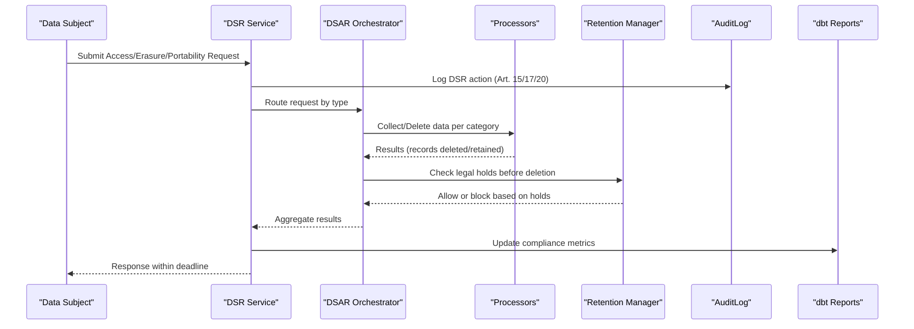

**Diagram sources**
- [dsr_service.py:36-376](file://backend/django/apps/core/dsr_service.py#L36-L376)
- [dsar_service.py:59-303](file://data/src/dsar_service.py#L59-L303)
- [retention_manager.py:188-336](file://data/src/gdpr/retention_manager.py#L188-L336)
- [models.py:67-227](file://backend/django/apps/core/models.py#L67-L227)
- [gdpr_compliance_report.sql:1-68](file://data/dbt/models/marts/gdpr_compliance_report.sql#L1-L68)

**Section sources**
- [dsr_service.py:36-376](file://backend/django/apps/core/dsr_service.py#L36-L376)
- [dsar_service.py:59-303](file://data/src/dsar_service.py#L59-L303)
- [retention_manager.py:188-336](file://data/src/gdpr/retention_manager.py#L188-L336)
- [models.py:67-227](file://backend/django/apps/core/models.py#L67-L227)
- [gdpr_compliance_report.sql:1-68](file://data/dbt/models/marts/gdpr_compliance_report.sql#L1-L68)

## Detailed Component Analysis

### GDPR Lawful Basis and Consent Management
- Consent recording and verification are implemented via audit-backed consent records with versioning and withdrawal tracking.
- Country-specific age thresholds and validity periods are enforced through configuration files.
- Consent validation checks active status, expiry, and withdrawal; batch validation supports compliance audits.

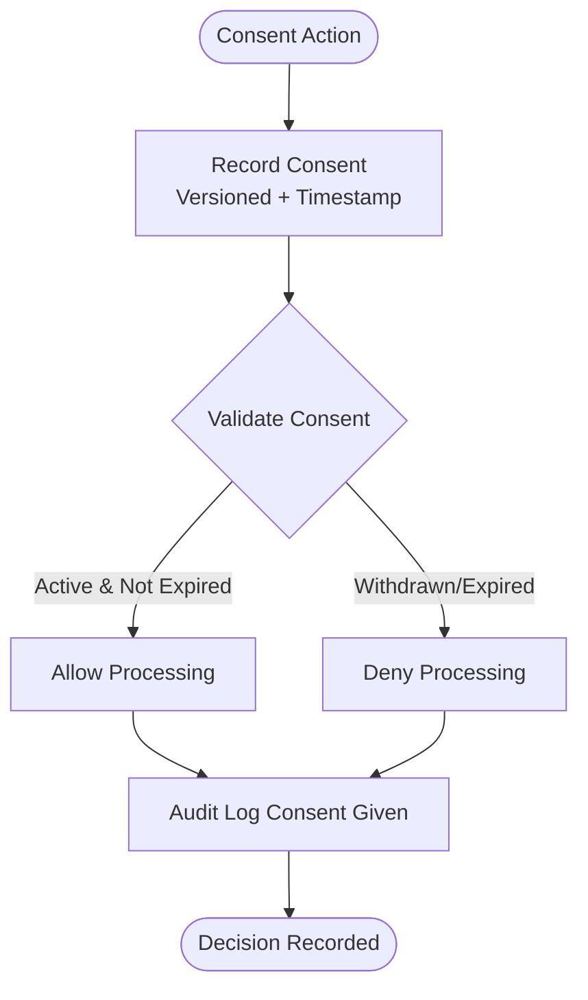

**Diagram sources**
- [dsr_service.py:378-496](file://backend/django/apps/core/dsr_service.py#L378-L496)
- [gdpr_consent_validation.py:52-211](file://data/src/quality/expectations/gdpr_consent_validation.py#L52-L211)
- [compliance.yml:117-147](file://countries/ee/config/compliance.yml#L117-L147)
- [compliance.yml:117-147](file://countries/lt/config/compliance.yml#L117-L147)
- [compliance.yml:117-147](file://countries/lv/config/compliance.yml#L117-L147)

**Section sources**
- [dsr_service.py:378-496](file://backend/django/apps/core/dsr_service.py#L378-L496)
- [gdpr_consent_validation.py:52-211](file://data/src/quality/expectations/gdpr_consent_validation.py#L52-L211)
- [compliance.yml:117-147](file://countries/ee/config/compliance.yml#L117-L147)
- [compliance.yml:117-147](file://countries/lt/config/compliance.yml#L117-L147)
- [compliance.yml:117-147](file://countries/lv/config/compliance.yml#L117-L147)

### Data Subject Rights Automation (Access, Rectification, Erasure, Restriction, Portability, Objection)
- The DSR service orchestrates requests with deadlines, exception handling (legal holds, canonical records), and comprehensive audit logging.
- DSAR service coordinates multi-processor access and erasure, producing machine-readable exports for portability.
- Analytics models gate aggregation on consent flags to ensure only permitted data is processed.

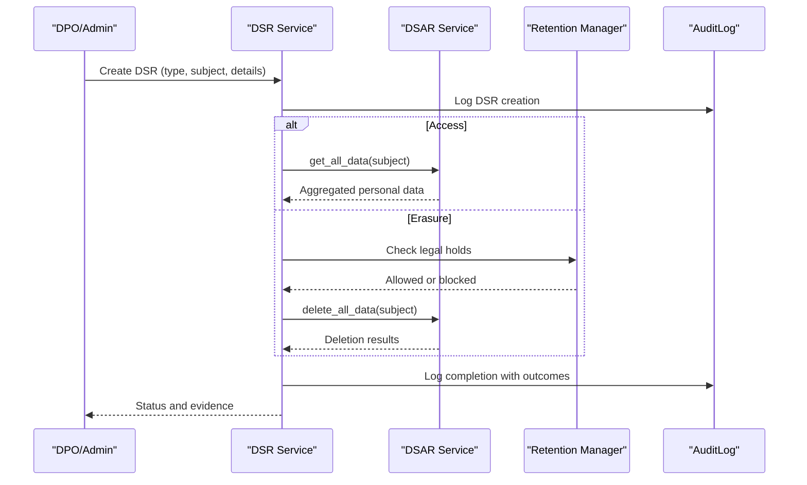

**Diagram sources**
- [dsr_service.py:36-376](file://backend/django/apps/core/dsr_service.py#L36-L376)
- [dsar_service.py:59-303](file://data/src/dsar_service.py#L59-L303)
- [retention_manager.py:188-336](file://data/src/gdpr/retention_manager.py#L188-L336)
- [models.py:67-227](file://backend/django/apps/core/models.py#L67-L227)

**Section sources**
- [dsr_service.py:36-376](file://backend/django/apps/core/dsr_service.py#L36-L376)
- [dsar_service.py:59-303](file://data/src/dsar_service.py#L59-L303)
- [retention_manager.py:188-336](file://data/src/gdpr/retention_manager.py#L188-L336)
- [models.py:67-227](file://backend/django/apps/core/models.py#L67-L227)

### Multi-Country Regulatory Compliance (27 EU Jurisdictions)
- Country configs define lawful basis parameters, special categories handling, retention periods, transfer restrictions, and breach notification timelines.
- Age of consent varies by country (e.g., Estonia 13, Lithuania 14, Latvia 13).
- Canonical records exceptions apply where religious institutions must retain sacramental registers.

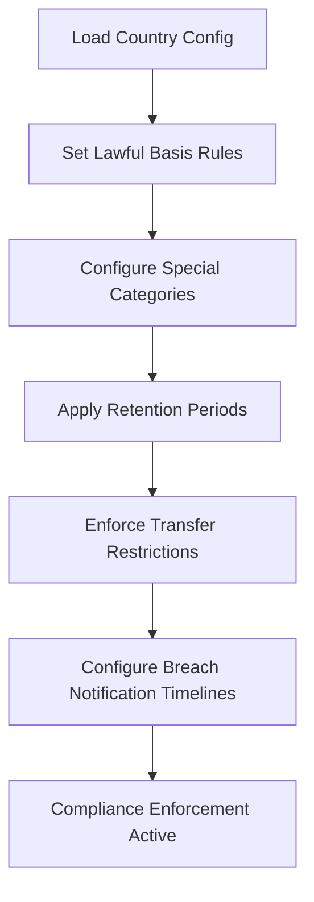

**Diagram sources**
- [compliance.yml:1-241](file://countries/ee/config/compliance.yml#L1-L241)
- [compliance.yml:1-201](file://countries/lt/config/compliance.yml#L1-L201)
- [compliance.yml:1-218](file://countries/lv/config/compliance.yml#L1-L218)

**Section sources**
- [compliance.yml:1-241](file://countries/ee/config/compliance.yml#L1-L241)
- [compliance.yml:1-201](file://countries/lt/config/compliance.yml#L1-L201)
- [compliance.yml:1-218](file://countries/lv/config/compliance.yml#L1-L218)

### SOC 2 Type II and ISO 27001 Controls
- Encryption at rest and in transit via PII encryption utilities and TLS usage.
- Input validation and sanitization prevent injection and XSS.
- Rate limiting protects sensitive endpoints (GDPR export/delete flows).
- Tenant isolation prevents cross-tenant data access.
- Audit trails support continuous monitoring and evidence collection.

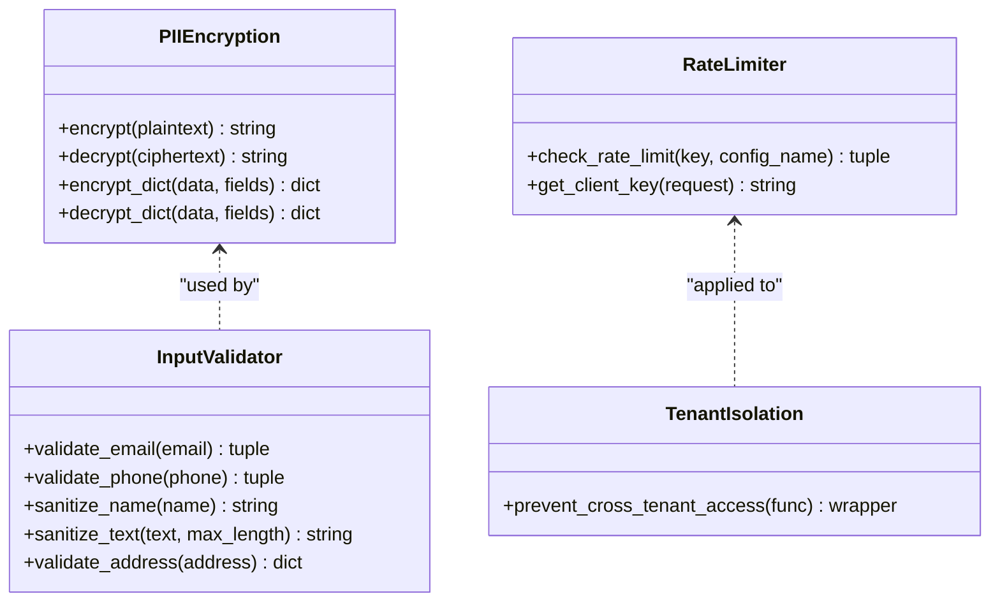

**Diagram sources**
- [security.py:38-524](file://backend/django/apps/crm/security.py#L38-L524)

**Section sources**
- [security.py:38-524](file://backend/django/apps/crm/security.py#L38-L524)

### Vendor Risk Management and Third-Party Assessments
- Entity-specific ROPA documents include third-party recipients and security measures for each processing activity.
- Security model outlines vendor assessment processes, ongoing monitoring, and required DPAs clauses.

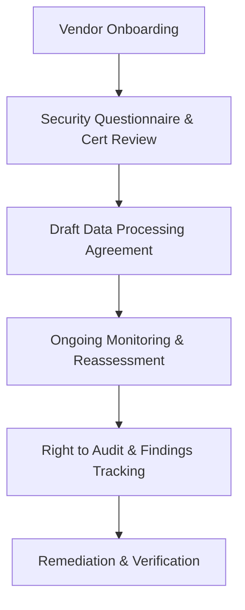

**Diagram sources**
- [entity_ropa.py:39-800](file://data/src/gdpr/entity_ropa.py#L39-L800)
- [GDPR-checklist.md:455-524](file://docs/compliance/GDPR-checklist.md#L455-L524)

**Section sources**
- [entity_ropa.py:39-800](file://data/src/gdpr/entity_ropa.py#L39-L800)
- [GDPR-checklist.md:455-524](file://docs/compliance/GDPR-checklist.md#L455-L524)

### Breach Notification Procedures
- Country configs specify authority notification windows and data subject notification criteria.
- Security model defines internal response flow and notification triggers.

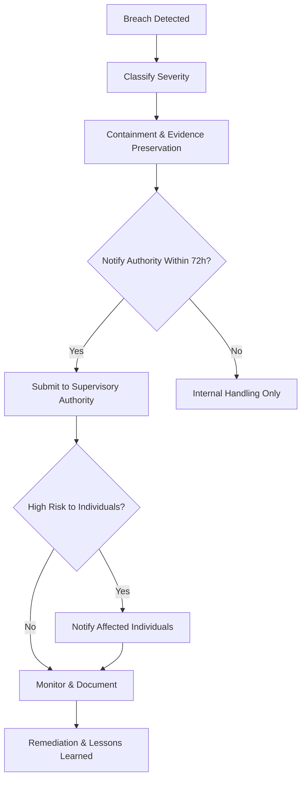

**Diagram sources**
- [compliance.yml:164-170](file://countries/ee/config/compliance.yml#L164-L170)
- [compliance.yml:164-170](file://countries/lt/config/compliance.yml#L164-L170)
- [compliance.yml:164-170](file://countries/lv/config/compliance.yml#L164-L170)
- [GDPR-checklist.md:333-383](file://docs/compliance/GDPR-checklist.md#L333-L383)

**Section sources**
- [compliance.yml:164-170](file://countries/ee/config/compliance.yml#L164-L170)
- [compliance.yml:164-170](file://countries/lt/config/compliance.yml#L164-L170)
- [compliance.yml:164-170](file://countries/lv/config/compliance.yml#L164-L170)
- [GDPR-checklist.md:333-383](file://docs/compliance/GDPR-checklist.md#L333-L383)

### Retention Policies and Legal Holds
- Retention manager enforces retention rules and blocks deletion when legal holds are active.
- Country configs define retention periods for sacramental, financial, and analytics data.

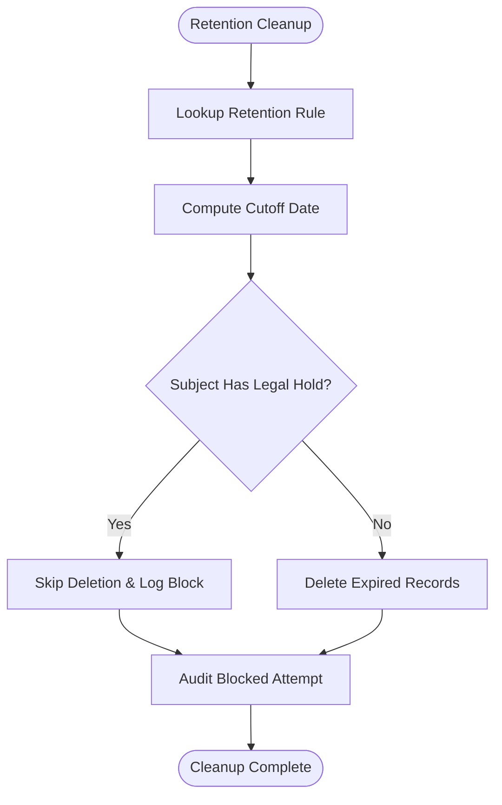

**Diagram sources**
- [retention_manager.py:188-336](file://data/src/gdpr/retention_manager.py#L188-L336)
- [compliance.yml:137-147](file://countries/ee/config/compliance.yml#L137-L147)
- [compliance.yml:137-147](file://countries/lt/config/compliance.yml#L137-L147)
- [compliance.yml:137-147](file://countries/lv/config/compliance.yml#L137-L147)

**Section sources**
- [retention_manager.py:188-336](file://data/src/gdpr/retention_manager.py#L188-L336)
- [compliance.yml:137-147](file://countries/ee/config/compliance.yml#L137-L147)
- [compliance.yml:137-147](file://countries/lt/config/compliance.yml#L137-L147)
- [compliance.yml:137-147](file://countries/lv/config/compliance.yml#L137-L147)

### Privacy by Design and Automated Enforcement
- K-anonymity thresholds vary by country to meet local guidance.
- Analytics models enforce consent gating and tenant isolation to minimize exposure.
- Security decorators and validators enforce least privilege and input safety.

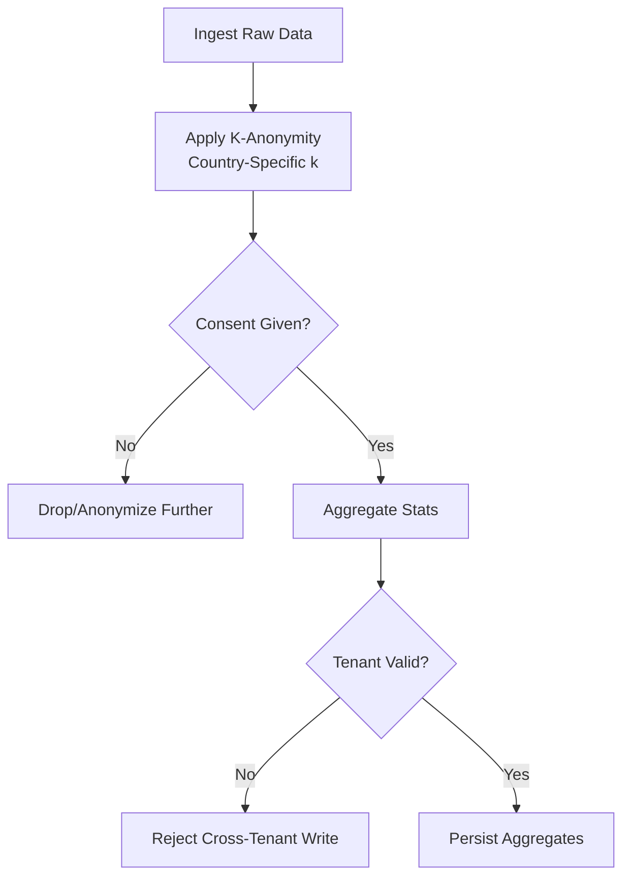

**Diagram sources**
- [anonymizer.py:25-180](file://data/src/gdpr/anonymizer.py#L25-L180)
- [models.py:12-174](file://backend/django/apps/analytics/models.py#L12-L174)
- [security.py:427-524](file://backend/django/apps/crm/security.py#L427-L524)

**Section sources**
- [anonymizer.py:25-180](file://data/src/gdpr/anonymizer.py#L25-L180)
- [models.py:12-174](file://backend/django/apps/analytics/models.py#L12-L174)
- [security.py:427-524](file://backend/django/apps/crm/security.py#L427-L524)

### Reporting Capabilities for Regulatory Submissions
- ROPA generator produces structured records of processing activities per entity type.
- dbt marts compute compliance metrics and prepare data subject export datasets.

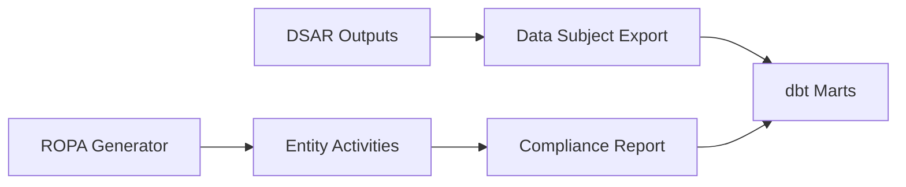

**Diagram sources**
- [ropa_generator.py:19-182](file://data/src/gdpr/ropa_generator.py#L19-L182)
- [entity_ropa.py:39-800](file://data/src/gdpr/entity_ropa.py#L39-L800)
- [gdpr_compliance_report.sql:1-68](file://data/dbt/models/marts/gdpr_compliance_report.sql#L1-L68)
- [data_subject_export.sql:1-55](file://data/dbt/models/marts/data_subject_export.sql#L1-L55)

**Section sources**
- [ropa_generator.py:19-182](file://data/src/gdpr/ropa_generator.py#L19-L182)
- [entity_ropa.py:39-800](file://data/src/gdpr/entity_ropa.py#L39-L800)
- [gdpr_compliance_report.sql:1-68](file://data/dbt/models/marts/gdpr_compliance_report.sql#L1-L68)
- [data_subject_export.sql:1-55](file://data/dbt/models/marts/data_subject_export.sql#L1-L55)

## Dependency Analysis
Key dependencies and coupling:
- DSR service depends on audit logging and organization context; it orchestrates DSAR operations and enforces deadlines.
- DSAR service composes multiple processors and relies on retention checks and audit logging.
- Country configurations influence consent thresholds, retention, and transfer rules applied across services.
- Security utilities underpin encryption, validation, rate limiting, and tenant isolation used throughout.

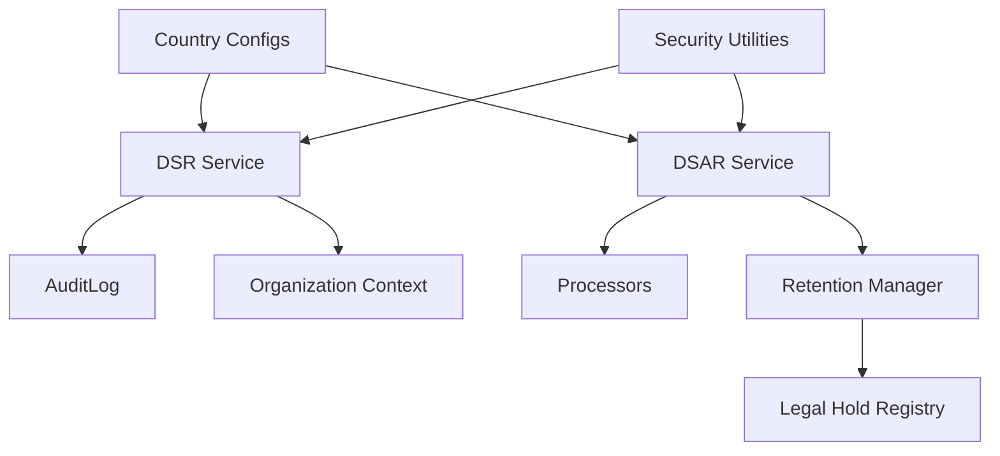

**Diagram sources**
- [dsr_service.py:36-376](file://backend/django/apps/core/dsr_service.py#L36-L376)
- [dsar_service.py:59-303](file://data/src/dsar_service.py#L59-L303)
- [retention_manager.py:188-336](file://data/src/gdpr/retention_manager.py#L188-L336)
- [compliance.yml:1-241](file://countries/ee/config/compliance.yml#L1-L241)
- [security.py:38-524](file://backend/django/apps/crm/security.py#L38-L524)

**Section sources**
- [dsr_service.py:36-376](file://backend/django/apps/core/dsr_service.py#L36-L376)
- [dsar_service.py:59-303](file://data/src/dsar_service.py#L59-L303)
- [retention_manager.py:188-336](file://data/src/gdpr/retention_manager.py#L188-L336)
- [compliance.yml:1-241](file://countries/ee/config/compliance.yml#L1-L241)
- [security.py:38-524](file://backend/django/apps/crm/security.py#L38-L524)

## Performance Considerations
- Batch operations for DSAR and retention cleanup should be scheduled during low-traffic windows.
- K-anonymity grouping can be computationally intensive; pre-index quasi-identifier fields where possible.
- Rate limiting protects high-risk endpoints; tune limits per environment and workload.
- Audit log writes are frequent; consider asynchronous logging and indexing strategies to reduce latency.

[No sources needed since this section provides general guidance]

## Troubleshooting Guide
Common issues and resolutions:
- Cross-tenant access attempts: Ensure tenant context is set and validated; check middleware availability and logs.
- Consent validation failures: Verify consent timestamps, versions, and withdrawal status; re-consent if expired.
- Erasure blocked by legal hold: Identify active holds and consult legal team; lift holds when appropriate.
- DSAR processor errors: Inspect processor logs and retry failed categories; escalate if persistent.

**Section sources**
- [models.py:67-227](file://backend/django/apps/core/models.py#L67-L227)
- [gdpr_consent_validation.py:52-211](file://data/src/quality/expectations/gdpr_consent_validation.py#L52-L211)
- [retention_manager.py:188-336](file://data/src/gdpr/retention_manager.py#L188-L336)
- [dsar_service.py:59-303](file://data/src/dsar_service.py#L59-L303)

## Conclusion
JOL-HUB’s compliance framework integrates robust technical controls, country-specific configurations, and comprehensive reporting to satisfy GDPR, SOC 2 Type II, and ISO 27001 requirements. Automated enforcement, auditability, and clear escalation paths enable scalable, compliant operations across 27 EU jurisdictions while respecting religious institutional obligations and data subject rights.

[No sources needed since this section summarizes without analyzing specific files]

## Appendices
- DPIA process and triggers aligned with platform capabilities and documentation.
- Checklist references for ongoing compliance maintenance and evidence collection.

**Section sources**
- [GDPR-checklist.md:587-633](file://docs/compliance/GDPR-checklist.md#L587-L633)
- [GDPR-checklist.md:712-755](file://docs/compliance/GDPR-checklist.md#L712-L755)