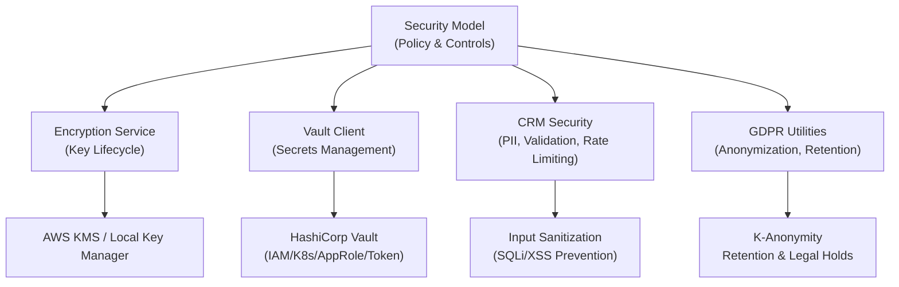
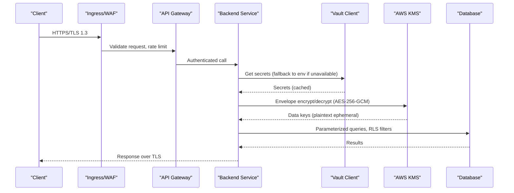
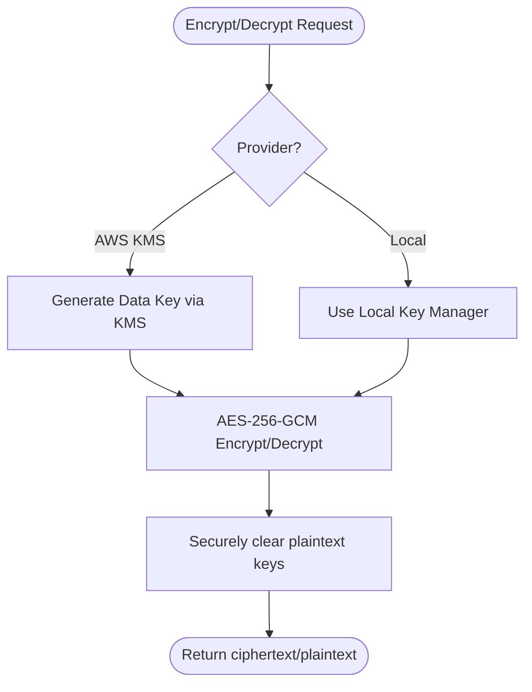
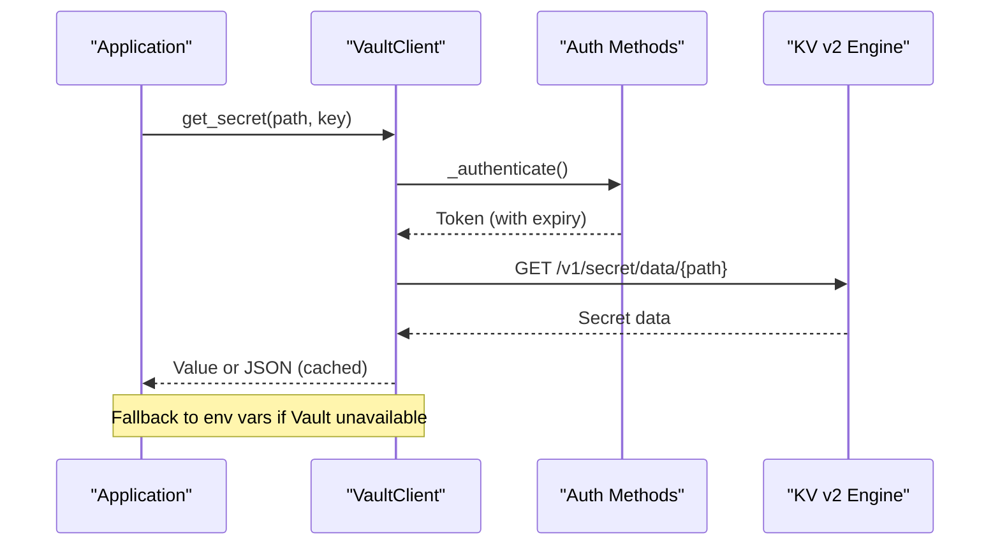
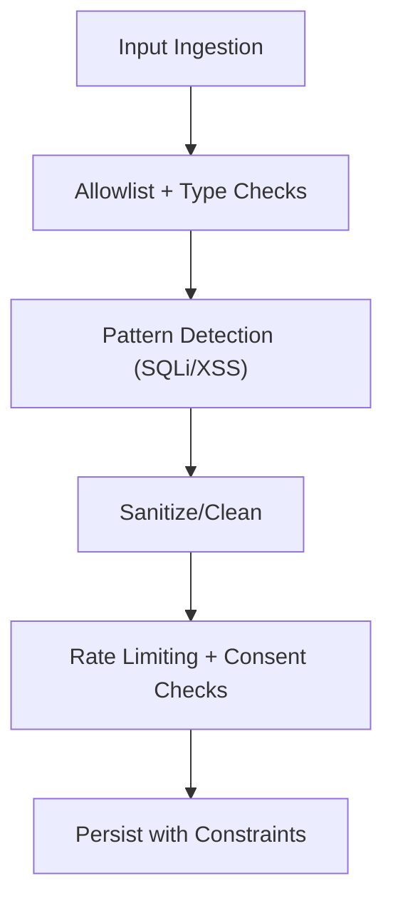
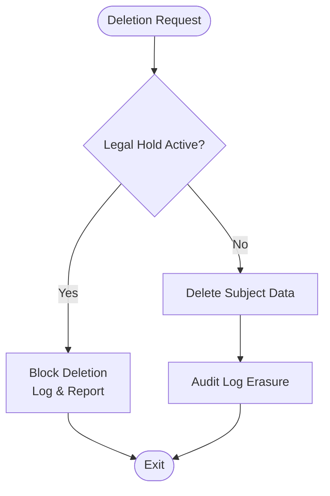
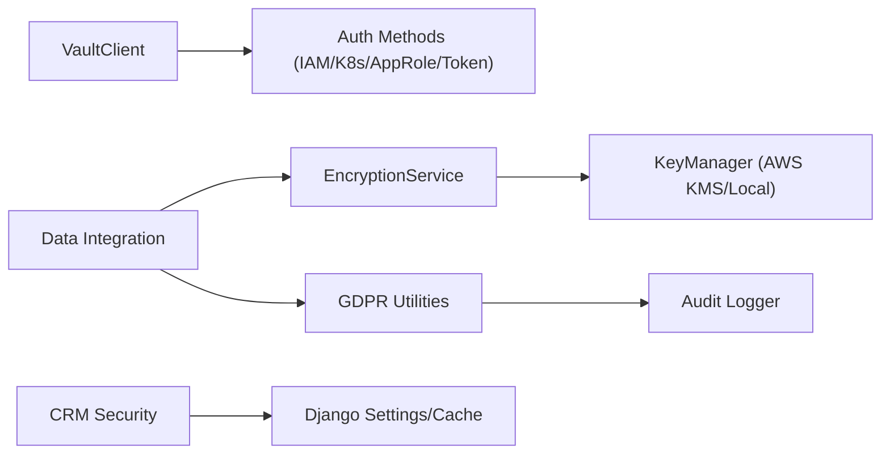

# Data Security

<cite>
**Referenced Files in This Document**
- [security-model.md](file://docs/architecture/security-model.md)
- [encryption.py](file://data/src/encryption.py)
- [vault.py](file://backend/django/apps/core/vault.py)
- [anonymizer.py](file://data/src/gdpr/anonymizer.py)
- [retention_manager.py](file://data/src/gdpr/retention_manager.py)
- [security.py](file://backend/django/apps/crm/security.py)
- [validators.py](file://data/src/validators.py)
- [data_integration.py](file://backend/django/apps/core/data_integration.py)
</cite>

## Table of Contents
1. [Introduction](#introduction)
2. [Project Structure](#project-structure)
3. [Core Components](#core-components)
4. [Architecture Overview](#architecture-overview)
5. [Detailed Component Analysis](#detailed-component-analysis)
6. [Dependency Analysis](#dependency-analysis)
7. [Performance Considerations](#performance-considerations)
8. [Troubleshooting Guide](#troubleshooting-guide)
9. [Conclusion](#conclusion)
10. [Appendices](#appendices)

## Introduction
This document describes the data security posture of the JOL-HUB platform, focusing on encryption at rest and in transit, key management with automatic rotation and separation of duties, data classification and handling requirements, data loss prevention (DLP), input validation and sanitization, database security including row-level security for multi-tenancy, GDPR-compliant anonymization/pseudonymization and automated deletion workflows, sensitive data handling, backup encryption, and secure secret management practices. It synthesizes both architectural guidance and concrete implementation details present in the repository.

## Project Structure
The data security capabilities are implemented across several modules:
- Architecture and policy definitions in the security model documentation
- Encryption services and key lifecycle management in the data module
- Secret management via HashiCorp Vault integration in the backend core app
- GDPR utilities for anonymization and retention/deletion controls
- CRM security controls for PII encryption, input validation, rate limiting, and tenant isolation
- Validators for GDPR-sensitive data detection and quality checks
- Integration layer exposing encryption and GDPR helpers to Django apps

**Diagram sources**
- [security-model.md:144-221](file://docs/architecture/security-model.md#L144-L221)
- [encryption.py:346-521](file://data/src/encryption.py#L346-L521)
- [vault.py:59-126](file://backend/django/apps/core/vault.py#L59-L126)
- [security.py:38-142](file://backend/django/apps/crm/security.py#L38-L142)
- [anonymizer.py:106-180](file://data/src/gdpr/anonymizer.py#L106-L180)
- [retention_manager.py:188-336](file://data/src/gdpr/retention_manager.py#L188-L336)

**Section sources**
- [security-model.md:144-221](file://docs/architecture/security-model.md#L144-L221)

## Core Components
- Encryption service with pluggable key providers (AWS KMS and local), envelope encryption, automatic rotation, key versioning, and re-encryption support
- HashiCorp Vault client supporting IAM, Kubernetes, AppRole, and token authentication with caching and fallback to environment variables
- CRM security controls for field-level PII encryption, input validation/sanitization, rate limiting, audit decorators, consent enforcement, and cross-tenant access prevention
- GDPR anonymization using k-anonymity with country-specific thresholds and retention management with legal holds and automated deletion workflows
- Validators that detect sensitive data patterns and enforce GDPR compliance rules during ingestion

**Section sources**
- [encryption.py:27-101](file://data/src/encryption.py#L27-L101)
- [encryption.py:104-243](file://data/src/encryption.py#L104-L243)
- [encryption.py:346-521](file://data/src/encryption.py#L346-L521)
- [vault.py:59-126](file://backend/django/apps/core/vault.py#L59-L126)
- [vault.py:293-355](file://backend/django/apps/core/vault.py#L293-L355)
- [security.py:38-142](file://backend/django/apps/crm/security.py#L38-L142)
- [security.py:148-312](file://backend/django/apps/crm/security.py#L148-L312)
- [security.py:327-421](file://backend/django/apps/crm/security.py#L327-L421)
- [security.py:427-523](file://backend/django/apps/crm/security.py#L427-L523)
- [anonymizer.py:25-83](file://data/src/gdpr/anonymizer.py#L25-L83)
- [anonymizer.py:106-180](file://data/src/gdpr/anonymizer.py#L106-L180)
- [retention_manager.py:188-336](file://data/src/gdpr/retention_manager.py#L188-L336)
- [validators.py:75-199](file://data/src/validators.py#L75-L199)

## Architecture Overview
JOL-HUB implements a defense-in-depth strategy with layered controls:
- Network perimeter protection, internal segmentation, and service mesh encryption
- Application-layer protections including API security, input validation, session hardening
- Data-layer controls covering encryption at rest/in transit, key management, database security, and masking/tokenization
- Identity and access management with MFA, SSO, PAM, and least privilege
- Monitoring, incident response, and continuous improvement processes
- GDPR privacy-by-design features including consent tracking, DSAR automation, and retention policies

**Diagram sources**
- [security-model.md:144-221](file://docs/architecture/security-model.md#L144-L221)
- [vault.py:293-355](file://backend/django/apps/core/vault.py#L293-L355)
- [encryption.py:177-243](file://data/src/encryption.py#L177-L243)

## Detailed Component Analysis

### Encryption at Rest and Key Management
- Pluggable key providers: AWS KMS (production) and local (development)
- Envelope encryption: KMS generates AES-256 data keys; plaintext keys used briefly then cleared
- Automatic rotation: configurable rotation days, key versioning, old keys retained for decryption
- Re-encryption support for migrating data to new keys
- Local key store with restrictive permissions for development

**Diagram sources**
- [encryption.py:146-243](file://data/src/encryption.py#L146-L243)
- [encryption.py:346-521](file://data/src/encryption.py#L346-L521)

**Section sources**
- [encryption.py:27-101](file://data/src/encryption.py#L27-L101)
- [encryption.py:104-243](file://data/src/encryption.py#L104-L243)
- [encryption.py:346-521](file://data/src/encryption.py#L346-L521)

### Secret Management with HashiCorp Vault
- Multiple authentication methods: IAM role (AWS), Kubernetes service account, AppRole, token (dev)
- Secret retrieval with caching and fallback to environment variables
- Secure token renewal and error handling
- No hardcoded secrets; centralized storage with auditability

**Diagram sources**
- [vault.py:59-126](file://backend/django/apps/core/vault.py#L59-L126)
- [vault.py:293-355](file://backend/django/apps/core/vault.py#L293-L355)

**Section sources**
- [vault.py:59-126](file://backend/django/apps/core/vault.py#L59-L126)
- [vault.py:293-355](file://backend/django/apps/core/vault.py#L293-L355)

### Data Classification and Handling Requirements
- Public: no special handling
- Internal: employee-only access, encrypted in transit
- Confidential: PII and business metrics, encrypted in transit and at rest, access logged and audited
- Highly Confidential: payment/health/credentials, enhanced field-level encryption, strict need-to-know access, additional audits

**Section sources**
- [security-model.md:168-188](file://docs/architecture/security-model.md#L168-L188)

### Data Loss Prevention (DLP) and Input Validation/Sanitization
- DLP controls include email/upload scanning, watermarking, clipboard/download restrictions, and detection rules using regex and ML-based classification
- Input validation layers: client-side, API gateway, backend service, database constraints
- Techniques: allowlist validation, type/range checks, file upload restrictions, HTML sanitization
- CRM security provides robust input sanitization against SQL injection and XSS, plus email/phone/address validation

**Diagram sources**
- [security-model.md:117-128](file://docs/architecture/security-model.md#L117-L128)
- [security.py:148-312](file://backend/django/apps/crm/security.py#L148-L312)
- [security.py:327-421](file://backend/django/apps/crm/security.py#L327-L421)

**Section sources**
- [security-model.md:117-128](file://docs/architecture/security-model.md#L117-L128)
- [security-model.md:190-203](file://docs/architecture/security-model.md#L190-L203)
- [security.py:148-312](file://backend/django/apps/crm/security.py#L148-L312)
- [security.py:327-421](file://backend/django/apps/crm/security.py#L327-L421)
- [validators.py:75-199](file://data/src/validators.py#L75-L199)

### Database Security and Multi-Tenancy
- Separate database users per application/service with least privilege
- Row-Level Security (RLS) for multi-tenant data isolation
- Column-level encryption for sensitive fields
- Auditing: query logging for sensitive tables, anomaly detection, bulk export alerts, quarterly access reviews
- Masking and tokenization for non-production and analytics use cases

**Section sources**
- [security-model.md:204-221](file://docs/architecture/security-model.md#L204-L221)

### GDPR Compliance: Anonymization, Pseudonymization, Automated Deletion
- K-anonymity with country-specific thresholds (e.g., stricter values for certain countries)
- Anonymization utilities for direct identifiers and count rounding
- Retention manager enforcing storage limitation and right to erasure with legal hold checks
- Automated deletion workflows with audit logging and subject-specific exclusions

**Diagram sources**
- [retention_manager.py:188-336](file://data/src/gdpr/retention_manager.py#L188-L336)

**Section sources**
- [anonymizer.py:25-83](file://data/src/gdpr/anonymizer.py#L25-L83)
- [anonymizer.py:106-180](file://data/src/gdpr/anonymizer.py#L106-L180)
- [retention_manager.py:188-336](file://data/src/gdpr/retention_manager.py#L188-L336)
- [data_integration.py:75-128](file://backend/django/apps/core/data_integration.py#L75-L128)
- [data_integration.py:339-380](file://backend/django/apps/core/data_integration.py#L339-L380)

### Sensitive Data Handling and Field-Level Encryption
- CRM PIIEncryption class performs field-level encryption using Fernet derived from application secret
- Encrypted dictionary helpers for selective field processing
- Frontend PII encryption utilities using AES-GCM for client-side protection of sensitive form data

**Section sources**
- [security.py:38-142](file://backend/django/apps/crm/security.py#L38-L142)
- [frontend packages UI PII encryption:128-166](file://frontend/packages/ui/src/lib/pii-encryption.ts#L128-L166)

### Backup Encryption and Secure Secret Practices
- Backups encrypted with AES-256 and separate key management; immutable storage and geographic separation
- Secrets managed centrally in Vault with automatic rotation and audit logging; no secrets in code/config
- Environment variable fallback for resilience in development or Vault unavailability

**Section sources**
- [security-model.md:545-556](file://docs/architecture/security-model.md#L545-L556)
- [vault.py:293-355](file://backend/django/apps/core/vault.py#L293-L355)

## Dependency Analysis
Key dependencies and relationships:
- EncryptionService depends on KeyManager implementations (AWS KMS or Local)
- VaultClient depends on authentication backends (IAM, Kubernetes, AppRole, Token)
- CRM security integrates with Django settings/cache and optional audit models
- GDPR utilities integrate with audit logging and retention rules
- Data integration layer exposes encryption and GDPR helpers to Django apps

**Diagram sources**
- [encryption.py:346-521](file://data/src/encryption.py#L346-L521)
- [vault.py:59-126](file://backend/django/apps/core/vault.py#L59-L126)
- [security.py:38-142](file://backend/django/apps/crm/security.py#L38-L142)
- [retention_manager.py:188-336](file://data/src/gdpr/retention_manager.py#L188-L336)
- [data_integration.py:339-380](file://backend/django/apps/core/data_integration.py#L339-L380)

**Section sources**
- [encryption.py:346-521](file://data/src/encryption.py#L346-L521)
- [vault.py:59-126](file://backend/django/apps/core/vault.py#L59-L126)
- [security.py:38-142](file://backend/django/apps/crm/security.py#L38-L142)
- [retention_manager.py:188-336](file://data/src/gdpr/retention_manager.py#L188-L336)
- [data_integration.py:339-380](file://backend/django/apps/core/data_integration.py#L339-L380)

## Performance Considerations
- Envelope encryption minimizes KMS calls by caching data keys and using fast symmetric operations
- Vault secret caching reduces latency and network overhead
- Rate limiting protects APIs and prevents abuse while maintaining responsiveness
- Input validation and sanitization occur early to reduce downstream processing costs
- K-anonymity grouping is efficient for moderate datasets; consider batching for large volumes

[No sources needed since this section provides general guidance]

## Troubleshooting Guide
Common issues and mitigations:
- Vault authentication failures: ensure correct role configuration and credentials; check IAM/K8s tokens; verify AppRole IDs
- Missing secrets: confirm paths and mount points; rely on environment variable fallback for dev
- Encryption errors: validate provider configuration (KMS key ID, region); ensure keys are initialized and not expired
- GDPR deletion blocked: check legal holds and lift when appropriate; review audit logs for reasons
- Input validation warnings: sanitize inputs and adjust allowlists; monitor for suspicious patterns

**Section sources**
- [vault.py:293-355](file://backend/django/apps/core/vault.py#L293-L355)
- [encryption.py:346-521](file://data/src/encryption.py#L346-L521)
- [retention_manager.py:188-336](file://data/src/gdpr/retention_manager.py#L188-L336)
- [security.py:148-312](file://backend/django/apps/crm/security.py#L148-L312)

## Conclusion
JOL-HUB’s data security architecture combines strong encryption, robust key management, centralized secret handling, comprehensive input validation, and GDPR-compliant data lifecycle controls. The modular design enables flexible deployment across environments while maintaining high assurance for sensitive data. Continuous monitoring, auditing, and automated compliance workflows further strengthen the platform’s security posture.

[No sources needed since this section summarizes without analyzing specific files]

## Appendices
- Encryption algorithms and modes: AES-256-GCM for authenticated encryption; Fernet for local symmetric encryption
- Key rotation cadence: configurable rotation days with automatic checks and versioning
- DLP detection strategies: regex-based pattern matching and ML-assisted classification
- Database isolation: RLS and column-level encryption for multi-tenant scenarios
- GDPR rights automation: DSAR flows, retention rules, and legal hold enforcement

[No sources needed since this section provides general guidance]